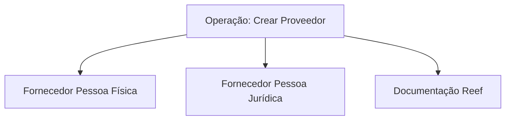

# Operação Criar Provedor — Documentação Reef

## 1. Metadados do Documento
- **Arquivo de Origem:** Não identificado
- **Tipo de Documento:** Documentação operacional / especificação funcional resumida
- **Domínio / Sistema:** Reef / Mapfre
- **Público-Alvo:** Operação, desenvolvedores, arquitetura e negócio
- **Data/Versão Identificada:** Não identificada

---

## 2. Resumo Executivo & Contexto de Negócio

O conteúdo apresenta a operação **“Crear Proveedor”**, relacionada à criação de fornecedores no contexto da documentação Reef. O escopo explicitamente indicado envolve fornecedores classificados como **Pessoas Físicas** ou **Pessoas Jurídicas**.

O documento referencia o ambiente ou repositório de documentação denominado **Reef**, além dos termos **Mapfredocument**, **Zeus**, **Cloud**, **APIs**, **Componentes**, **Arquiteturas** e **Soluções**, exibidos como itens de navegação ou categorização. Não há descrição suficiente para afirmar relações técnicas ou funcionais entre esses elementos.

A origem documental aparenta estar classificada como aprovada, pois o texto contém o campo **Lifecycle** com o valor **Approved Source**. O proprietário identificado é `user:agonzalez_mapfre.com`.

Não há detalhamento sobre telas, etapas operacionais, regras de validação, integrações, contratos de API, campos cadastrais, métodos HTTP, URLs, ambientes técnicos ou tratamento de erros.

---

## 3. Arquitetura, Componentes & Tecnologias Envolvidas

O texto cita os seguintes elementos:

| Elemento | Classificação inferida do texto | Detalhamento disponível |
| :--- | :--- | :--- |
| Reef | Documentação / domínio ou sistema | Associado à documentação da operação de criação de fornecedor |
| Mapfredocument | Termo ou sistema citado | Sem detalhamento funcional ou técnico |
| Zeus | Item de navegação ou domínio citado | Sem detalhamento funcional ou técnico |
| APIs | Categoria de navegação | Não são identificadas APIs específicas |
| Componentes | Categoria de navegação | Não são identificados componentes específicos |
| Cloud | Categoria de navegação | Não são identificados serviços, provedores ou ambientes |
| Soluções | Categoria de navegação | Sem descrição |
| Arquiteturas | Categoria de navegação | Sem descrição |



**Nota de Análise:** O diagrama representa somente a relação explícita entre a operação de criação de fornecedor, as categorias de fornecedor e a documentação Reef. O documento não descreve integrações, camadas de arquitetura, serviços, bancos de dados ou fluxos técnicos adicionais.

---

## 4. Regras de Negócio, Especificações Funcionais & Processos

A única regra funcional explicitamente apresentada é:

1. A operação **“Crear Proveedor”** considera a criação de fornecedores classificados como:
   - **Pessoa Física**;
   - **Pessoa Jurídica**.

Não foram identificadas no conteúdo regras adicionais sobre:

- critérios para classificar um fornecedor como Pessoa Física ou Pessoa Jurídica;
- dados obrigatórios para o cadastro;
- validações de identificação fiscal;
- aprovação, rejeição ou atualização de fornecedores;
- usuários, perfis ou permissões;
- integrações com serviços internos ou externos;
- campos, formulários ou contratos de API;
- estados do processo;
- tratamento de exceções.

**Nota de Análise:** O documento lista o escopo da operação de criação de fornecedor, porém não detalha o procedimento operacional, os métodos HTTP, os contratos JSON, as regras de validação nem os requisitos de persistência.

---

## 5. Tabelas de Parâmetros, Ambientes e Estruturas de Dados

| Item / Parâmetro | Descrição / Função | Tipo / Valores / Formato | Ambiente / Observações |
| :--- | :--- | :--- | :--- |
| Operação | Operação identificada no conteúdo | `Crear Proveedor` | Relacionada à criação de fornecedores |
| Tipo de fornecedor | Categoria de fornecedor tratada pela operação | Pessoa Física | Sem critérios ou campos detalhados |
| Tipo de fornecedor | Categoria de fornecedor tratada pela operação | Pessoa Jurídica | Sem critérios ou campos detalhados |
| Documentação | Referência documental principal | Reef | Aparece como “Documentation / DOCUMENTACIÓN Reef” |
| Proprietário | Identificação de proprietário do conteúdo | `user:agonzalez_mapfre.com` | Campo `Owner` |
| Ciclo de vida | Situação documental exibida | `Approved Source` | Campo `Lifecycle` |
| Idioma | Idioma mostrado na navegação | `ES` | O conteúdo contém termos em espanhol |
| Navegação | Itens disponíveis no menu exibido | Buscar, Inicio, Soluciones, Arquitecturas, APIs, Componentes, Cloud, Documentación, Zeus, Reef, Ayuda | Não representam, necessariamente, componentes da solução |

---

## 6. Bateria de Perguntas & Respostas para RAG (FAQ Sintético)

### P1: Qual operação é apresentada no documento?
**R:** O documento apresenta a operação **“Crear Proveedor”**, isto é, a criação de fornecedor.

### P2: Quais tipos de fornecedor são mencionados para a operação “Crear Proveedor”?
**R:** A operação menciona fornecedores classificados como **Pessoas Físicas** e **Pessoas Jurídicas**.

### P3: O documento explica o passo a passo para criar um fornecedor?
**R:** Não. O conteúdo apenas informa que a operação trata da criação de fornecedores Pessoa Física ou Pessoa Jurídica; não descreve etapas, telas, campos ou validações.

### P4: A documentação identifica o sistema ou domínio associado à operação?
**R:** Sim. O conteúdo referencia a **DOCUMENTACIÓN Reef** e menciona Reef como a referência documental associada à operação.

### P5: Quem é o proprietário identificado da documentação?
**R:** O campo `Owner` identifica `user:agonzalez_mapfre.com` como proprietário do conteúdo.

### P6: Qual é o status de ciclo de vida indicado para o documento?
**R:** O campo `Lifecycle` apresenta o valor **Approved Source**.

### P7: O documento especifica APIs, métodos HTTP ou contratos JSON para a criação de fornecedor?
**R:** Não. Embora “APIs” apareça na navegação, o documento não identifica nenhuma API concreta, método HTTP, endpoint, payload ou contrato JSON.

### P8: O conteúdo informa quais campos devem ser preenchidos para cadastrar uma Pessoa Física?
**R:** Não. Não há campos cadastrais, atributos obrigatórios ou regras de validação específicas para Pessoa Física.

### P9: O conteúdo informa quais campos devem ser preenchidos para cadastrar uma Pessoa Jurídica?
**R:** Não. Não há campos cadastrais, atributos obrigatórios ou regras de validação específicas para Pessoa Jurídica.

### P10: Zeus, Cloud e Mapfredocument são componentes técnicos detalhados no documento?
**R:** Não. Esses termos são citados no conteúdo, principalmente no contexto de navegação ou referência, mas não possuem descrição técnica ou funcional adicional.

---

## 7. Glossário de Termos, Siglas & Conceitos-Chave

- **Crear Proveedor:** Operação de criação de fornecedor.
- **Fornecedor / Proveedor:** Entidade cujo processo de criação é mencionado no documento.
- **Pessoa Física:** Categoria de fornecedor explicitamente incluída na operação.
- **Pessoa Jurídica:** Categoria de fornecedor explicitamente incluída na operação.
- **Reef:** Nome associado à documentação apresentada.
- **Mapfredocument:** Termo citado no conteúdo sem definição adicional.
- **Zeus:** Termo citado na navegação sem definição adicional.
- **Lifecycle:** Campo que indica o ciclo de vida do conteúdo.
- **Approved Source:** Valor apresentado para o campo `Lifecycle`.
- **Owner:** Campo que identifica o proprietário do conteúdo.

---

## 8. Notas Críticas, Riscos & Limitações

- O conteúdo disponível é extremamente resumido e não descreve o processo operacional de criação de fornecedor.
- Não há requisitos de dados, regras de validação, critérios de elegibilidade ou campos obrigatórios para Pessoa Física e Pessoa Jurídica.
- Não há evidência de endpoints, métodos HTTP, APIs, integrações, contratos JSON, autenticação ou autorização.
- Não há ambientes, URLs, servidores, rotas de log, versões ou dependências técnicas identificadas.
- Os termos Reef, Zeus, Cloud e Mapfredocument são citados sem detalhamento suficiente para estabelecer relações arquiteturais.
- O status **Approved Source** é apresentado no texto, mas não há explicação sobre seu significado operacional ou de governança documental.

---

## 9. Conteúdo Bruto Estruturado (Referência Fiel)

```text
--- [PÁGINA 1 DE 1] ---

OPERACIÓN CREAR Proveedor
Elementos que intervienen en la Creación de los Proveedores como Personas Físicas o Personas Jurídicas.
Documentation / DOCUMENTACIÓN Reef
DOCUMENTACIÓN Reef
Mapfredocument
DOCUMENTACIÓN Reef
Owner
user:agonzalez_mapfre.com
Lifecycle
Approved Source
 / 
 VL
Buscar Inicio Soluciones Arquitecturas APIs Componentes Cloud Documentación Zeus Reef Ayuda
ES
```
