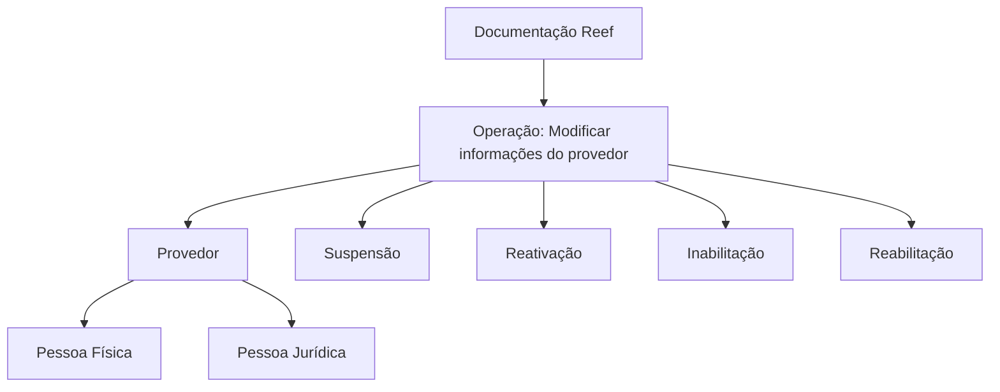

# Operação de Modificação de Informações de Provedores no Reef

## 1. Metadados do Documento
- **Arquivo de Origem:** `Não identificado no conteúdo fornecido`
- **Tipo de Documento:** Procedimento
- **Domínio / Sistema:** Reef / Mapfre
- **Público-Alvo:** Operação, Negócio e equipes responsáveis pela gestão de provedores
- **Data/Versão Identificada:** Não identificada

---

## 2. Resumo Executivo & Contexto de Negócio

O conteúdo descreve a operação de modificação de informações específicas de um provedor no contexto da documentação Reef. A operação abrange provedores classificados como Pessoas Físicas ou Pessoas Jurídicas.

O escopo funcional explicitamente informado inclui situações de mudança de status do provedor. A operação deve contemplar suspensão, reativação, inabilitação e reabilitação.

O documento está associado ao ambiente documental Reef e apresenta referências institucionais a Mapfre, Mapfredocument, Zeus e “VL”. Também identifica o proprietário do conteúdo como `user:agonzalez_mapfre.com` e o ciclo de vida como “Approved Source”.

Não há detalhamento sobre telas, campos editáveis, critérios de autorização, APIs, integrações, contratos de dados, métodos HTTP, persistência ou procedimentos operacionais passo a passo.

---

## 3. Arquitetura, Componentes & Tecnologias Envolvidas

Os elementos citados no conteúdo são:

- **Reef:** contexto documental e de operação associado à modificação de provedores.
- **Mapfre / Mapfredocument:** referências corporativas presentes na documentação.
- **Zeus:** item disponível na navegação documental.
- **Provedor:** entidade de negócio sujeita à modificação de informações e de status.
- **Pessoa Física:** possível classificação de provedor.
- **Pessoa Jurídica:** possível classificação de provedor.
- **Owner:** `user:agonzalez_mapfre.com`.
- **Lifecycle:** `Approved Source`.
- **VL:** referência exibida junto ao estado de ciclo de vida.



> **Nota de Análise:** O conteúdo não descreve integrações técnicas, microsserviços, bancos de dados, APIs, protocolos, URLs, ambientes de execução ou tecnologias de implementação.

---

## 4. Regras de Negócio, Especificações Funcionais & Processos

1. A operação é denominada **“Modificar Información específica del Proveedor”**.
2. A operação trata de elementos que intervêm ou podem intervir na modificação de provedores.
3. O escopo considera provedores classificados como:
   - Pessoas Físicas;
   - Pessoas Jurídicas.
4. A operação deve contemplar os seguintes estados ou ações sobre o provedor:
   - Suspensão;
   - Reativação;
   - Inabilitação;
   - Reabilitação.
5. O conteúdo não especifica:
   - quais informações específicas do provedor podem ser modificadas;
   - condições de entrada para cada alteração de status;
   - transições permitidas entre suspensão, reativação, inabilitação e reabilitação;
   - responsáveis pela aprovação;
   - perfis de acesso;
   - evidências ou documentos exigidos;
   - regras de auditoria;
   - mensagens de erro ou validações.

---

## 5. Tabelas de Parâmetros, Ambientes e Estruturas de Dados

| Item / Parâmetro | Descrição / Função | Tipo / Valores / Formato | Ambiente / Observações |
| :--- | :--- | :--- | :--- |
| Operação | Modificação de informações específicas do provedor | Operação funcional | Associada à documentação Reef |
| Entidade principal | Provedor | Entidade de negócio | Pode ser Pessoa Física ou Pessoa Jurídica |
| Classificação de provedor | Categoria do provedor tratada pela operação | Pessoa Física; Pessoa Jurídica | Ambas estão explicitamente no escopo |
| Status/Ação | Situação que a operação deve contemplar | Suspensão | Não há critérios detalhados |
| Status/Ação | Situação que a operação deve contemplar | Reativação | Não há critérios detalhados |
| Status/Ação | Situação que a operação deve contemplar | Inabilitação | Não há critérios detalhados |
| Status/Ação | Situação que a operação deve contemplar | Reabilitação | Não há critérios detalhados |
| Documentação | Repositório ou contexto documental citado | Reef | Exibido como “DOCUMENTACIÓN Reef” |
| Organização/referência | Referência corporativa apresentada | Mapfre | O conteúdo também cita “Mapfredocument” |
| Owner | Proprietário indicado no documento | `user:agonzalez_mapfre.com` | Valor literal apresentado |
| Lifecycle | Estado de ciclo de vida do conteúdo | Approved Source | Apresentado com a referência “VL” |
| Navegação documental | Seções visíveis na interface | Buscar, Inicio, Soluciones, Arquitecturas, APIs, Componentes, Cloud, Documentación, Zeus, Reef, Ayuda | Não constitui especificação funcional da operação |

---

## 6. Bateria de Perguntas & Respostas para RAG (FAQ Sintético)

### P1: Qual é o objetivo da operação descrita na documentação Reef?
**R:** A operação tem como objetivo modificar informações específicas de um provedor. O conteúdo não detalha quais campos ou atributos do provedor podem ser alterados.

### P2: Que tipos de provedor estão no escopo da operação de modificação?
**R:** A operação contempla provedores classificados como Pessoas Físicas e Pessoas Jurídicas.

### P3: A operação de modificação contempla suspensão de provedores?
**R:** Sim. O conteúdo afirma que a operação deve contemplar a suspensão do provedor.

### P4: A operação permite reativar um provedor?
**R:** Sim. A reativação do provedor é uma das situações que a operação deve contemplar.

### P5: A inabilitação de fornecedores ou provedores faz parte do escopo?
**R:** Sim. O documento informa que a operação deve considerar a inabilitação do provedor.

### P6: A reabilitação de um provedor está prevista?
**R:** Sim. A reabilitação do provedor é explicitamente citada como parte do escopo da operação.

### P7: O documento define quais dados específicos do provedor podem ser modificados?
**R:** Não. O conteúdo menciona “informação específica do provedor”, mas não identifica campos, formatos, regras de validação ou estruturas de dados.

### P8: O documento especifica APIs ou métodos HTTP para modificar provedores?
**R:** Não. Não há métodos HTTP, endpoints, contratos JSON, autenticação, URLs ou integrações técnicas descritos no conteúdo fornecido.

### P9: Quem é indicado como proprietário da documentação?
**R:** O proprietário exibido é `user:agonzalez_mapfre.com`.

### P10: Qual é o ciclo de vida indicado para a documentação?
**R:** O ciclo de vida apresentado é “Approved Source”, acompanhado da referência “VL”.

### P11: A documentação define o fluxo entre suspensão, reativação, inabilitação e reabilitação?
**R:** Não. O documento apenas determina que essas situações devem ser contempladas, sem estabelecer ordem, pré-condições, transições de estado ou responsáveis.

---

## 7. Glossário de Termos, Siglas & Conceitos-Chave

- **Reef:** contexto documental e sistema ou domínio associado à operação descrita.
- **Provedor / Proveedor:** entidade de negócio cujas informações e status podem ser modificados.
- **Pessoa Física:** classificação de provedor explicitamente incluída no escopo.
- **Pessoa Jurídica:** classificação de provedor explicitamente incluída no escopo.
- **Suspensão:** situação de provedor que deve ser contemplada pela operação.
- **Reativação:** situação de provedor que deve ser contemplada pela operação.
- **Inabilitação:** situação de provedor que deve ser contemplada pela operação.
- **Reabilitação:** situação de provedor que deve ser contemplada pela operação.
- **Mapfre:** referência corporativa exibida no conteúdo.
- **Mapfredocument:** referência documental exibida no conteúdo.
- **Owner:** campo que identifica o proprietário do conteúdo.
- **Lifecycle:** campo que identifica o ciclo de vida do conteúdo.
- **Approved Source:** valor do campo Lifecycle apresentado no documento.
- **VL:** referência exibida junto ao Lifecycle; o significado não é detalhado.

---

## 8. Notas Críticas, Riscos & Limitações

- **Nota de Análise:** O texto fornecido é resumido e não detalha quais informações específicas do provedor podem ser modificadas.
- **Nota de Análise:** Não há regras para determinar quando suspensão, reativação, inabilitação ou reabilitação devem ser aplicadas.
- **Nota de Análise:** Não há matriz de permissões, perfis responsáveis, workflow de aprovação ou trilha de auditoria.
- **Nota de Análise:** O documento não contém especificações de API, métodos HTTP, contratos JSON, banco de dados, URLs, portas, tecnologias ou ambientes.
- **Risco operacional:** A ausência de critérios de transição entre os estados de provedor pode gerar interpretações divergentes durante a implementação ou operação.
- **Risco de recuperação RAG:** O conteúdo contém texto extraído com caracteres corrompidos, como `especíca` e `Modicación`; a indexação deve preservar a transcrição original e, quando aplicável, associá-la à forma normalizada para melhorar a busca.

---

## 9. Conteúdo Bruto Estruturado (Referência Fiel)

```text
--- [PÁGINA 1 DE 1] ---

OPERACIÓN MODIFICAR Información especíca del Proveedor
Elementos que intervienen o pueden intervenir en la Modicación de los Proveedores, sean estos Personas Físicas o Personas Jurídicas.
Debe contemplar tanto la Suspensión como la Reactivación, Inhabilitación y Rehabilitación del Proveedor.
Documentation / DOCUMENTACIÓN Reef
DOCUMENTACIÓN Reef
Mapfredocument
DOCUMENTACIÓN Reef
Owner
user:agonzalez_mapfre.com
Lifecycle
Approved Source
 / 
 VL
Buscar Inicio Soluciones Arquitecturas APIs Componentes Cloud Documentación Zeus Reef Ayuda
ES
```
