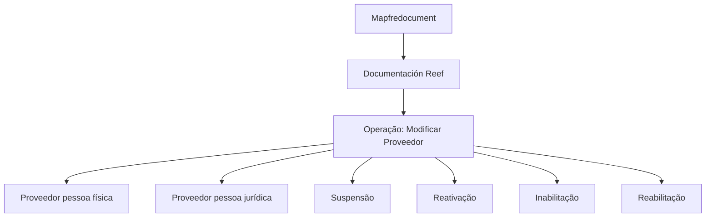

# Operação de Modificação de Provedor no Ecossistema Reef

## 1. Metadados do Documento
- **Arquivo de Origem:** Não identificado no conteúdo extraído
- **Tipo de Documento:** Procedimento
- **Domínio / Sistema:** Reef / Mapfre
- **Público-Alvo:** Operação, Negócio e equipes responsáveis pela gestão de provedores
- **Data/Versão Identificada:** Não identificada

---

## 2. Resumo Executivo & Contexto de Negócio

O conteúdo apresenta a operação **“Modificar Proveedor”**, relacionada à alteração cadastral ou operacional de provedores no contexto da documentação Reef e Mapfre. O termo apresentado no documento é “Proveedor”, em espanhol, e não há uma tradução formal ou definição adicional disponibilizada no material bruto.

A operação deve abranger provedores que sejam **pessoas físicas** ou **pessoas jurídicas**. O documento determina explicitamente que a modificação deve considerar os estados de **suspensão**, **reativação**, **inabilitação** e **reabilitação** do provedor.

O material aparenta estar publicado ou catalogado em uma área de documentação denominada **Reef**, com referências a “Mapfredocument”, “Documentación Reef”, “Soluciones”, “Arquitecturas”, “APIs”, “Componentes”, “Cloud” e “Zeus”. Contudo, o trecho não apresenta detalhes técnicos sobre integração, APIs, telas, contratos, permissões, regras de transição de estados ou responsabilidades operacionais.

A fonte está identificada como aprovada (“Approved Source”) e possui o proprietário textual `user:agonzalez_mapfre.com`. Não foram identificadas datas, versões, ambientes, endpoints, métodos HTTP, estruturas de dados ou critérios formais de validação.

---

## 3. Arquitetura, Componentes & Tecnologias Envolvidas

Os seguintes elementos são citados no conteúdo:

| Componente / Termo | Papel identificado no conteúdo |
| :--- | :--- |
| Reef | Área, sistema ou repositório de documentação mencionado como “DOCUMENTACIÓN Reef”. |
| Mapfre | Contexto corporativo associado ao termo “Mapfredocument”. |
| Proveedor | Entidade sujeita à operação de modificação; pode ser pessoa física ou pessoa jurídica. |
| Zeus | Item disponível na navegação da documentação; sua função não é detalhada. |
| Soluciones | Seção de navegação mencionada. |
| Arquitecturas | Seção de navegação mencionada. |
| APIs | Seção de navegação mencionada. |
| Componentes | Seção de navegação mencionada. |
| Cloud | Seção de navegação mencionada. |
| Owner `user:agonzalez_mapfre.com` | Proprietário textual identificado para o conteúdo. |
| Lifecycle `Approved Source` | Estado de ciclo de vida apresentado no conteúdo. |
| `VL` | Sigla ou identificação exibida no cabeçalho; sem definição adicional. |

O único fluxo funcional sustentado pelo texto é a abrangência da operação de modificação de provedor para diferentes situações cadastrais ou operacionais.



> **Nota de Análise:** O documento não detalha a arquitetura de software, serviços, métodos HTTP, eventos, bancos de dados, contratos JSON, ambientes, autenticação ou integrações necessários para executar a operação “Modificar Proveedor”.

---

## 4. Regras de Negócio, Especificações Funcionais & Processos

### 4.1 Escopo funcional identificado

A operação apresentada é:

- **OPERACIÓN MODIFICAR Proveedor**

O documento estabelece que a modificação de provedores deve considerar:

1. Provedores que sejam **pessoas físicas**.
2. Provedores que sejam **pessoas jurídicas**.
3. A condição de **suspensão** do provedor.
4. A condição de **reativação** do provedor.
5. A condição de **inabilitação** do provedor.
6. A condição de **reabilitação** do provedor.

### 4.2 Regra de abrangência

A única regra funcional explicitamente declarada é:

> A modificação de provedores, sejam pessoas físicas ou pessoas jurídicas, deve contemplar suspensão, reativação, inabilitação e reabilitação.

### 4.3 Detalhamento não disponível

O conteúdo não especifica:

- Quais atributos do provedor podem ser modificados.
- Quais são os critérios para suspender um provedor.
- Quais são os critérios para reativar um provedor.
- Quais são os critérios para inabilitar um provedor.
- Quais são os critérios para reabilitar um provedor.
- Se suspensão e inabilitação são estados distintos, mutuamente exclusivos ou combináveis.
- Quais transições entre estados são permitidas.
- Quais usuários, perfis ou áreas podem realizar cada operação.
- Quais validações devem ocorrer antes da alteração.
- Quais sistemas devem ser atualizados após uma modificação.
- Quais evidências, auditorias, aprovações ou notificações são obrigatórias.

> **Nota de Análise:** O texto declara o escopo de estados que a operação deve contemplar, mas não fornece regras de elegibilidade, fluxos de aprovação, campos obrigatórios, validações ou comportamento sistêmico para cada estado.

---

## 5. Tabelas de Parâmetros, Ambientes e Estruturas de Dados

| Item / Parâmetro | Descrição / Função | Tipo / Valores / Formato | Ambiente / Observações |
| :--- | :--- | :--- | :--- |
| Operação | Modificação de provedor | `MODIFICAR Proveedor` | Não são informados sistema transacional, tela ou API. |
| Entidade | Provedor sujeito à alteração | Pessoa física ou pessoa jurídica | O documento não informa identificadores, atributos ou estrutura cadastral. |
| Estado operacional | Situação que deve ser contemplada pela operação | Suspensão | Sem critérios de entrada, saída ou consequências detalhados. |
| Estado operacional | Situação que deve ser contemplada pela operação | Reativação | Sem critérios de entrada, saída ou consequências detalhados. |
| Estado operacional | Situação que deve ser contemplada pela operação | Inabilitação | Sem critérios de entrada, saída ou consequências detalhados. |
| Estado operacional | Situação que deve ser contemplada pela operação | Reabilitação | Sem critérios de entrada, saída ou consequências detalhados. |
| Repositório / contexto documental | Referência de documentação | Reef / DOCUMENTACIÓN Reef | Repetido no conteúdo bruto. |
| Contexto corporativo | Referência textual | Mapfredocument | O significado funcional não é detalhado. |
| Proprietário | Responsável textual associado ao documento | `user:agonzalez_mapfre.com` | Apresentado na seção “Owner”. |
| Ciclo de vida | Situação documental | `Approved Source` | Apresentado na seção “Lifecycle”. |
| Identificador adicional | Texto exibido no cabeçalho | `VL` | Sem definição no material. |
| Idioma de navegação | Idioma apresentado na interface documental | `ES` | Compatível com termos em espanhol presentes no conteúdo. |
| Seções de navegação | Áreas apresentadas na interface | Buscar, Inicio, Soluciones, Arquitecturas, APIs, Componentes, Cloud, Documentación, Zeus, Reef, Ayuda | Não há descrição funcional dessas seções. |

---

## 6. Bateria de Perguntas & Respostas para RAG (FAQ Sintético)

### P1: Qual é a operação principal descrita no documento?
**R:** A operação principal é **“MODIFICAR Proveedor”**, destinada à modificação de provedores no contexto da documentação Reef.

### P2: A operação de modificação de provedor se aplica a pessoas físicas?
**R:** Sim. O conteúdo declara que a modificação de provedores deve considerar provedores que sejam **pessoas físicas**.

### P3: A operação de modificação de provedor se aplica a pessoas jurídicas?
**R:** Sim. O conteúdo declara que a modificação de provedores deve considerar provedores que sejam **pessoas jurídicas**.

### P4: Quais situações de estado do provedor devem ser contempladas pela operação?
**R:** A operação deve contemplar **suspensão**, **reativação**, **inabilitação** e **reabilitação** do provedor.

### P5: O documento informa quais campos cadastrais do provedor podem ser modificados?
**R:** Não. O conteúdo somente apresenta a operação de modificação e os estados que devem ser contemplados; não detalha campos, atributos, formatos ou regras de alteração cadastral.

### P6: O documento especifica como suspender um provedor?
**R:** Não. O documento afirma que a operação deve contemplar a suspensão, mas não apresenta critérios, etapas, permissões, validações, impactos ou integrações relacionadas à suspensão.

### P7: O documento diferencia suspensão de inabilitação?
**R:** O conteúdo lista suspensão e inabilitação como situações que devem ser contempladas pela operação, mas não define suas diferenças conceituais, operacionais ou técnicas.

### P8: O documento define regras para reativação ou reabilitação de provedores?
**R:** Não. Reativação e reabilitação são citadas explicitamente, porém o material não descreve os critérios, responsáveis, fluxos de aprovação ou efeitos dessas ações.

### P9: Qual sistema ou área documental está associada à operação “Modificar Proveedor”?
**R:** A operação está associada à **DOCUMENTACIÓN Reef**. O conteúdo também menciona “Mapfredocument”, sem explicar a relação técnica ou funcional entre Reef e Mapfredocument.

### P10: Quem aparece como proprietário do documento?
**R:** O campo “Owner” apresenta o valor `user:agonzalez_mapfre.com`.

### P11: Qual é o status de ciclo de vida identificado no documento?
**R:** O campo “Lifecycle” apresenta o status **Approved Source**.

### P12: Existem APIs, URLs, métodos HTTP ou contratos de integração documentados para a operação?
**R:** Não. Embora a navegação mencione uma seção “APIs”, o conteúdo extraído não fornece URLs, endpoints, métodos HTTP, autenticação, payloads, códigos de retorno ou contratos de integração para “Modificar Proveedor”.

---

## 7. Glossário de Termos, Siglas & Conceitos-Chave

- **Proveedor:** Termo em espanhol para provedor; entidade sujeita à operação de modificação. O documento informa que pode ser pessoa física ou pessoa jurídica.
- **Modificar Proveedor:** Operação de modificação de um provedor.
- **Suspensión:** Estado ou ação de suspensão do provedor, citado sem detalhamento operacional.
- **Reactivación:** Estado ou ação de reativação do provedor, citado sem detalhamento operacional.
- **Inhabilitación:** Estado ou ação de inabilitação do provedor, citado sem detalhamento operacional.
- **Rehabilitación:** Estado ou ação de reabilitação do provedor, citado sem detalhamento operacional.
- **Reef:** Nome citado como contexto ou área de documentação, por meio de “DOCUMENTACIÓN Reef”.
- **Mapfredocument:** Termo textual associado ao contexto documental; não possui definição adicional no trecho.
- **Zeus:** Item citado na navegação da documentação; não possui definição adicional no trecho.
- **Lifecycle:** Campo de ciclo de vida documental.
- **Approved Source:** Valor apresentado para o campo “Lifecycle”.
- **Owner:** Campo que identifica o proprietário do conteúdo.
- **VL:** Sigla ou identificador exibido no cabeçalho; significado não identificado.
- **ES:** Indicador de idioma espanhol exibido na navegação.

---

## 8. Notas Críticas, Riscos & Limitações

- O conteúdo é extremamente resumido e não contém especificação técnica suficiente para implementação, integração ou operação detalhada da funcionalidade.
- Não foram identificados métodos HTTP, APIs, URLs, contratos de mensagem, esquemas de dados, credenciais, perfis de acesso, logs, monitoramento ou mecanismos de auditoria.
- Não há definição das diferenças entre **suspensão**, **reativação**, **inabilitação** e **reabilitação**.
- Não há fluxo de transição de estado formal para provedores.
- Não há critérios para distinguir provedores pessoa física de provedores pessoa jurídica no processo de modificação.
- Não há informação sobre persistência de dados, sistemas dependentes, integrações downstream ou notificações.
- O termo `VL` não está definido no conteúdo extraído.
- O conteúdo menciona Reef, Mapfredocument e Zeus, mas não descreve a relação entre esses termos.
- Não foram identificadas data, versão, autor formal, histórico de alterações ou aprovação operacional além do campo textual `Approved Source`.

---

## 9. Conteúdo Bruto Estruturado (Referência Fiel)

```text
--- [PÁGINA 1 DE 1] ---

OPERACIÓN MODIFICAR Proveedor
Elementos que intervienen o pueden intervenir en la Modicación de los Proveedores, sean estos Personas Físicas o Personas Jurídicas.
Debe contemplar tanto la Suspensión como la Reactivación, Inhabilitación y Rehabilitación del Proveedor.
Documentation / DOCUMENTACIÓN Reef
DOCUMENTACIÓN Reef
Mapfredocument
DOCUMENTACIÓN Reef
Owner
user:agonzalez_mapfre.com
Lifecycle
Approved Source
 / 
 VL
Buscar Inicio Soluciones Arquitecturas APIs Componentes Cloud Documentación Zeus Reef Ayuda
ES
```
