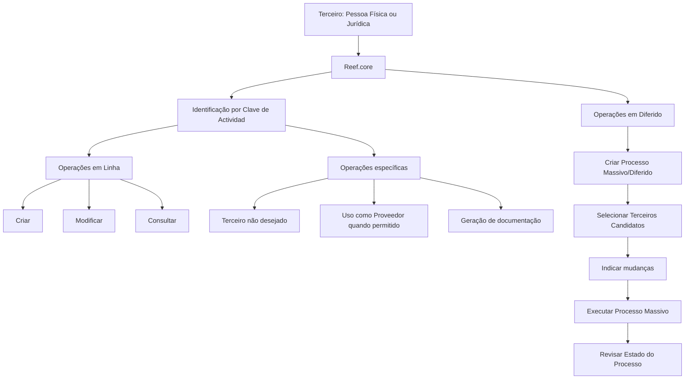
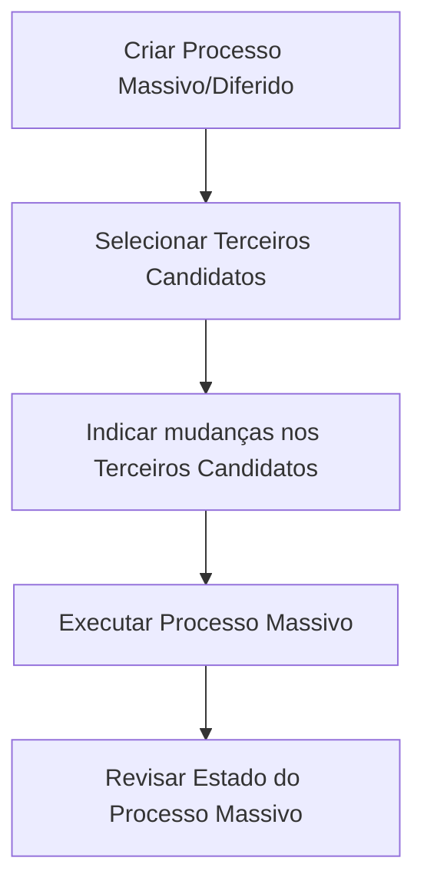

# Operações com Terceiros por Código de Atividade no Reef.core

## 1. Metadados do Documento
- **Arquivo de Origem:** Não identificado no conteúdo fornecido
- **Tipo de Documento:** Especificação Técnica / Manual Funcional
- **Domínio / Sistema:** Reef.core — gestão de Terceiros no contexto MAPFRE
- **Público-Alvo:** Desenvolvedores, Arquitetos, Operação e Negócio
- **Data/Versão Identificada:** Não identificada

---

## 2. Resumo Executivo & Contexto de Negócio

O documento descreve as operações disponíveis no sistema **Reef.core** para gestão de **Terceiros**, classificados por uma **Clave de Actividad** (Código de Atividade). No documento, os termos “Personas Físicas”, “Personas Jurídicas” e “Terceros” são tratados como sinônimos e podem ser utilizados indistintamente na documentação funcional.

A classificação por Código de Atividade determina a natureza do terceiro e organiza operações de criação, alteração e consulta. Entre as categorias explicitamente tratadas estão Asegurados/Clientes, Agentes, Terceiros Genéricos, Supervisores, Tramitadores, Aseguradoras, Reaseguradoras, Brokers de Seguros, empregados de agentes, companhias locais do Grupo MAPFRE, entidades bancárias, escritórios bancários e níveis da estrutura comercial.

O Reef.core também prevê operações específicas para fornecedores, condicionadas ao fato de o Código de Atividade do terceiro permitir seu uso ou emprego como Proveedor. Além das operações online, o documento prevê operações em diferido para processos massivos, incluindo criação do processo, seleção de candidatos, indicação de alterações, execução e revisão do estado.

O documento menciona a geração de documentação de terceiros como uma operação disponível. Entretanto, não fornece detalhes sobre formatos documentais, critérios de elegibilidade, contratos de integração, permissões, métodos HTTP, estruturas JSON, URLs, ambientes ou mecanismos de autenticação.

---

## 3. Arquitetura, Componentes & Tecnologias Envolvidas

O conteúdo apresenta o **Reef.core** como sistema responsável por operações sobre Terceiros. O mecanismo funcional central identificado é a associação de cada terceiro a uma **Clave de Actividad**, que determina a categoria de negócio e as operações possíveis.

Componentes e capacidades identificados:

| Componente / Conceito | Função identificada |
| :--- | :--- |
| **Reef.core** | Sistema no qual são executadas operações relacionadas a Terceiros. |
| **Terceiros** | Denominação utilizada para Pessoas Físicas e Pessoas Jurídicas. |
| **Clave de Actividad** | Código que identifica a categoria de atividade do Terceiro. |
| **Operações em Linha** | Operações de criação, modificação e consulta realizadas diretamente no sistema. |
| **Operações em Diferido** | Operações para processos massivos envolvendo terceiros candidatos. |
| **Processo Massivo** | Processo diferido que permite selecionar terceiros, indicar alterações, executar o processo e revisar seu estado. |
| **Documentação de Terceiro** | Capacidade de gerar documentação associada a um terceiro. |
| **Mapfredocument** | Termo exibido na área de documentação do conteúdo extraído. Não há detalhamento funcional adicional. |
| **DOCUMENTACIÓN Reef** | Referência à documentação do Reef. Não há detalhamento técnico adicional. |



> **Nota de Análise:** O documento não descreve arquitetura técnica de infraestrutura, APIs, microsserviços, bancos de dados, protocolos, contratos JSON, autenticação, URLs ou ambientes de execução.

---

## 4. Regras de Negócio, Especificações Funcionais & Processos

### 4.1 Conceito de Terceiros

- Pessoas Físicas e Pessoas Jurídicas são consideradas termos sinônimos de **Terceiros**.
- A redação e o detalhamento dos documentos podem utilizar indistintamente os termos Pessoas Físicas, Pessoas Jurídicas e Terceiros.
- As operações disponíveis no Reef.core são organizadas conforme o Código de Atividade do Terceiro.

### 4.2 Operações em Linha

As seguintes operações são explicitamente mencionadas no documento:

| Categoria de Terceiro | Código de Atividade | Operações em Linha |
| :--- | :---: | :--- |
| Asegurados/Clientes | 1 | Criar Asegurado; criar Asegurado partindo da informação de outro Terceiro; modificar Asegurado; consultar Asegurado. |
| Agentes | 2 | Criar Agente; criar Agente como Terceiro não desejado; modificar Agente; modificar Agente como Terceiro não desejado; consultar Agente. |
| Terceiros Genéricos | Diversos códigos profissionais | Criar Terceiro Genérico; criar Terceiro Genérico como Terceiro não desejado; modificar Terceiro Genérico; modificar Terceiro Genérico como Terceiro não desejado; consultar Terceiro Genérico. |
| Supervisores de Siniestros | 8 | Criar Supervisor; modificar Supervisor; consultar Supervisor. |
| Tramitadores de Siniestros | 9 | Criar Tramitador; modificar Tramitador; consultar Tramitador. |
| Compañías Aseguradoras | 13 | Criar Compañía Aseguradora; modificar Compañía Aseguradora; consultar Compañía Aseguradora. |
| Compañías Reaseguradoras | 14 | Criar Compañía Reaseguradora; modificar Compañía Reaseguradora; consultar Compañía Reaseguradora. |
| Brokers de Seguros | 16 | Criar Broker de Seguros; modificar Broker de Seguros; consultar Broker de Seguros. |
| Empleados de Agencias/Agentes | 37 | Criar Empleado de Agente; modificar Empleado de Agente; consultar Empleado de Agente. |
| Compañías del Grupo MAPFRE Local | 39 | Criar Compañía; modificar Compañía; consultar Compañía. |
| Entidades Bancarias | 40 | Criar Entidad Bancaria; modificar Entidad Bancaria; consultar Entidad Bancaria. |
| Oficinas/Sucursales Bancarias | 41 | Criar Oficina Bancaria; modificar Oficina Bancaria; consultar Oficina Bancaria. |
| Primeiro nível da estrutura comercial | 42 | Criar Primer Nivel Estructura Comercial; modificar Primer Nivel Estructura Comercial; consultar Primer Nivel Estructura Comercial. |
| Segundo nível da estrutura comercial | 43 | Criar Segundo Nivel de la Estructura Comercial; modificar Segundo Nivel de la Estructura Comercial; consultar Segundo Nivel de la Estructura Comercial. |
| Terceiro nível da estrutura comercial | 44 | Criar Tercer Nivel de la Estructura Comercial; modificar Tercer Nivel de la Estructura Comercial; consultar Tercer Nivel de la Estructura Comercial. |
| Proveedores | Condicionado ao Código de Atividade | Criar Proveedor; modificar Proveedor; consultar Proveedor. |

### 4.3 Terceiro não desejado

O documento explicita operações associadas ao estado ou classificação de **Tercero no deseado** para:

- Agentes.
- Terceiros Genéricos.

> **Nota de Análise:** O documento não define o significado funcional de “Tercero no deseado”, os critérios para sua classificação, suas consequências operacionais ou eventuais regras de bloqueio.

### 4.4 Regra para Proveedores

A utilização de um Terceiro como **Proveedor** depende de uma condição explícita:

> O Código de Atividade do Terceiro deve permitir seu uso ou emprego como Proveedor.

O documento não apresenta a matriz completa que determina quais Códigos de Atividade permitem ou impedem o uso como Proveedor.

### 4.5 Operações em Diferido

O fluxo de operação massiva/diferida é apresentado com as seguintes etapas:

1. Criar Processo Massivo/Diferido.
2. Selecionar Terceiros Candidatos.
3. Indicar mudanças nos Terceiros Candidatos.
4. Executar Processo Massivo.
5. Revisar o estado do Processo Massivo.



### 4.6 Geração de Documentação

O documento identifica a operação:

- **Generar Documentación Tercero**

> **Nota de Análise:** Não há detalhamento sobre tipos documentais, modelos, conteúdo gerado, condições de geração, repositório de destino ou integração com Mapfredocument.

---

## 5. Tabelas de Parâmetros, Ambientes e Estruturas de Dados

### 5.1 Códigos de Atividade identificados

| Item / Parâmetro | Descrição / Função | Tipo / Valores / Formato | Ambiente / Observações |
| :--- | :--- | :--- | :--- |
| Clave de Actividad 1 | Asegurados/Clientes | Código numérico | Permite operações sobre Asegurado/Cliente. |
| Clave de Actividad 2 | Agentes | Código numérico | Inclui operações como Terceiro não desejado. |
| Clave de Actividad 3 | Peritos | Código numérico | Listado como Terceiro Genérico. |
| Clave de Actividad 4 | Inspectores | Código numérico | Listado como Terceiro Genérico. |
| Clave de Actividad 5 | Médicos | Código numérico | Listado como Terceiro Genérico. |
| Clave de Actividad 6 | Abogados | Código numérico | Listado como Terceiro Genérico. |
| Clave de Actividad 7 | Procuradores | Código numérico | Listado como Terceiro Genérico. |
| Clave de Actividad 8 | Supervisores | Código numérico | Supervisores de Siniestros. |
| Clave de Actividad 9 | Tramitadores | Código numérico | Tramitadores de Siniestros. |
| Clave de Actividad 10 | Proveedores | Código numérico | Categoria listada como Terceiro Genérico. |
| Clave de Actividad 11 | Ejecutivos de Cta. | Código numérico | Categoria listada como Terceiro Genérico. |
| Clave de Actividad 12 | Cobradores | Código numérico | Categoria listada como Terceiro Genérico. |
| Clave de Actividad 13 | Aseguradoras | Código numérico | Compañías Aseguradoras. |
| Clave de Actividad 14 | Reaseguradoras | Código numérico | Compañías Reaseguradoras. |
| Clave de Actividad 15 | Empleados | Código numérico | Categoria listada como Terceiro Genérico. |
| Clave de Actividad 16 | Brokers de Seguros | Código numérico | Brokers de Seguros. |
| Clave de Actividad 17 | Talleres | Código numérico | Categoria listada como Terceiro Genérico. |
| Clave de Actividad 18 | Clínicas | Código numérico | Categoria listada como Terceiro Genérico. |
| Clave de Actividad 19 | Juzgados | Código numérico | Categoria listada como Terceiro Genérico. |
| Clave de Actividad 20 | Cristaleros | Código numérico | Categoria listada como Terceiro Genérico. |
| Clave de Actividad 21 | Cerrajeros | Código numérico | Categoria listada como Terceiro Genérico. |
| Clave de Actividad 22 | Plomeros | Código numérico | Categoria listada como Terceiro Genérico. |
| Clave de Actividad 23 | Electricistas | Código numérico | Categoria listada como Terceiro Genérico. |
| Clave de Actividad 24 | Grúas | Código numérico | Categoria listada como Terceiro Genérico. |
| Clave de Actividad 25 | Investigadores | Código numérico | Categoria listada como Terceiro Genérico. |
| Clave de Actividad 26 | Recuperadores | Código numérico | Categoria listada como Terceiro Genérico. |
| Clave de Actividad 27 | Ajustadores | Código numérico | Categoria listada como Terceiro Genérico. |
| Clave de Actividad 28 | Herreros | Código numérico | Categoria listada como Terceiro Genérico. |
| Clave de Actividad 29 | Tribunales | Código numérico | Categoria listada como Terceiro Genérico. |
| Clave de Actividad 30 | Terceros Seg. MOTOR | Código numérico | Categoria listada como Terceiro Genérico. |
| Clave de Actividad 31 | Terceros Seg. SALUD | Código numérico | Categoria listada como Terceiro Genérico. |
| Clave de Actividad 32 | Terceros Seg. PATRIMONIALES | Código numérico | Categoria listada como Terceiro Genérico. |
| Clave de Actividad 33 | Depósitos | Código numérico | Categoria listada como Terceiro Genérico. |
| Clave de Actividad 34 | Notarías | Código numérico | Categoria listada como Terceiro Genérico. |
| Clave de Actividad 35 | Centros de Peritación | Código numérico | Categoria listada como Terceiro Genérico. |
| Clave de Actividad 36 | Comisarías | Código numérico | Categoria listada como Terceiro Genérico. |
| Clave de Actividad 38 | Filial | Código numérico | Categoria listada como Terceiro Genérico. |
| Clave de Actividad 39 | Compañías | Código numérico | Compañías do Grupo MAPFRE Local. |
| Clave de Actividad 40 | Entidades Bancarias | Código numérico | Entidades Bancarias. |
| Clave de Actividad 41 | Oficinas Bancarias | Código numérico | Oficinas/Sucursales Bancarias. |
| Clave de Actividad 42 | Primer Nivel de la Estructura Comercial | Código numérico | Nível estrutural da estrutura comercial. |
| Clave de Actividad 43 | Segundo Nivel de la Estructura Comercial | Código numérico | Sub Central da estrutura comercial. |
| Clave de Actividad 44 | Tercer Nivel de la Estructura Comercial | Código numérico | Oficinas da estrutura comercial. |
| Clave de Actividad 45 | Representantes Legales | Código numérico | Categoria listada como Terceiro Genérico. |

### 5.2 Dados de ambiente, logs e URLs

| Item / Parâmetro | Descrição / Função | Tipo / Valores / Formato | Ambiente / Observações |
| :--- | :--- | :--- | :--- |
| URLs de ambientes | Não informado | Não informado | O documento não apresenta URLs. |
| Servidores | Não informado | Não informado | O documento não apresenta servidores. |
| Portas de rede | Não informado | Não informado | O documento não apresenta portas. |
| Rotas de logs | Não informado | Não informado | O documento não apresenta caminhos ou variáveis de log. |
| APIs / Métodos HTTP | Não informado | Não informado | O documento não apresenta contratos de API. |
| Owner | `user:agonzalez_mapfre.com` | Identificador exibido na documentação | Extraído literalmente da área de documentação. |
| Lifecycle | `Approved Source` | Estado exibido na documentação | Não há explicação adicional no conteúdo. |

---

## 6. Bateria de Perguntas & Respostas para RAG (FAQ Sintético)

### P1: Qual é a finalidade do Código de Atividade no Reef.core?
**R:** O Código de Atividade, denominado no documento como **Clave de Actividad**, identifica a categoria funcional de um Terceiro no Reef.core. A classificação organiza categorias como Asegurados/Clientes, Agentes, Supervisores, Aseguradoras, Entidades Bancarias e Terceiros Genéricos, determinando as operações relacionadas à criação, modificação e consulta.

### P2: Pessoas Físicas e Pessoas Jurídicas são entidades diferentes de Terceiros no Reef.core?
**R:** Não. O documento estabelece que Pessoas Físicas e Pessoas Jurídicas são termos sinônimos do termo **Terceros**. Portanto, a documentação pode utilizar essas denominações de forma indistinta.

### P3: Quais operações estão disponíveis para Asegurados/Clientes?
**R:** Asegurados/Clientes são identificados pela Clave de Actividad 1. O documento apresenta quatro operações: criar Asegurado, criar Asegurado a partir das informações de outro Terceiro, modificar Asegurado e consultar Asegurado.

### P4: Qual Código de Atividade identifica Agentes e quais operações específicas existem para eles?
**R:** Os Agentes são identificados pela Clave de Actividad 2. As operações listadas são criar Agente, criar Agente como Terceiro não desejado, modificar Agente, modificar Agente como Terceiro não desejado e consultar Agente.

### P5: O que são Terceiros Genéricos no Reef.core?
**R:** Terceiros Genéricos são Pessoas Físicas ou Jurídicas cujas atividades laborais correspondem às profissões ou categorias relacionadas no documento, incluindo Peritos, Inspectores, Médicos, Abogados, Proveedores, Talleres, Clínicas, Notarías, Filial e Representantes Legales. O documento prevê criar, modificar e consultar Terceiro Genérico, inclusive em modalidade de Terceiro não desejado.

### P6: Quais códigos correspondem a Supervisores e Tramitadores de Siniestros?
**R:** Supervisores de Siniestros são identificados pela Clave de Actividad 8, enquanto Tramitadores de Siniestros são identificados pela Clave de Actividad 9. Para ambas as categorias, o documento prevê operações de criar, modificar e consultar.

### P7: Quando um Terceiro pode ser utilizado como Proveedor?
**R:** Um Terceiro pode ser utilizado ou empregado como Proveedor somente quando seu Código de Atividade permitir esse uso. O documento prevê criar, modificar e consultar Proveedor, mas não especifica quais códigos são elegíveis.

### P8: Qual é o fluxo de um Processo Massivo/Diferido para Terceiros?
**R:** O fluxo descrito é: criar o Processo Massivo/Diferido, selecionar os Terceiros Candidatos, indicar as mudanças nos Terceiros Candidatos, executar o Processo Massivo e revisar o estado do Processo Massivo.

### P9: Quais categorias representam os níveis da estrutura comercial?
**R:** A estrutura comercial possui três níveis identificados por Código de Atividade: Clave 42 para Primer Nivel de la Estructura Comercial, Clave 43 para Segundo Nivel de la Estructura Comercial ou Sub Central e Clave 44 para Tercer Nivel de la Estructura Comercial ou Oficinas. Cada nível possui operações de criar, modificar e consultar.

### P10: Como são identificadas as entidades bancárias e suas oficinas no Reef.core?
**R:** Entidades Bancarias são identificadas pela Clave de Actividad 40. Oficinas ou Sucursales Bancarias são identificadas pela Clave de Actividad 41. Para ambas as categorias, o documento prevê as operações de criar, modificar e consultar.

### P11: O documento define como funciona a geração de documentação de Terceiro?
**R:** Não detalhadamente. O documento apenas apresenta a operação “GENERAR DOCUMENTACIÓN Tercero”. Não informa formatos, regras de geração, conteúdo, armazenamento, integrações ou critérios para emissão documental.

### P12: O documento descreve APIs, métodos HTTP ou contratos de integração do Reef.core?
**R:** Não. O documento não descreve métodos HTTP, endpoints, URLs, contratos JSON, autenticação, integrações técnicas, tecnologias de implementação, servidores ou ambientes.

---

## 7. Glossário de Termos, Siglas & Conceitos-Chave

- **Asegurado:** Categoria de Terceiro correspondente a segurado/cliente, identificada pela Clave de Actividad 1.
- **Agente:** Categoria de Terceiro identificada pela Clave de Actividad 2.
- **Aseguradora:** Companhia seguradora, identificada pela Clave de Actividad 13.
- **Brokers de Seguros:** Corretores de seguros, identificados pela Clave de Actividad 16.
- **Clave de Actividad:** Código de Atividade usado para identificar a categoria de um Terceiro no Reef.core.
- **Compañía:** Companhia do Grupo MAPFRE Local, identificada pela Clave de Actividad 39.
- **Entidad Bancaria:** Entidade bancária, identificada pela Clave de Actividad 40.
- **Oficina Bancaria:** Escritório ou sucursal bancária, identificado pela Clave de Actividad 41.
- **Proceso Masivo/Diferido:** Processo executado de forma diferida para selecionar candidatos, indicar mudanças, executar alterações e revisar o estado.
- **Proveedor:** Fornecedor. Seu uso depende de o Código de Atividade do Terceiro permitir essa condição.
- **Reaseguradora:** Companhia resseguradora, identificada pela Clave de Actividad 14.
- **Reef.core:** Sistema no qual são executadas as operações de gestão de Terceiros descritas no documento.
- **Siniestros:** Termo usado no documento para contexto de Supervisores e Tramitadores.
- **Tercero:** Pessoa Física ou Pessoa Jurídica tratada pelo Reef.core.
- **Tercero no deseado:** Classificação mencionada para Agentes e Terceiros Genéricos; o documento não define seu significado ou comportamento.
- **Terceiro Genérico:** Terceiro pertencente a categorias profissionais ou organizacionais listadas no documento.

---

## 8. Notas Críticas, Riscos & Limitações

- O conteúdo não identifica o nome do arquivo de origem, versão, data de publicação ou responsável funcional além do campo literal `user:agonzalez_mapfre.com`.
- O documento não apresenta detalhes técnicos de arquitetura, tecnologias, infraestrutura, persistência, APIs, endpoints, métodos HTTP, autenticação, autorização, logs, URLs ou ambientes.
- A designação **Tercero no deseado** é citada para Agentes e Terceiros Genéricos, mas não possui definição, critérios de aplicação, impactos ou regras operacionais documentadas.
- A regra para utilização como **Proveedor** é condicional ao Código de Atividade, porém a matriz de elegibilidade não é apresentada.
- A lista de Terceiros Genéricos contém uma lacuna explícita (`... ...`) entre os códigos 45 e as operações de Terceiro Genérico; portanto, não é possível afirmar que a relação de códigos apresentada seja exaustiva.
- A geração de documentação de Terceiro é apenas mencionada, sem detalhamento de documentos, modelos, gatilhos, integrações ou destinos.
- A expressão “Checking links...” aparece ao final da extração, sem contexto funcional ou técnico associado.

---

## 9. Conteúdo Bruto Estruturado (Referência Fiel)

```text
--- [PÁGINA 1 DE 5] ---

OPERACIONES con TERCEROS Por Código de Actividad
Relación de Operaciones que se pueden ejecutar en Reef.core con las Personas Físicas y/o Jurídicas de acuerdo con su Código de Actividad.
Las Personas Físicas y Jurídicas son términos sinónimos del término Terceros por lo que en la redacción y detalle de los documentos se
utilizarán indistintamente.
CONSIDERACIONES PREVIAS para Todas Las Actividades de Terceros.
 Parámetros de la Instalación Especícos para los Terceros
OPERACIONES EN LÍNEA.
Asegurados/Clientes
El Sistema identica a los Asegurados/Clientes con la Clave de Actividad... 1.
 CREAR Asegurado
 CREAR Asegurado partiendo de la información de otro Tercero
 MODIFICAR Asegurado
 CONSULTAR Asegurado
Agentes
El Sistema identica a los Agentes con la Clave de Actividad... 2.
 CREAR Agente
 CREAR Agente como Tercero no deseado
 MODIFICAR Agente
 MODIFICAR Agente como Tercero no deseado
 CONSULTAR Agente
Terceros Genéricos
En Reef.core se consideran "Terceros Genéricos" todas aquellas personas físicas o jurídicas cuyas actividades laborales se corresponden con
las siguientes profesiones...
Consejo:
Documentation / DOCUMENTACIÓN Reef
DOCUMENTACIÓN Reef
Mapfredocument
DOCUMENTACIÓN Reef
Owner
user:agonzalez_mapfre.com
Lifecycle
Approved Source
 /
 VL
Buscar Inicio Soluciones Arquitecturas APIs Componentes Cloud Documentación Zeus Reef Ayuda
ES


--- [PÁGINA 2 DE 5] ---

Clave Actividad Descripción
3 Peritos
4 Inspectores
5 Médicos
6 Abogados
7 Procuradores
10 Proveedores
11 Ejecutivos de Cta.
12 Cobradores
15 Empleados
17 Talleres
18 Clínicas
19 Juzgados
20 Cristaleros
21 Cerrajeros
22 Plomeros
23 Electricistas
24 Grúas
25 Investigadores
26 Recuperadores
27 Ajustadores
28 Herreros
29 Tribunales
30 Terceros Seg. MOTOR
31 Terceros Seg. SALUD
32 Terceros Seg. PATRIMONIALES
33 Depósitos


--- [PÁGINA 3 DE 5] ---

Clave Actividad Descripción
34 Notarías
35 Centros de Peritación
36 Comisarías
38 Filial
45 Representantes Legales
... ...
 CREAR Tercero Genérico
 CREAR Tercero Genérico como Tercero no deseado
 MODIFICAR Tercero Genérico
 MODIFICAR Tercero Genérico como Tercero no deseado
 CONSULTAR Tercero Genérico
Supervisores
El Sistema identica a los Supervisores de Siniestros con la Clave de Actividad... 8.
 CREAR Supervisor
 MODIFICAR Supervisor
 CONSULTAR Supervisor
Tramitadores
El Sistema identica a los Tramitadores de Siniestros con la Clave de Actividad... 9.
 CREAR Tramitador
 MODIFICAR Tramitador
 CONSULTAR Tramitador
Aseguradoras
El Sistema identica a las Compañías Aseguradoras con la Clave de Actividad... 13.
 CREAR Compañía Aseguradora
 MODIFICAR Compañía Aseguradora
 CONSULTAR Compañía Aseguradora
Reaseguradoras
El Sistema identica a las Compañías Reaseguradoras con la Clave de Actividad... 14.
 CREAR Compañía Reaseguradora
 MODIFICAR Compañía Reaseguradora
 CONSULTAR Compañía Reaseguradora
Brokers de Seguros
El Sistema identica a los Brokers de Seguros con la Clave de Actividad... 16.
 CREAR Broker de Seguros
 MODIFICAR Broker de Seguros
 CONSULTAR Broker de Seguros
Empleados de Agencias/Agentes


--- [PÁGINA 4 DE 5] ---

El Sistema identica a los Empleados de las Agencias o de los Agentes con los que opera la Compañía, con la Clave de Actividad... 37.
 CREAR Empleado de Agente
 MODIFICAR Empleado de Agente
 CONSULTAR Empleado de Agente
Compañías
El Sistema identica a las Compañías del Grupo MAPFRE Local, con la Clave de Actividad... 39.
 CREAR Compañía
 MODIFICAR Compañía
 CONSULTAR Compañía
Entidades Bancarias
El Sistema identica a las Entidades Bancarias con la Clave de Actividad... 40.
 CREAR Entidad Bancaria
 MODIFICAR Entidad Bancaria
 CONSULTAR Entidad Bancaria
Ocinas Bancarias
El Sistema identica a las Ocinas/Sucursales Bancarias de las Entidades Bancarias con la Clave de Actividad... 41.
 CREAR Ocina Bancaria
 MODIFICAR Ocina Bancaria
 CONSULTAR Ocina Bancaria
Primer Nivel de la Estructura Comercial
El Sistema identica a los Primeros Niveles de la Estructura Comercial (Estructural) con la Clave de Actividad... 42.
 CREAR Primer Nivel Estructura Comercial
 MODIFICAR Primer Nivel Estructura Comercial
 CONSULTAR Primer Nivel Estructura Comercial
Segundo Nivel de la Estructura Comercial
El Sistema identica a los Segundos Niveles de la Estructura Comercial (Sub Central) con la Clave de Actividad... 43.
 CREAR Segundo Nivel de la Estructura Comercial
 MODIFICAR Segundo Nivel de la Estructura Comercial
 CONSULTAR Segundo Nivel de la Estructura Comercial
Tercer Nivel de la Estructura Comercial
El Sistema identica a los Terceros Niveles de la Estructura Comercial (Ocinas) con la Clave de Actividad... 44.
 CREAR Tercer Nivel de la Estructura Comercial
 MODIFICAR Tercer Nivel de la Estructura Comercial
 CONSULTAR Tercer Nivel de la Estructura Comercial
Proveedores
Siempre y cuando el Código de Actividad del Tercero permita su uso o empleo como Proveedor...
 CREAR Proveedor
 MODIFICAR Proveedor
 CONSULTAR Proveedor
OPERACIONES EN DIFERIDO.
 CREAR Proceso Masivo/Diferido
 SELECCIONAR Terceros Candidatos


--- [PÁGINA 5 DE 5] ---

INDICAR CAMBIOS en Terceros Candidatos
 EJECUTAR Proceso Masivo
 REVISAR Estado Proceso Masivo
GENERAR DOCUMENTACIÓN TERCERO.
 GENERAR DOCUMENTACIÓN Tercero
Checking links...
```
