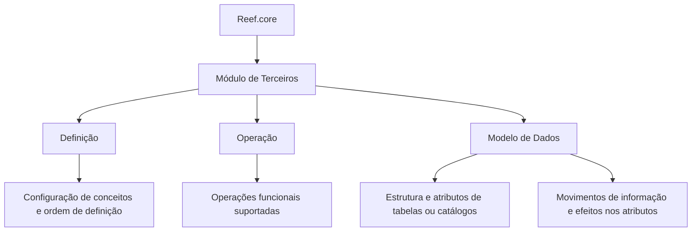

# Documentação do Módulo de Terceiros no Reef.core

## 1. Metadados do Documento
- **Arquivo de Origem:** Não identificado
- **Tipo de Documento:** Manual Operacional / Documentação Funcional
- **Domínio / Sistema:** Reef.core — Módulo de Terceiros
- **Público-Alvo:** Desenvolvedores, analistas funcionais e operação
- **Data/Versão Identificada:** Não identificada
- **Status identificado:** Approved Source
- **Owner identificado:** `user:agonzalez_mapfre.com`

---

## 2. Resumo Executivo & Contexto de Negócio

O documento apresenta a organização da documentação relacionada à funcionalidade do módulo de **Terceiros** no sistema **Reef.core**. O conteúdo informa que a documentação do módulo está dividida em três apartados principais: **Definição**, **Operação** e **Modelo de Dados**.

A seção de Definição concentra documentos sobre os conceitos que devem ser configurados e sobre a ordem necessária para executar essa definição. A finalidade explícita é permitir a operação funcional e completa do módulo de Terceiros.

A seção de Operação reúne documentos relativos às operações funcionais que o módulo de Terceiros suporta. O material fornecido não enumera as operações, os fluxos de tela, regras de validação ou usuários responsáveis por cada operação.

A seção de Modelo de Dados é direcionada ao conhecimento da estrutura e dos atributos das tabelas ou catálogos do Reef.core associados ao módulo de Terceiros. Também descreve movimentos de informação nas tabelas e efeitos nos atributos conforme a execução das operações funcionais suportadas.

---

## 3. Arquitetura, Componentes & Tecnologias Envolvidas

Os elementos identificados no documento são:

| Componente / Elemento | Papel identificado |
| :--- | :--- |
| **Reef.core** | Sistema ao qual pertence o módulo de Terceiros. |
| **Módulo de Terceiros** | Módulo funcional cuja documentação é organizada por Definição, Operação e Modelo de Dados. |
| **Definição** | Apartado documental para configuração de conceitos e ordenação da definição necessária para operar o módulo. |
| **Operação** | Apartado documental referente às operações funcionais suportadas. |
| **Modelo de Dados** | Apartado documental sobre tabelas, catálogos, atributos e movimentação de informações associadas ao módulo. |
| **Mapfredocument** | Termo exibido na navegação do conteúdo; o documento não detalha sua função. |
| **Zeus** | Termo exibido na navegação do conteúdo; o documento não detalha sua relação técnica com Reef.core. |



> **Nota de Análise:** O documento não apresenta arquitetura de infraestrutura, microsserviços, APIs, protocolos, tecnologias de implementação, URLs, servidores ou contratos de integração.

---

## 4. Regras de Negócio, Especificações Funcionais & Processos

### Organização documental do módulo de Terceiros

1. A funcionalidade do módulo de Terceiros no Reef.core possui documentação dividida em três apartados:
   - Definição;
   - Operação;
   - Modelo de Dados.

2. Os documentos de **Definição** detalham:
   - os conceitos que devem ser configurados;
   - a ordem que deve ser seguida durante a definição;
   - a condição de que essa definição ordenada permite operar o módulo de Terceiros de forma funcional e completa.

3. Os documentos de **Operação** abrangem as operações funcionais suportadas pelo módulo de Terceiros.

4. Os documentos de **Modelo de Dados** são orientados ao conhecimento de:
   - estrutura das tabelas ou catálogos do Reef.core relacionados ao módulo de Terceiros;
   - atributos dessas tabelas ou catálogos;
   - movimentação de informações nas tabelas;
   - efeito da execução das operações funcionais sobre os atributos.

> **Nota de Análise:** O material não especifica quais conceitos devem ser configurados, qual é a ordem concreta de configuração, quais operações funcionais são suportadas, nem quais tabelas, catálogos ou atributos participam dos movimentos de informação.

---

## 5. Tabelas de Parâmetros, Ambientes e Estruturas de Dados

| Item / Parâmetro | Descrição / Função | Tipo / Valores / Formato | Ambiente / Observações |
| :--- | :--- | :--- | :--- |
| Sistema | Reef.core | Sistema corporativo citado no documento | Ambiente não identificado |
| Módulo | Terceiros | Módulo funcional documentado | Associado ao Reef.core |
| Apartado documental | Definição | Documenta conceitos configuráveis e sua ordem de definição | Necessário para operar funcional e completamente o módulo |
| Apartado documental | Operação | Documenta operações funcionais suportadas | Operações não enumeradas |
| Apartado documental | Modelo de Dados | Documenta estrutura, atributos, tabelas e catálogos relacionados | Entidades não identificadas nominalmente |
| Informação movimentada | Dados nas tabelas relacionadas | Movimentos de informação e efeitos em atributos | Detalhamento dos movimentos não fornecido |
| Owner | `user:agonzalez_mapfre.com` | Identificador de proprietário exibido | Origem: metadados visíveis no conteúdo |
| Lifecycle | Approved Source | Estado de ciclo de vida exibido | Sem detalhamento adicional |
| Idioma de navegação | ES | Opção de idioma exibida | Interface em espanhol |

---

## 6. Bateria de Perguntas & Respostas para RAG (FAQ Sintético)

### P1: Qual é o sistema e o módulo cobertos pela documentação?
**R:** A documentação cobre o módulo de **Terceiros** pertencente ao sistema **Reef.core**.

### P2: Como a documentação do módulo de Terceiros no Reef.core está organizada?
**R:** A documentação é dividida em três apartados: **Definição**, **Operação** e **Modelo de Dados**.

### P3: Qual é a finalidade da seção de Definição do módulo de Terceiros?
**R:** A seção de Definição reúne documentos que detalham os conceitos que devem ser configurados e a ordem que deve ser seguida nessa definição, permitindo operar o módulo de Terceiros de forma funcional e completa.

### P4: O documento informa quais conceitos devem ser configurados no módulo de Terceiros?
**R:** Não. O documento afirma que existem conceitos a configurar, mas não lista os conceitos, seus atributos, valores permitidos ou a sequência detalhada de configuração.

### P5: O que a seção de Operação documenta?
**R:** A seção de Operação reúne documentos relacionados às operações funcionais suportadas pelo módulo de Terceiros.

### P6: Quais operações funcionais do módulo de Terceiros são descritas no material fornecido?
**R:** Nenhuma operação funcional é detalhada nominalmente no material fornecido. O documento apenas informa que existem documentos sobre operações suportadas pelo módulo.

### P7: Qual é o foco da seção de Modelo de Dados?
**R:** A seção de Modelo de Dados é orientada ao conhecimento da estrutura e dos atributos das tabelas ou catálogos do Reef.core relacionados ao módulo de Terceiros.

### P8: O que acontece com os atributos das tabelas quando operações funcionais são executadas?
**R:** O documento informa que são descritos os movimentos de informação nas tabelas e os efeitos nos atributos conforme a execução de cada operação funcional suportada. Entretanto, os efeitos específicos em cada atributo não são apresentados no trecho disponível.

### P9: O documento identifica tabelas ou catálogos específicos do Reef.core?
**R:** Não. O documento menciona tabelas ou catálogos relacionados ao módulo de Terceiros, mas não informa seus nomes, chaves, campos ou relacionamentos.

### P10: Há detalhes sobre APIs, microsserviços ou integrações do módulo de Terceiros?
**R:** Não. O conteúdo não especifica APIs, métodos HTTP, contratos JSON, microsserviços, filas, bancos de dados, URLs, servidores ou integrações externas.

### P11: Quem é o owner identificado no conteúdo?
**R:** O owner exibido nos metadados é `user:agonzalez_mapfre.com`.

### P12: Qual é o status de ciclo de vida identificado para a documentação?
**R:** O campo **Lifecycle** aparece com o valor **Approved Source**.

---

## 7. Glossário de Termos, Siglas & Conceitos-Chave

- **Reef.core:** Sistema citado como contexto do módulo de Terceiros.
- **Módulo de Terceiros:** Módulo funcional do Reef.core tratado pela documentação.
- **Definição:** Apartado documental voltado à configuração de conceitos e à ordem de definição necessária para operar o módulo.
- **Operação:** Apartado documental relacionado às operações funcionais suportadas pelo módulo.
- **Modelo de Dados:** Apartado documental sobre estrutura, tabelas, catálogos, atributos e movimentação de informação.
- **Tabelas:** Estruturas de dados do Reef.core relacionadas ao módulo de Terceiros.
- **Catálogos:** Estruturas de referência mencionadas juntamente com as tabelas relacionadas ao módulo.
- **Atributos:** Elementos das tabelas ou catálogos que podem ser afetados pela execução de operações funcionais.
- **Lifecycle:** Campo de metadado apresentado com o valor `Approved Source`.
- **Owner:** Campo de metadado que identifica o responsável exibido como `user:agonzalez_mapfre.com`.
- **ES:** Identificador de idioma exibido na navegação; o contexto indica espanhol.

---

## 8. Notas Críticas, Riscos & Limitações

- O conteúdo fornecido funciona como uma página de entrada ou índice documental, não como uma especificação completa do módulo de Terceiros.
- Não há lista de conceitos configuráveis, dependências, ordem detalhada de configuração, parâmetros ou valores aceitos.
- Não há descrição das operações funcionais suportadas, seus pré-requisitos, entradas, saídas, exceções ou responsáveis.
- Não foram identificados nomes de tabelas, catálogos, atributos, chaves, relacionamentos ou regras de persistência.
- Não foram identificados ambientes, URLs, servidores, tecnologias, APIs, integrações, versões ou dados de implantação.
- **Nota de Análise:** O documento menciona movimentação de informações e impacto em atributos, mas não apresenta os movimentos, as tabelas envolvidas ou as alterações específicas.

---

## 9. Conteúdo Bruto Estruturado (Referência Fiel)

```text
--- [PÁGINA 1 DE 1] ---

DOCUMENTACIÓN - TERCEROS
La información relacionada con la funcionalidad del módulo de Terceros en Reef.core se encuentra dividida en los siguientes apartados:
Denición
Operación
Modelo de datos
DEFINICIÓN
Documentos que detallan aquellos Conceptos que se han de congurar y el Orden que se ha de seguir en su denición para poder operar
funcional y completamente el Módulo de Terceros.
OPERACIÓN
Documentos relacionados con las Operaciones Funcionales soportadas en el Módulo de Terceros.
MODELO DE DATOS
Documentación orientada al conocimiento de la Estructura y Atributos de las Tablas o Catálogos de Reef.core relacionadas con el Módulo de
Terceros.
Adicionalmente, se describen con detalle los movimientos de la información en las Tablas y el efecto en sus Atributos, de acuerdo con la
Ejecución de cada una de las Operaciones Funcionales soportadas.
Documentation / DOCUMENTACIÓN Reef
DOCUMENTACIÓN Reef
Mapfredocument
DOCUMENTACIÓN Reef
Owner
user:agonzalez_mapfre.com
Lifecycle
Approved Source
 / 
 VL
Buscar Inicio Soluciones Arquitecturas APIs Componentes Cloud Documentación Zeus Reef Ayuda
ES
```
