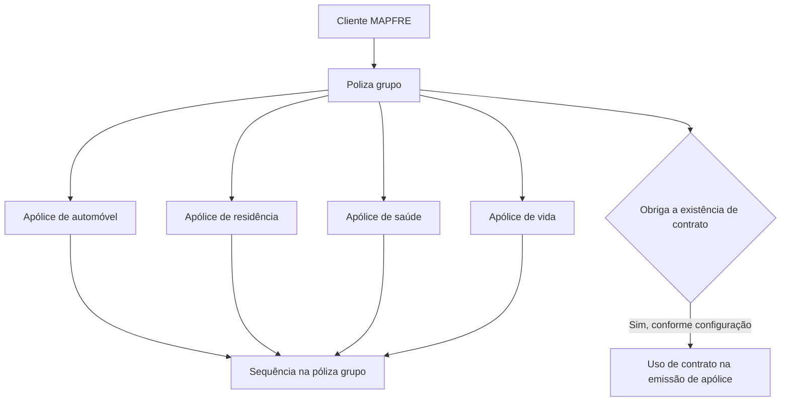

# Definição de Póliza Grupo no Reef.core — Agrupamento de Apólices MAPFRE

## 1. Metadados do Documento
- **Arquivo de Origem:** Não identificado no conteúdo fornecido
- **Tipo de Documento:** Especificação Técnica
- **Domínio / Sistema:** Reef.core / MAPFRE / Gestão de apólices
- **Público-Alvo:** Desenvolvedores, Arquitetos, Operação e Negócio
- **Data/Versão Identificada:** Não identificada

---

## 2. Resumo Executivo & Contexto de Negócio

O documento define o conceito de **póliza grupo** no sistema **Reef.core**. Uma póliza grupo é uma chave capaz de agrupar diversas apólices, independentemente de pertencerem ao mesmo ramo de negócio ou a ramos distintos. A agregação permite que apólices relacionadas sejam tratadas sob um identificador comum.

O primeiro cenário apresentado representa uma pessoa física com apólices de automóvel, residência, saúde e vida na MAPFRE. Essas apólices, embora pertencentes a diferentes tipos de negócio, podem ficar associadas à mesma póliza grupo.

O segundo cenário representa uma pessoa jurídica com uma frota de automóveis. Cada veículo é tratado como uma apólice individual de automóvel, e todas as apólices podem ser associadas a uma única póliza grupo.

A póliza grupo possui propriedades operacionais e descritivas, incluindo identificador, descrição, descrição curta, obrigatoriedade de contrato, sequência e status de habilitação. A sequência identifica a posição de cada apólice dentro do agrupamento, de forma análoga ao número de risco em uma apólice com múltiplos riscos.

O documento também estabelece limitações explícitas: o número da póliza grupo não segue uma estrutura predefinida e a sua criação não é automática; atualmente, a criação do identificador ocorre manualmente.

---

## 3. Arquitetura, Componentes & Tecnologias Envolvidas

Os componentes e domínios explicitamente mencionados são:

| Componente / Sistema | Papel identificado no documento |
| :--- | :--- |
| Reef.core | Sistema que permite agrupar apólices sob uma póliza grupo. |
| MAPFRE | Contexto corporativo no qual clientes podem possuir diversas apólices agrupadas. |
| Póliza grupo | Chave ou entidade de agrupamento de apólices. |
| Póliza | Apólice individual associável a uma póliza grupo. |
| Contrato | Entidade cujo uso pode ser obrigatório conforme a propriedade da póliza grupo. |
| Risco | Referência conceitual usada para explicar a sequência das apólices dentro de uma póliza grupo. |
| Ramo | Categoria de negócio da apólice, como Automóvel, Saúde ou Residência. |
| Mapfredocument | Nome exibido na área de documentação do conteúdo extraído. |
| Reef | Nome exibido na navegação e documentação da plataforma. |
| Zeus | Nome exibido na navegação da documentação, sem detalhamento funcional adicional. |



**Nota de Análise:** O documento não descreve interfaces, métodos HTTP, contratos JSON, banco de dados, eventos, APIs, tecnologias de implementação ou integrações técnicas do Reef.core.

---

## 4. Regras de Negócio, Especificações Funcionais & Processos

### 4.1 Definição de póliza grupo

O Reef.core permite agrupar várias apólices sob uma chave denominada **póliza grupo**. As apólices agrupadas podem:

1. Ser de qualquer tipo de negócio.
2. Ser de tipos de negócio diferentes.
3. Ser do mesmo tipo de negócio.

### 4.2 Cenário: pessoa física com apólices de diferentes ramos

Uma pessoa física pode possuir apólices de automóvel, residência, saúde e vida na MAPFRE. Todas essas apólices podem estar agrupadas sob uma mesma póliza grupo.

Os ramos exemplificados são:

- Automóvel.
- Residência.
- Saúde.
- Vida.

### 4.3 Cenário: pessoa jurídica com frota de automóveis

Uma pessoa jurídica pode possuir uma frota de automóveis. Cada automóvel corresponde a uma apólice de automóvel individual. As apólices individuais que representam os veículos da frota podem ser agrupadas sob uma única póliza grupo.

### 4.4 Regras do número da póliza grupo

1. O número da póliza grupo é o identificador da póliza grupo.
2. O identificador aceita qualquer valor.
3. O número da póliza grupo não atende a uma estrutura de numeração predefinida.
4. A criação de um número de póliza grupo não é automática.
5. Atualmente, a criação do número de póliza grupo é realizada manualmente.

### 4.5 Regra de descrição

A propriedade **Descrição** define o nome que será associado à póliza grupo.

### 4.6 Regra de descrição curta

A propriedade **Descrição curta** define o nome curto que será associado à póliza grupo.

### 4.7 Regra de obrigatoriedade de contrato

A propriedade **Obriga a existência de contrato** indica se o uso da póliza grupo obrigará o uso de um contrato durante a emissão de uma apólice.

**Nota de Análise:** O documento não detalha os valores possíveis dessa propriedade, nem descreve o comportamento do sistema quando a exigência de contrato estiver ativa.

### 4.8 Regra de sequência das apólices agrupadas

Toda apólice associada a uma póliza grupo possui um valor de sequência. A sequência representa o número de apólices independentes que integram a póliza grupo.

A lógica da sequência é equivalente à lógica de riscos em uma apólice:

1. Uma apólice pode possuir múltiplos riscos.
2. Cada risco possui um identificador denominado número de risco.
3. Em uma póliza grupo, cada apólice integrante também possui um identificador de sequência.
4. A propriedade **Sequência** informa qual é o último identificador associado a uma póliza grupo.

No exemplo apresentado, as apólices abaixo são associadas à póliza grupo `AAAAAAAAAAAAA`:

- A apólice `1111111111111` do ramo Automóvel recebe sequência `1`.
- A apólice `2222222222222` do ramo Saúde recebe sequência `2`.
- A apólice `3333333333333` do ramo Residência recebe sequência `3`.

### 4.9 Regra de inabilitação

A propriedade **Inhabilitada** especifica se a póliza grupo está operacional no sistema.

1. Quando a póliza grupo está operativa, o documento não apresenta restrições adicionais para novas associações.
2. Quando a póliza grupo está não operativa, ela não pode ser atribuída a uma nova apólice.

**Nota de Análise:** O documento não especifica se a inabilitação afeta apólices já associadas, nem informa se uma póliza grupo inabilitada pode ser reabilitada.

---

## 5. Tabelas de Parâmetros, Ambientes e Estruturas de Dados

### 5.1 Propriedades da póliza grupo

| Item / Parâmetro | Descrição / Função | Tipo / Valores / Formato | Ambiente / Observações |
| :--- | :--- | :--- | :--- |
| Nº de póliza grupo | Identificador da póliza grupo. | Aceita qualquer valor. | Não possui estrutura de numeração predefinida. Criação manual. |
| Descrição | Nome associado à póliza grupo. | Texto; formato não detalhado. | Sem restrições adicionais descritas. |
| Descrição curta | Nome curto associado à póliza grupo. | Texto; formato não detalhado. | Sem restrições adicionais descritas. |
| Obriga a existência de contrato | Indica se a utilização da póliza grupo obrigará o uso de contrato na emissão de uma apólice. | Valores não detalhados. | O documento referencia um contrato, mas não o especifica. |
| Sequência | Indica o identificador das apólices independentes que compõem uma póliza grupo e informa o último identificador associado. | Numeração sequencial; formato não detalhado. | Conceitualmente equivalente ao número de risco em uma apólice. |
| Inhabilitada | Especifica se a póliza grupo está operativa no sistema. | Estado operacional ou não operacional; valores técnicos não detalhados. | Quando não operativa, não pode ser atribuída a uma nova apólice. |

### 5.2 Exemplo de riscos em uma apólice

| Nº de póliza | Ramo | Nº de risco | Risco |
| :--- | :--- | :--- | :--- |
| 1111111111111 | Automóvil | 1 | Volkswagen Golf |
| 1111111111111 | Automóvil | 2 | Seat Toledo |
| 1111111111111 | Automóvil | 3 | Audi A4 |
| 2222222222222 | Salud | 1 | María Martín Gómez |
| 3333333333333 | Hogar | 1 | Calle Oceanía, 24 |

### 5.3 Exemplo de associação de apólices a uma póliza grupo

| Póliza grupo | Sequência | Nº de póliza | Ramo |
| :--- | :--- | :--- | :--- |
| AAAAAAAAAAAAA | 1 | 1111111111111 | Automóvil |
| AAAAAAAAAAAAA | 2 | 2222222222222 | Salud |
| AAAAAAAAAAAAA | 3 | 3333333333333 | Hogar |

### 5.4 Ambientes, rotas e URLs

| Item / Parâmetro | Descrição / Função | Tipo / Valores / Formato | Ambiente / Observações |
| :--- | :--- | :--- | :--- |
| URLs de ambiente | Não identificadas no conteúdo. | Não aplicável. | O documento fornecido não lista URLs. |
| Servidores | Não identificados no conteúdo. | Não aplicável. | O documento fornecido não lista servidores. |
| Rotas de logs | Não identificadas no conteúdo. | Não aplicável. | O documento fornecido não descreve logs. |
| Portas de rede | Não identificadas no conteúdo. | Não aplicável. | O documento fornecido não descreve portas. |

---

## 6. Bateria de Perguntas & Respostas para RAG (FAQ Sintético)

### P1: O que é uma póliza grupo no Reef.core?
**R:** Uma póliza grupo é uma chave usada pelo Reef.core para agrupar diversas apólices. As apólices agrupadas podem pertencer ao mesmo tipo de negócio ou a diferentes tipos de negócio.

### P2: Uma póliza grupo pode reunir apólices de ramos diferentes?
**R:** Sim. O documento apresenta o exemplo de uma pessoa física que possui apólices de automóvel, residência, saúde e vida na MAPFRE, todas agrupadas sob uma mesma póliza grupo.

### P3: Uma empresa com frota de veículos pode utilizar uma póliza grupo?
**R:** Sim. O documento exemplifica uma pessoa jurídica com uma frota de automóveis, em que cada automóvel corresponde a uma apólice individual de automóvel e todas as apólices são agrupadas sob uma única póliza grupo.

### P4: Existe uma estrutura obrigatória para o número de póliza grupo?
**R:** Não. O documento afirma que a numeração de uma póliza grupo não atende a uma estrutura predefinida. O identificador aceita qualquer valor.

### P5: O sistema cria automaticamente o número de uma póliza grupo?
**R:** Não. A criação de um número de póliza grupo é realizada manualmente na situação atual descrita pelo documento.

### P6: Para que serve a propriedade Sequência em uma póliza grupo?
**R:** A propriedade Sequência identifica as apólices independentes que fazem parte de uma póliza grupo. Ela informa qual é o último identificador associado ao agrupamento e possui sentido equivalente ao número de risco em uma apólice com vários riscos.

### P7: Como a sequência das apólices é exemplificada para a póliza grupo AAAAAAAAAAAAA?
**R:** No exemplo, a apólice `1111111111111` do ramo Automóvel recebe sequência `1`, a apólice `2222222222222` do ramo Saúde recebe sequência `2` e a apólice `3333333333333` do ramo Residência recebe sequência `3`.

### P8: O que significa a propriedade “Obriga a existência de contrato”?
**R:** Essa propriedade indica se o uso de uma póliza grupo obrigará o uso de um contrato quando uma apólice for emitida. O documento não informa os valores possíveis nem descreve o contrato referenciado.

### P9: O que ocorre quando uma póliza grupo está inabilitada?
**R:** Quando uma póliza grupo está não operativa no sistema, ela não pode ser atribuída a uma nova apólice.

### P10: A inabilitação de uma póliza grupo remove ou altera as apólices já associadas?
**R:** O documento não informa o efeito da inabilitação sobre apólices já associadas. A única regra explícita é que uma póliza grupo não operativa não poderá ser atribuída a uma nova apólice.

### P11: Qual é a finalidade das propriedades Descrição e Descrição curta?
**R:** A propriedade Descrição define o nome associado à póliza grupo. A propriedade Descrição curta define o nome curto associado à mesma póliza grupo.

### P12: O documento especifica APIs, métodos HTTP ou contratos JSON para pólizas grupo?
**R:** Não. O conteúdo fornecido descreve o conceito, as propriedades e os exemplos de uso de póliza grupo, mas não detalha APIs, métodos HTTP, contratos JSON, banco de dados ou integrações técnicas.

---

## 7. Glossário de Termos, Siglas & Conceitos-Chave

- **Reef.core:** Sistema citado como responsável por permitir o agrupamento de apólices sob uma póliza grupo.
- **MAPFRE:** Contexto corporativo citado nos exemplos de clientes com diversas apólices.
- **Póliza grupo:** Chave ou entidade que agrupa várias apólices.
- **Póliza:** Apólice individual que pode integrar uma póliza grupo.
- **Ramo:** Tipo de negócio da apólice, como Automóvel, Saúde ou Residência.
- **Risco:** Elemento de uma apólice que possui um identificador denominado número de risco; utilizado como analogia para explicar a sequência em uma póliza grupo.
- **Nº de risco:** Identificador de cada risco de uma apólice.
- **Sequência:** Identificador de cada apólice independente que integra uma póliza grupo.
- **Contrato:** Entidade cujo uso pode ser obrigatório durante a emissão de uma apólice, conforme a configuração da póliza grupo.
- **Inhabilitada:** Propriedade que indica se uma póliza grupo está operativa ou não operativa.
- **Mapfredocument:** Nome exibido na seção de documentação do conteúdo extraído.
- **Zeus:** Nome exibido na navegação do conteúdo extraído; sem definição funcional no documento.
- **VL:** Texto exibido como valor ou referência na área de documentação; sem definição adicional no conteúdo.

---

## 8. Notas Críticas, Riscos & Limitações

- O documento não especifica interfaces, APIs, métodos HTTP, contratos JSON, persistência de dados ou modelo de banco de dados para póliza grupo.
- O documento não informa validações técnicas para o campo **Nº de póliza grupo**, além de que ele aceita qualquer valor e não possui estrutura definida.
- A criação manual do número de póliza grupo pode representar dependência operacional e risco de inconsistência de cadastro, mas o documento não descreve mecanismos de validação, autorização ou prevenção de duplicidade.
- O documento não detalha os valores técnicos possíveis para a propriedade **Obriga a existência de contrato**.
- O documento não identifica o contrato exigido, seu ciclo de vida, suas regras de validação ou o comportamento em caso de ausência do contrato.
- O documento não informa se a propriedade **Sequência** é gerada automaticamente, informada manualmente ou recalculada após remoções e inclusões de apólices.
- O documento não define se números de sequência podem ser repetidos dentro de uma mesma póliza grupo.
- O documento não especifica se uma apólice pode pertencer a mais de uma póliza grupo.
- O documento informa que uma póliza grupo não operativa não pode ser atribuída a uma nova apólice, mas não detalha o impacto sobre apólices existentes.
- O documento não apresenta ambientes, URLs, servidores, portas, configurações de logs, mecanismos de autenticação ou dependências de infraestrutura.
- **Nota de Análise:** Os exemplos utilizam “Hogar” na tabela de ramos e “residência” na interpretação em português; o termo literal original é “Hogar”.

---

## 9. Conteúdo Bruto Estruturado (Referência Fiel)

```text
--- [PÁGINA 1 DE 2] ---

DEFINICIÓN de póliza grupo
Objetivo
Reef.core permite agrupar varias pólizas (es decir, cualquier póliza de cualquier tipo de negocio o del mismo tipo de negocio) bajo una clave.
A esta clave se la denomina póliza grupo.
Un ejemplo de agrupación de pólizas de distintos tipos de negocio a una póliza grupo podría ser:
Póliza
grupo
Póliza
de
automóvil
Póliza
de
hogar
Póliza
de
salud
Póliza
de
vida
El gráco anterior podría corresponder a un cliente que es una persona física con distintas pólizas en MAPFRE y todas ellas se encuentran
bajo una póliza grupo.
Otro ejemplo podría ser el que se muestra a continuación:
Póliza
grupo
Póliza
de
automóvil
Póliza
de
automóvil
Póliza
de
automóvil
Póliza
de
automóvil
Este ejemplo podría corresponder a un cliente que es una persona jurídica con una ota de automóviles (cada automóvil es una póliza) se
encuentran bajo una póliza grupo.
Propiedades
Nº de póliza grupo
Identicador de la póliza grupo. Acepta cualquier valor.
Descripción
Documentation / DOCUMENTACIÓN Reef
DOCUMENTACIÓN Reef
Mapfredocument
DOCUMENTACIÓN Reef
Owner
user:agonzalez_mapfre.com
Lifecycle
Approved Source
 / 
 VL
Buscar Inicio Soluciones Arquitecturas APIs Componentes Cloud Documentación Zeus Reef Ayuda
ES


--- [PÁGINA 2 DE 2] ---

Nombre que se va a asociar a la póliza grupo.
Descripción corta
Nombre corto que se asociará a la póliza grupo.
Obliga a existencia de contrato
Indica si el uso de esta póliza grupo obligará al uso de un [contrato][Nolink] cuando se emita una póliza.
Secuencia
Toda póliza que es asociada a una póliza grupo dispone de un valor que indica el número de pólizas independientes que forman parte de una
póliza grupo. El sentido es el mismo de un riesgo en una póliza. Cada riesgo tiene un identicador (nº de riesgo) y en este caso cada póliza
que forma parte de una póliza grupo también tiene un identicador. Esta propiedad informa de cual es el último identicador asociado a una
póliza grupo.
Como ejemplo, cuando una póliza tiene varios riesgos, cada riesgo tiene un identicador (nº de riesgo). Esto quiere decir que una póliza con
varios riesgos atiende a:
Nº de póliza Ramo Nº de riesgo Riesgo
1111111111111 Automóvil 1 Volkswagen Golf
1111111111111 Automóvil 2 Seat Toledo
1111111111111 Automóvil 3 Audi A4
2222222222222 Salud 1 María Martín Gómez
3333333333333 Hogar 1 Calle Oceanía, 24
Si todas las pólizas anteriores se asocian a una misma póliza grupo con número 'AAAAAAAAAAAAA', quedaría de la forma que se muestra a
continuación. Nótese que no se muestra la información desglosada por riesgo ya que carece de sentido para el ejemplo.
Póliza grupo Secuencia Nº de póliza Ramo
AAAAAAAAAAAAA 1 1111111111111 Automóvil
AAAAAAAAAAAAA 2 2222222222222 Salud
AAAAAAAAAAAAA 3 3333333333333 Hogar
Inhabilitada
Especica si la póliza grupo se encuentra operativa o no en el sistema. Cuando se encuentra no operativa no podrá ser asignada a una nueva
póliza.
Preguntas frecuentes
¿Existe una estructura del número de póliza grupo como ocurren con el número de póliza y el número de siniestro?
No, la numeración de una póliza grupo no atiende a una estructura.
¿Se puede crear un número de póliza grupo de forma automática?
No, la creación de un número de póliza grupo en la actualidad se realiza de forma manual.
```
