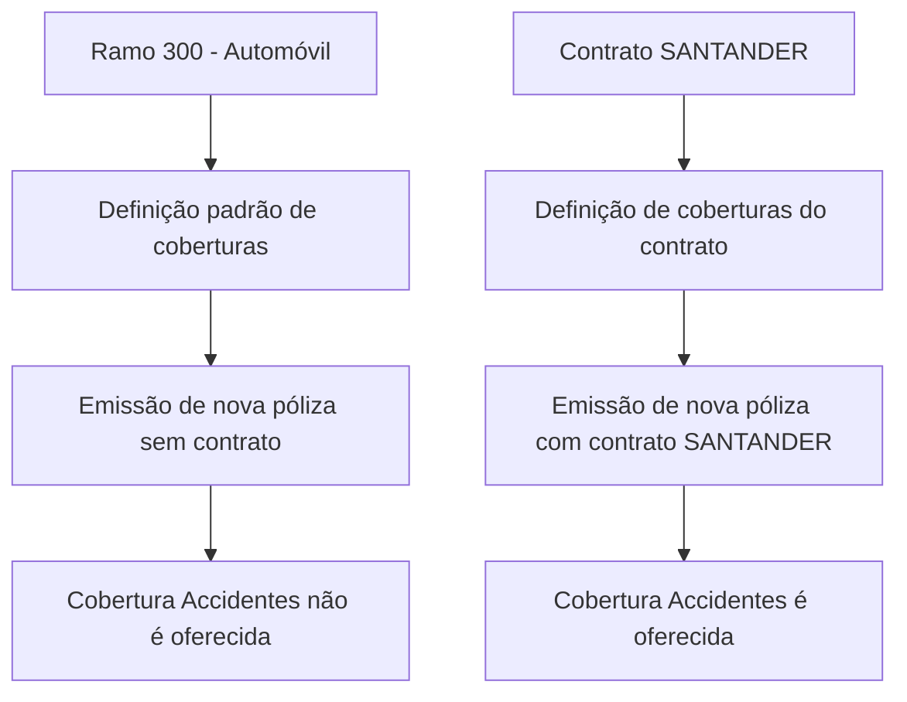

_Transient error (attempt 1/3): Post "https://axet.nttdata.com/api/llm-enabler/v3/ntt/v1/responses": read tcp 100.64.0.1:62626->150.171.110.39:443: read: connection reset by peer. Retrying…_

# Definição de Contrato para Alteração de Coberturas em Ramos de Automóvel

## 1. Metadados do Documento
- **Arquivo de Origem:** Não identificado no conteúdo fornecido
- **Tipo de Documento:** Especificação Funcional
- **Domínio / Sistema:** Reef / Mapfre — definição de contratos e coberturas de ramo
- **Público-Alvo:** Negócio, Analistas Funcionais, Desenvolvedores e Arquitetos
- **Data/Versão Identificada:** Não identificada

---

## 2. Resumo Executivo & Contexto de Negócio

O documento define o conceito de **contrato** como um mecanismo para alterar determinados conceitos de negócio previamente definidos em um ramo. As alterações não afetam necessariamente todos os conceitos de negócio do ramo.

O exemplo apresentado utiliza o ramo **300 - Automóvil** e suas coberturas. A definição do ramo determina quais coberturas são oferecidas ou deixam de ser oferecidas durante a emissão de uma nova apólice.

O contrato pode estabelecer uma configuração de coberturas diferente da configuração padrão do ramo. No exemplo, a cobertura **300 - Accidentes** não é oferecida na emissão de uma nova apólice sem contrato, mas passa a ser oferecida quando a emissão está associada ao contrato **SANTANDER**.

O documento também define duas propriedades identificadoras do contrato: **Contrato**, como chave de identificação, e **Nombre**, como descrição de identificação. Não há detalhamento de formatos, persistência, APIs, validações técnicas ou métodos HTTP.

---

## 3. Arquitetura, Componentes & Tecnologias Envolvidas

Os elementos funcionais identificados são:

| Componente / Conceito | Descrição |
| :--- | :--- |
| Reef | Repositório ou contexto documental citado no cabeçalho da extração. |
| Mapfre | Contexto corporativo identificado por referências a `Mapfredocument` e ao usuário proprietário. |
| Ramo | Estrutura de negócio que define conceitos como coberturas. |
| Contrato | Mecanismo que permite alterar conceitos de negócio definidos no ramo. |
| Cobertura | Conceito de negócio exemplificado no documento; pode ser oferecido ou não na emissão de uma apólice. |
| Ramo 300 - Automóvil | Ramo utilizado no exemplo funcional. |
| Contrato SANTANDER | Contrato utilizado para exemplificar a alteração da disponibilidade da cobertura Accidentes. |
| Póliza | Entidade de negócio cuja emissão considera a configuração de coberturas do ramo e, quando aplicável, do contrato. |



> *Nota de Análise: O documento descreve relações funcionais entre ramo, contrato, cobertura e emissão de apólice. Não detalha arquitetura de software, serviços, bancos de dados, integrações, protocolos ou tecnologias de implementação.*

---

## 4. Regras de Negócio, Especificações Funcionais & Processos

1. Um contrato permite realizar alterações em conceitos de negócio que já foram definidos em um ramo.
2. As alterações realizadas por um contrato afetam um número de conceitos de negócio, mas não necessariamente todos os conceitos do ramo.
3. As coberturas são apresentadas como um exemplo de conceito de negócio configurado em um ramo.
4. Na definição de um ramo, estabelece-se quais coberturas serão oferecidas ou quais não serão mais oferecidas.
5. A disponibilidade de uma cobertura interfere na emissão de uma nova apólice.
6. No exemplo do ramo **300 - Automóvil**, as coberturas **100 - Responsabilidad civil** e **200 - Daños propios** possuem valor `NO` no campo `INHABILITADA`.
7. No exemplo sem contrato, a cobertura **300 - Accidentes** possui valor `SI` no campo `INHABILITADA`.
8. O texto afirma que, sem contrato, a cobertura **Accidentes não é oferecida** durante a emissão de uma nova apólice.
9. Um contrato pode fazer com que uma cobertura seja oferecida, mesmo que o ramo não a ofereça em sua configuração sem contrato.
10. Para o contrato **SANTANDER**, a cobertura **300 - Accidentes** possui valor `NO` no campo `INHABILITADA`.
11. O texto afirma que, com o contrato **SANTANDER**, a cobertura **Accidentes é oferecida** durante a emissão de uma nova apólice.
12. A propriedade **Contrato** é a chave pela qual o contrato será identificado.
13. A propriedade **Nombre** é a descrição pela qual o contrato será identificado.

> *Nota de Análise: A extração apresenta uma inconsistência textual na primeira descrição, que afirma que a cobertura Accidentes está “inhabilitada”, embora o valor exibido para `INHABILITADA` seja `SI`. O resumo final do documento esclarece o comportamento esperado: `SI` sem contrato corresponde à cobertura não oferecida, enquanto `NO` no contrato SANTANDER corresponde à cobertura oferecida.*

---

## 5. Tabelas de Parâmetros, Ambientes e Estruturas de Dados

| Item / Parâmetro | Descrição / Função | Tipo / Valores / Formato | Ambiente / Observações |
| :--- | :--- | :--- | :--- |
| Ramo | Agrupador de conceitos de negócio, incluindo coberturas. | `300 - Automóvil` | Exemplo apresentado no documento. |
| Contrato | Chave pela qual o contrato será identificado. | Não detalhado | Pode alterar conceitos de negócio definidos no ramo. |
| Nombre | Descrição pela qual o contrato será identificado. | Não detalhado | Propriedade do contrato. |
| Cobertura 100 | Responsabilidad civil. | `INHABILITADA = NO` | Igual no cenário sem contrato e no contrato SANTANDER. |
| Cobertura 200 | Daños propios. | `INHABILITADA = NO` | Igual no cenário sem contrato e no contrato SANTANDER. |
| Cobertura 300 | Accidentes. | Sem contrato: `INHABILITADA = SI`; contrato SANTANDER: `INHABILITADA = NO` | Sem contrato, não é oferecida; com contrato SANTANDER, é oferecida. |
| Contrato SANTANDER | Configuração contratual usada no exemplo. | Nome do contrato: `SANTANDER` | Altera a disponibilidade da cobertura Accidentes. |

| Cobertura | Sem Contrato | Com Contrato SANTANDER | Efeito informado pelo documento |
| :--- | :--- | :--- | :--- |
| 100 - Responsabilidad civil | `INHABILITADA = NO` | `INHABILITADA = NO` | Não há alteração apresentada. |
| 200 - Daños propios | `INHABILITADA = NO` | `INHABILITADA = NO` | Não há alteração apresentada. |
| 300 - Accidentes | `INHABILITADA = SI` | `INHABILITADA = NO` | Sem contrato não é oferecida; com SANTANDER é oferecida. |

---

## 6. Bateria de Perguntas & Respostas para RAG (FAQ Sintético)

### P1: O que é um contrato no contexto da definição de ramo?
**R:** Um contrato é um mecanismo que permite alterar conceitos de negócio já definidos em um ramo. Essas alterações podem atingir alguns conceitos do ramo, sem obrigatoriamente afetar todos eles.

### P2: Qual conceito de negócio é usado como exemplo no documento?
**R:** O documento utiliza as coberturas como exemplo de conceito de negócio definido no ramo. A configuração dessas coberturas determina se elas serão oferecidas ou não na emissão de uma nova apólice.

### P3: Qual ramo é utilizado no exemplo funcional?
**R:** O exemplo utiliza o ramo `300 - Automóvil`.

### P4: O que acontece com a cobertura Accidentes quando uma nova apólice é emitida sem contrato?
**R:** Quando uma nova apólice é emitida sem contrato, a cobertura `300 - Accidentes` não é oferecida. Na tabela do documento, essa condição é representada por `INHABILITADA = SI`.

### P5: O que acontece com a cobertura Accidentes quando uma nova apólice é emitida com o contrato SANTANDER?
**R:** Quando uma nova apólice é emitida com o contrato `SANTANDER`, a cobertura `300 - Accidentes` é oferecida. Na tabela do documento, essa configuração aparece como `INHABILITADA = NO`.

### P6: O contrato SANTANDER altera as coberturas Responsabilidad civil e Daños propios?
**R:** Não há alteração apresentada para as coberturas `100 - Responsabilidad civil` e `200 - Daños propios`. Ambas permanecem com `INHABILITADA = NO` tanto sem contrato quanto com o contrato SANTANDER.

### P7: Quais são as propriedades identificadoras de um contrato?
**R:** O documento define duas propriedades: `Contrato`, a chave pela qual o contrato será identificado, e `Nombre`, a descrição pela qual o contrato será identificado.

### P8: Um contrato pode oferecer uma cobertura que não é oferecida pelo ramo sem contrato?
**R:** Sim. O documento informa que um contrato pode fazer com que uma cobertura seja oferecida mesmo quando a configuração do ramo sem contrato não oferece essa cobertura. O exemplo é a cobertura Accidentes no contrato SANTANDER.

### P9: O documento especifica APIs, métodos HTTP ou contratos JSON para os contratos?
**R:** Não. O documento descreve apenas o comportamento funcional de contratos e coberturas. Não apresenta APIs, métodos HTTP, contratos JSON, endpoints, tecnologias de implementação ou detalhes de integração.

### P10: Como deve ser interpretado o campo INHABILITADA no exemplo de Accidentes?
**R:** Pelo resumo comportamental do documento, `INHABILITADA = SI` no cenário sem contrato significa que a cobertura Accidentes não é oferecida na emissão. Já `INHABILITADA = NO` no contrato SANTANDER significa que a cobertura Accidentes é oferecida.

---

## 7. Glossário de Termos, Siglas & Conceitos-Chave

- **Contrato:** Mecanismo que permite alterar conceitos de negócio previamente definidos em um ramo.
- **Ramo:** Estrutura de negócio que contém definições de conceitos, como coberturas.
- **Cobertura:** Conceito de negócio que pode ser oferecido ou não durante a emissão de uma apólice.
- **Póliza:** Apólice emitida considerando as definições do ramo e, quando aplicável, do contrato.
- **INHABILITADA:** Campo apresentado para indicar a condição de indisponibilidade de uma cobertura. No exemplo de Accidentes, `SI` sem contrato corresponde a não oferecida e `NO` com SANTANDER corresponde a oferecida.
- **SANTANDER:** Nome do contrato utilizado no exemplo funcional.
- **Reef:** Nome citado no contexto documental, em referências como `DOCUMENTACIÓN Reef`.
- **Mapfre:** Referência corporativa presente no conteúdo extraído.

---

## 8. Notas Críticas, Riscos & Limitações

- O documento não identifica o nome do arquivo de origem, a data, a versão ou um autor formal; apenas apresenta `Owner user:agonzalez_mapfre.com`.
- A extração contém caracteres corrompidos, como `denido`, `dene` e `identicará`; a interpretação foi limitada ao sentido textual recuperável.
- Há uma inconsistência na frase que afirma que Accidentes está “inhabilitada”, enquanto a tabela usa `INHABILITADA = SI`; o resumo posterior explicita o comportamento operacional esperado.
- Não foram fornecidos detalhes sobre modelo de dados, persistência, regras de precedência entre múltiplos contratos, permissões, validações, APIs, integrações ou tratamento de erros.
- Não foram detalhados os métodos HTTP ou contratos JSON expostos para a funcionalidade de contratos e coberturas.

---

## 9. Conteúdo Bruto Estruturado (Referência Fiel)

```text
--- [PÁGINA 1 DE 2] ---

DEFINICIÓN de contrato
Objetivo
Bajo este concepto se permite realizar alteraciones de un ramo ya denido. Estas alteraciones afectan a un número de conceptos de negocio
(no a todos). A continuación se muestra un ejemplo:
Uno de los conceptos de negocio que se dene en un ramo son las coberturas. En la denición se establece cuales se van a ofrecer o ya no
se ofrecen más. A continuación (como ejemplo), se muestra las coberturas de un ramo y su estado (habilitada o inhabilitada):
RAMO CONTRATO
300 - Automóvil SIN CONTRATO
COBERTURA INHABILITADA
100 Responsabilidad civil NO
200 Daños propios NO
300 Accidentes SI
Como se puede observar, la cobertura Accidentes se encuentra inhabilitada lo que quiere decir que NO se ofrece en la emisión de una nueva
póliza.
Cuando se hace referencia a que un contrato permite alterar los conceptos de negocio denidos y, atendiendo a este ejemplo, es posible que
un contrato SI ofrezca la cobertura de Accidentes aunque el ramo NO la ofrezca. En este ejemplo, se muestra la denición de las coberturas
para un contrato:
RAMO CONTRATO
300 - Automóvil SANTANDER
COBERTURA INHABILITADA
100 Responsabilidad civil NO
Documentation / DOCUMENTACIÓN Reef
DOCUMENTACIÓN Reef
Mapfredocument
DOCUMENTACIÓN Reef
Owner
user:agonzalez_mapfre.com
Lifecycle
Approved Source
 /
VL
Buscar Inicio Soluciones Arquitecturas APIs Componentes Cloud Documentación Zeus Reef Ayuda
ES

--- [PÁGINA 2 DE 2] ---

COBERTURA INHABILITADA
200 Daños propios NO
300 Accidentes NO
El resumen de la denición sería:
RAMO
300 - Automóvil
COBERTURA INHABILITADA (SIN CONTRATO) INHABILITADA (CONTRATO SANTANDER)
100 Responsabilidad civil NO NO
200 Daños propios NO NO
300 Accidentes SI NO
En este ejemplo, cuando se emite una nueva póliza SIN contrato, la cobertura de Accidentes NO se ofrece. En cambio, cuando se emite una
nueva póliza con el contrato SANTANDER, la cobertura de Accidentes SI se ofrece.
Propiedades
Contrato
Clave por el que se identicará.
Nombre
Descripción por el que se identicará.
```
