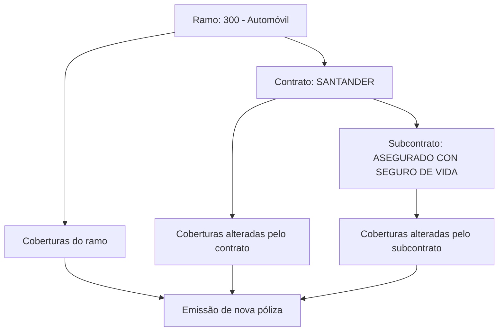

# Definição de Subcontrato no Reef — Alterações de Coberturas por Ramo, Contrato e Subcontrato

## 1. Metadados do Documento
- **Arquivo de Origem:** `Não identificado`
- **Tipo de Documento:** Especificação Técnica
- **Domínio / Sistema:** Reef / Mapfre
- **Público-Alvo:** Desenvolvedores, Arquitetos, Negócio e Operação
- **Data/Versão Identificada:** Não identificada

---

## 2. Resumo Executivo & Contexto de Negócio

O documento descreve o conceito de **subcontrato** no contexto do Reef. Um subcontrato permite realizar alterações sobre um ramo e um contrato previamente definidos. Essas alterações afetam determinados conceitos de negócio, sem necessariamente modificar todos os conceitos associados ao ramo.

O exemplo apresentado utiliza o ramo **300 - Automóvil** e quatro coberturas: Responsabilidad civil, Daños propios, Accidentes e Muerte. A configuração inicial do ramo define o estado de inabilitação de cada cobertura antes da aplicação de contratos ou subcontratos.

O contrato **SANTANDER** é apresentado como uma camada de alteração sobre o ramo Automóvil. Em seguida, o subcontrato **ASEGURADO CON SEGURO DE VIDA** é configurado dentro do contrato SANTANDER, modificando novamente a configuração de cobertura exibida no exemplo.

O documento indica que a emissão de uma nova póliza pode considerar diferentes configurações conforme a combinação de ramo, contrato e subcontrato. Contudo, há inconsistências entre os valores das tabelas de cobertura e a descrição textual do comportamento de emissão; essas divergências são registradas na seção de riscos e limitações.

---

## 3. Arquitetura, Componentes & Tecnologias Envolvidas

Componentes e conceitos identificados:

| Componente / Conceito | Papel descrito no documento |
| :--- | :--- |
| Reef | Sistema ou domínio documental no qual a definição de subcontrato está registrada. |
| Mapfre | Referência corporativa presente no conteúdo documental. |
| Ramo | Entidade de negócio sobre a qual contratos e subcontratos podem aplicar alterações. |
| Contrato | Camada identificada por uma chave, com nome e nome curto, aplicada a um ramo. |
| Subcontrato | Camada aplicada a um contrato para alterar determinados conceitos de negócio. |
| Póliza | Emissão mencionada como dependente da presença ou ausência de contrato e subcontrato. |
| Cobertura | Conceito de negócio cujo estado de inabilitação é configurado. |
| SANTANDER | Contrato usado no exemplo. |
| ASEGURADO CON SEGURO DE VIDA | Subcontrato usado no exemplo dentro do contrato SANTANDER. |



**Nota de Análise:** o documento não detalha interfaces técnicas, métodos HTTP, contratos JSON, persistência de dados, APIs, ambientes de execução ou tecnologias de implementação do Reef.

---

## 4. Regras de Negócio, Especificações Funcionais & Processos

1. O conceito de subcontrato permite efetuar alterações sobre um ramo e um contrato já definidos.
2. As alterações de subcontrato afetam apenas um número de conceitos de negócio, e não necessariamente todos os conceitos associados.
3. O exemplo parte da definição do ramo **300 - Automóvil** sem contrato e sem subcontrato definidos.
4. No estado inicial do ramo Automóvil, as coberturas Responsabilidad civil, Daños propios e Muerte possuem valor `NO` na coluna **INHABILITADA**, enquanto Accidentes possui valor `SI`.
5. Para o ramo do exemplo, é definido o contrato **SANTANDER**. Na tabela exibida para o contrato SANTANDER sem subcontrato, a cobertura Accidentes passa a possuir valor `NO` em **INHABILITADA**.
6. No contrato SANTANDER, é definido o subcontrato **ASEGURADO CON SEGURO DE VIDA**.
7. Na tabela exibida para o subcontrato ASEGURADO CON SEGURO DE VIDA, a cobertura Muerte possui valor `SI` em **INHABILITADA**.
8. O documento também apresenta regras textuais para a emissão de nova póliza:
   - Sem contrato: é informado que a cobertura de Muerte `SI` é oferecida.
   - Com contrato SANTANDER e sem subcontrato: é informado que a cobertura de Vida `SI` é oferecida.
   - Com contrato SANTANDER e subcontrato ASEGURADO CON SEGURO DE VIDA: é informado que a cobertura de Muerte `NO` não é oferecida.
9. As propriedades documentadas para Contrato são:
   - **Clave:** identificador pelo qual o contrato será identificado.
   - **Nombre:** descrição pela qual o contrato será identificado.
   - **Nombre corto:** descrição curta pela qual o contrato será identificado.

---

## 5. Tabelas de Parâmetros, Ambientes e Estruturas de Dados

### Configuração inicial do ramo

| Item / Parâmetro | Descrição / Função | Tipo / Valores / Formato | Ambiente / Observações |
| :--- | :--- | :--- | :--- |
| Ramo | Ramo de negócio do exemplo | `300 - Automóvil` | Contrato: `NO DEFINIDO`; Subcontrato: `NO DEFINIDO` |
| Cobertura 100 | Responsabilidad civil | INHABILITADA: `NO` | Configuração inicial do ramo |
| Cobertura 200 | Daños propios | INHABILITADA: `NO` | Configuração inicial do ramo |
| Cobertura 300 | Accidentes | INHABILITADA: `SI` | Configuração inicial do ramo |
| Cobertura 400 | Muerte | INHABILITADA: `NO` | Configuração inicial do ramo |

### Configuração do contrato SANTANDER

| Item / Parâmetro | Descrição / Função | Tipo / Valores / Formato | Ambiente / Observações |
| :--- | :--- | :--- | :--- |
| Ramo | Ramo de negócio do exemplo | `300 - Automóvil` | Contrato: `SANTANDER`; Subcontrato: `NO DEFINIDO` |
| Cobertura 100 | Responsabilidad civil | INHABILITADA: `NO` | Tabela apresentada para o contrato SANTANDER |
| Cobertura 200 | Daños propios | INHABILITADA: `NO` | Tabela apresentada para o contrato SANTANDER |
| Cobertura 300 | Accidentes | INHABILITADA: `NO` | Valor alterado em relação à tabela inicial |
| Cobertura 400 | Muerte | INHABILITADA: `NO` | Tabela apresentada para o contrato SANTANDER |

### Configuração do subcontrato ASEGURADO CON SEGURO DE VIDA

| Item / Parâmetro | Descrição / Função | Tipo / Valores / Formato | Ambiente / Observações |
| :--- | :--- | :--- | :--- |
| Ramo | Ramo de negócio do exemplo | `300 - Automóvil` | Contrato: `SANTANDER`; Subcontrato: `ASEGURADO CON SEGURO DE VIDA` |
| Cobertura 100 | Responsabilidad civil | INHABILITADA: `NO` | Tabela apresentada para o subcontrato |
| Cobertura 200 | Daños propios | INHABILITADA: `NO` | Tabela apresentada para o subcontrato |
| Cobertura 300 | Accidentes | INHABILITADA: `NO` | Tabela apresentada para o subcontrato |
| Cobertura 400 | Muerte | INHABILITADA: `SI` | Valor apresentado na tabela do subcontrato |

### Propriedades do contrato

| Item / Parâmetro | Descrição / Função | Tipo / Valores / Formato | Ambiente / Observações |
| :--- | :--- | :--- | :--- |
| Clave | Identificador pelo qual o contrato será identificado | Não especificado | Propriedade de Contrato |
| Nombre | Descrição pela qual o contrato será identificado | Não especificado | Propriedade de Contrato |
| Nombre corto | Descrição curta pela qual o contrato será identificado | Não especificado | Propriedade de Contrato |

---

## 6. Bateria de Perguntas & Respostas para RAG (FAQ Sintético)

### P1: Qual é o objetivo de um subcontrato no Reef?
**R:** Um subcontrato permite realizar alterações em um ramo e em um contrato já definidos. As alterações podem afetar determinados conceitos de negócio, sem obrigatoriamente modificar todos os conceitos associados ao ramo ou contrato.

### P2: Qual ramo é utilizado no exemplo de definição de subcontrato?
**R:** O exemplo utiliza o ramo `300 - Automóvil`.

### P3: Quais são as coberturas configuradas no exemplo do ramo 300 - Automóvil?
**R:** O exemplo lista quatro coberturas: `100 Responsabilidad civil`, `200 Daños propios`, `300 Accidentes` e `400 Muerte`.

### P4: Como está configurada a cobertura Accidentes no ramo sem contrato e sem subcontrato?
**R:** Na tabela inicial do ramo `300 - Automóvil`, sem contrato e sem subcontrato definidos, a cobertura `300 Accidentes` possui o valor `SI` na coluna `INHABILITADA`.

### P5: Qual contrato é definido para o ramo 300 - Automóvil no exemplo?
**R:** O contrato definido para o ramo `300 - Automóvil` é `SANTANDER`.

### P6: Que alteração de cobertura é exibida para o contrato SANTANDER sem subcontrato?
**R:** Na tabela do contrato `SANTANDER` sem subcontrato definido, a cobertura `300 Accidentes` possui o valor `NO` na coluna `INHABILITADA`, enquanto a tabela inicial do ramo apresenta `SI` para essa mesma cobertura.

### P7: Qual subcontrato é definido dentro do contrato SANTANDER?
**R:** O subcontrato definido dentro do contrato `SANTANDER` é `ASEGURADO CON SEGURO DE VIDA`.

### P8: Como a cobertura Muerte aparece na tabela do subcontrato ASEGURADO CON SEGURO DE VIDA?
**R:** Na tabela correspondente ao ramo `300 - Automóvil`, contrato `SANTANDER` e subcontrato `ASEGURADO CON SEGURO DE VIDA`, a cobertura `400 Muerte` possui o valor `SI` na coluna `INHABILITADA`.

### P9: Quais propriedades de identificação de Contrato são documentadas?
**R:** O documento registra três propriedades de Contrato: `Clave`, identificador pelo qual o contrato será identificado; `Nombre`, descrição pela qual será identificado; e `Nombre corto`, descrição curta pela qual será identificado.

### P10: O documento especifica APIs, métodos HTTP ou contratos JSON para a funcionalidade de subcontrato?
**R:** Não. O conteúdo fornecido descreve o conceito de subcontrato, exemplos de configuração de coberturas e propriedades de contrato, mas não detalha APIs, métodos HTTP, contratos JSON, endpoints ou modelos de persistência.

### P11: Existe divergência entre as tabelas de cobertura e a descrição textual de emissão de pólizas?
**R:** Sim. A tabela inicial apresenta `Muerte` como `NO` em INHABILITADA, mas o texto afirma que, sem contrato, “la cobertura de Muerte SI se ofrece”. Além disso, a tabela do subcontrato apresenta `Muerte` como `SI` em INHABILITADA, enquanto o texto afirma que, nesse cenário, “la cobertura de Muerte NO se ofrece”.

---

## 7. Glossário de Termos, Siglas & Conceitos-Chave

- **Reef:** sistema ou domínio documental citado como contexto da definição de subcontrato.
- **Mapfre:** referência corporativa presente no conteúdo de documentação.
- **Ramo:** entidade de negócio configurada no exemplo como `300 - Automóvil`.
- **Contrato:** entidade aplicada a um ramo; possui as propriedades Clave, Nombre e Nombre corto.
- **Subcontrato:** configuração associada a um contrato para alterar determinados conceitos de negócio.
- **Póliza:** emissão mencionada em cenários com ou sem contrato e subcontrato.
- **Cobertura:** conceito de negócio configurado com o atributo `INHABILITADA`.
- **INHABILITADA:** coluna de configuração das coberturas, com valores `SI` ou `NO`; o documento não define formalmente a semântica operacional completa desses valores.
- **SANTANDER:** nome do contrato utilizado no exemplo.
- **ASEGURADO CON SEGURO DE VIDA:** nome do subcontrato utilizado no exemplo.

---

## 8. Notas Críticas, Riscos & Limitações

- **Inconsistência entre tabela e texto:** a tabela inicial informa `400 Muerte` com `INHABILITADA: NO`, mas o texto posterior declara que, na emissão de nova póliza sem contrato, a cobertura de Muerte `SI` é oferecida.
- **Inconsistência entre tabela e texto para subcontrato:** a tabela do subcontrato ASEGURADO CON SEGURO DE VIDA informa `400 Muerte` com `INHABILITADA: SI`, enquanto o texto declara que, nesse cenário, a cobertura de Muerte `NO` não é oferecida.
- **Termo não presente nas tabelas:** o texto menciona “cobertura de Vida SI”, porém nenhuma cobertura denominada `Vida` está listada nas tabelas; somente a cobertura `400 Muerte` aparece.
- **Sem definição semântica de INHABILITADA:** o documento apresenta valores `SI` e `NO`, mas não formaliza se `SI` significa cobertura indisponível, disponível ou outro comportamento.
- **Sem detalhamento técnico:** não há especificação de serviços, APIs, contratos de integração, validações sistêmicas, persistência, regras de precedência formais ou tratamento de erros.
- **Nota de Análise:** a interpretação operacional final das coberturas deve ser validada com o responsável funcional ou proprietário do conteúdo, pois os exemplos tabulares e narrativos não são internamente consistentes.

---

## 9. Conteúdo Bruto Estruturado (Referência Fiel)

```text
--- [PÁGINA 1 DE 2] ---

DEFINICIÓN de subcontrato
Objetivo
Bajo este concepto se permite realizar alteraciones de un ramo y un contrato ya denido. Estas alteraciones afectan a un número de
conceptos de negocio (no a todos). A continuación se muestra un ejemplo:
Se parte de la denición de un ramo en que las coberturas se encuentran de la siguiente forma:
RAMO CONTRATO SUBCONTRATO
300 - Automóvil NO DEFINIDO NO DEFINIDO
COBERTURA INHABILITADA
100 Responsabilidad civil NO
200 Daños propios NO
300 Accidentes SI
400 Muerte NO
Para el ramo del ejemplo se dene un contrato (SANTANDER) donde se modica las denición de coberturas:
RAMO CONTRATO SUBCONTRATO
300 - Automóvil SANTANDER NO DEFINIDO
COBERTURA INHABILITADA
100 Responsabilidad civil NO
200 Daños propios NO
300 Accidentes NO
Documentation / DOCUMENTACIÓN Reef
DOCUMENTACIÓN Reef
Mapfredocument
DOCUMENTACIÓN Reef
Owner
user:agonzalez_mapfre.com
Lifecycle
Approved Source
 / 
 VL
Buscar Inicio Soluciones Arquitecturas APIs Componentes Cloud Documentación Zeus Reef Ayuda
ES


--- [PÁGINA 2 DE 2] ---

COBERTURA INHABILITADA
400 Muerte NO
Bajo el contrato SANTANDER se dene un subcontrato (ASEGURADO CON SEGURO DE VIDA):
RAMO CONTRATO SUBCONTRATO
300 - Automóvil SANTANDER ASEGURADO CON SEGURO DE VIDA
COBERTURA INHABILITADA
100 Responsabilidad civil NO
200 Daños propios NO
300 Accidentes NO
400 Muerte SI
En este ejemplo, cuando se emite una nueva póliza SIN contrato, la cobertura de Muerte SI se ofrece. Cuando se emite una nueva póliza con
el contrato SANTANDER SIN subcontrato, la cobertura de Vida SI se ofrece. En cambio, si se emite una póliza del contrato SANTANDER,
subcontrato ASEGURADO CON SEGURO DE VIDA, la cobertura de Muerte NO se ofrece.
Propiedades
Contrato
Clave por el que se identicará.
Nombre
Descripción por el que se identicará.
Nombre corto
Descripción corta por el que se identicará.
```
