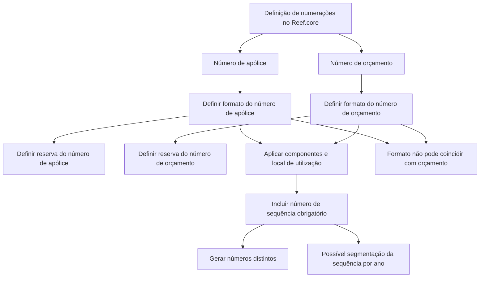

# Definição de Numeração no Reef.core: Números de Apólice e Orçamento

## 1. Metadados do Documento
- **Arquivo de Origem:** Não identificado no conteúdo extraído
- **Tipo de Documento:** Procedimento / Especificação Funcional
- **Domínio / Sistema:** Reef.core / DOCUMENTACIÓN Reef
- **Público-Alvo:** Não especificado; o conteúdo aborda definição funcional de numerações de apólices e orçamentos
- **Data/Versão Identificada:** Não identificada
- **Owner identificado:** `user:agonzalez_mapfre.com`
- **Lifecycle identificado:** `Approved`

---

## 2. Resumo Executivo & Contexto de Negócio

O documento descreve a definição de numerações para elementos que possuem um número, citando explicitamente o número de apólice e o número de orçamento. O objetivo é determinar como esses números serão formados no contexto do Reef.core.

As numerações não são pré-configuradas no Reef.core. Portanto, a organização deve definir como os números serão criados. O documento informa que existem componentes que, dependendo deles e do local em que são utilizados, determinam como será a numeração.

Após definir a composição de cada número, é necessário gerar reservas de sequências. O processo é apresentado separadamente para número de apólice e número de orçamento, e ambos possuem duas etapas: definir o formato e definir a reserva.

Uma regra essencial impede que os números de apólice e de orçamento compartilhem o mesmo formato. A composição deve garantir que ambos não coincidam. Além disso, toda numeração deve conter um número de sequência que produza números distintos e deve assegurar disponibilidade de números ao longo do tempo.

O documento apresenta o ano de geração como um recurso possível para compor a numeração. Nesse modelo, as sequências são separadas por ano, permitindo, por exemplo, a existência de uma sequência número um em 2022 e outra sequência número um em 2023.

---

## 3. Arquitetura, Componentes & Tecnologias Envolvidas

Os elementos explicitamente citados são:

| Componente / Elemento | Papel identificado no documento |
| :--- | :--- |
| `Reef.core` | Sistema no qual as numerações não estão previamente configuradas. |
| Número de apólice | Elemento que necessita de definição de formato e reserva de numeração. |
| Número de orçamento | Elemento que necessita de definição de formato e reserva de numeração. |
| Componentes de numeração | Componentes mencionados como influenciadores da forma da numeração, em conjunto com o local em que são utilizados. |
| Sequência | Elemento obrigatório em toda numeração para gerar números distintos. |
| Ano de geração | Recurso citado para compor a numeração e segmentar sequências por ano. |
| DOCUMENTACIÓN Reef | Área ou contexto documental exibido na extração. |
| Mapfredocument | Termo exibido no cabeçalho/rodapé documental. |



**Nota de Análise:** O documento menciona componentes e o local em que a numeração se encontra como fatores de determinação do formato, mas não identifica os nomes dos componentes, regras de composição, serviços, métodos HTTP, contratos JSON, banco de dados ou interfaces técnicas envolvidas.

---

## 4. Regras de Negócio, Especificações Funcionais & Processos

### 4.1 Objetivo funcional

A definição de numeração deve determinar como serão formados os elementos que possuem um número, incluindo:

- Número de apólice.
- Número de orçamento.

### 4.2 Premissa do Reef.core

As numerações não estão pré-configuradas no Reef.core. Por isso, é necessário determinar como os números serão criados.

A composição da numeração depende de:

1. Uma série de componentes disponíveis.
2. O local em que a numeração se encontra.

### 4.3 Regras obrigatórias de numeração

1. **Diferença entre formato de apólice e orçamento**  
   As numerações de apólice e orçamento não podem coincidir em formato.

2. **Prevenção de coincidência entre números**  
   O formato deve ser composto por elementos diferentes e/ou estar em locais diferentes, assegurando que um número de apólice e um número de orçamento não coincidam.

3. **Sequência obrigatória**  
   Toda numeração deve conter um número de sequência que permita obter números distintos.

4. **Sustentação temporal da numeração**  
   A composição deve garantir números suficientes ao longo do tempo.

5. **Ano como recurso de composição**  
   O ano em que o número é gerado pode ser incluído no número.

6. **Sequência por ano**  
   Quando o ano é incluído, as sequências podem ser formadas por ano. O documento exemplifica que pode existir:
   - Um número de sequência um para o ano de 2022.
   - Outro número de sequência um para o ano de 2023.
   - E assim sucessivamente.

### 4.4 Processo para número de apólice

| Etapa | Ação | Resultado esperado descrito |
| :--- | :--- | :--- |
| 1 | Definir formato do número de apólice | Determinar a composição do número de apólice. |
| 2 | Definir reserva do número de apólice | Gerar ou definir a reserva associada à numeração de apólice. |

### 4.5 Processo para número de orçamento

| Etapa | Ação | Resultado esperado descrito |
| :--- | :--- | :--- |
| 1 | Definir formato do número de orçamento | Determinar a composição do número de orçamento. |
| 2 | Definir reserva do número de orçamento | Gerar ou definir a reserva associada à numeração de orçamento. |

**Nota de Análise:** O documento não detalha como a reserva de numeração é criada, persistida, consumida, liberada ou validada. Também não informa os formatos concretos de apólice ou orçamento.

---

## 5. Tabelas de Parâmetros, Ambientes e Estruturas de Dados

| Item / Parâmetro | Descrição / Função | Tipo / Valores / Formato | Ambiente / Observações |
| :--- | :--- | :--- | :--- |
| Número de apólice | Número associado à apólice. | Formato a definir. | O formato não pode coincidir com o formato de orçamento. |
| Reserva de número de apólice | Reserva necessária após definir a composição do número de apólice. | Não detalhado. | Processo apresentado como etapa 2 da numeração de apólice. |
| Número de orçamento | Número associado ao orçamento. | Formato a definir. | O formato não pode coincidir com o formato de apólice. |
| Reserva de número de orçamento | Reserva necessária após definir a composição do número de orçamento. | Não detalhado. | Processo apresentado como etapa 2 da numeração de orçamento. |
| Número de sequência | Permite gerar números distintos. | Obrigatório em toda numeração. | Deve fazer parte da composição de uma numeração. |
| Ano de geração | Recurso possível para compor a numeração. | Exemplo citado: 2022 e 2023. | Pode permitir sequências independentes por ano. |
| Componentes de numeração | Fatores que, juntamente com o local, determinam a numeração. | Não detalhado. | Os nomes e comportamentos dos componentes não foram informados. |
| Local da numeração | Contexto/local que influencia a determinação da numeração. | Não detalhado. | Pode contribuir para diferenciar formato de apólice e orçamento. |
| Reef.core | Sistema que requer configuração de numerações. | Sistema citado nominalmente. | As numerações não estão pré-configuradas. |
| Owner | Responsável identificado na página documental. | `user:agonzalez_mapfre.com` | Exibido no conteúdo bruto. |
| Lifecycle | Estado identificado na página documental. | `Approved` | Exibido no conteúdo bruto. |

---

## 6. Bateria de Perguntas & Respostas para RAG (FAQ Sintético)

### P1: Qual é o objetivo da definição de numeração no Reef.core?
**R:** O objetivo é determinar como serão formados os elementos que possuem um número, incluindo o número de apólice e o número de orçamento.

### P2: As numerações já estão configuradas previamente no Reef.core?
**R:** Não. O documento afirma que as numerações não estão pré-configuradas no Reef.core, sendo necessário determinar como os números serão criados.

### P3: Quais fatores determinam como será uma numeração?
**R:** O documento informa que há uma série de componentes que, dependendo desses componentes e do local em que a numeração se encontra, determinarão como será a numeração. Os componentes específicos e os locais não são detalhados.

### P4: O formato do número de apólice pode ser igual ao formato do número de orçamento?
**R:** Não. As numerações de apólice e orçamento não podem coincidir no formato. Elas devem ser compostas por elementos distintos e/ou estar em locais distintos para evitar que um número de apólice coincida com um número de orçamento.

### P5: Qual elemento deve estar presente em toda numeração?
**R:** Toda numeração deve conter um número de sequência, pois o número de sequência permite obter números distintos.

### P6: Como o ano pode ser usado na composição de uma numeração?
**R:** O ano em que o número é gerado pode ser incluído na composição da numeração. Nesse caso, as sequências podem ser formadas por ano, contribuindo para evitar repetição de números ao longo do tempo.

### P7: Qual exemplo de sequência anual é apresentado no documento?
**R:** O documento exemplifica que pode existir um número de sequência um para o ano de 2022 e outro número de sequência um para o ano de 2023, e assim sucessivamente.

### P8: Qual é o processo definido para criar a numeração de uma apólice?
**R:** O processo tem duas etapas: primeiro, definir o formato do número de apólice; depois, definir a reserva do número de apólice.

### P9: Qual é o processo definido para criar a numeração de um orçamento?
**R:** O processo tem duas etapas: primeiro, definir o formato do número de orçamento; depois, definir a reserva do número de orçamento.

### P10: O documento define o formato concreto de número de apólice?
**R:** Não. O documento estabelece que o formato do número de apólice deve ser definido, mas não apresenta uma máscara, estrutura, tamanho, prefixo ou exemplo concreto de formato.

### P11: O documento explica como implementar a reserva de números?
**R:** Não. O documento identifica a definição da reserva como uma etapa necessária para apólice e orçamento, mas não descreve implementação, armazenamento, consumo, concorrência ou regras de expiração da reserva.

### P12: Por que a composição da numeração deve assegurar números suficientes ao longo do tempo?
**R:** A composição deve assegurar disponibilidade de números no decorrer do tempo e evitar repetição. O documento cita a inclusão do ano como um recurso que permite formar sequências separadas por ano.

---

## 7. Glossário de Termos, Siglas & Conceitos-Chave

- **Reef.core:** Sistema citado no documento como ambiente no qual as numerações não estão pré-configuradas.
- **Número de apólice:** Número associado a uma apólice; requer definição de formato e reserva.
- **Número de orçamento:** Número associado a um orçamento; requer definição de formato e reserva.
- **Numeração:** Composição definida para formar um número de apólice, orçamento ou outro elemento numerado.
- **Número de sequência:** Elemento obrigatório de uma numeração, utilizado para obter números distintos.
- **Reserva de numeração:** Etapa prevista após a definição do formato de número de apólice ou orçamento; mecanismo não detalhado no documento.
- **Componentes:** Elementos não especificados que, em conjunto com o local, influenciam a determinação da numeração.
- **Mapfredocument:** Termo exibido no conteúdo documental, sem definição adicional.
- **Lifecycle:** Campo exibido com o valor `Approved`.
- **Owner:** Campo exibido com o valor `user:agonzalez_mapfre.com`.

---

## 8. Notas Críticas, Riscos & Limitações

- O documento não especifica a estrutura exata dos formatos de número de apólice e de orçamento.
- O documento não identifica os componentes que participam da formação da numeração.
- O documento não explica o significado operacional de “local” no contexto da composição da numeração.
- O documento não detalha como reservas de sequência são criadas, persistidas, atribuídas, consumidas ou controladas.
- Não são fornecidos contratos de API, métodos HTTP, tabelas de banco de dados, regras de concorrência, tratamento de falhas ou mecanismos de auditoria.
- A separação entre formatos de apólice e orçamento é uma regra crítica: a falta de elementos distintos e/ou locais distintos pode resultar em coincidência de numeração.
- A sequência é obrigatória. Uma composição sem sequência não atende à característica geral explicitada pelo documento.
- O uso do ano é apresentado como um recurso possível, não como obrigatoriedade.
- O conteúdo extraído contém o marcador `EN CONSTRUCCIÓN`, o que pode indicar que a documentação ou o processo estava em elaboração no momento da publicação.
- **Nota de Análise:** O documento lista o Reef.core e descreve etapas de definição e reserva, porém não detalha a implementação técnica dessas etapas.

---

## 9. Conteúdo Bruto Estruturado (Referência Fiel)

```text
--- [PÁGINA 1 DE 2] ---

Imagen LOGO
EN CONSTRUCCIÓN
DEFINICIÓN de numeración
Objetivo
Determinar como van a estar formados los distintos elementos que disponen de un número (como puede ser el número de póliza y el número
de presupuesto)
¿En qué consiste?
Las numeraciones no están prejadas en Reef.core por lo que es necesario determinar como se van a crear estos números. Para ello, se
disponen de una serie de componentes que dependiendo de ellos y del lugar en el que se encuentre determinará como será la numeración.
Además, una vez determinada la composición del número, hay que generar reservas por de secuencias
Características generales
Las numeraciones de póliza y presupuesto no pueden coincidir en el formato. Es decir, deben estar compuestas por distintos elementos
y/o estar en lugares distintos para asegurar que un número de póliza y presupuesto no van a coincidir
Siempre una numeración debe contener un número de secuencia que permita obtener números distintos.
La composición debe asegurar que existan números sucientes en el tiempo. Un recurso muy utilizado es incluir en el número, el año en
el que se ha generado, por lo que las secuencias se formarán por año y esto asegurará que el número no se repite (existirá un numero de
secuencia uno para el año 2022, otro número de secuencia uno para el año 2023, y así sucesivamente)
Proceso a seguir
Número de póliza
DEFINIR
formato
número
de póliza
(1)
DEFINIR
reserva
número
de póliza
(2)
1. DEFINIR formato número de póliza
1. DEFINIR reserva número de póliza
Número de presupuesto
Documentation / DOCUMENTACIÓN Reef
DOCUMENTACIÓN Reef
Mapfredocument
DOCUMENTACIÓN Reef
Owner
user:agonzalez_mapfre.com
Lifecycle
Approved Source
 / 
 VL
Buscar Inicio Soluciones Arquitecturas APIs Componentes Cloud Documentación Zeus Reef Ayuda
ES


--- [PÁGINA 2 DE 2] ---

DEFINIR
formato
número
de presupuesto
(1)
DEFINIR
reserva
número
de presupuesto
(2)
1. DEFINIR formato número de presupuesto
1. DEFINIR reserva número de presupuesto
```
