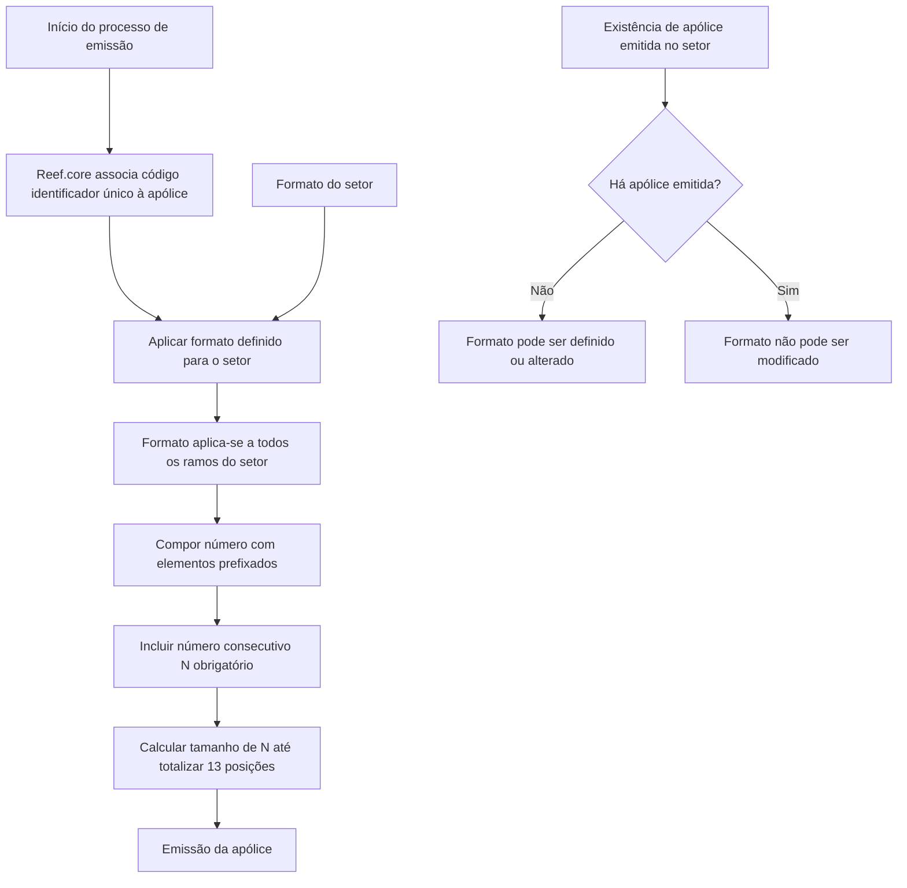
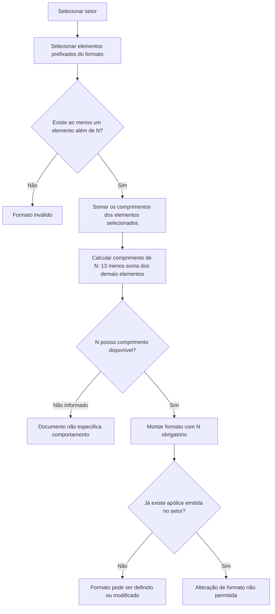

# Definição do Formato do Número de Apólice — Reef.core

## 1. Metadados do Documento
- **Arquivo de Origem:** Não identificado no conteúdo fornecido
- **Tipo de Documento:** Especificação Técnica
- **Domínio / Sistema:** Reef.core / Documentación Reef / Mapfre
- **Público-Alvo:** Desenvolvedores, Arquitetos, Analistas Funcionais e Operação
- **Data/Versão Identificada:** Não identificada
- **Owner identificado:** `user:agonzalez_mapfre.com`
- **Lifecycle identificado:** Approved Source / VL

---

## 2. Resumo Executivo & Contexto de Negócio

O documento define as regras para composição do número de apólice no processo de emissão de apólices e contratos do sistema Reef.core. Durante a emissão, Reef.core associa automaticamente e de forma unívoca um código identificador a cada apólice desde o início do processo.

Após o término do processo de emissão, a codificação do número de apólice pode ser modificada conforme a definição do ramo. A definição do formato é realizada por setor e aplica-se a todos os ramos pertencentes ao setor definido.

O número de apólice pode ser formado por elementos prefixados, como companhia, setor, ramo, níveis da estrutura comercial, ano e número consecutivo. O comprimento máximo permitido para o número de apólice é de 13 posições.

O elemento de número consecutivo, identificado pela abreviatura `N`, é obrigatório. Seu tamanho não é fixo: ele deve ocupar todas as posições restantes até completar o limite máximo de 13 posições, depois de descontados os demais elementos que compõem o formato.

A configuração possui uma restrição de imutabilidade: o formato não pode ser modificado depois que houver alguma apólice emitida em um setor. Além disso, o formato deve conter, além do número consecutivo, pelo menos um elemento adicional de numeração.

---

## 3. Arquitetura, Componentes & Tecnologias Envolvidas

O conteúdo identifica o sistema **Reef.core** como responsável pelo processo de emissão de apólices e contratos e pela atribuição automática e unívoca do código identificador da apólice. A definição do formato ocorre no escopo de **setor** e afeta todos os **ramos** associados a esse setor.

Não são detalhados métodos HTTP, contratos JSON, banco de dados, tecnologias de implementação, ambientes técnicos, servidores ou integrações externas.



### Componentes e conceitos identificados

| Componente / Conceito | Descrição sustentada pelo documento |
| :--- | :--- |
| Reef.core | Sistema no qual o processo de emissão de apólices e contratos associa automaticamente um código identificador a cada apólice. |
| Processo de emissão | Processo que inicia a associação automática e unívoca do código identificador da apólice. |
| Apólice | Entidade que recebe um número/código identificador e pode ter sua codificação modificada ao término da emissão conforme a definição do ramo. |
| Contrato | Entidade mencionada junto às apólices no processo de emissão do Reef.core. |
| Setor | Escopo no qual o formato do número de apólice é definido; a configuração é aplicável a todos os ramos do setor. |
| Ramo | Elemento possível da composição do número de apólice e referência para eventual modificação de codificação ao final da emissão. |
| Estrutura comercial | Estrutura com primeiro, segundo e terceiro níveis, cujos níveis podem integrar o formato do número de apólice. |

---

## 4. Regras de Negócio, Especificações Funcionais & Processos

### Regras para definição do formato

1. O processo de emissão de apólices e contratos no Reef.core associa automaticamente e de forma unívoca um código identificador a cada apólice desde o início do processo de emissão.
2. Ao término do processo de emissão, a codificação pode ser modificada de acordo com a definição do ramo.
3. Existem elementos prefixados que podem participar da formação do número de apólice.
4. A definição de formato é realizada por setor.
5. A definição de formato configurada para um setor aplica-se a todos os ramos daquele setor.
6. O formato não pode ser modificado depois que exista alguma apólice emitida no setor.
7. O tamanho máximo do número de apólice é de **13 posições**.
8. O elemento número consecutivo, abreviado como `N`, é obrigatório.
9. O tamanho do número consecutivo é calculado como a quantidade de posições que faltam para chegar a 13, após descontar os tamanhos dos demais elementos utilizados no formato.
10. Além do número consecutivo, deve existir pelo menos um elemento adicional na formação da numeração.
11. O documento não detalha validações de caracteres, preenchimento com zeros, regras de reinicialização do consecutivo, unicidade técnica do consecutivo entre setores ou ramos, nem critérios para alteração da codificação após a emissão.

### Processo de composição do número de apólice



### Exemplos de formato fornecidos

- `RRRAANNNNNNNN`: numeração formada por **ramo**, **ano** e **consecutivo**.
- `RRRAA222NNNNN`: numeração formada por **ramo**, **ano**, **segundo nível da estrutura comercial** e **consecutivo**.

---

## 5. Tabelas de Parâmetros, Ambientes e Estruturas de Dados

| Item / Parâmetro | Descrição / Função | Tipo / Valores / Formato | Ambiente / Observações |
| :--- | :--- | :--- | :--- |
| Comprimento máximo do número de apólice | Limite total de posições para o formato de numeração da apólice. | `13` posições | Regra geral do formato de apólice. |
| Companhia | Elemento prefixado disponível para compor o número de apólice. | Comprimento: `2`; abreviatura: `C` | Opcional conforme a definição do formato. |
| Setor | Elemento prefixado disponível para compor o número de apólice; também é o escopo de configuração do formato. | Comprimento: `2`; abreviatura: `S` | O formato definido por setor aplica-se a todos os ramos do setor. |
| Ramo | Elemento prefixado disponível para compor o número de apólice. | Comprimento: `3`; abreviatura: `R` | A codificação pode ser modificada ao fim da emissão conforme a definição do ramo. |
| Estrutura comercial — primeiro nível | Elemento prefixado disponível para compor o número de apólice. | Comprimento: `2`; abreviatura: `1` | Opcional conforme a definição do formato. |
| Estrutura comercial — segundo nível | Elemento prefixado disponível para compor o número de apólice. | Comprimento: `3`; abreviatura: `2` | Utilizado no exemplo `RRRAA222NNNNN`. |
| Estrutura comercial — terceiro nível | Elemento prefixado disponível para compor o número de apólice. | Comprimento: `3`; abreviatura: `3` | Opcional conforme a definição do formato. |
| Ano | Elemento prefixado disponível para compor o número de apólice. | Comprimento: `2`; abreviatura: `A` | Utilizado nos exemplos fornecidos. |
| Número consecutivo | Elemento obrigatório da formação do número de apólice. | Comprimento: variável; abreviatura: `N` | Deve preencher as posições restantes até o total de 13. |
| Regra de cálculo de `N` | Define o tamanho do número consecutivo. | `13 - soma dos comprimentos dos demais elementos` | Obrigatório em todo formato. |
| Elemento adicional obrigatório | Exigência mínima de composição. | Pelo menos um elemento além de `N` | Um formato contendo somente `N` não atende à regra apresentada. |
| Alteração de formato | Restrição sobre manutenção da definição configurada por setor. | Não permitida após emissão de alguma apólice no setor | Restrição vinculada ao setor, não apenas a um ramo individual. |
| Exemplo 1 | Formato composto por ramo, ano e consecutivo. | `RRRAANNNNNNNN` | `R=3`, `A=2`, `N=8`; total de 13 posições. |
| Exemplo 2 | Formato composto por ramo, ano, segundo nível da estrutura comercial e consecutivo. | `RRRAA222NNNNN` | `R=3`, `A=2`, `2=3`, `N=5`; total de 13 posições. |

---

## 6. Bateria de Perguntas & Respostas para RAG (FAQ Sintético)

### P1: Qual sistema associa automaticamente o código identificador das apólices?
**R:** O sistema Reef.core associa automaticamente e de maneira unívoca um código identificador a todas as apólices desde o início do processo de emissão de apólices e contratos.

### P2: Em qual momento o código identificador da apólice é atribuído?
**R:** O código identificador é associado à apólice desde o momento em que o processo de emissão é iniciado no Reef.core.

### P3: O formato do número de apólice é configurado por ramo ou por setor?
**R:** O formato do número de apólice é definido por setor. A configuração definida para um setor aplica-se a todos os ramos pertencentes a esse setor.

### P4: É possível alterar o formato do número de apólice depois de emitir uma apólice?
**R:** Não. O formato não pode ser modificado quando já existir alguma apólice emitida no setor correspondente à definição de formato.

### P5: Qual é o tamanho máximo permitido para o número de apólice?
**R:** O tamanho máximo permitido para o número de apólice é de 13 posições.

### P6: O número consecutivo é opcional no formato de apólice?
**R:** Não. O número consecutivo, representado pela abreviatura `N`, é obrigatório em qualquer formato de número de apólice.

### P7: Como é definido o comprimento do número consecutivo `N`?
**R:** O comprimento do elemento `N` é a quantidade de posições necessária para completar 13 posições no total, após subtrair os comprimentos dos demais elementos utilizados na formação do número de apólice.

### P8: Um formato composto apenas pelo número consecutivo é válido?
**R:** Não. Além do elemento obrigatório número consecutivo (`N`), deve existir pelo menos um elemento adicional na formação da numeração da apólice.

### P9: Quais elementos podem integrar o formato do número de apólice?
**R:** Os elementos disponíveis são companhia (`C`), setor (`S`), ramo (`R`), estrutura comercial de primeiro nível (`1`), estrutura comercial de segundo nível (`2`), estrutura comercial de terceiro nível (`3`), ano (`A`) e número consecutivo (`N`).

### P10: Qual composição é representada pelo formato `RRRAANNNNNNNN`?
**R:** O formato `RRRAANNNNNNNN` representa uma numeração composta pelo ramo (`RRR`), ano (`AA`) e número consecutivo (`NNNNNNNN`).

### P11: Qual composição é representada pelo formato `RRRAA222NNNNN`?
**R:** O formato `RRRAA222NNNNN` representa uma numeração composta pelo ramo (`RRR`), ano (`AA`), segundo nível da estrutura comercial (`222`) e número consecutivo (`NNNNN`).

### P12: O documento define como o número consecutivo é reiniciado ou incrementado?
**R:** Não. O documento estabelece que o número consecutivo é obrigatório e que seu comprimento completa o limite de 13 posições, mas não detalha regras de incremento, reinicialização, preenchimento com zeros ou escopo de unicidade.

---

## 7. Glossário de Termos, Siglas & Conceitos-Chave

- **Reef.core:** Sistema mencionado como responsável pelo processo de emissão de apólices e contratos e pela associação automática do código identificador.
- **Apólice:** Entidade cujo número ou código identificador é formado conforme regras configuradas.
- **Contrato:** Entidade mencionada no processo de emissão junto às apólices.
- **Emissão:** Processo no qual o Reef.core associa automaticamente e de forma unívoca o código identificador à apólice.
- **Setor:** Escopo de definição do formato do número de apólice; a configuração se aplica a todos os ramos do setor.
- **Ramo:** Elemento possível da formação do número de apólice e referência para alteração de codificação ao término da emissão.
- **Estrutura comercial:** Estrutura composta por primeiro, segundo e terceiro níveis, que podem ser utilizados na formação do número da apólice.
- **Número consecutivo (`N`):** Elemento obrigatório cuja extensão ocupa as posições restantes do limite de 13 caracteres.
- **Companhia (`C`):** Elemento de duas posições disponível para a formação do formato.
- **Setor (`S`):** Elemento de duas posições disponível para a formação do formato.
- **Ramo (`R`):** Elemento de três posições disponível para a formação do formato.
- **Primeiro nível (`1`):** Elemento de dois caracteres da estrutura comercial.
- **Segundo nível (`2`):** Elemento de três caracteres da estrutura comercial.
- **Terceiro nível (`3`):** Elemento de três caracteres da estrutura comercial.
- **Ano (`A`):** Elemento de duas posições disponível para a formação do formato.
- **Mapfre:** Nome exibido na área de documentação do conteúdo extraído.
- **VL:** Valor exibido junto ao lifecycle `Approved Source`; o significado não é detalhado no conteúdo.

---

## 8. Notas Críticas, Riscos & Limitações

- A configuração do formato é bloqueada após a existência de uma apólice emitida no setor, o que torna indispensável validar o formato antes da primeira emissão no setor.
- O documento não detalha um mecanismo de migração, exceção ou reversão para configurações já bloqueadas pela emissão de apólices.
- O documento não informa como o sistema assegura tecnicamente a unicidade do número consecutivo.
- Não há detalhamento sobre o escopo do consecutivo: o conteúdo não informa se a sequência é exclusiva por setor, ramo, companhia, ano ou outra combinação.
- Não são especificadas regras de preenchimento, caracteres permitidos, formatação, truncamento ou validação do conteúdo de cada elemento.
- Não são apresentados métodos HTTP, contratos JSON, tabelas de banco de dados, interfaces de usuário, APIs, logs, URLs, ambientes, servidores, versões de software ou dependências técnicas.
- **Nota de Análise:** O conteúdo lista o sistema Reef.core e os elementos de formação do número de apólice, porém não detalha como a configuração é persistida, administrada ou integrada a outros componentes.

---

## 9. Conteúdo Bruto Estruturado (Referência Fiel)

```text
--- [PÁGINA 1 DE 2] ---

DEFINICIÓN del formato del número de póliza
Objetivo
El proceso de emisión de pólizas y contratos en Reef.core asocia de manera automática y unívocamente un código identificador a todas y
cada una de las pólizas desde el momento que inicia el proceso de emisión. Si bien y al término del mismo es factible modificar esta
codificación de acuerdo a la definición del ramo.
Existen algunos puntos a tener en cuenta:
Existen unos elementos prefijados que pueden intervenir en el formato del número de póliza. Esta definición de formato se realiza por
sector y aplica a todos los ramos del sector definido
El formato no se puede modificar una vez haya alguna póliza emitida de un sector
El tamaño máximo del número de póliza es de 13 posiciones
Los elementos que pueden intervenir en el formato de póliza son:
ELEMENTO LONGITUD ABREVIATURA
Compañía 2 C
Sector 2 S
Ramo 3 R
Estructura comercial - primer nivel 2 1
Estructura comercial - segundo nivel 3 2
Estructura comercial - tercer nivel 3 3
Año 2 A
Nº consecutivo ¿? N
Existen unas reglas a cumplir cuando se define la formación del número de póliza:
1. El elemento número consecutivo (N) es obligatorio y la longitud de este elemento es el valor que falta para llegar a la longitud máxima del
número de póliza (13) una vez descontados los elementos que forman el número
Documentation / DOCUMENTACIÓN Reef
DOCUMENTACIÓN Reef
Mapfredocument
DOCUMENTACIÓN Reef
Owner
user:agonzalez_mapfre.com
Lifecycle
Approved Source
/
VL
Buscar Inicio Soluciones Arquitecturas APIs Componentes Cloud Documentación Zeus Reef Ayuda
ES


--- [PÁGINA 2 DE 2] ---

2. Al menos debe existir un elemento que forme parte de la numeración adicional al número consecutivo
Tomando los valores de las columnas abreviatura y longitud, se muestran ejemplos de formato:
RRRAANNNNNNNN: Numeración formada por el ramo, año y consecutivo
RRRAA222NNNNN: Numeración formada por el ramo, año, segundo nivel de la estructura comercial y consecutivo
```
