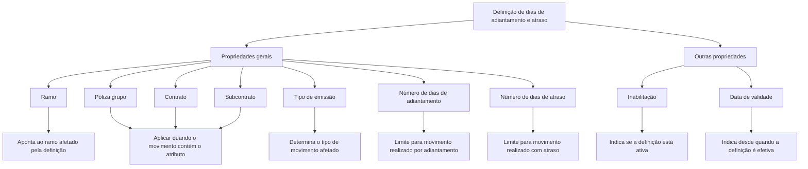

# Definição de Dias de Adiantamento e Atraso na Emissão — Documentação Reef

## 1. Metadados do Documento
- **Arquivo de Origem:** Não identificado no conteúdo fornecido
- **Tipo de Documento:** Especificação Funcional
- **Domínio / Sistema:** Reef / Emissão
- **Público-Alvo:** Não identificado explicitamente
- **Data/Versão Identificada:** Não identificada

---

## 2. Resumo Executivo & Contexto de Negócio

O documento descreve uma definição utilizada no processo de emissão para controlar a quantidade de dias em que determinado tipo de movimento pode ser realizado antecipadamente ou com atraso. O controle é configurado por meio de propriedades gerais e outras propriedades da definição.

A aplicabilidade da definição pode ser delimitada por ramo, póliza grupo, contrato, subcontrato e tipo de emissão. Quando póliza grupo, contrato ou subcontrato são especificados, a definição é aplicada quando um tipo de movimento contém a informação do atributo correspondente.

Os limites operacionais são estabelecidos pelos campos “Número de dias de adiantamento” e “Número de dias de atraso”. A definição também possui controles de ativação, por meio da propriedade de inabilitação, e de vigência, por meio da data de validade.

---

## 3. Arquitetura, Componentes & Tecnologias Envolvidas

O conteúdo fornecido não detalha arquitetura técnica, integrações, microsserviços, APIs, tecnologias, ambientes, URLs operacionais ou contratos de dados. O documento referencia a documentação Reef, a emissão e elementos de navegação contendo “Mapfredocument”.

A estrutura funcional descrita relaciona uma definição de controle aos atributos de um movimento de emissão e aos limites de dias permitidos para adiantamento e atraso.



> **Nota de Análise:** O documento não detalha o comportamento do sistema quando os limites de dias são excedidos, nem descreve validações, mensagens de erro, métodos HTTP, contratos JSON ou componentes técnicos responsáveis pela aplicação da regra.

---

## 4. Regras de Negócio, Especificações Funcionais & Processos

1. Existe a possibilidade de controlar o número de dias com os quais um tipo de movimento pode ser realizado de forma antecipada ou com atraso na emissão.
2. A definição possui propriedades gerais e outras propriedades.
3. O campo **Ramo** aponta para o ramo afetado pela definição.
4. O campo **Póliza grupo**, quando especificado, faz com que a definição seja aplicada quando for realizado um tipo de movimento que contenha a informação desse atributo.
5. O campo **Contrato**, quando especificado, faz com que a definição seja aplicada quando for realizado um tipo de movimento que contenha a informação desse atributo.
6. O campo **Subcontrato**, quando especificado, faz com que a definição seja aplicada quando for realizado um tipo de movimento que contenha a informação desse atributo.
7. O campo **Tipo de emissão** determina o tipo de movimento afetado pela definição.
8. O campo **Número de dias de adiantamento** especifica quantos dias antes é permitido realizar um movimento.
9. O campo **Número de dias de atraso** especifica quantos dias depois é permitido realizar um movimento com atraso.
10. A propriedade **Inabilitação** especifica se a definição está ativa ou não.
11. A propriedade **Data de validade** indica a partir de quando a definição é efetiva.

---

## 5. Tabelas de Parâmetros, Ambientes e Estruturas de Dados

| Item / Parâmetro | Descrição / Função | Tipo / Valores / Formato | Ambiente / Observações |
| :--- | :--- | :--- | :--- |
| Ramo | Aponta ao ramo afetado pela definição. | Não informado | Propriedade geral |
| Póliza grupo | Restringe a aplicação da definição a movimentos que contenham a informação do atributo, quando especificada. | Não informado | Propriedade geral |
| Contrato | Restringe a aplicação da definição a movimentos que contenham a informação do atributo, quando especificado. | Não informado | Propriedade geral |
| Subcontrato | Restringe a aplicação da definição a movimentos que contenham a informação do atributo, quando especificado. | Não informado | Propriedade geral |
| Tipo de emissão | Determina o tipo de movimento afetado. | Não informado | Propriedade geral |
| Número de dias de adiantamento | Especifica quantos dias antecipadamente um movimento pode ser realizado. | Número de dias; formato não informado | Propriedade geral |
| Número de dias de atraso | Especifica quantos dias de atraso são permitidos para realizar um movimento. | Número de dias; formato não informado | Propriedade geral |
| Inabilitação | Indica se a definição está ativa ou não. | Não informado | Outras propriedades |
| Data de validade | Indica a partir de quando a definição é efetiva. | Data; formato não informado | Outras propriedades |
| Owner | `user:agonzalez_mapfre.com` | Identificador de usuário | Conteúdo de navegação/documentação |
| Lifecycle | `Approved` | Estado textual | Conteúdo de navegação/documentação |
| Source | `VL` | Valor textual | Conteúdo de navegação/documentação |

---

## 6. Bateria de Perguntas & Respostas para RAG (FAQ Sintético)

### P1: Qual é o objetivo da definição de dias de adiantamento e atraso?
**R:** O objetivo é controlar o número de dias com os quais um tipo de movimento pode ser realizado de forma antecipada ou com atraso no processo de emissão.

### P2: Qual propriedade identifica o ramo afetado pela definição?
**R:** A propriedade **Ramo** aponta para o ramo que afeta a definição.

### P3: Quando uma definição com póliza grupo especificada é aplicada?
**R:** Quando a póliza grupo é especificada, a definição é aplicada quando é realizado um tipo de movimento que contenha a informação do atributo póliza grupo.

### P4: Como o campo Contrato influencia a aplicação da definição?
**R:** Se o campo **Contrato** for especificado, a definição é aplicada quando for realizado um tipo de movimento que contenha a informação do atributo contrato.

### P5: Em que condição o Subcontrato torna a definição aplicável?
**R:** Se o campo **Subcontrato** for especificado, a definição é aplicada quando for realizado um tipo de movimento que contenha a informação do atributo subcontrato.

### P6: Qual campo determina o tipo de movimento impactado pela definição?
**R:** O campo **Tipo de emissão** determina o tipo de movimento afetado pela definição de dias de adiantamento e atraso.

### P7: O que define o Número de dias de adiantamento?
**R:** O campo **Número de dias de adiantamento** especifica quantos dias antecipadamente um movimento pode ser realizado.

### P8: O que define o Número de dias de atraso?
**R:** O campo **Número de dias de atraso** especifica quantos dias de atraso são permitidos para realizar um movimento com atraso.

### P9: Como verificar se uma definição está ativa?
**R:** A propriedade **Inabilitação** especifica se a definição está ativa ou não.

### P10: Qual é a função da Data de validade?
**R:** A **Data de validade** indica a partir de quando a definição é efetiva.

---

## 7. Glossário de Termos, Siglas & Conceitos-Chave

- **Ramo:** Elemento que aponta para o ramo afetado pela definição.
- **Póliza grupo:** Atributo que, quando especificado, condiciona a aplicação da definição a movimentos que contenham essa informação.
- **Contrato:** Atributo que, quando especificado, condiciona a aplicação da definição a movimentos que contenham essa informação.
- **Subcontrato:** Atributo que, quando especificado, condiciona a aplicação da definição a movimentos que contenham essa informação.
- **Tipo de emissão:** Campo que determina o tipo de movimento afetado.
- **Movimento:** Tipo de operação realizada no contexto de emissão; o documento não fornece detalhamento adicional.
- **Inabilitação:** Propriedade que especifica se a definição está ativa ou não.
- **Data de validade:** Propriedade que indica desde quando a definição é efetiva.
- **Reef:** Nome referenciado na documentação fornecida; o documento não expande ou define o termo.
- **VL:** Valor exibido como fonte no conteúdo de navegação; o documento não explica seu significado.

---

## 8. Notas Críticas, Riscos & Limitações

- O conteúdo não informa valores permitidos, formato, mínimo ou máximo para os campos de dias de adiantamento e atraso.
- O documento não especifica se os campos póliza grupo, contrato e subcontrato podem ser utilizados simultaneamente nem como critérios combinados são avaliados.
- O documento não descreve a consequência funcional ou técnica de tentar realizar um movimento fora dos limites configurados.
- Não há detalhamento sobre persistência de dados, APIs, integrações, responsabilidades de componentes ou trilhas de auditoria.
- Não foram identificados ambiente, versão, data de publicação ou URL operacional.
- O texto extraído apresenta caracteres corrompidos em termos como `denición`, `especica` e `cuantos`, preservados na referência bruta abaixo.

---

## 9. Conteúdo Bruto Estruturado (Referência Fiel)

```text
--- [PÁGINA 1 DE 2] ---

DEFINICIÓN de días de adelanto y atraso
Objetivo
Existe la posibilidad de controlar el número de días con los que se puede realizar un tipo de movimiento en emisión de forma adelantada o
con retraso.
-Propiedades generales
-Otras propiedades
Propiedades generales
Ramo
Apunta al ramo que afecta la denición.
Póliza grupo
Si se especica, la denición aplicará cuando se realice un tipo de movimiento que contenga la información del atributo.
Contrato
Si se especica, la denición aplicará cuando se realice un tipo de movimiento que contenga la información del atributo.
Subcontrato
Si se especica, la denición aplicará cuando se realice un tipo de movimiento que contenga la información del atributo.
Tipo de emisión
Determina el tipo de movimiento afectado.
Número de días de adelanto
Especica cuantos días se puede realizar un movimiento por adelantado.
Número de días de retraso
Especica cuantos días se puede realizar un movimiento con retraso.
Ejemplo:
Documentation / DOCUMENTACIÓN Reef
DOCUMENTACIÓN Reef
Mapfredocument
DOCUMENTACIÓN Reef
Owner
user:agonzalez_mapfre.com
Lifecycle
Approved Source
 / 
 VL
Buscar Inicio Soluciones Arquitecturas APIs Componentes Cloud Documentación Zeus Reef Ayuda
ES


--- [PÁGINA 2 DE 2] ---

Otras Propiedades
Inhabilitación
Especica si la denición está activa o no.
Fecha de validez
Indica a partir de cuando la denición es efectiva.
```
