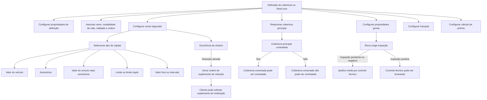

# Definição de Cobertura no Reef.core: Propriedades, Soma Assegurada, Franquia e Cálculo de Prêmio

## 1. Metadados do Documento
- **Arquivo de Origem:** Não identificado no conteúdo fornecido
- **Tipo de Documento:** Especificação Técnica / Documentação Funcional
- **Domínio / Sistema:** Reef.core / Seguros / Coberturas de apólice
- **Público-Alvo:** Desenvolvedores, Arquitetos, Analistas Funcionais, Operação de Emissão de Apólices
- **Data/Versão Identificada:** Não identificada
- **Proprietário identificado:** `user:agonzalez_mapfre.com`
- **Lifecycle identificado:** `Approved`
- **Fonte identificada:** `VL`

---

## 2. Resumo Executivo & Contexto de Negócio

O documento descreve a configuração e a definição de uma **cobertura** no sistema Reef.core. A cobertura é apresentada como a obrigação principal da seguradora em um contrato de seguro: assumir, até o limite da soma segurada, as consequências econômicas decorrentes de um sinistro. Portanto, a cobertura determina a resposta da companhia seguradora perante circunstâncias previstas na apólice.

A definição de cobertura estabelece tanto o comportamento de indenização quanto o custo suportado pelo cliente. A cobertura pode determinar o valor a indenizar quando determinadas circunstâncias ocorrem, o comportamento após uma prestação ou sinistro e o custo necessário para que o cliente obtenha a proteção contratada.

O documento organiza a configuração de cobertura em propriedades de definição, ramo, soma segurada, cobertura relacionada, propriedades gerais, franquia, cálculo, revalorização, comportamento em suplementos e validação. No conteúdo extraído, há detalhamento efetivo das propriedades de definição, ramo, soma segurada, cobertura relacionada, gerais, franquia e cálculo.

A configuração de cobertura influencia diretamente a emissão de novas apólices e aplicações, a contratação obrigatória ou opcional, a associação entre coberturas, a retenção por controle técnico, a cessão ao resseguro, o cálculo de comissões, a franquia e o cálculo de prêmio. Algumas decisões configuráveis também controlam o comportamento em suplementos, especialmente quando a soma segurada é modificada em consequência de sinistros ou por intervenção do usuário.

> **Nota de Análise:** O documento menciona propriedades de revalorização, comportamento em suplementos e validação como agrupamentos de atributos, mas não apresenta detalhamento funcional dessas propriedades nas cinco páginas fornecidas.

---

## 3. Arquitetura, Componentes & Tecnologias Envolvidas

### Sistemas, contextos e componentes identificados

| Componente / Termo | Papel identificado no documento |
| :--- | :--- |
| **Reef.core** | Sistema no qual são definidas e utilizadas as coberturas durante processos de emissão de apólices ou aplicações. |
| **Cobertura** | Elemento da apólice que define a obrigação de indenização da seguradora, o limite econômico aplicável e características de contratação. |
| **Apólice / Aplicação** | Artefato de negócio no qual a cobertura pode ser contratada, excluída, modificada ou utilizada para cálculo de tarifa, prêmio, comissões e franquias. |
| **Sinistro** | Evento que pode afetar uma cobertura e, quando aplicável, reduzir a soma segurada. |
| **Suplemento** | Operação utilizada, entre outras finalidades, para reduzir ou restituir soma segurada após um sinistro. |
| **Cobertura principal** | Cobertura à qual outra cobertura pode ser conectada. A contratação e exclusão da cobertura principal afetam as coberturas conectadas. |
| **Cobertura conectada** | Cobertura relacionada a uma cobertura principal; não pode ser contratada se a principal não for contratada. |
| **Ramo** | Contexto de negócio ao qual a definição de cobertura se aplica. |
| **Ramos com tratamento de vida** | Ramos em que pode ser definida uma modalidade de vida para a cobertura. |
| **Ramos com tratamento de automóvel** | Ramos nos quais a propriedade de acessórios é indicada como aplicável. |
| **Resseguro** | Destino possível de cessão de uma cobertura, quando configurada para ser cedida. |
| **Controle técnico** | Estado de retenção da apólice quando o risco exige inspeção e essa inspeção não ocorreu ou teve resultado negativo. |
| **Condições particulares** | Documento ou contexto de apresentação no qual uma cobertura não contratada pode ser exibida como excluída, se a impressão obrigatória estiver ativada. |

### Fluxo funcional representativo



> **Nota de Análise:** O material não descreve microsserviços, APIs, contratos JSON, protocolos de integração, infraestrutura, URLs de ambiente, portas ou pipelines de CI/CD.

---

## 4. Regras de Negócio, Especificações Funcionais & Processos

### 4.1 Conceito de cobertura

A cobertura é definida como a obrigação principal da seguradora em um contrato de seguro. Essa obrigação consiste em assumir, até o limite da soma segurada, as consequências econômicas decorrentes de um sinistro.

A cobertura é um dos elementos principais de uma apólice porque determina a resposta da companhia seguradora caso ocorram circunstâncias específicas. A cobertura constitui o elemento principal pelo qual a companhia efetua indenização a terceiros.

Uma cobertura fixa características relativas a duas ações principais:

1. Quando determinadas circunstâncias ocorrem, a cobertura indica o montante a indenizar e o comportamento após ser afetada por uma prestação.
2. A cobertura determina o custo que o cliente deve suportar para obter a proteção ou condição descrita.

### 4.2 Propriedades de definição

| Propriedade | Regra funcional |
| :--- | :--- |
| **Cobertura** | Define qual será o identificador da cobertura. |
| **Nome** | Define o nome pelo qual a cobertura aparecerá nos diferentes processos do Reef.core. |
| **Tipo** | Determina o comportamento da cobertura durante o processo de emissão e as características aplicáveis. O documento menciona um link externo com informações adicionais, mas esse conteúdo não foi fornecido. |

### 4.3 Propriedades de ramo

| Propriedade | Regra funcional |
| :--- | :--- |
| **Ramo** | Indica o ramo afetado pela definição da cobertura. |
| **Modalidade de vida** | Determina a modalidade à qual o atributo pertence, exclusivamente para ramos com tratamento de vida. |
| **Data de validade** | Define quando a definição estará disponível para uso. O uso correto permite manter histórico das alterações efetuadas na definição. |
| **Ordem** | Define a posição em que a cobertura aparecerá quando for solicitada. |

### 4.4 Propriedades de soma segurada

A soma segurada pode ter diferentes origens e comportamentos. O tipo de capital define a origem da soma segurada da cobertura.

| Tipo de capital | Regra funcional |
| :--- | :--- |
| **Valor do veículo** | Utiliza o valor do veículo, normalmente disponível em um atributo. |
| **Acessórios** | Utiliza a soma dos acessórios declarados no risco. |
| **Valor veículo mais acessórios** | Utiliza o valor do veículo acrescido da soma dos acessórios declarados no risco. |
| **Limite** | Utiliza uma lista detalhada de somas seguradas permitidas. |
| **Limite duplo** | Utiliza uma lista detalhada de somas seguradas permitidas, acompanhada do valor máximo indenizável para cada sinistro. |
| **Livre** | Permite que a soma segurada seja, em princípio, qualquer valor. |
| **Intervalo** | Define a soma segurada por faixas ou intervalos. |

#### Regras adicionais da soma segurada

| Propriedade | Regra funcional |
| :--- | :--- |
| **Moeda da soma segurada** | Deve ser informada quando a cobertura precisa ter soma segurada em moeda específica, independentemente da moeda de emissão da apólice. Se a soma segurada usar a mesma moeda da apólice, essa propriedade não deve ser informada. |
| **Soma segurada** | Pode ser informada diretamente na definição. Ao emitir uma nova apólice, a cobertura aparecerá com a soma segurada configurada. |
| **Lógica de negócio prévia à solicitação de informação** | Pode determinar a soma segurada da cobertura. Quando a cobertura não possui soma segurada, pode determinar se a cobertura será contratada ou não. |
| **Usuário pode modificar a soma segurada** | Define se a pessoa que cria ou modifica uma apólice ou aplicação pode alterar a soma segurada atribuída à cobertura. |
| **Soma segurada igual a zero** | Quando a cobertura possui soma segurada e essa soma é igual a zero, a cobertura é considerada não contratada, pois não é possível contratá-la sem soma segurada. |
| **Redução por ocorrência de sinistro** | Quando ativada, a soma segurada é reduzida sempre que o tratamento de um sinistro afeta a cobertura. |
| **Suplemento de redução** | Quando a redução por sinistro está ativada e o sinistro afeta a cobertura, é gerada uma ordem para realizar suplemento de redução de soma segurada por sinistro. |
| **Suplemento de restituição** | Se o cliente desejar restaurar a soma segurada após redução por sinistro, deve realizar um suplemento de restituição de soma segurada. |
| **Recalcular a soma segurada** | Quando existe lógica de negócio que calcula a soma segurada e essa soma pode ser modificada pelo usuário, deve-se decidir, em um suplemento, se a lógica será executada novamente ou se será respeitada a soma segurada informada pelo usuário. |

### 4.5 Coberturas relacionadas

| Propriedade | Regra funcional |
| :--- | :--- |
| **Cobertura com a qual se relaciona** | Permite estabelecer conexão com outra cobertura previamente definida. |
| **Cobertura principal** | A cobertura à qual outra cobertura é conectada é considerada principal. |
| **Contratação dependente** | Se a cobertura principal não for contratada, a cobertura conectada não poderá ser contratada. |
| **Exclusão dependente** | Se a cobertura principal for excluída, as coberturas conectadas também serão excluídas. |
| **Ações herdadas** | A cobertura conectada recebe as mesmas ações aplicadas à cobertura principal. |
| **Percentual de participação** | Define o percentual da soma segurada da cobertura principal que será assumido pela cobertura conectada. |

### 4.6 Propriedades gerais

| Propriedade | Regra funcional |
| :--- | :--- |
| **Contratação obrigatória** | Quando a cobertura é definida como obrigatória, o processo de emissão a contrata por padrão e a cobertura não pode ser excluída. |
| **Cobertura não obrigatória** | Em princípio, não aparece contratada. Deve ser realizada uma ação de contratação para incluí-la na apólice ou aplicação, exceto quando estiver relacionada a uma cobertura principal já contratada. |
| **Necessita de acessórios** | Indica que a cobertura exige a declaração dos acessórios do veículo. O documento informa que atualmente essa característica é aplicável a ramos com tratamento de automóvel. |
| **Inclusão de acessórios** | Quando a propriedade “Necessita de acessórios” está configurada, o processo de emissão pode incluir acessórios. |
| **Cessão ao resseguro** | Define se a cobertura deve ou não ser cedida ao resseguro. Quando indicada como ressegurada, posteriormente deve ser realizada a definição de como ocorrerão as cessões ao resseguro. |
| **Risco necessita de inspeção** | Define se a contratação da cobertura implica inspeção do risco. |
| **Retenção por controle técnico** | Se o risco requer inspeção e ela não ocorreu ou possui resultado negativo, a apólice fica retida por controle técnico. |
| **Liberação do controle técnico** | O controle técnico somente pode ser levantado após a inspeção do risco ter sido realizada e ter resultado positivo. |
| **Comissões de nova produção** | Define se serão calculadas comissões de nova produção quando a cobertura for contratada em uma apólice ou aplicação. |
| **Comissões de carteira** | Define se serão calculadas comissões de carteira quando a cobertura for contratada em uma apólice ou aplicação. |
| **Impressão obrigatória** | Quando ativada, indica que a cobertura deve aparecer como excluída nas condições particulares mesmo que não esteja contratada. Essa característica é uma intenção, pois a apresentação final depende da lógica responsável por mostrar as coberturas. |
| **Inabilitado** | Define se a cobertura está ativa ou se não pode mais ser incluída em uma nova apólice. |
| **Persistência em apólices existentes** | Mesmo quando a cobertura é inabilitada, as apólices que já a possuem continuam aplicando a cobertura até que seja efetuada alteração por suplemento. |
| **Seleção após suplemento** | Quando uma alteração por suplemento ocorre e a cobertura está inabilitada, não será mais possível selecioná-la. |
| **Ramo contábil** | Associa um ramo contábil à cobertura. Caso o ramo contábil dependa do valor de um atributo, a definição deve ser realizada dessa forma. |

### 4.7 Propriedades de franquia

| Propriedade | Regra funcional |
| :--- | :--- |
| **Tem franquia** | Define se a cobertura possui franquia. |
| **Moeda da franquia** | Determina se a franquia é expressa na mesma moeda da soma segurada da cobertura ou em moeda distinta. A regra aplica-se quando a franquia é um valor monetário. |
| **Lógica de negócio de franquia** | Pode associar uma lógica de negócio à franquia. |
| **Seleção de franquia** | A lógica de negócio pode definir qual franquia será aplicada entre as franquias definidas. |
| **Importe mínimo de franquia** | A lógica de negócio pode estabelecer valor mínimo de franquia, quando a franquia permitir. |
| **Importe máximo de franquia** | A lógica de negócio pode estabelecer valor máximo de franquia, quando a franquia permitir. |
| **Alteração da franquia** | A lógica de negócio pode definir se a franquia pode ser modificada pela pessoa que realiza a apólice ou suplemento. |

### 4.8 Propriedades de cálculo

| Propriedade | Regra funcional |
| :--- | :--- |
| **Moeda da tarifa** | Define a moeda em que a tarifa da cobertura será expressa. |
| **Tarifa na moeda da apólice** | Quando a moeda da tarifa não é informada, o Reef.core entende que a tarifa será expressa na moeda de emissão da apólice ou aplicação. |
| **Forma de cálculo da prima** | Define a forma pela qual o prêmio da cobertura será calculado. |

As formas de cálculo de prêmio identificadas são:

1. Percentual.
2. Tanto por mil.
3. Valor fixo.
4. Valor fixo por unidade.
5. Tabela.
6. Lógica de negócio.
7. Fatores.
8. Tarifa standard.
9. Não calcula.

> **Nota de Análise:** O documento lista as formas de cálculo da prima, mas não detalha fórmulas, precedência, campos de entrada, arredondamentos, regras tributárias ou exemplos numéricos para cada modalidade.

---

## 5. Tabelas de Parâmetros, Ambientes e Estruturas de Dados

### 5.1 Estrutura de configuração da cobertura

| Item / Parâmetro | Descrição / Função | Tipo / Valores / Formato | Ambiente / Observações |
| :--- | :--- | :--- | :--- |
| Cobertura | Identificador da cobertura | Não detalhado | Reef.core |
| Nome | Nome exibido nos processos | Texto | Reef.core |
| Tipo | Comportamento durante emissão | Não detalhado | Há referência a link externo não fornecido |
| Ramo | Ramo afetado pela definição | Não detalhado | Domínio de seguros |
| Modalidade de vida | Modalidade aplicável a ramos de vida | Não detalhado | Apenas ramos com tratamento de vida |
| Data de validade | Disponibilidade e histórico de alterações | Data | Permite histórico |
| Ordem | Posição de exibição ao solicitar a cobertura | Ordem / posição | Reef.core |
| Tipo de capital | Origem ou modalidade da soma segurada | Sete valores identificados | Ver tabela de tipos de capital |
| Moeda da soma segurada | Moeda específica da soma segurada | Moeda | Não informar se for igual à moeda da apólice |
| Soma segurada | Valor inicialmente atribuído à cobertura | Valor monetário ou valor permitido | Exibida na emissão de nova apólice |
| Lógica prévia | Determina soma segurada ou contratação | Lógica de negócio | Executada antes da solicitação de informação |
| Soma segurada modificável | Permite alteração pelo operador | Sim / Não | Criação ou modificação de apólice/aplicação |
| Redução por sinistro | Reduz soma segurada quando sinistro afeta cobertura | Sim / Não | Gera suplemento de redução se ativada |
| Recalcular soma segurada | Decide nova execução da lógica em suplemento | Não detalhado | Aplicável se usuário pode modificar soma calculada |
| Cobertura principal relacionada | Define dependência entre coberturas | Referência a outra cobertura | Cobertura relacionada torna-se dependente |
| Percentual de participação | Parcela da soma segurada da principal | Percentual | Aplicável a cobertura conectada |
| Contratação obrigatória | Contrata cobertura por padrão e impede exclusão | Sim / Não | Emissão |
| Necessita de acessórios | Permite declaração e inclusão de acessórios | Sim / Não | Atualmente para ramos de automóvel |
| Cessão ao resseguro | Indica cessão da cobertura ao resseguro | Sim / Não | Requer definição posterior das cessões |
| Risco necessita de inspeção | Exige inspeção para contratação | Sim / Não | Pode reter apólice por controle técnico |
| Comissão de nova produção | Calcula comissão de nova produção | Sim / Não | Quando cobertura é contratada |
| Comissão de carteira | Calcula comissão de carteira | Sim / Não | Quando cobertura é contratada |
| Impressão obrigatória | Exibe cobertura excluída em condições particulares | Sim / Não | Depende da lógica de apresentação |
| Inabilitado | Impede inclusão em novas apólices | Sim / Não | Não remove efeito das apólices existentes |
| Ramo contábil | Associação contábil da cobertura | Não detalhado | Pode depender de atributo |
| Tem franquia | Indica existência de franquia | Sim / Não | Cobertura |
| Moeda da franquia | Moeda da franquia | Mesma ou diferente da soma segurada | Aplicável quando franquia é valor |
| Lógica de franquia | Seleção, limites e alteração de franquia | Lógica de negócio | Apólice ou suplemento |
| Moeda da tarifa | Moeda de expressão da tarifa | Moeda | Vazia = moeda da apólice/aplicação |
| Forma de cálculo da prima | Método de cálculo do prêmio | Nove modalidades identificadas | Cobertura |

### 5.2 Valores permitidos para tipo de capital

| Item / Parâmetro | Descrição / Função | Tipo / Valores / Formato | Ambiente / Observações |
| :--- | :--- | :--- | :--- |
| Tipo de capital | Origem da soma segurada | Valor do veículo | Valor do veículo normalmente presente em atributo |
| Tipo de capital | Origem da soma segurada | Acessórios | Soma dos acessórios declarados no risco |
| Tipo de capital | Origem da soma segurada | Valor veículo mais acessórios | Valor do veículo somado aos acessórios declarados |
| Tipo de capital | Origem da soma segurada | Limite | Lista detalhada de somas seguradas permitidas |
| Tipo de capital | Origem da soma segurada | Limite duplo | Lista permitida e valor máximo indenizável por sinistro |
| Tipo de capital | Origem da soma segurada | Livre | Soma segurada pode ser qualquer valor |
| Tipo de capital | Origem da soma segurada | Intervalo | Soma segurada configurada por faixas |

### 5.3 Valores permitidos para cálculo da prima

| Item / Parâmetro | Descrição / Função | Tipo / Valores / Formato | Ambiente / Observações |
| :--- | :--- | :--- | :--- |
| Forma de cálculo da prima | Calcula o prêmio da cobertura | Porcentagem | Fórmula não detalhada |
| Forma de cálculo da prima | Calcula o prêmio da cobertura | Tanto por mil | Fórmula não detalhada |
| Forma de cálculo da prima | Calcula o prêmio da cobertura | Importe fixo | Fórmula não detalhada |
| Forma de cálculo da prima | Calcula o prêmio da cobertura | Importe fixo por unidade | Fórmula não detalhada |
| Forma de cálculo da prima | Calcula o prêmio da cobertura | Tabela | Estrutura da tabela não detalhada |
| Forma de cálculo da prima | Calcula o prêmio da cobertura | Lógica de negócio | Implementação não detalhada |
| Forma de cálculo da prima | Calcula o prêmio da cobertura | Fatores | Fatores não detalhados |
| Forma de cálculo da prima | Calcula o prêmio da cobertura | Tarifa standard | Regra não detalhada |
| Forma de cálculo da prima | Calcula o prêmio da cobertura | Não calcula | Não há cálculo de prêmio |

### 5.4 Ambientes, URLs, logs e infraestrutura

| Item / Parâmetro | Descrição / Função | Tipo / Valores / Formato | Ambiente / Observações |
| :--- | :--- | :--- | :--- |
| Ambientes | Não identificados | Não aplicável | O documento não apresenta DEV, QA, UAT, PROD ou equivalentes |
| URLs | Não identificadas | Não aplicável | Há menção a um link para informações sobre o atributo “Tipo”, mas a URL não foi extraída |
| Rotas de logs | Não identificadas | Não aplicável | Nenhum caminho, arquivo ou ferramenta de logs foi informado |
| Servidores | Não identificados | Não aplicável | Nenhum servidor, hostname, porta ou infraestrutura foi informado |

---

## 6. Bateria de Perguntas & Respostas para RAG (FAQ Sintético)

### P1: O que é uma cobertura no Reef.core?
**R:** Uma cobertura é a obrigação principal da seguradora em um contrato de seguro. A cobertura estabelece que a seguradora assume, até o limite da soma segurada, as consequências econômicas derivadas de um sinistro. No Reef.core, a cobertura é configurada para determinar características de contratação, soma segurada, franquia, cálculo de prêmio, relação com outras coberturas e comportamento durante a emissão de apólices ou aplicações.

### P2: Quais são os tipos de capital disponíveis para a soma segurada de uma cobertura?
**R:** O documento identifica sete tipos de capital: valor do veículo, acessórios, valor do veículo mais acessórios, limite, limite duplo, livre e intervalo. O tipo “limite” utiliza uma lista de somas seguradas permitidas; “limite duplo” acrescenta um valor máximo indenizável por sinistro; “livre” permite, em princípio, qualquer soma segurada; e “intervalo” define a soma segurada por faixas.

### P3: O que acontece se uma cobertura possuir soma segurada igual a zero?
**R:** Quando uma cobertura dispõe de soma segurada e essa soma é igual a zero, a cobertura é considerada não contratada. O documento estabelece que não é possível contratar uma cobertura que requer soma segurada sem que exista valor de soma segurada.

### P4: Como funciona a redução da soma segurada após um sinistro?
**R:** Se a característica de redução por ocorrência de sinistro estiver ativada, a soma segurada da cobertura será reduzida toda vez que o tratamento de um sinistro afetar essa cobertura. Nesse cenário, o Reef.core gera uma ordem para realizar um suplemento de redução de soma segurada por sinistro. Caso o cliente queira restaurar o valor, deve realizar um suplemento de restituição de soma segurada.

### P5: Uma cobertura conectada pode ser contratada sem a cobertura principal?
**R:** Não. Quando uma cobertura é relacionada a outra, a cobertura relacionada é considerada conectada e a outra é considerada principal. Se a cobertura principal não for contratada, a cobertura conectada não poderá ser contratada. Além disso, se a cobertura principal for excluída, as coberturas conectadas também serão excluídas.

### P6: Como uma cobertura obrigatória se comporta na emissão de apólice?
**R:** Uma cobertura definida como obrigatória é contratada por padrão pelo processo de emissão e não pode ser excluída. Uma cobertura não obrigatória, por outro lado, em princípio não aparece contratada, salvo quando estiver relacionada a uma cobertura principal que tenha sido contratada. Para incluir uma cobertura não obrigatória, deve ser executada uma ação de contratação.

### P7: Quando uma apólice fica retida por controle técnico?
**R:** A apólice fica retida por controle técnico quando a contratação de uma cobertura exige inspeção do risco e essa inspeção ainda não ocorreu ou teve resultado negativo. O controle técnico somente pode ser levantado depois que o risco for inspecionado e a inspeção obtiver resultado positivo.

### P8: O que significa inabilitar uma cobertura?
**R:** Inabilitar uma cobertura significa que ela deixa de poder ser incluída em novas apólices. Contudo, as apólices já existentes que possuem essa cobertura continuam aplicando suas regras até que a cobertura seja alterada por suplemento. Após essa alteração, a cobertura inabilitada não poderá mais ser selecionada.

### P9: Como a moeda da soma segurada deve ser configurada?
**R:** A moeda da soma segurada deve ser informada quando a cobertura precisa possuir soma segurada em uma moeda específica, independentemente da moeda de emissão da apólice. Quando a soma segurada utiliza a mesma moeda da apólice, essa propriedade não deve ser preenchida.

### P10: Quais decisões podem ser tomadas por uma lógica de negócio de franquia?
**R:** A lógica de negócio de franquia pode selecionar qual franquia será aplicada entre as franquias definidas, determinar o valor mínimo de franquia quando permitido, determinar o valor máximo de franquia quando permitido e definir se a franquia pode ser modificada pela pessoa que realiza a apólice ou suplemento.

### P11: Quais modalidades de cálculo de prêmio são mencionadas para uma cobertura?
**R:** As modalidades mencionadas são: porcentagem, tanto por mil, valor fixo, valor fixo por unidade, tabela, lógica de negócio, fatores, tarifa standard e não calcula. O documento não detalha as fórmulas ou parâmetros operacionais de cada modalidade.

### P12: O que ocorre se a cobertura exigir acessórios?
**R:** A propriedade “Necessita de acessórios” indica que a cobertura requer a declaração dos acessórios existentes no veículo. O documento informa que essa característica é atualmente aplicável a ramos com tratamento de automóvel e permite que o processo de emissão inclua os acessórios.

---

## 7. Glossário de Termos, Siglas & Conceitos-Chave

- **Apólice:** Contrato de seguro no qual coberturas podem ser contratadas, excluídas ou modificadas.
- **Aplicação:** Termo utilizado no documento junto a apólice no contexto de emissão, contratação, cálculo e modificação de cobertura.
- **Cobertura:** Obrigação da seguradora de assumir, dentro do limite da soma segurada, as consequências econômicas de um sinistro.
- **Cobertura conectada:** Cobertura dependente de uma cobertura principal para contratação e exclusão.
- **Cobertura principal:** Cobertura que controla a contratação e exclusão de coberturas conectadas.
- **Controle técnico:** Retenção da apólice devido à exigência de inspeção de risco ainda não realizada ou com resultado negativo.
- **Franquia:** Elemento configurável da cobertura para o qual podem ser definidas moeda, limites, seleção e possibilidade de modificação.
- **Lógica de negócio:** Regra configurável capaz de determinar soma segurada, contratação, franquia ou cálculo de prêmio.
- **Modalidade de vida:** Modalidade aplicável exclusivamente a ramos com tratamento de vida.
- **Prêmio / Prima:** Valor calculado para a cobertura por modalidades como percentual, tanto por mil, valor fixo, tabela ou lógica de negócio.
- **Ramo:** Segmento ou ramo afetado pela definição de cobertura.
- **Ramo contábil:** Associação contábil atribuída à cobertura.
- **Reef.core:** Sistema mencionado como responsável pelos processos de definição e emissão relacionados a coberturas.
- **Resseguro:** Cessão possível de uma cobertura, cuja forma de cessão deve ser definida posteriormente.
- **Sinistro:** Evento que pode afetar a cobertura e ocasionar redução de soma segurada.
- **Soma segurada:** Limite ou valor associado à cobertura para fins de contratação e indenização.
- **Suplemento:** Operação utilizada para alterar condições de uma apólice, incluindo redução ou restituição de soma segurada.

---

## 8. Notas Críticas, Riscos & Limitações

- O conteúdo fornecido é composto por cinco páginas e não identifica nome de arquivo, data, versão, autores formais ou histórico de revisões.
- O atributo **Tipo** menciona um link com informações adicionais, mas o conteúdo desse link não está presente na extração.
- O documento cita propriedades de revalorização, comportamento em suplementos e validação, mas não detalha essas propriedades no material fornecido.
- Não foram identificados contratos técnicos, APIs, métodos HTTP, estruturas JSON, banco de dados, microsserviços, filas, tópicos, URLs, portas, servidores ou mecanismos de autenticação.
- Não foram fornecidas fórmulas, exemplos numéricos, regras de arredondamento ou critérios de prioridade para as formas de cálculo de prêmio.
- A impressão obrigatória de uma cobertura não contratada expressa uma intenção de exibição, mas o resultado depende da lógica responsável por mostrar coberturas nas condições particulares.
- A propriedade de cessão ao resseguro apenas indica se a cobertura será ressegurada; a definição de como as cessões ocorrerão deve ser realizada posteriormente.
- A configuração de redução da soma segurada por sinistro demanda atenção operacional, pois gera suplemento de redução e pode exigir suplemento posterior de restituição solicitado pelo cliente.
- A inabilitação de uma cobertura não elimina automaticamente seus efeitos nas apólices existentes, criando potencial coexistência entre configurações legadas e regras vigentes para novas emissões.

---

## 9. Conteúdo Bruto Estruturado (Referência Fiel)

```text
--- [PÁGINA 1 DE 5] ---

EN CONSTRUCCIÓN
DEFINICIÓN de cobertura
Objetivo
Como denición se podría decir que es "La obligación principal del asegurador en un contrato de seguro, consistente en hacerse cargo, hasta
el límite de la suma asegurada, de las consecuencias económicas que se deriven de un siniestro".
Este es uno de los elementos principales en una póliza ya que determinan la respuesta que dará la compañía aseguradora en caso que se
produzcan determinadas circunstancias. Es decir, el elemento principal por el que la compañía realiza la indemnización hacia un tercero es la
cobertura.
En una cobertura se ja las características que apuntan básicamente a dos acciones:
Cuando ocurren ciertas circunstancias, indica el monto a indemnizar, así como el comportamiento una vez haya sido afectada por una
prestación
Cuanto es el coste que debe afrontar el cliente para obtener lo anteriormente descrito
Los atributos que permiten la denición quedarían agrupados bajo los siguientes epígrafes:
Propiedades de denición
Propiedades de ramo
Propiedades de suma asegurada
Propiedades de cobertura relacionada
Propiedades generales
Propiedades de franquicia
Propiedades de cálculo
Propiedades de revalorización
Propiedades de comportamiento en suplementos
Propiedades de validación
Propiedades de denición
Cobertura
En este punto se determina cual será el identicador de la cobertura.
Nombre
Se determina cual es el nombre con el que aparecerá en los distintos procesos de Reef.core.
Documentation / DOCUMENTACIÓN Reef
DOCUMENTACIÓN Reef
Mapfredocument
DOCUMENTACIÓN Reef
Owner
user:agonzalez_mapfre.com
Lifecycle
Approved Source
 / 
 VL
Buscar Inicio Soluciones Arquitecturas APIs Componentes Cloud Documentación Zeus Reef Ayuda
ES


--- [PÁGINA 2 DE 5] ---

Tipo
Determina el comportamiento de la cobertura en el proceso de emisión, así como que características aplicarán. En el siguiente enlace, se
encuentra toda la información relativa a este atributo.
Propiedades de ramo
Ramo
Apunta al ramo al que afecta esta denición.
Modalidad de vida
Determina la modalidad (solo para ramos con tratamiento de vida) a la que pertenece el atributo.
Fecha de validez
Determina cuando la denición estará disponible para ser utilizado. Su correcto uso permite tener un registro histórico de los cambios
efectuados en la denición.
Orden
Posición en el que aparecerá a la hora de ser solicitado.
Propiedades de suma asegurada
Tipo de capital
En este punto se ha de decidir cual será el origen de la suma asegurada de la cobertura denida. Los valores posibles son:
Valor del vehículo
Accesorios
Valor vehículo más accesorios
Límite
Límite doble
Libre
Intervalo
Valor vehículo
Es el valor del vehículo que, comunmente se encuentra en un atributo.
Accesorios
Es la suma de los accesorios declarados en el riesgo.
Valor vehículo mas accesorios
Es el valor del vehículo más la suma de los accesorios declarados en el riesgo.
Límite
Consiste en una lista detallada de aquellas sumas aseguradas que son permitidas.
Límite doble
Al igual que límite, consiste en una lista detallada de aquellas sumas aseguradas que son permitidas, junto con el importe máximo a
indemnizar por cada uno de los siniestros.
Libre
La suma asegurada en principio puede ser cualquiera.
Intervalo
La suma asegurada se establece vía rangos.


--- [PÁGINA 3 DE 5] ---

Moneda de la suma asegurada
Cuando es necesario que una cobertura disponga de una suma asegurada en una moneda especíca, independientemente de la moneda en
la que se emita la póliza, se debe indicar en este punto. Si la moneda de la suma asegurada de la cobertura se especica en la moneda de la
póliza, no se debe indicar nada en este punto.
Suma asegurada
Es posible indicar una suma asegurada para la cobertura que se está deniendo. Esto provoca que a la hora de emitir una nueva póliza, la
cobertura aparecerá con la suma asegurada indicada en este punto.
Lógica de negocio previa a la petición de información
Esta lógica puede determinar cual es la suma asegurada de la cobertura o si la cobertura no dispone de suma asegurada, determina si se
contrata o no (ver tipo de cobertura).
La persona que emite puede modicar la suma asegurada
En este punto se puede decidir si el usuario que realiza el proceso de creación o modicación de póliza/aplicación puede modicar la suma
asegurada que tenga asignada la cobertura. Es posible que la suma asegurada sea 0 (cero). En este caso se considera que la cobertura no
será contratada ya que sin suma asegurada (si la cobertura dispone de ella), no es posible contratarla.
La suma asegurada se reduce por la ocurrencia de un siniestro
Es posible que la suma asegurada de la cobertura se vaya reduciendo cada vez que la tramitación de un siniestro la afecte (a la cobertura). Si
esta característica está activada, provoca que cuando un siniestro afecte a la cobertura, se va a generar una orden para realizar un
suplemento de reducción de suma asegurada por siniestro. Posteriormente, si el cliente quiere restaurar su suma asegurada, deberá realizar
un suplemento de restitución de suma asegurada.
Halla de nuevo la suma asegurada
Existen casos en el que Reef.core no puede actuar de forma autónoma atendiendo a la denición realizada sin algún parámetro que aclare
como actuar. Uno de estos casos es cuando la cobertura tiene una lógica de negocio que halla el suma asegurada y, se puede modicar esa
suma asegurada. Cuando esta circunstancia ocurre hay que decidir que pasará cuando se realice un suplemento. Es decir, ¿Se lanza de nuevo
la lógica de negocio o se respeta aquella suma asegurada que pudo introducir el usuario que realizó la operación?.
Propiedades de cobertura relacionada
Cobertura con la que se relaciona
Si se desea establecer una conexión con otra cobertura ya denida, es posible mediante esta característica. Al conectar una cobertura con
otra, la cobertura a la que se conecta es considerada como principal. Esto quiere decir que si la cobertura principal NO se contrata, la
conectada no se podrá contratar. Así como si la cobertura principal se excluye, las conectadas se excluirán también. Es decir, una cobertura
conectada con otra (principal), se le aplicarán las mismas acciones que a la principal.
Porcentaje de participación
A parte de conectar una cobertura con otra (principal), es posible que la cobertura conectada tome parte de la suma asegurada de la
cobertura principal. En este punto se indica cual es el porcentaje que la cobertura conectada tomará de la principal
Propiedades generales
Es obligatorio la contratación
Esta característica hace que la cobertura sea obligatorio realizar su contratación. Si la cobertura es denida como obligatoria, el proceso de
emisión la contratará por defecto y no podrá ser excluida. En cambio, si no e denida como obligatoria, en principio la cobertura no aparecerá
Ejemplo:
Ejemplo:
Ejemplo:


--- [PÁGINA 4 DE 5] ---

contratada (salvo que esté relacionada con una cobertura principal y esta ha sido contratada) y se deberá realizar la acción de contratación si
se desea que la cobertura quede incluida en la póliza/aplicación.
Necesita de accesorios
Esta característica indica que la cobertura necesita de la declaración de los accesorios que el vehículo disponga. En la actualidad es una
característica de ramos con tratamiento de automóvil. Esta característica indica al proceso de emisión que es posible que se incluyan
accesorios y permite la inclusión de estos.
Se cede al reaseguro
Se declara si la cobertura ha de cederse al reaseguro o no. Si el valor dado indica que se reasegurará, posteriormente se realizará la denición
de como se realizarán las cesiones al reaseguro.
El riesgo necesita de inspección
Se indica si la contratación de la cobertura implicará una inspección del riesgo (o no). Un riesgo que necesita de inspección y esta no se ha
producido o el resultado a sido negativo, provoca que la póliza quede retenida por control técnico. Ese control técnico no podrá levantarse
hasta que el riesgo halla sido inspeccionado y la inspección haya sido positiva.
Calcula comisiones de nueva producción
Determina en el caso que la cobertura es contratada en una póliza/aplicación se calculará (o no), comisiones de nueva producción.
Calcula comisiones de cartera
Determina en el caso que la cobertura es contratada en una póliza/aplicación se calculará (o no), comisiones de cartera.
Impresión obligatoria
Esta característica indica (si está activada) que, aunque la cobertura no esté contratada, aparecerá en las condiciones particulares como
excluida, aunque en última instancia es potestad de la lógica que se encargue de mostrar las coberturas. Es decir, esta característica expresa
una intención ya que depende de lo comentado anteriormente.
Inhabilitado
En este punto se determina si está activo o por el contrario ya no puede ser incluido en una nueva póliza. Es importante destacar que, aunque
inhabilite, todas las pólizas que dispongan de ello, seguirá aplicándose hasta que mediante un suplemento se cambie. En ese momento, al
estar inhabilitado ya no será posible seleccionarlo.
Ramo contable
En este lugar se asocia a la cobertura el ramo contable. Si el ramo contable de la cobertura dependiera del valor de un atributo, la denición
se realiza de esta forma.
Propiedades de franquicia
Tiene franquicia
Se determina si la cobertura dispone de franquicia.
La moneda de la franquicia es la moneda de la suma asegurada de la cobertura
En este punto se indica si la franquicia va expresada en la misma moneda que la suma asegurada de la cobertura o por el contrario, la
moneda puede ser distinta. Esto, siempre que la franquicia sea un importe
Lógica de negocio de franquicia
Es posible asociar una lógica de negocio que puede realzar lo siguiente:
Establecer cual será la franquicia de la cobertura (de entre las denidas)
Importe mínimo de la franquicia (si la franquicia lo permite)
Ejemplo:


--- [PÁGINA 5 DE 5] ---

Importe máximo de la franquicia (si la franquicia lo permite)
Determinar si la franquicia es o no modicable por parte de la persona que realiza la póliza/suplemento
Propiedades de cálculo
Moneda de la tarifa
En este punto se indica en qué moneda estará expresada la tarifa de la cobertura. Es decir, se puede indicar una moneda concreta o dejar
esta propiedad vacía, algo que indica a Reef.core que la tarifa estará expresada en la moneda en la que se emita la póliza/aplicación.
Forma en la que se calcula la prima
En este punto se decide de qué forma se calculará la prima de la cobertura. Existen las siguientes formas:
Porcentaje
Tanto por mil
Importe jo
Importe jo por unidad
Tabla
Lógica de negocio
Factores
Tarifa standard
No calcula
Ejemplo:
```
