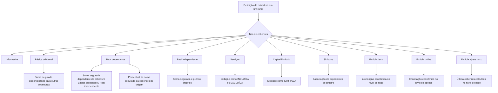
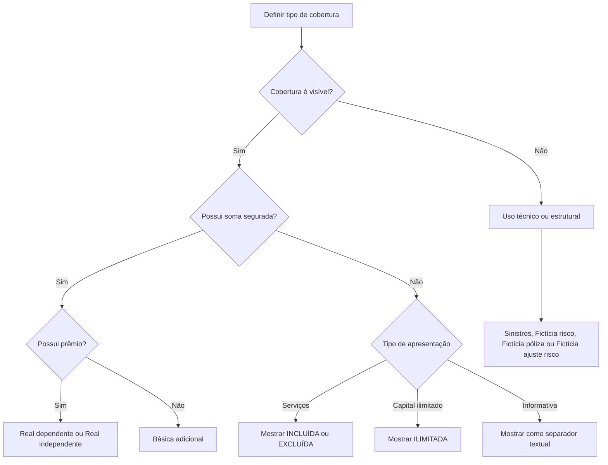

# Definição de Tipos de Cobertura no REEF Core

## 1. Metadados do Documento
- **Arquivo de Origem:** Não identificado no conteúdo extraído
- **Tipo de Documento:** Especificação Funcional
- **Domínio / Sistema:** REEF Core / Documentação Reef / Mapfre
- **Público-Alvo:** Desenvolvedores, Arquitetos, Analistas Funcionais e Operação
- **Data/Versão Identificada:** Não identificada

---

## 2. Resumo Executivo & Contexto de Negócio

O documento define o comportamento dos tipos de cobertura no processo de emissão de seguros no REEF Core. A classificação de cobertura determina se a cobertura aparece na tela de contratação, se possui soma segurada, se possui prêmio e como valores econômicos são associados a coberturas, riscos ou à apólice.

A definição do tipo de cobertura impacta diretamente a contratação, a apresentação de informações ao usuário, o cálculo de prêmio e a definição de atributos relacionados à soma segurada. Quando uma cobertura não possui soma segurada, não é possível determinar atributos que dependam desse valor, incluindo a forma de revalorização na renovação.

O documento apresenta dez tipos: Informativa, Básica Adicional, Real Dependente, Real Independente, Serviços, Capital Ilimitado, Sinistros, Fictícia Risco, Fictícia Póliza e Fictícia Ajuste Risco. Cada tipo estabelece uma combinação específica de visibilidade, soma segurada e prêmio.

Além das coberturas contratáveis e visíveis, existem tipos técnicos não exibidos durante a contratação. Esses tipos técnicos permitem vincular dados de sinistros ou informações econômicas a níveis específicos da estrutura de seguro: cobertura, risco ou apólice.

> **Nota de Análise:** O documento descreve o comportamento funcional dos tipos de cobertura, mas não detalha telas específicas do REEF Core, contratos de API, entidades persistidas, regras de cálculo de prêmio ou regras de revalorização.

---

## 3. Arquitetura, Componentes & Tecnologias Envolvidas

### Sistemas e conceitos identificados

| Componente / Conceito | Descrição baseada no documento |
| :--- | :--- |
| REEF Core | Sistema mencionado como capaz de manter apólices com um ou vários riscos. |
| Documentação Reef | Portal ou área documental indicada no conteúdo de origem. |
| Mapfre | Organização ou contexto corporativo identificado nos metadados extraídos. |
| Ramo | Contexto de produto de seguro no qual são definidas coberturas. |
| Cobertura | Elemento funcional que pode possuir visibilidade, soma segurada, prêmio ou associação técnica a risco/apólice/sinistro. |
| Soma assegurada | Valor de capital associado a uma cobertura, quando aplicável. |
| Prêmio | Valor econômico associado a uma cobertura, quando aplicável. |
| Risco | Unidade dentro de uma apólice à qual podem ser associadas informações econômicas. |
| Apólice | Estrutura que pode conter um ou vários riscos. |
| Expediente de sinistro | Registro de sinistro que pode ser associado a uma cobertura do tipo Sinistros. |
| Expediente de convênio | Exemplo de expediente que não requer uma cobertura contratada específica para realizar uma prestação. |

### Relação funcional entre tipos de cobertura



### Fluxo de determinação da apresentação de cobertura



---

## 4. Regras de Negócio, Especificações Funcionais & Processos

### 4.1 Regra geral sobre soma segurada

A existência de soma segurada determina se atributos vinculados a esse valor podem ser definidos. Quando uma cobertura não possui soma segurada, não é possível definir atributos referentes à soma segurada, incluindo regras de revalorização na renovação.

### 4.2 Cobertura Informativa

A cobertura Informativa não é considerada efetivamente uma cobertura. A cobertura Informativa é utilizada como separador na tela de contratação e representa somente um texto exibido ao usuário.

A cobertura Informativa:
- É visível na tela de contratação.
- Não possui soma segurada.
- Não possui prêmio.
- Pode estruturar grupos visuais de coberturas, como `CONTINENTE` e `CONTENIDO`.
- Não representa cobertura segurável com valor econômico próprio.

Exemplo apresentado:

| Cobertura | Soma Assegurada | Prêmio |
| :--- | :--- | :--- |
| CONTINENTE | Não aplicável | Não aplicável |
| Robo | 100.000,00 | 2.000,00 |
| Incendio | 80.000,00 | 600,00 |
| CONTENIDO | Não aplicável | Não aplicável |
| Robo | 200.000,00 | 1.000,00 |
| Incendio | 600.000,00 | 3.000,00 |

### 4.3 Cobertura Básica Adicional

A cobertura Básica Adicional possui soma segurada, mas não possui prêmio. A finalidade da cobertura Básica Adicional é disponibilizar sua soma segurada para outras coberturas.

No exemplo descrito, `CONTINENTE` e `CONTENIDO` podem ser definidos como coberturas Básicas Adicionais. As coberturas de `Robo` e `Incendio` podem utilizar os valores de soma segurada definidos em `CONTINENTE` e `CONTENIDO`.

A cobertura Básica Adicional:
- É visível na tela de contratação.
- Possui soma segurada.
- Não possui prêmio.
- Pode fornecer sua soma segurada para coberturas dependentes.

Exemplo apresentado:

| Cobertura | Soma Assegurada | Prêmio |
| :--- | :--- | :--- |
| CONTINENTE | 100.000,00 | Não aplicável |
| Robo | 100.000,00 | 2.000,00 |
| Incendio | 80.000,00 | 600,00 |
| CONTENIDO | 600.000,00 | Não aplicável |
| Robo | 200.000,00 | 1.000,00 |
| Incendio | 600.000,00 | 3.000,00 |

### 4.4 Cobertura Real Dependente

A cobertura Real Dependente possui soma segurada e prêmio. Entretanto, a soma segurada da cobertura Real Dependente é fornecida por outra cobertura, que deve ser do tipo Básica Adicional ou Real Independente.

Na definição de produto, a soma segurada da cobertura Real Dependente pode ser configurada como um percentual da soma segurada da cobertura da qual depende.

Exemplos apresentados:
- A cobertura `Incendio` associada a `CONTINENTE` utiliza 80% da soma segurada de `CONTINENTE`.
- A cobertura `Incendio` associada a `CONTENIDO` utiliza 100% da soma segurada de `CONTENIDO`.

A cobertura Real Dependente:
- É visível na tela de contratação.
- Possui soma segurada.
- Possui prêmio.
- Obtém a soma segurada de uma cobertura Básica Adicional ou Real Independente.
- Pode utilizar percentual da soma segurada da cobertura de origem.

| Cobertura de Origem | Soma Assegurada da Origem | Cobertura Dependente | Percentual | Soma Assegurada Resultante |
| :--- | :--- | :--- | :--- | :--- |
| CONTINENTE | 100.000,00 | Incendio | 80% | 80.000,00 |
| CONTENIDO | 600.000,00 | Incendio | 100% | 600.000,00 |

### 4.5 Cobertura Real Independente

A cobertura Real Independente possui soma segurada e prêmio. A soma segurada da cobertura Real Independente é definida de forma própria e, inicialmente, não depende de qualquer outra cobertura.

No exemplo apresentado, as coberturas de `Robo` de `CONTINENTE` e `CONTENIDO` possuem capital próprio.

A cobertura Real Independente:
- É visível na tela de contratação.
- Possui soma segurada.
- Possui prêmio.
- Define a própria soma segurada.
- Não depende, inicialmente, da soma segurada de outra cobertura.

| Cobertura | Soma Assegurada | Prêmio | Dependência de outra cobertura |
| :--- | :--- | :--- | :--- |
| Robo de CONTINENTE | 100.000,00 | 2.000,00 | Não |
| Robo de CONTENIDO | 200.000,00 | 1.000,00 | Não |

### 4.6 Cobertura de Serviços

A cobertura de Serviços não possui soma segurada, mas possui prêmio. A contratação da cobertura de Serviços é identificada na tela de contratação pelos valores `INCLUIDA` ou `EXCLUIDA`.

Exemplos apresentados:
- `Asistencia en viaje`: não contratada, exibida como `EXCLUIDA`, com prêmio `0,00`.
- `Asistencia en el hogar`: contratada, exibida como `INCLUIDA`, com prêmio `500,00`.

A cobertura de Serviços:
- É visível na tela de contratação.
- Não possui soma segurada.
- Possui prêmio.
- Indica estado de contratação por meio dos valores `INCLUIDA` ou `EXCLUIDA`.

| Cobertura | Apresentação na tela | Prêmio |
| :--- | :--- | :--- |
| Asistencia en viaje | EXCLUIDA | 0,00 |
| Asistencia en el hogar | INCLUIDA | 500,00 |

### 4.7 Cobertura de Capital Ilimitado

A cobertura de Capital Ilimitado possui soma segurada ilimitada e não apresenta um valor específico de capital. Funcionalmente, a cobertura de Capital Ilimitado é equivalente a uma cobertura de Serviços: não possui soma segurada numérica e possui prêmio.

A diferença entre Capital Ilimitado e Serviços está no literal apresentado na tela:
- Cobertura de Serviços: `INCLUIDA` ou `EXCLUIDA`.
- Cobertura de Capital Ilimitado: `ILIMITADA`.

Exemplo apresentado:
- `Asistencia médica` é exibida como `ILIMITADA` e possui prêmio `700,00`.

A cobertura de Capital Ilimitado:
- É visível na tela de contratação.
- Não possui soma segurada numérica.
- Possui prêmio.
- É exibida com o literal `ILIMITADA`.

| Cobertura | Soma Assegurada exibida | Prêmio |
| :--- | :--- | :--- |
| Asistencia médica | ILIMITADA | 700,00 |

### 4.8 Cobertura de Sinistros

A cobertura de Sinistros não é efetivamente uma cobertura contratável e não é exibida na tela de contratação. A finalidade da cobertura de Sinistros é associar tipos de expedientes que não requerem uma cobertura específica contratada para a realização de uma prestação.

O documento apresenta como exemplo os expedientes de convênio. Esses expedientes podem ser associados a uma cobertura do tipo Sinistros para que a informação de sinistros permaneça associada a essa cobertura e possa ser explorada no nível de cobertura.

A cobertura de Sinistros:
- Não é visível na tela de contratação.
- Não possui soma segurada.
- Não possui prêmio.
- Permite associar informação de sinistros a uma cobertura técnica.
- Pode ser utilizada para expedientes de convênio.

### 4.9 Cobertura Fictícia Risco

A cobertura Fictícia Risco não é uma cobertura efetiva e não aparece na tela de contratação. A finalidade é associar informação econômica no nível de risco.

O REEF Core permite apólices com um ou vários riscos. Quando existe necessidade de manter informação econômica agregada por risco, em vez de por cobertura, essa informação pode ser associada ao risco por meio de uma cobertura Fictícia Risco.

Exemplo apresentado:
- Direitos de emissão calculados por risco.

A cobertura Fictícia Risco:
- Não é visível na tela de contratação.
- Não possui soma segurada.
- Não possui prêmio.
- Permite associar informação econômica ao nível de risco.
- É adequada quando a agregação econômica deve ocorrer por risco.

### 4.10 Cobertura Fictícia Póliza

A cobertura Fictícia Póliza é semelhante à cobertura Fictícia Risco, mas o escopo da informação econômica é a apólice completa, independentemente da quantidade de riscos presentes na apólice.

Exemplo apresentado:
- Impostos calculados no nível da apólice.

A cobertura Fictícia Póliza:
- Não é visível na tela de contratação.
- Não possui soma segurada.
- Não possui prêmio.
- Permite associar informação econômica à apólice completa.
- Não depende do número de riscos contidos na apólice.

### 4.11 Cobertura Fictícia Ajuste Risco

A cobertura Fictícia Ajuste Risco é semelhante à cobertura Fictícia Risco. A diferença é que a cobertura Fictícia Ajuste Risco será a última cobertura calculada no nível de risco.

A cobertura Fictícia Ajuste Risco:
- Não é visível na tela de contratação.
- Não possui soma segurada.
- Não possui prêmio.
- Opera no nível de risco.
- É a última cobertura calculada nesse nível.

> **Nota de Análise:** O documento não detalha a ordem completa de cálculo das demais coberturas de risco, nem apresenta uma fórmula ou algoritmo para o ajuste de risco.

---

## 5. Tabelas de Parâmetros, Ambientes e Estruturas de Dados

### 5.1 Catálogo de tipos de cobertura

| Código | Tipo de Cobertura | Visível | Possui Soma Assegurada | Possui Prêmio | Função / Observação |
| :--- | :--- | :--- | :--- | :--- | :--- |
| 1 | Informativa | Sim | Não | Não | Separador textual na tela de contratação. |
| 2 | Básica Adicional | Sim | Sim | Não | Disponibiliza soma segurada para outras coberturas. |
| 3 | Real Dependente | Sim | Sim | Sim | Obtém soma segurada de uma Básica Adicional ou Real Independente; pode usar percentual. |
| 4 | Real Independente | Sim | Sim | Sim | Possui soma segurada própria, sem dependência inicial de outra cobertura. |
| 5 | Serviços | Sim | Não | Sim | Contratação apresentada como `INCLUIDA` ou `EXCLUIDA`. |
| 6 | Capital Ilimitado | Sim | Não | Sim | Exibida como `ILIMITADA`; funciona como serviço sem capital numérico. |
| 7 | Sinistros | Não | Não | Não | Associação técnica de expedientes de sinistro. |
| 8 | Fictícia Risco | Não | Não | Não | Associação de informação econômica no nível de risco. |
| 9 | Fictícia Póliza | Não | Não | Não | Associação de informação econômica no nível da apólice. |
| R | Fictícia Ajuste Risco | Não | Não | Não | Última cobertura calculada no nível de risco. |

### 5.2 Matriz de apresentação na contratação

| Tipo de Cobertura | Exibição na tela de contratação | Valor exibido para soma assegurada | Valor exibido para contratação |
| :--- | :--- | :--- | :--- |
| Informativa | Texto/separador | Não aplicável | Não aplicável |
| Básica Adicional | Cobertura visível | Valor numérico | Não aplicável |
| Real Dependente | Cobertura visível | Valor numérico derivado ou percentual | Não especificado |
| Real Independente | Cobertura visível | Valor numérico próprio | Não especificado |
| Serviços | Cobertura visível | Não aplicável | `INCLUIDA` ou `EXCLUIDA` |
| Capital Ilimitado | Cobertura visível | `ILIMITADA` | Não especificado |
| Sinistros | Não exibida | Não aplicável | Não aplicável |
| Fictícia Risco | Não exibida | Não aplicável | Não aplicável |
| Fictícia Póliza | Não exibida | Não aplicável | Não aplicável |
| Fictícia Ajuste Risco | Não exibida | Não aplicável | Não aplicável |

### 5.3 Exemplos de valores apresentados

| Item / Parâmetro | Descrição / Função | Tipo / Valores / Formato | Ambiente / Observações |
| :--- | :--- | :--- | :--- |
| CONTINENTE | Agrupador ou cobertura com soma segurada no exemplo | 100.000,00 | Pode ser Informativa ou Básica Adicional, conforme o exemplo. |
| CONTENIDO | Agrupador ou cobertura com soma segurada no exemplo | 600.000,00 | Pode ser Informativa ou Básica Adicional, conforme o exemplo. |
| Robo de CONTINENTE | Cobertura de roubo | Soma assegurada: 100.000,00; prêmio: 2.000,00 | Exemplo de capital próprio em Real Independente. |
| Incendio de CONTINENTE | Cobertura de incêndio | Soma assegurada: 80.000,00; prêmio: 600,00 | Exemplo de 80% de 100.000,00. |
| Robo de CONTENIDO | Cobertura de roubo | Soma assegurada: 200.000,00; prêmio: 1.000,00 | Exemplo de capital próprio em Real Independente. |
| Incendio de CONTENIDO | Cobertura de incêndio | Soma assegurada: 600.000,00; prêmio: 3.000,00 | Exemplo de 100% de 600.000,00. |
| Asistencia en viaje | Serviço não contratado | `EXCLUIDA`; prêmio: 0,00 | Sem soma segurada. |
| Asistencia en el hogar | Serviço contratado | `INCLUIDA`; prêmio: 500,00 | Sem soma segurada. |
| Asistencia médica | Cobertura de capital ilimitado | `ILIMITADA`; prêmio: 700,00 | Sem soma segurada numérica. |
| Direitos de emissão | Informação econômica | Não especificado | Exemplo de cálculo no nível de risco. |
| Impostos | Informação econômica | Não especificado | Exemplo de cálculo no nível de apólice. |

---

## 6. Bateria de Perguntas & Respostas para RAG (FAQ Sintético)

### P1: Qual é o impacto de uma cobertura não possuir soma segurada no REEF Core?
**R:** Quando uma cobertura não possui soma segurada, não é possível determinar atributos que façam referência à soma segurada. O documento cita como exemplo a impossibilidade de definir a forma de revalorização dessa soma na renovação. Os tipos Informativa, Serviços, Capital Ilimitado, Sinistros, Fictícia Risco, Fictícia Póliza e Fictícia Ajuste Risco não possuem soma segurada.

### P2: Para que serve uma cobertura do tipo Informativa?
**R:** A cobertura Informativa funciona como um separador textual na tela de contratação e não é considerada efetivamente uma cobertura. A cobertura Informativa não possui soma segurada nem prêmio. O documento exemplifica seu uso para separar visualmente grupos como `CONTINENTE` e `CONTENIDO`.

### P3: Qual a diferença entre cobertura Básica Adicional e Real Dependente?
**R:** A cobertura Básica Adicional possui soma segurada e não possui prêmio; sua finalidade é disponibilizar a soma segurada para outras coberturas. A cobertura Real Dependente possui soma segurada e prêmio, mas sua soma segurada é fornecida por uma cobertura Básica Adicional ou Real Independente, podendo corresponder a um percentual da soma segurada da cobertura de origem.

### P4: Como uma cobertura Real Dependente pode calcular sua soma segurada?
**R:** A soma segurada de uma cobertura Real Dependente pode ser um percentual da soma segurada de uma cobertura Básica Adicional ou Real Independente. No exemplo do documento, `Incendio` associado a `CONTINENTE` assume 80% de 100.000,00, resultando em 80.000,00. Outro `Incendio` associado a `CONTENIDO` assume 100% de 600.000,00, resultando em 600.000,00.

### P5: O que caracteriza uma cobertura Real Independente?
**R:** A cobertura Real Independente possui soma segurada e prêmio próprios. A soma segurada é definida diretamente e, inicialmente, não depende de outra cobertura. O documento usa as coberturas `Robo` de `CONTINENTE` e `Robo` de `CONTENIDO` como exemplos de coberturas com capital próprio.

### P6: Como a contratação de uma cobertura de Serviços é apresentada ao usuário?
**R:** Uma cobertura de Serviços não possui soma segurada, mas possui prêmio. A contratação é demonstrada na tela por `INCLUIDA` quando o serviço está contratado e por `EXCLUIDA` quando não está contratado. No exemplo, `Asistencia en viaje` aparece como `EXCLUIDA` com prêmio 0,00, e `Asistencia en el hogar` aparece como `INCLUIDA` com prêmio 500,00.

### P7: Qual é a diferença entre uma cobertura de Serviços e uma cobertura de Capital Ilimitado?
**R:** Ambos os tipos não possuem soma segurada numérica e possuem prêmio. A diferença está no literal exibido na tela: Serviços utiliza `INCLUIDA` ou `EXCLUIDA`, enquanto Capital Ilimitado utiliza `ILIMITADA`. O documento classifica Capital Ilimitado como funcionalmente equivalente a uma cobertura de serviço, mas com apresentação diferente.

### P8: Para que é utilizada uma cobertura do tipo Sinistros?
**R:** A cobertura de Sinistros é um tipo técnico que não aparece na tela de contratação e não possui soma segurada ou prêmio. Ela permite associar tipos de expedientes que não dependem de uma cobertura contratada específica para realizar uma prestação. O documento cita expedientes de convênio como exemplo e informa que os dados de sinistros podem ser explorados no nível dessa cobertura.

### P9: Quando deve ser utilizada uma cobertura Fictícia Risco?
**R:** Uma cobertura Fictícia Risco deve ser utilizada quando uma informação econômica precisa ser associada ou agregada por risco, e não por cobertura. O REEF Core permite apólices com um ou vários riscos. O documento fornece como exemplo o cálculo de direitos de emissão por risco.

### P10: Como a cobertura Fictícia Póliza difere da cobertura Fictícia Risco?
**R:** A cobertura Fictícia Risco associa informação econômica a cada risco, enquanto a cobertura Fictícia Póliza associa informação econômica à apólice completa, independentemente da quantidade de riscos. O documento cita impostos calculados no nível da apólice como exemplo de uso de Fictícia Póliza.

### P11: Qual é a particularidade da cobertura Fictícia Ajuste Risco?
**R:** A cobertura Fictícia Ajuste Risco é semelhante à Fictícia Risco porque atua no nível de risco e não aparece na tela de contratação. A particularidade é que essa cobertura será a última a ser calculada no nível de risco.

### P12: Quais tipos de cobertura são visíveis na tela de contratação?
**R:** Os tipos visíveis são Informativa, Básica Adicional, Real Dependente, Real Independente, Serviços e Capital Ilimitado. Os tipos Sinistros, Fictícia Risco, Fictícia Póliza e Fictícia Ajuste Risco não são visíveis na tela de contratação.

---

## 7. Glossário de Termos, Siglas & Conceitos-Chave

- **REEF Core:** Sistema mencionado no documento como capaz de manter apólices com um ou vários riscos.
- **Cobertura:** Elemento definido em um ramo de seguro, com comportamento determinado pelo tipo de cobertura.
- **Soma Assegurada:** Capital ou valor segurado associado a uma cobertura quando aplicável.
- **Prêmio:** Valor econômico associado à cobertura.
- **Ramo:** Contexto de produto de seguro no qual são configuradas as coberturas.
- **Apólice:** Estrutura de seguro que pode conter um ou vários riscos.
- **Risco:** Unidade de uma apólice à qual podem ser associadas informações econômicas.
- **Cobertura Informativa:** Separador textual visível na contratação, sem soma segurada e sem prêmio.
- **Cobertura Básica Adicional:** Cobertura visível com soma segurada e sem prêmio, utilizada para disponibilizar capital a outras coberturas.
- **Cobertura Real Dependente:** Cobertura visível com soma segurada e prêmio, dependente da soma segurada de outra cobertura.
- **Cobertura Real Independente:** Cobertura visível com soma segurada e prêmio próprios.
- **Cobertura de Serviços:** Cobertura visível sem soma segurada e com prêmio, apresentada como `INCLUIDA` ou `EXCLUIDA`.
- **Cobertura de Capital Ilimitado:** Cobertura visível sem soma segurada numérica e com prêmio, apresentada como `ILIMITADA`.
- **Cobertura de Sinistros:** Tipo técnico não visível que permite associar expedientes de sinistro.
- **Cobertura Fictícia Risco:** Tipo técnico não visível usado para associar informação econômica a um risco.
- **Cobertura Fictícia Póliza:** Tipo técnico não visível usado para associar informação econômica à apólice.
- **Cobertura Fictícia Ajuste Risco:** Tipo técnico não visível, calculado por último no nível de risco.
- **Expediente de convênio:** Exemplo de expediente de sinistro que pode ser associado à cobertura de Sinistros.
- **INCLUIDA / EXCLUIDA:** Literais de tela que informam se uma cobertura de Serviços está contratada.
- **ILIMITADA:** Literal de tela que indica cobertura de Capital Ilimitado.

---

## 8. Notas Críticas, Riscos & Limitações

- O documento não identifica arquivo, data, versão, autor ou histórico de revisão.
- O documento não detalha contratos de API, métodos HTTP, modelos de dados, tabelas de banco de dados ou campos técnicos para os tipos de cobertura.
- O documento não apresenta fórmulas de cálculo de prêmio.
- O documento indica que uma cobertura Real Dependente pode usar percentual da soma segurada de outra cobertura, mas não especifica regras de arredondamento, precisão decimal, limites mínimos, limites máximos ou tratamento de valores inválidos.
- O documento não informa como o REEF Core resolve dependências encadeadas entre coberturas Real Dependente.
- O documento não detalha a ordem de cálculo das coberturas no nível de risco, exceto que Fictícia Ajuste Risco é a última cobertura calculada nesse nível.
- A cobertura de Capital Ilimitado é descrita como equivalente a uma cobertura de Serviços quanto à ausência de soma segurada numérica e presença de prêmio, mas não são descritas regras adicionais de emissão, tarifação ou sinistro.
- O documento possui pequenas inconsistências de grafia no conteúdo extraído, como `sininiestros` e `Básica adiciional`; esta estrutura preserva o significado funcional aparente sem criar regras não documentadas.

---

## 9. Conteúdo Bruto Estruturado (Referência Fiel)

```text
--- [PÁGINA 1 DE 5] ---

DEFINICIÓN de tipo de cobertura
Objetivo
Especica el comportamiento de la cobertura en el proceso de emisión. Básicamente afecta a si aparece en el momento de la contratación,
la suma asegurada y el cálculo de la prima, así como aquellas propiedades que afectan a la denición relacionadas con suma asegurada y
prima.
Así por ejemplo, una cobertura puede que no disponga de suma asegurada. Esto implica que no será posible determinar ningún atributo que
haga referencia a la suma asegurada, forma en la que revaloriza en la renovación, etc.
Los tipos que existen son:
TIPO DESCRIPCIÓN
1 INFORMATIVA
2 BÁSICA ADICIONAL
3 REAL DEPENDIENTE
4 REAL INDEPENDIENTE
5 SERVICIOS
6 CAPITAL ILIMITADO
7 SINIESTROS
8 FICTICIA RIESGO
9 FICTICIA PÓLIZA
R FICTICIA AJUSTE RIESGO
Tipos
Informativa
Documentation / DOCUMENTACIÓN Reef
DOCUMENTACIÓN Reef
Mapfredocument
DOCUMENTACIÓN Reef
Owner
user:agonzalez_mapfre.com
Lifecycle
Approved Source
 / 
 VL
Buscar Inicio Soluciones Arquitecturas APIs Componentes Cloud Documentación Zeus Reef Ayuda
ES


--- [PÁGINA 2 DE 5] ---

Este tipo realmente no se la considera cobertura, se utiliza como "separador" en la pantalla de contratación. Es simplemente un texto que
aparecerá en la pantalla, por lo que cuando se dena en un ramo, no dispondrá de suma asegurada ni de prima.
Por ejemplo, si se tiene un ramo de hogar en el que existen coberturas que cubren el robo y el incendio** tanto para el continente como para
el contenido, se puede utilizar este tipo de cobertura para crear una cobertura llamada CONTINENTE y otra cobertura llamada CONTENIDO.
En una hipotética pantalla, y atendiendo al este ejemplo, quedaría de la siguiente forma (marcado en negrita e itálica):
COBERTURA SUMA ASEGURADA PRIMA
CONTINENTE
Robo 100.000,00 2.000,00
Incendio 80.000,00 600,00
CONTENIDO
Robo 200.000,00 1.000,00
Incendio 600.000,00 3.000,00
Básica adicional
Es una cobertura que dispone de suma asegurada pero no dispone de prima. Está pensada para ofrecer su suma asegurada a otras
coberturas.
Variando el ejemplo del tipo de cobertura anterior (Informativa, se puede realizar una denición de cobertura como CONTINENTE y otra como
CONTENIDO que disponen de suma asegurada y, posteriormente las coberturas de Robo e Incendio tomarán la suma asegurada de la
cobertura CONTINENTE y CONTENIDO respectivamente. El ejemplo (marcado en negrita e itálica) a continuación:
COBERTURA SUMA ASEGURADA PRIMA
CONTINENTE 100.000,00
Robo 100.000,00 2.000,00
Incendio 80.000,00 600,00
CONTENIDO 600.000,00
Robo 200.000,00 1.000,00
Incendio 600.000,00 3.000,00
Real dependiente
Una cobertura de este tipo, dispone de suma asegurada y de prima, pero la suma asegurada lo proporciona otra cobertura como debe ser
Básica adiciional o Real independiente. En la denición de producto, se verá que la suma asegurada que toma este tipo de cobertura puede
ser un porcentaje de la cobertura de la cual dependa. Es decir, puede (por ejemplo), tomar un 80% de la suma asegurada de la cobertura de la
que toma la suma asegurada.
Siguiendo con el ejemplo anterior, se va a suponer que la cobertura de Incendio toma la suma asegurada de la cobertura de CONTINENTE en
un 80%, y la otra cobertura de Incendio toma la suma asegurada de la cobertura de CONTENIDO en un 100%. A continuación se muestra el
resultado (en negrita e itálica):


--- [PÁGINA 3 DE 5] ---

COBERTURA SUMA ASEGURADA PRIMA
CONTINENTE 100.000,00
Robo 100.000,00 2.000,00
Incendio 80.000,00 600,00
CONTENIDO 600.000,00
Robo 200.000,00 1.000,00
Incendio 600.000,00 3.000,00
Real independiente
Es una cobertura que dispone tanto de suma asegurada como de prima. La suma asegurada se dene y en principio no depende de ninguna
otra cobertura.
Siguiendo el ejemplo, se va a suponer que la cobertura de Robo (tanto de CONTINENTE como de CONTENIDO), disponen de su propio capital.
A continuación se muestra el resultado (en negrita e itálica)
COBERTURA SUMA ASEGURADA PRIMA
CONTINENTE 100.000,00
Robo 100.000,00 2.000,00
Incendio 80.000,00 600,00
CONTENIDO 600.000,00
Robo 200.000,00 1.000,00
Incendio 600.000,00 3.000,00
Servicios
Este tipo NO dispone de suma asegurada, pero dispone de prima. La contratación o no de este tipo de cobertura se conoce si aparece el valor
"INCLUIDA" o "EXCLUIDA" en la pantalla de contratación. Para mostrar un ejemplo, se supone que existe una cobertura llamada Asistencia en
viaje que estaría NO contratada y otra cobertura de Asistencia en el hogar que SI estaría contratada (en negrita e itálica)
COBERTURA SUMA ASEGURADA PRIMA
CONTINENTE 100.000,00
Robo 100.000,00 2.000,00
Incendio 80.000,00 600,00
CONTENIDO 600.000,00
Robo 200.000,00 1.000,00
Incendio 600.000,00 3.000,00


--- [PÁGINA 4 DE 5] ---

COBERTURA SUMA ASEGURADA PRIMA
Asistencia en viaje EXCLUIDA 0,00
Asistencia en el hogar INCLUIDA 500,00
Capital ilimitado
Al tener una suma asegurada ilimitada, realmente no lleva asociado un valor especíco por lo que en realidad es una cobertura tipo servicio.
Es decir, sin suma asegurada, pero con prima. La diferencia radica en el literal que aparece en pantalla que muestra el valor "ILIMITADO". Por
ejemplo, existe una cobertura llamada Asistencia médica que es de este tipo, la pantalla mostraría la información que se detalla a
continuación (en negrita e itálica):
COBERTURA SUMA ASEGURADA PRIMA
CONTINENTE 100.000,00
Robo 100.000,00 2.000,00
Incendio 80.000,00 600,00
CONTENIDO 600.000,00
Robo 200.000,00 1.000,00
Incendio 600.000,00 3.000,00
Asistencia en viaje EXCLUIDA 0,00
Asistencia en el hogar INCLUIDA 500,00
Asistencia médica ILIMITADA 700,00
Siniestros
Este tipo, realmente no es una cobertura, por lo que no se muestra en la pantalla de contratación. Se utiliza con el n de asociar tipos de
expedientes que no necesitan de una cobertura en particular contratada para realizar una prestación. Esto ocurre por ejemplo con los
expedientes de convenio. Este tipo de expedientes se suelen asociar a este tipo de cobertura ya que toda la información de sininiestros
queda asociado a esta cobertura pudiendo explotar información a este nivel (de cobertura).
Ficticia riesgo
Otro tipo que no es una cobertura y, que tampoco aparecerá en la pantalla de contratación. La utilidad de este tipo de cobertura es la de poder
asociar información económica a nivel de riesgo. Hay que recordar que Reef.core permite disponer de pólizas con uno o varios riesgos. Hay
ocasiones donde es necesario disponer de información económica agregada por riesgo (en vez de cobertura que es la asociación más
natural). Cuando esto ocurre, los la información económica puede asociarse al riesgo mediante este tipo de cobertura. Un ejemplo podría ser
cuando es necesario que los derechos de emisión se calculen por riesgo.
Ficticia póliza
Este tipo de cobertura es parecido al tipo cticia riesgo, pero el ámbito de la información económica aplica a la póliza completa
independientemente del número de riesgos que contenga la póliza. Un ejemplo podría ser que los impuestos se calculen a este nivel.
Ficticia ajuste riesgo
Otro tipo de cobertura muy parecida a cticia riesgo con la diferencia que esta cobertura va a ser la última que se calcule en el nivel riesgo.


--- [PÁGINA 5 DE 5] ---

Resumen
Como compendio se muestra la siguiente tabla que reeja lo visto anteriormente
TIPO VISIBLE CON SUMA ASEGURADA CON PRIMA
INFORMATIVA SI NO NO
BÁSICA ADICIONAL SI SI NO
REAL DEPENDIENTE SI SI SI
REAL INDEPENDIENTE SI SI SI
SERVICIOS SI NO SI
CAPITAL ILIMITADO SI NO SI
SINIESTROS NO NO NO
FICTICIA RIESGO NO NO NO
FICTICIA PÓLIZA NO NO NO
FICTICIA AJUSTE RIESGO NO NO NO
```
