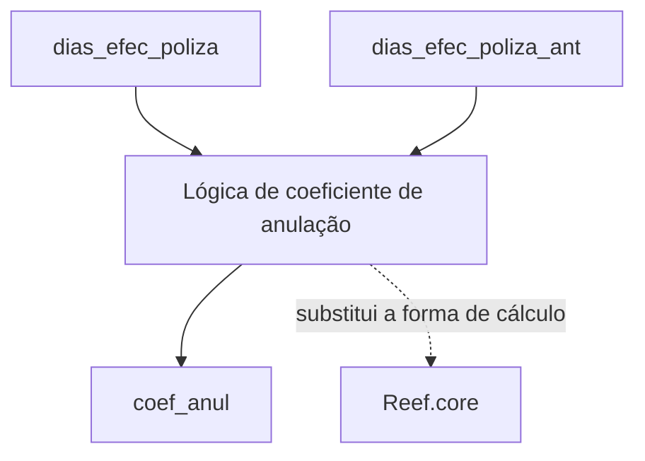

# Definição de Suplemento — Lógica de Coeficiente de Anulação no Reef.core

## 1. Metadados do Documento
- **Arquivo de Origem:** Não identificado
- **Tipo de Documento:** Especificação Técnica resumida
- **Domínio / Sistema:** Reef / Reef.core / Mapfre
- **Público-Alvo:** Desenvolvedores, Arquitetos e Analistas Funcionais
- **Data/Versão Identificada:** Não identificada
- **Owner identificado:** `user:agonzalez_mapfre.com`
- **Lifecycle identificado:** `Approved Source / VL`

---

## 2. Resumo Executivo & Contexto de Negócio

O documento descreve a construção de uma funcionalidade denominada **“Definición de suplemento”**, cujo objetivo inclui propriedades e uma lógica para cálculo do **coeficiente de anulação** (`coef_anul`).

A lógica de coeficiente de anulação determina qual deve ser o valor do coeficiente de anulação. O texto declara expressamente que essa lógica substitui a forma pela qual o sistema **Reef.core** calcula esse coeficiente.

A especificação identifica três elementos de informação para o desenvolvimento da lógica: `coef_anul`, `dias_efec_poliza` e `dias_efec_poliza_ant`. O conteúdo disponível não descreve fórmula, regras condicionais, tipos de dados, contratos, persistência, interfaces ou comportamento de erro.

O material parece ser uma página de documentação Reef, vinculada ao contexto Mapfre. A página está marcada como aprovada, mas não apresenta detalhamento técnico suficiente para implementação autônoma da lógica.

---

## 3. Arquitetura, Componentes & Tecnologias Envolvidas

Os componentes e termos explicitamente citados são:

- **Reef:** contexto da documentação.
- **Reef.core:** componente cuja forma de cálculo do coeficiente de anulação será substituída.
- **Lógica de coeficiente de anulação:** lógica a ser desenvolvida para determinar `coef_anul`.
- **Mapfredocument:** termo exibido na navegação ou contexto documental.
- **Documentación Reef:** área de documentação onde o conteúdo foi apresentado.



> **Nota de Análise:** O documento informa que a lógica substitui a forma pela qual Reef.core encontra o coeficiente de anulação, mas não detalha integração técnica, APIs, métodos HTTP, banco de dados, eventos, classes, serviços ou contratos JSON.

---

## 4. Regras de Negócio, Especificações Funcionais & Processos

1. Existe uma lógica denominada **“Lógica coeficiente de anulación”**.
2. A finalidade dessa lógica é determinar qual é o **coeficiente de anulação**.
3. O coeficiente de anulação é identificado pelo campo ou variável `coef_anul`.
4. A lógica especificada substitui a forma existente pela qual **Reef.core** encontra ou calcula o coeficiente de anulação.
5. O documento apresenta `dias_efec_poliza` como informação de entrada para desenvolvimento da lógica.
6. O documento apresenta `dias_efec_poliza_ant` como informação de entrada para desenvolvimento da lógica.
7. O documento apresenta `coef_anul` como informação de saída da lógica.
8. O texto também mostra `coef_anul` na lista de elementos associados à informação de desenvolvimento, sem esclarecer se há valor prévio, parâmetro, referência ou somente identificação do resultado.

> **Nota de Análise:** O documento não fornece a fórmula de cálculo de `coef_anul`, limites numéricos, precedência entre entradas, regras para valores nulos, comportamento para apólices sem período anterior, nem critérios de arredondamento.

---

## 5. Tabelas de Parâmetros, Ambientes e Estruturas de Dados

| Item / Parâmetro | Descrição / Função | Tipo / Valores / Formato | Ambiente / Observações |
| :--- | :--- | :--- | :--- |
| `coef_anul` | Coeficiente de anulação determinado pela lógica. | Não informado. | Indicado como saída. Também aparece entre os elementos de informação para desenvolvimento. |
| `dias_efec_poliza` | Informação de entrada para a lógica de coeficiente de anulação. | Não informado. | O nome sugere dias de efetividade da apólice, mas o significado formal não é definido pelo documento. |
| `dias_efec_poliza_ant` | Informação de entrada para a lógica de coeficiente de anulação. | Não informado. | O sufixo `_ant` está presente no nome, mas o documento não define formalmente seu significado. |
| Reef.core | Sistema ou componente cuja forma de obtenção do coeficiente de anulação será substituída. | Não informado. | Não há versão, URL, ambiente ou tecnologia especificada. |
| Reef | Contexto da documentação apresentada. | Não informado. | Exibido como “DOCUMENTACIÓN Reef”. |
| Mapfredocument | Termo presente no conteúdo de navegação ou contexto documental. | Não informado. | A relação técnica com Reef.core não é detalhada. |
| `user:agonzalez_mapfre.com` | Owner identificado na página. | Identificador de usuário. | Exibido no campo `Owner`. |
| `Approved Source / VL` | Estado ou metadado de ciclo de vida exibido. | Não informado. | Exibido no campo `Lifecycle`; a semântica de `VL` não é explicada. |

---

## 6. Bateria de Perguntas & Respostas para RAG (FAQ Sintético)

### P1: Qual é o objetivo da lógica de coeficiente de anulação?
**R:** A lógica de coeficiente de anulação tem como objetivo determinar qual é o coeficiente de anulação, identificado no documento como `coef_anul`.

### P2: Qual comportamento do Reef.core será substituído?
**R:** A nova lógica substitui a forma pela qual o Reef.core encontra ou calcula o coeficiente de anulação. O documento não descreve a implementação atual do Reef.core nem o mecanismo técnico de substituição.

### P3: Quais são as entradas identificadas para a lógica de coeficiente de anulação?
**R:** As entradas explicitamente identificadas são `dias_efec_poliza` e `dias_efec_poliza_ant`.

### P4: Qual é a saída identificada da lógica?
**R:** A saída identificada é `coef_anul`, o coeficiente de anulação.

### P5: O documento informa a fórmula para calcular `coef_anul`?
**R:** Não. O documento informa a existência da lógica e seus elementos de entrada e saída, mas não apresenta fórmula, condições, limites, arredondamento ou exemplos de cálculo.

### P6: O documento define os tipos de dados de `dias_efec_poliza`, `dias_efec_poliza_ant` e `coef_anul`?
**R:** Não. Nenhum tipo de dado, formato ou domínio de valores é especificado para esses elementos.

### P7: Há detalhes sobre APIs, métodos HTTP ou contratos JSON da lógica?
**R:** Não. O documento não detalha APIs, endpoints, métodos HTTP, mensagens, contratos JSON ou mecanismos de integração.

### P8: Quem é o owner identificado na documentação?
**R:** O owner identificado no conteúdo é `user:agonzalez_mapfre.com`.

### P9: Qual é o estado de lifecycle mostrado na página?
**R:** O campo `Lifecycle` apresenta o valor `Approved Source / VL`. O documento não explica o significado operacional desse estado nem da sigla `VL`.

### P10: O documento fornece informações de ambiente, URLs ou servidores?
**R:** Não. O conteúdo não apresenta URLs de ambiente, nomes de servidores, portas, caminhos de logs ou configurações de implantação.

---

## 7. Glossário de Termos, Siglas & Conceitos-Chave

- **`coef_anul`:** Identificador do coeficiente de anulação, apresentado como saída da lógica.
- **Coeficiente de anulação:** Valor que a lógica descrita deve determinar.
- **`dias_efec_poliza`:** Entrada identificada para a lógica de coeficiente de anulação.
- **`dias_efec_poliza_ant`:** Entrada identificada para a lógica de coeficiente de anulação.
- **Reef:** Contexto ou plataforma documental mencionada como “DOCUMENTACIÓN Reef”.
- **Reef.core:** Componente cuja forma de encontrar o coeficiente de anulação será substituída pela lógica descrita.
- **Mapfredocument:** Termo exibido no conteúdo de navegação/documentação; sua função não é detalhada.
- **VL:** Sigla exibida no lifecycle `Approved Source / VL`; significado não definido no documento.

---

## 8. Notas Críticas, Riscos & Limitações

- O documento não apresenta a fórmula ou as regras condicionais necessárias para implementar ou validar o cálculo de `coef_anul`.
- Não há definição de tipos, unidades, formatos ou intervalos aceitáveis para `dias_efec_poliza`, `dias_efec_poliza_ant` e `coef_anul`.
- Não são especificados tratamentos para valores ausentes, inválidos, negativos, nulos ou casos de borda.
- Não há exemplos de entrada e saída para validação funcional.
- Não são descritos endpoints, contratos de integração, persistência, logs, monitoramento ou mecanismos de erro.
- O mecanismo pelo qual a lógica substitui o cálculo existente do Reef.core não é detalhado.
- O documento não fornece data, versão, identificador de requisito, histórico de alterações ou ambiente de execução.
- A marcação `Approved Source / VL` está presente, mas a semântica de aprovação e da sigla `VL` não é explicada.

---

## 9. Conteúdo Bruto Estruturado (Referência Fiel)

```text
--- [PÁGINA 1 DE 1] ---

EN CONSTRUCCIÓN
DEFINICIÓN de suplemento
Objetivo
-Propiedades
Propiedades
Lógica coeciente de anulación
Lógica que determina cual el el coeciente de anulación. Es decir, esta lógica sustituye a la forma en que Reef.core halla este coeciente
Información para el desarrollo de esta lógica
Entrada
Salida
1
2
3
coef_anul
dias_efec_poliza
dias_efec_poliza_ant
1
coef_anul
Documentation / DOCUMENTACIÓN Reef
DOCUMENTACIÓN Reef
Mapfredocument
DOCUMENTACIÓN Reef
Owner
user:agonzalez_mapfre.com
Lifecycle
Approved Source
 / 
 VL
Buscar Inicio Soluciones Arquitecturas APIs Componentes Cloud Documentación Zeus Reef Ayuda
ES
```
