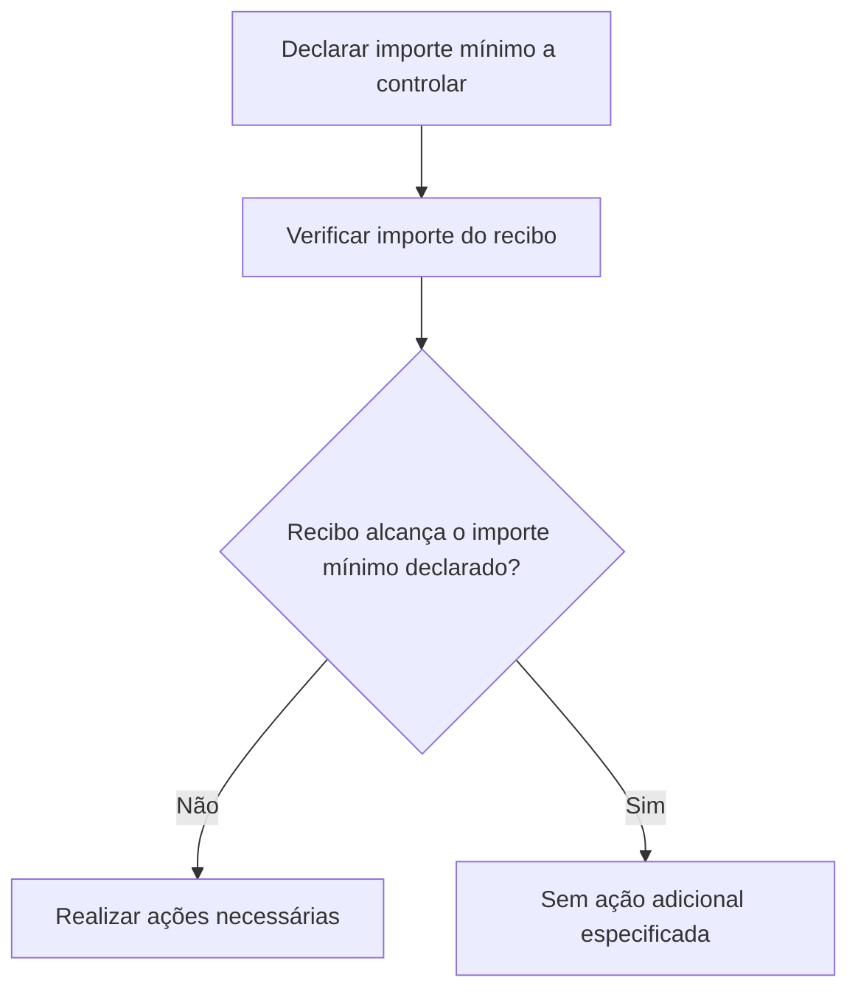

# Definição de Importes Mínimos do Ramo — Documentação Reef

## 1. Metadados do Documento
- **Arquivo de Origem:** Não identificado no conteúdo fornecido
- **Tipo de Documento:** Especificação Técnica
- **Domínio / Sistema:** Reef / Mapfre
- **Público-Alvo:** Negócio, Desenvolvedores, Arquitetos e Operação
- **Data/Versão Identificada:** Não identificada

---

## 2. Resumo Executivo & Contexto de Negócio

O documento descreve a definição e o controle de importes mínimos aplicáveis a um ramo no contexto da documentação Reef. O objetivo declarado é identificar se determinados importes mínimos devem ser controlados e, posteriormente, executar as ações necessárias quando os valores não alcançarem o mínimo declarado.

A propriedade funcional explicitamente apresentada é o **importe mínimo do recibo**. Essa propriedade representa o valor mínimo que um recibo deve atingir para atender ao controle definido para o ramo.

O conteúdo estabelece uma distinção importante: o importe mínimo do recibo não deve ser confundido com o importe mínimo de quota. O documento fornecido não detalha regras de cálculo, unidades monetárias, valores configuráveis, critérios de exceção ou ações específicas aplicáveis quando o mínimo não é atingido.

A documentação está associada ao ambiente ou repositório Reef, com referência a Mapfredocument, e apresenta o proprietário como `user:agonzalez_mapfre.com`. O ciclo de vida apresentado é **Approved**.

---

## 3. Arquitetura, Componentes & Tecnologias Envolvidas

Os elementos mencionados no conteúdo são:

| Componente / Elemento | Papel identificado no conteúdo | Detalhamento disponível |
| :--- | :--- | :--- |
| Reef | Contexto da documentação sobre importes mínimos do ramo | Não há arquitetura técnica detalhada |
| Mapfredocument | Referência de documentação apresentada na interface | Não detalhado |
| Zeus | Item de navegação exibido na interface | Não detalhado |
| Documentación Reef | Área documental em que o conteúdo está disponível | Não detalhado |
| Owner `user:agonzalez_mapfre.com` | Proprietário identificado para o documento | Não detalhado |
| Lifecycle `Approved` | Estado de ciclo de vida exibido | Não detalhado |

O fluxo funcional suportado pelo conteúdo é o controle de um importe mínimo declarado para um recibo e a realização de ações quando o recibo não alcança esse mínimo.



> **Nota de Análise:** O documento não descreve microsserviços, APIs, métodos HTTP, contratos JSON, bancos de dados, ambientes técnicos ou integrações entre sistemas.

---

## 4. Regras de Negócio, Especificações Funcionais & Processos

1. Devem ser declarados os importes mínimos que são aplicáveis ao controle.
2. O controle deve determinar se os importes mínimos declarados procedem.
3. Após o controle, devem ser realizadas as ações necessárias quando os valores não alcançarem o mínimo declarado.
4. A propriedade explicitamente definida é o **importe mínimo do recibo**.
5. O importe mínimo do recibo é o valor mínimo que o recibo deve alcançar.
6. O importe mínimo do recibo não deve ser confundido com o importe mínimo de quota.
7. O documento não especifica:
   - O valor numérico do importe mínimo do recibo.
   - A moeda ou formato monetário.
   - A origem do valor mínimo declarado.
   - A fórmula de cálculo do importe do recibo.
   - As ações concretas quando o mínimo não é alcançado.
   - Exceções, aprovações ou perfis autorizados a manter a propriedade.

---

## 5. Tabelas de Parâmetros, Ambientes e Estruturas de Dados

| Item / Parâmetro | Descrição / Função | Tipo / Valores / Formato | Ambiente / Observações |
| :--- | :--- | :--- | :--- |
| Importe mínimo do recibo | Importe mínimo que um recibo deve alcançar | Valor mínimo; formato e moeda não informados | Não confundir com importe mínimo de quota |
| Importes mínimos a controlar | Importes declarados cuja procedência deve ser controlada | Não especificado | Aplicável ao ramo mencionado no documento |
| Ações necessárias | Ações a realizar se os importes não alcançarem o mínimo declarado | Não especificado | O documento não detalha as ações |
| Domínio documental | Contexto de documentação Reef | `DOCUMENTACIÓN Reef` | Referência apresentada na interface |
| Owner | Proprietário do conteúdo | `user:agonzalez_mapfre.com` | Valor exibido no documento |
| Lifecycle | Estado do ciclo de vida do documento | `Approved` | Valor exibido no documento |
| Source | Origem ou referência exibida | `VL` | Sem detalhamento adicional |

---

## 6. Bateria de Perguntas & Respostas para RAG (FAQ Sintético)

### P1: Qual é o objetivo da definição de importes mínimos do ramo?
**R:** O objetivo é declarar os importes mínimos que devem ser controlados, verificar se esses importes procedem e realizar as ações necessárias quando os valores não alcançarem o mínimo declarado.

### P2: O que representa o importe mínimo do recibo?
**R:** O importe mínimo do recibo representa o valor mínimo que um recibo deve alcançar. O documento não informa o valor numérico, a moeda ou o método de cálculo desse importe.

### P3: O importe mínimo do recibo é igual ao importe mínimo de quota?
**R:** Não. O documento declara expressamente que o importe mínimo do recibo não deve ser confundido com o importe mínimo de quota.

### P4: O que deve acontecer quando o recibo não alcança o importe mínimo declarado?
**R:** Devem ser realizadas as ações necessárias. O documento não especifica quais são essas ações, quem as executa ou quais sistemas participam do processo.

### P5: O documento informa como calcular o importe de um recibo?
**R:** Não. O conteúdo apenas define que existe um importe mínimo que o recibo deve alcançar; não há fórmula, fonte de dados, moeda, arredondamento ou regra de cálculo.

### P6: Quais componentes técnicos participam do controle de importes mínimos?
**R:** O conteúdo menciona Reef, Mapfredocument e Zeus na interface documental, mas não descreve componentes técnicos, microsserviços, APIs, bancos de dados ou integrações responsáveis pelo controle.

### P7: Qual é o estado de ciclo de vida da documentação?
**R:** O estado de ciclo de vida apresentado é `Approved`.

### P8: Quem é o proprietário identificado para o documento?
**R:** O proprietário exibido é `user:agonzalez_mapfre.com`.

### P9: O documento define valores mínimos concretos para recibos?
**R:** Não. O documento conceitua o importe mínimo do recibo, mas não fornece valores, faixas, limites ou parâmetros monetários concretos.

### P10: Onde está localizada a documentação relacionada ao tema?
**R:** O conteúdo indica referências a `Documentation / DOCUMENTACIÓN Reef`, `DOCUMENTACIÓN Reef` e `Mapfredocument`, sem fornecer URL, caminho técnico ou repositório detalhado.

---

## 7. Glossário de Termos, Siglas & Conceitos-Chave

- **Importe mínimo do recibo:** Valor mínimo que um recibo deve alcançar.
- **Importe mínimo de quota:** Conceito distinto do importe mínimo do recibo; não detalhado no conteúdo.
- **Recibo:** Entidade cujo importe é comparado ao mínimo declarado.
- **Ramo:** Escopo de negócio ao qual se aplica a definição de importes mínimos.
- **Reef:** Contexto ou sistema documental mencionado no conteúdo.
- **Mapfredocument:** Referência documental exibida no conteúdo.
- **Zeus:** Item de navegação exibido na interface.
- **Lifecycle:** Estado de ciclo de vida do documento; no conteúdo, o valor é `Approved`.
- **Owner:** Proprietário do documento; no conteúdo, `user:agonzalez_mapfre.com`.

---

## 8. Notas Críticas, Riscos & Limitações

- O documento não informa os valores mínimos efetivos, impedindo a configuração direta do controle apenas com base no conteúdo fornecido.
- Não há definição das ações necessárias quando o importe mínimo não é alcançado.
- Não são descritos responsáveis operacionais, fluxos de aprovação, exceções ou tratamento de erros.
- Não há detalhamento técnico de APIs, serviços, persistência, integrações, logs ou ambientes.
- A distinção entre importe mínimo do recibo e importe mínimo de quota é explícita, mas o conceito de quota não é definido.
- **Nota de Análise:** O documento apresenta uma descrição resumida; não há detalhamento adicional para implementar ou operar integralmente o controle de importes mínimos.

---

## 9. Conteúdo Bruto Estruturado (Referência Fiel)

```text
--- [PÁGINA 1 DE 1] ---

EN CONSTRUCCIÓN
DEFINICIÓN de importes mínimos del ramo
Objetivo
Declarar si procede aquellos importes mínimos a controlar para después, realizar las acciones necesarias si estos no llegan al mínimo
declarado.
-Propiedades
Propiedades
Importe mínimo del recibo
Importe mínimo que debe alcanzar el recibo. No confundir con importe mínimo de cuota.
Documentation / DOCUMENTACIÓN Reef
DOCUMENTACIÓN Reef
Mapfredocument
DOCUMENTACIÓN Reef
Owner
user:agonzalez_mapfre.com
Lifecycle
Approved Source
 / 
 VL
Buscar Inicio Soluciones Arquitecturas APIs Componentes Cloud Documentación Zeus Reef Ayuda
ES
```
