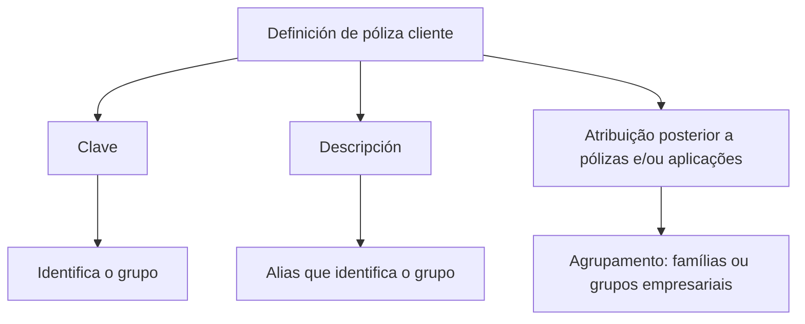

# Definição de Póliza Cliente — Documentação Reef

## 1. Metadados do Documento
- **Arquivo de Origem:** `Não identificado no conteúdo fornecido`
- **Tipo de Documento:** `Não identificado; conteúdo apresentado como documentação Reef`
- **Domínio / Sistema:** `Reef / Mapfredocument`
- **Público-Alvo:** `Não identificado`
- **Data/Versão Identificada:** `Não identificada`

---

## 2. Resumo Executivo & Contexto de Negócio

O documento descreve a funcionalidade **“Definición de póliza cliente”**, destinada a estabelecer uma chave posteriormente atribuída a pólizas e/ou aplicações. A finalidade explícita dessa chave é agrupar esses elementos.

Os agrupamentos mencionados incluem famílias e grupos empresariais. Portanto, a chave de póliza cliente atua como um identificador de agrupamento, permitindo associar múltiplas pólizas ou aplicações a uma mesma categoria ou grupo.

A documentação apresenta duas propriedades para a definição: **Clave**, que identifica o grupo, e **Descripción**, que representa um alias identificador do grupo. Não há detalhamento sobre persistência, interfaces, serviços, APIs, permissões, regras de validação ou fluxos operacionais.

O conteúdo está associado à documentação Reef, com referências a **Mapfredocument**, ao proprietário `user:agonzalez_mapfre.com` e ao ciclo de vida `Approved Source`.

---

## 3. Arquitetura, Componentes & Tecnologias Envolvidas

Os elementos explicitamente citados são:

| Componente / Elemento | Papel identificado no conteúdo |
| :--- | :--- |
| Definición de póliza cliente | Definição de uma chave para agrupamento de pólizas e/ou aplicações. |
| Clave | Propriedade que identifica o grupo. |
| Descripción | Propriedade usada como alias identificador do grupo. |
| Reef | Contexto de documentação mencionado no conteúdo. |
| Mapfredocument | Referência documental exibida no conteúdo. |
| Owner | Campo de propriedade associado a `user:agonzalez_mapfre.com`. |
| Lifecycle | Campo de ciclo de vida com valor `Approved Source`. |



> **Nota de Análise:** O conteúdo não detalha arquitetura de software, integrações, tecnologias, endpoints, contratos de API, bancos de dados ou ambientes de execução.

---

## 4. Regras de Negócio, Especificações Funcionais & Processos

1. A definição de póliza cliente estabelece uma **chave**.
2. A chave é atribuída posteriormente a **pólizas e/ou aplicações**.
3. A finalidade da chave é **agrupar** pólizas e/ou aplicações.
4. Os exemplos de agrupamento apresentados são:
   - Famílias.
   - Grupos empresariais.
5. A propriedade **Clave** identifica o grupo.
6. A propriedade **Descripción** é o alias que identifica o grupo.

> **Nota de Análise:** O documento não especifica regras de obrigatoriedade, unicidade da chave, formato dos valores, limites de tamanho, critérios de criação, atualização, exclusão ou validação.

---

## 5. Tabelas de Parâmetros, Ambientes e Estruturas de Dados

| Item / Parâmetro | Descrição / Função | Tipo / Valores / Formato | Ambiente / Observações |
| :--- | :--- | :--- | :--- |
| Clave | Chave que identificará o grupo. | Não especificado. | Aplicável ao agrupamento de pólizas e/ou aplicações. |
| Descripción | Alias que identifica o grupo. | Não especificado. | Associado à definição de póliza cliente. |
| Objetivo | Estabelecer uma chave a ser atribuída posteriormente a pólizas e/ou aplicações para agrupamento. | Regra funcional. | Exemplos: famílias e grupos empresariais. |
| Owner | Proprietário exibido na documentação. | `user:agonzalez_mapfre.com` | Referência de propriedade documental. |
| Lifecycle | Estado de ciclo de vida exibido. | `Approved Source` | Não há detalhamento adicional. |
| Documentação | Referência ao repositório ou contexto documental. | `DOCUMENTACIÓN Reef` / `Mapfredocument` | Não há URL ou localização técnica especificada. |

---

## 6. Bateria de Perguntas & Respostas para RAG (FAQ Sintético)

### P1: Qual é o objetivo da definição de póliza cliente?
**R:** O objetivo é estabelecer uma chave que será atribuída posteriormente a pólizas e/ou aplicações para permitir o agrupamento desses elementos.

### P2: Quais entidades podem receber a chave definida em póliza cliente?
**R:** A chave pode ser atribuída a pólizas e/ou aplicações, conforme indicado no objetivo do documento.

### P3: Para que serve a propriedade Clave?
**R:** A propriedade **Clave** é a chave que identificará o grupo associado à definição de póliza cliente.

### P4: Para que serve a propriedade Descripción?
**R:** A propriedade **Descripción** representa o alias que identifica o grupo.

### P5: Quais exemplos de agrupamento são apresentados na documentação?
**R:** A documentação cita como exemplos de agrupamento as famílias e os grupos empresariais.

### P6: O documento define o formato ou o tamanho da propriedade Clave?
**R:** Não. O documento informa apenas que **Clave** identifica o grupo; formato, tamanho e validações não são detalhados.

### P7: O documento informa APIs ou métodos HTTP para gerenciar a definição de póliza cliente?
**R:** Não. Não há métodos HTTP, endpoints, contratos JSON ou APIs descritos no conteúdo fornecido.

### P8: Qual é o ciclo de vida identificado na documentação?
**R:** O campo **Lifecycle** aparece com o valor `Approved Source`.

### P9: Quem está identificado como proprietário do conteúdo?
**R:** O campo **Owner** apresenta o valor `user:agonzalez_mapfre.com`.

### P10: Qual sistema ou contexto documental é citado?
**R:** O conteúdo cita `DOCUMENTACIÓN Reef` e `Mapfredocument`, sem detalhar a relação técnica entre esses elementos.

---

## 7. Glossário de Termos, Siglas & Conceitos-Chave

- **Póliza cliente:** Definição documental cuja finalidade é estabelecer uma chave de agrupamento para pólizas e/ou aplicações.
- **Clave:** Propriedade que identifica o grupo.
- **Descripción:** Propriedade que funciona como alias identificador do grupo.
- **Grupo:** Entidade identificada pela propriedade Clave; pode representar, por exemplo, uma família ou grupo empresarial.
- **Reef:** Nome citado como contexto da documentação.
- **Mapfredocument:** Referência documental exibida no conteúdo.
- **Approved Source:** Valor exibido para o campo Lifecycle.

---

## 8. Notas Críticas, Riscos & Limitações

- O conteúdo não identifica nome de arquivo, data, versão ou autor formal do documento.
- Não há especificação de formato, tipo de dado, obrigatoriedade ou unicidade para **Clave** e **Descripción**.
- Não há detalhes sobre telas, serviços, APIs, banco de dados, integrações ou ambientes.
- Não há fluxos de criação, manutenção, associação ou remoção da chave de póliza cliente.
- O documento menciona `Reef` e `Mapfredocument`, mas não explica a função técnica ou operacional de cada referência.
- O texto contém caracteres de extração corrompidos em “con el n” e “identicará”; o sentido contextual indica “fin” e “identificará”, mas a transcrição bruta abaixo preserva o conteúdo fornecido.

---

## 9. Conteúdo Bruto Estruturado (Referência Fiel)

```text
--- [PÁGINA 1 DE 1] ---

DEFINICIÓN de póliza cliente
Objetivo
Establece una clave que posteriormente será asignada a pólizas y/o aplicaciones con el n de agruparlas. Estaa clave está pensada para
agrupar (familias, grupos empresariales, etc).
-Propiedades
Propiedades
Clave
Clave que identicará al grupo
Descripción
Alias que identica al grupo
Documentation / DOCUMENTACIÓN Reef
DOCUMENTACIÓN Reef
Mapfredocument
DOCUMENTACIÓN Reef
Owner
user:agonzalez_mapfre.com
Lifecycle
Approved Source
 / 
 VL
Buscar Inicio Soluciones Arquitecturas APIs Componentes Cloud Documentación Zeus Reef Ayuda
ES
```
