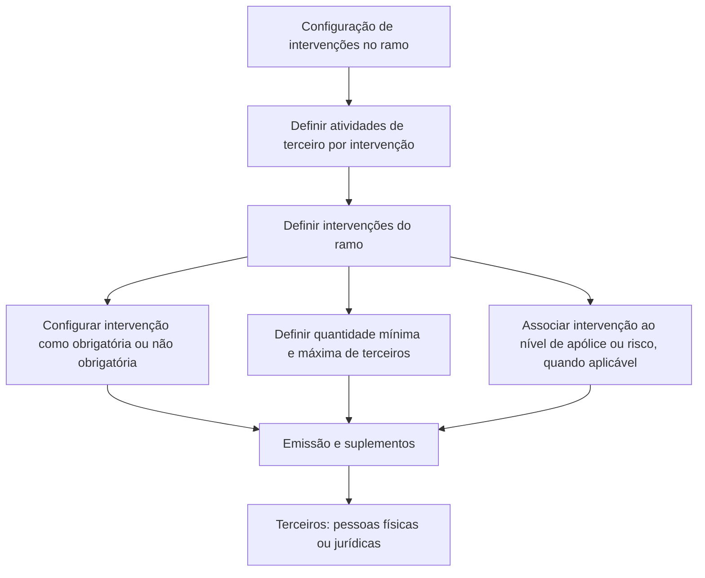

# Definição de Intervenções no Reef.core para Emissão e Suplementos de Apólices

## 1. Metadados do Documento
- **Arquivo de Origem:** `Não identificado no conteúdo fornecido`
- **Tipo de Documento:** Procedimento
- **Domínio / Sistema:** Reef.core / Documentação Reef / Mapfre
- **Público-Alvo:** Negócio, Analistas Funcionais, Configuradores de Ramos e Operação
- **Data/Versão Identificada:** Não identificada
- **Owner identificado no conteúdo:** `user:agonzalez_mapfre.com`
- **Lifecycle identificado no conteúdo:** Approved

---

## 2. Resumo Executivo & Contexto de Negócio

O documento descreve a definição de **intervenções** no sistema Reef.core. Uma intervenção representa uma agrupação sob a qual podem ser incluídos um ou mais terceiros, sejam pessoas físicas ou pessoas jurídicas. As intervenções são utilizadas durante a emissão de apólices e suplementos para determinar quais figuras de terceiros poderão ser solicitadas.

As intervenções disponíveis não são de criação livre. O documento afirma que existe uma série de intervenções previamente estabelecidas no Reef.core e que, caso seja necessária uma nova intervenção, deve ser realizada uma solicitação para inclusão dessa intervenção no sistema.

A configuração é aplicada por ramo. Em geral, as intervenções não são obrigatórias em um ramo, exceto a intervenção de **tomador da apólice**. Mesmo quando uma intervenção é incorporada a um ramo, a configuração pode defini-la como não obrigatória, permitindo que algumas apólices possuam terceiros associados à intervenção e outras não.

O documento também estabelece que cada intervenção pode possuir uma quantidade mínima e máxima de terceiros associados. Algumas intervenções são exclusivas do nível de apólice, enquanto outras podem ser utilizadas tanto no nível de apólice quanto no nível de risco.

O processo apresentado possui duas etapas principais: definir as atividades de terceiro por intervenção e definir as intervenções do ramo. O material fornecido não apresenta detalhamento adicional sobre os campos, telas, critérios de validação ou responsáveis por cada etapa.

---

## 3. Arquitetura, Componentes & Tecnologias Envolvidas

Os componentes e conceitos identificados no documento são:

| Componente / Conceito | Papel descrito no documento |
| :--- | :--- |
| **Reef.core** | Sistema no qual existe uma série predefinida de intervenções e no qual se decide quais intervenções formarão parte das apólices. |
| **Intervenções** | Agrupações que podem conter um ou mais terceiros. |
| **Terceiros** | Pessoas físicas ou jurídicas que podem ser associadas a uma intervenção. |
| **Apólice** | Entidade na qual intervenções podem ser utilizadas e terceiros podem ser associados. |
| **Suplementos** | Contexto de negócio no qual são solicitadas figuras/intervenções. |
| **Ramo** | Escopo no qual são definidas as intervenções aplicáveis e sua obrigatoriedade. |
| **Nível de risco** | Nível alternativo de utilização para determinadas intervenções não exclusivas de apólice. |
| **Documentação Reef** | Portal ou área documental identificada no conteúdo bruto. |

O documento não descreve microsserviços, APIs, bancos de dados, protocolos, URLs operacionais, contratos JSON, métodos HTTP, versões tecnológicas ou ambientes de execução.



**Nota de Análise:** O documento identifica o Reef.core como sistema de referência, mas não detalha a arquitetura técnica interna, integrações, interfaces, endpoints ou persistência de dados.

---

## 4. Regras de Negócio, Especificações Funcionais & Processos

### 4.1. Conceito de intervenção

1. Uma intervenção é uma agrupação sob a qual são incluídos um ou mais terceiros.
2. Os terceiros associados a uma intervenção podem ser pessoas físicas ou pessoas jurídicas.
3. As intervenções são consideradas na emissão de apólices e suplementos.
4. O documento utiliza o termo “figuras” para se referir às entidades/intervenções que poderão ser solicitadas durante emissão e suplementos.

### 4.2. Catálogo de intervenções

1. Existe uma série de intervenções previamente estabelecidas no Reef.core.
2. As intervenções não são de livre criação.
3. Quando for necessária uma nova intervenção, deve ser realizada uma solicitação para que a inclusão seja efetuada.
4. O documento não informa o canal, equipe responsável, formulário, prazo ou processo de aprovação para solicitação de novas intervenções.

### 4.3. Obrigatoriedade por ramo

1. A definição das intervenções ocorre no contexto de um ramo.
2. A intervenção de **tomador da apólice** é apresentada como exceção à regra geral de não obrigatoriedade.
3. Exceto pela intervenção de tomador da apólice, as intervenções não são obrigatórias de incluir em um ramo.
4. Mesmo quando uma intervenção é incorporada a um ramo, a intervenção pode ser definida como não obrigatória.
5. Quando uma intervenção é não obrigatória, algumas apólices podem ter terceiros associados àquela intervenção, enquanto outras apólices podem não possuir terceiros associados à mesma intervenção.

### 4.4. Quantidade de terceiros por intervenção

1. É possível estabelecer uma quantidade mínima de terceiros que atuam em uma intervenção.
2. É possível estabelecer uma quantidade máxima de terceiros que atuam em uma intervenção.
3. O documento não apresenta valores mínimos ou máximos específicos.
4. O documento não especifica o comportamento do sistema quando a quantidade de terceiros estiver abaixo do mínimo ou acima do máximo configurado.

### 4.5. Níveis de utilização de intervenções

1. Existem intervenções exclusivas do nível de apólice.
2. Existem outras intervenções que podem ser utilizadas indistintamente no nível de apólice e no nível de risco.
3. O documento lista como intervenções exclusivas de nível de apólice:
   - Tomador
   - Tomadores alternos
   - Pagador

### 4.6. Processo de configuração apresentado

O documento define duas etapas para a definição de intervenções:

1. **Definir atividades de terceiro por intervenção.**
2. **Definir intervenções do ramo.**

**Nota de Análise:** O conteúdo fornecido apenas apresenta os nomes das duas etapas. Não há detalhamento sobre subetapas, campos obrigatórios, regras de aprovação, telas do Reef.core, responsáveis operacionais ou evidências esperadas após a configuração.

---

## 5. Tabelas de Parâmetros, Ambientes e Estruturas de Dados

| Item / Parâmetro | Descrição / Função | Tipo / Valores / Formato | Ambiente / Observações |
| :--- | :--- | :--- | :--- |
| Intervenção | Agrupação sob a qual são incluídos terceiros. | Conceito funcional | Previamente estabelecida no Reef.core. |
| Terceiro | Pessoa associada a uma intervenção. | Pessoa física ou pessoa jurídica | Pode haver um ou mais terceiros por intervenção. |
| Ramo | Escopo para definição das intervenções aplicáveis. | Entidade de negócio | Uma intervenção pode ou não ser incluída em um ramo. |
| Obrigatoriedade da intervenção | Determina se a presença de terceiros em uma intervenção é obrigatória. | Obrigatória ou não obrigatória | A intervenção de tomador da apólice é exceção mencionada no documento. |
| Quantidade mínima de terceiros | Limite inferior de terceiros que atuam em uma intervenção. | Número mínimo | Valor não informado. |
| Quantidade máxima de terceiros | Limite superior de terceiros que atuam em uma intervenção. | Número máximo | Valor não informado. |
| Nível de utilização | Determina o nível em que uma intervenção pode ser utilizada. | Nível de apólice; nível de risco | Algumas intervenções são exclusivas de apólice. |
| Tomador | Intervenção exclusiva de nível de apólice. | Intervenção | Apresentada como exceção à regra geral de não obrigatoriedade. |
| Tomadores alternos | Intervenção exclusiva de nível de apólice. | Intervenção | Sem detalhamento adicional. |
| Pagador | Intervenção exclusiva de nível de apólice. | Intervenção | Sem detalhamento adicional. |
| Reef.core | Sistema que contém intervenções previamente estabelecidas. | Sistema corporativo | Não há informações técnicas adicionais. |
| Etapa 1 | Definir atividades de terceiro por intervenção. | Etapa de processo | Não detalhada no material fornecido. |
| Etapa 2 | Definir intervenções do ramo. | Etapa de processo | Não detalhada no material fornecido. |

---

## 6. Bateria de Perguntas & Respostas para RAG (FAQ Sintético)

### P1: O que é uma intervenção no contexto do Reef.core?
**R:** Uma intervenção é uma agrupação sob a qual são incluídos um ou mais terceiros. Os terceiros associados podem ser pessoas físicas ou pessoas jurídicas. As intervenções são utilizadas na definição das figuras que serão solicitadas durante a emissão de apólices e suplementos.

### P2: É possível criar livremente uma nova intervenção no Reef.core?
**R:** Não. O documento informa que as intervenções já foram estabelecidas previamente no Reef.core e não são de livre criação. Quando for necessária uma nova intervenção, deve ser realizada uma solicitação para inclusão dessa intervenção.

### P3: Todas as intervenções precisam ser incluídas em todos os ramos?
**R:** Não. Salvo a intervenção de tomador da apólice, as intervenções não são obrigatórias de incluir em um ramo. A definição de quais intervenções farão parte de um ramo depende da configuração realizada para aquele ramo.

### P4: Uma intervenção incluída em um ramo sempre será obrigatória para todas as apólices?
**R:** Não. Mesmo que uma intervenção seja incorporada a um ramo, ela pode ser definida como não obrigatória. Nesse cenário, algumas apólices podem ter terceiros associados à intervenção e outras podem não ter terceiros associados àquela intervenção.

### P5: É possível controlar quantos terceiros podem atuar em uma intervenção?
**R:** Sim. O documento informa que é possível estabelecer um número mínimo e um número máximo de terceiros que atuam em uma intervenção. Os valores específicos desses limites não são apresentados no conteúdo fornecido.

### P6: Quais intervenções são exclusivas do nível de apólice?
**R:** As intervenções apresentadas como exclusivas de nível de apólice são: tomador, tomadores alternos e pagador.

### P7: Uma intervenção pode ser utilizada no nível de risco?
**R:** Algumas intervenções podem ser utilizadas indistintamente no nível de apólice e no nível de risco. Entretanto, o documento diferencia essas intervenções das intervenções exclusivas de nível de apólice, como tomador, tomadores alternos e pagador.

### P8: Qual é o primeiro passo do processo de definição de intervenções?
**R:** O primeiro passo é definir as atividades de terceiro por intervenção. O documento não detalha quais atividades existem, como são configuradas ou quais campos devem ser preenchidos nessa etapa.

### P9: Qual é o segundo passo do processo de definição de intervenções?
**R:** O segundo passo é definir as intervenções do ramo. O objetivo é estabelecer, no contexto de cada ramo, quais intervenções farão parte das apólices e como serão aplicadas.

### P10: O documento especifica APIs ou métodos HTTP para configurar intervenções?
**R:** Não. O conteúdo não apresenta APIs, métodos HTTP, contratos JSON, URLs, portas, bancos de dados ou detalhes de integração técnica relacionados à configuração de intervenções.

---

## 7. Glossário de Termos, Siglas & Conceitos-Chave

- **Reef.core:** Sistema citado como repositório de uma série de intervenções previamente estabelecidas.
- **Intervenção:** Agrupação sob a qual são incluídos um ou mais terceiros.
- **Terceiro:** Pessoa física ou jurídica associada a uma intervenção.
- **Ramo:** Escopo de negócio no qual são definidas as intervenções aplicáveis.
- **Apólice:** Entidade de negócio que pode conter intervenções e terceiros associados.
- **Suplementos:** Contexto mencionado juntamente com a emissão para solicitação de figuras/intervenções.
- **Tomador:** Intervenção listada como exclusiva de nível de apólice.
- **Tomadores alternos:** Intervenção listada como exclusiva de nível de apólice.
- **Pagador:** Intervenção listada como exclusiva de nível de apólice.
- **Nível de apólice:** Nível de utilização de intervenções relacionado diretamente à apólice.
- **Nível de risco:** Nível de utilização disponível para intervenções não exclusivas de apólice.

---

## 8. Notas Críticas, Riscos & Limitações

- O documento não identifica o nome do arquivo de origem, a data, a versão ou o autor funcional do conteúdo.
- O material não especifica valores mínimos e máximos de terceiros por intervenção.
- O material não detalha regras de validação para violações dos limites mínimo e máximo de terceiros.
- O processo para solicitar a criação de uma nova intervenção é mencionado, mas não possui fluxo, responsável, canal ou SLA documentado.
- As etapas “definir atividades de terceiro por intervenção” e “definir intervenções do ramo” são apresentadas sem procedimentos detalhados.
- Não há definição de permissões, perfis de acesso, matriz de responsabilidade ou processo de aprovação.
- Não há informações sobre APIs, contratos técnicos, persistência, integrações, ambientes ou logs.
- O texto bruto contém caracteres corrompidos, como `guras` e `denición`. A estrutura analítica preserva o sentido aparente sustentado pelo contexto, sem introduzir fatos técnicos adicionais.

---

## 9. Conteúdo Bruto Estruturado (Referência Fiel)

```text
--- [PÁGINA 1 DE 2] ---

DEFINICIÓN de Intervenciones
Objetivo
Realizar la denición de qué guras se solicitará en la emisión y suplementos. A cada gura se le podrá asociar personas físicas o jurídicas
(terceros).
¿En qué consiste?
Existe una serie de guras establecidas en Reef.core las cuales se decide si formarán parte de las pólizas. Se puede decir que una gura es
una agrupación bajo la que se incluyen uno o varios terceros.
A estas guras se las denomina intervenciones.
Las intervenciones han sido establecidas previamente y no son de libre creación. Cuando sea necesario una nueva intervención, debe ser
solicitada para que se realice su inclusión.
Características generales
Salvo la intervención de tomador de la póliza no son obligatorias de incluir en un ramo
Incluso si se incorpora una intervención a un ramo, se puede denir como no obligatoria. Es decir, habrá póliza que disponga de terceros
en esa intervención y otras pólizas no tendrán asociados terceros a a esa intervención
Es factible establecer un número mínimo y máximo de terceros que actúan en una intervención
Existen intervenciones que son exclusivas de póliza (detalladas a continuación) y otras se pueden utilizar indistintamente en el nivel de
póliza y riesgo
Ejemplo:
Ejemplo:
Ejemplo:
Documentation / DOCUMENTACIÓN Reef
DOCUMENTACIÓN Reef
Mapfredocument
DOCUMENTACIÓN Reef
Owner
user:agonzalez_mapfre.com
Lifecycle
Approved Source
 / 
 VL
Buscar Inicio Soluciones Arquitecturas APIs Componentes Cloud Documentación Zeus Reef Ayuda
ES


--- [PÁGINA 2 DE 2] ---

INTERVENCIÓN EXCLUSIVA
DE NIVEL PÓLIZA
TOMADOR
TOMADORES ALTERNOS
PAGADOR
Proceso a seguir
La denición de las intervenciones se realiza completando los pasos mostrados a continuación.
DEFINIR
actividades
de tercero
por
intervención
(1)
DEFINIR
Intervenciones
del
ramo
(2)
1. DEFINIR actividades de tercero por intervención
1. DEFINIR intervenciones del ramo
```
