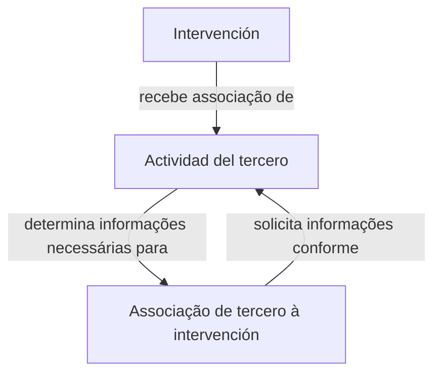

# Definição de Intervenções — Associação de Atividade de Terceiro

## 1. Metadados do Documento
- **Arquivo de Origem:** Não identificado no conteúdo fornecido
- **Tipo de Documento:** Especificação Funcional
- **Domínio / Sistema:** Reef / Mapfredocument
- **Público-Alvo:** Não identificado no conteúdo fornecido
- **Data/Versão Identificada:** Não identificada

---

## 2. Resumo Executivo & Contexto de Negócio

O documento descreve a funcionalidade **“DEFINICIÓN intervenciones - Actividad de tercero”**, cujo objetivo é associar uma atividade de terceiro a uma intervenção. A definição da atividade de terceiro ocorre no contexto de uma intervenção específica.

A atividade de terceiro associada à intervenção determina, entre outros aspectos, quais informações serão solicitadas quando um terceiro for associado à intervenção. Portanto, a atividade de terceiro influencia diretamente os requisitos de informação do processo de associação.

A funcionalidade apresenta duas propriedades principais: **Intervención**, utilizada para decidir a qual intervenção será atribuída uma atividade de terceiro; e **Actividad del tercero**, utilizada para determinar qual atividade será associada à intervenção selecionada.

O conteúdo está disponibilizado no contexto de documentação Reef, com referências visuais a **Mapfredocument**, **DOCUMENTACIÓN Reef**, navegação de soluções, arquiteturas, APIs, componentes, cloud, documentação, Zeus, Reef e ajuda. O ciclo de vida exibido é **Approved Source / VL**.

---

## 3. Arquitetura, Componentes & Tecnologias Envolvidas

Os elementos explicitamente citados no documento são:

| Componente / Elemento | Papel descrito |
| :--- | :--- |
| Intervención | Entidade para a qual será atribuída uma atividade de terceiro. |
| Actividad del tercero | Atributo que define a atividade de terceiro associada à intervenção. |
| Tercero | Entidade associada a uma intervenção, para a qual informações serão solicitadas conforme a atividade definida. |
| Reef | Contexto de documentação mencionado no documento. |
| Mapfredocument | Nome exibido na área de documentação. |
| DOCUMENTACIÓN Reef | Área ou referência de documentação exibida. |
| Zeus | Item citado na navegação da documentação. |
| Owner `user:agonzalez_mapfre.com` | Proprietário identificado no conteúdo. |
| Lifecycle `Approved Source / VL` | Estado de ciclo de vida exibido. |



**Nota de Análise:** O documento não detalha componentes técnicos, APIs, métodos HTTP, contratos JSON, banco de dados, integrações, ambientes, tecnologias de implementação ou fluxos de persistência.

---

## 4. Regras de Negócio, Especificações Funcionais & Processos

### Objetivo funcional

A funcionalidade tem como objetivo atribuir uma **atividade de terceiro** a uma **intervenção**.

### Regra principal de determinação de informações

A atividade de terceiro associada a uma intervenção determina quais informações serão solicitadas durante a associação de um terceiro à intervenção.

Em termos funcionais, o documento estabelece a seguinte relação:

1. Uma intervenção é selecionada.
2. Uma atividade de terceiro é atribuída à intervenção.
3. Um terceiro é associado à intervenção.
4. As informações requeridas para a associação do terceiro dependem da atividade de terceiro previamente associada à intervenção.

### Propriedades funcionais

#### Intervención

Na propriedade **Intervención**, é decidido a qual intervenção será atribuída uma atividade de terceiro.

#### Actividad del tercero

No atributo **Actividad del tercero**, é determinada qual atividade de terceiro será associada à intervenção.

### Restrições e limites de especificação

- O documento informa que a atividade de terceiro determina informações a serem solicitadas, mas não enumera quais campos, documentos ou dados são obrigatórios para cada atividade.
- O documento não apresenta catálogo de atividades de terceiro.
- O documento não define critérios de validação, regras de obrigatoriedade, mensagens de erro ou comportamento para associações inválidas.
- O documento não detalha operações de criação, alteração, exclusão, consulta ou aprovação da associação entre intervenção e atividade de terceiro.

---

## 5. Tabelas de Parâmetros, Ambientes e Estruturas de Dados

| Item / Parâmetro | Descrição / Função | Tipo / Valores / Formato | Ambiente / Observações |
| :--- | :--- | :--- | :--- |
| Intervención | Define a intervenção à qual será atribuída uma atividade de terceiro. | Propriedade / atributo funcional | O documento não especifica identificador, formato ou valores permitidos. |
| Actividad del tercero | Define a atividade de terceiro associada à intervenção. | Atributo funcional | Determina quais informações serão solicitadas ao associar um terceiro à intervenção. |
| Tercero | Entidade que pode ser associada a uma intervenção. | Entidade de negócio | O documento não detalha atributos, identificadores ou tipos de terceiro. |
| Owner | Proprietário da documentação. | `user:agonzalez_mapfre.com` | Exibido no documento. |
| Lifecycle | Estado de ciclo de vida da documentação. | `Approved Source / VL` | O significado de `VL` não é expandido no conteúdo. |
| Idioma exibido | Idioma da interface de documentação. | `ES` | Exibido na navegação. |
| Áreas de navegação | Seções disponíveis na interface. | Buscar, Inicio, Soluciones, Arquitecturas, APIs, Componentes, Cloud, Documentación, Zeus, Reef, Ayuda | Referências de navegação; não são especificações funcionais detalhadas. |

---

## 6. Bateria de Perguntas & Respostas para RAG (FAQ Sintético)

### P1: Qual é o objetivo da definição de intervenções relacionada à atividade de terceiro?
**R:** O objetivo é atribuir uma atividade de terceiro a uma intervenção. Essa associação determina, entre outros aspectos, quais informações serão solicitadas quando um terceiro for associado à intervenção.

### P2: O que a propriedade “Intervención” define?
**R:** A propriedade **Intervención** define a qual intervenção será atribuída uma atividade de terceiro.

### P3: O que o atributo “Actividad del tercero” determina?
**R:** O atributo **Actividad del tercero** determina qual atividade de terceiro será associada à intervenção selecionada.

### P4: Como a atividade de terceiro afeta a associação de um terceiro a uma intervenção?
**R:** A atividade de terceiro determina as informações necessárias que serão solicitadas durante a associação de um terceiro à intervenção, pois a informação requerida depende da atividade do terceiro.

### P5: O documento lista quais informações devem ser solicitadas para cada atividade de terceiro?
**R:** Não. O documento informa que as informações solicitadas dependem da atividade de terceiro, mas não apresenta a lista de informações, campos ou documentos requeridos para cada atividade.

### P6: O documento apresenta um catálogo de atividades de terceiro disponíveis?
**R:** Não. O conteúdo menciona o atributo **Actividad del tercero**, mas não lista atividades de terceiro, códigos, descrições ou regras específicas por atividade.

### P7: Há APIs, métodos HTTP ou contratos JSON documentados para a associação entre intervenção e atividade de terceiro?
**R:** Não. Embora a interface de documentação apresente uma área de navegação chamada APIs, o conteúdo fornecido não detalha APIs, métodos HTTP, endpoints, contratos JSON ou integrações técnicas.

### P8: Quem é o proprietário identificado para esta documentação?
**R:** O proprietário identificado no documento é `user:agonzalez_mapfre.com`.

### P9: Qual é o ciclo de vida exibido para a documentação?
**R:** O ciclo de vida exibido é `Approved Source / VL`. O documento não explica o significado de `VL`.

### P10: Em qual contexto documental a definição de intervenções é apresentada?
**R:** A definição é apresentada no contexto de **DOCUMENTACIÓN Reef**, com referência também a **Mapfredocument**.

---

## 7. Glossário de Termos, Siglas & Conceitos-Chave

- **Actividad del tercero:** Atributo que determina a atividade de terceiro associada a uma intervenção.
- **Intervención:** Propriedade utilizada para decidir a qual intervenção uma atividade de terceiro será atribuída.
- **Tercero:** Entidade associada a uma intervenção; as informações solicitadas nessa associação dependem da atividade de terceiro.
- **Reef:** Contexto de documentação mencionado no conteúdo.
- **Mapfredocument:** Nome exibido na documentação fornecida.
- **Owner:** Campo que identifica o proprietário da documentação.
- **Lifecycle:** Campo que apresenta o estado de ciclo de vida da documentação.
- **Approved Source:** Valor exibido no campo Lifecycle.
- **VL:** Sigla ou valor exibido junto a `Approved Source`; o significado não é definido no documento.
- **ES:** Indicador de idioma exibido na interface.

---

## 8. Notas Críticas, Riscos & Limitações

- **Nota de Análise:** O documento define a finalidade da associação entre intervenção e atividade de terceiro, mas não detalha o modelo de dados envolvido.
- **Nota de Análise:** Não há especificação dos tipos de atividades de terceiro, suas regras individuais, códigos, descrições ou campos de informação correspondentes.
- **Nota de Análise:** Não são fornecidos critérios de validação, regras de obrigatoriedade, tratamento de erros, permissões de acesso ou fluxo de aprovação.
- **Nota de Análise:** O conteúdo não apresenta APIs, integrações, ambientes, URLs, logs, infraestrutura, tecnologias ou contratos técnicos.
- **Risco de interpretação:** Não é possível determinar, apenas com o texto fornecido, quais dados devem ser coletados para cada atividade de terceiro.
- **Risco de implementação:** Uma implementação baseada somente neste documento exigiria definição complementar do catálogo de atividades e dos requisitos de informação associados a cada atividade.
- **Limitação documental:** O significado do estado `VL` não é explicado.

---

## 9. Conteúdo Bruto Estruturado (Referência Fiel)

```text
--- [PÁGINA 1 DE 1] ---

EN CONSTRUCCIÓN
DEFINICIÓN intervenciones - Actividad de tercero
Objetivo
Asignar cual será la actividad de tercero asociada a una intervención. Esto determinará entre otras, cual será la información que se solicitará
al asociar un tercero a una intervención, ya que la información necesaria depende de la actividad del tercero.
Propiedades
Intervención
En este punto se decide a que intervención se le asignará una actividad del tercero.
Actividad del tercero
En este atributo se determina qué actividad de tercero se asociará a la intervención.
Documentation / DOCUMENTACIÓN Reef
DOCUMENTACIÓN Reef
Mapfredocument
DOCUMENTACIÓN Reef
Owner
user:agonzalez_mapfre.com
Lifecycle
Approved Source
 / 
 VL
Buscar Inicio Soluciones Arquitecturas APIs Componentes Cloud Documentación Zeus Reef Ayuda
ES
```
