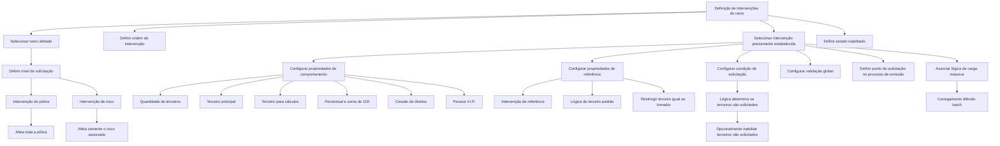

# Definição de Intervenções do Ramo no Reef.core — Configuração, Solicitação e Validação de Terceiros

## 1. Metadados do Documento
- **Arquivo de Origem:** Não identificado no conteúdo fornecido
- **Tipo de Documento:** Manual Operacional / Especificação Funcional
- **Domínio / Sistema:** Reef.core / Reef / emissão ou modificação de póliza
- **Público-Alvo:** Analistas funcionais, equipes de negócio, operadores de emissão e desenvolvedores
- **Data/Versão Identificada:** Não identificada
- **Owner identificado:** `user:agonzalez_mapfre.com`
- **Lifecycle identificado:** `Approved Source`

---

## 2. Resumo Executivo & Contexto de Negócio

O documento descreve a definição de intervenções aplicáveis a um ramo no sistema Reef.core. A configuração determina quais intervenções, entre as previamente definidas, podem ser solicitadas durante os processos de emissão ou modificação de uma póliza ou aplicação do ramo.

As intervenções não são criadas livremente nessa definição. Quando uma nova intervenção for necessária, a inclusão deve ser solicitada previamente. A definição concentra-se em selecionar uma intervenção existente e estabelecer propriedades que controlam o nível de solicitação, a ordem de apresentação, o comportamento de terceiros associados, as referências, as condições de solicitação, as validações, o momento do processo de emissão e a carga massiva.

O conceito de nível de solicitação diferencia intervenções de **póliza** e de **risco**. Uma intervenção de póliza afeta a apólice inteira, independentemente da quantidade de riscos. Uma intervenção de risco afeta somente o risco ao qual estiver associada.

O documento também detalha regras para terceiros vinculados a intervenções, incluindo quantidade mínima e máxima, obrigatoriedade de terceiro principal, possibilidade de múltiplos principais, seleção manual de terceiro para cálculos, divisão percentual, cessão de direitos, indicação de pessoa V.I.P. e uso de terceiros de referência.

A configuração pode condicionar se uma intervenção será solicitada em determinado movimento, inabilitar terceiros quando a intervenção não for solicitada, executar validações globais sobre todos os terceiros da intervenção e carregar terceiros de forma diferida por processo batch. O documento não apresenta contratos técnicos, métodos HTTP, modelos JSON, persistência de dados ou detalhes de implementação das lógicas de negócio configuráveis.

---

## 3. Arquitetura, Componentes & Tecnologias Envolvidas

### Componentes e conceitos identificados

| Componente / Conceito | Papel descrito no documento |
| :--- | :--- |
| **Reef.core** | Sistema que suporta a configuração e o processo de emissão de pólizas; não escolhe automaticamente o terceiro principal nem o terceiro usado para cálculos quando essas escolhas são manuais. |
| **Definição de intervenções do ramo** | Configuração que determina quais intervenções existentes podem ser requeridas para emissão ou modificação de póliza/aplicação do ramo. |
| **Intervenção** | Elemento previamente estabelecido e selecionável na definição; pode estar associada a póliza ou risco. |
| **Ramo** | Ramo ao qual a definição de intervenção afeta. |
| **Póliza** | Nível no qual uma intervenção pode afetar toda a apólice, independentemente do número de riscos. |
| **Risco** | Nível no qual uma intervenção afeta exclusivamente o risco associado. |
| **Terceiro** | Pessoa ou entidade registrada sob uma intervenção. Pode possuir atributos como principal, usado em cálculos, percentual, referência, cessão de direitos ou condição V.I.P. |
| **Tomador** | Pessoa cujo tipo e número de documento podem ser permitidos ou proibidos como terceiro da intervenção. |
| **Lógica de negócio** | Mecanismo configurável para decidir terceiros, condições de solicitação, validações e carga massiva. O documento não especifica linguagem, tecnologia, contrato ou implementação dessas lógicas. |
| **Carga massiva / batch** | Processo diferido para carregar terceiros de uma intervenção quando uma lógica de carga massiva estiver associada. |

### Fluxo funcional de configuração e solicitação



> **Nota de Análise:** O documento descreve lógicas de negócio configuráveis, mas não identifica nomes de serviços, APIs, linguagens, bancos de dados, URLs, ambientes, protocolos ou contratos de integração.

---

## 4. Regras de Negócio, Especificações Funcionais & Processos

### 4.1. Escopo da definição de intervenções

1. A definição decide quais intervenções previamente definidas podem ser requeridas durante a emissão ou modificação de póliza/aplicação do ramo.
2. As intervenções já devem existir antes de serem incluídas nessa definição.
3. As intervenções não são de livre criação.
4. Quando houver necessidade de uma nova intervenção, deve ser solicitada a sua inclusão.
5. A definição contém propriedades:
   - Gerais;
   - De comportamento;
   - De referência;
   - Que determinam se a intervenção é solicitada;
   - Que determinam quando a intervenção é solicitada;
   - Relativas à validação;
   - Relativas à carga massiva.

### 4.2. Propriedades gerais

#### Ramo
A propriedade **Ramo** aponta para o ramo afetado pela definição de intervenção.

#### Nível de solicitação
Os níveis possíveis são:

- **Póliza:** as intervenções registradas afetam toda a póliza, independentemente do número de riscos que a póliza contenha.
- **Risco:** as intervenções registradas afetam somente o risco ao qual estão associadas.

#### Ordem
A propriedade **Ordem** define a sequência em que as intervenções serão requeridas dentro do nível de solicitação definido.

#### Intervenção a requerer
A propriedade **Intervenção a requerer** determina qual intervenção, dentre as intervenções estabelecidas previamente, será solicitada.

#### Inabilitado
A propriedade **Inabilitado** define se uma intervenção está ativa ou se não pode mais ser incluída em uma nova póliza.

Regras associadas ao estado inabilitado:

1. A inabilitação impede a seleção da intervenção em novas pólizas.
2. A inabilitação não interrompe a aplicação da intervenção nas pólizas que já a possuem.
3. A intervenção continuará sendo aplicada nas pólizas existentes até que seja alterada por meio de um suplemento.
4. Após a alteração por suplemento, a intervenção inabilitada não poderá mais ser selecionada.

### 4.3. Propriedades de comportamento de terceiros

#### Número de terceiros
A configuração indica:

- Se é obrigatório registrar algum terceiro sob a intervenção;
- O número mínimo de terceiros;
- O número máximo de terceiros.

#### Existência de terceiro principal
A configuração define se deve existir um terceiro considerado principal quando houver vários terceiros na intervenção.

Regras associadas:

1. O atributo é relevante quando a intervenção permite mais de um terceiro.
2. Reef.core não escolhe o terceiro principal.
3. A pessoa que executa a operação escolhe qual terceiro será considerado principal.

#### Vários terceiros considerados principais
A configuração indica que pode haver mais de um terceiro considerado principal.

#### Terceiro considerado para cálculos
A configuração determina se deve existir, ou não, um terceiro que será utilizado para cálculos.

Regras associadas:

1. O terceiro usado para cálculos é atribuído manualmente.
2. Reef.core não identifica automaticamente o terceiro usado para cálculos.
3. A pessoa que realiza a operação escolhe, entre os terceiros da intervenção, o terceiro cujos dados serão utilizados nos cálculos.

#### Lógica de negócio que determina sobre qual terceiro se calcula
A lógica de negócio determina o tipo de documento e o número de documento sobre os quais os cálculos serão realizados.

#### Inclusão de percentual
A propriedade **Incluir percentual** define que deve ser solicitado um percentual.

O percentual é necessário quando houver distribuição entre diferentes terceiros de uma intervenção, incluindo os exemplos citados:

- Declaração de beneficiários;
- Existência de mais de uma entidade à qual os direitos foram cedidos em razão do financiamento do risco.

#### Soma percentual igual a 100
Quando uma intervenção requer percentuais, a propriedade pode determinar que a soma dos percentuais de todos os terceiros incluídos na intervenção seja igual a 100.

#### Cessão de direitos
A ativação da propriedade de cessão de direitos implica que, para a intervenção, será solicitada informação relativa ao empréstimo contratado com a entidade indicada na intervenção, relacionado ao risco segurado.

Informações do empréstimo solicitadas no processo de emissão:

1. Número de contrato;
2. Data de vencimento do financiamento;
3. Valor financiado.

#### Pessoa V.I.P.
Quando a propriedade de pessoa V.I.P. for ativada, o processo de emissão solicitará se a pessoa incluída na póliza, dentro da intervenção, é considerada uma pessoa importante.

Regra explícita:

- Reef.core não possui comportamento especial associado à condição de pessoa V.I.P.; a informação é somente informativa.

### 4.4. Propriedades de referência

#### Intervenção de referência
A configuração pode determinar que o terceiro associado à intervenção em definição seja obtido de outra intervenção, indicada como intervenção de referência.

#### Lógica de negócio que determina o terceiro de referência
Essa lógica determina quem será o terceiro usado por padrão.

A lógica retorna:

- Tipo de documento;
- Número de documento;

da pessoa que será considerada o terceiro padrão.

#### Terceiro distinto do tomador
A propriedade determina se o tipo e o número de documento do tomador podem ou não ser utilizados na intervenção em definição.

### 4.5. Propriedades que determinam se a intervenção é solicitada

#### Lógica de negócio para determinar se os terceiros da intervenção são solicitados
A lógica de negócio determina se, no movimento que está sendo realizado, é necessário solicitar os terceiros da intervenção.

O objetivo é evitar a solicitação de uma intervenção quando as informações já coletadas permitirem concluir que não faz sentido solicitá-la.

#### Inabilitação de terceiros quando a intervenção não é solicitada
Essa propriedade está vinculada à lógica anterior quando existir uma lógica definida.

Quando a intervenção não for solicitada, a configuração determina se todos os terceiros da intervenção não solicitada devem ser inabilitados.

### 4.6. Propriedades relativas à validação

#### Lógica de negócio de validação da intervenção
Uma lógica de negócio pode ser associada para validar a intervenção.

A validação:

1. Abrange todos os terceiros incluídos na intervenção;
2. É global para a intervenção;
3. Não é detalhada adicionalmente no documento quanto a regras, mensagens, eventos ou critérios técnicos.

### 4.7. Propriedades que determinam quando a intervenção é solicitada

A configuração permite escolher o ponto do processo de emissão em que a intervenção será solicitada.

A finalidade é controlar melhor a intervenção, considerando que, em alguns casos, pode ser necessário que atributos já tenham sido solicitados — ou que ainda não tenham sido solicitados.

#### Pontos para intervenções de póliza
- Antes dos atributos de póliza;
- Ao pressionar o botão **terminar**.

#### Pontos para intervenções de risco
- Antes dos atributos de risco;
- Depois dos atributos de risco.

### 4.8. Propriedades relativas à carga massiva

#### Lógica de carga massiva de terceiros da intervenção
Quando uma lógica for associada a esse ponto, ela será responsável por carregar os terceiros da intervenção de forma diferida, por processo batch.

> **Nota de Análise:** O documento não informa a periodicidade do batch, o mecanismo de acionamento, a origem dos dados, o tratamento de falhas, os critérios de reprocessamento ou o formato dos dados carregados.

---

## 5. Tabelas de Parâmetros, Ambientes e Estruturas de Dados

### 5.1. Propriedades da definição de intervenção

| Item / Parâmetro | Descrição / Função | Tipo / Valores / Formato | Ambiente / Observações |
| :--- | :--- | :--- | :--- |
| Ramo | Aponta para o ramo afetado pela definição. | Ramo | Não detalhado. |
| Nível de solicitação | Define o escopo da intervenção. | Póliza ou Risco | Póliza afeta toda a apólice; Risco afeta somente o risco associado. |
| Ordem | Define a sequência em que as intervenções serão requeridas. | Ordem não detalhada | Aplicável no nível de solicitação definido. |
| Intervenção a requerer | Especifica qual intervenção previamente estabelecida será solicitada. | Intervenção existente | Não é permitida criação livre de intervenções nesse ponto. |
| Inabilitado | Determina se a intervenção pode ser incluída em novas pólizas. | Ativo ou inabilitado | Não remove automaticamente a intervenção de pólizas existentes. |

### 5.2. Propriedades de comportamento

| Item / Parâmetro | Descrição / Função | Tipo / Valores / Formato | Ambiente / Observações |
| :--- | :--- | :--- | :--- |
| Número de terceiros | Indica obrigatoriedade e quantidade de terceiros sob a intervenção. | Obrigatoriedade; mínimo; máximo | Valores numéricos não informados. |
| Existe um terceiro principal | Define se deve existir um terceiro principal. | Sim ou não | Relevante quando há mais de um terceiro. |
| Vários terceiros se consideram principais | Permite múltiplos terceiros principais. | Sim ou não | Não detalha limites ou critérios. |
| Indicar um terceiro que se considera para cálculos | Define se deve existir terceiro usado em cálculos. | Sim ou não | Escolha manual pela pessoa que realiza a operação. |
| Lógica de negócio que determina sobre que terceiro se calcula | Determina documento usado para cálculos. | Tipo de documento e número de documento | Implementação não detalhada. |
| Incluir percentual | Exige solicitação de percentual para terceiros. | Sim ou não | Aplicável a repartição entre terceiros. |
| O percentual deve somar 100 | Exige total de 100 na soma dos percentuais dos terceiros. | Sim ou não | Aplicável quando a intervenção requer percentual. |
| Cessão de direitos | Solicita dados de empréstimo ligado ao risco segurado. | Sim ou não | Solicita número de contrato, vencimento e valor financiado. |
| Pessoa V.I.P. | Solicita indicação de pessoa importante. | Sim ou não | Informação somente informativa para Reef.core. |

### 5.3. Dados solicitados para cessão de direitos

| Item / Parâmetro | Descrição / Função | Tipo / Valores / Formato | Ambiente / Observações |
| :--- | :--- | :--- | :--- |
| Nº de contrato | Identifica o contrato de empréstimo. | Não detalhado | Solicitado no processo de emissão. |
| Data de vencimento da financiamento | Registra a data de vencimento do financiamento. | Data; formato não informado | Solicitada no processo de emissão. |
| Importe financiado | Registra o valor financiado. | Valor; moeda/formato não informado | Solicitado no processo de emissão. |

### 5.4. Propriedades de referência, solicitação e validação

| Item / Parâmetro | Descrição / Função | Tipo / Valores / Formato | Ambiente / Observações |
| :--- | :--- | :--- | :--- |
| Intervenção de referência | Indica outra intervenção da qual pode ser obtido o terceiro. | Intervenção existente | Não detalha critérios de compatibilidade. |
| Lógica de negócio que determina o terceiro de referência | Retorna o terceiro padrão. | Tipo de documento e número de documento | Implementação não detalhada. |
| Terceiro distinto do tomador | Define se o tomador pode ser utilizado como terceiro. | Sim ou não | Avalia tipo e número de documento do tomador. |
| Lógica de negócio que determina se se solicitam os terceiros | Decide se terceiros devem ser solicitados no movimento realizado. | Lógica de negócio | Pode evitar solicitação sem sentido com base em dados já coletados. |
| Inabilitar terceiros de intervenção não solicitada | Define se terceiros devem ser inabilitados quando a intervenção não for solicitada. | Sim ou não | Depende da existência da lógica de solicitação. |
| Lógica de negócio de validação da intervenção | Valida globalmente todos os terceiros da intervenção. | Lógica de negócio | Regras de validação não detalhadas. |
| Lógica de carga massiva | Carrega terceiros da intervenção de modo diferido. | Lógica de negócio / batch | Agendamento e tratamento de falhas não informados. |

### 5.5. Pontos de solicitação durante emissão

| Item / Parâmetro | Descrição / Função | Tipo / Valores / Formato | Ambiente / Observações |
| :--- | :--- | :--- | :--- |
| Intervenção de póliza — antes dos atributos de póliza | Solicita a intervenção antes da coleta dos atributos de póliza. | Ponto do processo de emissão | Aplicável a intervenções de póliza. |
| Intervenção de póliza — ao pressionar terminar | Solicita a intervenção quando o botão terminar é acionado. | Ponto do processo de emissão | Aplicável a intervenções de póliza. |
| Intervenção de risco — antes dos atributos de risco | Solicita a intervenção antes da coleta dos atributos de risco. | Ponto do processo de emissão | Aplicável a intervenções de risco. |
| Intervenção de risco — depois dos atributos de risco | Solicita a intervenção depois da coleta dos atributos de risco. | Ponto do processo de emissão | Aplicável a intervenções de risco. |

---

## 6. Bateria de Perguntas & Respostas para RAG (FAQ Sintético)

### P1: Qual é a finalidade da definição de intervenções do ramo no Reef.core?
**R:** A definição de intervenções do ramo determina quais intervenções previamente estabelecidas podem ser requeridas no processo de emissão ou modificação de póliza/aplicação do ramo. A definição não permite criar intervenções livremente; uma nova intervenção deve ter sua inclusão solicitada previamente.

### P2: Qual é a diferença entre uma intervenção de póliza e uma intervenção de risco?
**R:** Uma intervenção de póliza afeta toda a póliza, independentemente do número de riscos que ela contenha. Uma intervenção de risco afeta somente o risco ao qual estiver associada.

### P3: O que acontece quando uma intervenção é marcada como inabilitada?
**R:** Uma intervenção inabilitada não pode ser incluída em uma nova póliza. Entretanto, a inabilitação não elimina a intervenção das pólizas já existentes: ela continua sendo aplicada até que um suplemento altere a póliza. Depois dessa alteração, a intervenção inabilitada não poderá ser novamente selecionada.

### P4: Como o Reef.core identifica o terceiro principal de uma intervenção?
**R:** O Reef.core não identifica automaticamente o terceiro principal. Quando a intervenção permite mais de um terceiro e exige a existência de um principal, a pessoa que realiza a operação escolhe qual terceiro será considerado principal. A configuração também pode permitir que vários terceiros sejam considerados principais.

### P5: Como é definido o terceiro usado para cálculos em uma intervenção?
**R:** A configuração pode exigir a existência de um terceiro utilizado para cálculos. A escolha é manual: a pessoa que executa a operação seleciona, entre os terceiros da intervenção, aquele que será usado pelo Reef.core nos cálculos. Uma lógica de negócio pode determinar o tipo e o número de documento sobre os quais os cálculos serão realizados.

### P6: Quando uma intervenção deve exigir percentuais dos terceiros?
**R:** A solicitação de percentual é necessária quando há distribuição entre diferentes terceiros de uma intervenção, como na declaração de beneficiários ou quando existem várias entidades para as quais os direitos foram cedidos devido ao financiamento do risco. A configuração pode também exigir que a soma dos percentuais de todos os terceiros da intervenção seja igual a 100.

### P7: Quais informações são solicitadas quando a propriedade de cessão de direitos está ativa?
**R:** Quando a cessão de direitos está ativa, o processo de emissão solicita dados do empréstimo contratado com a entidade indicada na intervenção e relacionado ao risco segurado: número do contrato, data de vencimento do financiamento e valor financiado.

### P8: A indicação de pessoa V.I.P. altera o comportamento do Reef.core?
**R:** Não. Quando a propriedade de pessoa V.I.P. é ativada, o processo de emissão pergunta se a pessoa incluída na intervenção é considerada uma pessoa importante. O documento informa expressamente que o Reef.core não possui comportamento especial para essa condição; a informação é somente informativa.

### P9: Para que serve uma intervenção de referência?
**R:** Uma intervenção de referência permite que o terceiro associado à intervenção em definição seja obtido de outra intervenção indicada na configuração. Uma lógica de negócio pode determinar o terceiro padrão, retornando o tipo e o número de documento da pessoa que será usada como referência.

### P10: Como a configuração decide se os terceiros de uma intervenção devem ser solicitados?
**R:** Uma lógica de negócio pode determinar se, no movimento que está sendo realizado, é necessário solicitar os terceiros da intervenção. A finalidade é evitar a solicitação da intervenção quando as informações já coletadas indicarem que essa solicitação não faz sentido.

### P11: O que pode acontecer com os terceiros quando uma intervenção não é solicitada?
**R:** Quando existe uma lógica que determina se a intervenção deve ser solicitada, uma propriedade vinculada pode definir se todos os terceiros da intervenção não solicitada devem ser inabilitados.

### P12: Como funciona a validação de uma intervenção?
**R:** Uma lógica de negócio de validação pode ser associada à intervenção. Essa lógica valida globalmente a intervenção, considerando todos os terceiros incluídos nela. O documento não especifica as regras de validação, mensagens de erro ou critérios técnicos usados por essa lógica.

### P13: Em que momentos do processo de emissão uma intervenção pode ser solicitada?
**R:** Para intervenções de póliza, a solicitação pode ocorrer antes dos atributos de póliza ou ao pressionar o botão terminar. Para intervenções de risco, a solicitação pode ocorrer antes dos atributos de risco ou depois dos atributos de risco.

### P14: Como funciona a carga massiva de terceiros de uma intervenção?
**R:** Quando uma lógica de carga massiva é associada, essa lógica é responsável por carregar de forma diferida, em batch, os terceiros da intervenção. O documento não detalha periodicidade, fonte dos dados, agendamento, monitoramento ou tratamento de erros do processo batch.

---

## 7. Glossário de Termos, Siglas & Conceitos-Chave

- **Reef.core:** Sistema mencionado como responsável pelo suporte ao processo de emissão e pelas configurações de intervenções; não seleciona automaticamente terceiros principais ou terceiros usados para cálculos.
- **Ramo:** Ramo afetado pela definição de intervenções.
- **Intervenção:** Elemento previamente definido que pode ser requerido durante a emissão ou modificação de uma póliza/aplicação do ramo.
- **Intervenção de póliza:** Intervenção que afeta toda a póliza.
- **Intervenção de risco:** Intervenção que afeta exclusivamente o risco associado.
- **Póliza:** Apólice que pode conter um ou mais riscos.
- **Risco:** Elemento associado à póliza e afetado por intervenções de risco.
- **Terceiro:** Pessoa ou entidade incluída sob uma intervenção.
- **Terceiro principal:** Terceiro considerado principal dentro de uma intervenção com múltiplos terceiros.
- **Terceiro para cálculos:** Terceiro selecionado manualmente para que seus dados sejam utilizados em cálculos.
- **Tomador:** Pessoa cujo tipo e número de documento podem ser permitidos ou vedados como terceiro de uma intervenção.
- **Cessão de direitos:** Propriedade que exige informações de financiamento ou empréstimo relacionadas ao risco segurado.
- **Pessoa V.I.P.:** Pessoa considerada importante; no documento, possui finalidade informativa e não provoca comportamento especial no Reef.core.
- **Lógica de negócio:** Lógica associável à configuração para determinar terceiros, condições de solicitação, validações ou carga massiva.
- **Batch:** Carregamento diferido de terceiros de uma intervenção.
- **Suplemento:** Mecanismo mencionado para alterar uma póliza existente.

---

## 8. Notas Críticas, Riscos & Limitações

- O documento não identifica o nome do arquivo original, sua data, versão, autores formais ou histórico de alterações.
- Não são descritos métodos HTTP, APIs, contratos JSON, mensagens, persistência, tabelas de banco de dados, interfaces de usuário, permissões ou fluxos de exceção.
- As lógicas de negócio são citadas como pontos de extensão, mas o documento não especifica regras concretas, responsáveis, linguagem de implementação, entradas, saídas, critérios de execução ou tratamento de falhas.
- A criação de novas intervenções não é livre; uma nova intervenção exige solicitação de inclusão, o que representa dependência de um processo externo não detalhado.
- A inabilitação não remove automaticamente intervenções de pólizas existentes. Isso pode manter comportamentos históricos ativos até que exista alteração por suplemento.
- A seleção de terceiro principal e de terceiro usado para cálculos é manual, dependendo da pessoa que realiza a operação.
- A condição de pessoa V.I.P. é exclusivamente informativa no Reef.core conforme o documento; não há comportamento operacional especial descrito.
- A carga massiva é descrita somente como diferida, em batch. Não há informação sobre agendamento, observabilidade, reprocessamento, idempotência, origem dos dados ou recuperação de falhas.
- Os trechos “Ejemplo:” aparecem repetidamente no conteúdo bruto, mas nenhum exemplo concreto foi apresentado no texto fornecido.
- Os campos de cessão de direitos são apresentados sem formatos de data, moeda, obrigatoriedade específica ou validações detalhadas.

---

## 9. Conteúdo Bruto Estruturado (Referência Fiel)

```text
--- [PÁGINA 1 DE 4] ---

EN CONSTRUCCIÓN
DEFINICIÓN de Intervenciones del ramo
Objetivo
En este punto de la denición se decide qué intervenciones (de las denidas), podrán ser requeridas en el proceso de emisión o modicación
de póliza/aplicación del ramo.
Las intervenciones han sido establecidas previamente y no son de libre creación. Cuando sea necesario una nueva intervención, debe ser
solicitada para que se realice su inclusión.
-Propiedades generales
-Propiedades de comportamiento
-Propiedades de referencia
-Propiedades que determinan si se solicita la intervención
-Propiedades que determinan cuando se solicita la intervención
-Propiedades relativas a la validación
-Propiedades relativas a carga masiva
Propiedades generales
Ramo
Apunta al ramo al que afecta esta denición.
Nivel de solicitud
Los niveles en los que se puede solicitar intervenciones son:
Póliza
Riesgo
Póliza
Las intervenciones que se registran afectan a toda la póliza independientemente del número de riesgos que contenga la póliza
Riesgo
Las intervenciones que se registran afectan únicamente al riesgo al que se asocia
Documentation / DOCUMENTACIÓN Reef
DOCUMENTACIÓN Reef
Mapfredocument
DOCUMENTACIÓN Reef
Owner
user:agonzalez_mapfre.com
Lifecycle
Approved Source
 / 
 VL
Buscar Inicio Soluciones Arquitecturas APIs Componentes Cloud Documentación Zeus Reef Ayuda
ES


--- [PÁGINA 2 DE 4] ---

Orden
Orden en el que serán requeridas las intervenciones en el nivel de solicitud denido.
Intervención a requerir
En este punto se debe especicar qué intervención será solicitada de las establecidas.
Inhabilitado
En este punto se determina si está activo o por el contrario ya no puede ser incluido en una nueva póliza. Es importante destacar que, aunque
inhabilite, todas las pólizas que dispongan de ello, seguirá aplicándose hasta que mediante un suplemento se cambie. En ese momento, al
estar inhabilitado ya no será posible seleccionarlo.
Propiedades de comportamiento
Número de terceros
En este punto se indica si es obligatorio registrar algún tercero bajo la intervención que se está deniendo y/o el número mínimo/máximo de
terceros a incluir.
Existe un tercero principal
En este atributo se determina si es necesario que exista un tercero (en caso que haya varios) que se considere el principal. Este atributo
cobra sentido cuando la intervención permite asignar más de un tercero. La elección de qué tercero se considera el principal no la realiza
Reef.core, la realiza la persona que efectúa la operación.
Varios terceros se consideran principales
Este atributo indica que pueden existir más de un tercero considerados como principal.
Indicar un tercero que se considera para cálculos
Debe de existir (o no) un tercero que se considerará para realizar cálculos. Este se asignará de forma manual. Es decir, Reef.core no lo hallará,
será la persona que realice la operación la que decida de entre los terceros de la intervención cual será el que Reef.core utilizará para realizar
cálculos con los datos del tercero elegido.
Lógica de negocio que determina sobre que tercero se calcula
Determina el tipo de documento y número de documento sobre el que se realizará los cálculos.
Incluir porcentaje
Es necesario solicitar un porcentaje. Esto es necesario cuando se ha de realizar un reparto entre distintos terceros de una intervención, como
por ejemplo en caso de declarar beneciarios, o en caso que exista más de una entidad a la que se ha cedido los derechos debido a la
nanciación del riesgo, etc.
Ejemplo:
Ejemplo:
Ejemplo:
Ejemplo:
Ejemplo:
Ejemplo:
Ejemplo:


--- [PÁGINA 3 DE 4] ---

El porcentaje debe sumar 100
Este atributo se utiliza cuando la intervención precisa de incluir un porcentaje y este debe sumar 100 sumando los porcentajes de cada uno
de los terceros incluidos en esa intervención.
Cesión de derechos
La activación de esta propiedad implica que para esta intervención se solicitará información relativa al préstamo que se tiene contraído (con
el indicado en la intervención que se está deniendo) sobre el riesgo asegurado. La información relativa al préstamo que se solicita en el
proceso de emisión es:
Nº de contrato
Fecha de vencimiento de la nanciación
Importe nanciado
Persona V.I.P.
Si se activa esta propiedad, se solicitará en el proceso de emisión si la persona que se está incluyendo en la póliza en la intervención se
considera una persona importante. En principio, Reef.core no tiene un comportamiento especial, es simplemente a modo informativo.
Propiedades de referencia
Intervención de referencia
En este punto se puede determinar que el tercero asociado a la intervención que se está deniendo pueda ser tomado de otra intervención
que es la que se indica en este lugar.
Lógica de negocio que determina el tercero de referencia
Esta lógica se encarga de determinar quien será el tercero que se utiliza como defecto. Es decir, se encarga de devolver el tipo de documento
y el número de documento de la persona que será considerada como tercero por defecto.
La intervención obliga a que el tercero sea distinto al tomador
Indica si en la intervención que se está deniendo, se puede utilizar al tipo de documento y número de documento del tomador o no.
Propiedades que determinan si se solicita la intervención
Lógica de negocio que determina si se solicita los terceros de la intervención
El objetivo de esta lógica de negocio es determinar si para el movimiento que se está realizando es necesario realizar la solicitud de terceros
en la intervención. Esto es porque pude ser que con la información recogida se puede determinar si la intervención tiene sentido solicitarla o
no.
Se inhabilitan todos los terceros de la intervención que no se solicita
Este atributo está ligado al anterior cuando existe una lógica denida. En este caso se determina en el caso que la intervención no se solicite,
si inhabilita todos los terceros de la intervención que no se ha solicitado o no.
Propiedades relativas a la validación
Ejemplo:
Ejemplo:
Ejemplo:
Ejemplo:
Ejemplo:


--- [PÁGINA 4 DE 4] ---

Lógica de negocio de validación de la intervención
En este punto se puede asociar una lógica de negocio que realiza validaciones de la intervención. Es decir, de todos los terceros incluidos en
la intervención, por tanto la validación es global a la intervención.
Propiedades que determinan cuando se solicita la intervención
Punto del proceso de emisión en el que se solicita la intervención
Es posible elegir el momento en el que se solicita la intervención. Esto es debido a que hay veces, que es necesario que se hayan solicitado
los atributos (o no) para un mejor control de la intervención. Los valores posibles (y dependiendo de si la intervención es de riesgo o de
póliza) son:
Intervenciones de póliza
Antes de los atributos de póliza
Al pulsar el botón terminar
Intervenciones de riesgo
Antes de los atributos de riesgo
Después de los atributos de riesgo
Propiedades relativas a carga masiva
Lógica de carga masiva de terceros de la intervención
Si se asocia una lógica en este punto, esta se encargará de cargar los terceros de la intervención en diferido (batch).
```
