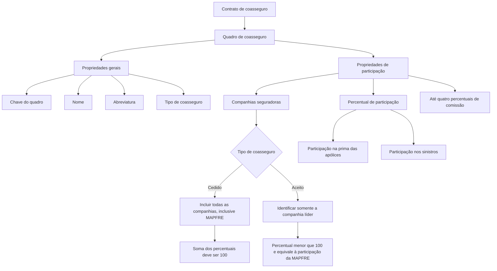

# Definição de Quadro de Coasseguro — Documentação Reef / Mapfredocument

## 1. Metadados do Documento
- **Arquivo de Origem:** Texto bruto fornecido; nome de arquivo não identificado.
- **Tipo de Documento:** Especificação funcional.
- **Domínio / Sistema:** Coasseguro; Documentação Reef / Mapfredocument; MAPFRE.
- **Público-Alvo:** Não identificado explicitamente; o conteúdo é orientado ao registro e à configuração de acordos de coasseguro.
- **Data/Versão Identificada:** Não identificada.
- **Owner identificado:** `user:agonzalez_mapfre.com`.
- **Lifecycle identificado:** `Approved Source`.

---

## 2. Resumo Executivo & Contexto de Negócio

O documento define o conceito de **quadro de coasseguro** como o agrupamento de entidades que participam, mediante contrato de coasseguro, da cobertura de um risco ou de um conjunto de riscos. Cada entidade participante possui um percentual de participação previamente estabelecido.

O objetivo funcional é registrar as companhias seguradoras participantes e as respectivas condições de participação de acordo com o tipo de coasseguro. O quadro possui propriedades gerais de identificação e propriedades específicas de participação.

As propriedades gerais permitem identificar o quadro por uma chave de agrupamento, nome, abreviatura e tipo de coasseguro. O tipo de coasseguro é determinado pela forma como a companhia MAPFRE atua no quadro.

As propriedades de participação registram as seguradoras integrantes, os percentuais de participação na prima das apólices e nos sinistros, além de até quatro percentuais de comissão. O documento estabelece regras distintas para os cenários de coasseguro cedido e coasseguro aceito.

---

## 3. Arquitetura, Componentes & Tecnologias Envolvidas

Os elementos explicitamente citados são:

| Componente / Entidade | Papel identificado |
| :--- | :--- |
| Quadro de coasseguro | Agrupamento de companhias participantes de um acordo de coasseguro. |
| Companhias seguradoras | Entidades participantes do acordo; devem existir previamente como seguradoras. |
| MAPFRE | Companhia cuja forma de atuação determina o tipo de coasseguro; deve ser incluída no coasseguro cedido. |
| Apólices | A prima das apólices é afetada pelo percentual de participação. |
| Sinistros | A participação da companhia também se aplica aos sinistros. |
| Documentação Reef | Repositório ou contexto documental indicado no conteúdo. |
| Mapfredocument | Nome citado na navegação da documentação. |



**Nota de Análise:** O texto não apresenta arquitetura técnica de software, métodos HTTP, contratos JSON, banco de dados, telas, integrações ou tecnologias de implementação.

---

## 4. Regras de Negócio, Especificações Funcionais & Processos

### 4.1. Conceito de quadro de coasseguro

1. Um quadro de coasseguro designa o conjunto de entidades participantes de um contrato de coasseguro.
2. As entidades participantes cobrem um risco ou um conjunto de riscos.
3. Cada entidade participa conforme um percentual previamente estabelecido.
4. O quadro deve registrar tanto as entidades participantes quanto as condições de participação.
5. As condições de participação dependem do tipo de coasseguro.

### 4.2. Propriedades gerais do quadro

1. A chave do quadro de coasseguro agrupa as companhias que participam do acordo.
2. O nome identifica descritivamente o quadro de coasseguro.
3. A abreviatura representa o nome curto do quadro de coasseguro.
4. O tipo de coasseguro identifica a forma de coasseguro existente no quadro, conforme a forma de atuação da companhia MAPFRE.

### 4.3. Regras para companhias seguradoras participantes

1. As companhias seguradoras integrantes devem existir previamente como seguradoras.
2. A própria companhia MAPFRE está incluída no conjunto de companhias que devem existir previamente como seguradoras.
3. Em **coasseguro cedido**, devem ser incluídas todas as companhias participantes, inclusive a companhia MAPFRE.
4. Em **coasseguro aceito**, é identificada somente a companhia que atua como líder.

### 4.4. Regras de percentual de participação

1. O percentual de participação define a parcela acordada para a companhia participante.
2. O percentual aplica-se tanto à prima das apólices quanto aos sinistros.
3. Em **coasseguro cedido**, a soma dos percentuais de participação de todas as companhias incluídas no quadro deve ser igual a **100**.
4. Em **coasseguro aceito**, o percentual de participação deve ser menor que **100**.
5. Em **coasseguro aceito**, o percentual corresponde à participação da MAPFRE.

### 4.5. Regras de percentuais de comissão

1. Podem ser definidos até **quatro percentuais de comissão distintos**.
2. Cada percentual de comissão estabelece a parte assumida pela companhia correspondente.
3. Os percentuais podem se referir à comissão do agente, gastos, recargos ou outro importe acordado.
4. O trecho fornecido inicia uma seção de exemplo, mas o conteúdo do exemplo não foi disponibilizado.

---

## 5. Tabelas de Parâmetros, Ambientes e Estruturas de Dados

| Item / Parâmetro | Descrição / Função | Tipo / Valores / Formato | Ambiente / Observações |
| :--- | :--- | :--- | :--- |
| Quadro de coasseguro | Agrupa entidades participantes de um acordo de coasseguro. | Conjunto de entidades e condições de participação. | Aplica-se à cobertura de um risco ou conjunto de riscos. |
| Chave do quadro de coasseguro | Agrupa as companhias participantes do acordo. | Não especificado. | Propriedade geral. |
| Nome | Identifica descritivamente o quadro de coasseguro. | Texto; formato não especificado. | Propriedade geral. |
| Abreviatura | Representa o nome curto do quadro de coasseguro. | Texto; formato não especificado. | Propriedade geral. |
| Tipo de coasseguro | Identifica a forma de coasseguro conforme a atuação da MAPFRE. | Coasseguro cedido ou coasseguro aceito, conforme conteúdo apresentado. | Propriedade geral. |
| Companhia seguradora | Identifica as seguradoras que compõem o acordo. | Companhia previamente existente como seguradora. | Propriedade de participação. |
| MAPFRE | Companhia explicitamente citada no documento. | Deve ser previamente existente como seguradora. | Deve ser incluída no coasseguro cedido. |
| Companhia líder | Companhia identificada no coasseguro aceito. | Não especificado. | No coasseguro aceito, somente a líder é identificada. |
| Percentual de participação | Define a participação da companhia na prima das apólices e nos sinistros. | Percentual; escala e formato não especificados. | No cedido, total do quadro deve ser 100. No aceito, deve ser menor que 100. |
| Soma de participação em coasseguro cedido | Validação da soma dos percentuais de todas as companhias do quadro. | Deve ser igual a 100. | Regra obrigatória para coasseguro cedido. |
| Participação em coasseguro aceito | Participação atribuída à MAPFRE. | Percentual menor que 100. | Regra para coasseguro aceito. |
| Percentuais de comissão | Define parcela assumida pela companhia correspondente em componentes acordados. | Até quatro percentuais distintos. | Pode abranger comissão do agente, gastos, recargos ou qualquer outro importe acordado. |
| Owner | Proprietário identificado na documentação. | `user:agonzalez_mapfre.com` | Metadado exibido no conteúdo. |
| Lifecycle | Estado de ciclo de vida indicado na documentação. | `Approved Source` | Metadado exibido no conteúdo. |
| Documentação Reef | Contexto ou área documental exibida. | `DOCUMENTACIÓN Reef` | Não há detalhamento técnico adicional. |
| Mapfredocument | Nome apresentado no conteúdo. | `Mapfredocument` | Não há detalhamento adicional sobre a função. |

---

## 6. Bateria de Perguntas & Respostas para RAG (FAQ Sintético)

### P1: O que é um quadro de coasseguro?
**R:** Um quadro de coasseguro é o conjunto de entidades que participam, por meio de um contrato de coasseguro, da cobertura de um risco ou de um conjunto de riscos. Cada entidade possui um percentual de participação previamente estabelecido.

### P2: Qual é o objetivo do registro de um quadro de coasseguro?
**R:** O objetivo é registrar as entidades participantes do acordo de coasseguro e as condições de participação aplicáveis conforme o tipo de coasseguro.

### P3: Quais são as propriedades gerais de um quadro de coasseguro?
**R:** As propriedades gerais citadas são: chave do quadro de coasseguro, nome, abreviatura e tipo de coasseguro.

### P4: Para que serve a chave do quadro de coasseguro?
**R:** A chave do quadro de coasseguro serve para agrupar as companhias que participam do acordo de coasseguro.

### P5: Qual é a diferença entre o nome e a abreviatura do quadro de coasseguro?
**R:** O nome é a descrição que identifica o quadro de coasseguro, enquanto a abreviatura é o nome curto desse mesmo quadro.

### P6: Que condição deve ser satisfeita pelas companhias incluídas em um quadro de coasseguro?
**R:** Todas as companhias participantes devem existir previamente como seguradoras. Essa condição também se aplica à própria companhia MAPFRE.

### P7: Quais companhias devem ser incluídas em um coasseguro cedido?
**R:** Em coasseguro cedido, devem ser incluídas todas as companhias que participam do acordo, inclusive a companhia MAPFRE.

### P8: Como as companhias são identificadas em um coasseguro aceito?
**R:** Em coasseguro aceito, somente é identificada a companhia que atua como líder.

### P9: Em quais elementos o percentual de participação da companhia é aplicado?
**R:** O percentual de participação é aplicado tanto à prima das apólices quanto aos sinistros.

### P10: Qual validação deve ser aplicada aos percentuais de participação no coasseguro cedido?
**R:** No coasseguro cedido, a soma dos percentuais de participação de todas as companhias incluídas no quadro deve ser igual a 100.

### P11: Qual é a regra para o percentual de participação no coasseguro aceito?
**R:** No coasseguro aceito, o percentual deve ser menor que 100 e equivale à participação da MAPFRE.

### P12: Quantos percentuais de comissão podem ser definidos?
**R:** Podem ser determinados até quatro percentuais de comissão distintos.

### P13: Quais valores podem ser abrangidos pelos percentuais de comissão?
**R:** Os percentuais de comissão podem estabelecer a parcela assumida pela companhia correspondente em relação à comissão do agente, gastos, recargos ou qualquer outro importe acordado.

---

## 7. Glossário de Termos, Siglas & Conceitos-Chave

- **Coasseguro:** Acordo no qual entidades participam da cobertura de um risco ou conjunto de riscos, cada uma com percentual preestabelecido.
- **Coasseguro cedido:** Tipo de coasseguro no qual todas as companhias participantes, inclusive MAPFRE, devem ser incluídas; a soma dos percentuais deve ser 100.
- **Coasseguro aceito:** Tipo de coasseguro no qual somente a companhia líder é identificada; o percentual deve ser menor que 100 e equivale à participação da MAPFRE.
- **Quadro de coasseguro:** Agrupamento de companhias participantes e respectivas condições de participação de um acordo de coasseguro.
- **Companhia líder:** Companhia identificada como líder no cenário de coasseguro aceito.
- **MAPFRE:** Companhia mencionada como referência para a classificação do tipo de coasseguro e para as regras de participação.
- **Prima das apólices:** Elemento ao qual o percentual de participação da companhia se aplica.
- **Sinistros:** Elemento ao qual o percentual de participação da companhia se aplica.
- **Comissão do agente:** Um dos componentes que pode ser abrangido por percentuais de comissão.
- **Recargos:** Um dos importes que pode ser abrangido por percentuais de comissão.
- **Reef:** Nome presente na identificação da documentação.
- **Mapfredocument:** Nome exibido no conteúdo, sem definição funcional adicional.
- **Lifecycle:** Metadado de ciclo de vida do documento; o valor exibido é `Approved Source`.

---

## 8. Notas Críticas, Riscos & Limitações

- **Nota de Análise:** O documento não informa o nome do arquivo de origem, data, versão formal, autores além do owner exibido, nem público-alvo explícito.
- **Nota de Análise:** Não foram apresentados métodos HTTP, contratos JSON, modelos de dados, persistência, integrações, URLs, ambientes, credenciais, rotas de logs ou procedimentos operacionais.
- **Nota de Análise:** O tipo de coasseguro é descrito em função de como a MAPFRE atua, porém o texto não detalha critérios adicionais para determinar essa atuação.
- **Nota de Análise:** O documento afirma que, no coasseguro aceito, somente a companhia líder é identificada, mas não explica como a liderança é definida.
- **Nota de Análise:** O texto não informa a escala, precisão decimal, regras de arredondamento ou formato de entrada para percentuais de participação e comissão.
- **Nota de Análise:** A seção “Ejemplo” está incompleta no conteúdo fornecido; portanto, não é possível recuperar ou interpretar o exemplo de percentuais de comissão sem inventar informações.

---

## 9. Conteúdo Bruto Estruturado (Referência Fiel)

```text
--- [PÁGINA 1 DE 2] ---

DEFINICIÓN de cuadro de coaseguro
Objetivo
Con este nombre se suele designar al conjunto de entidades que, en virtud de un contrato de coaseguro, participan cada una en un porcentaje
preestablecido en la cobertura de un riesgo o conjunto de estos
Se trata de registrar las entidades que participan y las condiciones de participación, según el tipo de coaseguro.
Propiedades generales
Propiedades de participación
Propiedades generales
Cuadro de coaseguro
Clave por la que se agrupan las compañías que participan en el acuerdo de coaseguro.
Nombre
Descripción que identica el cuadro de coaseguro.
Abreviatura
Nombre corto del cuadro de coaseguro.
Tipo de coaseguro
Identica la forma de coaseguro que tiene el cuadro, dependiendo de cómo actúa la compañía MAPFRE.
Propiedades de participación
Compañía aseguradora
Identica las compañía aseguradoras que forman parte del acuerdo.
Las compañías que participan deben existir previamente como aseguradoras, incluida la propia compañía MAPFRE.
En coaseguro cedido se deben incluir todas las compañías que participan, incluida la compañía MAPFRE.
En coaseguro aceptado solo se identica la compañía que actúa como [líder].
Documentation / DOCUMENTACIÓN Reef
DOCUMENTACIÓN Reef
Mapfredocument
DOCUMENTACIÓN Reef
Owner
user:agonzalez_mapfre.com
Lifecycle
Approved Source
 /
VL
Buscar Inicio Soluciones Arquitecturas APIs Componentes Cloud Documentación Zeus Reef Ayuda
ES


--- [PÁGINA 2 DE 2] ---

Porcentaje de participación
Establece el porcentaje acordado, con el que la compañía participará tanto en la prima de las pólizas, como en los siniestros.
En coaseguro cedido la suma de los porcentajes de participación, de todas las compañías incluidas en el cuadro, debe ser 100.
En coaseguro aceptado este porcentaje debe ser menor a 100 y equivale a la participación de MAPFRE.
Porcentajes de comisión
Se determinan hasta cuatro porcentajes de comisión distintos, que establecen la parte que asumirá la compañía correspondiente, de la
comisión del agente, gastos, recargos o cualquier otro importe que se acuerde.
Ejemplo:
```
