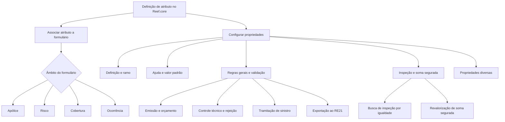

# Reef.core — Definição e Configuração de Atributos

## 1. Metadados do Documento
- **Arquivo de Origem:** `Não identificado`
- **Tipo de Documento:** `Especificação Técnica / Manual Funcional`
- **Domínio / Sistema:** `Reef.core; gestão de atributos em apólices, riscos, coberturas, ocorrências e inspeções`
- **Público-Alvo:** `Analistas funcionais, configuradores de produto, desenvolvedores, operação e arquitetura`
- **Data/Versão Identificada:** `Não identificada`

---

## 2. Resumo Executivo & Contexto de Negócio

O documento descreve como definir atributos no sistema Reef.core quando uma informação necessária precisa ser registrada em uma apólice ou quando uma informação existente afeta a tarifa do seguro. Os atributos devem ser agrupados em formulários, com escopo aplicável à apólice, risco, cobertura ou ocorrência.

A especificação detalha propriedades de definição, ramo, ajuda, valores padrão, regras gerais, validação, inspeção, soma segurada, opções diversas e visualização. Essas propriedades controlam a coleta da informação, sua obrigatoriedade, formato, unicidade, impacto no cálculo, persistência, validação e disponibilidade operacional.

A configuração de atributos é relevante para processos de emissão, orçamento, suplementos, inspeções, sinistros, controle técnico, integração com o módulo de resseguro RE21 e tratamento de transportes. Uma parametrização incorreta pode afetar recálculos de risco, regras de validade, comportamento de valores padrão e buscas de inspeção.

O documento também apresenta convenções de nomenclatura, como prefixos para códigos, datas, importes, percentuais e valores. A padronização torna o atributo identificável pelo tipo de conteúdo que armazena e diferencia o nome técnico da descrição apresentada ao operador.

Não há arquitetura de software detalhada, contratos de integração, métodos HTTP, estruturas JSON, servidores, URLs de ambiente ou versões técnicas no material fornecido. O documento menciona Reef.core, Oracle, RE21 e PLATEA somente nos contextos funcionais explicitados.

---

## 3. Arquitetura, Componentes & Tecnologias Envolvidas

### Componentes e sistemas identificados

| Componente / Tecnologia | Papel identificado no documento | Observações |
| :--- | :--- | :--- |
| Reef.core | Sistema no qual atributos são definidos, solicitados, validados, armazenados e usados em processos de seguro. | É o sistema central descrito. |
| Apólice | Entidade que pode possuir atributos e formulários associados. | O formulário de apólice afeta todos os riscos da apólice. |
| Risco | Entidade segurada dentro da apólice. | O formulário de risco afeta cada risco individualmente. |
| Cobertura | Cobertura associada a um risco. | O formulário de cobertura afeta a cobertura do risco associado. |
| Ocorrência | Escopo de formulário associado a cobertura, risco ou apólice. | O documento não detalha contratos ou estrutura técnica da ocorrência. |
| Oracle | Banco ou referência de tabela para consulta de ajuda. | A tabela de ajuda é descrita como tabela Oracle. |
| RE21 | Módulo de resseguro. | Um atributo pode ser configurado para exportação ao RE21. |
| PLATEA | Sistema ou contexto associado ao conteúdo `Transaction id PLATEA`. | Não há detalhamento adicional. |
| Formulário de inspeção | Formulário que pode incluir atributos para exibição ou informação de valor. | Pode usar atributos como chave de busca de inspeções. |
| Póliza marco | Tipo de apólice no tratamento de transportes. | O atributo pode ser editável nela, em aplicações ou em ambas. |
| Aplicações | Entidades do tratamento de transportes. | O documento não detalha a estrutura funcional das aplicações. |



**Nota de Análise:** o diagrama representa exclusivamente relações funcionais declaradas no documento. O material não descreve topologia de implantação, interfaces de rede, APIs, bancos físicos, filas, portas ou mecanismos técnicos de integração.

---

## 4. Regras de Negócio, Especificações Funcionais & Processos

### 4.1 Finalidade dos atributos

Um atributo deve ser criado quando:

1. Reef.core não dispõe de uma informação necessária para registrar em uma apólice.
2. Reef.core dispõe da informação, mas a informação afeta a tarifa.
3. A informação precisa ser associada a uma apólice, risco, cobertura ou ocorrência por meio de um formulário.

### 4.2 Escopo dos formulários

- **Formulário de apólice:** afeta todos os riscos da apólice.
- **Formulário de risco:** afeta cada risco da apólice.
- **Formulário de cobertura:** afeta a cobertura do risco ao qual está associado.
- **Formulário de ocorrência:** afeta a cobertura, o risco ou a apólice aos quais está associado.

### 4.3 Nome e descrição do atributo

- O nome do atributo deve ser determinado sem confundi-lo com a descrição.
- É recomendado que o nome use um prefixo que indique o conteúdo armazenado.
- A descrição do atributo é o texto exibido na tela para a pessoa que realiza a operação.

### 4.4 Tipo, formato e comprimento

- Um atributo pode ter tipo **Caráter**, **Número** ou **Data**.
- O tipo **Caráter** aceita letras, números e outros caracteres.
- O tipo **Número** aceita apenas números.
- O tipo **Data** aceita apenas datas.
- O formato de data padrão é `ddmmyyyy`.
- O formato de data pode ser alterado para o padrão americano `mmddyyyy`.
- O comprimento máximo define o tamanho máximo aceito pelo atributo.

### 4.5 Propriedades de ramo

- O atributo deve apontar para o ramo afetado pela definição.
- A modalidade de vida determina a modalidade aplicável somente para ramos com tratamento de vida.
- A cobertura identifica a cobertura à qual o atributo pertence.
- A propriedade **Ordem** determina a posição do atributo quando ele for solicitado.
- A **Data de validade** determina quando a definição estará disponível para uso e permite manter registro histórico de mudanças na definição.
- O atributo pode participar da determinação da modalidade ou oferta comercial quando o ramo trabalha com modalidades.

### 4.6 Ajuda operacional

- A propriedade **Pantalla** indica a tela de ajuda apresentada ao operador; o valor usual informado é `AL000010`.
- A propriedade **Tabla** define a tabela Oracle com informações de ajuda.
- A propriedade **Versión** define a versão da ajuda da tabela selecionada.
- A propriedade **Depósito con la selección** é opcional e, se necessária, informa o local onde a informação selecionada na ajuda será depositada.
- O documento menciona **Formato** no contexto de propriedades de ajuda, mas não apresenta detalhamento funcional adicional.

### 4.7 Valor padrão e lógica prévia de negócio

A lógica de negócio prévia à solicitação de informação pode definir:

| Atributo com valor padrão | Valor pode ser modificado pelo operador | Comportamento possível |
| :--- | :--- | :--- |
| Sim | Sim | Atributo recebe valor padrão e pode ser alterado. |
| Sim | Não | Atributo recebe valor padrão e não pode ser alterado. |
| Não | Sim | Atributo não recebe valor padrão e pode ser informado ou alterado. |
| Não | Não | Atributo não recebe valor padrão e não pode ser alterado. |

Regras de valor padrão:

1. Um valor padrão pode ser definido para ser usado quando o atributo não possui valor.
2. Se o valor padrão depender de circunstâncias, também deve ser utilizada a lógica de negócio prévia à solicitação de informação.
3. Um atributo com valor padrão somente adota esse valor se estiver sem valor.
4. Após receber um valor, seja o valor padrão ou outro valor, o atributo preserva o valor existente.
5. O atributo não volta a assumir automaticamente o valor padrão após ter recebido um valor.

### 4.8 Impacto no cálculo, orçamento e unicidade

- **Afecta al cálculo:** define se o conteúdo do atributo afeta o importe do seguro.
- O preenchimento correto dessa propriedade é necessário porque Reef.core determina, em um suplemento, se o risco deve ser recalculado.
- **Es único:** impede que exista outra apólice com o mesmo valor durante o mesmo período de vigência.
- Para um atributo único que tenha valor padrão, Reef.core não realiza busca em outro risco vigente da carteira enquanto o conteúdo for igual ao valor padrão.
- Quando o atributo único deixa de possuir o valor padrão, Reef.core realiza a busca do conteúdo na carteira vigente.
- **Se solicita en presupuesto:** define se o atributo será solicitado durante a realização de orçamento.
- O objetivo da solicitação em orçamento é pedir a menor quantidade possível de informação quando o cliente deseja conhecer o preço do seguro.
- Todo atributo declarado como participante do cálculo será sempre solicitado em um orçamento. Nesse caso, a característica de solicitação em orçamento não permite determinar um valor.

### 4.9 Exibição, obrigatoriedade e caixa do texto

- **Mostrar en la tramitación del siniestro:** define se o atributo será exibido para a pessoa responsável pela tramitação do sinistro, sem necessidade de consulta à apólice.
- **Obligatorio:** define se o atributo precisa obrigatoriamente possuir valor.
- Se o atributo for obrigatório, o processo não pode continuar enquanto o atributo não tiver valor.
- **Admite mayúsculas y/o minúsculas:** por padrão, o conteúdo é registrado em maiúsculas; essa propriedade permite registrar conteúdo em minúsculas.

### 4.10 Validação

- A lógica de negócio de validação determina se o conteúdo do atributo está correto.
- Quando o conteúdo não estiver correto, a validação devolve um erro.
- A validação é acionada quando o atributo possui algum conteúdo.
- **Valida aunque el atributo no tenga valor:** executa a validação mesmo quando o atributo está vazio.
- **Validación en el momento:** executa a validação imediatamente após a introdução do valor, sem esperar o acionamento do botão `Aceptar`.

### 4.11 Controle técnico, rejeição e exportação

- Quando uma operação de emissão é retida por controle técnico e rejeitada, Reef.core armazena parte da informação do elemento rejeitado.
- A propriedade **Grabar atributo en caso de rechazo** define se o atributo precisa permanecer armazenado após a rejeição.
- A propriedade **Exportar a RE21** define se o atributo será enviado ao módulo de resseguro RE21 quando houver integração entre Reef.core e RE21.
- A propriedade **Inhabilitado** define se o atributo permanece ativo ou se não pode mais ser incluído em uma nova apólice.
- A inabilitação não interrompe a aplicação do atributo em apólices que já o possuam.
- A aplicação permanece até que um suplemento altere o atributo.
- Após a alteração por suplemento, não é possível selecionar novamente o atributo inabilitado.

### 4.12 Inspeção

- **Forma parte del formulario de inspección:** indica que o atributo integra o formulário de inspeção para exibição de valor e/ou informação de valor.
- **Clave en la búsqueda de inspecciones:** indica que o atributo será relevante para localizar uma inspeção.
- Para chave de busca de inspeções, é conveniente selecionar atributos de baixa cardinalidade na carteira de apólices.
- Os atributos de baixa cardinalidade devem ocupar as primeiras posições do formulário, conforme a propriedade **Ordem**.
- A busca de inspeção é realizada com o operador de comparação de igualdade.
- Quando uma apólice é emitida, cada atributo definido terá um valor e o sistema buscará uma inspeção.
- A propriedade **Ordem** também define a posição no formulário e a sequência usada na busca da inspeção.

### 4.13 Soma segurada e revalorização

- **Es una suma asegurada:** define que o conteúdo do atributo é uma soma segurada que poderá ser utilizada posteriormente por alguma cobertura.
- O documento apresenta como exemplo o valor de veículo registrado como atributo de risco que posteriormente se torna a soma segurada da cobertura de danos ao próprio veículo.
- Quando o conteúdo é declarado como soma segurada, existe a possibilidade de definir se o valor será revalorizado.
- **Tipo de revalorización:** define a forma de revalorização do atributo.
- **Como se revaloriza:** define como a revalorização será executada depois de se decidir que haverá revalorização.
- **Porcentaje de revalorización:** define o percentual usado quando o tipo de revalorização afeta o capital atual ou o capital inicial.
- **Índice de revalorización:** define o índice aplicável quando o tipo de revalorização é por outro índice.
- **Lógica de negócio que determina el nuevo capital:** define a lógica que determina a nova soma segurada.

### 4.14 Tratamento de transportes

Quando o ramo possui tratamento de transportes, a configuração determina quando o atributo pode ser modificado:

| Opção | Regra de solicitação e alteração |
| :--- | :--- |
| Póliza marco | O atributo é solicitado apenas na criação ou alteração de uma apólice marco. Nas aplicações, o valor é exibido, mas não pode ser alterado. |
| Aplicaciones | O atributo é solicitado apenas na criação ou alteração de uma aplicação. Nas apólices marco, o valor é exibido, mas não pode receber valores. |
| Pólizas marco y aplicaciones | O atributo é exibido e permite criar e/ou modificar valores tanto na apólice marco quanto na aplicação. |

### 4.15 Tipos de conteúdo permitidos

O documento lista os seguintes tipos de conteúdo:

- Código fondo inversión.
- Edición fondo inversión.
- Porcentaje inversión fondo.
- Importe total inversión.
- Importe inversión fondo.
- Número de fondos de inversión.
- Años duración póliza.
- Plan aportación.
- Suspensión plan aportación.
- Importe prima inversión.
- Importe prima aportación.
- Importe prima total.
- Importe aportación pactada.
- Importe inversión aportación.
- Tipo gestor aportación.
- Código gestor aportación.
- Código suplemento aportación.
- Subcódigo suplemento aportación.
- Causa suplemento aportación.
- Motivo suplemento aportación.
- Agrupación sublímite.
- Transaction id PLATEA.

---

## 5. Tabelas de Parâmetros, Ambientes e Estruturas de Dados

### 5.1 Escopos de formulário

| Item / Parâmetro | Descrição / Função | Tipo / Valores / Formato | Ambiente / Observações |
| :--- | :--- | :--- | :--- |
| Formulário de apólice | Afeta todos os riscos da apólice. | Apólice | Reef.core |
| Formulário de risco | Afeta cada risco da apólice. | Risco | Reef.core |
| Formulário de cobertura | Afeta a cobertura do risco associado. | Cobertura | Reef.core |
| Formulário de ocorrência | Afeta cobertura, risco ou apólice associados. | Ocorrência | Reef.core |

### 5.2 Convenções de nomenclatura

| Item / Parâmetro | Descrição / Função | Tipo / Valores / Formato | Ambiente / Observações |
| :--- | :--- | :--- | :--- |
| `COD_` | Indica código cuja descrição está em tabela de Reef.core ou tabela própria do ramo. | Prefixo de atributo | Convenção recomendada |
| `FEC_` | Indica data. | Prefixo de atributo | Convenção recomendada |
| `IMP_` | Indica importe. | Prefixo de atributo | Convenção recomendada |
| `MCA_` | Indica valor “Sí” ou “No”. | Prefixo de atributo | Convenção recomendada |
| `NOM_` | Indica nome. | Prefixo de atributo | Convenção recomendada |
| `APE_` | Indica sobrenome. | Prefixo de atributo | Convenção recomendada |
| `PCT_` | Indica percentual. | Prefixo de atributo | Convenção recomendada |
| `TIP_` | Indica valores previamente definidos em tabela de Reef.core ou própria do ramo. | Prefixo de atributo | Convenção recomendada |
| `VAL_` | Indica valor não contemplado pelos demais prefixos. | Prefixo de atributo | Convenção recomendada |

### 5.3 Tipos e formatos de campo

| Item / Parâmetro | Descrição / Função | Tipo / Valores / Formato | Ambiente / Observações |
| :--- | :--- | :--- | :--- |
| Tipo de campo: Carácter | Armazena letras, números e outros caracteres. | Caráter | Reef.core |
| Tipo de campo: Número | Armazena apenas números. | Número | Reef.core |
| Tipo de campo: Fecha | Armazena apenas datas. | Data | Reef.core |
| Formato de data padrão | Formato padrão de data. | `ddmmyyyy` | `dd`: dia; `mm`: mês; `yyyy`: ano |
| Formato de data alternativo | Formato de data adaptado ao padrão americano. | `mmddyyyy` | Alternativa explicitamente mencionada |
| Longitud máxima | Define o tamanho máximo aceito. | Valor de comprimento máximo | Reef.core |

### 5.4 Propriedades de configuração do atributo

| Item / Parâmetro | Descrição / Função | Tipo / Valores / Formato | Ambiente / Observações |
| :--- | :--- | :--- | :--- |
| Ramo | Indica o ramo afetado pela definição. | Referência de ramo | Propriedades de ramo |
| Modalidad de vida | Determina modalidade para ramos com tratamento de vida. | Modalidade | Aplicável somente a ramos de vida |
| Cobertura | Indica a cobertura do atributo. | Referência de cobertura | Propriedades de ramo |
| Orden | Define posição de solicitação do atributo. | Ordem | Também usada no formulário e busca de inspeção |
| Fecha de validez | Define quando a definição estará disponível. | Data de validade | Permite histórico de mudanças |
| Determina la modalidad | Indica participação do atributo na determinação da oferta comercial. | Sim/Não, conforme ramo | Aplicável quando o ramo trabalha com modalidades |
| Pantalla | Define a tela de ajuda. | Usualmente `AL000010` | Propriedades de ajuda |
| Tabla | Define a tabela Oracle usada como fonte de ajuda. | Tabela Oracle | Propriedades de ajuda |
| Versión | Define a versão da ajuda da tabela selecionada. | Versão | Propriedades de ajuda |
| Depósito con la selección | Define local de depósito da informação selecionada na ajuda. | Nome do local | Não obrigatório |
| Valor por defecto | Valor inicial do atributo quando não há valor existente. | Valor padrão | Não volta a ser aplicado após o atributo receber valor |
| Lógica previa | Determina valor e possibilidade de modificação antes da solicitação. | Lógica de negócio | Pode depender de circunstâncias |
| Afecta al cálculo | Determina impacto do atributo no importe do seguro. | Sim/Não | Influencia recálculo em suplemento |
| Es único | Determina unicidade do atributo. | Sim/Não | Considera apólice e período de vigência |
| Se solicita en presupuesto | Define solicitação do atributo no orçamento. | Sim/Não | Atributos que afetam cálculo sempre são solicitados |
| Mostrar en siniestro | Define exibição para tramitação do sinistro. | Sim/Não | Permite consulta sem consultar a apólice |
| Obligatorio | Define necessidade de valor para continuidade do processo. | Sim/Não | Processo não continua sem valor obrigatório |
| Admite mayúsculas/minúsculas | Permite conteúdo em minúsculas. | Sim/Não | Padrão de registro é maiúsculas |
| Lógica de validación | Valida o conteúdo e devolve erro quando incorreto. | Lógica de negócio | Executada quando há conteúdo |
| Valida sin valor | Valida mesmo quando o atributo está vazio. | Sim/Não | Propriedades de validação |
| Grabar en rechazo | Define persistência do atributo quando emissão é rejeitada após controle técnico. | Sim/Não | Reef.core armazena parte da informação rejeitada |
| Exportar a RE21 | Define envio do atributo ao módulo RE21. | Sim/Não | Aplicável quando há integração Reef.core–RE21 |
| Inhabilitado | Impede uso em nova apólice. | Sim/Não | Continua aplicável às apólices existentes até suplemento |
| Formulario de inspección | Inclui atributo no formulário de inspeção. | Sim/Não | Para exibição e/ou informação de valor |
| Clave inspección | Usa atributo como chave na busca de inspeção. | Sim/Não | Recomenda-se baixa cardinalidade |
| Es suma asegurada | Declara conteúdo como soma segurada usada posteriormente por cobertura. | Sim/Não | Pode permitir revalorização |
| Tipo de revalorización | Define forma de revalorização. | Tipo de revalorização | Opções são mencionadas em enlace não fornecido |
| Como se revaloriza | Define método de execução da revalorização. | Opção de revalorização | Opções são mencionadas em enlace não fornecido |
| Porcentaje de revalorización | Define percentual de revalorização. | Percentual | Aplicável a capital atual ou inicial |
| Índice de revalorización | Define índice aplicável à revalorização por outro índice. | Índice definido | Aplicável conforme tipo de revalorização |
| Lógica nuevo capital | Determina a nova soma segurada. | Lógica de negócio | Propriedades de soma segurada |
| Ocurrencia | Determina formulário associado ao atributo em definição. | Formulário | Propriedades diversas |
| Transportes | Define quando atributo pode ser modificado. | Póliza marco / Aplicaciones / Ambas | Aplicável a ramos com tratamento de transportes |
| Tipo de contenido | Define conteúdo especializado armazenado no atributo. | Lista de conteúdos permitidos | Inclui conteúdos de investimento, aportação e PLATEA |
| Validación en el momento | Valida ao informar valor, antes de `Aceptar`. | Sim/Não | Propriedades de validação |

### 5.5 Conteúdos especializados permitidos

| Item / Parâmetro | Descrição / Função | Tipo / Valores / Formato | Ambiente / Observações |
| :--- | :--- | :--- | :--- |
| Código fondo inversión | Código de fundo de investimento. | Tipo de conteúdo | Sem detalhamento adicional |
| Edición fondo inversión | Edição de fundo de investimento. | Tipo de conteúdo | Sem detalhamento adicional |
| Porcentaje inversión fondo | Percentual de investimento em fundo. | Tipo de conteúdo | Sem detalhamento adicional |
| Importe total inversión | Importe total de investimento. | Tipo de conteúdo | Sem detalhamento adicional |
| Importe inversión fondo | Importe de investimento em fundo. | Tipo de conteúdo | Sem detalhamento adicional |
| Número de fondos de inversión | Número de fundos de investimento. | Tipo de conteúdo | Sem detalhamento adicional |
| Años duración póliza | Anos de duração da apólice. | Tipo de conteúdo | Sem detalhamento adicional |
| Plan aportación | Plano de aportação. | Tipo de conteúdo | Sem detalhamento adicional |
| Suspensión plan aportación | Suspensão de plano de aportação. | Tipo de conteúdo | Sem detalhamento adicional |
| Importe prima inversión | Importe de prêmio de investimento. | Tipo de conteúdo | Sem detalhamento adicional |
| Importe prima aportación | Importe de prêmio de aportação. | Tipo de conteúdo | Sem detalhamento adicional |
| Importe prima total | Importe de prêmio total. | Tipo de conteúdo | Sem detalhamento adicional |
| Importe aportación pactada | Importe de aportação acordada. | Tipo de conteúdo | Sem detalhamento adicional |
| Importe inversión aportación | Importe de investimento de aportação. | Tipo de conteúdo | Sem detalhamento adicional |
| Tipo gestor aportación | Tipo de gestor de aportação. | Tipo de conteúdo | Sem detalhamento adicional |
| Código gestor aportación | Código de gestor de aportação. | Tipo de conteúdo | Sem detalhamento adicional |
| Código suplemento aportación | Código de suplemento de aportação. | Tipo de conteúdo | Sem detalhamento adicional |
| Subcódigo suplemento aportación | Subcódigo de suplemento de aportação. | Tipo de conteúdo | Sem detalhamento adicional |
| Causa suplemento aportación | Causa de suplemento de aportação. | Tipo de conteúdo | Sem detalhamento adicional |
| Motivo suplemento aportación | Motivo de suplemento de aportação. | Tipo de conteúdo | Sem detalhamento adicional |
| Agrupación sublímite | Agrupamento de sublimite. | Tipo de conteúdo | Sem detalhamento adicional |
| Transaction id PLATEA | Identificador de transação PLATEA. | Tipo de conteúdo | O documento não detalha PLATEA |

---

## 6. Bateria de Perguntas & Respostas para RAG (FAQ Sintético)

### P1: Quando um atributo deve ser criado no Reef.core?
**R:** Um atributo deve ser criado quando Reef.core não possui uma informação necessária para registrar em uma apólice ou quando a informação existente afeta a tarifa. Os atributos devem ser organizados em formulários com escopo de apólice, risco, cobertura ou ocorrência.

### P2: Quais são os escopos possíveis de formulário para atributos?
**R:** Os formulários podem ser de apólice, risco, cobertura ou ocorrência. O formulário de apólice afeta todos os riscos; o de risco afeta cada risco; o de cobertura afeta a cobertura do risco associado; e o de ocorrência afeta a cobertura, o risco ou a apólice associados.

### P3: Qual padrão de nomeação é recomendado para atributos do Reef.core?
**R:** O documento recomenda o uso de prefixos que indiquem o conteúdo do atributo. Exemplos: `COD_` para códigos, `FEC_` para datas, `IMP_` para importes, `MCA_` para valores “Sí” ou “No”, `PCT_` para percentuais e `VAL_` para valores que não se enquadrem nas demais categorias.

### P4: Quais tipos de campo um atributo pode possuir?
**R:** Um atributo pode ser do tipo Caráter, Número ou Data. Caráter permite letras, números e outros caracteres; Número permite apenas números; e Data permite apenas datas. O formato padrão de data é `ddmmyyyy`, com possibilidade de adaptação para `mmddyyyy`.

### P5: Como funciona um valor padrão de atributo?
**R:** O valor padrão só é aplicado quando o atributo não possui valor. Depois que o atributo recebe um valor — seja o padrão ou outro — ele mantém esse valor e não volta a assumir automaticamente o valor padrão. Se o valor padrão variar conforme circunstâncias, deve ser usada uma lógica de negócio prévia à solicitação da informação.

### P6: O que ocorre se um atributo afetar o cálculo do seguro?
**R:** A propriedade **Afecta al cálculo** indica que o conteúdo do atributo impacta o importe do seguro. Reef.core utiliza essa informação para determinar, durante um suplemento, se o risco precisa ser recalculado. Todo atributo que afeta o cálculo é sempre solicitado no orçamento.

### P7: Como funciona a unicidade de um atributo?
**R:** Um atributo configurado como único não pode possuir o mesmo valor em outra apólice dentro do mesmo período de vigência. Se o atributo único possuir valor padrão, Reef.core não faz busca na carteira enquanto o conteúdo coincidir com esse valor padrão; quando o atributo deixa de possuir esse valor, Reef.core busca o conteúdo na carteira vigente.

### P8: Quando uma validação é executada no atributo?
**R:** A lógica de validação verifica se o conteúdo informado está correto e devolve erro quando o valor é inválido. A validação normalmente é executada quando há conteúdo, mas a propriedade **Valida aunque el atributo no tenga valor** permite validar mesmo quando o atributo está vazio. A validação também pode ocorrer no momento da digitação, sem esperar o botão `Aceptar`.

### P9: O que acontece quando um atributo é inabilitado?
**R:** Um atributo inabilitado não pode ser incluído em uma nova apólice. Contudo, o atributo continua aplicável nas apólices que já o possuem até que seja alterado por suplemento. Após essa alteração, não é mais possível selecionar o atributo inabilitado.

### P10: Como atributos participam da busca de inspeções?
**R:** Um atributo pode integrar o formulário de inspeção e também ser configurado como chave de busca de inspeções. O documento recomenda selecionar como chave atributos de baixa cardinalidade na carteira de apólices e posicioná-los nas primeiras posições do formulário. A busca de inspeção utiliza comparação por igualdade.

### P11: Como configurar um atributo como soma segurada?
**R:** A propriedade **Es una suma asegurada** declara que o conteúdo do atributo será uma soma segurada utilizada posteriormente por uma cobertura. O documento exemplifica o valor de um veículo registrado como atributo de risco e posteriormente usado pela cobertura de danos ao próprio veículo. A configuração pode incluir tipo, método, percentual, índice e lógica de cálculo da nova soma segurada.

### P12: Quais opções existem para edição de atributos no tratamento de transportes?
**R:** Existem três opções: **Póliza marco**, em que o atributo pode ser informado ou alterado apenas na apólice marco; **Aplicaciones**, em que ele pode ser informado ou alterado somente na aplicação; e **Pólizas marco y aplicaciones**, em que o atributo pode ser informado e alterado nos dois contextos.

---

## 7. Glossário de Termos, Siglas & Conceitos-Chave

- **Reef.core:** sistema no qual os atributos são definidos, solicitados, validados e utilizados em processos de seguro.
- **RE21:** módulo de resseguro para o qual um atributo pode ser exportado quando houver integração com Reef.core.
- **PLATEA:** contexto citado no tipo de conteúdo `Transaction id PLATEA`; o documento não fornece detalhamento adicional.
- **Atributo:** informação configurável associada a apólice, risco, cobertura ou ocorrência.
- **Apólice:** entidade de seguro que pode conter riscos, coberturas e atributos.
- **Risco:** elemento individual da apólice que pode ter atributos e coberturas associados.
- **Cobertura:** cobertura associada a um risco.
- **Ocorrência:** âmbito de formulário associado a cobertura, risco ou apólice.
- **Ramo:** classificação à qual uma definição de atributo afeta.
- **Modalidade / Oferta comercial:** modalidade que pode ser determinada por atributos quando o ramo trabalha com modalidades.
- **Suplemento:** processo mencionado para decidir recálculo de risco e para alterar atributos em apólices existentes.
- **Controle técnico:** controle que pode reter e rejeitar uma operação de emissão.
- **Carteira vigente:** conjunto de riscos ou apólices vigentes usado na verificação de unicidade.
- **Cardinalidade:** quantidade de valores distintos de um atributo na carteira de apólices.
- **Póliza marco:** apólice marco utilizada no tratamento de transportes.
- **Aplicaciones:** entidades de aplicação mencionadas no tratamento de transportes.
- **Soma segurada:** capital ou valor que pode ser utilizado posteriormente por uma cobertura.
- **Revalorização:** processo de atualização de uma soma segurada.
- **Oracle:** tecnologia de tabela de dados citada como fonte das informações de ajuda.

---

## 8. Notas Críticas, Riscos & Limitações

- O documento não identifica nome de arquivo, data, versão, autor técnico ou versão do Reef.core.
- Não há especificação de endpoints, APIs, contratos JSON, protocolos, portas, mecanismos de autenticação, infraestrutura ou topologia de implantação.
- As opções de **Tipo de revalorización** e **Como se revaloriza** são referenciadas por enlaces não presentes no conteúdo extraído; portanto, os valores possíveis não podem ser determinados com fidelidade.
- O campo **Formato**, listado nas propriedades de ajuda, não possui descrição adicional no texto fornecido.
- O módulo RE21 é citado apenas como destino potencial de exportação de atributos; não há detalhamento de formato, frequência, interface ou regras de erro da integração.
- PLATEA é mencionado somente no conteúdo `Transaction id PLATEA`; não há explicação de seu papel, estrutura ou integração.
- Uma configuração incorreta de **Afecta al cálculo** pode influenciar a decisão de recálculo de risco em suplementos.
- Uma configuração inadequada de unicidade pode afetar a busca de valores na carteira vigente.
- A inabilitação de atributo não remove retroativamente o atributo de apólices existentes.
- A busca de inspeção ocorre por igualdade e recomenda atributos de baixa cardinalidade nas primeiras posições do formulário.

---

## 9. Conteúdo Bruto Estruturado (Referência Fiel)

```text
--- [PÁGINA 1 DE 8] ---

EN CONSTRUCCIÓN
DEFINICIÓN de atributo
Objetivo
Cuando Reef.core no dispone de información que sea necesaria registrar en una póliza o si dispone de esa información pero afecta a la tarifa,
es necesario crean atributos.
Los atributos deben agruparse en formularios y cada formulario puede ser de:
FORMULARIO DE... ÁMBITO DEL FORMULARIO QUE AFECTA A
Póliza Todos los riesgos de la póliza
Riesgo Cada uno de los riesgos de la póliza
Cobertura Aquella cobertura del riesgo al que está asociado
Ocurrencia Aquella cobertura, riesgo o póliza a la que está asociado
Propiedades de denición
Propiedades de defecto
Propiedades de ramo
Propiedades de ayuda
Propiedades generales
Propiedades de suma asegurada
Propiedades de inspección
Propiedades de validación
Propiedades varias
Propiedades de visualización
Propiedades de denición
Ejemplo:
Documentation / DOCUMENTACIÓN Reef
DOCUMENTACIÓN Reef
Mapfredocument
DOCUMENTACIÓN Reef
Owner
user:agonzalez_mapfre.com
Lifecycle
Approved Source
 / 
 VL
Buscar Inicio Soluciones Arquitecturas APIs Componentes Cloud Documentación Zeus Reef Ayuda
ES

--- [PÁGINA 2 DE 8] ---

Nombre del atributo
En este punto se debe determinar cual es el nombre que recibirá (no confundir con la descripción).
Para un mejor entendimiento es aconsejable que el atributo disponga de un prejo que indique cual será el contenido que albergará. A
continuación algunos ejemplos de prejos:
PREFIJO EL ATRIBUTO CONTENDRÁ...
COD_ Un código cuya descripción se encuentra en una tabla de Reef.core o propia del ramo
FEC_ Una fecha
IMP_ Un importe
MCA_ Un SÍ o un NO
NOM_ Un nombre
APE_ Un apellido
PCT_ Un porcentaje
TIP_ Valores prejados previamente en una tabla de Reef.core o propia del ramo
VAL_ Un valor que NO sea alguno de los citados anteriormente
Descripción del atributo
Texto que se mostrará en pantalla al usuario que realiza la operación.
Tipo de campo
Se especica que tipo de información contendrá el campo cuando sea solicitado al usuario que realiza la operación. Los valores posibles
son:
Carácter
Número
Fecha
Carácter
El atributo contendrá letras, números y otros caracteres.
Número
El atributo solo contendrá números.
Fecha
El atributo solo contendrá fechas.
Consejo

--- [PÁGINA 3 DE 8] ---

El formato de fecha por defecto es ddmmyyyy, donde:
dd es el día
mm es el mes
yyyy es el año
Este formato puede alterarse para adaptarse al estándar americano (mmddyyyy)
Longitud máxima
Longitud maxima que aceptará el atributo.
Propiedades de ramo
Ramo
Apunta al ramo al que afecta esta denición.
Modalidad de vida
Determina la modalidad (solo para ramos con tratamiento de vida) a la que pertenece el atributo.
Cobertura
Cobertura a la que pertenece.
Orden
Posición en el que aparecerá a la hora de ser solicitado.
Fecha de validez
Determina cuando la denición estará disponible para ser utilizado. Su correcto uso permite tener un registro histórico de los cambios
efectuados en la denición.
Determina la modalidad (oferta comercial)
El atributo forma parte a la hora de determinar la modalidad (oferta comercial). En la denición del ramo, si este trabaja con modalidades,
puede existir uno o varios atributos que determinen la modalidad (oferta comercial) que se ofrecerá al cliente a la hora de crear o modicar
una póliza/aplicación. El valor de este atributo depende de si el ramo trabaja o no con modalidades (oferta comercial) y de que manera se
forman.
Propiedades de ayuda
Los siguientes atributos determinan la ayuda que le aparecerá a la persona que realiza la operación si esta lo solicita.
Pantalla
Este atributo solicita la pantalla que mostrará a ayuda la persona que realiza la operación. Usualmente el valor de este atributo es
"AL000010".
Tabla
En este punto se solicita la tabla (Oracle) donde se encuentra la información de ayuda.
Versión
Versión de la ayuda de la Tabla seleccionada en el punto anterior.
Depósito con la selección
Formato

--- [PÁGINA 4 DE 8] ---

No es obligatorio, pero si es necesario, se requiere el nombre del lugar donde se deposita la información seleccionada de la ayuda mostrada.
Propiedades de defecto
Lógica de negocio previa a la petición de información
Esta lógica puede llegar a determinar el valor que toma el atributo y si este es modicable por parte de la persona que realiza la operación. Es
decir, esta lógica puede determinar:
ATRIBUTO CON VALOR
POR DEFECTO
EL VALOR SE
PUEDE MODIFICAR
SI SI
SI NO
NO SI
NO NO
Valor por defecto
Se puede especicar un valor que será el que el atributo dispondrá a la hora de realizar la operación (si el atributo carece de valor). Si el valor
por defecto puede variar dependiendo de cualquier circunstancia, se debe utilizar además, el atributo anterior (Lógica de negocio previa a la
petición de información).
Un atributo que tiene denido un valor por defecto, solo lo tomará si el atributo no tiene valor. En cuanto tome un valor, ya sea el valor por
defecto u otro, conservará el valor que tenga. Es decir, en ningún caso tomara el valor por defecto.
Propiedades generales
Afecta al cálculo
Se determina si el contenido del atributo afecta al importe del seguro.
Esta característica es necesario que se rellene de forma correcta, ya que dependiendo del valor que se de, Reef.core va a determinar
cuando se debe volver a calcular (en un suplemento) el riesgo o no.
Es único
La información del atributo es única. Es decir, no puede existir otra póliza con el mismo valor en el mismo periodo de vigencia
Un atributo único, si tiene denido un valor por defecto, siempre que el contenido del atributo coincida con el valor por defecto, Reef.core
NO realizará la búsqueda con el n de encontrar en otro riesgo vigente de la cartera el contenido del atributo. En cuanto el atributo pierda
el valor por defecto, Reef.core realizará la búsqueda del contenido en la cartera vigente.
Se solicita en presupuesto
Indica si el atributo se solicita cuando se realice un presupuesto. El propósito de esta característica es la de poder solicitar la mínima
informción posible cuando un cliente quiere conocer el precio de un seguro.
Importante
Importante
Ejemplo:

--- [PÁGINA 5 DE 8] ---

Todo atributo que se ha declarado que afecta al cálculo siempre se solicitará en un presupuesto, por lo que esta a característica no será
posible determinar un valor.
Mostrar en la tramitación del siniestro
Se especica si el atributo será mostrado en la tramitación del siniestro. Es decir, la persona que tramita podrá ver el contenido del atributo
sin tener que consultar la póliza.
Obligatorio
Se indica si el atributo es obligatorio que disponga de valor o no. Si el atributo es obligatorio, hasta que no tenga valor, el proceso no puede
continuar.
Admite mayúsculas y/o minúsculas
Por defecto, el contenido de un atributo se registra en mayúsculas, esta característica permite que el contenido de un atributo pueda ser en
minúsculas.
Propiedades de validación
Lógica de negocio que valida el atributo
Esta lógica se encarga de validar el contenido del atributo. La lógica determinará si el contenido es correcto o no, y en caso que no sea
correcto se devolverá un error. La validación salta si el atributo tiene algún tipo de contenido.
Valida aunque el atributo no tenga valor
La validación se realiza aunque el atributo carezca de algún valor. Es decir, se realiza la validación aunque el atributo esté vacío de contenido.
Propiedades generales
Grabar atributo en caso de rechazo
Si una operación de emisión queda retenida por control técnico y es rechazada, Reef.core almacena parte de la información del elemento
rechazado y queda registrado. En este caso, se puede determinar si el atributo en el caso de rechazo es necesario que quede almacenado o
no.
Exportar a RE21
En el caso que Reef.core se integre con RE21 (Módulo de reaseguro), se indica si el atributo se enviará a RE21.
Inhabilitado
En este punto se determina si está activo o por el contrario ya no puede ser incluido en una nueva póliza. Es importante destacar que, aunque
inhabilite, todas las pólizas que dispongan de ello, seguirá aplicándose hasta que mediante un suplemento se cambie. En ese momento, al
estar inhabilitado ya no será posible seleccionarlo.
Propiedades de inspección
Forma parte del formulario de inspección
Indica que formará parte del formulario de inspección, ya sea mostrar el que tuviera y/o para informar un valor.
Clave en la búsqueda de inspecciones
Se indica si el atributo es importante a la hora de encontrar la inspección. Es relevante destacar que conviene elegir aquellos atributos cuya
cardinalidad sea baja (los distintos valores del atributo es reducido) en la cartera de pólizas. A parte, estos atributos cuya cardinalidad sea
baja deben ocupar las primeras posiciones en el formulario (ver propiedad Orden).
Importante
Ejemplo:

--- [PÁGINA 6 DE 8] ---

La búsqueda de inspección se hace con el operador de comparación igual
Cada atributo denido, cuando se emita la póliza tendrá un valor, y el sistema buscará una inspección. A la hora de buscar, se puede
determinar que la búsqueda se haga por igual.
Orden
Lugar en el que aparecerá en el formulario y por el además se realizará la búsqueda de la inspección.
Propiedades de suma asegurada
Es una suma asegurada
Se indica si el contenido va a ser una suma asegurada que posteriormente, alguna cobertura va a tomar. Esto es muy común por ejemplo en
ramos de automóviles en los que el valor del vehículo se registra como un atributo del riesgo y, posteriormente ese valor se va a convertir en
suma asegurada de alguna cobertura del riesgo como puede ser la cobertura de Daños al propio vehículo. En este caso, como se ha
declarado que el contenido es una suma asegurada, se va a dar la oportunidad de que se valor se revalorice o no. Esto se consigue denir en
las siguientes propiedades
Tipo de revalorización
Se determina de que forma se va a revalorizar este atributo. Para ello, existen distintas formas que se pueden consultar en el siguiente
enlace.
Como se revaloriza
Una vez que se determina que se desea revalorizar, hay que decidir como se va a realizar la revalorización. En el siguiente enlace se
encuentran las opciones de las que se dispone.
Porcentaje de revalorización
Si el tipo de revalorización afecta al capital actual o inicial, en este punto se determina el porcentaje que se aplicará para realizar la
revalorización.
Índice de revalorización
Si se indicó que el tipo de revalorización es por otro índice, en este lugar se determina cual de los distintos índices denidos es el que aplica a
esta emisión.
Lógica de negocio que determina el nuevo capital
Lógica que determinará cual es la nueva suma asegurada.
Propiedades varias
Ocurrencia
En este punto se determina cual será el formulario que se va a utilizar asociado al atributo que se está deniendo.
Transportes, atributo asociado a...
Si el ramo tiene denido el tratamiento de transportes, se puede elegir cuando el atributo va a ser modicable. Los valores posibles son:
Póliza marco
Aplicaciones
Pólizas marco y aplicaciones
Póliza marco
El atributo en el proceso de emisión será solicitado solo cuando se cree o modique una póliza marco. En el caso de las aplicaciones, el
atributo mostrará su valor pero no será posible alterar su valor.
Aplicaciones
Ejemplo:

--- [PÁGINA 7 DE 8] ---

El atributo en el proceso de emisión será solicitado solo cuando se cree o modique una aplicación. En el caso de pólizas marco, el atributo
mostrará su valor pero no será posible dar valores.
Pólizas marco y aplicaciones
En este caso, el atributo mostrará y permitirá crear y/o modicar valores tanto en el caso de póliza marco como aplicación.
Propiedades varias
Tipo de contenido
Esta característica determina qué tipo de contenido albergará el atributo que se está deniendo. Los contenidos permitidos son:
CONTENIDO
Código fondo inversión
Edición fondo inversión
Porcentaje inversión fondo
Importe total inversión
Importe inversión fondo
Número de fondos de inversión
Años duración póliza
Plan aportación
Suspensión plan aportación
Importe prima inversión
Importe prima aportación
Importe prima total
Importe aportación pactada
Importe inversión aportación
Tipo gestor aportación
Código gestor aportación
Código suplemento aportación
Subcódigo suplemento aportación
Causa suplemento aportación
Motivo suplemento aportación
Agrupación sublímite

--- [PÁGINA 8 DE 8] ---

CONTENIDO
Transaction id PLATEA
Propiedades de validación
Validación en el momento
La validación se realiza una vez que se ha introducido el valor sin esperar a que se pulse el botón "Aceptar".
```
