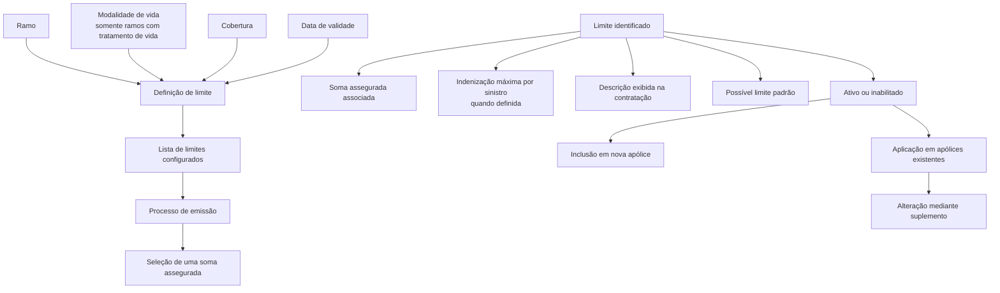
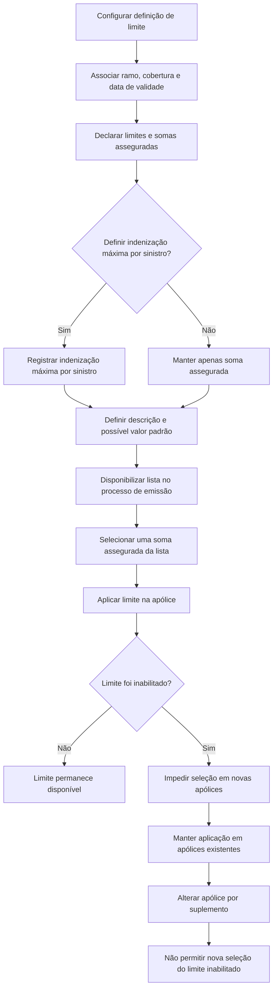

# Definição de Limite para Coberturas no Reef

## 1. Metadados do Documento
- **Arquivo de Origem:** Não identificado no conteúdo extraído
- **Tipo de Documento:** Especificação Técnica
- **Domínio / Sistema:** Reef / Mapfre
- **Público-Alvo:** Desenvolvedores, Analistas Funcionais, Negócio e Operação
- **Data/Versão Identificada:** Não identificada

---

## 2. Resumo Executivo & Contexto de Negócio

O documento descreve a funcionalidade de **definição de limite** no contexto de coberturas de seguros do sistema Reef. A funcionalidade permite limitar as somas asseguradas de uma cobertura por meio de valores previamente estabelecidos.

A definição de limite permite declarar uma lista de valores de soma assegurada. Durante o processo de emissão, a lista declarada representa as opções disponíveis para contratação, e deve ser selecionado um valor dentre as opções configuradas.

A configuração possui propriedades de ramo e propriedades específicas da definição. As propriedades de ramo vinculam a definição ao ramo, à modalidade de vida — quando aplicável — e à cobertura afetada. A data de validade permite controlar a disponibilidade da definição e manter histórico das alterações realizadas.

Além da soma assegurada, um limite pode definir uma indenização máxima por sinistro. A configuração também contempla descrição exibida na contratação, definição de limite padrão e inabilitação de limites para novas apólices, preservando a aplicação do limite nas apólices existentes até alteração por suplemento.

---

## 3. Arquitetura, Componentes & Tecnologias Envolvidas

Os componentes e conceitos explicitamente citados são:

| Componente / Conceito | Função descrita |
| :--- | :--- |
| Reef | Sistema ou domínio documental no qual a definição de limite é apresentada. |
| Mapfre | Contexto corporativo identificado pela documentação Reef e pela referência a `mapfre.com`. |
| Definição de limite | Configuração para restringir opções de soma assegurada de uma cobertura. |
| Ramo | Propriedade que identifica o ramo afetado pela definição. |
| Modalidade de vida | Propriedade aplicável apenas a ramos com tratamento de vida. |
| Cobertura | Cobertura à qual a definição de limite pertence. |
| Processo de emissão | Processo no qual é oferecida a lista de somas asseguradas configuradas. |
| Apólice | Registro que continua aplicando um limite inabilitado até alteração por suplemento. |
| Suplemento | Mecanismo pelo qual uma apólice pode alterar um limite anteriormente aplicado. |



**Nota de Análise:** O documento não detalha interfaces, métodos HTTP, contratos JSON, banco de dados, integrações técnicas, tecnologias de implementação ou fluxos internos do sistema Reef.

---

## 4. Regras de Negócio, Especificações Funcionais & Processos

### 4.1 Objetivo da definição de limite

1. É possível limitar as somas asseguradas de uma cobertura utilizando valores previamente estabelecidos.
2. A definição permite declarar uma lista de somas asseguradas.
3. As somas asseguradas declaradas tornam-se as opções oferecidas durante o processo de emissão.
4. O processo de emissão exige a escolha de um valor da lista declarada.

### 4.2 Propriedades de ramo

1. **Ramo:** aponta para o ramo ao qual a definição de limite afeta.
2. **Modalidade de vida:** determina a modalidade à qual o atributo pertence.
3. A modalidade de vida é aplicável somente para ramos com tratamento de vida.
4. **Cobertura:** identifica a cobertura à qual pertence a definição de limite.
5. **Data de validade:** determina quando a definição estará disponível para uso.
6. O uso correto da data de validade permite manter um registro histórico das alterações efetuadas na definição.

### 4.3 Propriedades da definição de limite

1. **Limite:** define o identificador do limite.
2. **Importe:** define a soma assegurada associada ao identificador do limite.
3. **Importe máximo por sinistro:** pode definir a indenização máxima aplicável a cada sinistro.
4. Um limite pode definir somente a soma assegurada ou, adicionalmente, a indenização máxima por sinistro.
5. **Descrição do limite:** é a descrição exibida durante a contratação da cobertura.
6. Normalmente, a descrição coincide com o valor da soma assegurada.
7. Quando houver indenização máxima por sinistro definida, essa informação também é incluída na descrição.
8. **Defeito:** pode ser declarado um limite como valor padrão.
9. Quando um limite é definido como padrão, esse limite aparece como a soma assegurada da cobertura.
10. **Inabilitado:** define se o limite está ativo ou se já não pode ser incluído em uma nova apólice.
11. Um limite inabilitado não deixa de ser aplicado automaticamente às apólices que já o possuem.
12. A aplicação do limite inabilitado continua nas apólices existentes até que seja realizada uma alteração mediante suplemento.
13. Após a alteração mediante suplemento, se o limite estiver inabilitado, ele não poderá ser selecionado novamente.

### 4.4 Fluxo funcional de seleção e manutenção do limite



---

## 5. Tabelas de Parâmetros, Ambientes e Estruturas de Dados

| Item / Parâmetro | Descrição / Função | Tipo / Valores / Formato | Ambiente / Observações |
| :--- | :--- | :--- | :--- |
| Ramo | Identifica o ramo afetado pela definição de limite. | Não detalhado | Propriedade de ramo. |
| Modalidade de vida | Determina a modalidade à qual o atributo pertence. | Não detalhado | Aplicável somente a ramos com tratamento de vida. |
| Cobertura | Identifica a cobertura à qual a definição pertence. | Não detalhado | Propriedade de ramo. |
| Data de validade | Determina quando a definição estará disponível para uso. | Data não detalhada | Permite manter histórico de alterações efetuadas na definição. |
| Limite | Identificador do limite configurado. | Identificador; formato não detalhado | Propriedade da definição. |
| Importe | Soma assegurada associada ao identificador do limite. | Valor monetário ou formato não detalhado | Utilizado como opção no processo de emissão. |
| Importe máximo por sinistro | Indenização máxima para cada sinistro. | Valor monetário ou formato não detalhado | Opcional; aplicável quando a funcionalidade for necessária. |
| Descrição do limite | Texto exibido na contratação da cobertura. | Texto; formato não detalhado | Normalmente coincide com a soma assegurada; pode incluir a indenização máxima por sinistro. |
| Defeito | Indica que um limite deve ser utilizado como padrão. | Indicador; valores não detalhados | Faz o limite aparecer como soma assegurada da cobertura. |
| Inhabilitado | Determina se um limite está ativo ou não pode ser incluído em uma nova apólice. | Indicador; valores não detalhados | Não remove a aplicação em apólices existentes. |
| Apólice existente | Apólice que já possui limite configurado. | Não detalhado | Continua aplicando o limite, mesmo quando o limite estiver inabilitado. |
| Suplemento | Alteração efetuada na apólice. | Não detalhado | Após a alteração, um limite inabilitado não pode ser novamente selecionado. |

**Nota de Análise:** O documento não informa valores exemplificativos, formatos de identificador, formatos de data, moeda, campos obrigatórios, regras de unicidade ou validações técnicas para os parâmetros.

---

## 6. Bateria de Perguntas & Respostas para RAG (FAQ Sintético)

### P1: Qual é o objetivo da definição de limite em uma cobertura?
**R:** A definição de limite permite limitar as somas asseguradas de uma cobertura por meio de valores estabelecidos previamente. A configuração declara uma lista de somas asseguradas que serão oferecidas no processo de emissão, no qual deve ser escolhido um dos valores disponíveis.

### P2: Como a lista de somas asseguradas é utilizada durante a emissão?
**R:** A lista de somas asseguradas configurada na definição de limite representa as opções disponíveis no processo de emissão. O processo exige que seja selecionado um valor dentre os valores declarados nessa lista.

### P3: Quais propriedades de ramo existem na definição de limite?
**R:** As propriedades de ramo são ramo, modalidade de vida, cobertura e data de validade. O ramo aponta para o ramo afetado, a modalidade de vida é aplicável a ramos com tratamento de vida, a cobertura identifica a cobertura relacionada e a data de validade controla a disponibilidade da definição.

### P4: Para que serve a data de validade da definição de limite?
**R:** A data de validade determina quando a definição de limite estará disponível para uso. O documento informa que o uso correto dessa propriedade permite manter um registro histórico das alterações efetuadas na definição.

### P5: O que representa o identificador de limite?
**R:** O campo limite determina qual será o identificador do limite. A soma assegurada é associada a esse identificador por meio do campo importe.

### P6: Um limite pode definir indenização máxima por sinistro?
**R:** Sim. Um limite pode definir a soma assegurada e também uma indenização máxima para cada sinistro. Quando essa funcionalidade é necessária, deve ser incluída a indenização máxima aplicável a cada um dos sinistros.

### P7: O que deve aparecer na descrição de um limite durante a contratação?
**R:** A descrição do limite é apresentada na contratação da cobertura. Normalmente, ela coincide com o importe da soma assegurada e, se houver indenização máxima por sinistro definida, essa informação também deve ser incluída.

### P8: O que acontece quando um limite é definido como padrão?
**R:** Quando um limite é declarado como padrão, esse limite aparece como a soma assegurada da cobertura.

### P9: O que significa inabilitar um limite?
**R:** Inabilitar um limite significa que o limite deixa de poder ser incluído em uma nova apólice. A inabilitação não remove automaticamente o limite das apólices existentes que já o utilizam.

### P10: Um limite inabilitado continua valendo para apólices existentes?
**R:** Sim. Mesmo que um limite seja inabilitado, todas as apólices que já dispõem desse limite continuam aplicando-o até que o limite seja alterado por meio de um suplemento.

### P11: Um limite inabilitado pode ser selecionado novamente após um suplemento?
**R:** Não. Quando uma apólice é alterada mediante suplemento e o limite anterior está inabilitado, esse limite não poderá ser selecionado novamente.

### P12: O documento especifica APIs, métodos HTTP ou contratos de integração para a definição de limite?
**R:** Não. O conteúdo extraído descreve regras funcionais e propriedades da definição de limite, mas não detalha APIs, métodos HTTP, contratos JSON, integrações, persistência de dados ou tecnologias de implementação.

---

## 7. Glossário de Termos, Siglas & Conceitos-Chave

- **Reef:** Sistema ou contexto documental citado no conteúdo extraído.
- **Mapfre:** Referência corporativa identificada na documentação Reef.
- **Definição de limite:** Configuração que restringe as opções de soma assegurada disponíveis para uma cobertura.
- **Ramo:** Entidade que identifica o ramo afetado pela definição de limite.
- **Modalidade de vida:** Modalidade aplicável somente a ramos com tratamento de vida.
- **Cobertura:** Cobertura à qual a definição de limite pertence.
- **Soma assegurada:** Valor associado ao identificador de limite e disponibilizado como opção durante a emissão.
- **Indenização máxima por sinistro:** Valor máximo de indenização aplicável a cada sinistro, quando configurado.
- **Emissão:** Processo no qual uma opção de soma assegurada deve ser selecionada da lista declarada.
- **Apólice:** Registro que pode manter a aplicação de um limite mesmo após a inabilitação desse limite.
- **Suplemento:** Alteração na apólice que pode provocar a substituição de um limite; limites inabilitados não podem ser selecionados nesse momento.
- **Defeito:** Designação do limite que deve ser utilizado como valor padrão.
- **Inhabilitado:** Estado que impede a inclusão do limite em novas apólices.

---

## 8. Notas Críticas, Riscos & Limitações

- O documento não identifica o nome do arquivo de origem, versão, data de publicação ou autor técnico.
- O conteúdo não informa formatos, tipos de dados, moedas, regras de cálculo, limites mínimos ou máximos, nem exemplos preenchidos para os campos.
- O texto contém referências a exemplos, mas os valores dos exemplos não foram extraídos.
- Não há detalhamento de APIs, integrações, serviços, banco de dados, permissões, auditoria, tratamento de erros ou fluxos de aprovação.
- A inabilitação de um limite não interrompe automaticamente sua vigência em apólices existentes; essa característica exige atenção operacional durante alterações por suplemento.
- A manutenção adequada da data de validade é relevante para preservar o histórico das alterações da definição.
- **Nota de Análise:** O documento lista propriedades funcionais da definição de limite, mas não detalha as validações técnicas aplicadas durante cadastro, emissão ou suplementação.

---

## 9. Conteúdo Bruto Estruturado (Referência Fiel)

```text
--- [PÁGINA 1 DE 2] ---

DEFINICIÓN de límite
Objetivo
Es posible limitar las sumas aseguradas de una cobertura con unos valores establecidos previamente. Es decir, se puede declarar una lista de
sumas aseguradas que serán las opciones que se ofrecerán en el proceso de emisión y se deberá elegir un valor de la lista declarada.
Propiedades de ramo
Propiedades de denición
Propiedades de ramo
Ramo
Apunta al ramo al que afecta esta denición.
Modalidad de vida
Determina la modalidad (solo para ramos con tratamiento de vida) a la que pertenece el atributo.
Cobertura
Cobertura a la que pertenece.
Fecha de validez
Determina cuando la denición estará disponible para ser utilizado. Su correcto uso permite tener un registro histórico de los cambios
efectuados en la denición.
Propiedades de denición
Límite
En este punto se determina cual será el identicador del límite.
importe
Ejemplo:
Ejemplo:
Documentation / DOCUMENTACIÓN Reef
DOCUMENTACIÓN Reef
Mapfredocument
DOCUMENTACIÓN Reef
Owner
user:agonzalez_mapfre.com
Lifecycle
Approved Source
 / 
 VL
Buscar Inicio Soluciones Arquitecturas APIs Componentes Cloud Documentación Zeus Reef Ayuda
ES


--- [PÁGINA 2 DE 2] ---

En este punto se determina cual es la suma asegurada asociada al identicador.
Importe máximo por siniestro
Es posible que un límite dena la suma asegurada, pero también se puede denir la indemnización máxima por cada uno de los siniestros.
Cuando se necesita de esta funcionalidad (indemnización máxima por siniestro), se incluye en este punto cual es esa indemnización máxima
por cada uno de los siniestros.
LÍmite
Se dene una descripción que será la que aparecerá en la contratación de la cobertura. Normalmente coincide con el importe de la suma
asegurada y si está denido la indemnización máxima por siniestro también se incluye.
Defecto
Adicionalmente se puede declarar un límite para que sea el utilizado como defecto. Esto lo que provoca es que aparecerá este límite como
suma asegurada de la cobertura.
Inhabilitado
En este punto se determina si está activo o por el contrario ya no puede ser incluido en una nueva póliza. Es importante destacar que, aunque
inhabilite, todas las pólizas que dispongan de ello, seguirá aplicándose hasta que mediante un suplemento se cambie. En ese momento, al
estar inhabilitado ya no será posible seleccionarlo.
Ejemplo:
Ejemplo:
Ejemplo:
```
