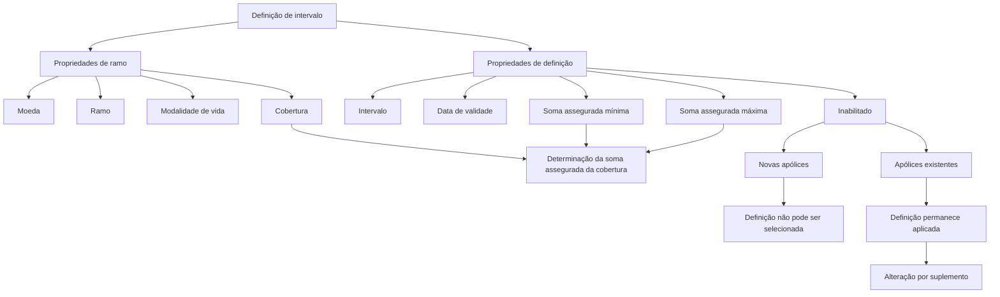

# Definição de Intervalo para Soma Assegurada — Documentação Reef

## 1. Metadados do Documento
- **Arquivo de Origem:** Não identificado no conteúdo extraído
- **Tipo de Documento:** Especificação Técnica
- **Domínio / Sistema:** Reef / Mapfre
- **Público-Alvo:** Negócio, Analistas Funcionais, Desenvolvedores e Operação
- **Data/Versão Identificada:** Não identificada

---

## 2. Resumo Executivo & Contexto de Negócio

O documento descreve a funcionalidade **“Definición de intervalo”** no contexto da documentação Reef. A finalidade é estabelecer um ou vários intervalos que funcionam como limites para determinar a **soma assegurada de uma cobertura**.

Cada definição de intervalo é associada a propriedades de ramo e de definição. As propriedades de ramo incluem moeda, ramo, modalidade de vida e cobertura. Essas associações contextualizam onde a definição de intervalo se aplica.

A definição possui limites mínimo e máximo para a soma assegurada. O valor menor do intervalo determina o menor valor permitido, enquanto o valor maior determina o maior valor permitido para a soma assegurada.

O documento também define uma data de validade para a disponibilização da definição e um mecanismo de inabilitação. A data de validade permite manter histórico de alterações. Quando uma definição é inabilitada, ela não pode ser selecionada para novas apólices, mas continua sendo aplicada às apólices existentes até que seja alterada por meio de um suplemento.

---

## 3. Arquitetura, Componentes & Tecnologias Envolvidas

Os elementos identificados no documento são:

- **Reef:** Contexto documental e funcional onde a definição de intervalo é apresentada.
- **Mapfre / Mapfredocument:** Referências presentes no cabeçalho extraído.
- **Cobertura:** Entidade à qual a definição de intervalo pertence.
- **Ramo:** Entidade à qual a definição de intervalo é associada.
- **Modalidade de vida:** Classificação aplicável apenas a ramos com tratamento de vida.
- **Apólice:** Entidade impactada pela utilização ou inabilitação de uma definição.
- **Suplemento:** Mecanismo citado para alterar a aplicação de uma definição em uma apólice existente.
- **Documentación Reef:** Referência à área de documentação.
- **Owner:** `user:agonzalez_mapfre.com`
- **Lifecycle:** `Approved`



> **Nota de Análise:** O documento não detalha interfaces de usuário, métodos HTTP, contratos JSON, persistência de dados, serviços, integrações ou tecnologias de implementação da definição de intervalo.

---

## 4. Regras de Negócio, Especificações Funcionais & Processos

### Objetivo da definição de intervalo
- É possível estabelecer um ou vários intervalos.
- Os intervalos servem como limite para determinar a soma assegurada de uma cobertura.

### Associação ao ramo e à cobertura
- A moeda identifica a moeda na qual os valores do acessório são expressos.
- O ramo indica o ramo afetado pela definição.
- A modalidade de vida determina a modalidade à qual pertence o atributo.
- A modalidade de vida aplica-se apenas a ramos com tratamento de vida.
- A cobertura identifica a cobertura à qual a definição pertence.

### Limites da soma assegurada
- A soma assegurada correspondente ao valor menor do intervalo é o valor mínimo que pode ser utilizado como soma assegurada.
- A soma assegurada correspondente ao valor maior do intervalo é o valor máximo que pode ser utilizado como soma assegurada.
- O documento não apresenta exemplos numéricos de valores mínimos, máximos, moedas ou regras de arredondamento.

### Vigência e histórico
- A data de validade determina quando a definição estará disponível para utilização.
- O uso correto da data de validade permite manter um registro histórico das alterações realizadas na definição.

### Inabilitação
- O atributo **Inhabilitado** determina se uma definição está ativa ou se já não pode ser incluída em uma nova apólice.
- Uma definição inabilitada não pode ser selecionada para uma nova apólice.
- A inabilitação não interrompe automaticamente a aplicação da definição em apólices que já a utilizam.
- A definição continua sendo aplicada às apólices existentes até que seja modificada por meio de um suplemento.
- Quando a definição é alterada por suplemento e está inabilitada, ela já não pode ser selecionada.

---

## 5. Tabelas de Parâmetros, Ambientes e Estruturas de Dados

| Item / Parâmetro | Descrição / Função | Tipo / Valores / Formato | Ambiente / Observações |
| :--- | :--- | :--- | :--- |
| Definição de intervalo | Estabelece um ou vários intervalos usados como limite para determinar a soma assegurada de uma cobertura. | Definição funcional | Contexto Reef |
| Moeda | Chave da moeda na qual são expressos os valores do acessório. | Chave de moeda; formato não detalhado | Propriedade de ramo |
| Ramo | Aponta para o ramo afetado pela definição. | Referência a ramo; formato não detalhado | Propriedade de ramo |
| Modalidade de vida | Determina a modalidade à qual pertence o atributo. | Modalidade; valores não detalhados | Aplicável somente a ramos com tratamento de vida |
| Cobertura | Identifica a cobertura à qual a definição pertence. | Referência a cobertura; formato não detalhado | Propriedade de ramo |
| Data de validade | Determina quando a definição estará disponível para utilização. | Data; formato não detalhado | Permite manter histórico de mudanças |
| Intervalo | Chave associada ao intervalo. | Chave; formato não detalhado | Propriedade de definição |
| Soma assegurada — valor menor | Define o valor mínimo que pode ser utilizado como soma assegurada. | Valor; tipo numérico não detalhado | Limite inferior do intervalo |
| Soma assegurada — valor maior | Define o valor máximo que pode ser utilizado como soma assegurada. | Valor; tipo numérico não detalhado | Limite superior do intervalo |
| Inhabilitado | Determina se a definição está ativa ou se não pode mais ser incluída em nova apólice. | Indicador de estado; valores não detalhados | Não remove a aplicação em apólices existentes |
| Nova apólice | Apólice na qual uma definição inabilitada não pode ser selecionada. | Processo de criação de apólice | Restrição decorrente da inabilitação |
| Apólice existente | Apólice que continua aplicando uma definição inabilitada. | Apólice | A aplicação continua até uma mudança por suplemento |
| Suplemento | Mecanismo mencionado para mudar a definição aplicada a uma apólice existente. | Processo; formato não detalhado | Após a alteração, uma definição inabilitada não pode ser selecionada |
| Owner | Responsável indicado no cabeçalho extraído. | `user:agonzalez_mapfre.com` | Metadado documental |
| Lifecycle | Estado do ciclo de vida indicado no cabeçalho extraído. | `Approved` | Metadado documental |

---

## 6. Bateria de Perguntas & Respostas para RAG (FAQ Sintético)

### P1: Qual é o objetivo da definição de intervalo no Reef?
**R:** A definição de intervalo permite estabelecer um ou vários intervalos que servem como limites para determinar a soma assegurada de uma cobertura.

### P2: O que representa o valor menor de um intervalo de soma assegurada?
**R:** O valor menor do intervalo representa o valor mínimo que pode ser utilizado como soma assegurada.

### P3: O que representa o valor maior de um intervalo de soma assegurada?
**R:** O valor maior do intervalo representa o valor máximo que pode ser utilizado como soma assegurada.

### P4: Para que serve a data de validade em uma definição de intervalo?
**R:** A data de validade determina quando a definição estará disponível para uso. Seu uso correto permite registrar historicamente as mudanças efetuadas na definição.

### P5: O que acontece quando uma definição de intervalo é inabilitada?
**R:** Uma definição inabilitada deixa de poder ser incluída ou selecionada em uma nova apólice. Entretanto, ela continua sendo aplicada às apólices existentes que já a utilizam.

### P6: Uma apólice existente deixa de usar uma definição automaticamente quando ela é inabilitada?
**R:** Não. Mesmo que a definição seja inabilitada, as apólices que já dispõem dela continuam aplicando-a até que seja realizada uma alteração por meio de um suplemento.

### P7: O que ocorre se uma apólice existente for alterada por suplemento e a definição estiver inabilitada?
**R:** No momento da alteração por suplemento, a definição inabilitada já não poderá ser selecionada.

### P8: Qual é a função da moeda na definição de intervalo?
**R:** A moeda identifica a chave da moeda na qual são expressos os valores do acessório.

### P9: Qual é a relação entre a definição de intervalo e o ramo?
**R:** A propriedade de ramo aponta para o ramo afetado pela definição de intervalo.

### P10: Quando a modalidade de vida se aplica à definição de intervalo?
**R:** A modalidade de vida determina a modalidade à qual pertence o atributo e aplica-se somente a ramos com tratamento de vida.

### P11: Qual é o vínculo entre cobertura e definição de intervalo?
**R:** A cobertura identifica a cobertura à qual a definição de intervalo pertence.

### P12: O documento especifica os formatos técnicos, APIs ou contratos de dados da definição de intervalo?
**R:** Não. O documento apresenta as propriedades funcionais da definição de intervalo, mas não detalha APIs, métodos HTTP, contratos JSON, modelos de persistência, formatos de campos ou tecnologias de implementação.

---

## 7. Glossário de Termos, Siglas & Conceitos-Chave

- **Reef:** Nome do contexto de documentação e da solução referenciada no conteúdo extraído.
- **Definição de intervalo:** Configuração que estabelece um ou vários limites para determinar a soma assegurada de uma cobertura.
- **Intervalo:** Chave associada a uma definição de intervalo.
- **Soma assegurada:** Valor sujeito aos limites mínimo e máximo estabelecidos pelo intervalo.
- **Cobertura:** Cobertura à qual a definição de intervalo pertence.
- **Ramo:** Ramo afetado pela definição.
- **Modalidade de vida:** Modalidade aplicável apenas aos ramos com tratamento de vida.
- **Data de validade:** Data que determina a disponibilidade de utilização da definição e apoia o histórico de alterações.
- **Inhabilitado:** Estado que impede a inclusão da definição em novas apólices, sem remover automaticamente sua aplicação em apólices existentes.
- **Apólice:** Entidade que pode utilizar uma definição de intervalo.
- **Suplemento:** Mecanismo citado para modificar a definição aplicada a uma apólice existente.
- **Lifecycle:** Metadado de ciclo de vida documental, identificado como `Approved`.
- **Owner:** Metadado de responsável documental, identificado como `user:agonzalez_mapfre.com`.

---

## 8. Notas Críticas, Riscos & Limitações

- O documento não informa valores concretos, formato, precisão decimal, moeda permitida ou critérios de validação para os limites de soma assegurada.
- O documento não define como tratar uma soma assegurada abaixo do valor mínimo ou acima do valor máximo.
- O documento não especifica se o limite inferior pode ser igual ao limite superior.
- O documento não apresenta regras para sobreposição, ordenação ou prioridade entre múltiplos intervalos.
- O documento não detalha o comportamento da definição quando a data de validade é futura, expirada ou ausente.
- O documento não especifica os estados técnicos possíveis para o campo **Inhabilitado**.
- O documento não descreve o processo operacional ou técnico de criação de suplementos.
- O documento não detalha APIs, telas, serviços, entidades persistidas, permissões de usuário, auditoria ou logs.
- **Nota de Análise:** O documento lista as propriedades funcionais da definição de intervalo, mas não detalha contratos técnicos ou mecanismos de integração.

---

## 9. Conteúdo Bruto Estruturado (Referência Fiel)

```text
--- [PÁGINA 1 DE 2] ---

DEFINICIÓN de intervalo
Objetivo
Es posible establecer uno o varios rangos que sirvan como límite a la hora de determinar la suma asegurada de una cobertura.
Propiedades de ramo
Propiedades de denición
Propiedades de ramo
Moneda
Clave de la moneda en la que están expresados los importes de valores del accesorio.
Ramo
Apunta al ramo al que afecta esta denición.
Modalidad de vida
Determina la modalidad (solo para ramos con tratamiento de vida) a la que pertenece el atributo.
Cobertura
Cobertura a la que pertenece.
Fecha de validez
Determina cuando la denición estará disponible para ser utilizado. Su correcto uso permite tener un registro histórico de los cambios
efectuados en la denición.
Propiedades de denición
Intervalo
Clave asociada al intervalo.
Suma asegurada (valor menor del intervalo)
Ejemplo:
Documentation / DOCUMENTACIÓN Reef
DOCUMENTACIÓN Reef
Mapfredocument
DOCUMENTACIÓN Reef
Owner
user:agonzalez_mapfre.com
Lifecycle
Approved Source
 / 
 VL
Buscar Inicio Soluciones Arquitecturas APIs Componentes Cloud Documentación Zeus Reef Ayuda
ES


--- [PÁGINA 2 DE 2] ---

Es el valor mínimo que se puede utilizar como suma asegurada.
Suma asegurada (valor mayor del intervalo)
Es el valor máximo que se puede utilizar como suma asegurada.
Inhabilitado
En este punto se determina si está activo o por el contrario ya no puede ser incluido en una nueva póliza. Es importante destacar que, aunque
inhabilite, todas las pólizas que dispongan de ello, seguirá aplicándose hasta que mediante un suplemento se cambie. En ese momento, al
estar inhabilitado ya no será posible seleccionarlo.
```
