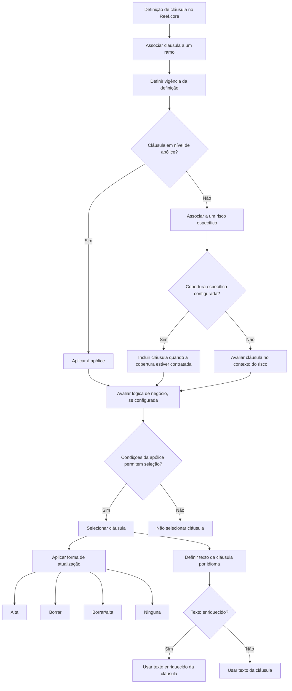
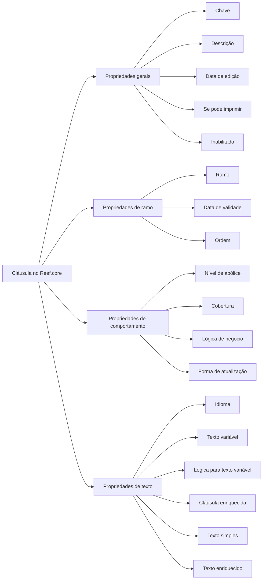

# Reef.core — Definição, Propriedades e Gestão de Cláusulas de Apólice

## 1. Metadados do Documento
- **Arquivo de Origem:** Não identificado no conteúdo fornecido
- **Tipo de Documento:** Especificação Técnica / Documentação Funcional
- **Domínio / Sistema:** Reef.core / Seguros / Gestão de cláusulas de apólice
- **Público-Alvo:** Desenvolvedores, Arquitetos, Analistas Funcionais, Operação e Negócio
- **Data/Versão Identificada:** Não identificada

---

## 2. Resumo Executivo & Contexto de Negócio

O documento descreve o conceito e a configuração de cláusulas no sistema **Reef.core**, no contexto de seguros. Uma cláusula é apresentada como um elemento fundamental para definir os termos e condições específicos de uma apólice, estabelecendo direitos, obrigações e limitações tanto da companhia seguradora quanto do segurado.

A documentação classifica cláusulas em três categorias: cláusulas gerais, aplicáveis a contratos com características semelhantes; cláusulas particulares, destinadas a casos específicos, contratos determinados ou clientes específicos; e cláusulas limitativas, que delimitam o risco assegurado e determinam em quais situações o contratante pode solicitar a prestação do seguro.

No Reef.core, as cláusulas devem ser identificadas e associadas aos diferentes contratos. A configuração é organizada em propriedades gerais, propriedades de ramo, propriedades de comportamento e propriedades de texto. Essas propriedades controlam identificação, vigência, escopo de aplicação na apólice, associação a coberturas, seleção por lógica de negócio, possibilidade de alteração pelo usuário e apresentação textual da cláusula.

O documento também descreve regras importantes para a inativação de cláusulas. Uma cláusula inabilitada não pode ser adicionada a novas apólices; entretanto, cláusulas já existentes em apólices continuam aplicáveis até que sejam alteradas mediante suplemento. Esse comportamento preserva a continuidade das condições já contratadas.

A documentação menciona exemplos de cláusulas, níveis de cláusula, cláusulas em nível de risco e cobertura, uso de lógica de negócio e texto enriquecido, mas não apresenta o detalhamento desses exemplos no conteúdo extraído.

---

## 3. Arquitetura, Componentes & Tecnologias Envolvidas

### Componentes e conceitos identificados

| Componente / Conceito | Papel no documento |
| :--- | :--- |
| **Reef.core** | Sistema no qual cláusulas devem ser identificadas e associadas a diferentes contratos. |
| **Apólice** | Contrato de seguro ao qual uma cláusula pode ser associada em nível de apólice ou em nível de risco. |
| **Risco** | Entidade específica da apólice à qual uma cláusula pode ser associada quando não for aplicável à apólice inteira. |
| **Cobertura** | Pode ser vinculada a uma cláusula em nível de risco; a cláusula é incluída sempre que a cobertura específica estiver contratada. |
| **Ramo** | Classificação à qual uma definição de cláusula se aplica. |
| **Lógica de negócio** | Mecanismo que avalia condições adicionais da apólice para determinar se uma cláusula deve ser selecionada ou para informar o valor variável do texto. |
| **Processo de emissão** | Processo no qual a cláusula é exibida e no qual o usuário pode incluir ou excluir a cláusula, conforme a forma de atualização. |
| **Suplemento** | Mecanismo mencionado para alterar uma cláusula já presente em uma apólice. |
| **Documentación Reef / Mapfredocument** | Referências exibidas no conteúdo extraído como contexto de documentação. |
| **Zeus** | Termo exibido na navegação da documentação, sem detalhamento funcional adicional. |

### Fluxo funcional de seleção e manutenção de cláusulas



### Relação entre propriedades de cláusula



---

## 4. Regras de Negócio, Especificações Funcionais & Processos

### 4.1. Definição de cláusula

Uma cláusula é um elemento que define termos e condições específicos de uma apólice. A cláusula estabelece direitos, obrigações e limitações aplicáveis tanto à companhia quanto ao segurado.

No Reef.core, é necessário identificar as cláusulas que serão associadas aos diferentes contratos.

### 4.2. Classificação de cláusulas

1. **Cláusulas gerais**
   - Estabelecem regras gerais para contratos de características semelhantes.
   - O documento cita cláusulas gerais em seguros de automóveis como exemplo.

2. **Cláusulas particulares**
   - Definem casos específicos para contratos determinados ou determinados clientes.
   - Consideram o contexto e o caso particular do segurado.
   - O documento cita cláusulas particulares em seguros de automóveis como exemplo.

3. **Cláusulas limitativas**
   - Delimitam o risco assegurado.
   - Definem quando um risco permite que o contratante tenha direito a solicitar a prestação do seguro.
   - O documento cita cláusulas limitativas em seguros de automóveis como exemplo.

### 4.3. Propriedades gerais

- A propriedade **Cláusula** corresponde à chave que identifica a cláusula.
- A propriedade **Descrição cláusula** é o título associado à chave da cláusula.
- A propriedade **Fecha edición** contém a data de entrada em vigor ou a data da última modificação da cláusula.
- A propriedade **Se puede imprimir** indica se a cláusula será impressa juntamente com o restante da documentação da apólice.
- A propriedade **Inhabilitado** determina se a cláusula está ativa ou se não pode mais ser incluída em uma nova apólice.

### 4.4. Regra de inabilitação

Quando uma cláusula é inabilitada:

1. A cláusula não pode ser selecionada para uma nova apólice.
2. As apólices que já possuem a cláusula continuam sujeitas à sua aplicação.
3. A cláusula continuará aplicável até que seja alterada mediante um suplemento.
4. Quando ocorrer a alteração por suplemento, a cláusula inabilitada não poderá ser selecionada novamente.

### 4.5. Propriedades de ramo

- A propriedade **Ramo** aponta para o ramo afetado pela definição da cláusula.
- A propriedade **Fecha de validez** determina a partir de quando a definição fica disponível para utilização.
- O uso correto da data de validade permite manter um registro histórico das mudanças efetuadas na definição.
- A propriedade **Orden** determina a posição em que a cláusula será exibida quando for solicitada durante o processo de emissão.

### 4.6. Propriedades de comportamento

- **Cláusula a nível póliza:** determina se a cláusula afeta toda a apólice ou se será associada individualmente a cada risco.
- **Cobertura:** quando a cláusula está em nível de risco, essa propriedade pode conter uma chave de cobertura específica. A cláusula deve ser incluída sempre que essa cobertura estiver contratada.
- **Lógica de negocio:** corresponde a uma lógica de negócio que avalia outras condições da apólice, além das condições estabelecidas pelas demais propriedades, para identificar se a cláusula deve ser selecionada.
- **Forma de actualización:** indica como o usuário pode determinar a inclusão da cláusula no momento da emissão da apólice.

### 4.7. Formas de atualização

| Forma de atualização | Regra funcional |
| :--- | :--- |
| **Alta** | O usuário pode incluir a cláusula caso ela não esteja previamente selecionada. |
| **Borrar** | O usuário pode eliminar a cláusula da apólice caso ela esteja selecionada. |
| **Borrar/alta** | O usuário pode incluir a cláusula quando ela não estiver selecionada e excluí-la quando ela estiver selecionada. |
| **Ninguna** | O usuário não pode incluir nem excluir a cláusula. |

### 4.8. Propriedades de texto

- **Idioma:** identifica o idioma no qual o texto da cláusula foi definido. O documento exemplifica códigos que identificam idiomas como espanhol, inglês e turco.
- **Texto variable:** identifica se o texto da cláusula contém informação dependente de alguma característica da apólice.
- **Lógica de negocio para informar el valor del texto variable:** identifica a lógica que pode ser desenvolvida para recuperar o valor da parte variável do texto da cláusula.
- **Cláusula enriquecida:** indica se o texto da cláusula permite características de formatação, incluindo sublinhado, negrito e itálico.
- **Texto de la cláusula:** contém o texto da cláusula quando esse texto não é enriquecido.
- **Texto enriquecido de la cláusula:** contém o texto da cláusula quando esse texto é enriquecido.

---

## 5. Tabelas de Parâmetros, Ambientes e Estruturas de Dados

### 5.1. Propriedades gerais da cláusula

| Item / Parâmetro | Descrição / Função | Tipo / Valores / Formato | Ambiente / Observações |
| :--- | :--- | :--- | :--- |
| Cláusula | Chave que identifica a cláusula. | Chave de identificação; formato não detalhado. | Reef.core |
| Descrição cláusula | Título associado à chave da cláusula. | Texto; formato não detalhado. | Reef.core |
| Fecha edición | Data de entrada em vigor ou da última modificação da cláusula. | Data; formato não detalhado. | Reef.core |
| Se puede imprimir | Indica se a cláusula será impressa junto com a documentação da apólice. | Propriedade booleana implícita; valores não detalhados. | Documentação da apólice |
| Inhabilitado | Determina se a cláusula está ativa ou não pode ser incluída em novas apólices. | Propriedade de estado; valores não detalhados. | Não remove a aplicação em apólices existentes. |

### 5.2. Propriedades de ramo

| Item / Parâmetro | Descrição / Função | Tipo / Valores / Formato | Ambiente / Observações |
| :--- | :--- | :--- | :--- |
| Ramo | Aponta para o ramo afetado pela definição da cláusula. | Referência a ramo; formato não detalhado. | Reef.core |
| Fecha de validez | Determina quando a definição estará disponível para uso. | Data; formato não detalhado. | Permite histórico das alterações da definição. |
| Orden | Define a posição de exibição da cláusula quando solicitada no processo de emissão. | Ordem / posição; formato não detalhado. | Processo de emissão da apólice. |

### 5.3. Propriedades de comportamento

| Item / Parâmetro | Descrição / Função | Tipo / Valores / Formato | Ambiente / Observações |
| :--- | :--- | :--- | :--- |
| Cláusula a nivel póliza | Determina se a cláusula afeta toda a apólice ou cada risco individualmente. | Escopo de aplicação; valores não detalhados. | Apólice ou risco. |
| Cobertura | Chave de cobertura específica que faz a cláusula ser incluída quando a cobertura estiver contratada. | Chave de cobertura; formato não detalhado. | Aplicável quando a cláusula é em nível de risco. |
| Lógica de negocio | Avalia condições adicionais da apólice para identificar se a cláusula deve ser selecionada. | Lógica de negócio; implementação não detalhada. | Complementa as demais propriedades. |
| Forma de actualización | Controla como o usuário pode incluir ou excluir a cláusula durante a emissão. | Alta, Borrar, Borrar/alta ou Ninguna. | Processo de emissão. |

### 5.4. Valores da forma de atualização

| Item / Parâmetro | Descrição / Função | Tipo / Valores / Formato | Ambiente / Observações |
| :--- | :--- | :--- | :--- |
| Alta | Permite incluir uma cláusula não selecionada. | Valor de forma de atualização. | Usuário no momento da emissão. |
| Borrar | Permite eliminar uma cláusula selecionada. | Valor de forma de atualização. | Usuário no momento da emissão. |
| Borrar/alta | Permite incluir uma cláusula não selecionada ou eliminar uma cláusula selecionada. | Valor de forma de atualização. | Usuário no momento da emissão. |
| Ninguna | Impede a inclusão e a eliminação da cláusula pelo usuário. | Valor de forma de atualização. | Usuário no momento da emissão. |

### 5.5. Propriedades de texto

| Item / Parâmetro | Descrição / Função | Tipo / Valores / Formato | Ambiente / Observações |
| :--- | :--- | :--- | :--- |
| Idioma | Identifica o idioma em que o texto da cláusula foi definido. | Código de idioma; exemplos: espanhol, inglês, turco. | Texto da cláusula. |
| Texto variable | Identifica se o texto contém informação dependente de característica da apólice. | Indicador; valores não detalhados. | Texto da cláusula. |
| Lógica de negocio para informar el valor del texto variable | Recupera o valor que a parte variável do texto deve assumir. | Lógica de negócio; implementação não detalhada. | Aplicável a texto variável. |
| Cláusula enriquecida | Indica se o texto permite formatação. | Indicador; valores não detalhados. | Pode incluir sublinhado, negrito e itálico. |
| Texto de la cláusula | Contém o texto quando o conteúdo não é enriquecido. | Texto simples. | Aplicável quando a cláusula não possui texto enriquecido. |
| Texto enriquecido de la cláusula | Contém o texto quando o conteúdo é enriquecido. | Texto com formatação. | Aplicável quando a cláusula possui texto enriquecido. |

### 5.6. Ambientes, URLs, servidores e logs

| Item / Parâmetro | Descrição / Função | Tipo / Valores / Formato | Ambiente / Observações |
| :--- | :--- | :--- | :--- |
| Ambientes | Não detalhados no conteúdo fornecido. | Não identificado. | Não foram informadas URLs, servidores, portas ou variáveis de ambiente. |
| Rotas de log | Não detalhadas no conteúdo fornecido. | Não identificado. | Não foram informados caminhos ou configurações de logs. |
| APIs / contratos | Não detalhados no conteúdo fornecido. | Não identificado. | Não foram informados métodos HTTP, contratos JSON ou endpoints. |

---

## 6. Bateria de Perguntas & Respostas para RAG (FAQ Sintético)

### P1: O que é uma cláusula no contexto de uma apólice no Reef.core?
**R:** Uma cláusula é um elemento fundamental que define os termos e condições específicos de uma apólice. A cláusula estabelece direitos, obrigações e limitações para a companhia e para o segurado. No Reef.core, as cláusulas devem ser identificadas para associação aos diferentes contratos.

### P2: Quais são os tipos de cláusulas descritos na documentação de Reef.core?
**R:** A documentação descreve cláusulas gerais, particulares e limitativas. As cláusulas gerais estabelecem regras para contratos de características semelhantes. As cláusulas particulares tratam casos específicos de contratos ou clientes determinados. As cláusulas limitativas delimitam o risco assegurado e definem quando o contratante pode solicitar a prestação do seguro.

### P3: O que acontece quando uma cláusula é inabilitada?
**R:** Uma cláusula inabilitada deixa de poder ser incluída em uma nova apólice. Entretanto, as apólices que já possuem a cláusula continuam sujeitas à sua aplicação. A cláusula permanece aplicável até que seja modificada por meio de um suplemento; após essa alteração, a cláusula inabilitada não pode ser selecionada novamente.

### P4: Qual é a finalidade da propriedade “Fecha de validez” de uma cláusula?
**R:** A propriedade “Fecha de validez” determina a partir de quando a definição de cláusula estará disponível para utilização. O uso correto dessa propriedade permite manter um registro histórico das alterações realizadas na definição.

### P5: Como o Reef.core determina se uma cláusula se aplica à apólice inteira ou a um risco específico?
**R:** A propriedade “Cláusula a nivel póliza” determina o escopo da cláusula. Quando a propriedade indica nível de apólice, a cláusula afeta toda a apólice. Caso contrário, a cláusula é associada a cada risco em particular.

### P6: Como uma cobertura influencia a inclusão de uma cláusula em nível de risco?
**R:** Quando uma cláusula está em nível de risco, a propriedade “Cobertura” pode conter uma chave de cobertura específica. Nessa configuração, a cláusula é incluída sempre que a cobertura correspondente estiver contratada.

### P7: Qual é a função da lógica de negócio associada a uma cláusula?
**R:** A lógica de negócio avalia outras condições da apólice além das condições determinadas pelas propriedades da cláusula. O objetivo é identificar se a cláusula deve ou não ser selecionada. Existe também uma lógica de negócio específica para recuperar o valor da parte variável de um texto de cláusula.

### P8: Quais opções existem para a forma de atualização de uma cláusula?
**R:** As opções são “Alta”, “Borrar”, “Borrar/alta” e “Ninguna”. “Alta” permite incluir a cláusula quando ela não está selecionada; “Borrar” permite eliminá-la quando está selecionada; “Borrar/alta” permite ambas as ações; e “Ninguna” impede que o usuário inclua ou elimine a cláusula.

### P9: O que significa a opção “Ninguna” na forma de atualização?
**R:** A opção “Ninguna” indica que o usuário não pode incluir nem excluir a cláusula durante o processo de emissão da apólice.

### P10: Como a documentação diferencia texto simples de texto enriquecido para uma cláusula?
**R:** O “Texto de la cláusula” contém o conteúdo quando o texto não é enriquecido. O “Texto enriquecido de la cláusula” contém o conteúdo quando o texto permite formatação. A propriedade “Cláusula enriquecida” indica se o texto pode incluir características como sublinhado, negrito e itálico.

### P11: Qual é a finalidade da propriedade “Texto variable”?
**R:** A propriedade “Texto variable” identifica se existe alguma informação no texto da cláusula que depende de qualquer característica da apólice. Quando existe conteúdo variável, uma lógica de negócio pode ser desenvolvida para recuperar o valor que deve ser apresentado nessa parte variável.

### P12: Quais informações de integração técnica estão disponíveis para Reef.core neste documento?
**R:** O documento não fornece URLs de ambientes, nomes de servidores, portas, métodos HTTP, contratos JSON, rotas de logs ou detalhes de APIs. A documentação está concentrada nas propriedades funcionais e regras de configuração de cláusulas no Reef.core.

---

## 7. Glossário de Termos, Siglas & Conceitos-Chave

- **Reef.core:** Sistema mencionado como responsável por identificar e associar cláusulas a diferentes contratos.
- **Apólice / Póliza:** Contrato de seguro ao qual as cláusulas são aplicadas.
- **Cláusula geral:** Cláusula que estabelece regras gerais para contratos de características semelhantes.
- **Cláusula particular:** Cláusula que define casos específicos para contratos determinados ou clientes específicos, considerando o contexto do segurado.
- **Cláusula limitativa:** Cláusula que delimita o risco assegurado e determina as condições para solicitação da prestação do seguro.
- **Ramo:** Classificação ou ramo afetado pela definição de uma cláusula.
- **Risco:** Elemento individual da apólice ao qual uma cláusula pode ser associada.
- **Cobertura:** Cobertura contratada que pode determinar a inclusão automática de uma cláusula em nível de risco.
- **Emissão:** Processo no qual a apólice é emitida e no qual o usuário pode incluir ou excluir cláusulas segundo a forma de atualização.
- **Suplemento:** Mecanismo mencionado para alterar condições de uma apólice que já possui determinada cláusula.
- **Alta:** Forma de atualização que permite incluir uma cláusula não selecionada.
- **Borrar:** Forma de atualização que permite eliminar uma cláusula selecionada.
- **Borrar/alta:** Forma de atualização que permite incluir ou eliminar uma cláusula.
- **Ninguna:** Forma de atualização que não permite ao usuário incluir ou eliminar uma cláusula.
- **Texto variable:** Texto de cláusula cuja informação depende de características da apólice.
- **Cláusula enriquecida:** Cláusula cujo texto permite recursos de formatação, como sublinhado, negrito e itálico.
- **Mapfredocument:** Termo exibido na navegação do conteúdo extraído, sem definição funcional adicional.
- **Zeus:** Termo exibido na navegação do conteúdo extraído, sem definição funcional adicional.

---

## 8. Notas Críticas, Riscos & Limitações

- **Nota de Análise:** O documento não identifica o nome do arquivo original, a data, a versão ou a autoria formal do conteúdo.
- **Nota de Análise:** O conteúdo descreve configuração funcional de cláusulas, mas não detalha a implementação técnica no Reef.core.
- **Nota de Análise:** Não foram apresentados endpoints, métodos HTTP, contratos JSON, esquemas de persistência, nomes de tabelas, serviços, microsserviços, URLs, portas, servidores ou rotas de logs.
- **Nota de Análise:** O documento menciona exemplos de cláusulas, exemplos de definição de nível da cláusula, cláusulas em nível de risco e cobertura, uso de lógica de negócio e opções de texto enriquecido, mas os exemplos concretos não estão presentes no texto extraído.
- **Risco Operacional:** A inabilitação de uma cláusula não interrompe sua aplicação nas apólices existentes. A equipe operacional deve considerar que a cláusula continua aplicável até que exista alteração mediante suplemento.
- **Risco Funcional:** A definição incorreta da forma de atualização pode permitir ou impedir indevidamente que usuários incluam ou eliminem cláusulas durante a emissão.
- **Risco de Configuração:** Uma configuração incorreta de ramo, data de validade, cobertura ou lógica de negócio pode afetar a disponibilidade e a seleção da cláusula.
- **Limitação de Evidência:** Os formatos de chaves, datas, códigos de idioma, valores booleanos e a linguagem ou mecanismo de implementação da lógica de negócio não são especificados.

---

## 9. Conteúdo Bruto Estruturado (Referência Fiel)

```text
--- [PÁGINA 1 DE 3] ---

EN CONSTRUCCIÓN
DEFINICIÓN de cláusula
Objetivo
Se trata de un elemento fundamental que dene los términos y condiciones especícos de una póliza. Establece los derechos, obligaciones y
limitaciones tanto para la compañía como para el asegurado.
Básicamente se clasican en:
Cláusulas generales: Establecen reglas generales para todos los contratos de similares características
Cláusulas particulares: Denen casos especícos para contratos determinados o ciertos clientes. Toman en consideración el contexto y
el caso particular del asegurado
Cláusulas limitativas: Delimitan el riesgo asegurado. En otras palabras, denen cuándo un riesgo permite que el contratante tenga
derecho a solicitar la prestación del seguro
En Reef.core se deben identicar las cláusulas que se van a asociar a los diferentes contratos.
Propiedades generales
Propiedades de ramo
Propiedades de comportamiento
Propiedades de texto
Propiedades generales
Cláusula
Clave que identica la cláusula.
Descripción cláusula
Título asociado a la clave de la cláusula.
Cláusulas generales en seguros de autos
Cláusulas particulares en seguros de autos
Cláusulas limitativas en seguros de autos
Documentation / DOCUMENTACIÓN Reef
DOCUMENTACIÓN Reef
Mapfredocument
DOCUMENTACIÓN Reef
Owner
user:agonzalez_mapfre.com
Lifecycle
Approved Source
 / 
 VL
Buscar Inicio Soluciones Arquitecturas APIs Componentes Cloud Documentación Zeus Reef Ayuda
ES


--- [PÁGINA 2 DE 3] ---

Fecha edición
Contiene la fecha de entrada en vigor o de la última modicación de la cláusula.
Se puede imprimir
Propiedad que indica si la cláusula se imprimirá junto con el resto de documentación de la póliza.
Inhabilitado
En este punto se determina si está activa, o por el contrario ya no puede ser incluida en una nueva póliza. Es importante destacar que, aunque
inhabilite, todas las pólizas que dispongan de ello, seguirá aplicándose hasta que mediante un suplemento se cambie. En ese momento, al
estar inhabilitado ya no será posible seleccionarlo.
Propiedades de ramo
Ramo
Apunta al ramo al que afecta esta denición.
Fecha de validez
Determina cuando la denición estará disponible para ser utilizada. Su correcto uso permite tener un registro histórico de los cambios
efectuados en la denición.
Orden
Posición en la que se mostrará la cláusula a la hora de ser solicitada en el proceso de emisión.
Propiedades de comportamiento
Cláusula a nivel póliza
Determina si la cláusula afecta a toda la póliza o por el contrario, se asociará a cada riesgo en particular.
Cobertura
Cuando la cláusula es a nivel de riesgo, esta propiedad puede contener una clave de cobertura especíca, para determinar que la cláusula se
incluye siempre que dicha cobertura esté contratada.
Lógica de negocio
Corresponde con una lógica de negocio cuyo cometido es evaluar otras condiciones de la póliza, además de las que determinan las
propiedades explicadas anteriormente, para identicar si la cláusula se debe seleccionar o no.
Forma de actualización
Este atributo indica cómo puede el usuario determinar la inclusión de la cláusula en el momento de la emisión de la póliza.
Alta
Borrar
Ejemplo de cláusulas
Ejemplo:
Ejemplo denición del nivel de la cláusula
Ejemplo cláusulas a nivel riesgo y cobertura
Ejemplo de uso de la lógica de negocio


--- [PÁGINA 3 DE 3] ---

Borrar/alta
Ninguna
Alta
El usuario podrá incluir la cláusula en caso de no estar previamente seleccionada.
Borrar
Este valor indica que el usuario podrá eliminar la cláusula de la póliza en caso de que esta esté seleccionada.
Borrar/alta
Se podrá tanto incluir la cláusula, si no está seleccionada, como borrarla en caso de estarlo.
Ninguna
El usuario no podrá incluir ni borrar la cláusula.
Propiedades de texto
Idioma
Esta propiedad identica el idioma en el que está denido el texto, como por ejemplo con los códigos que identiquen a los idiomas español,
inglés, turco,...
Texto variable
Identica si en el texto de la cláusula existe alguna información que dependa de cualquier característica de la póliza.
Lógica de negocio para informar el valor del texto variable
Identica la lógica que se puede desarrollar para recuperar el valor que debe tomar la parte variable del texto de la cláusula.
Cláusula enriquecida
Indica si el texto de la cláusula permitirá incluir determinadas características de formato como subrayados, letra negrita, cursiva, etc.
Texto de la cláusula
Contiene el texto de la cláusula cuando este texto no es enriquecido.
Texto enriquecido de la cláusula
Contiene el texto de la cláusula cuando este texto es enriquecido.
Ejemplo
Ejemplo
Ejemplo
Ejemplo
Opciones para denir texto enriquecido
Texto de cláusula
Cláusula con texto enriquecido
```
