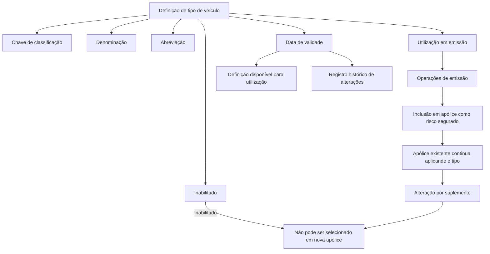

# Definición de Tipo de Vehículo — Documentación Reef

## 1. Metadados do Documento
- **Arquivo de Origem:** Não informado
- **Tipo de Documento:** Especificação funcional
- **Domínio / Sistema:** Reef / Mapfredocument — classificação de veículos em apólices
- **Público-Alvo:** Negócio, operação e equipes responsáveis pela emissão e manutenção de apólices
- **Data/Versão Identificada:** Não identificada

---

## 2. Resumo Executivo & Contexto de Negócio

O documento define o conceito de **tipo de veículo**, utilizado para identificar a classificação de veículos que podem ser incluídos em apólices como risco segurado. A definição estabelece propriedades para identificação, denominação, abreviação, disponibilidade operacional e vigência temporal da classificação.

A classificação de tipo de veículo pode ser utilizada nas operações de emissão quando a propriedade **“Utilización en emisión”** indicar que seu uso é permitido. Dessa forma, a gestão da classificação influencia diretamente a seleção de veículos durante processos que necessitam identificar o tipo de veículo.

O estado de inabilitação controla se uma classificação pode continuar sendo incluída em novas apólices. Quando um tipo de veículo é inabilitado, as apólices existentes que já o utilizam continuam aplicando essa classificação. A substituição somente ocorre mediante um suplemento; nesse momento, como a classificação está inabilitada, ela deixa de poder ser selecionada.

A propriedade de data de validade determina a partir de quando uma definição fica disponível para utilização. O uso correto da validade permite manter um registro histórico das alterações efetuadas na definição de tipo de veículo.

---

## 3. Arquitetura, Componentes & Tecnologias Envolvidas

Os elementos identificados no conteúdo são:

- **Reef:** Contexto de documentação no qual a definição é apresentada.
- **Mapfredocument:** Nome exibido no bloco de documentação.
- **Tipo de vehículo:** Entidade funcional que representa uma classificação de veículo elegível como risco segurado.
- **Póliza:** Apólice que pode incluir um veículo classificado por tipo de veículo.
- **Emisión:** Operações nas quais pode ser necessário identificar e utilizar o tipo de veículo.
- **Suplemento:** Mecanismo citado para alterar, em uma apólice existente, um tipo de veículo previamente aplicado.



> **Nota de Análise:** O conteúdo não descreve tecnologias, interfaces, métodos HTTP, contratos de integração, bases de dados, ambientes técnicos ou detalhes de implementação do sistema Reef.

---

## 4. Regras de Negócio, Especificações Funcionais & Processos

### 4.1 Objetivo da definição

A definição de tipo de veículo tem como objetivo estabelecer a classificação que identifica os veículos que podem ser incluídos em apólices como risco segurado.

### 4.2 Identificação e descrição da classificação

A definição contém uma chave que identifica a classificação do veículo. Também contém uma denominação, que descreve o tipo de veículo, e uma abreviação, que representa o nome abreviado desse tipo.

### 4.3 Uso em operações de emissão

A propriedade **“Utilización en emisión”** indica se a classificação definida pode ser utilizada em operações nas quais seja necessário identificar o tipo de veículo.

### 4.4 Regra de inabilitação

A propriedade **“Inhabilitado”** determina se a classificação permanece ativa ou se já não pode ser incluída em uma nova apólice.

Regras extraídas:

1. Um tipo de veículo inabilitado não pode ser incluído em uma nova apólice.
2. A inabilitação não elimina nem altera automaticamente o tipo de veículo aplicado em apólices existentes.
3. Todas as apólices que já possuam o tipo de veículo continuam aplicando-o.
4. A classificação somente é alterada em uma apólice existente mediante um suplemento.
5. No momento de selecionar uma classificação durante o suplemento, um tipo de veículo inabilitado não pode ser selecionado.

### 4.5 Regra de validade e histórico

A propriedade **“Fecha de validez”** determina quando a definição estará disponível para ser utilizada.

O uso correto da data de validade permite manter um registro histórico das alterações efetuadas na definição de tipo de veículo.

---

## 5. Tabelas de Parâmetros, Ambientes e Estruturas de Dados

| Item / Parâmetro | Descrição / Função | Tipo / Valores / Formato | Ambiente / Observações |
| :--- | :--- | :--- | :--- |
| Tipo de veículo | Classificação que identifica veículos que podem ser incluídos em apólices como risco segurado. | Entidade de classificação. | Contexto funcional de apólices. |
| Chave do tipo de veículo | Identifica a classificação do veículo. | Chave identificadora; formato não informado. | Não informado. |
| Denominação do tipo de veículo | Nome que descreve o tipo de veículo. | Texto; formato não informado. | Não informado. |
| Abreviação do tipo de veículo | Nome abreviado do tipo de veículo. | Texto; formato não informado. | Não informado. |
| Utilização em emissão | Indica se a classificação pode ser utilizada em operações que exigem identificar o tipo de veículo. | Indicador; valores exatos não informados. | Aplicável a operações de emissão. |
| Inabilitado | Determina se a classificação está ativa ou se não pode mais ser incluída em nova apólice. | Indicador de estado; valores exatos não informados. | Não impede a permanência em apólices existentes. |
| Data de validade | Determina quando a definição estará disponível para utilização. | Data; formato não informado. | Permite registro histórico de alterações. |
| Apólice existente | Apólice que já possui uma classificação de tipo de veículo aplicada. | Conceito de negócio. | Continua aplicando o tipo mesmo após inabilitação. |
| Nova apólice | Apólice na qual ocorre nova inclusão de risco segurado. | Conceito de negócio. | Não pode receber tipo de veículo inabilitado. |
| Suplemento | Mecanismo citado para alterar o tipo aplicado em uma apólice existente. | Processo ou operação; detalhes não informados. | Não permite selecionar tipo inabilitado. |
| Owner | Proprietário exibido no bloco de documentação. | `user:agonzalez_mapfre.com` | Metadado apresentado no conteúdo bruto. |
| Lifecycle | Situação de ciclo de vida exibida no bloco de documentação. | `Approved Source / VL` | Significado de `VL` não informado. |

---

## 6. Bateria de Perguntas & Respostas para RAG (FAQ Sintético)

### P1: Qual é o objetivo da definição de tipo de veículo?
**R:** A definição de tipo de veículo estabelece a classificação que identifica os veículos que poderão ser incluídos em apólices como risco segurado.

### P2: O que identifica a chave do tipo de veículo?
**R:** A chave do tipo de veículo identifica a classificação do veículo. O documento não informa o formato técnico, tamanho ou regras de geração dessa chave.

### P3: Qual é a função da denominação do tipo de veículo?
**R:** A denominação é o nome que descreve o tipo de veículo definido na classificação.

### P4: Para que serve a abreviação do tipo de veículo?
**R:** A abreviação corresponde ao nome abreviado do tipo de veículo. O documento não informa regras de preenchimento, tamanho ou unicidade da abreviação.

### P5: O que significa “Utilización en emisión” na definição de tipo de veículo?
**R:** “Utilización en emisión” indica se a classificação definida pode ser utilizada nas operações em que seja necessário identificar o tipo de veículo.

### P6: Um tipo de veículo inabilitado pode ser incluído em uma nova apólice?
**R:** Não. Quando uma classificação está inabilitada, ela já não pode ser incluída em uma nova apólice.

### P7: O que acontece com apólices existentes quando o tipo de veículo é inabilitado?
**R:** As apólices que já dispõem do tipo de veículo continuam aplicando essa classificação mesmo após a inabilitação. A inabilitação não altera automaticamente as apólices existentes.

### P8: Como uma apólice existente deixa de utilizar um tipo de veículo inabilitado?
**R:** A alteração ocorre mediante um suplemento. Quando a classificação precisa ser alterada por suplemento, o tipo de veículo inabilitado não pode ser selecionado novamente.

### P9: Qual é a finalidade da data de validade na definição de tipo de veículo?
**R:** A data de validade determina quando a definição estará disponível para ser utilizada. Seu uso correto também permite manter um registro histórico das alterações realizadas na definição.

### P10: O documento especifica APIs, métodos HTTP ou contratos JSON para tipo de veículo?
**R:** Não. O conteúdo apresenta regras funcionais e propriedades da definição de tipo de veículo, mas não detalha APIs, métodos HTTP, contratos JSON, tecnologias de implementação ou integrações.

### P11: O documento informa quais valores representam os estados ativo e inabilitado?
**R:** Não. O documento explica o comportamento funcional do estado inabilitado, mas não informa valores de campo, códigos, enumerações ou formatos técnicos.

### P12: O que significa o metadado “Lifecycle Approved Source / VL”?
**R:** O conteúdo bruto exibe o valor “Approved Source / VL” no campo Lifecycle. Entretanto, não fornece definição para esse status nem explica o significado da sigla “VL”.

---

## 7. Glossário de Termos, Siglas & Conceitos-Chave

- **Apólice / Póliza:** Registro de seguro no qual veículos podem ser incluídos como risco segurado.
- **Data de validade / Fecha de validez:** Data que determina quando a definição de tipo de veículo estará disponível para uso.
- **Emissão / Emisión:** Operações nas quais pode ser necessário identificar e utilizar o tipo de veículo.
- **Inabilitado / Inhabilitado:** Estado em que a classificação não pode ser incluída em nova apólice nem selecionada durante uma alteração por suplemento.
- **Mapfredocument:** Nome exibido na área de documentação; o conteúdo não define formalmente o termo.
- **Reef:** Contexto de documentação exibido no conteúdo; o documento não fornece expansão da sigla ou descrição técnica da plataforma.
- **Risco segurado:** Veículo que pode ser incluído em uma apólice conforme sua classificação.
- **Suplemento:** Operação ou mecanismo mencionado para alterar o tipo de veículo aplicado em uma apólice existente.
- **Tipo de veículo / Tipo de vehículo:** Classificação que identifica veículos elegíveis para inclusão em apólices como risco segurado.
- **VL:** Sigla exibida no metadado de Lifecycle; significado não informado.

---

## 8. Notas Críticas, Riscos & Limitações

- O documento não identifica o arquivo de origem, data, versão, autor formal ou histórico de revisões.
- O texto extraído possui caracteres corrompidos em algumas palavras, como “Denir” e “clasicación”. A interpretação funcional foi preservada pelo contexto textual, sem introdução de fatos adicionais.
- Não há detalhamento técnico sobre persistência de dados, integrações, APIs, serviços, telas, permissões ou mecanismos de auditoria.
- Não são informados os formatos, domínios permitidos, obrigatoriedade ou regras de validação para chave, denominação, abreviação e data de validade.
- O documento não define como ocorre tecnicamente o suplemento, apenas estabelece que ele é o mecanismo de alteração de uma classificação presente em uma apólice.
- Não são detalhadas regras para conflitos entre data de validade e estado de inabilitação.
- O termo `VL`, exibido no ciclo de vida da documentação, não é explicado no conteúdo fornecido.

---

## 9. Conteúdo Bruto Estruturado (Referência Fiel)

```text
--- [PÁGINA 1 DE 1] ---

DEFINICIÓN de tipo de vehículo
Objetivo
Denir la clasicación que identica los vehículos que se podrán incluir en las pólizas, como riesgo asegurado.
Propiedades generales
Propiedades generales
Tipo de vehículo
Clave que identica la clasicación de vehículo.
Denominación del tipo de vehículo
Nombre que describe el tipo de vehículo.
Abreviatura del tipo de vehículo
Nombre abreviado del tipo de vehículo.
Utilización en emisión
Indica si la clasicación denida se puede utilizar en las operaciones en las que sea necesario identicar el tipo de vehículo.
Inhabilitado
En este punto se determina si está activo o por el contrario ya no puede ser incluido en una nueva póliza. Es importante destacar que, aunque
inhabilite, todas las pólizas que dispongan de ello, seguirá aplicándose hasta que mediante un suplemento se cambie. En ese momento, al
estar inhabilitado ya no será posible seleccionarlo.
Fecha de validez
Determina cuando la denición estará disponible para ser utilizado.
Su correcto uso permite tener un registro histórico de los cambios efectuados en la denición.
Ejemplo:
Documentation / DOCUMENTACIÓN Reef
DOCUMENTACIÓN Reef
Mapfredocument
DOCUMENTACIÓN Reef
Owner
user:agonzalez_mapfre.com
Lifecycle
Approved Source
 / 
 VL
Buscar Inicio Soluciones Arquitecturas APIs Componentes Cloud Documentación Zeus Reef Ayuda
ES
```
