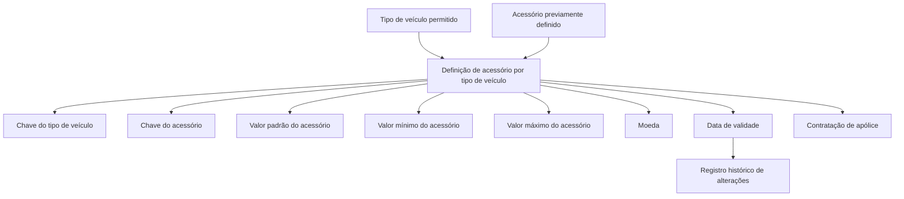
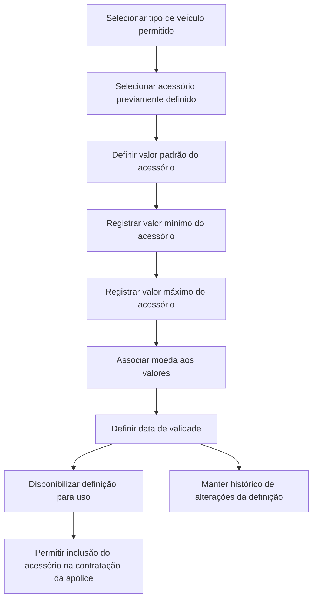

# Definição de Acessório por Tipo de Veículo

## 1. Metadados do Documento
- **Arquivo de Origem:** `Não identificado — texto bruto fornecido na solicitação`
- **Tipo de Documento:** `Especificação Técnica / Documentação Funcional`
- **Domínio / Sistema:** `Reef / Mapfre`
- **Público-Alvo:** `Não identificado; conteúdo direcionado à configuração funcional de acessórios para veículos`
- **Data/Versão Identificada:** `Não identificada`
- **Status identificado no texto:** `Approved`
- **Owner identificado no texto:** `user:agonzalez_mapfre.com`

---

## 2. Resumo Executivo & Contexto de Negócio

O documento descreve a funcionalidade de definição de acessórios por tipo de veículo no contexto da documentação Reef e Mapfre. O objetivo declarado é registrar acessórios previamente definidos para os tipos de veículos permitidos, possibilitando que esses acessórios sejam incluídos durante a contratação de uma apólice.

A definição associa um tipo de veículo a um acessório permitido e estabelece os valores pelos quais o acessório pode ser segurado. A configuração inclui um valor padrão, um valor mínimo e um valor máximo, além da moeda aplicável aos valores monetários do acessório.

A disponibilidade temporal da definição é controlada por uma data de validade. Segundo o documento, o uso correto da data de validade permite manter um registro histórico das alterações efetuadas na definição.

O texto não detalha fluxos de interface, métodos HTTP, contratos de integração, persistência de dados, regras de cálculo, validações técnicas adicionais ou permissões de acesso. A documentação apresentada concentra-se nas propriedades funcionais da definição de acessório por tipo de veículo.

---

## 3. Arquitetura, Componentes & Tecnologias Envolvidas

Os elementos identificados no conteúdo são:

| Componente / Termo | Papel identificado no documento |
| :--- | :--- |
| Reef | Contexto de documentação identificado como “DOCUMENTACIÓN Reef”. |
| Mapfre | Organização ou domínio identificado no texto por “Mapfredocument” e pelo usuário proprietário com domínio `mapfre.com`. |
| Definição de acessório por tipo de veículo | Configuração que relaciona tipos de veículos permitidos a acessórios previamente definidos. |
| Tipo de veículo | Chave que identifica o tipo de veículo para o qual o acessório é definido. |
| Acessório | Chave do acessório permitido na contratação. |
| Apólice | Contexto de contratação em que o acessório pode ser incluído. |
| Moeda | Chave da moeda na qual os valores do acessório são expressos. |
| Data de validade | Controle de disponibilidade e histórico de alterações da definição. |



> **Nota de Análise:** O documento não descreve a arquitetura de software, tecnologias de implementação, bancos de dados, APIs, microsserviços, endpoints, ambientes ou mecanismos de integração associados à definição.

---

## 4. Regras de Negócio, Especificações Funcionais & Processos

### 4.1 Objetivo funcional

A funcionalidade deve permitir registrar, para os tipos de veículos permitidos, acessórios previamente definidos que podem ser incluídos na contratação de uma apólice.

Além do registro do acessório permitido, a definição deve estabelecer o valor pelo qual o acessório pode ser segurado.

### 4.2 Propriedades funcionais identificadas

1. **Tipo de veículo**
   - É a chave que identifica o tipo de veículo para o qual o acessório está sendo definido.
   - A definição de acessório está vinculada a um tipo de veículo.

2. **Acessório**
   - É a chave do acessório que será permitido durante a contratação.
   - O acessório deve ter sido previamente definido, conforme declarado no objetivo do documento.

3. **Valor do acessório**
   - É o valor padrão do acessório definido.
   - Esse é o valor que será exibido quando o acessório for incluído na contratação de uma apólice.

4. **Valor mínimo do acessório**
   - Registra o valor mínimo pelo qual o acessório pode ser segurado.

5. **Valor máximo do acessório**
   - Contém o valor máximo pelo qual o acessório pode ser segurado.

6. **Moeda**
   - É a chave da moeda em que os valores do acessório são expressos.

7. **Data de validade**
   - Determina quando a definição estará disponível para uso.
   - O uso correto da data de validade permite manter um registro histórico das alterações realizadas na definição.

### 4.3 Fluxo funcional extraído



> **Nota de Análise:** O documento não informa se o valor padrão deve estar entre o valor mínimo e o valor máximo, nem define regras para valores nulos, moedas permitidas, sobreposição de períodos de validade ou critérios de elegibilidade do tipo de veículo.

---

## 5. Tabelas de Parâmetros, Ambientes e Estruturas de Dados

| Item / Parâmetro | Descrição / Função | Tipo / Valores / Formato | Ambiente / Observações |
| :--- | :--- | :--- | :--- |
| Tipo de veículo | Chave que identifica o tipo de veículo para o qual o acessório está sendo definido. | Chave; formato não detalhado. | Aplicável aos tipos de veículos permitidos. |
| Acessório | Chave do acessório que será permitido na contratação. | Chave; formato não detalhado. | O objetivo informa que os acessórios são previamente definidos. |
| Valor do acessório | Valor padrão do acessório; valor mostrado quando o acessório é incluído na contratação de uma apólice. | Valor monetário; formato não detalhado. | Expresso na moeda configurada. |
| Valor mínimo do acessório | Valor mínimo pelo qual o acessório pode ser segurado. | Valor monetário; formato não detalhado. | Expresso na moeda configurada. |
| Valor máximo do acessório | Valor máximo pelo qual o acessório pode ser segurado. | Valor monetário; formato não detalhado. | Expresso na moeda configurada. |
| Moeda | Chave da moeda em que os valores do acessório são expressos. | Chave; formato não detalhado. | Aplicável aos valores padrão, mínimo e máximo. |
| Data de validade | Determina quando a definição estará disponível para uso. | Data; formato não detalhado. | Permite manter histórico das alterações da definição. |
| Owner | Proprietário identificado no cabeçalho da documentação. | `user:agonzalez_mapfre.com` | Identificado no conteúdo bruto. |
| Lifecycle | Situação do ciclo de vida da documentação. | `Approved` | Identificado no conteúdo bruto. |
| Source | Origem identificada no cabeçalho. | `VL` | O significado de `VL` não é detalhado. |

> **Nota de Análise:** O documento não apresenta URLs de ambientes, rotas de logs, nomes de servidores, portas, variáveis de configuração, estruturas JSON, tabelas físicas ou contratos de dados.

---

## 6. Bateria de Perguntas & Respostas para RAG (FAQ Sintético)

### P1: Qual é o objetivo da definição de acessório por tipo de veículo?
**R:** O objetivo é registrar, para os tipos de veículos permitidos, acessórios previamente definidos que podem ser incluídos durante a contratação de uma apólice. A definição também estabelece o valor pelo qual esses acessórios podem ser segurados.

### P2: O que identifica o campo Tipo de veículo?
**R:** O campo Tipo de veículo é a chave que identifica o tipo de veículo para o qual o acessório está sendo definido.

### P3: O que representa o campo Acessório?
**R:** O campo Acessório é a chave do acessório que será permitido na contratação. O documento informa que os acessórios considerados são previamente definidos.

### P4: Qual valor é exibido quando um acessório é incluído na contratação de uma apólice?
**R:** O valor exibido é o valor padrão do acessório, denominado no documento como Valor do acessório.

### P5: Para que serve o valor mínimo do acessório?
**R:** O valor mínimo do acessório registra o menor valor pelo qual o acessório pode ser segurado.

### P6: Para que serve o valor máximo do acessório?
**R:** O valor máximo do acessório contém o maior valor pelo qual o acessório pode ser segurado.

### P7: Como a moeda é aplicada à definição de acessório?
**R:** A moeda é identificada por uma chave e determina a moeda na qual estão expressos os valores do acessório, incluindo os valores padrão, mínimo e máximo.

### P8: Qual é a função da data de validade na definição de acessório por tipo de veículo?
**R:** A data de validade determina quando a definição estará disponível para uso. O documento também afirma que seu uso correto permite manter um registro histórico das alterações feitas na definição.

### P9: O documento especifica APIs ou métodos HTTP para consultar ou cadastrar acessórios?
**R:** Não. O documento não detalha métodos HTTP, endpoints, APIs, contratos JSON, integrações ou mecanismos técnicos de cadastro e consulta.

### P10: O documento define validações entre valor mínimo, valor padrão e valor máximo?
**R:** Não. O texto descreve a finalidade de cada valor, mas não informa regras de consistência, fórmulas, obrigatoriedade ou relações de validação entre valor mínimo, valor padrão e valor máximo.

---

## 7. Glossário de Termos, Siglas & Conceitos-Chave

- **Acessório:** Elemento previamente definido que pode ser permitido na contratação de uma apólice para determinado tipo de veículo.
- **Apólice:** Contexto de contratação no qual o acessório pode ser incluído.
- **Data de validade:** Data que determina quando a definição estará disponível para uso e contribui para o registro histórico de alterações.
- **Mapfre:** Nome identificado no conteúdo por “Mapfredocument” e no domínio do proprietário `mapfre.com`; o documento não detalha sua função organizacional.
- **Moeda:** Chave da moeda em que os valores do acessório são expressos.
- **Reef:** Contexto identificado como “DOCUMENTACIÓN Reef”; o documento não expande ou define o termo.
- **Tipo de veículo:** Chave que identifica o tipo de veículo para o qual o acessório é definido.
- **VL:** Valor exibido no campo “Source”; o documento não define seu significado.

---

## 8. Notas Críticas, Riscos & Limitações

- O documento não informa formatos, tipos de dados ou obrigatoriedade dos campos Tipo de veículo, Acessório, valores monetários, Moeda e Data de validade.
- Não há regra explícita que estabeleça relação obrigatória entre valor mínimo, valor padrão e valor máximo.
- Não são detalhados critérios para determinar quais tipos de veículos são permitidos.
- Não são identificados os cadastros ou repositórios de origem dos acessórios previamente definidos.
- O texto não especifica comportamento para períodos de validade sobrepostos, expiração de definições ou retroatividade de alterações.
- Não há detalhes sobre APIs, integrações, componentes técnicos, autenticação, autorização, auditoria, logs ou monitoramento.
- O documento apresenta referências a “Exemplo”, porém nenhum conteúdo de exemplo foi extraído após essas referências.
- Alguns trechos possuem caracteres de codificação anômalos no texto bruto, como `denidos`, `identica` e `deniendo`; a transcrição de referência preserva esses caracteres.

---

## 9. Conteúdo Bruto Estruturado (Referência Fiel)

````text
--- [PÁGINA 1 DE 2] ---

DEFINICIÓN de accesorio por tipo de vehículo
Objetivo
Registrar, para los tipos de vehículos permitidos, los accesorios denidos previamente, que pueden incluirse en la contratación de la póliza.
Además de establecer el valor por el que se pueden asegurar dichos accesorios.
Propiedades generales
Propiedades generales
Tipo de vehículo
Clave que identica el tipo de vehículo para el que se está deniendo el accesorio.
Accesorio
Clave del accesorio que se permitirá en la contratación.
Valor del accesorio
Valor estándar del accesorio que se está deniendo, que será el que se muestre cuando este accesorio se incluya en la contratación de una
póliza.
Valor mínimo del accesorio
Registra el valor mínimo por el que se puede asegurar el accesorio que se está deniendo.
Valor máximo del accesorio
Contiene el valor máximo por el que se puede asegurar el accesorio que se está deniendo.
Moneda
Clave de la moneda en la que están expresados los importes de valores del accesorio.
Ejemplo:
Ejemplo:
Ejemplo:
Documentation / DOCUMENTACIÓN Reef
DOCUMENTACIÓN Reef
Mapfredocument
DOCUMENTACIÓN Reef
Owner
user:agonzalez_mapfre.com
Lifecycle
Approved Source
 / 
 VL
Buscar Inicio Soluciones Arquitecturas APIs Componentes Cloud Documentación Zeus Reef Ayuda
ES


--- [PÁGINA 2 DE 2] ---

Fecha de validez
Determina cuando la denición estará disponible para ser utilizado. Su correcto uso permite tener un registro histórico de los cambios
efectuados en la denición.
Ejemplo:
```
````
