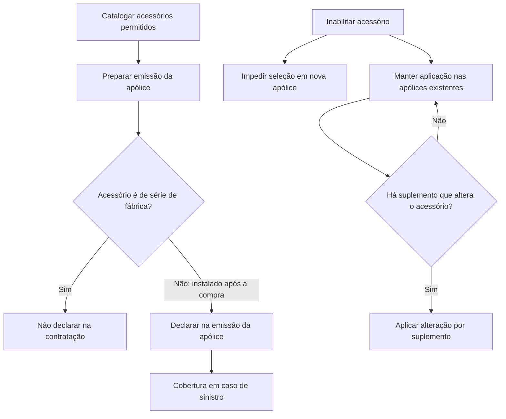

# Definição de Acessórios para Emissão de Apólices

## 1. Metadados do Documento
- **Arquivo de Origem:** Não identificado no conteúdo extraído
- **Tipo de Documento:** Especificação Funcional
- **Domínio / Sistema:** Reef / Mapfre
- **Público-Alvo:** Negócio, operação e equipes responsáveis pela emissão de apólices
- **Data/Versão Identificada:** Não identificada

---

## 2. Resumo Executivo & Contexto de Negócio

O documento define acessórios como elementos adicionais incorporados a um veículo para melhorar funcionalidade, conforto, segurança, desempenho ou aparência. A definição abrange acessórios instalados durante a fabricação e acessórios instalados posteriormente à compra do veículo.

A distinção principal do processo de negócio está entre acessórios de série e acessórios personalizados após a compra. Acessórios de série não precisam ser declarados durante a contratação de uma apólice, pois são conhecidos antecipadamente a partir da classificação do veículo.

Acessórios adicionados após a compra podem refletir preferências de cada usuário e devem ser declarados na emissão da apólice para que tenham cobertura em caso de sinistro. Antes da emissão, os acessórios permitidos devem ser catalogados.

O documento também estabelece a gestão de inativação de acessórios. Um acessório inabilitado deixa de estar disponível para seleção em novas apólices, mas continua sendo aplicado às apólices existentes que já o possuem, até que um suplemento altere essa condição.

---

## 3. Arquitetura, Componentes & Tecnologias Envolvidas

O conteúdo extraído cita o ambiente documental **Reef**, referências a **Mapfre**, **Mapfredocument**, **Zeus**, além de itens de navegação como Soluções, Arquiteturas, APIs, Componentes, Cloud, Documentação e Ajuda. Contudo, o texto não descreve integrações técnicas, contratos de API, microsserviços, bancos de dados, tecnologias de implementação ou ambientes de execução.

O fluxo funcional explicitamente descrito relaciona a catalogação de acessórios, a emissão de apólices, a declaração de acessórios posteriores à compra e a inabilitação de itens.



> **Nota de Análise:** O conteúdo cita Reef, Mapfre, Mapfredocument e Zeus, mas não informa a função técnica, a arquitetura ou a relação operacional entre esses elementos.

---

## 4. Regras de Negócio, Especificações Funcionais & Processos

1. Um acessório é um elemento adicional agregado ao veículo para melhorar funcionalidade, conforto, segurança, desempenho ou aparência.

2. Existem acessórios incluídos de série desde a fabricação do veículo.

3. Acessórios de série não devem ser declarados durante a contratação de uma apólice, pois são conhecidos antecipadamente pela classificação do veículo.

4. Existem acessórios que podem ser instalados após a compra do veículo, permitindo a personalização conforme as preferências de cada usuário.

5. Acessórios instalados após a compra devem ser declarados na emissão da apólice para que sejam cobertos em caso de sinistro.

6. Antes da emissão da apólice, os acessórios que serão permitidos devem ser catalogados.

7. Cada acessório possui uma chave de identificação.

8. Cada acessório possui uma tipologia identificada por chave.

9. Cada acessório pertence a um grupo identificado por chave.

10. Cada acessório possui uma descrição que representa o nome identificador do acessório.

11. Cada acessório possui uma descrição curta, definida como abreviação do nome do acessório.

12. O atributo **Inhabilitado** determina se o acessório permanece ativo ou se não pode mais ser incluído em uma nova apólice.

13. A inabilitação de um acessório não remove automaticamente sua aplicação das apólices existentes que já dispõem dele.

14. A aplicação do acessório inabilitado continua nas apólices existentes até que um suplemento modifique o acessório.

15. Após a inabilitação, o acessório não pode ser selecionado para inclusão em uma nova apólice.

> **Nota de Análise:** O trecho termina durante a explicação do atributo “Inhabilitado”; não há detalhamento adicional sobre regras de suplemento, responsáveis pela catalogação ou critérios de validação.

---

## 5. Tabelas de Parâmetros, Ambientes e Estruturas de Dados

| Item / Parâmetro | Descrição / Função | Tipo / Valores / Formato | Ambiente / Observações |
| :--- | :--- | :--- | :--- |
| Accesorio | Chave usada para identificar o acessório. | Chave; formato não informado. | Propriedade geral do acessório. |
| Tipo de accesorio | Chave da tipologia na qual o acessório é classificado. | Chave; tipologias não informadas. | Propriedade geral do acessório. |
| Agrupamiento del accesorio | Chave do grupo ao qual o acessório pertence. | Chave; grupos não informados. | Propriedade geral do acessório. |
| Descripción del accesorio | Nome que identifica o acessório. | Texto. | Propriedade geral do acessório. |
| Descripción corta | Abreviação do nome do acessório. | Texto abreviado. | Propriedade geral do acessório. |
| Inhabilitado | Determina se o acessório está ativo ou se não pode ser incluído em uma nova apólice. | Estado lógico; valores técnicos não informados. | Não remove o acessório das apólices existentes. |
| Acessório de série | Acessório incluído desde a fabricação do veículo. | Classificação funcional. | Não é declarado na contratação; conhecido pela classificação do veículo. |
| Acessório instalado após compra | Acessório inserido depois da compra do veículo. | Classificação funcional. | Deve ser declarado na emissão para cobertura em sinistro. |
| Suplemento | Mecanismo citado para modificar uma apólice que dispõe de acessório inabilitado. | Processo/documento; formato não informado. | Pode alterar a aplicação do acessório existente. |
| Reef | Referência exibida na documentação. | Sistema ou espaço documental; não detalhado. | Associado a “DOCUMENTACIÓN Reef”. |
| Mapfredocument | Referência exibida no conteúdo. | Não informado. | Não há descrição funcional. |
| Zeus | Item exibido na navegação documental. | Não informado. | Não há descrição funcional. |

---

## 6. Bateria de Perguntas & Respostas para RAG (FAQ Sintético)

### P1: O que são acessórios no contexto da emissão de apólices de veículos?
**R:** Acessórios são elementos adicionais agregados ao veículo para melhorar funcionalidade, conforto, segurança, desempenho ou aparência. O documento diferencia acessórios de série, incluídos na fabricação, de acessórios instalados após a compra do veículo.

### P2: Acessórios de fábrica precisam ser declarados na contratação da apólice?
**R:** Não. Acessórios incluídos de série desde a fabricação não devem ser declarados durante a contratação da apólice, pois já são conhecidos antecipadamente pela classificação do veículo.

### P3: Quando um acessório instalado após a compra deve ser declarado?
**R:** Um acessório instalado após a compra do veículo deve ser declarado na emissão da apólice. Essa declaração é necessária para que o acessório esteja coberto em caso de sinistro.

### P4: Qual é a etapa necessária antes de emitir uma apólice com acessórios?
**R:** Antes da emissão da apólice, os acessórios que poderão ser aceitos devem ser catalogados. O documento não detalha o responsável, a ferramenta ou os critérios usados nesse processo de catalogação.

### P5: O que ocorre quando um acessório é inabilitado?
**R:** Um acessório inabilitado não pode mais ser selecionado para inclusão em uma nova apólice. Entretanto, o acessório permanece aplicado às apólices existentes que já o possuem.

### P6: A inabilitação remove automaticamente o acessório das apólices existentes?
**R:** Não. A inabilitação impede apenas a seleção do acessório em novas apólices. As apólices existentes continuam com o acessório aplicado até que ele seja modificado por meio de um suplemento.

### P7: Quais propriedades gerais identificam um acessório?
**R:** O documento identifica as propriedades: chave do acessório, tipo de acessório, agrupamento do acessório, descrição do acessório, descrição curta e indicador de inabilitação.

### P8: Qual é a função da descrição curta do acessório?
**R:** A descrição curta é a abreviação do nome que identifica o acessório.

### P9: Qual é a função do tipo de acessório?
**R:** O tipo de acessório é a chave da tipologia na qual o acessório é classificado. O documento não apresenta os valores ou o catálogo de tipologias.

### P10: Qual é a função do agrupamento do acessório?
**R:** O agrupamento do acessório é a chave do grupo no qual o acessório se encontra. O documento não informa os grupos disponíveis nem as regras de associação.

### P11: O documento descreve APIs, métodos HTTP ou contratos JSON para a gestão de acessórios?
**R:** Não. Embora a navegação documental mencione “APIs”, o conteúdo extraído não descreve APIs, métodos HTTP, endpoints, contratos JSON, integrações ou tecnologias de implementação.

### P12: O documento detalha como é criado ou processado um suplemento?
**R:** Não. O suplemento é citado apenas como o mecanismo que pode alterar a situação de uma apólice existente com acessório inabilitado. Não são informados fluxo, campos, validações ou responsáveis pelo suplemento.

---

## 7. Glossário de Termos, Siglas & Conceitos-Chave

- **Acessório:** Elemento adicional incorporado a um veículo para melhorar funcionalidade, conforto, segurança, desempenho ou aparência.
- **Acessório de série:** Acessório incluído desde a fabricação do veículo e conhecido pela classificação do veículo.
- **Acessório instalado após a compra:** Acessório incorporado depois da compra do veículo e que deve ser declarado na emissão para cobertura em sinistro.
- **Agrupamento do acessório:** Grupo ao qual o acessório pertence, identificado por uma chave.
- **Apólice:** Documento ou contrato citado no processo de contratação, emissão e cobertura de acessórios.
- **Cobertura em caso de sinistro:** Condição indicada para acessórios declarados durante a emissão da apólice.
- **Emissão da apólice:** Momento no qual acessórios instalados após a compra devem ser declarados.
- **Inhabilitado:** Estado no qual o acessório deixa de poder ser selecionado em novas apólices, mantendo-se em apólices existentes até alteração por suplemento.
- **Reef:** Nome citado em “DOCUMENTACIÓN Reef”; a função não é detalhada.
- **Suplemento:** Mecanismo citado para modificar uma apólice que já possui determinado acessório.
- **Tipologia:** Classificação do acessório identificada pela chave de tipo de acessório.

---

## 8. Notas Críticas, Riscos & Limitações

- O conteúdo extraído não identifica o nome do arquivo de origem, data, versão, autor formal ou histórico de revisões.
- O texto não especifica valores permitidos, formatos ou unicidade das chaves de acessório, tipo de acessório e agrupamento.
- O atributo **Inhabilitado** é descrito funcionalmente, mas o documento não informa sua representação técnica, como valores booleanos, códigos de status ou data de vigência.
- Não há detalhamento sobre o processo de catalogação prévia de acessórios, incluindo responsáveis, critérios de aprovação ou fonte de dados.
- O documento não define quais eventos constituem um sinistro, nem descreve a validação da cobertura.
- A referência a suplemento não contém regras operacionais, contratos, telas, permissões ou impactos financeiros.
- Reef, Mapfredocument e Zeus são mencionados, mas suas responsabilidades e integrações não são explicadas.
- O texto de origem é parcial e termina no meio da explicação sobre acessórios inabilitados.

---

## 9. Conteúdo Bruto Estruturado (Referência Fiel)

```text
--- [PÁGINA 1 DE 2] ---

DEFINICIÓN de accesorios
Objetivo
Son elementos adicionales que se agregan a un vehículo para mejorar su funcionalidad, comodidad, seguridad, rendimiento o apariencia.
Existen accesorios que se incluyen de serie desde la fabricación del vehículo, este tipo de accesorios no se declaran al contratar una póliza,
ya que se conocen de antemano por la clasicación del vehículo.
Pero también hay accesorios que pueden ser instalados después de la compra del vehículo y personalizarse según las preferencias de cada
usuario. Estos accesorios se deben declarar en la emisión de la póliza para que estén cubiertos en caso de siniestro.
Previo a la emisión de la póliza se deben catalogar los accesorios que se van a permitir.
Propiedades generales
Propiedades generales
Accesorio
Clave con la que se identica el accesorio.
Tipo de accesorio
Clave de la tipología en la que se clasica el accesorio.
Agrupamiento del accesorio
Clave del grupo en el que se encuentra el accesorio.
Descripción del accesorio
Nombre que identica el accesorio.
Descripción corta
Abreviatura del nombre del accesorio.
Inhabilitado
En este punto se determina si está activo o por el contrario ya no puede ser incluido en una nueva póliza. Es importante destacar que, aunque
inhabilite, todas las pólizas que dispongan de ello, seguirá aplicándose hasta que mediante un suplemento se cambie. En ese momento, al
Ejemplo:
Documentation / DOCUMENTACIÓN Reef
DOCUMENTACIÓN Reef
Mapfredocument
DOCUMENTACIÓN Reef
Owner
user:agonzalez_mapfre.com
Lifecycle
Approved Source
 / 
 VL
Buscar Inicio Soluciones Arquitecturas APIs Componentes Cloud Documentación Zeus Reef Ayuda
ES


--- [PÁGINA 2 DE 2] ---

estar inhabilitado ya no será posible seleccionarlo.
```
