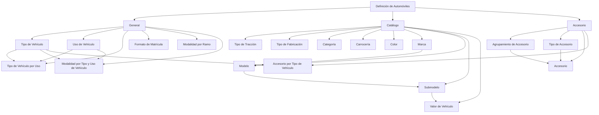

# Definição de Automóveis — Configuração de Veículos e Acessórios no Reef

## 1. Metadados do Documento
- **Arquivo de Origem:** `Não identificado`
- **Tipo de Documento:** `Especificação Funcional`
- **Domínio / Sistema:** `Documentação Reef / Mapfre`
- **Público-Alvo:** `Negócio, Analistas Funcionais, Desenvolvedores e Operação`
- **Data/Versão Identificada:** `Não identificada`
- **Owner identificado:** `user:agonzalez_mapfre.com`
- **Lifecycle identificado:** `Approved`

---

## 2. Resumo Executivo & Contexto de Negócio

O documento descreve a estrutura de definição de automóveis no contexto da documentação Reef da Mapfre. O conteúdo organiza os elementos necessários para caracterizar veículos seguráveis e explicita a ordem conceitual em que essas definições devem ser realizadas.

A estrutura é dividida em três níveis principais: **General**, **Catálogo** e **Accesorio**. O nível General contém definições necessárias para ramos de automóvel, incluindo tipo, uso, modalidade e formato de matrícula. O nível Catálogo concentra atributos e cadastros de veículos, como marca, modelo, submodelo, carroceria, cor e valor do veículo.

O nível Accesorio estabelece os elementos necessários para classificar e permitir acessórios automotivos. A classificação considera agrupamento, tipo de acessório e compatibilidade de acessórios com determinados tipos de veículo.

O material apresenta nomes e finalidades dos elementos de configuração, mas não detalha telas, métodos HTTP, APIs, contratos JSON, regras de cálculo de prêmio, persistência de dados, perfis de acesso ou processos de aprovação. Portanto, o documento deve ser utilizado como referência funcional e taxonômica para a definição de automóveis.

---

## 3. Arquitetura, Componentes & Tecnologias Envolvidas

O documento identifica os seguintes contextos e componentes:

- **Reef:** repositório ou contexto de documentação no qual a definição de automóveis está publicada.
- **Mapfre:** contexto corporativo identificado na documentação.
- **General:** nível de definições gerais necessárias para ramos de automóvel.
- **Catálogo:** nível de cadastro e definição de dados de veículos.
- **Accesorio:** nível de definição, classificação e permissão de acessórios automotivos.
- **Documentación Reef / Mapfredocument:** referências de navegação ou publicação documental presentes no conteúdo extraído.
- **Zeus, Soluciones, Arquitecturas, APIs, Componentes e Cloud:** itens presentes na navegação da página, sem detalhamento de integração ou relação funcional com a definição de automóveis.



**Nota de Análise:** o documento define uma hierarquia funcional de conceitos, mas não apresenta arquitetura de software, integrações entre sistemas, tecnologias de implementação, interfaces técnicas ou fluxos de dados.

---

## 4. Regras de Negócio, Especificações Funcionais & Processos

### 4.1 Ordem conceitual de definição de automóveis

O documento indica que existem elementos que intervêm na definição de automóveis e que há uma ordem na qual essa definição deve ser realizada. A sequência exata de execução não é explicitamente formalizada como procedimento numerado, mas a estrutura apresentada permite identificar as dependências conceituais:

1. Definir os elementos gerais aplicáveis a ramos de automóvel.
2. Definir tipos de veículos que podem ser assegurados.
3. Definir os usos de veículo permitidos.
4. Relacionar tipo de veículo e uso de veículo.
5. Definir o formato aplicável às matrículas de veículos.
6. Definir modalidades permitidas por ramo.
7. Definir modalidades permitidas segundo tipo e uso de veículo.
8. Manter os catálogos de atributos e identificação de veículos.
9. Registrar marca, modelo e submodelo de veículos.
10. Registrar o valor do veículo por ano, considerando marca, modelo e submodelo.
11. Definir agrupamentos, tipos e acessórios permitidos.
12. Identificar acessórios permitidos segundo o tipo de veículo.

### 4.2 Regras e definições do nível General

- O nível **General** contém definições gerais necessárias para ramos de automóvel.
- **Tipo de Vehículo** define os tipos de veículos que podem ser assegurados.
- **Uso de Vehículo** define os usos de veículos permitidos.
- **Tipo de Vehículo por Uso** define o tipo de veículo conforme o uso.
- **Formato de Matrícula** define o formato que as matrículas dos veículos devem possuir.
- **Modalidad por Ramo** define as modalidades permitidas.
- **Modalidad por Tipo y Uso de Vehículo** define as modalidades permitidas conforme tipo e uso de veículo.

### 4.3 Regras e definições do nível Catálogo

- O nível **Catálogo** contém definições de diferentes catálogos de dados de veículos.
- **Tipo de Tracción** define os diferentes tipos de tração que os veículos podem possuir.
- **Tipo de Fabricación** define os tipos de fabricação dos veículos.
- **Categoría** define as categorias dos veículos.
- **Carrocería** define os tipos de carroceria que os veículos podem possuir.
- **Color** identifica as cores que os veículos podem possuir.
- **Marca** registra as diferentes marcas de veículos.
- **Modelo** registra os modelos dos veículos de cada marca identificada.
- **Submodelo** registra os submodelos das diferentes marcas e modelos identificados.
- **Valor de Vehículo** registra o valor do veículo por ano, segundo marca, modelo e submodelo.

### 4.4 Regras e definições do nível Accesorio

- O nível **Accesorio** contém definições de acessórios de automóvel.
- **Agrupamiento de Accesorio** define um agrupamento de acessórios.
- **Tipo de Accesorio** define uma tipologia para classificar acessórios.
- **Accesorio** define acessórios permitidos, classificados por tipo e agrupamento.
- **Accesorio por Tipo de Vehículo** identifica acessórios permitidos segundo o tipo de veículo.

### 4.5 Dependências funcionais explicitamente sustentadas

| Elemento dependente | Critérios ou elementos relacionados |
| :--- | :--- |
| Tipo de Vehículo por Uso | Tipo de veículo e uso de veículo |
| Modalidad por Tipo y Uso de Vehículo | Tipo de veículo e uso de veículo |
| Modelo | Marca identificada |
| Submodelo | Marca e modelo identificados |
| Valor de Vehículo | Ano, marca, modelo e submodelo |
| Accesorio | Tipo de acessório e agrupamento de acessório |
| Accesorio por Tipo de Vehículo | Tipo de veículo |

---

## 5. Tabelas de Parâmetros, Ambientes e Estruturas de Dados

| Item / Parâmetro | Descrição / Função | Tipo / Valores / Formato | Ambiente / Observações |
| :--- | :--- | :--- | :--- |
| General | Nível de definições gerais necessárias para ramos de automóvel | Nível funcional | Não são apresentados valores específicos |
| Tipo de Vehículo | Define tipos de veículos que podem ser assegurados | Catálogo ou definição de tipo | Não são listados tipos concretos |
| Uso de Vehículo | Define usos de veículos permitidos | Catálogo ou definição de uso | Não são listados usos concretos |
| Tipo de Vehículo por Uso | Define o tipo de veículo conforme o uso | Relação entre tipo e uso | Não são apresentados critérios ou combinações |
| Formato de Matrícula | Define o formato das matrículas de veículos | Regra de formato | Não são informados padrões de máscara ou validação |
| Modalidad por Ramo | Define modalidades permitidas | Regra ou catálogo de modalidade | O ramo específico não é informado |
| Modalidad por Tipo y Uso de Vehículo | Define modalidades permitidas por tipo e uso | Relação entre modalidade, tipo e uso | Não são apresentadas modalidades concretas |
| Catálogo | Agrupa definições de catálogos de dados de veículos | Nível funcional | Não são informados mecanismos de armazenamento |
| Tipo de Tracción | Define tipos de tração dos veículos | Catálogo de tração | Valores não detalhados |
| Tipo de Fabricación | Define tipos de fabricação dos veículos | Catálogo de fabricação | Valores não detalhados |
| Categoría | Define categorias dos veículos | Catálogo de categoria | Valores não detalhados |
| Carrocería | Define tipos de carroceria dos veículos | Catálogo de carroceria | Valores não detalhados |
| Color | Identifica cores que os veículos podem possuir | Catálogo de cor | Valores não detalhados |
| Marca | Registra marcas de veículos | Cadastro mestre | Marcas não listadas |
| Modelo | Registra modelos para cada marca identificada | Cadastro dependente de marca | Modelos não listados |
| Submodelo | Registra submodelos de marcas e modelos identificados | Cadastro dependente de marca e modelo | Submodelos não listados |
| Valor de Vehículo | Registra valor por ano segundo marca, modelo e submodelo | Registro de valor associado a atributos do veículo | Não são informados moeda, fórmula ou vigência |
| Accesorio | Nível com definições de acessórios de automóvel | Nível funcional | Não são informados acessórios concretos |
| Agrupamiento de Accesorio | Define agrupamento de acessórios | Catálogo ou classificação | Agrupamentos não listados |
| Tipo de Accesorio | Define tipologia para classificação de acessórios | Catálogo de tipo | Tipos não listados |
| Accesorio | Define acessórios permitidos classificados por tipo e agrupamento | Cadastro ou regra de permissão | Acessórios não listados |
| Accesorio por Tipo de Vehículo | Identifica acessórios permitidos por tipo de veículo | Relação entre acessório e tipo de veículo | Combinações não listadas |
| Owner | Proprietário identificado na documentação | `user:agonzalez_mapfre.com` | Referência literal extraída |
| Lifecycle | Estado de ciclo de vida da documentação | `Approved` | Referência literal extraída |

---

## 6. Bateria de Perguntas & Respostas para RAG (FAQ Sintético)

### P1: Qual é o objetivo da definição de automóveis no documento Reef?
**R:** A definição de automóveis organiza os elementos necessários para caracterizar veículos e acessórios no contexto de ramos de automóvel. O documento apresenta níveis funcionais para definições gerais, catálogos de dados de veículos e acessórios.

### P2: Quais níveis compõem a estrutura de definição de automóveis?
**R:** A estrutura é composta pelos níveis **General**, **Catálogo** e **Accesorio**. General reúne definições necessárias para ramos de automóvel; Catálogo reúne dados e atributos de veículos; Accesorio reúne classificações e permissões de acessórios automotivos.

### P3: O que é definido no nível General?
**R:** O nível General inclui Tipo de Vehículo, Uso de Vehículo, Tipo de Vehículo por Uso, Formato de Matrícula, Modalidad por Ramo e Modalidad por Tipo y Uso de Vehículo. Esses elementos estabelecem tipos asseguráveis, usos permitidos, relações entre tipo e uso, formatos de matrícula e modalidades permitidas.

### P4: Como o documento relaciona tipo de veículo e uso de veículo?
**R:** O documento inclui o elemento **Tipo de Vehículo por Uso**, cuja finalidade é definir o tipo de veículo segundo o uso. Também inclui **Modalidad por Tipo y Uso de Vehículo**, que define modalidades permitidas segundo tipo e uso de veículo. O conteúdo não informa combinações específicas.

### P5: Quais atributos de veículos fazem parte do nível Catálogo?
**R:** O nível Catálogo inclui Tipo de Tracción, Tipo de Fabricación, Categoría, Carrocería, Color, Marca, Modelo, Submodelo e Valor de Vehículo. Esses elementos abrangem características, identificação comercial e valor do veículo.

### P6: Como o valor do veículo é registrado?
**R:** O **Valor de Vehículo** é registrado por ano e é relacionado à marca, ao modelo e ao submodelo do veículo. O documento não informa moeda, fórmula de cálculo, período de vigência ou fonte de precificação.

### P7: Qual é a relação entre marca, modelo e submodelo?
**R:** Marca registra as marcas de veículos. Modelo registra os modelos dos veículos de cada marca identificada. Submodelo registra submodelos das diferentes marcas e modelos identificados. Portanto, o documento estabelece uma dependência conceitual de modelo em relação à marca e de submodelo em relação à marca e modelo.

### P8: Como os acessórios de automóveis são classificados?
**R:** Os acessórios são organizados por meio de **Agrupamiento de Accesorio** e **Tipo de Accesorio**. O elemento **Accesorio** define acessórios permitidos classificados por tipo e agrupamento.

### P9: Como são determinados os acessórios permitidos para um veículo?
**R:** O elemento **Accesorio por Tipo de Vehículo** identifica os acessórios permitidos segundo o tipo de veículo. O documento não apresenta a lista de acessórios, tipos de veículos ou regras adicionais de compatibilidade.

### P10: O documento define o formato técnico de matrícula?
**R:** O documento informa que **Formato de Matrícula** define o formato que as matrículas dos veículos devem possuir. Entretanto, não apresenta máscaras, expressões regulares, países, exemplos de placas ou regras de validação.

### P11: O documento apresenta APIs ou contratos de integração para a definição de automóveis?
**R:** Não. Embora a navegação da documentação mencione APIs, o conteúdo extraído não descreve endpoints, métodos HTTP, contratos JSON, autenticação, mensagens, eventos ou integrações técnicas.

### P12: Qual é o estado de ciclo de vida identificado para a documentação?
**R:** O conteúdo extraído identifica o campo **Lifecycle** com o valor **Approved**.

---

## 7. Glossário de Termos, Siglas & Conceitos-Chave

- **Accesorio:** nível e elemento funcional destinado a definir acessórios automotivos permitidos e sua classificação.
- **Accesorio por Tipo de Vehículo:** relação que identifica acessórios permitidos conforme o tipo de veículo.
- **Agrupamiento de Accesorio:** agrupamento aplicável a acessórios.
- **Approved:** estado de lifecycle identificado no conteúdo da documentação.
- **Carrocería:** tipo de carroceria que um veículo pode possuir.
- **Catálogo:** nível que contém definições de catálogos de dados de veículos.
- **Categoría:** classificação ou categoria de veículo.
- **Color:** identificação das cores que um veículo pode possuir.
- **Formato de Matrícula:** definição do formato que as matrículas de veículos devem possuir.
- **General:** nível que contém definições gerais necessárias para ramos de automóvel.
- **Marca:** cadastro das diferentes marcas de veículos.
- **Modalidad por Ramo:** definição das modalidades permitidas.
- **Modalidad por Tipo y Uso de Vehículo:** definição das modalidades permitidas segundo tipo e uso de veículo.
- **Modelo:** registro de modelos de veículos para uma marca identificada.
- **Reef:** contexto de documentação identificado como “Documentación Reef”.
- **Submodelo:** registro de submodelos associados a marcas e modelos identificados.
- **Tipo de Accesorio:** tipologia utilizada para classificar acessórios.
- **Tipo de Fabricación:** tipo de fabricação de veículo.
- **Tipo de Tracción:** tipo de tração que um veículo pode possuir.
- **Tipo de Vehículo:** tipo de veículo que pode ser assegurado.
- **Tipo de Vehículo por Uso:** definição de tipo de veículo conforme o uso.
- **Uso de Vehículo:** uso de veículo permitido.
- **Valor de Vehículo:** registro do valor do veículo por ano, marca, modelo e submodelo.

---

## 8. Notas Críticas, Riscos & Limitações

- O conteúdo é resumido e descreve finalidades funcionais, sem apresentar detalhes de implementação.
- Não foram identificados valores concretos para tipos de veículo, usos permitidos, modalidades, marcas, modelos, submodelos, cores, categorias, carrocerias, tração, fabricação ou acessórios.
- Não foram identificadas regras de validação detalhadas para formato de matrícula.
- Não foram identificadas fórmulas, moedas, fontes de dados, vigências ou critérios de atualização para Valor de Vehículo.
- Não foram identificados métodos HTTP, APIs, contratos JSON, eventos, integrações, bancos de dados, servidores, URLs de ambiente, portas, logs ou mecanismos de segurança.
- Não foram identificados perfis de usuário, matriz de permissões, responsáveis por manutenção de catálogos ou fluxos de aprovação.
- **Nota de Análise:** o documento lista relações conceituais entre dados, como marca-modelo-submodelo e tipo de veículo-acessório, mas não detalha cardinalidade, chaves, regras de exclusão, precedência ou comportamento em caso de dados ausentes.
- **Nota de Qualidade da Extração:** alguns caracteres da transcrição original aparecem corrompidos, como `denición`, `clasicar` e `identicación`. Esses trechos foram mantidos na referência bruta por fidelidade à extração.

---

## 9. Conteúdo Bruto Estruturado (Referência Fiel)

```text
--- [PÁGINA 1 DE 2] ---

DEFINICIÓN DE AUTOMÓVILES
 Elementos que intervienen en la denición y orden en el que se debe realizar.
GENERAL
En este nivel se encuentran deniciones generales que son necesarias para ramos de automóvil
TIPO DE VEHÍCULO 
Denición de los tipos de vehículos que se
pueden asegurar.
USO DE VEHÍCULO 
Denición de los usos de vehículos
permitidos.
TIPO DE VEHÍCULO POR USO 
Denición del tipo de vehículo según el
uso.
FORMATO DE MATRÍCULA
Denición del formato que deben tener las
matrículas de los vehículos.
MODALIDAD POR RAMO
Denición de las modalidades permitidas.
MODALIDAD POR TIPO Y USO DE
VEHÍCULO
Denición de las modalidades permitidas
según el tipo y el uso del vehículo.
CATÁLOGO
Son deniciones de los distintos catálogos de datos de vehículos
TIPO DE TRACCIÓN
Denir los distintos tipo de tracción que
pueden tener los vehículos.
TIPO DE FABRICACIÓN
Denir los tipos de fabricación de los
vehículos.
CATEGORÍA
Denición de las categorías de los
vehículos.
CARROCERÍA
Denición de los tipos de carrocerías que
pueden tener los vehículos.
COLOR
Identicación de los colores que pueden
tener los vehículos.
MARCA
Registrar las distintas marcas de
vehículos.
Documentation / DOCUMENTACIÓN Reef
DOCUMENTACIÓN Reef
Mapfredocument
DOCUMENTACIÓN Reef
Owner
user:agonzalez_mapfre.com
Lifecycle
Approved Source
 / 
 VL
Buscar Inicio Soluciones Arquitecturas APIs Componentes Cloud Documentación Zeus Reef Ayuda
ES


--- [PÁGINA 2 DE 2] ---

MODELO
Registrar los modelos de los vehículos de
cada marca identicada.
SUBMODELO
Registrar los submodelos de las distintas
marcas y modelos identicados.
VALOR DE VEHÍCULO
Registrar el valor, por año, de los vehículos
según la marca, modelo y submodelo.
ACCESORIO
En este nivel se encuentran deniciones de accesorios de automóvil
AGRUPAMIENTO DE ACCESORIO
Denir una agrupación de los accesorios.
TIPO DE ACCESORIO
Denir una tipología para clasicar los
accesorios.
ACCESORIO
Denir los accesorios permitidos,
clasicados por tipo y agrupamiento.
ACCESORIO POR TIPO DE VEHÍCULO
Identicar los accesorios permitidos
según el tipo de vehículo.
```
