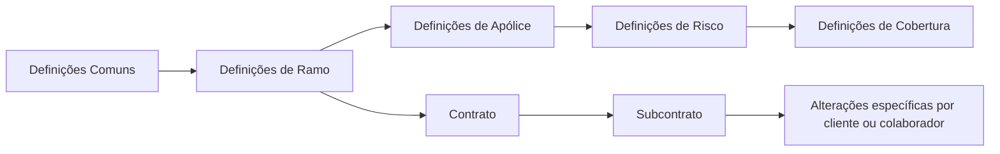

# Definição de Ramo de Automóvel no Reef.core — Estrutura de Configuração de Emissão, Riscos e Coberturas

## 1. Metadados do Documento
- **Arquivo de Origem:** Não identificado no conteúdo extraído; referência apresentada como “DOCUMENTACIÓN Reef” / “Mapfredocument”.
- **Tipo de Documento:** Arquitetura de Software / Guia de Definições Funcionais.
- **Domínio / Sistema:** Reef.core; emissão de seguros; ramo de automóvel; integração PLATEA.
- **Público-Alvo:** Desenvolvedores, Arquitetos, Operação e Negócio de seguros.
- **Data/Versão Identificada:** Não identificada.
- **Owner identificado no conteúdo:** `user:agonzalez_mapfre.com`
- **Lifecycle identificado no conteúdo:** Approved Source.

---

## 2. Resumo Executivo & Contexto de Negócio

O documento descreve a organização conceitual das definições necessárias para configurar um ramo de seguro de automóvel no Reef.core. A estrutura apresentada organiza elementos comuns à companhia, elementos específicos do ramo, definições aplicáveis à apólice, risco, cobertura e catálogos exclusivos do negócio de automóvel.

O propósito central é estabelecer a ordem e os domínios de configuração que sustentam a emissão de apólices de automóvel. Entre os elementos comuns estão companhia, moeda, estrutura comercial, estrutura de produto, canal, agente, comissão, conceitos econômicos, documentos de entrada e saída, controles técnicos e definições de integração com PLATEA.

No nível de ramo, o documento apresenta mecanismos para definir características gerais das apólices, numeração, suplementos, contratos, subcontratos, apólices de grupo, apólices de cliente, dias de graça, anulação por falta de pagamento, cotização rápida, contextos de atributos não exibidos e marcas associadas a eventos com gravidade.

A definição de uma apólice inclui duração, datas de efeito, moeda, importes mínimos, cosseguro, escalas de prêmio, intervenientes, cláusulas, textos anexos e planos de pagamento. Os riscos de automóvel incluem definições gerais de veículo, catálogos de marcas, modelos, submodelos, valores, acessórios e modalidades permitidas.

O documento também posiciona as coberturas como obrigações principais do contrato de seguro. Para cada cobertura podem ser configurados atributos, ocorrências, limites, intervalos, franquias, tarifas multivariáveis, cláusulas, comissões e alterações contratuais. O conteúdo é predominantemente um mapa funcional de configuração; não detalha APIs, métodos HTTP, contratos JSON, versões de plataforma, tabelas físicas ou fluxos técnicos de integração.

---

## 3. Arquitetura, Componentes & Tecnologias Envolvidas

### Sistemas, domínios e componentes identificados

| Componente / Domínio | Papel descrito no documento |
| :--- | :--- |
| **Reef.core** | Sistema que realiza operações da companhia e disponibiliza características e atributos usados na definição de apólices, riscos e coberturas. |
| **Emissão** | Módulo no qual se concentram definições de ramo, apólice, risco e cobertura. |
| **Ramo de automóvel** | Tipo de negócio com definições exclusivas de veículos, matrículas, marcas, modelos, acessórios e modalidades. |
| **PLATEA** | Aplicação ou ativo com o qual existem definições necessárias de integração. O documento não descreve interfaces, protocolos ou contratos dessa integração. |
| **Mapfredocument** | Referência documental exibida no conteúdo extraído. Não há descrição funcional adicional. |
| **Companhia** | Entidade ou entidades para as quais são criadas apólices e demais elementos. |
| **Contrato** | Condições que alteram a definição de ramo para um ou mais clientes. |
| **Subcontrato** | Condições que alteram condições de contrato e, consequentemente, a definição de ramo. |
| **Apólice** | Entidade de seguro configurada com duração, moeda, pagamento, intervenientes, cláusulas e demais condições. |
| **Risco** | Nível de definição aplicável aos riscos possíveis da apólice. |
| **Cobertura** | Obrigação principal em um contrato de seguro, com comportamento na emissão e no processo de prestações. |

### Hierarquia funcional de configuração

```mermaid
graph TD
    A[Definição de Ramo de Automóvel] --> B[Comum]
    A --> C[Ramo]
    A --> D[Apólice]
    A --> E[Risco]
    A --> F[Cobertura]

    B --> B1[Companhia]
    B --> B2[Moeda]
    B --> B3[Estrutura Comercial]
    B --> B4[Estrutura Produto]
    B --> B5[Canal]
    B --> B6[Quadro Comissão]
    B --> B7[Agente]
    B --> B8[Conceito Econômico]
    B --> B9[Documentos de Entrada/Saída]
    B --> B10[Controle Técnico]
    B --> B11[PLATEA]

    C --> C1[Numeração]
    C --> C2[Suplemento]
    C --> C3[Contrato]
    C --> C4[Subcontrato]
    C --> C5[Apólice Grupo]
    C --> C6[Apólice Cliente]
    C --> C7[Dias de Graça]
    C --> C8[Anulação por Falta de Pagamento]
    C --> C9[Cotização Rápida]
    C --> C10[Contexto]
    C --> C11[Marca]

    D --> D1[Duração]
    D --> D2[Dias de Adiantamento/Atraso]
    D --> D3[Moeda]
    D --> D4[Importe Mínimo]
    D --> D5[Quadro Cosseguro]
    D --> D6[Escala]
    D --> D7[Intervenção]
    D --> D8[Cláusula]
    D --> D9[Plano de Pagamento]
    D --> D10[Controle Técnico]
    D --> D11[Atributo e Ocorrência]

    E --> E1[Automóvel]
    E --> E2[Intervenção]
    E --> E3[Atributo e Ocorrência]
    E --> E4[Ramo Contábil Múltiplo]
    E --> E5[Modalidade]
    E --> E6[Cláusula]
    E --> E7[Comissão]
    E --> E8[Inspeção]

    E1 --> E11[Risco Automóvel - Geral]
    E1 --> E12[Risco Automóvel - Catálogo]
    E1 --> E13[Risco Automóvel - Acessório]

    F --> F1[Contrato e Subcontrato]
    F --> F2[Controle Técnico]
    F --> F3[Atributo e Ocorrência]
    F --> F4[Limite]
    F --> F5[Intervalo]
    F --> F6[Franquia]
    F --> F7[Tarifa Multivariável]
    F --> F8[Cláusula]
    F --> F9[Comissão]
```



### Fluxo conceitual de definição



> **Nota de Análise:** O documento apresenta uma taxonomia de configuração. Não especifica execução transacional, endpoints, persistência de dados, mensageria, autenticação, versões de tecnologia ou contratos de integração entre Reef.core e PLATEA.

---

## 4. Regras de Negócio, Especificações Funcionais & Processos

### 4.1 Definições comuns

1. A **companhia** define a entidade ou as entidades para as quais serão criadas apólices e os demais elementos relacionados.
2. A **moeda** define as divisas com as quais o Reef.core realiza as diferentes operações da companhia.
3. A **estrutura comercial** determina como será estabelecida a organização territorial da companhia.
4. A **estrutura de produto** determina como serão organizados os ramos comercializados.
5. O **canal** define as vias pelas quais a nova produção chegará à companhia.
6. O **quadro de comissão** define agrupadores que determinam as comissões a pagar aos agentes.
7. O **agente** representa terceiros que atuam como intermediários entre cliente e companhia.
8. O **conceito econômico** define os conceitos que compõem a informação econômica do recibo.
9. Os **documentos de entrada/saída** determinam:
   - Documentos que devem ser gerados quando uma operação é realizada.
   - Documentos que devem ser solicitados para permitir uma operação.
10. O **controle técnico** define parâmetros necessários para validações que permitem ou impedem a finalização de uma operação.
11. As definições de **PLATEA** são necessárias para integração com essa aplicação.

### 4.2 Definições de ramo

1. A **numeração** determina os elementos que formarão o número de apólice e o número de orçamento, bem como sua ordem.
2. O **ramo** fixa características gerais das apólices, incluindo dias por ano, coletivos, cláusulas e tipo de apólice temporal.
3. O **suplemento** define os tipos de modificações que podem ser aplicadas a apólices, tais como anulação, reabilitação e renovação.
4. O **contrato** altera a definição de um ramo para um ou mais clientes e permite determinar valores concretos ou grupos de valores permitidos.
5. O **subcontrato** altera as condições de um contrato e, por consequência, a definição de ramo. O documento usa como exemplo condições distintas aplicáveis a um grupo empresarial.
6. A **apólice de grupo** é um conjunto de apólices independentes — individuais, coletivas ou multirriscos — sujeito a alguma exceção de contrato e/ou subcontrato sobre a definição padrão do ramo.
7. A **apólice de cliente** é uma chave adicional associável à apólice, capaz de unir várias apólices de um cliente ou colaborador.
8. Os **dias de graça** são dias adicionados ao efeito de um recibo para determinar quando uma apólice deve seguir ao processo de anulação por falta de pagamento.
9. Os **dias de graça de contrato** e os **dias de graça de subcontrato** alteram a definição específica para cliente ou colaborador.
10. A **anulação por falta de pagamento** define parâmetros usados para determinar quais apólices devem ser anuladas devido à falta de pagamento.
11. A **cotização rápida** retorna o preço de várias simulações com o mínimo de informação exigida do cliente. A configuração deve determinar:
    - Quais simulações fornecerão preço.
    - Qual informação será solicitada.
    - Qual informação não será solicitada.
    - Qual valor será usado para precificar informações não solicitadas.
12. O **contexto** permite criar ambientes nos quais determinados atributos não são exibidos.
13. A **marca** fixa eventos com nível de gravidade que podem desencadear ações sobre apólices:
    - Reativas, quando a apólice já está em carteira.
    - Proativas, quando a apólice ainda não foi criada.

### 4.3 Definições de apólice

1. A duração mínima e máxima fixa o número máximo e/ou mínimo de meses de vigência permitido para uma apólice.
2. Os dias de adiantamento/atraso determinam quantos dias anteriores ou posteriores à data atual podem ser usados para definir o efeito na criação ou modificação de uma apólice.
3. A moeda de apólice determina moedas possíveis de emissão e afeta capitais, prêmios, comissões e recibos.
4. O importe mínimo estabelece os valores mínimos para gerar um recibo.
5. O quadro de cosseguro estabelece previamente as companhias que participarão do risco com conhecimento do cliente. Essa definição é reutilizada posteriormente na emissão da apólice.
6. A escala define a parcela de prêmio quando a apólice não é anual e não se deseja cálculo proporcional ao tempo.
7. A intervenção define figuras que podem participar da contratação, relativas a clientes, como tomador, segurado e condutor.
8. A cláusula estabelece estipulações contratuais que podem precisar, ampliar, derrogar ou modificar o conteúdo do seguro.
9. O texto anexo permite definir se estipulações contratuais podem ser incluídas manualmente em uma apólice.
10. O plano de pagamento define como o pagamento do seguro será fracionado.
11. O plano de pagamento por cliente permite estabelecer planos para um cliente e aplicá-los ainda que o ramo não disponha deles.
12. A revalorização/depreciação fixa como o valor de um risco será incrementado ou decrementado.
13. O controle técnico define as condições nas quais a contratação pode ser paralisada ou submetida à decisão de uma ou mais pessoas sobre a aceitação do risco pela seguradora.
14. Um atributo representa uma característica necessária disponível no Reef.core, por exemplo, um local para registrar desconto que afeta a apólice.
15. Uma ocorrência possui o mesmo conceito de atributo, mas permite que a solicitação do conjunto de atributos ocorra “n” vezes.

### 4.4 Definições de risco

1. O nível de risco reúne definições aplicáveis a cada possível risco da apólice.
2. O risco de automóvel contém definições exclusivas para ramos desse tipo de negócio, como matrículas, marcas e modelos.
3. O risco pode ter intervenções, atributos, atributos de contrato, atributos de subcontrato, controle técnico de atributo e ocorrências.
4. O ramo contábil múltiplo permite definir ramos contábeis pelo conteúdo de algum atributo.
5. A modalidade é um agrupamento de coberturas que, juntas, formam um pacote comercializável.
6. A comissão estabelece remuneração pela intermediação da contratação de seguro, com diferentes tipos conforme a atuação do agente e possíveis exceções.
7. A inspeção define quando e como serão realizadas inspeções dos riscos contratados, podendo ocorrer antes da contratação ou durante o processo de contratação.

### 4.5 Regras específicas de risco de automóvel

1. O tipo de veículo define os tipos de veículos seguráveis.
2. O uso de veículo define usos permitidos de veículos.
3. O tipo de veículo por uso define o tipo de veículo de acordo com o uso.
4. O formato de matrícula define o formato obrigatório das matrículas dos veículos.
5. A modalidade por ramo define modalidades permitidas.
6. A modalidade por tipo e uso de veículo define modalidades permitidas conforme tipo e uso do veículo.
7. Os catálogos de automóvel incluem tipo de tração, tipo de fabricação, categoria, carroceria, cor, marca, modelo, submodelo e valor do veículo.
8. O valor de veículo é registrado por ano e varia conforme marca, modelo e submodelo.
9. Os acessórios são organizados por agrupamento, tipo, acessório permitido e relação entre acessório e tipo de veículo.

### 4.6 Definições de cobertura

1. A cobertura é a obrigação principal de um contrato de seguro.
2. Os tipos de cobertura determinam comportamento no processo de emissão e no processo de prestações.
3. A cobertura pode receber condições de contrato e subcontrato.
4. A cobertura pode possuir controle técnico, atributos, atributos de contrato, atributos de subcontrato e ocorrências.
5. O limite define:
   - Importe máximo contratado para o período de vigência do seguro.
   - E/ou importe máximo aplicável a cada prestação durante o período de vigência.
   - Os importes são pré-fixados.
6. O intervalo estabelece somas seguradas entre limite inferior e superior.
7. A franquia estabelece quantidades pelas quais o segurado responde. A redução de prêmio pode estar definida na própria franquia ou dedutível.
8. O conceito de desagregação define o detalhe necessário para segregação da informação econômica de uma cobertura.
9. A tarifa multivariável é o meio pelo qual se determina o cálculo; sua definição é centrada no conceito de fator utilizado para realizar um cálculo.
10. Cláusulas e comissões também podem ser configuradas no nível de cobertura.
11. Alterações específicas para cliente ou colaborador são indicadas por definições de contrato e, quando indicado, de subcontrato.

---

## 5. Tabelas de Parâmetros, Ambientes e Estruturas de Dados

### 5.1 Definições comuns

| Item / Parâmetro | Descrição / Função | Tipo / Valores / Formato | Ambiente / Observações |
| :--- | :--- | :--- | :--- |
| Companhia | Define entidade ou entidades para criação de apólices e demais elementos. | Entidade organizacional | Comum |
| Moeda | Define divisas usadas pelo Reef.core nas operações da companhia. | Divisa | Comum |
| Estrutura Comercial | Define a organização territorial da companhia. | Estrutura organizacional | Comum |
| Estrutura Produto | Define a organização dos ramos comercializados. | Estrutura de produto | Comum |
| Canal | Define vias de entrada da nova produção. | Canal de distribuição | Comum |
| Quadro Comissão | Define agrupadores que determinam comissões a pagar a agentes. | Agrupador de comissão | Comum |
| Agente | Define terceiros intermediários entre cliente e companhia. | Intermediário | Comum |
| Conceito Econômico | Define conceitos da informação econômica do recibo. | Conceito econômico | Comum |
| Documentos de Entrada/Saída | Define documentos gerados e documentos necessários para operações. | Documento | Comum |
| Controle Técnico | Define parâmetros de validação que permitem ou impedem finalizar uma operação. | Regra de validação | Comum |
| PLATEA | Define elementos necessários para integração com PLATEA. | Integração | Comum; sem detalhamento técnico adicional |

### 5.2 Definições de ramo

| Item / Parâmetro | Descrição / Função | Tipo / Valores / Formato | Ambiente / Observações |
| :--- | :--- | :--- | :--- |
| Numeração | Determina elementos e ordem do número de apólice e do número de orçamento. | Regra de composição | Ramo |
| Ramo | Fixa características gerais das apólices, incluindo dias por ano, coletivos, cláusulas e apólice temporal. | Configuração de ramo | Ramo |
| Suplemento | Define modificações possíveis em apólices. | Anulação, reabilitação, renovação, entre outros | Ramo |
| Contrato | Altera definição de ramo para um ou mais clientes. | Valores concretos ou grupos de valores permitidos | Ramo |
| Subcontrato | Altera condições de contrato e definição de ramo. | Valores ou grupos de valores possíveis | Ramo |
| Apólice Grupo | Conjunto de apólices independentes sujeito a exceção de contrato e/ou subcontrato. | Individual, coletiva ou multirriscos | Ramo |
| Apólice Cliente | Chave adicional que pode unir apólices de cliente ou colaborador. | Chave adicional | Ramo |
| Dias de Graça | Dias adicionados ao efeito de recibo para avaliar anulação por falta de pagamento. | Número de dias | Ramo |
| Dias de Graça Contrato | Alteração específica de dias de graça. | Número de dias | Cliente ou colaborador |
| Dias de Graça Subcontrato | Alteração específica de dias de graça. | Número de dias | Cliente ou colaborador |
| Anulação Falta Pago | Define parâmetros para identificar apólices sujeitas a anulação por falta de pagamento. | Parâmetros de processo | Ramo |
| Cotização Rápida | Precifica várias simulações com mínimo de informação requerida. | Simulações, informação solicitada, valores padrão | Ramo |
| Contexto | Permite criar ambientes para não exibir atributos. | Ambiente / visibilidade de atributo | Ramo |
| PLATEA | Definições relacionadas à integração com o ativo PLATEA. | Integração | Ramo |
| Marca | Define eventos com gravidade que podem desencadear ações sobre apólices. | Reativa ou proativa | Ramo |

### 5.3 Definições de apólice

| Item / Parâmetro | Descrição / Função | Tipo / Valores / Formato | Ambiente / Observações |
| :--- | :--- | :--- | :--- |
| Meses Duração Mínimo/Máximo | Fixa meses mínimos e/ou máximos de vigência da apólice. | Número de meses | Apólice |
| Meses Duração Mínimo/Máximo Contrato | Altera a duração para cliente ou colaborador. | Número de meses | Contrato |
| Dias de Adiantamento/Atraso | Define dias anteriores ou posteriores à data atual para efeito de criação ou modificação. | Número de dias | Apólice |
| Dias de Adiantamento/Atraso Contrato | Altera dias de efeito para cliente ou colaborador. | Número de dias | Contrato |
| Moeda | Define moedas possíveis de emissão. | Divisa | Afeta capitais, prêmios, comissões e recibos |
| Importe Mínimo | Define importes mínimos para geração de recibo. | Importe | Apólice |
| Quadro Cosseguro | Define previamente companhias participantes no risco. | Companhias participantes | Uso posterior na emissão |
| Escala | Define parcela de prêmio para apólice não anual sem cálculo proporcional ao tempo. | Regra de cálculo | Apólice |
| Intervenção | Define figuras participantes da contratação. | Tomador, segurado, condutor, entre outros | Apólice |
| Intervenção Contrato | Altera definição de intervenção para cliente ou colaborador. | Configuração | Contrato |
| Cláusula | Define estipulações contratuais. | Estipulações | Apólice |
| Texto Anexo | Define possibilidade de inclusão manual de estipulações contratuais. | Configuração de inclusão manual | Apólice |
| Plano de Pagamento | Define fracionamento do pagamento do seguro. | Plano de pagamento | Apólice |
| Plano de Pagamento Contrato | Altera plano de pagamento para cliente ou colaborador. | Plano de pagamento | Contrato |
| Plano de Pagamento Cliente | Estabelece plano por cliente mesmo que o ramo não o possua. | Plano de pagamento | Cliente |
| Revalorização/Depreciação | Define como incrementar ou reduzir valor de risco. | Regra de valor | Apólice |
| Controle Técnico | Define quando paralisar contratação ou submeter aceitabilidade à decisão de pessoas. | Regra de aceitação | Apólice |
| Atributo | Característica necessária disponível no Reef.core. | Atributo | Pode registrar desconto que afeta apólice |
| Atributo Contrato | Altera atributo para cliente ou colaborador. | Atributo | Contrato |
| Atributo Subcontrato | Altera atributo para cliente ou colaborador. | Atributo | Subcontrato |
| Controle Técnico Atributo | Define condições para paralisação ou decisão de aceitabilidade. | Regra de aceitação | Apólice |
| Ocorrência | Conjunto de atributos cuja solicitação ocorre “n” vezes. | Repetição de atributos | Apólice |

### 5.4 Definições de risco e risco de automóvel

| Item / Parâmetro | Descrição / Função | Tipo / Valores / Formato | Ambiente / Observações |
| :--- | :--- | :--- | :--- |
| Automóvel | Definições exclusivas do ramo de automóvel. | Matrículas, marcas, modelos, entre outros | Risco |
| Automóvel Contrato | Alteração de definições de automóvel para cliente ou colaborador. | Configuração | Contrato |
| Intervenção | Define figuras participantes da contratação. | Tomador, segurado, condutor, entre outros | Risco |
| Intervenção Contrato | Altera intervenção para cliente ou colaborador. | Configuração | Contrato |
| Atributo | Característica necessária disponível no Reef.core. | Atributo | Pode afetar o risco |
| Atributo Contrato | Altera atributo para cliente ou colaborador. | Atributo | Contrato |
| Atributo Subcontrato | Altera atributo para cliente ou colaborador. | Atributo | Subcontrato |
| Controle Técnico Atributo | Define condições de paralisação ou aceitabilidade. | Regra de aceitação | Risco |
| Ocorrência | Conjunto repetível de atributos. | Solicitação “n” vezes | Risco |
| Ramo Contábil Múltiplo | Permite definir ramos contábeis pelo conteúdo de atributo. | Regra baseada em atributo | Risco |
| Modalidade | Agrupa coberturas em pacote comercializável. | Agrupamento de coberturas | Risco |
| Cláusula | Define estipulações contratuais. | Estipulações | Risco |
| Comissão | Define remuneração por intermediação de seguro. | Tipos de comissão e exceções | Risco |
| Comissão Contrato | Altera comissão para cliente ou colaborador. | Configuração | Contrato |
| Inspeção | Define quando e como inspecionar riscos. | Pré-contratação ou durante contratação | Risco |
| Tipo de Veículo | Define veículos que podem ser segurados. | Tipo de veículo | Risco Automóvel — Geral |
| Uso de Veículo | Define usos de veículos permitidos. | Uso de veículo | Risco Automóvel — Geral |
| Tipo de Veículo por Uso | Define tipo de veículo segundo seu uso. | Relação tipo/uso | Risco Automóvel — Geral |
| Formato de Matrícula | Define formato obrigatório da matrícula. | Formato | Risco Automóvel — Geral |
| Modalidade por Ramo | Define modalidades permitidas. | Modalidade | Risco Automóvel — Geral |
| Modalidade por Tipo e Uso de Veículo | Define modalidades conforme tipo e uso. | Relação modalidade/tipo/uso | Risco Automóvel — Geral |
| Tipo de Tração | Define tipos de tração de veículo. | Catálogo | Risco Automóvel — Catálogo |
| Tipo de Fabricação | Define tipos de fabricação de veículo. | Catálogo | Risco Automóvel — Catálogo |
| Categoria | Define categorias de veículo. | Catálogo | Risco Automóvel — Catálogo |
| Carroceria | Define tipos de carroceria. | Catálogo | Risco Automóvel — Catálogo |
| Cor | Identifica cores possíveis de veículo. | Catálogo | Risco Automóvel — Catálogo |
| Marcas de Veículo | Registra marcas de veículos. | Catálogo | Risco Automóvel — Catálogo |
| Modelos de Veículo | Registra modelos por marca identificada. | Catálogo | Risco Automóvel — Catálogo |
| Submodelos de Veículo | Registra submodelos por marca e modelo. | Catálogo | Risco Automóvel — Catálogo |
| Valor de Veículo | Registra valor anual conforme marca, modelo e submodelo. | Valor por ano | Risco Automóvel — Catálogo |
| Agrupamento de Acessório | Define agrupamentos de acessórios. | Agrupamento | Risco Automóvel — Acessório |
| Tipo de Acessório | Define tipologia de classificação de acessórios. | Tipologia | Risco Automóvel — Acessório |
| Acessório | Define acessórios permitidos por tipo e agrupamento. | Catálogo | Risco Automóvel — Acessório |
| Acessório por Tipo de Veículo | Identifica acessórios permitidos por tipo de veículo. | Relação acessório/tipo de veículo | Risco Automóvel — Acessório |

### 5.5 Definições de cobertura

| Item / Parâmetro | Descrição / Função | Tipo / Valores / Formato | Ambiente / Observações |
| :--- | :--- | :--- | :--- |
| Cobertura | Obrigação principal de contrato de seguro. | Tipos de cobertura | Afeta emissão e prestações |
| Contrato | Altera definição de ramo para clientes. | Valores ou grupos de valores | Cobertura |
| Subcontrato | Altera condições de contrato e definição de ramo. | Valores ou grupos de valores | Cobertura |
| Controle Técnico | Define condições para paralisação ou decisão de aceitabilidade. | Regra de aceitação | Cobertura |
| Atributo | Característica necessária disponível no Reef.core. | Atributo | Pode afetar cobertura |
| Atributo Contrato | Altera atributo para cliente ou colaborador. | Atributo | Contrato |
| Atributo Subcontrato | Altera atributo para cliente ou colaborador. | Atributo | Subcontrato |
| Ocorrência | Conjunto de atributos solicitado repetidamente. | Solicitação “n” vezes | Cobertura |
| Limite | Define importe máximo por vigência e/ou por prestação. | Importes pré-fixados | Cobertura |
| Limite Contrato | Altera limite para cliente ou colaborador. | Configuração | Contrato |
| Intervalo | Define somas seguradas entre limite inferior e superior. | Limite inferior e limite superior | Cobertura |
| Intervalo Contrato | Altera intervalo para cliente ou colaborador. | Configuração | Contrato |
| Intervalo Subcontrato | Altera intervalo para cliente ou colaborador. | Configuração | Subcontrato |
| Franquia | Define quantidades pelas quais o segurado responde. | Franquia ou dedutível | Pode conter redução de prêmio |
| Franquia Contrato | Altera franquia para cliente ou colaborador. | Configuração | Contrato |
| Conceito Desglose | Define detalhe de segregação da informação econômica da cobertura. | Estrutura de detalhe econômico | Cobertura |
| Tarifa Multivariable | Meio de determinação de cálculo centrado no fator. | Fator de cálculo | Cobertura |
| Tarifa Multivariable Contrato | Altera tarifa para cliente ou colaborador. | Configuração | Contrato |
| Tarifa Multivariable Subcontrato | Altera tarifa para cliente ou colaborador. | Configuração | Subcontrato |
| Cláusula | Define estipulações contratuais. | Estipulações | Cobertura |
| Comissão | Define remuneração por intermediação. | Tipos e exceções | Cobertura |
| Comissão Contrato | Altera comissão para cliente ou colaborador. | Configuração | Contrato |

---

## 6. Bateria de Perguntas & Respostas para RAG (FAQ Sintético)

### P1: Qual é a finalidade da definição de ramo de automóvel no Reef.core?
**R:** A definição de ramo de automóvel organiza os elementos de configuração necessários para emissão e gestão de apólices de automóvel no Reef.core. O conteúdo cobre definições comuns à companhia, configurações de ramo, apólice, risco, catálogos de veículos, acessórios e coberturas.

### P2: O que é configurado no nível comum antes da definição de um ramo?
**R:** No nível comum são definidas companhia, moeda, estrutura comercial, estrutura de produto, canal, quadro de comissão, agente, conceito econômico, documentos de entrada e saída, controle técnico e definições necessárias para integração com PLATEA.

### P3: Como contrato e subcontrato diferem na definição de ramo?
**R:** O contrato estabelece condições que alteram a definição de ramo para um ou mais clientes, podendo determinar valores concretos ou grupos de valores permitidos. O subcontrato altera as condições de um contrato e, consequentemente, altera também a definição do ramo; o documento cita como exemplo condições aplicáveis a um grupo empresarial.

### P4: Como funciona a cotização rápida no contexto do ramo?
**R:** A cotização rápida retorna o preço de várias simulações com um mínimo de informação requerida do cliente. Sua configuração determina quais simulações geram preço, quais informações são solicitadas, quais não são solicitadas e quais valores serão considerados para dados não solicitados.

### P5: Para que servem os dias de graça?
**R:** Dias de graça são dias adicionados ao efeito de um recibo para determinar quando uma apólice deve seguir ao processo de anulação por falta de pagamento. Existem também definições específicas de dias de graça para contrato e subcontrato.

### P6: Quais informações de uma apólice são afetadas pela definição de moeda?
**R:** A moeda da apólice determina as possíveis moedas de emissão e afeta capitais, prêmios, comissões e recibos.

### P7: O que é uma ocorrência em Reef.core?
**R:** Ocorrência é o mesmo conceito de atributo, porém sua solicitação ocorre “n” vezes. Trata-se de um conjunto de atributos que pode ser repetidamente solicitado. O documento exemplifica o armazenamento de matérias cujo transporte possui limitação de quantidade.

### P8: Quais catálogos estão previstos para o risco de automóvel?
**R:** O risco de automóvel possui catálogos de tipo de tração, tipo de fabricação, categoria, carroceria, cor, marcas de veículo, modelos de veículo, submodelos de veículo e valor de veículo. O valor é registrado por ano conforme marca, modelo e submodelo.

### P9: Como são tratadas modalidades no ramo de automóvel?
**R:** A modalidade é um agrupamento de coberturas que forma um pacote comercializável. O documento também prevê modalidade por ramo e modalidade por tipo e uso de veículo, permitindo restringir modalidades conforme características do veículo.

### P10: Qual é a finalidade de um limite em uma cobertura?
**R:** Um limite define o importe máximo contratado para o período de vigência do seguro e/ou o importe máximo aplicável para cada prestação realizada durante esse período. Os importes dos limites são pré-fixados.

### P11: O que a franquia representa em uma cobertura?
**R:** A franquia estabelece as quantidades pelas quais o segurado responde. O documento indica que a redução de prêmio aplicável pode estar definida na própria franquia ou dedutível.

### P12: Como o controle técnico atua na contratação?
**R:** O controle técnico define condições nas quais a contratação pode ser paralisada ou condições em que uma ou várias pessoas devem determinar se o seguro é assumível pela seguradora. O conceito aparece no nível comum, de apólice, risco e cobertura.

### P13: O documento detalha como ocorre a integração técnica com PLATEA?
**R:** Não. O documento informa que há definições necessárias ou relacionadas à integração com PLATEA, mas não descreve APIs, métodos HTTP, URLs, autenticação, protocolos, formatos de mensagem ou contratos de dados.

### P14: O que é uma apólice de grupo?
**R:** Uma apólice de grupo é um conjunto de apólices independentes, que podem ser individuais, coletivas ou multirriscos. O conjunto está sempre sujeito a algum tipo de exceção de contrato e/ou subcontrato em relação à definição padrão do ramo.

---

## 7. Glossário de Termos, Siglas & Conceitos-Chave

- **Reef.core:** Sistema citado como responsável por realizar operações da companhia e disponibilizar atributos usados nas definições de seguro.
- **PLATEA:** Aplicação ou ativo mencionado como destino de integração; o conteúdo não detalha sua interface técnica.
- **Ramo:** Definição de características gerais aplicáveis às apólices de uma linha de negócio de seguros.
- **Apólice:** Contrato de seguro configurado com vigência, moeda, pagamento, intervenientes, cláusulas e demais condições.
- **Risco:** Elemento segurável da apólice; no contexto apresentado, pode ser um veículo.
- **Cobertura:** Obrigação principal em um contrato de seguro, com comportamento na emissão e no processo de prestações.
- **Contrato:** Condição que altera a definição de um ramo para um ou mais clientes.
- **Subcontrato:** Condição que altera as condições de contrato e, consequentemente, a definição do ramo.
- **Suplemento:** Tipo de modificação que pode ocorrer em uma apólice, como anulação, reabilitação ou renovação.
- **Cotização Rápida:** Processo que retorna preço de várias simulações com a quantidade mínima de informação solicitada ao cliente.
- **Dias de Graça:** Dias adicionados ao efeito de um recibo para determinar a passagem ao processo de anulação por falta de pagamento.
- **Controle Técnico:** Configuração de validação e aceitabilidade capaz de permitir, impedir ou paralisar uma operação ou contratação.
- **Atributo:** Característica necessária disponível no Reef.core que pode afetar apólice, risco ou cobertura.
- **Ocorrência:** Conjunto de atributos cuja solicitação pode ocorrer repetidas vezes.
- **Cosseguro:** Participação pré-definida de companhias em um risco com conhecimento do cliente.
- **Escala:** Definição de parcela de prêmio aplicável quando a apólice não é anual e não se deseja cálculo proporcional ao tempo.
- **Intervenção:** Figura participante da contratação, como tomador, segurado ou condutor.
- **Modalidade:** Agrupamento de coberturas que compõe um pacote comercializável.
- **Franquia:** Quantidade pela qual o segurado responde; pode estar associada a redução de prêmio.
- **Dedutível:** Termo citado como alternativa relacionada à franquia; não há detalhamento adicional.
- **Tarifa Multivariável:** Meio de determinação de cálculo centrado no conceito de fator.
- **Conceito Desglose:** Detalhe necessário para segregação da informação econômica de uma cobertura.
- **Marca:** Evento com nível de gravidade capaz de desencadear ação reativa ou proativa sobre apólices.

---

## 8. Notas Críticas, Riscos & Limitações

- O documento não informa versões do Reef.core, PLATEA, Mapfredocument ou de tecnologias utilizadas.
- Não há detalhamento de APIs, endpoints, métodos HTTP, protocolos, autenticação, autorização, contratos JSON, mensageria ou modelo físico de dados.
- Não foram identificados valores concretos para parâmetros como dias de graça, importes mínimos, duração mínima/máxima, limites, intervalos, franquias ou fatores tarifários.
- As referências a contrato e subcontrato descrevem seu efeito funcional, mas não apresentam critérios de precedência entre configuração padrão, contrato e subcontrato.
- A integração com PLATEA é mencionada, porém não possui detalhamento funcional ou técnico adicional.
- O texto extraído contém caracteres de substituição em palavras como “definición” e “finalizar”, provavelmente decorrentes do processo de extração. O conteúdo bruto foi preservado para auditoria.
- **Nota de Análise:** O documento lista o módulo de emissão, Reef.core e PLATEA, porém não detalha métodos HTTP, eventos, interfaces de usuário, integrações de dados ou contratos expostos.
- **Nota de Análise:** O documento descreve conceitos de tarifa multivariável e fator, mas não fornece fórmulas, algoritmos, ordem de cálculo ou exemplos numéricos.

---

## 9. Conteúdo Bruto Estruturado (Referência Fiel)

```text
--- [PÁGINA 1 DE 7] ---

EN CONSTRUCCIÓN
DEFINICIÓN DE RAMO DE AUTOMÓVIL
 Elementos que intervienen en la denición y orden en el que se debe realizar.
COMÚN
En este nivel se encuentran deniciones que no son exclusivas del módulo de emisión, pero son necesarias
para poder realizar la denición. Entre otras deniciones se encuentra:
COMPAÑÍA 
Denición de la entidad o entidades con
las que se van a crear las pólizas y por
consiguiente el resto de elementos
MONEDA 
Denición de las divisas con las que
Reef.core va a realizar las distintas
operaciones de la compañía
ESTRUCTURA COMERCIAL 
Denición de como se va a establecer la
organización territorial de la compañía
ESTRUCTURA PRODUCTO 
Denición de como estarán organizados
los ramos que se comercializan
CANAL 
Denición de las distintas vías por las que
llegará la nueva producción a la compañía
CUADRO COMISIÓN 
Denición de los agrupadores que
determinan las comisiones que se van a
pagar a los agentes
AGENTE 
Denición de los terceros que ejercerán de
intermediarios entre el cliente y la
compañía
CONCEPTO ECONÓMICO 
Denición de los conceptos que formarán
parte de la información económica del
recibo
DOCUMENTOS DE ENTRADA/SALIDA 
Denición de los documentos que deben
salir cuando se realiza una operación y de
los documentos que son necesarios
solicitar cuando se realiza una operación
CONTROL TÉCNICO 
 PLATEA 
Denición necesaria para la integración
con esta aplicación
Documentation / DOCUMENTACIÓN Reef
DOCUMENTACIÓN Reef
Mapfredocument
DOCUMENTACIÓN Reef
Owner
user:agonzalez_mapfre.com
Lifecycle
Approved Source
 / 
 VL
Buscar Inicio Soluciones Arquitecturas APIs Componentes Cloud Documentación Zeus Reef Ayuda
ES


--- [PÁGINA 2 DE 7] ---

Denición de los parámetros necesarios
para realizar validaciones que permitan o
no nalizar la operación
RAMO
Son deniciones que siendo del módulo de emisión, no son exclusivas del ramo que se está deniendo. Por
ejemplo:
NUMERACIÓN 
Determinar que elementos formarán y en
que orden el número de póliza y el número
de presupuesto
RAMO 
Fija las características generales con las
que contarán las pólizas, como días por
año, colectivos, cláusulas, tipo de póliza
temporal, etc.
SUPLEMENTO 
Tipos de modicaciones que podrán sufrir
las pólizas (anulación, rehabilitación,
renovación, etc.)
CONTRATO
Condiciones que alteran la denición de
un ramo. Estas condiciones aplican
siempre a uno o varios clientes. También
se pueden determinar valores concretos o
varios valores permitidos
SUBCONTRATO
Condiciones que alteran las condiciones
de un contrato y, por consiguiente alteran
la denición de un ramo. Un ejemplo
puede ser las distintas condiciones que
rigen a un grupo empresarial. Al igual que
el contrato, se pueden determinar valores
o grupos de valores posibles
PÓLIZA GRUPO
Conjunto de pólizas independientes.
Estas, pueden ser individuales, colectivas
o multi-riesgo. Siempre el conjunto está
sujeto a algún tipo de excepción (contrato
y/o subcontrato) sobre la denición del
ramo estándar
PÓLIZA CLIENTE
Clave adicional que puede asociarse a una
póliza y que puede unir varias pólizas de
un cliente o colaborador
DÍAS DE GRACIA
Número de días que se adicionan al efecto
de un recibo para determinar que debe
pasar al proceso de anulación por falta de
pago
DÍAS DE GRACIA CONTRATO
Alteración de la denición especíca para
un cliente o colaborador
DÍAS DE GRACIA SUBCONTRATO
Alteración de la denición especíca para
un cliente o colaborador
ANULACIÓN FALTA PAGO
Parámetros que tendrá en cuenta este
proceso a la hora de determinar qué
pólizas deben anularse por falta de pago
COTIZACIÓN RÁPIDA
Proceso que devuelve el precio de varias
simulaciones con un mínimo de
información requerida al cliente. En este
punto se dene las simulaciones con las
que se dará precio, qué información se
solicitará y qué información no se solicita
al cliente y, para aquella información que
no será solicitada, determinar el valor con
el que se contará pra dar precio
CONTEXTO
Se pueden crear entornos en los que
determinar que información (atributos) no
mostrar
PLATEA
Deniciones relacionadas con la
integración con este activo
MARCA
Fijar eventos con un nivel de gravedad que
puede desencadenar acciones sobre
pólizas. Estas acciones pueden ser
reactivas (la póliza ya está en cartera) o
proactivas (la póliza aún no ha sido
creada)


--- [PÁGINA 3 DE 7] ---

DOCUMENTOS DE ENTRADA/SALIDA 
Determinar aquellos documentos que
deben acompañar a una operación (por
ejemplo, que documentos se generan
cuando se emite una nueva póliza) y
documentos que son necesarios disponer
para poder realizar una operación (por
ejemplo, para emitir una póliza de
automóvil es necesario disponer de la
licencia de conducir)
DOCUMENTOS DE ENTRADA/SALIDA
CONTRATO
Alteración de la denición especíca para
un cliente o colaborador
PÓLIZA
En este nivel se encuentran deniciones que afectarán a todos los posibles riesgos de la póliza. Entre otros
se dene:
MESES DURACIÓN MÍNIMO/MÁXIMO
Se ja el número máximo y/o mínimo de
meses de vigencia que una póliza puede
disponer
MESES DURACIÓN MÍNIMO/MÁXIMO
CONTRATO
Alteración de la denición especíca para
un cliente o colaborador
DÍAS DE ADELANTO/ATRASO
Con cuantos días previos o posteriores al
día de hoy se puede jar el efecto en la
creación o modicación de una póliza
DÍAS DE ADELANTO/ATRASO CONTRATO
Alteración de la denición especíca para
un cliente o colaborador
MONEDA 
Determina las posibles monedas en las
que se emitirán las pólizas. Afecta a
capitales, primas, comisiones y recibos
IMPORTE MÍNIMO
Se establecen los importes mínimos para
generar un recibo
CUADRO COASEGURO
Se establecen de forma previa aquellas
compañías que participarán en el riesgo
con el conocimiento del cliente. Esta
denición previa es para uso posterior en
las emisiones de póliza
ESCALA
Se establece cual será la porción de prima
cuando una póliza no es anual y no se
desea que el cálculo sea proporcional al
tiempo
INTERVENCIÓN
Denición de aquellas guras que podrán
intervenir en la contratación. Estas guras
se reeren a clientes y son del tipo
tomador, asegurado, conductor, etc.
INTERVENCIÓN CONTRATO
Alteración de la denición especíca para
un cliente o colaborador
CLÁUSULA
Establecer diferentes estipulaciones
contractuales que precisan, amplían,
derogan o modican el contenido del
seguro
TEXTO ANEXO
Fijar si es posible incluir de forma manual
en una póliza diferentes estipulaciones
contractuales que precisan, amplían,
derogan o modican el contenido del
seguro
PLAN DE PAGO 
Denir como se va a fraccionar el pago del
seguro
PLAN DE PAGO CONTRATO
Alteración de la denición especíca para
un cliente o colaborador
PLAN DE PAGO CLIENTE
Establecer planes de pago por cliente y
aplicarlos aunque el ramo no disponga de
él
REVALORIZACIÓN/DEPRECIACIÓN
 CONTRATO
 SUBCONTRATO


--- [PÁGINA 4 DE 7] ---

Fijar como se incrementa o decrementa el
valor de un riesgo
Condiciones que alteran la denición de
un ramo. Estas condiciones aplican
siempre a uno o varios clientes. También
se pueden determinar valores concretos o
varios valores permitidos
Condiciones que alteran las condiciones
de un contrato y, por consiguiente alteran
la denición de un ramo. Un ejemplo
puede ser las distintas condiciones que
rigen a un grupo empresarial. Al igual que
el contrato, se pueden determinar valores
o grupos de valores posibles
CONTROL TÉCNICO
Denición de en qué condiciones se puede
paralizar la contratación o hacer que una o
varias personas puedan determinar si el
seguro es asumible por la aseguradora
ATRIBUTO
Son características que sea necesario
disponer y de las que Reef.core dispone,
por ejemplo disponer de un lugar donde se
registre un descuento que afecta a la
póliza
ATRIBUTO CONTRATO
Alteración de la denición especíca para
un cliente o colaborador
ATRIBUTO SUBCONTRATO
Alteración de la denición especíca para
un cliente o colaborador
CONTROL TÉCNICO ATRIBUTO
Denición de en qué condiciones se puede
paralizar la contratación o hacer que una o
varias personas puedan determinar si el
seguro es asumible por la aseguradora
OCURRENCIA
Es el mismo concepto de atributo, pero la
solicitud de esos atributos se realiza "n"
veces. Es decir, es un conjunto de
atributos que su petición se realiza varias
veces. Por ejemplo si fuera almacenar en
la póliza una serie de materias que su
transporte está limitado en cantidad
RIESGO
Deniciones que afectan a cada uno de los posibles riesgos de la póliza. Por ejemplo:
AUTOMÓVIL 
Son deniciones exclusivas para ramos
del tipo de negocio automóvil. Como por
ejemplo, la denición de matrículas,
marcas, modelos, etc.
AUTOMÓVIL CONTRATO
Alteración de la denición especíca para
un cliente o colaborador
INTERVENCIÓN
Denición de aquellas guras que podrán
intervenir en la contratación. Estas guras
se reeren a clientes y son del tipo
tomador, asegurado, conductor, etc.
INTERVENCIÓN CONTRATO
Alteración de la denición especíca para
un cliente o colaborador
ATRIBUTO
Son características que sea necesario
disponer y de las que Reef.core dispone,
por ejemplo disponer de un lugar donde se
registre un descuento que afecta al riesgo
ATRIBUTO CONTRATO
Alteración de la denición especíca para
un cliente o colaborador
ATRIBUTO SUBCONTRATO
Alteración de la denición especíca para
un cliente o colaborador
CONTROL TÉCNICO ATRIBUTO
Denición de en qué condiciones se puede
paralizar la contratación o hacer que una o
varias personas puedan determinar si el
seguro es asumible por la aseguradora
OCURRENCIA
Es el mismo concepto de atributo, pero la
solicitud de esos atributos se realiza "n"
veces. Es decir, es un conjunto de
atributos que su petición se realiza varias
veces. Por ejemplo si fuera almacenar en
la póliza una serie de materias que su
transporte está limitado en cantidad
RAMO CONTABLE MULTIPLE
 MODALIDAD
 CLÁUSULA


--- [PÁGINA 5 DE 7] ---

Posibilidad de denir ramos contables po
el contenido de algún atributo
Agrupación de coberturas que juntas se
convierten en un paquete a comercializar
Establecer diferentes estipulaciones
contractuales que precisan, amplían,
derogan o modican el contenido del
seguro
COMISIÓN
Establecer la remuneración por
intermediar en la contratación de un
seguro. Existen distintos tipos de
comisiones dependiendo de como
interviene el agente, así como
excepciones
COMISIÓN CONTRATO
Alteración de la denición especíca para
un cliente o colaborador
INSPECCIÓN
Denición de cuando y como realizar
inspecciones a los riesgos contratados.
las inspecciones pueden ser previas a la
contratación o en el proceso de
contratación
RIESGO AUTOMÓVIL - GENERAL
En este nivel se encuentran deniciones generales que son necesarias para ramos de automóvil
TIPO DE VEHÍCULO 
Denición de los tipos de vehículos que se
pueden asegurar
USO DE VEHÍCULO 
Denición de los usos de vehículos
permitidos
TIPO DE VEHÍCULO POR USO 
Denición del tipo de vehículo según el
uso
FORMATO DE MATRÍCULA
Denición del formato que deben tener las
matrículas de los vehículos
MODALIDAD POR RAMO
Denición de las modalidades permitidas
MODALIDAD POR TIPO Y USO DE
VEHÍCULO
Denición de las modalidades permitidas
según el tipo y el uso del vehículo
RIESGO AUTOMÓVIL - CATÁLOGO
Son deniciones de los distintos catálogos de datos de vehículos
TIPO DE TRACCIÓN
Denir los distintos tipo de tracción que
pueden tener los vehículos
TIPO DE FABRICACIÓN
Denir los tipos de fabricación de los
vehículos
CATEGORÍA
Denición de las categorías de los
vehículos
CARROCERÍA
Denición de los tipos de carrocerías que
pueden tener los vehículos
COLOR
Identicación de los colores que pueden
tener los vehículos
MARCAS DE VEHÍCULO
Registrar las distintas marcas de
vehículos
MODELOS DE VEHÍCULO
Registrar los modelos de los vehículos de
cada marca identicada
SUBMODELOS DE VEHÍCULO
Registrar los submodelos de las distintas
marcas y modelos identicados
VALOR DE VEHÍCULO
Registrar el valor, por año, de los vehículos
según la marca, modelo y submodelo
RIESGO AUTOMÓVIL - ACCESORIO


--- [PÁGINA 6 DE 7] ---

En este nivel se encuentran deniciones de accesorios de automóvil
AGRUPAMIENTO DE ACCESORIO
Denir una agrupación de los accesorios
TIPO DE ACCESORIO
Denir una tipología para clasicar los
accesorios
ACCESORIO
Denir los accesorios permitidos,
clasicados por tipo y agrupamiento
ACCESORIO POR TIPO DE VEHÍCULO
Identicar los accesorios permitidos
según el tipo de vehículo
COBERTURA
Deniciones que afectan a cada una de las coberturas denidas. Por ejemplo:
COBERTURA 
Obligación principal en un contrato de
seguro. Existen diversos tipos de
cobertura que determinan el
comportamiento tanto en el proceso de
emisión, como en el proceso de
prestaciones
CONTRATO
Condiciones que alteran la denición de
un ramo. Estas condiciones aplican
siempre a uno o varios clientes. También
se pueden determinar valores concretos o
varios valores permitidos
SUBCONTRATO
Condiciones que alteran las condiciones
de un contrato y, por consiguiente alteran
la denición de un ramo. Un ejemplo
puede ser las distintas condiciones que
rigen a un grupo empresarial. Al igual que
el contrato, se pueden determinar valores
o grupos de valores posibles
CONTROL TÉCNICO
Denición de en qué condiciones se puede
paralizar la contratación o hacer que una o
varias personas puedan determinar si el
seguro es asumible por la aseguradora
ATRIBUTO
Son características que sea necesario
disponer y de las que Reef.core dispone,
por ejemplo disponer de un lugar donde se
registre un descuento que afecta a la
cobertura
ATRIBUTO CONTRATO
Alteración de la denición especíca para
un cliente o colaborador
ATRIBUTO SUBCONTRATO
Alteración de la denición especíca para
un cliente o colaborador
OCURRENCIA
Es el mismo concepto de atributo, pero la
solicitud de esos atributos se realiza "n"
veces. Es decir, es un conjunto de
atributos que su petición se realiza varias
veces. Por ejemplo si fuera almacenar en
la póliza una serie de materias que su
transporte está limitado en cantidad
LÍMITE
Estipulación del importe máximo
contratado por el periodo de vigencia del
seguro y/o importe máximo aplicable por
cada uno de las prestaciones realizadas
durante le periodo de vigencia. Estos
importes están prejados
LÍMITE CONTRATO
Alteración de la denición especíca para
un cliente o colaborador
INTERVALO
Establecimiento de sumas aseguradas
entre dos límites, uno inferior y otro
superior
INTERVALO CONTRATO
Alteración de la denición especíca para
un cliente o colaborador
INTERVALO SUBCONTRATO
 FRANQUICIA
 FRANQUICIA CONTRATO


--- [PÁGINA 7 DE 7] ---

Alteración de la denición especíca para
un cliente o colaborador
Establecer las antidades por el que el
asegurado responde. Existe la posibilidad
que la reducción de la prima a aplicar se
encuentre denida en la propia franquicia
o deducible
Alteración de la denición especíca para
un cliente o colaborador
CONCEPTO DESGLOSE 
Denición del detalle necesario de
segregación de la información económica
de una cobertura
TARIFA MULTIVARIABLE
Medio por el que se determina el cálculo.
La denición se centra en el concepto
factor que es el concepto por el que se
realiza un cálculo
TARIFA MULTIVARIABLE CONTRATO
Alteración de la denición especíca para
un cliente o colaborador
TARIFA MULTIVARIABLE SUBCONTRATO
Alteración de la denición especíca para
un cliente o colaborador
CLÁUSULA
Establecer diferentes estipulaciones
contractuales que precisan, amplían,
derogan o modican el contenido del
seguro
COMISIÓN
Establecer la remuneración por
intermediar en la contratación de un
seguro. Existen distintos tipos de
comisiones dependiendo de como
interviene el agente, así como
excepciones
COMISIÓN CONTRATO
Alteración de la denición especíca para
un cliente o colaborador
Checking links...
```
