# Definição de Ramo de Vida no Reef.core — Elementos, Hierarquia e Configurações de Emissão

## 1. Metadados do Documento
- **Arquivo de Origem:** Não informado; extração apresentada como “DOCUMENTACIÓN Reef”
- **Tipo de Documento:** Apresentação Executiva / Guia Funcional
- **Domínio / Sistema:** Reef.core — definição de ramo de seguros, emissão e contratação
- **Público-Alvo:** Negócio, analistas funcionais, configuradores, arquitetos e equipes de operação
- **Data/Versão Identificada:** Não identificada
- **Owner identificado no conteúdo:** `user:agonzalez_mapfre.com`
- **Lifecycle identificado no conteúdo:** Approved

---

## 2. Resumo Executivo & Contexto de Negócio

O documento descreve os elementos de configuração necessários para definir um ramo de seguros no sistema Reef.core, com foco declarado em “Definición de ramo de vida”. A estrutura apresentada organiza as definições em níveis: comum, ramo, apólice, risco e cobertura. Cada nível concentra elementos funcionais que determinam como produtos, contratos, apólices, riscos, coberturas, pagamentos, documentos e controles técnicos devem operar.

O nível **Comum** contém definições compartilhadas, não exclusivas do módulo de emissão, mas necessárias para a configuração do ramo. Entre essas definições estão companhia, moeda, estrutura comercial, estrutura de produto, canal, quadro de comissão, agente, conceito econômico, documentos de entrada e saída, controle técnico e integração com PLATEA.

O nível **Ramo** contém configurações aplicáveis ao módulo de emissão e ao ramo definido, incluindo numeração, características gerais de apólices, suplementos, contratos, subcontratos, apólices de grupo, apólices de cliente, dias de graça, anulação por falta de pagamento, cotação rápida, contexto, PLATEA e eventos identificados como `[MARCA][marca]`.

Os níveis **Apólice**, **Risco** e **Cobertura** detalham regras progressivamente específicas. O documento descreve mecanismos de alteração por contrato e subcontrato, controles técnicos de aceitação, atributos, ocorrências, intervenções, cláusulas, tarifas, limites, intervalos, franquias e comissões. Não são fornecidos contratos de API, métodos HTTP, modelos de dados físicos, valores concretos de parâmetros ou detalhes técnicos de integração.

---

## 3. Arquitetura, Componentes & Tecnologias Envolvidas

### Componentes e conceitos identificados

| Componente / Conceito | Papel descrito no documento |
| :--- | :--- |
| **Reef.core** | Sistema que realiza operações da companhia e suporta as definições de emissão, apólice, risco e cobertura. |
| **Módulo de emissão** | Módulo que contém definições associadas a ramos, apólices, riscos e coberturas. |
| **PLATEA** | Aplicação ou ativo com o qual existem definições e integrações necessárias. |
| **Mapfredocument** | Termo identificado no cabeçalho de documentação; o documento não detalha sua função. |
| **Companhia** | Entidade ou entidades com as quais são criadas apólices e demais elementos. |
| **Contrato** | Condição que altera a definição de um ramo para um ou mais clientes. |
| **Subcontrato** | Condição que altera um contrato e, consequentemente, a definição de um ramo. |
| **Apólice** | Entidade cuja configuração afeta todos os possíveis riscos associados. |
| **Risco** | Entidade que representa cada possível risco de uma apólice. |
| **Cobertura** | Obrigação principal no contrato de seguro, com comportamento na emissão e nas prestações. |

### Hierarquia funcional extraída

```mermaid
graph TD
    Reef["Reef.core<br/>Definição de Ramo de Vida"]

    Reef --> Comum["Nível Comum"]
    Reef --> Ramo["Nível Ramo"]
    Reef --> Poliza["Nível Apólice"]
    Reef --> Risco["Nível Risco"]
    Reef --> Cobertura["Nível Cobertura"]

    Comum --> Companhia["Companhia"]
    Comum --> MoedaComum["Moeda"]
    Comum --> EstruturaComercial["Estrutura Comercial"]
    Comum --> EstruturaProduto["Estrutura Produto"]
    Comum --> Canal["Canal"]
    Comum --> QuadroComissao["Quadro Comissão"]
    Comum --> Agente["Agente"]
    Comum --> ConceitoEconomico["Conceito Econômico"]
    Comum --> Docs["Documentos de Entrada/Saída"]
    Comum --> ControleComum["Controle Técnico"]
    Comum --> PlateaComum["PLATEA"]

    Ramo --> Numeracao["Numeração"]
    Ramo --> Suplemento["Suplemento"]
    Ramo --> Contrato["Contrato"]
    Ramo --> Subcontrato["Subcontrato"]
    Ramo --> CotacaoRapida["Cotação Rápida"]
    Ramo --> Anulacao["Anulação por Falta de Pagamento"]

    Poliza --> Duracao["Meses de Duração Mínimo/Máximo"]
    Poliza --> Efeito["Dias de Adianto/Atraso"]
    Poliza --> PlanoPagamento["Plano de Pagamento"]
    Poliza --> ClausulaPoliza["Cláusula"]
    Poliza --> AtributoPoliza["Atributo"]
    Poliza --> OcorrenciaPoliza["Ocorrência"]

    Risco --> Modalidade["Modalidade"]
    Risco --> Inspecao["Inspeção"]
    Risco --> AtributoRisco["Atributo"]
    Risco --> OcorrenciaRisco["Ocorrência"]

    Cobertura --> Limite["Limite"]
    Cobertura --> Intervalo["Intervalo"]
    Cobertura --> Franquia["Franquia"]
    Cobertura --> Tarifa["Tarifa Multivariável"]
    Cobertura --> Comissao["Comissão"]
```



> **Nota de Análise:** O documento descreve uma hierarquia funcional de definições, mas não especifica arquitetura física, serviços, bancos de dados, protocolos, URLs, ambientes, métodos HTTP ou contratos JSON.

---

## 4. Regras de Negócio, Especificações Funcionais & Processos

### 4.1 Nível Comum

- A **Companhia** define as entidades com as quais serão criadas as apólices e, por consequência, os demais elementos.
- A **Moeda** define as divisas utilizadas pelo Reef.core nas operações da companhia.
- A **Estrutura Comercial** define como será estabelecida a organização territorial da companhia.
- A **Estrutura Produto** define como serão organizados os ramos comercializados.
- O **Canal** define as vias pelas quais a nova produção chegará à companhia.
- O **Quadro Comissão** define agrupadores que determinam as comissões a pagar aos agentes.
- O **Agente** representa terceiros que atuam como intermediários entre cliente e companhia.
- O **Conceito Econômico** define os conceitos que compõem a informação econômica do recibo.
- **Documentos de Entrada/Saída** definem documentos gerados por operações e documentos requeridos para executar operações.
- O **Controle Técnico** define parâmetros de validação que permitem ou impedem a finalização de uma operação.
- **PLATEA** possui definições necessárias à integração com essa aplicação.

### 4.2 Nível Ramo

- A **Numeração** determina quais elementos formam e em qual ordem são compostos o número de apólice e o número de orçamento.
- O **Ramo** fixa características gerais das apólices, como dias por ano, coletivos, cláusulas e tipo de apólice temporal.
- O **Suplemento** define tipos de modificações permitidas em apólices, incluindo anulação, reabilitação e renovação.
- O **Contrato** altera a definição de ramo para um ou mais clientes, podendo determinar valores concretos ou múltiplos valores permitidos.
- O **Subcontrato** altera condições de um contrato e, consequentemente, a definição de ramo; pode representar condições distintas para um grupo empresarial.
- A **Apólice Grupo** é um conjunto de apólices independentes — individuais, coletivas ou multirriscos — sujeito a alguma exceção de contrato e/ou subcontrato sobre a definição padrão do ramo.
- A **Apólice Cliente** é uma chave adicional associável a uma apólice para vincular várias apólices de um cliente ou colaborador.
- **Dias de Graça** adicionam dias ao efeito de um recibo para determinar a passagem ao processo de anulação por falta de pagamento.
- **Dias de Graça Contrato** e **Dias de Graça Subcontrato** alteram a definição específica para cliente ou colaborador.
- **Anulação Falta Pagamento** reúne parâmetros usados para determinar quais apólices devem ser anuladas por falta de pagamento.
- A **Cotação Rápida** devolve preço para várias simulações usando o mínimo de informações requeridas do cliente. A configuração define simulações, dados solicitados, dados não solicitados e valores utilizados quando dados não são solicitados.
- O **Contexto** permite criar ambientes nos quais determinados atributos não devem ser exibidos.
- O item **`[MARCA][marca]`** fixa eventos com nível de gravidade que pode desencadear ações sobre apólices. As ações podem ser:
  - **Reativas:** quando a apólice já está em carteira.
  - **Proativas:** quando a apólice ainda não foi criada.

### 4.3 Nível Apólice

- **Meses de Duração Mínimo/Máximo** fixa a quantidade máxima e/ou mínima de meses de vigência permitida para uma apólice.
- **Dias de Adianto/Atraso** define quantos dias anteriores ou posteriores à data atual podem ser usados para fixar o efeito na criação ou modificação de uma apólice.
- A **Moeda** determina moedas possíveis para emissão de apólices e afeta capitais, prêmios, comissões e recibos.
- O **Importe Mínimo** estabelece importes mínimos para gerar um recibo.
- O **Quadro Coasseguro** estabelece previamente companhias que participarão do risco com conhecimento do cliente; essa definição é usada posteriormente nas emissões de apólice.
- A **Escala** define a porção de prêmio quando uma apólice não é anual e não se deseja cálculo proporcional ao tempo.
- A **Intervenção** define figuras que podem participar da contratação, como tomador, segurado e condutor.
- A **Cláusula** estabelece estipulações contratuais que especificam, ampliam, derrogam ou modificam o conteúdo do seguro.
- O **Texto Anexo** define se é possível incluir manualmente na apólice estipulações contratuais.
- O **Plano de Pagamento** define o fracionamento do pagamento do seguro.
- O **Plano de Pagamento Cliente** permite estabelecer planos por cliente, aplicando-os mesmo que o ramo não os possua.
- **Revalorização/Depreciação** fixa como o valor de um risco é incrementado ou decrementado.
- O **Controle Técnico** define condições para paralisar a contratação ou permitir que uma ou mais pessoas determinem se o seguro é assumível pela seguradora.
- O **Atributo** representa características que devem estar disponíveis no Reef.core, como o registro de desconto que afeta a apólice.
- A **Ocorrência** é o mesmo conceito de atributo, mas solicitado “n” vezes, formando um conjunto repetível de atributos.

### 4.4 Nível Risco

- O documento informa que o nível de **Risco** contém definições que afetam cada possível risco da apólice.
- O item **Vida** é descrito como contendo definições exclusivas para ramos do tipo negócio automóvel, como matrículas, marcas e modelos.
- **Intervenção**, **Atributo**, **Ocorrência** e **Controle Técnico Atributo** podem ser configurados no nível de risco.
- O **Ramo Contábil Múltiplo** permite definir ramos contábeis pelo conteúdo de algum atributo.
- A **Modalidade** é apresentada como agrupação de coberturas que, juntas, formam um pacote comercializável.
- A **Comissão** estabelece remuneração pela intermediação na contratação de um seguro.
- A **Inspeção** define quando e como inspecionar riscos contratados; inspeções podem ocorrer antes ou durante o processo de contratação.

> **Nota de Análise:** Há uma aparente inconsistência no texto-fonte: a apresentação é intitulada “Definición de ramo de vida”, mas a descrição do item “VIDA” cita exemplos de automóvel, como matrículas, marcas e modelos. O documento não esclarece essa divergência.

### 4.5 Nível Cobertura

- A **Cobertura** é a obrigação principal de um contrato de seguro.
- Existem vários tipos de cobertura que definem comportamentos no processo de emissão e no processo de prestações.
- **Contrato** e **Subcontrato** podem alterar a definição aplicável à cobertura.
- **Controle Técnico** define condições para paralisar a contratação ou avaliar se o seguro é assumível pela seguradora.
- **Atributo** representa características necessárias que afetam a cobertura.
- **Ocorrência** permite solicitar um conjunto de atributos repetidas vezes.
- O **Limite** define o importe máximo contratado para o período de vigência e/ou o importe máximo aplicável por prestação durante esse período; os importes são pré-fixados.
- O **Intervalo** estabelece somas seguradas entre um limite inferior e um superior.
- A **Franquia** estabelece quantidades pelas quais o segurado responde; a redução de prêmio pode estar definida na própria franquia ou dedutível.
- O **Conceito Desglose** define o detalhamento necessário para segregação da informação econômica de uma cobertura.
- A **Tarifa Multivariável** é o meio pelo qual se determina o cálculo, centrado no conceito de fator.
- A **Comissão** define remuneração pela intermediação, considerando diferentes formas de intervenção do agente e exceções.

---

## 5. Tabelas de Parâmetros, Ambientes e Estruturas de Dados

| Item / Parâmetro | Descrição / Função | Tipo / Valores / Formato | Ambiente / Observações |
| :--- | :--- | :--- | :--- |
| Companhia | Define entidades com as quais serão criadas apólices. | Entidade ou entidades. | Nível Comum. |
| Moeda | Define divisas das operações da companhia e das apólices. | Moedas possíveis de emissão. | Afeta capitais, prêmios, comissões e recibos. |
| Estrutura Comercial | Define a organização territorial da companhia. | Estrutura organizacional. | Nível Comum. |
| Estrutura Produto | Define a organização dos ramos comercializados. | Estrutura de produto. | Nível Comum. |
| Canal | Define vias de chegada de nova produção. | Canais de produção. | Nível Comum. |
| Quadro Comissão | Define agrupadores para comissões de agentes. | Agrupadores. | Nível Comum. |
| Agente | Intermediário entre cliente e companhia. | Terceiro. | Nível Comum. |
| Conceito Econômico | Define informação econômica do recibo. | Conceitos econômicos. | Nível Comum. |
| Documentos de Entrada/Saída | Define documentos gerados e documentos necessários para operações. | Documentos obrigatórios ou produzidos. | Exemplo citado: licença de condução para emitir apólice de automóvel. |
| Numeração | Define elementos e ordem do número de apólice e orçamento. | Composição ordenada. | Nível Ramo. |
| Suplemento | Define modificações permitidas em apólices. | Anulação, reabilitação, renovação e outros não detalhados. | Nível Ramo. |
| Contrato | Altera definição para clientes específicos. | Valores concretos ou múltiplos valores permitidos. | Aplicável em vários níveis. |
| Subcontrato | Altera condições de contrato e de ramo. | Valores ou grupos de valores possíveis. | Aplicável em vários níveis. |
| Dias de Graça | Adiciona dias ao efeito do recibo antes de anulação por falta de pagamento. | Número de dias. | Nível Ramo. |
| Anulação Falta Pagamento | Determina apólices passíveis de anulação por falta de pagamento. | Parâmetros não detalhados. | Nível Ramo. |
| Cotação Rápida | Retorna preços para várias simulações com informação mínima. | Simulações, dados solicitados, dados não solicitados e valores padrão. | Nível Ramo. |
| Contexto | Oculta atributos em determinados ambientes. | Atributos a não exibir. | Nível Ramo. |
| Meses Duração Mínimo/Máximo | Define duração mínima e/ou máxima de apólice. | Número de meses. | Nível Apólice. |
| Dias de Adianto/Atraso | Define janela temporal para efeito de criação ou modificação. | Número de dias anteriores ou posteriores. | Nível Apólice. |
| Importe Mínimo | Define mínimo para geração de recibo. | Importe não especificado. | Nível Apólice. |
| Quadro Coasseguro | Define companhias participantes no risco. | Companhias previamente definidas. | Uso posterior em emissões. |
| Escala | Define porção de prêmio para apólice não anual sem proporcionalidade temporal. | Regra de cálculo. | Nível Apólice. |
| Plano de Pagamento | Define fracionamento do pagamento do seguro. | Planos de pagamento. | Pode existir por ramo, contrato ou cliente. |
| Controle Técnico | Define condições de bloqueio ou aceitação de contratação. | Condições de validação. | Aplicável em vários níveis. |
| Atributo | Característica requerida pelo Reef.core. | Exemplo: desconto que afeta apólice, risco ou cobertura. | Aplicável em vários níveis. |
| Ocorrência | Conjunto repetível de atributos. | Solicitação “n” vezes. | Aplicável em apólice, risco e cobertura. |
| Modalidade | Agrupa coberturas em pacote comercializável. | Agrupação de coberturas. | Nível Risco. |
| Inspeção | Define quando e como inspecionar riscos. | Pré-contratação ou durante contratação. | Nível Risco. |
| Limite | Define importe máximo por vigência e/ou prestação. | Importes pré-fixados. | Nível Cobertura. |
| Intervalo | Define soma segurada entre limites inferior e superior. | Limite inferior e limite superior. | Nível Cobertura. |
| Franquia | Define quantidades pelas quais o segurado responde. | Franquia ou dedutível. | Pode conter redução de prêmio. |
| Tarifa Multivariável | Define o cálculo com base no conceito de fator. | Fatores de cálculo. | Nível Cobertura. |
| PLATEA | Integração com aplicação ou ativo denominado PLATEA. | Não detalhado. | Nível Comum e Ramo. |

---

## 6. Bateria de Perguntas & Respostas para RAG (FAQ Sintético)

### P1: Qual é o objetivo da definição de ramo no Reef.core?
**R:** A definição de ramo organiza os elementos necessários para configurar a emissão e contratação de seguros no Reef.core. O documento estrutura essas definições nos níveis Comum, Ramo, Apólice, Risco e Cobertura.

### P2: Para que serve a configuração de Cotação Rápida?
**R:** A Cotação Rápida devolve o preço de várias simulações utilizando o mínimo de informação requerida do cliente. A configuração determina quais simulações dão preço, quais informações são solicitadas, quais não são solicitadas e quais valores serão usados para dados não solicitados.

### P3: O que é um contrato na definição de ramo?
**R:** Contrato é uma condição que altera a definição de um ramo para um ou mais clientes. O contrato pode determinar valores concretos ou vários valores permitidos.

### P4: Qual é a diferença entre contrato e subcontrato?
**R:** O contrato altera a definição do ramo para um ou mais clientes. O subcontrato altera condições do contrato e, por consequência, a definição do ramo; o documento cita como exemplo condições distintas aplicáveis a um grupo empresarial.

### P5: Como os Dias de Graça afetam a anulação por falta de pagamento?
**R:** Dias de Graça correspondem ao número de dias adicionados ao efeito de um recibo para determinar quando uma apólice deve passar ao processo de anulação por falta de pagamento.

### P6: Quais documentos são tratados por Documentos de Entrada/Saída?
**R:** A configuração determina documentos que devem ser gerados quando uma operação é executada e documentos necessários para permitir uma operação. O documento cita como exemplo a necessidade de licença de condução para emitir uma apólice de automóvel.

### P7: O que o Controle Técnico pode fazer durante a contratação?
**R:** O Controle Técnico define condições nas quais a contratação pode ser paralisada ou nas quais uma ou mais pessoas podem determinar se o seguro é assumível pela seguradora.

### P8: O que é uma Ocorrência?
**R:** Ocorrência é o mesmo conceito de atributo, mas solicitado repetidamente “n” vezes. Ela representa um conjunto de atributos cuja solicitação pode ocorrer várias vezes, como no armazenamento de matérias cujo transporte seja limitado em quantidade.

### P9: Como funciona o Limite em uma cobertura?
**R:** Limite é a estipulação do importe máximo contratado para o período de vigência do seguro e/ou do importe máximo aplicável por cada prestação realizada durante o período de vigência. Os importes são pré-fixados.

### P10: O que configura a Tarifa Multivariável?
**R:** A Tarifa Multivariável é o meio pelo qual se determina o cálculo. A definição é centrada no conceito de fator, que é o conceito pelo qual um cálculo é realizado.

### P11: Para que serve o Quadro Coasseguro?
**R:** O Quadro Coasseguro estabelece previamente as companhias que participarão de um risco com conhecimento do cliente. Essa definição é usada posteriormente na emissão de apólices.

### P12: O que significa uma ação reativa ou proativa associada a `[MARCA][marca]`?
**R:** Ações reativas são aplicadas quando a apólice já está em carteira. Ações proativas são aplicadas quando a apólice ainda não foi criada. Ambas podem ser desencadeadas por eventos definidos com nível de gravidade.

---

## 7. Glossário de Termos, Siglas & Conceitos-Chave

- **Reef.core:** Sistema citado como responsável por realizar operações da companhia e suportar configurações de seguros.
- **PLATEA:** Aplicação ou ativo integrado ao Reef.core; detalhes técnicos não foram fornecidos.
- **Ramo:** Definição de características gerais das apólices comercializadas.
- **Apólice:** Contrato de seguro cujas definições afetam seus riscos possíveis.
- **Risco:** Elemento da apólice sobre o qual incidem definições específicas.
- **Cobertura:** Obrigação principal em um contrato de seguro.
- **Contrato:** Condição que altera a definição de ramo para clientes específicos.
- **Subcontrato:** Condição que altera um contrato e, por consequência, a definição de ramo.
- **Suplemento:** Tipo de modificação permitida em uma apólice.
- **Recibo:** Elemento associado à informação econômica, geração de importes e efeitos de pagamento.
- **Coasseguro:** Participação pré-definida de companhias em um risco.
- **Franquia:** Quantidade pela qual o segurado responde.
- **Dedutível:** Termo citado como alternativa ou associação à franquia; não detalhado no documento.
- **Ocorrência:** Conjunto repetível de atributos.
- **Tarifa Multivariável:** Meio de cálculo baseado em fatores.
- **Controle Técnico:** Configuração de validações e condições de aceitação ou paralisação de contratação.

---

## 8. Notas Críticas, Riscos & Limitações

- O documento não informa versões do Reef.core, datas de publicação, responsáveis funcionais além do owner identificado, ou critérios de governança de configuração.
- Não há URLs, endereços de servidores, credenciais, portas, ambientes técnicos, APIs, contratos de integração ou esquemas de dados.
- PLATEA é citada como dependência de integração, mas os mecanismos, eventos, mensagens e responsabilidades não são detalhados.
- Os parâmetros mencionados não possuem valores concretos, tipos de dados, cardinalidade, validações técnicas ou precedência explícita entre ramo, contrato e subcontrato.
- A descrição de **Vida** menciona exemplos associados a automóvel, como matrículas, marcas e modelos; o documento não explica essa inconsistência.
- O item `[MARCA][marca]` aparece com sintaxe incomum e não recebe denominação funcional adicional.
- “Checking links...” aparece no conteúdo bruto, sem resultado, URL ou indicação de links verificados.

---

## 9. Conteúdo Bruto Estruturado (Referência Fiel)

```text
--- [PÁGINA 1 DE 6] ---

EN CONSTRUCCIÓN
DEFINICIÓN DE RAMO DE VIDA
 Elementos que intervienen en la denición y orden en el que se debe realizar.
COMÚN
En este nivel se encuentran deniciones que no son exclusivas del módulo de emisión, pero son necesarias
para poder realizar la denición. Entre otras deniciones se encuentra:
COMPAÑÍA 
Denición de la entidad o entidades con
las que se van a crear las pólizas y por
consiguiente el resto de elementos
MONEDA 
Denición de las divisas con las que
Reef.core va a realizar las distintas
operaciones de la compañía
ESTRUCTURA COMERCIAL 
Denición de como se va a establecer la
organización territorial de la compañía
ESTRUCTURA PRODUCTO 
Denición de como estarán organizados
los ramos que se comercializan
CANAL 
Denición de las distintas vías por las que
llegará la nueva producción a la compañía
CUADRO COMISIÓN 
Denición de los agrupadores que
determinan las comisiones que se van a
pagar a los agentes
AGENTE 
Denición de los terceros que ejercerán de
intermediarios entre el cliente y la
compañía
CONCEPTO ECONÓMICO 
Denición de los conceptos que formarán
parte de la información económica del
recibo
DOCUMENTOS DE ENTRADA/SALIDA 
Denición de los documentos que deben
salir cuando se realiza una operación y de
los documentos que son necesarios
solicitar cuando se realiza una operación
CONTROL TÉCNICO 
 PLATEA 
Denición necesaria para la integración
con esta aplicación
Documentation / DOCUMENTACIÓN Reef
DOCUMENTACIÓN Reef
Mapfredocument
DOCUMENTACIÓN Reef
Owner
user:agonzalez_mapfre.com
Lifecycle
Approved Source
 / 
 VL
Buscar Inicio Soluciones Arquitecturas APIs Componentes Cloud Documentación Zeus Reef Ayuda
ES

--- [PÁGINA 2 DE 6] ---

Denición de los parámetros necesarios
para realizar validaciones que permitan o
no nalizar la operación
RAMO
Son deniciones que siendo del módulo de emisión, no son exclusivas del ramo que se está deniendo. Por
ejemplo:
NUMERACIÓN 
Determinar que elementos formarán y en
que orden el número de póliza y el número
de presupuesto
RAMO 
Fija las características generales con las
que contarán las pólizas, como días por
año, colectivos, cláusulas, tipo de póliza
temporal, etc.
SUPLEMENTO 
Tipos de modicaciones que podrán sufrir
las pólizas (anulación, rehabilitación,
renovación, etc.)
CONTRATO
Condiciones que alteran la denición de
un ramo. Estas condiciones aplican
siempre a uno o varios clientes. También
se pueden determinar valores concretos o
varios valores permitidos
SUBCONTRATO
Condiciones que alteran las condiciones
de un contrato y, por consiguiente alteran
la denición de un ramo. Un ejemplo
puede ser las distintas condiciones que
rigen a un grupo empresarial. Al igual que
el contrato, se pueden determinar valores
o grupos de valores posibles
PÓLIZA GRUPO
Conjunto de pólizas independientes.
Estas, pueden ser individuales, colectivas
o multi-riesgo. Siempre el conjunto está
sujeto a algún tipo de excepción (contrato
y/o subcontrato) sobre la denición del
ramo estándar
PÓLIZA CLIENTE
Clave adicional que puede asociarse a una
póliza y que puede unir varias pólizas de
un cliente o colaborador
DÍAS DE GRACIA
Número de días que se adicionan al efecto
de un recibo para determinar que debe
pasar al proceso de anulación por falta de
pago
DÍAS DE GRACIA CONTRATO
Alteración de la denición especíca para
un cliente o colaborador
DÍAS DE GRACIA SUBCONTRATO
Alteración de la denición especíca para
un cliente o colaborador
ANULACIÓN FALTA PAGO
Parámetros que tendrá en cuenta este
proceso a la hora de determinar qué
pólizas deben anularse por falta de pago
COTIZACIÓN RÁPIDA
Proceso que devuelve el precio de varias
simulaciones con un mínimo de
información requerida al cliente. En este
punto se dene las simulaciones con las
que se dará precio, qué información se
solicitará y qué información no se solicita
al cliente y, para aquella información que
no será solicitada, determinar el valor con
el que se contará pra dar precio
CONTEXTO
Se pueden crear entornos en los que
determinar que información (atributos) no
mostrar
PLATEA
Deniciones relacionadas con la
integración con este activo
[MARCA][marca]
Fijar eventos con un nivel de gravedad que
puede desencadenar acciones sobre
pólizas. Estas acciones pueden ser
reactivas (la póliza ya está en cartera) o
proactivas (la póliza aún no ha sido
creada)

--- [PÁGINA 3 DE 6] ---

DOCUMENTOS DE ENTRADA/SALIDA 
Determinar aquellos documentos que
deben acompañar a una operación (por
ejemplo, que documentos se generan
cuando se emite una nueva póliza) y
documentos que son necesarios disponer
para poder realizar una operación (por
ejemplo, para emitir una póliza de
automóvil es necesario disponer de la
licencia de conducir)
DOCUMENTOS DE ENTRADA/SALIDA
CONTRATO
Alteración de la denición especíca para
un cliente o colaborador
PÓLIZA
En este nivel se encuentran deniciones que afectarán a todos los posibles riesgos de la póliza. Entre otros
se dene:
MESES DURACIÓN MÍNIMO/MÁXIMO
Se ja el número máximo y/o mínimo de
meses de vigencia que una póliza puede
disponer
MESES DURACIÓN MÍNIMO/MÁXIMO
CONTRATO
Alteración de la denición especíca para
un cliente o colaborador
DÍAS DE ADELANTO/ATRASO
Con cuantos días previos o posteriores al
día de hoy se puede jar el efecto en la
creación o modicación de una póliza
DÍAS DE ADELANTO/ATRASO CONTRATO
Alteración de la denición especíca para
un cliente o colaborador
MONEDA 
Determina las posibles monedas en las
que se emitirán las pólizas. Afecta a
capitales, primas, comisiones y recibos
IMPORTE MÍNIMO
Se establecen los importes mínimos para
generar un recibo
CUADRO COASEGURO
Se establecen de forma previa aquellas
compañías que participarán en el riesgo
con el conocimiento del cliente. Esta
denición previa es para uso posterior en
las emisiones de póliza
ESCALA
Se establece cual será la porción de prima
cuando una póliza no es anual y no se
desea que el cálculo sea proporcional al
tiempo
INTERVENCIÓN
Denición de aquellas guras que podrán
intervenir en la contratación. Estas guras
se reeren a clientes y son del tipo
tomador, asegurado, conductor, etc.
INTERVENCIÓN CONTRATO
Alteración de la denición especíca para
un cliente o colaborador
CLÁUSULA
Establecer diferentes estipulaciones
contractuales que precisan, amplían,
derogan o modican el contenido del
seguro
TEXTO ANEXO
Fijar si es posible incluir de forma manual
en una póliza diferentes estipulaciones
contractuales que precisan, amplían,
derogan o modican el contenido del
seguro
PLAN DE PAGO 
Denir como se va a fraccionar el pago del
seguro
PLAN DE PAGO CONTRATO
Alteración de la denición especíca para
un cliente o colaborador
PLAN DE PAGO CLIENTE
Establecer planes de pago por cliente y
aplicarlos aunque el ramo no disponga de
él
REVALORIZACIÓN/DEPRECIACIÓN
 CONTRATO
 SUBCONTRATO

--- [PÁGINA 4 DE 6] ---

Fijar como se incrementa o decrementa el
valor de un riesgo
Condiciones que alteran la denición de
un ramo. Estas condiciones aplican
siempre a uno o varios clientes. También
se pueden determinar valores concretos o
varios valores permitidos
Condiciones que alteran las condiciones
de un contrato y, por consiguiente alteran
la denición de un ramo. Un ejemplo
puede ser las distintas condiciones que
rigen a un grupo empresarial. Al igual que
el contrato, se pueden determinar valores
o grupos de valores posibles
CONTROL TÉCNICO
Denición de en qué condiciones se puede
paralizar la contratación o hacer que una o
varias personas puedan determinar si el
seguro es asumible por la aseguradora
ATRIBUTO
Son características que sea necesario
disponer y de las que Reef.core dispone,
por ejemplo disponer de un lugar donde se
registre un descuento que afecta a la
póliza
ATRIBUTO CONTRATO
Alteración de la denición especíca para
un cliente o colaborador
ATRIBUTO SUBCONTRATO
Alteración de la denición especíca para
un cliente o colaborador
CONTROL TÉCNICO ATRIBUTO
Denición de en qué condiciones se puede
paralizar la contratación o hacer que una o
varias personas puedan determinar si el
seguro es asumible por la aseguradora
OCURRENCIA
Es el mismo concepto de atributo, pero la
solicitud de esos atributos se realiza "n"
veces. Es decir, es un conjunto de
atributos que su petición se realiza varias
veces. Por ejemplo si fuera almacenar en
la póliza una serie de materias que su
transporte está limitado en cantidad
RIESGO
Deniciones que afectan a cada uno de los posibles riesgos de la póliza. Por ejemplo:
VIDA 
Son deniciones exclusivas para ramos
del tipo de negocio automóvil. Como por
ejemplo, la denición de matrículas,
marcas, modelos, etc.
INTERVENCIÓN
Denición de aquellas guras que podrán
intervenir en la contratación. Estas guras
se reeren a clientes y son del tipo
tomador, asegurado, conductor, etc.
INTERVENCIÓN CONTRATO
Alteración de la denición especíca para
un cliente o colaborador
ATRIBUTO
Son características que sea necesario
disponer y de las que Reef.core dispone,
por ejemplo disponer de un lugar donde se
registre un descuento que afecta al riesgo
ATRIBUTO CONTRATO
Alteración de la denición especíca para
un cliente o colaborador
ATRIBUTO SUBCONTRATO
Alteración de la denición especíca para
un cliente o colaborador
CONTROL TÉCNICO ATRIBUTO
Denición de en qué condiciones se puede
paralizar la contratación o hacer que una o
varias personas puedan determinar si el
seguro es asumible por la aseguradora
OCURRENCIA
Es el mismo concepto de atributo, pero la
solicitud de esos atributos se realiza "n"
veces. Es decir, es un conjunto de
atributos que su petición se realiza varias
veces. Por ejemplo si fuera almacenar en
la póliza una serie de materias que su
transporte está limitado en cantidad
RAMO CONTABLE MULTIPLE
Posibilidad de denir ramos contables po
el contenido de algún atributo
MODALIDAD
 CLÁUSULA
 COMISIÓN

--- [PÁGINA 5 DE 6] ---

Agrupación de coberturas que juntas se
convierten en un paquete a comercializar
Establecer diferentes estipulaciones
contractuales que precisan, amplían,
derogan o modican el contenido del
seguro
Establecer la remuneración por
intermediar en la contratación de un
seguro. Existen distintos tipos de
comisiones dependiendo de como
interviene el agente, así como
excepciones
COMISIÓN CONTRATO
Alteración de la denición especíca para
un cliente o colaborador
INSPECCIÓN
Denición de cuando y como realizar
inspecciones a los riesgos contratados.
las inspecciones pueden ser previas a la
contratación o en el proceso de
contratación
COBERTURA
Deniciones que afectan a cada una de las coberturas denidas. Por ejemplo:
COBERTURA 
Obligación principal en un contrato de
seguro. Existen diversos tipos de
cobertura que determinan el
comportamiento tanto en el proceso de
emisión, como en el proceso de
prestaciones
CONTRATO
Condiciones que alteran la denición de
un ramo. Estas condiciones aplican
siempre a uno o varios clientes. También
se pueden determinar valores concretos o
varios valores permitidos
SUBCONTRATO
Condiciones que alteran las condiciones
de un contrato y, por consiguiente alteran
la denición de un ramo. Un ejemplo
puede ser las distintas condiciones que
rigen a un grupo empresarial. Al igual que
el contrato, se pueden determinar valores
o grupos de valores posibles
CONTROL TÉCNICO
Denición de en qué condiciones se puede
paralizar la contratación o hacer que una o
varias personas puedan determinar si el
seguro es asumible por la aseguradora
ATRIBUTO
Son características que sea necesario
disponer y de las que Reef.core dispone,
por ejemplo disponer de un lugar donde se
registre un descuento que afecta a la
cobertura
ATRIBUTO CONTRATO
Alteración de la denición especíca para
un cliente o colaborador
ATRIBUTO SUBCONTRATO
Alteración de la denición especíca para
un cliente o colaborador
OCURRENCIA
Es el mismo concepto de atributo, pero la
solicitud de esos atributos se realiza "n"
veces. Es decir, es un conjunto de
atributos que su petición se realiza varias
veces. Por ejemplo si fuera almacenar en
la póliza una serie de materias que su
transporte está limitado en cantidad
LÍMITE
Estipulación del importe máximo
contratado por el periodo de vigencia del
seguro y/o importe máximo aplicable por
cada uno de las prestaciones realizadas
durante le periodo de vigencia. Estos
importes están prejados
LÍMITE CONTRATO
Alteración de la denición especíca para
un cliente o colaborador
INTERVALO
Establecimiento de sumas aseguradas
entre dos límites, uno inferior y otro
superior
INTERVALO CONTRATO
Alteración de la denición especíca para
un cliente o colaborador
INTERVALO SUBCONTRATO
 FRANQUICIA
 FRANQUICIA CONTRATO

--- [PÁGINA 6 DE 6] ---

Alteración de la denición especíca para
un cliente o colaborador
Establecer las antidades por el que el
asegurado responde. Existe la posibilidad
que la reducción de la prima a aplicar se
encuentre denida en la propia franquicia
o deducible
Alteración de la denición especíca para
un cliente o colaborador
CONCEPTO DESGLOSE 
Denición del detalle necesario de
segregación de la información económica
de una cobertura
TARIFA MULTIVARIABLE
Medio por el que se determina el cálculo.
La denición se centra en el concepto
factor que es el concepto por el que se
realiza un cálculo
TARIFA MULTIVARIABLE CONTRATO
Alteración de la denición especíca para
un cliente o colaborador
TARIFA MULTIVARIABLE SUBCONTRATO
Alteración de la denición especíca para
un cliente o colaborador
CLÁUSULA
Establecer diferentes estipulaciones
contractuales que precisan, amplían,
derogan o modican el contenido del
seguro
COMISIÓN
Establecer la remuneración por
intermediar en la contratación de un
seguro. Existen distintos tipos de
comisiones dependiendo de como
interviene el agente, así como
excepciones
COMISIÓN CONTRATO
Alteración de la denición especíca para
un cliente o colaborador
Checking links...
```
