# Definição de Ramo de Transporte no Reef.core — Elementos, Níveis de Configuração e Regras de Emissão

## 1. Metadados do Documento

- **Arquivo de Origem:** Não identificado no texto extraído
- **Tipo de Documento:** Documentação funcional / especificação de configuração de ramo
- **Domínio / Sistema:** Reef.core; definição de ramo de transporte; emissão de apólices
- **Público-Alvo:** Analistas funcionais, configuradores de produto, desenvolvedores, arquitetos e operação
- **Data/Versão Identificada:** Não identificada
- **Owner identificado:** `user:agonzalez_mapfre.com`
- **Lifecycle identificado:** Approved Source

---

## 2. Resumo Executivo & Contexto de Negócio

O documento descreve os elementos necessários e a ordem conceitual para definir um ramo de seguros no Reef.core, com referência explícita ao ramo de transporte. A estrutura apresentada organiza as definições em níveis funcionais: **Comum**, **Ramo**, **Póliza**, **Risco** e **Cobertura**.

O nível **Comum** contém definições compartilhadas, não exclusivas do módulo de emissão, mas necessárias para a criação de apólices e demais elementos associados. Entre essas definições estão companhia, moeda, estrutura comercial, estrutura de produto, canal, quadro de comissão, agente, conceito econômico, documentos de entrada e saída, controle técnico e integração com PLATEA.

O nível **Ramo** reúne configurações do módulo de emissão que não são exclusivas de um ramo específico. Esse nível estabelece, entre outros elementos, numeração de apólices e orçamentos, características gerais do ramo, suplementos, contratos, subcontratos, apólices de grupo, apólices de cliente, dias de carência, anulação por falta de pagamento, cotação rápida, contextos e eventos com níveis de gravidade.

Os níveis **Póliza**, **Risco** e **Cobertura** detalham progressivamente as regras aplicáveis ao contrato de seguro, aos riscos segurados e às coberturas contratadas. O documento destaca mecanismos para alteração de configurações por contrato, subcontrato, cliente ou colaborador, permitindo exceções em relação à definição padrão do ramo.

O material é predominantemente descritivo e não apresenta contratos de APIs, métodos HTTP, URLs de ambientes, modelos de dados físicos, valores parametrizados, versões de software ou rotinas técnicas de implantação. Portanto, a interpretação deve permanecer limitada às definições funcionais explicitamente apresentadas.

---

## 3. Arquitetura, Componentes & Tecnologias Envolvidas

### Sistemas, módulos e integrações citadas

| Componente / Termo | Papel descrito no documento |
| :--- | :--- |
| **Reef.core** | Sistema no qual são realizadas operações da companhia e onde são definidas configurações de emissão, apólices, riscos e coberturas. |
| **Módulo de emissão** | Contexto funcional que contém definições de ramo, apólices, suplementos, cotação rápida e demais regras de contratação. |
| **PLATEA** | Aplicação ou ativo integrado, para a qual existem definições necessárias e configurações relacionadas à integração. |
| **Mapfredocument** | Referência exibida na área de documentação Reef. O texto não descreve sua função técnica ou funcional. |
| **Documentação Reef** | Área ou repositório documental exibido na extração. |
| **Zeus** | Nome exibido na navegação da documentação. O texto não apresenta detalhamento funcional. |
| **Cloud** | Termo exibido na navegação da documentação. O texto não apresenta detalhamento funcional. |

### Hierarquia funcional de definição

```mermaid
graph TD
    A[Definição de Ramo de Transporte no Reef.core] --> B[Comum]
    A --> C[Ramo]
    A --> D[Póliza]
    A --> E[Risco]
    A --> F[Cobertura]

    B --> B1[Companhia]
    B --> B2[Moeda]
    B --> B3[Estrutura Comercial]
    B --> B4[Estrutura de Produto]
    B --> B5[Canal]
    B --> B6[Quadro de Comissão]
    B --> B7[Agente]
    B --> B8[Conceito Econômico]
    B --> B9[Documentos de Entrada/Saída]
    B --> B10[Controle Técnico]
    B --> B11[PLATEA]

    C --> C1[Numeração]
    C --> C2[Características do Ramo]
    C --> C3[Suplemento]
    C --> C4[Contrato e Subcontrato]
    C --> C5[Apólice Grupo e Apólice Cliente]
    C --> C6[Dias de Carência]
    C --> C7[Anulação por Falta de Pagamento]
    C --> C8[Cotação Rápida]
    C --> C9[Contexto]
    C --> C10[Eventos com Gravidade]

    D --> D1[Duração]
    D --> D2[Dias de Adiantamento/Atraso]
    D --> D3[Moeda e Importes]
    D --> D4[Co-seguro]
    D --> D5[Escala]
    D --> D6[Intervenção]
    D --> D7[Cláusula e Texto Anexo]
    D --> D8[Plano de Pagamento]
    D --> D9[Revalorização/Depreciação]
    D --> D10[Controle Técnico]
    D --> D11[Atributo e Ocorrência]

    E --> E1[Transporte]
    E --> E2[Intervenção]
    E --> E3[Atributo e Ocorrência]
    E --> E4[Controle Técnico]
    E --> E5[Ramo Contábil Múltiplo]
    E --> E6[Modalidade]
    E --> E7[Cláusula]
    E --> E8[Comissão]
    E --> E9[Inspeção]

    F --> F1[Cobertura]
    F --> F2[Contrato e Subcontrato]
    F --> F3[Controle Técnico]
    F --> F4[Atributo e Ocorrência]
    F --> F5[Limite]
    F --> F6[Intervalo]
    F --> F7[Franquia]
    F --> F8[Conceito de Desglose]
    F --> F9[Tarifa Multivariável]
    F --> F10[Cláusula]
    F --> F11[Comissão]
```



> **Nota de Análise:** O documento não descreve arquitetura física, protocolos de integração, interfaces, APIs, bancos de dados, filas, serviços, endpoints ou métodos HTTP relacionados ao Reef.core ou ao PLATEA.

---

## 4. Regras de Negócio, Especificações Funcionais & Processos

### 4.1. Nível Comum

O nível Comum reúne definições necessárias à configuração de ramos e apólices, mas que não são exclusivas do módulo de emissão.

- **Companhia:** define a entidade ou entidades com as quais serão criadas as apólices e, consequentemente, os demais elementos.
- **Moeda:** define as divisas com as quais o Reef.core realizará as distintas operações da companhia.
- **Estrutura Comercial:** define como será estabelecida a organização territorial da companhia.
- **Estrutura de Produto:** define como serão organizados os ramos comercializados.
- **Canal:** define as diferentes vias pelas quais chegará a nova produção à companhia.
- **Quadro de Comissão:** define agrupadores que determinam as comissões a pagar aos agentes.
- **Agente:** define terceiros que atuarão como intermediários entre cliente e companhia.
- **Conceito Econômico:** define conceitos que farão parte das informações econômicas do recibo.
- **Documentos de Entrada/Saída:** define documentos que devem ser emitidos em uma operação e documentos exigidos para realizar uma operação.
- **Controle Técnico:** define parâmetros necessários para validações que permitem ou impedem a finalização de uma operação.
- **PLATEA:** contém definições necessárias ou relacionadas à integração com essa aplicação.

### 4.2. Nível Ramo

O nível Ramo contém definições do módulo de emissão que não são exclusivas do ramo que está sendo definido.

- **Numeração:** determina os elementos que compõem e a ordem do número de apólice e do número de orçamento.
- **Ramo:** fixa características gerais das apólices, incluindo dias por ano, coletivos, cláusulas e tipo de apólice temporal.
- **Suplemento:** define tipos de modificações que uma apólice poderá sofrer, incluindo anulação, reabilitação e renovação.
- **Contrato:** define condições que alteram a configuração de um ramo para um ou mais clientes; pode determinar valores concretos ou diversos valores permitidos.
- **Subcontrato:** altera condições de um contrato e, consequentemente, a definição de um ramo; o documento cita como exemplo condições aplicáveis a um grupo empresarial.
- **Apólice Grupo:** conjunto de apólices independentes, individuais, coletivas ou multirriscos, sujeito a algum tipo de exceção de contrato e/ou subcontrato em relação à definição padrão do ramo.
- **Apólice Cliente:** chave adicional associável a uma apólice, capaz de unir diversas apólices de um cliente ou colaborador.
- **Dias de Carência:** número de dias adicionados ao efeito de um recibo para determinar quando a apólice deve seguir para o processo de anulação por falta de pagamento.
- **Dias de Carência Contrato/Subcontrato:** alteração específica da definição para cliente ou colaborador.
- **Anulação por Falta de Pagamento:** parâmetros usados pelo processo para determinar quais apólices devem ser anuladas por falta de pagamento.
- **Cotação Rápida:** processo que devolve o preço de diversas simulações com o mínimo de informação solicitada ao cliente; define as simulações precificadas, as informações requeridas, as informações dispensadas e os valores considerados para as informações não solicitadas.
- **Contexto:** permite criar ambientes que definem quais informações ou atributos não devem ser mostrados.
- **PLATEA:** contém definições relacionadas à integração com o ativo PLATEA.
- **Marca / evento de gravidade:** permite fixar eventos com nível de gravidade que podem desencadear ações sobre apólices. As ações podem ser reativas, quando a apólice já está em carteira, ou proativas, quando a apólice ainda não foi criada.

### 4.3. Nível Póliza

O nível Póliza contém definições que afetam todos os riscos possíveis de uma apólice.

- **Meses de duração mínimo/máximo:** fixa número mínimo e/ou máximo de meses de vigência de uma apólice.
- **Dias de adiantamento/atraso:** define quantos dias anteriores ou posteriores à data atual podem ser utilizados para fixar o efeito na criação ou modificação de uma apólice.
- **Moeda:** determina as moedas possíveis para emissão das apólices e afeta capitais, prêmios, comissões e recibos.
- **Importe mínimo:** estabelece os valores mínimos para gerar um recibo.
- **Quadro de co-seguro:** estabelece previamente as companhias que participarão do risco com conhecimento do cliente; essa definição será utilizada posteriormente nas emissões de apólice.
- **Escala:** estabelece a porção de prêmio quando uma apólice não é anual e não se deseja cálculo proporcional ao tempo.
- **Intervenção:** define figuras que podem participar da contratação, referentes a clientes, tais como tomador, segurado e condutor.
- **Cláusula:** estabelece estipulações contratuais que especificam, ampliam, revogam ou modificam o conteúdo do seguro.
- **Texto anexo:** define se é possível incluir manualmente em uma apólice estipulações contratuais que especificam, ampliam, revogam ou modificam o conteúdo do seguro.
- **Plano de pagamento:** define como o pagamento do seguro será fracionado.
- **Plano de pagamento cliente:** estabelece planos de pagamento por cliente, aplicáveis mesmo quando o ramo não possua esse plano.
- **Revalorização/Depreciação:** fixa como o valor de um risco será incrementado ou reduzido.
- **Controle técnico:** define condições para paralisar a contratação ou para permitir que uma ou mais pessoas determinem se o seguro é assumível pela seguradora.
- **Atributo:** representa uma característica necessária disponível no Reef.core; o documento cita como exemplo um local de registro de desconto que afeta a apólice.
- **Ocorrência:** representa o mesmo conceito de atributo, porém solicitado “n” vezes; consiste em um conjunto de atributos cuja solicitação ocorre repetidamente.

### 4.4. Nível Risco

O nível Risco contém definições que afetam cada um dos riscos possíveis de uma apólice.

- **Transporte:** o documento descreve como definições exclusivas de ramos de negócio de automóvel, citando matrículas, marcas e modelos. A formulação é preservada literalmente, embora o documento seja intitulado “Definición de ramo de transporte”.
- **Intervenção:** define figuras de clientes que podem participar da contratação, como tomador, segurado e condutor.
- **Atributo:** representa características necessárias disponíveis no Reef.core; o documento cita um desconto que afeta o risco como exemplo.
- **Controle Técnico Atributo:** define condições para interromper a contratação ou para que pessoas determinem a aceitação do seguro pela seguradora.
- **Ocorrência:** conjunto de atributos solicitado repetidas vezes. O exemplo citado é o armazenamento, na apólice, de uma série de matérias cujo transporte é limitado em quantidade.
- **Ramo Contábil Múltiplo:** permite definir ramos contábeis pelo conteúdo de algum atributo.
- **Modalidade:** é apresentada como agrupação de coberturas que, juntas, se convertem em um pacote a comercializar.
- **Cláusula:** estipulações contratuais que especificam, ampliam, revogam ou modificam o conteúdo do seguro.
- **Comissão:** remuneração pela intermediação na contratação de um seguro; existem diferentes tipos conforme a forma de intervenção do agente e possíveis exceções.
- **Inspeção:** define quando e como realizar inspeções dos riscos contratados; inspeções podem ocorrer antes da contratação ou durante o processo de contratação.

### 4.5. Nível Cobertura

O nível Cobertura contém definições que afetam cada cobertura definida.

- **Cobertura:** obrigação principal em um contrato de seguro. Existem diversos tipos de cobertura que determinam o comportamento no processo de emissão e no processo de prestações.
- **Contrato/Subcontrato:** condições que alteram a definição do ramo, aplicáveis a um ou mais clientes, com possibilidade de valores concretos ou grupos de valores permitidos.
- **Controle Técnico:** define condições para paralisar a contratação ou avaliar se o seguro é assumível pela seguradora.
- **Atributo:** característica disponível no Reef.core; o documento exemplifica com um desconto que afeta a cobertura.
- **Ocorrência:** conjunto de atributos cuja solicitação pode ocorrer “n” vezes.
- **Limite:** estipulação do valor máximo contratado por período de vigência do seguro e/ou valor máximo aplicável por cada prestação realizada durante o período. Os importes são pré-fixados.
- **Intervalo:** estabelece somas seguradas entre dois limites: inferior e superior.
- **Franquia:** estabelece as quantidades pelas quais o segurado responde. A redução de prêmio aplicável pode estar definida na própria franquia ou dedutível.
- **Conceito Desglose:** define o detalhamento necessário para segregação das informações econômicas de uma cobertura.
- **Tarifa Multivariável:** meio pelo qual é determinado o cálculo; a definição está centrada no conceito de fator, utilizado para realizar um cálculo.
- **Cláusula:** estipulações contratuais que especificam, ampliam, revogam ou modificam o conteúdo do seguro.
- **Comissão:** remuneração por intermediar a contratação de um seguro, com diferentes tipos conforme a participação do agente e possíveis exceções.

---

## 5. Tabelas de Parâmetros, Ambientes e Estruturas de Dados

### 5.1. Definições do nível Comum

| Item / Parâmetro | Descrição / Função | Tipo / Valores / Formato | Ambiente / Observações |
| :--- | :--- | :--- | :--- |
| Companhia | Define entidades com as quais serão criadas apólices e demais elementos. | Entidade ou entidades | Nível Comum |
| Moeda | Define divisas utilizadas pelo Reef.core nas operações da companhia. | Divisas | Nível Comum |
| Estrutura Comercial | Define organização territorial da companhia. | Estrutura organizacional | Nível Comum |
| Estrutura de Produto | Define organização dos ramos comercializados. | Estrutura de produto | Nível Comum |
| Canal | Define vias de entrada da nova produção. | Canais | Nível Comum |
| Quadro de Comissão | Define agrupadores que determinam comissões a agentes. | Agrupadores | Nível Comum |
| Agente | Define intermediários entre cliente e companhia. | Terceiros | Nível Comum |
| Conceito Econômico | Define conceitos da informação econômica do recibo. | Conceitos econômicos | Nível Comum |
| Documentos de Entrada/Saída | Define documentos gerados e documentos necessários em operações. | Documentos | Nível Comum |
| Controle Técnico | Define parâmetros de validação que permitem ou impedem finalizar uma operação. | Parâmetros de validação | Nível Comum |
| PLATEA | Define elementos necessários ou relacionados à integração com PLATEA. | Integração | Nível Comum |

### 5.2. Definições do nível Ramo

| Item / Parâmetro | Descrição / Função | Tipo / Valores / Formato | Ambiente / Observações |
| :--- | :--- | :--- | :--- |
| Numeração | Define elementos e ordem dos números de apólice e orçamento. | Elementos ordenados | Ramo |
| Ramo | Fixa características gerais das apólices. | Dias por ano, coletivos, cláusulas, tipo temporal | Ramo |
| Suplemento | Define modificações permitidas em apólices. | Anulação, reabilitação, renovação, entre outras | Ramo |
| Contrato | Altera a definição de ramo para clientes. | Valores concretos ou permitidos | Ramo |
| Subcontrato | Altera condições de contrato e definição de ramo. | Valores ou grupos de valores | Ramo |
| Apólice Grupo | Agrupa apólices independentes sob exceções. | Individual, coletiva ou multirriscos | Ramo |
| Apólice Cliente | Chave adicional que une apólices de cliente ou colaborador. | Chave adicional | Ramo |
| Dias de Carência | Adiciona dias ao efeito do recibo para anulação por falta de pagamento. | Número de dias | Ramo |
| Anulação por Falta de Pagamento | Determina apólices a anular por falta de pagamento. | Parâmetros de processo | Ramo |
| Cotação Rápida | Calcula preços de simulações com informação mínima. | Simulações, dados requeridos e valores padrão | Ramo |
| Contexto | Define atributos que não devem ser exibidos. | Ambientes / atributos | Ramo |
| Marca / Evento | Define eventos de gravidade que desencadeiam ações sobre apólices. | Reativo ou proativo | Ramo |

### 5.3. Definições dos níveis Póliza, Risco e Cobertura

| Item / Parâmetro | Descrição / Função | Tipo / Valores / Formato | Ambiente / Observações |
| :--- | :--- | :--- | :--- |
| Meses duração mínimo/máximo | Define vigência mínima e/ou máxima da apólice. | Número de meses | Póliza |
| Dias de adiantamento/atraso | Define janela anterior ou posterior para efeito de criação ou modificação. | Número de dias | Póliza |
| Importe mínimo | Define importes mínimos para gerar recibo. | Valores mínimos | Póliza |
| Quadro de co-seguro | Define companhias participantes do risco. | Companhias | Uso posterior em emissão |
| Escala | Define porção de prêmio para apólice não anual sem proporcionalidade temporal. | Porção de prima | Póliza |
| Intervenção | Define figuras de cliente na contratação. | Tomador, segurado, condutor, entre outros | Póliza e Risco |
| Plano de pagamento | Define fracionamento do pagamento do seguro. | Planos de pagamento | Póliza |
| Plano de pagamento cliente | Define plano por cliente mesmo sem plano no ramo. | Planos de pagamento | Póliza |
| Revalorização/Depreciação | Define incremento ou decremento do valor de risco. | Regras de valor | Póliza |
| Atributo | Característica necessária disponível no Reef.core. | Atributos | Póliza, Risco e Cobertura |
| Ocorrência | Conjunto de atributos solicitados repetidamente. | “n” ocorrências | Póliza, Risco e Cobertura |
| Ramo Contábil Múltiplo | Define ramos contábeis pelo conteúdo de atributo. | Conteúdo de atributo | Risco |
| Modalidade | Agrupa coberturas em pacote comercializável. | Agrupação de coberturas | Risco |
| Inspeção | Define quando e como inspecionar riscos. | Pré-contratação ou contratação | Risco |
| Limite | Define valor máximo contratado ou aplicável por prestação. | Importes pré-fixados | Cobertura |
| Intervalo | Define somas seguradas entre limite inferior e superior. | Dois limites | Cobertura |
| Franquia | Define quantidades sob responsabilidade do segurado. | Franquia ou dedutível | Cobertura |
| Conceito Desglose | Define segregação da informação econômica da cobertura. | Detalhe econômico | Cobertura |
| Tarifa Multivariável | Determina cálculo por conceito de fator. | Fator de cálculo | Cobertura |

> **Nota de Análise:** O documento não informa valores concretos, tipos de dados, formatos, ambientes técnicos, URLs, servidores ou nomes de variáveis para os parâmetros listados.

---

## 6. Bateria de Perguntas & Respostas para RAG (FAQ Sintético)

### P1: Qual é a finalidade do nível Comum na definição de um ramo no Reef.core?
**R:** O nível Comum reúne definições necessárias para criar e operar apólices, mas que não são exclusivas do módulo de emissão. Inclui companhia, moeda, estrutura comercial, estrutura de produto, canal, agentes, conceitos econômicos, documentos de entrada e saída, controle técnico e definições de integração com PLATEA.

### P2: Como o Reef.core utiliza a definição de moeda?
**R:** No nível Comum, a moeda define as divisas com as quais o Reef.core realiza operações da companhia. No nível Póliza, a moeda determina as moedas possíveis para emissão de apólices e afeta capitais, prêmios, comissões e recibos.

### P3: O que é uma definição de contrato no contexto do ramo?
**R:** Contrato representa condições que alteram a definição de um ramo para um ou mais clientes. Essas condições podem determinar valores concretos ou diversos valores permitidos. O mesmo conceito aparece em níveis como Ramo, Póliza e Cobertura.

### P4: Qual é a diferença entre contrato e subcontrato?
**R:** Contrato altera a definição de um ramo para um ou mais clientes. Subcontrato altera as condições de um contrato e, consequentemente, altera a definição do ramo. O documento cita como exemplo de subcontrato as diferentes condições aplicáveis a um grupo empresarial.

### P5: Como funciona a anulação por falta de pagamento?
**R:** A configuração de dias de carência adiciona um número de dias ao efeito de um recibo para determinar quando a apólice deve seguir ao processo de anulação por falta de pagamento. A definição “Anulação Falta Pago” contém os parâmetros que o processo considera para determinar quais apólices devem ser anuladas.

### P6: O que a Cotação Rápida define?
**R:** Cotação Rápida é o processo que devolve o preço de várias simulações com o mínimo de informação exigida do cliente. A definição estabelece quais simulações receberão preço, quais informações serão solicitadas, quais não serão solicitadas e qual valor será utilizado nas informações dispensadas.

### P7: O que uma apólice de grupo representa?
**R:** Apólice Grupo é um conjunto de apólices independentes, que podem ser individuais, coletivas ou multirriscos. O conjunto está sempre sujeito a algum tipo de exceção de contrato e/ou subcontrato em relação à definição padrão do ramo.

### P8: Para que serve o Controle Técnico?
**R:** Controle Técnico define condições e parâmetros de validação que podem permitir ou impedir a finalização de uma operação. Nos níveis Póliza, Risco e Cobertura, pode paralisar a contratação ou permitir que uma ou mais pessoas determinem se o seguro é assumível pela seguradora.

### P9: O que é uma ocorrência no Reef.core?
**R:** Ocorrência é o mesmo conceito de atributo, mas solicitado “n” vezes. É um conjunto de atributos cuja solicitação é repetida. O documento exemplifica esse caso com o armazenamento de uma série de matérias cujo transporte está limitado em quantidade.

### P10: Como são definidos os limites de uma cobertura?
**R:** Limite é a estipulação do importe máximo contratado durante o período de vigência do seguro e/ou do importe máximo aplicável por cada prestação realizada nesse período. O documento afirma que esses importes são pré-fixados.

### P11: O que define uma franquia?
**R:** Franquia estabelece as quantidades pelas quais o segurado responde. O documento também informa que a redução de prêmio aplicável pode estar definida na própria franquia ou dedutível.

### P12: Como é determinada a Tarifa Multivariável?
**R:** Tarifa Multivariável é o meio pelo qual se determina o cálculo. A definição está centrada no conceito de fator, que é o conceito utilizado para realizar um cálculo. O documento não detalha fórmulas, fatores específicos ou algoritmos de precificação.

---

## 7. Glossário de Termos, Siglas & Conceitos-Chave

- **Reef.core:** Sistema citado como responsável por realizar operações da companhia e suportar as definições de emissão, apólices, riscos e coberturas.
- **PLATEA:** Aplicação ou ativo para o qual há definições de integração; o documento não detalha a integração.
- **Ramo:** Configuração que fixa características gerais das apólices e organiza regras de emissão.
- **Apólice:** Contrato de seguro cuja emissão, modificação, vigência, pagamento e risco são configurados pelos elementos descritos.
- **Recibo:** Elemento econômico afetado por moeda, conceitos econômicos, importes mínimos e dias de carência.
- **Prêmio / Prima:** Valor relacionado ao seguro; o documento menciona prêmio no contexto de escala, moeda e franquia.
- **Suplemento:** Tipo de modificação aplicável a apólices, como anulação, reabilitação ou renovação.
- **Contrato:** Condição que altera a definição de ramo para clientes.
- **Subcontrato:** Condição que altera o contrato e, por consequência, a definição do ramo.
- **Co-seguro:** Participação prévia de companhias no risco, com conhecimento do cliente.
- **Tomador:** Figura de cliente que pode intervir na contratação.
- **Segurado:** Figura de cliente que pode intervir na contratação.
- **Condutor:** Figura de cliente que pode intervir na contratação.
- **Atributo:** Característica necessária disponível no Reef.core, aplicável a apólice, risco ou cobertura.
- **Ocorrência:** Solicitação repetida de um conjunto de atributos.
- **Cobertura:** Obrigação principal de um contrato de seguro, que influencia os processos de emissão e prestações.
- **Franquia / Dedutível:** Quantidade pela qual o segurado responde; pode conter a redução de prêmio aplicável.
- **Tarifa Multivariável:** Meio de cálculo centrado no conceito de fator.
- **Conceito Desglose:** Detalhamento destinado à segregação da informação econômica de uma cobertura.

---

## 8. Notas Críticas, Riscos & Limitações

- O documento não identifica nome de arquivo, data, versão, autoria documental completa ou histórico de alterações.
- O conteúdo não apresenta valores concretos para dias de carência, vigências, importes mínimos, limites, intervalos, franquias, tarifas ou fatores.
- Não há detalhamento de APIs, métodos HTTP, contratos JSON, eventos técnicos, filas, bases de dados, protocolos, credenciais, URLs, servidores ou ambientes.
- A integração com **PLATEA** é citada, porém não são descritos mecanismos, dependências, dados trocados ou responsabilidades de integração.
- O termo **Transporte**, no nível Risco, é descrito como exclusivo de ramos de negócio de automóvel, com exemplos de matrículas, marcas e modelos. Essa aparente inconsistência deve ser validada na fonte documental original.
- O termo `[MARCA][marca]` aparece associado a eventos com nível de gravidade, mas não há explicação adicional sobre seu significado, configuração ou comportamento.
- As definições de alteração por contrato, subcontrato, cliente ou colaborador são recorrentes, mas o documento não especifica precedência, resolução de conflitos ou herança entre configurações.
- O texto extraído apresenta caracteres corrompidos em palavras como “definición”, “finalizar” e “fijar”; a interpretação funcional foi baseada no contexto visível, sem adicionar conteúdo não fornecido.

---

## 9. Conteúdo Bruto Estruturado (Referência Fiel)

```text
--- [PÁGINA 1 DE 6] ---

EN CONSTRUCCIÓN
DEFINICIÓN DE RAMO DE TRANSPORTE
 Elementos que intervienen en la denición y orden en el que se debe realizar.
COMÚN
En este nivel se encuentran deniciones que no son exclusivas del módulo de emisión, pero son necesarias
para poder realizar la denición. Entre otras deniciones se encuentra:
COMPAÑÍA 
Denición de la entidad o entidades con
las que se van a crear las pólizas y por
consiguiente el resto de elementos
MONEDA 
Denición de las divisas con las que
Reef.core va a realizar las distintas
operaciones de la compañía
ESTRUCTURA COMERCIAL 
Denición de como se va a establecer la
organización territorial de la compañía
ESTRUCTURA PRODUCTO 
Denición de como estarán organizados
los ramos que se comercializan
CANAL 
Denición de las distintas vías por las que
llegará la nueva producción a la compañía
CUADRO COMISIÓN 
Denición de los agrupadores que
determinan las comisiones que se van a
pagar a los agentes
AGENTE 
Denición de los terceros que ejercerán de
intermediarios entre el cliente y la
compañía
CONCEPTO ECONÓMICO 
Denición de los conceptos que formarán
parte de la información económica del
recibo
DOCUMENTOS DE ENTRADA/SALIDA 
Denición de los documentos que deben
salir cuando se realiza una operación y de
los documentos que son necesarios
solicitar cuando se realiza una operación
CONTROL TÉCNICO 
 PLATEA 
Denición necesaria para la integración
con esta aplicación
Documentation / DOCUMENTACIÓN Reef
DOCUMENTACIÓN Reef
Mapfredocument
DOCUMENTACIÓN Reef
Owner
user:agonzalez_mapfre.com
Lifecycle
Approved Source
 / 
 VL
Buscar Inicio Soluciones Arquitecturas APIs Componentes Cloud Documentación Zeus Reef Ayuda
ES


--- [PÁGINA 2 DE 6] ---

Denición de los parámetros necesarios
para realizar validaciones que permitan o
no nalizar la operación
RAMO
Son deniciones que siendo del módulo de emisión, no son exclusivas del ramo que se está deniendo. Por
ejemplo:
NUMERACIÓN 
Determinar que elementos formarán y en
que orden el número de póliza y el número
de presupuesto
RAMO 
Fija las características generales con las
que contarán las pólizas, como días por
año, colectivos, cláusulas, tipo de póliza
temporal, etc.
SUPLEMENTO 
Tipos de modicaciones que podrán sufrir
las pólizas (anulación, rehabilitación,
renovación, etc.)
CONTRATO
Condiciones que alteran la denición de
un ramo. Estas condiciones aplican
siempre a uno o varios clientes. También
se pueden determinar valores concretos o
varios valores permitidos
SUBCONTRATO
Condiciones que alteran las condiciones
de un contrato y, por consiguiente alteran
la denición de un ramo. Un ejemplo
puede ser las distintas condiciones que
rigen a un grupo empresarial. Al igual que
el contrato, se pueden determinar valores
o grupos de valores posibles
PÓLIZA GRUPO
Conjunto de pólizas independientes.
Estas, pueden ser individuales, colectivas
o multi-riesgo. Siempre el conjunto está
sujeto a algún tipo de excepción (contrato
y/o subcontrato) sobre la denición del
ramo estándar
PÓLIZA CLIENTE
Clave adicional que puede asociarse a una
póliza y que puede unir varias pólizas de
un cliente o colaborador
DÍAS DE GRACIA
Número de días que se adicionan al efecto
de un recibo para determinar que debe
pasar al proceso de anulación por falta de
pago
DÍAS DE GRACIA CONTRATO
Alteración de la denición especíca para
un cliente o colaborador
DÍAS DE GRACIA SUBCONTRATO
Alteración de la denición especíca para
un cliente o colaborador
ANULACIÓN FALTA PAGO
Parámetros que tendrá en cuenta este
proceso a la hora de determinar qué
pólizas deben anularse por falta de pago
COTIZACIÓN RÁPIDA
Proceso que devuelve el precio de varias
simulaciones con un mínimo de
información requerida al cliente. En este
punto se dene las simulaciones con las
que se dará precio, qué información se
solicitará y qué información no se solicita
al cliente y, para aquella información que
no será solicitada, determinar el valor con
el que se contará pra dar precio
CONTEXTO
Se pueden crear entornos en los que
determinar que información (atributos) no
mostrar
PLATEA
Deniciones relacionadas con la
integración con este activo
[MARCA][marca]
Fijar eventos con un nivel de gravedad que
puede desencadenar acciones sobre
pólizas. Estas acciones pueden ser
reactivas (la póliza ya está en cartera) o
proactivas (la póliza aún no ha sido
creada)


--- [PÁGINA 3 DE 6] ---

DOCUMENTOS DE ENTRADA/SALIDA 
Determinar aquellos documentos que
deben acompañar a una operación (por
ejemplo, que documentos se generan
cuando se emite una nueva póliza) y
documentos que son necesarios disponer
para poder realizar una operación (por
ejemplo, para emitir una póliza de
automóvil es necesario disponer de la
licencia de conducir)
DOCUMENTOS DE ENTRADA/SALIDA
CONTRATO
Alteración de la denición especíca para
un cliente o colaborador
PÓLIZA
En este nivel se encuentran deniciones que afectarán a todos los posibles riesgos de la póliza. Entre otros
se dene:
MESES DURACIÓN MÍNIMO/MÁXIMO
Se ja el número máximo y/o mínimo de
meses de vigencia que una póliza puede
disponer
MESES DURACIÓN MÍNIMO/MÁXIMO
CONTRATO
Alteración de la denición especíca para
un cliente o colaborador
DÍAS DE ADELANTO/ATRASO
Con cuantos días previos o posteriores al
día de hoy se puede jar el efecto en la
creación o modicación de una póliza
DÍAS DE ADELANTO/ATRASO CONTRATO
Alteración de la denición especíca para
un cliente o colaborador
MONEDA 
Determina las posibles monedas en las
que se emitirán las pólizas. Afecta a
capitales, primas, comisiones y recibos
IMPORTE MÍNIMO
Se establecen los importes mínimos para
generar un recibo
CUADRO COASEGURO
Se establecen de forma previa aquellas
compañías que participarán en el riesgo
con el conocimiento del cliente. Esta
denición previa es para uso posterior en
las emisiones de póliza
ESCALA
Se establece cual será la porción de prima
cuando una póliza no es anual y no se
desea que el cálculo sea proporcional al
tiempo
INTERVENCIÓN
Denición de aquellas guras que podrán
intervenir en la contratación. Estas guras
se reeren a clientes y son del tipo
tomador, asegurado, conductor, etc.
INTERVENCIÓN CONTRATO
Alteración de la denición especíca para
un cliente o colaborador
CLÁUSULA
Establecer diferentes estipulaciones
contractuales que precisan, amplían,
derogan o modican el contenido del
seguro
TEXTO ANEXO
Fijar si es posible incluir de forma manual
en una póliza diferentes estipulaciones
contractuales que precisan, amplían,
derogan o modican el contenido del
seguro
PLAN DE PAGO 
Denir como se va a fraccionar el pago del
seguro
PLAN DE PAGO CONTRATO
Alteración de la denición especíca para
un cliente o colaborador
PLAN DE PAGO CLIENTE
Establecer planes de pago por cliente y
aplicarlos aunque el ramo no disponga de
él
REVALORIZACIÓN/DEPRECIACIÓN
 CONTRATO
 SUBCONTRATO


--- [PÁGINA 4 DE 6] ---

Fijar como se incrementa o decrementa el
valor de un riesgo
Condiciones que alteran la denición de
un ramo. Estas condiciones aplican
siempre a uno o varios clientes. También
se pueden determinar valores concretos o
varios valores permitidos
Condiciones que alteran las condiciones
de un contrato y, por consiguiente alteran
la denición de un ramo. Un ejemplo
puede ser las distintas condiciones que
rigen a un grupo empresarial. Al igual que
el contrato, se pueden determinar valores
o grupos de valores posibles
CONTROL TÉCNICO
Denición de en qué condiciones se puede
paralizar la contratación o hacer que una o
varias personas puedan determinar si el
seguro es asumible por la aseguradora
ATRIBUTO
Son características que sea necesario
disponer y de las que Reef.core dispone,
por ejemplo disponer de un lugar donde se
registre un descuento que afecta a la
póliza
ATRIBUTO CONTRATO
Alteración de la denición especíca para
un cliente o colaborador
ATRIBUTO SUBCONTRATO
Alteración de la denición especíca para
un cliente o colaborador
CONTROL TÉCNICO ATRIBUTO
Denición de en qué condiciones se puede
paralizar la contratación o hacer que una o
varias personas puedan determinar si el
seguro es asumible por la aseguradora
OCURRENCIA
Es el mismo concepto de atributo, pero la
solicitud de esos atributos se realiza "n"
veces. Es decir, es un conjunto de
atributos que su petición se realiza varias
veces. Por ejemplo si fuera almacenar en
la póliza una serie de materias que su
transporte está limitado en cantidad
RIESGO
Deniciones que afectan a cada uno de los posibles riesgos de la póliza. Por ejemplo:
TRANSPORTE 
Son deniciones exclusivas para ramos
del tipo de negocio automóvil. Como por
ejemplo, la denición de matrículas,
marcas, modelos, etc.
INTERVENCIÓN
Denición de aquellas guras que podrán
intervenir en la contratación. Estas guras
se reeren a clientes y son del tipo
tomador, asegurado, conductor, etc.
INTERVENCIÓN CONTRATO
Alteración de la denición especíca para
un cliente o colaborador
ATRIBUTO
Son características que sea necesario
disponer y de las que Reef.core dispone,
por ejemplo disponer de un lugar donde se
registre un descuento que afecta al riesgo
ATRIBUTO CONTRATO
Alteración de la denición especíca para
un cliente o colaborador
ATRIBUTO SUBCONTRATO
Alteración de la denición especíca para
un cliente o colaborador
CONTROL TÉCNICO ATRIBUTO
Denición de en qué condiciones se puede
paralizar la contratación o hacer que una o
varias personas puedan determinar si el
seguro es asumible por la aseguradora
OCURRENCIA
Es el mismo concepto de atributo, pero la
solicitud de esos atributos se realiza "n"
veces. Es decir, es un conjunto de
atributos que su petición se realiza varias
veces. Por ejemplo si fuera almacenar en
la póliza una serie de materias que su
transporte está limitado en cantidad
RAMO CONTABLE MULTIPLE
Posibilidad de denir ramos contables po
el contenido de algún atributo
MODALIDAD
 CLÁUSULA
 COMISIÓN


--- [PÁGINA 5 DE 6] ---

Agrupación de coberturas que juntas se
convierten en un paquete a comercializar
Establecer diferentes estipulaciones
contractuales que precisan, amplían,
derogan o modican el contenido del
seguro
Establecer la remuneración por
intermediar en la contratación de un
seguro. Existen distintos tipos de
comisiones dependiendo de como
interviene el agente, así como
excepciones
COMISIÓN CONTRATO
Alteración de la denición especíca para
un cliente o colaborador
INSPECCIÓN
Denición de cuando y como realizar
inspecciones a los riesgos contratados.
las inspecciones pueden ser previas a la
contratación o en el proceso de
contratación
COBERTURA
Deniciones que afectan a cada una de las coberturas denidas. Por ejemplo:
COBERTURA 
Obligación principal en un contrato de
seguro. Existen diversos tipos de
cobertura que determinan el
comportamiento tanto en el proceso de
emisión, como en el proceso de
prestaciones
CONTRATO
Condiciones que alteran la denición de
un ramo. Estas condiciones aplican
siempre a uno o varios clientes. También
se pueden determinar valores concretos o
varios valores permitidos
SUBCONTRATO
Condiciones que alteran las condiciones
de un contrato y, por consiguiente alteran
la denición de un ramo. Un ejemplo
puede ser las distintas condiciones que
rigen a un grupo empresarial. Al igual que
el contrato, se pueden determinar valores
o grupos de valores posibles
CONTROL TÉCNICO
Denición de en qué condiciones se puede
paralizar la contratación o hacer que una o
varias personas puedan determinar si el
seguro es asumible por la aseguradora
ATRIBUTO
Son características que sea necesario
disponer y de las que Reef.core dispone,
por ejemplo disponer de un lugar donde se
registre un descuento que afecta a la
cobertura
ATRIBUTO CONTRATO
Alteración de la denición especíca para
un cliente o colaborador
ATRIBUTO SUBCONTRATO
Alteración de la denición especíca para
un cliente o colaborador
OCURRENCIA
Es el mismo concepto de atributo, pero la
solicitud de esos atributos se realiza "n"
veces. Es decir, es un conjunto de
atributos que su petición se realiza varias
veces. Por ejemplo si fuera almacenar en
la póliza una serie de materias que su
transporte está limitado en cantidad
LÍMITE
Estipulación del importe máximo
contratado por el periodo de vigencia del
seguro y/o importe máximo aplicable por
cada uno de las prestaciones realizadas
durante le periodo de vigencia. Estos
importes están prejados
LÍMITE CONTRATO
Alteración de la denición especíca para
un cliente o colaborador
INTERVALO
Establecimiento de sumas aseguradas
entre dos límites, uno inferior y otro
superior
INTERVALO CONTRATO
Alteración de la denición especíca para
un cliente o colaborador
INTERVALO SUBCONTRATO
 FRANQUICIA
 FRANQUICIA CONTRATO


--- [PÁGINA 6 DE 6] ---

Alteración de la denición especíca para
un cliente o colaborador
Establecer las antidades por el que el
asegurado responde. Existe la posibilidad
que la reducción de la prima a aplicar se
encuentre denida en la propia franquicia
o deducible
Alteración de la denición especíca para
un cliente o colaborador
CONCEPTO DESGLOSE 
Denición del detalle necesario de
segregación de la información económica
de una cobertura
TARIFA MULTIVARIABLE
Medio por el que se determina el cálculo.
La denición se centra en el concepto
factor que es el concepto por el que se
realiza un cálculo
TARIFA MULTIVARIABLE CONTRATO
Alteración de la denición especíca para
un cliente o colaborador
TARIFA MULTIVARIABLE SUBCONTRATO
Alteración de la denición especíca para
un cliente o colaborador
CLÁUSULA
Establecer diferentes estipulaciones
contractuales que precisan, amplían,
derogan o modican el contenido del
seguro
COMISIÓN
Establecer la remuneración por
intermediar en la contratación de un
seguro. Existen distintos tipos de
comisiones dependiendo de como
interviene el agente, así como
excepciones
COMISIÓN CONTRATO
Alteración de la denición especíca para
un cliente o colaborador
Checking links...
```
