# Definição de Ramo de Saúde no Reef.core: Estrutura de Configuração para Emissão de Seguros

## 1. Metadados do Documento
- **Arquivo de Origem:** Não identificado no conteúdo fornecido
- **Tipo de Documento:** Apresentação Executiva / Documentação Funcional
- **Domínio / Sistema:** Reef.core — definição de ramo de saúde e emissão de seguros
- **Público-Alvo:** Desenvolvedores, Arquitetos, Analistas Funcionais, Operação e Negócio
- **Data/Versão Identificada:** Não identificada

---

## 2. Resumo Executivo & Contexto de Negócio

O documento descreve os elementos necessários para a definição de um ramo de saúde no sistema Reef.core, enfatizando a ordem conceitual de configuração. O conteúdo organiza a definição em níveis: elementos comuns à companhia, definições do ramo, configurações aplicáveis à apólice, ao risco e às coberturas.

No nível **Comum**, o Reef.core concentra cadastros e parâmetros transversais necessários para operação da seguradora, incluindo companhia, moeda, estruturas comercial e de produto, canal, quadro de comissão, agente, conceito econômico, documentos de entrada e saída, controle técnico e integração com PLATEA.

No nível **Ramo**, o documento apresenta regras gerais para apólices do ramo, como numeração, suplementos, contratos, subcontratos, apólices de grupo, apólices de cliente, dias de graça, anulação por falta de pagamento, cotação rápida, contexto e eventos de marca. Esses elementos definem as características gerais e exceções da operação de seguros.

Os níveis de **Apólice**, **Risco** e **Cobertura** detalham progressivamente as condições contratuais, econômicas, técnicas e comerciais aplicáveis à contratação. Entre os elementos configuráveis estão duração, moedas, valores mínimos, cosseguro, escala, intervenientes, cláusulas, planos de pagamento, atributos, ocorrências, modalidades, inspeções, limites, intervalos, franquias, tarifas multivariáveis e comissões.

O documento não descreve interfaces, APIs, contratos JSON, modelos de dados físicos, URLs, ambientes, versões de software ou métodos HTTP. O foco é funcional e conceitual: identificar quais definições compõem a configuração de um ramo de seguros no Reef.core.

---

## 3. Arquitetura, Componentes & Tecnologias Envolvidas

O documento menciona o **Reef.core** como sistema central para a definição de ramos e gestão de configurações relacionadas à emissão de seguros. Também cita a integração com o ativo/aplicação **PLATEA** e faz referência documental a **Mapfredocument**.

A estrutura apresentada não representa uma arquitetura técnica de microsserviços ou infraestrutura. Ela representa uma arquitetura funcional e hierárquica de configuração do domínio de seguros:

- **Comum:** definições corporativas e transversais.
- **Ramo:** características gerais aplicáveis ao ramo de seguros.
- **Apólice:** definições que afetam todos os riscos da apólice.
- **Risco:** definições aplicáveis a cada risco da apólice.
- **Cobertura:** definições aplicáveis a cada cobertura contratada.

```mermaid
graph TD
    ReefCore[Reef.core<br/>Definição de Ramo de Saúde]

    ReefCore --> Comum[Comum]
    ReefCore --> Ramo[Ramo]
    ReefCore --> Poliza[Apólice]
    ReefCore --> Risco[Risco]
    ReefCore --> Cobertura[Cobertura]

    Comum --> Companhia[Companhia]
    Comum --> MoedaComum[Moeda]
    Comum --> EstruturaComercial[Estrutura Comercial]
    Comum --> EstruturaProduto[Estrutura Produto]
    Comum --> Canal[Canal]
    Comum --> QuadroComissao[Quadro Comissão]
    Comum --> Agente[Agente]
    Comum --> ConceitoEconomico[Conceito Econômico]
    Comum --> Documentos[Documentos de Entrada/Saída]
    Comum --> ControleTecnicoComum[Controle Técnico]
    Comum --> Platea[PLATEA]

    Ramo --> Numeracao[Numeração]
    Ramo --> Suplemento[Suplemento]
    Ramo --> ContratoRamo[Contrato]
    Ramo --> SubcontratoRamo[Subcontrato]
    Ramo --> PolizaGrupo[Apólice Grupo]
    Ramo --> PolizaCliente[Apólice Cliente]
    Ramo --> DiasGraca[Dias de Graça]
    Ramo --> AnulacaoFaltaPagamento[Anulação por Falta de Pagamento]
    Ramo --> CotizacaoRapida[Cotação Rápida]
    Ramo --> Contexto[Contexto]
    Ramo --> Marca[Marca]

    Poliza --> Duracao[Meses de Duração Mínimo/Máximo]
    Poliza --> DiasAdelantoAtraso[Dias de Adiantamento/Atraso]
    Poliza --> PlanoPagamento[Plano de Pagamento]
    Poliza --> Cosseguro[Quadro de Cosseguro]
    Poliza --> ClausulaPoliza[Cláusula]
    Poliza --> Revalorizacao[Revalorização/Depreciação]

    Risco --> Modalidade[Modalidade]
    Risco --> Inspecao[Inspeção]
    Risco --> AtributoRisco[Atributo]
    Risco --> OcorrenciaRisco[Ocorrência]
    Risco --> RamoContabilMultiplo[Ramo Contábil Múltiplo]

    Cobertura --> CoberturaDef[Cobertura]
    Cobertura --> Limite[Limite]
    Cobertura --> Intervalo[Intervalo]
    Cobertura --> Franquia[Franquia]
    Cobertura --> Tarifa[Tarifa Multivariável]
    Cobertura --> ComissaoCobertura[Comissão]

    Platea --> IntegracaoPlatea[Definições de integração]
```



> **Nota de Análise:** O documento cita a integração com PLATEA, mas não detalha protocolos, contratos de integração, APIs, mensagens, endpoints, autenticação ou responsabilidades técnicas entre Reef.core e PLATEA.

---

## 4. Regras de Negócio, Especificações Funcionais & Processos

### 4.1. Nível Comum

O nível Comum contém definições que não são exclusivas do módulo de emissão, mas são necessárias para viabilizar a definição de um ramo de seguros.

- **Companhia:** define a entidade ou entidades com as quais serão criadas as apólices e os demais elementos relacionados.
- **Moeda:** define as divisas com as quais o Reef.core realizará operações da companhia.
- **Estrutura Comercial:** define como será estabelecida a organização territorial da companhia.
- **Estrutura Produto:** define como serão organizados os ramos comercializados.
- **Canal:** define as vias pelas quais a nova produção chegará à companhia.
- **Quadro Comissão:** define os agrupadores que determinam as comissões a serem pagas aos agentes.
- **Agente:** define terceiros que atuarão como intermediários entre cliente e companhia.
- **Conceito Econômico:** define os conceitos integrantes da informação econômica do recibo.
- **Documentos de Entrada/Saída:** define documentos que devem ser emitidos em uma operação e documentos exigidos para realização de uma operação.
- **Controle Técnico:** define parâmetros de validação capazes de permitir ou impedir a finalização de uma operação.
- **PLATEA:** contém definições necessárias para a integração com a aplicação PLATEA.

### 4.2. Nível Ramo

O nível Ramo inclui definições pertencentes ao módulo de emissão, porém não exclusivas do ramo específico que está sendo definido.

- **Numeração:** determina quais elementos formarão o número de apólice e o número de orçamento, além da ordem desses elementos.
- **Ramo:** fixa características gerais das apólices, incluindo dias por ano, coletivos, cláusulas e tipo de apólice temporal.
- **Suplemento:** define tipos de modificações permitidas para as apólices, incluindo anulação, reabilitação e renovação.
- **Contrato:** contém condições que alteram a definição de um ramo para um ou mais clientes; permite determinar valores concretos ou diversos valores permitidos.
- **Subcontrato:** contém condições que alteram condições de um contrato e, consequentemente, a definição de um ramo; pode representar condições distintas de um grupo empresarial.
- **Apólice Grupo:** representa conjunto de apólices independentes, individuais, coletivas ou multirriscos, sujeito a alguma exceção de contrato e/ou subcontrato sobre a definição padrão do ramo.
- **Apólice Cliente:** representa chave adicional associável a uma apólice, capaz de unir várias apólices de um cliente ou colaborador.
- **Dias de Graça:** define quantidade de dias adicionados ao vencimento ou efeito de um recibo para determinar o momento em que a apólice deve seguir para o processo de anulação por falta de pagamento.
- **Dias de Graça Contrato:** altera a definição específica para cliente ou colaborador.
- **Dias de Graça Subcontrato:** altera a definição específica para cliente ou colaborador.
- **Anulação Falta Pagamento:** define parâmetros considerados pelo processo que determina quais apólices devem ser anuladas por falta de pagamento.
- **Cotação Rápida:** define simulações usadas para precificação com o mínimo de informação solicitada ao cliente; também define informações solicitadas, informações não solicitadas e valores assumidos para informações não solicitadas.
- **Contexto:** permite criar ambientes nos quais determinados atributos não são exibidos.
- **PLATEA:** agrupa definições relacionadas à integração com esse ativo.
- **Marca:** fixa eventos com nível de gravidade que podem desencadear ações sobre apólices. As ações podem ser:
  - **Reativas:** a apólice já está em carteira.
  - **Proativas:** a apólice ainda não foi criada.

### 4.3. Nível Apólice

O nível Apólice contém definições que afetam todos os riscos possíveis da apólice.

- **Meses de Duração Mínimo/Máximo:** define a quantidade mínima e/ou máxima de meses de vigência permitida para uma apólice.
- **Meses de Duração Mínimo/Máximo Contrato:** altera a definição específica para cliente ou colaborador.
- **Dias de Adiantamento/Atraso:** define quantos dias antes ou depois da data atual podem ser usados para fixar o efeito na criação ou modificação de uma apólice.
- **Dias de Adiantamento/Atraso Contrato:** altera a definição específica para cliente ou colaborador.
- **Moeda:** determina moedas possíveis para emissão de apólices; afeta capitais, prêmios, comissões e recibos.
- **Importe Mínimo:** estabelece valores mínimos para geração de um recibo.
- **Quadro Cosseguro:** define previamente as companhias que participarão do risco com conhecimento do cliente; a definição é utilizada posteriormente nas emissões de apólice.
- **Escala:** estabelece a parcela de prêmio quando a apólice não é anual e não se deseja cálculo proporcional ao tempo.
- **Intervenção:** define figuras que podem participar da contratação, relacionadas a clientes, como tomador, segurado e condutor.
- **Intervenção Contrato:** altera a definição específica para cliente ou colaborador.
- **Cláusula:** estabelece estipulações contratuais que especificam, ampliam, derrogam ou modificam o conteúdo do seguro.
- **Texto Anexo:** define se é possível incluir manualmente em uma apólice diferentes estipulações contratuais.
- **Plano de Pagamento:** define como será fracionado o pagamento do seguro.
- **Plano de Pagamento Contrato:** altera a definição específica para cliente ou colaborador.
- **Plano de Pagamento Cliente:** estabelece planos de pagamento por cliente, aplicáveis mesmo que o ramo não possua esse plano.
- **Revalorização/Depreciação:** fixa como o valor de um risco será incrementado ou reduzido.
- **Contrato e Subcontrato:** podem alterar definições do ramo conforme clientes, colaboradores ou grupos empresariais.
- **Controle Técnico:** define condições para paralisar a contratação ou fazer com que uma ou mais pessoas determinem se o seguro é assumível pela seguradora.
- **Atributo:** representa características necessárias disponíveis no Reef.core; o documento exemplifica um local para registrar desconto que afeta a apólice.
- **Atributo Contrato e Atributo Subcontrato:** alteram a definição específica para cliente ou colaborador.
- **Controle Técnico Atributo:** aplica controle técnico baseado em atributos.
- **Ocorrência:** representa o mesmo conceito de atributo, mas solicitado repetidas vezes; é um conjunto de atributos requisitado múltiplas vezes.

### 4.4. Nível Risco

O nível Risco contém definições que afetam cada possível risco da apólice.

- **Intervenção:** define figuras participantes da contratação, como tomador, segurado e condutor.
- **Intervenção Contrato:** altera a definição específica para cliente ou colaborador.
- **Atributo:** define características necessárias disponíveis no Reef.core; o documento apresenta como exemplo um desconto que afeta o risco.
- **Atributo Contrato e Atributo Subcontrato:** alteram a definição específica para cliente ou colaborador.
- **Controle Técnico Atributo:** define condições em que a contratação pode ser paralisada ou submetida à determinação de assumibilidade pela seguradora.
- **Ocorrência:** conjunto de atributos cuja solicitação ocorre “n” vezes; o documento exemplifica matérias cujo transporte é limitado em quantidade.
- **Ramo Contábil Múltiplo:** permite definir ramos contábeis com base no conteúdo de algum atributo.
- **Modalidade:** agrupamento de coberturas que, juntas, formam um pacote comercializável.
- **Cláusula:** estabelece estipulações contratuais que especificam, ampliam, derrogam ou modificam o conteúdo do seguro.
- **Comissão:** estabelece remuneração por intermediação na contratação do seguro; existem tipos distintos conforme a participação do agente e exceções.
- **Comissão Contrato:** altera a definição específica para cliente ou colaborador.
- **Inspeção:** define quando e como realizar inspeções dos riscos contratados. As inspeções podem ocorrer antes da contratação ou durante o processo de contratação.

### 4.5. Nível Cobertura

O nível Cobertura contém definições aplicáveis a cada cobertura configurada.

- **Cobertura:** obrigação principal em um contrato de seguro. Existem diferentes tipos de cobertura que determinam o comportamento nos processos de emissão e de prestações.
- **Contrato:** altera a definição do ramo para um ou mais clientes e permite valores concretos ou múltiplos valores permitidos.
- **Subcontrato:** altera condições de contrato e, consequentemente, a definição do ramo.
- **Controle Técnico:** define condições para paralisar a contratação ou avaliar se o seguro é assumível pela seguradora.
- **Atributo:** característica necessária disponível no Reef.core; o exemplo apresentado é um desconto que afeta a cobertura.
- **Atributo Contrato e Atributo Subcontrato:** alteram a definição específica para cliente ou colaborador.
- **Ocorrência:** conjunto de atributos solicitado repetidamente.
- **Limite:** estipula valor máximo contratado para o período de vigência do seguro e/ou valor máximo aplicável por prestação realizada durante a vigência; os valores são predefinidos.
- **Limite Contrato:** altera a definição específica para cliente ou colaborador.
- **Intervalo:** estabelece somas seguradas entre dois limites, um inferior e outro superior.
- **Intervalo Contrato e Intervalo Subcontrato:** alteram a definição específica para cliente ou colaborador.
- **Franquia:** estabelece quantidades pelas quais o segurado responde. A redução de prêmio aplicável pode estar definida na própria franquia ou dedutível.
- **Franquia Contrato:** altera a definição específica para cliente ou colaborador.
- **Conceito Desglose:** define o detalhamento necessário para segregação da informação econômica de uma cobertura.
- **Tarifa Multivariável:** meio pelo qual é determinado o cálculo. A definição é centrada no conceito de fator, que é o conceito utilizado para realizar um cálculo.
- **Tarifa Multivariável Contrato e Tarifa Multivariável Subcontrato:** alteram a definição específica para cliente ou colaborador.
- **Cláusula:** estabelece estipulações contratuais que especificam, ampliam, derrogam ou modificam conteúdo do seguro.
- **Comissão:** estabelece remuneração pela intermediação da contratação, com diferentes tipos conforme a participação do agente e exceções.
- **Comissão Contrato:** altera a definição específica para cliente ou colaborador.

---

## 5. Tabelas de Parâmetros, Ambientes e Estruturas de Dados

| Item / Parâmetro | Descrição / Função | Tipo / Valores / Formato | Ambiente / Observações |
| :--- | :--- | :--- | :--- |
| Companhia | Define entidade ou entidades usadas para criar apólices e demais elementos. | Entidade corporativa | Nível Comum |
| Moeda | Define divisas usadas pelo Reef.core nas operações da companhia. | Moeda/divisa | Nível Comum; também aplicável à apólice |
| Estrutura Comercial | Define organização territorial da companhia. | Estrutura organizacional | Nível Comum |
| Estrutura Produto | Define organização dos ramos comercializados. | Estrutura de produto | Nível Comum |
| Canal | Define vias pelas quais chega nova produção. | Canal de distribuição | Nível Comum |
| Quadro Comissão | Define agrupadores que determinam comissões pagas a agentes. | Agrupador de comissão | Nível Comum |
| Agente | Define terceiro intermediário entre cliente e companhia. | Intermediário | Nível Comum |
| Conceito Econômico | Define conceitos da informação econômica do recibo. | Conceito econômico | Nível Comum |
| Documentos de Entrada/Saída | Define documentos gerados por operações e documentos exigidos para operações. | Documento obrigatório ou emitido | Nível Comum; também mencionado no contexto de contrato |
| Controle Técnico | Define validações e condições de paralisação ou assumibilidade. | Regra de validação | Nível Comum, Apólice e Cobertura |
| PLATEA | Contém definições necessárias ou relacionadas à integração com PLATEA. | Integração | Nível Comum e Ramo |
| Numeração | Determina elementos e ordem do número de apólice e orçamento. | Regra de composição | Nível Ramo |
| Suplemento | Define modificações que podem ocorrer na apólice. | Anulação, reabilitação, renovação | Nível Ramo |
| Contrato | Altera definição do ramo para um ou mais clientes. | Valores concretos ou valores permitidos | Aplicável em múltiplos níveis |
| Subcontrato | Altera condições de contrato e definição de ramo. | Valores ou grupos de valores possíveis | Aplicável em múltiplos níveis |
| Apólice Grupo | Conjunto de apólices independentes sujeito a exceções. | Individual, coletiva ou multirriscos | Nível Ramo |
| Apólice Cliente | Chave adicional que associa apólices de cliente ou colaborador. | Chave adicional | Nível Ramo |
| Dias de Graça | Dias adicionados ao efeito do recibo antes do processo de anulação por falta de pagamento. | Quantidade de dias | Nível Ramo |
| Anulação Falta Pagamento | Define parâmetros para determinar apólices anuladas por falta de pagamento. | Parâmetros de processo | Nível Ramo |
| Cotação Rápida | Retorna preço de múltiplas simulações com mínimo de dados do cliente. | Simulações, dados obrigatórios e valores assumidos | Nível Ramo |
| Contexto | Permite criar ambientes que ocultam atributos. | Ambiente/contexto | Nível Ramo |
| Marca | Define eventos com gravidade capazes de disparar ações sobre apólices. | Reativa ou proativa | Nível Ramo |
| Meses Duração Mínimo/Máximo | Define vigência mínima e/ou máxima da apólice. | Quantidade de meses | Nível Apólice |
| Dias de Adiantamento/Atraso | Define dias anteriores ou posteriores à data atual para efeito de criação ou modificação. | Quantidade de dias | Nível Apólice |
| Importe Mínimo | Define valor mínimo para geração de recibo. | Valor monetário | Nível Apólice |
| Quadro Cosseguro | Define previamente companhias participantes do risco. | Companhias participantes | Nível Apólice |
| Escala | Define parcela de prêmio para apólice não anual sem cálculo proporcional ao tempo. | Regra de cálculo de prêmio | Nível Apólice |
| Intervenção | Define figuras participantes da contratação. | Tomador, segurado, condutor, entre outros | Apólice e Risco |
| Cláusula | Define estipulações contratuais que modificam conteúdo do seguro. | Estipulação contratual | Apólice, Risco e Cobertura |
| Texto Anexo | Define inclusão manual de estipulações contratuais. | Inclusão manual permitida ou não | Nível Apólice |
| Plano de Pagamento | Define fracionamento do pagamento do seguro. | Plano de parcelamento | Nível Apólice |
| Plano de Pagamento Cliente | Aplica plano de pagamento por cliente mesmo sem plano definido no ramo. | Plano por cliente | Nível Apólice |
| Revalorização/Depreciação | Define incremento ou redução no valor do risco. | Regra de ajuste de valor | Nível Apólice |
| Atributo | Característica necessária disponível no Reef.core. | Atributo | Apólice, Risco e Cobertura |
| Ocorrência | Conjunto de atributos solicitado repetidamente. | Repetição “n” vezes | Apólice, Risco e Cobertura |
| Ramo Contábil Múltiplo | Define ramos contábeis conforme conteúdo de atributo. | Regra baseada em atributo | Nível Risco |
| Modalidade | Agrupa coberturas em pacote comercializável. | Agrupamento de coberturas | Nível Risco |
| Inspeção | Define quando e como inspecionar riscos contratados. | Pré-contratação ou durante contratação | Nível Risco |
| Cobertura | Define obrigação principal em contrato de seguro. | Tipo de cobertura | Nível Cobertura |
| Limite | Define valor máximo por vigência e/ou prestação. | Importes predefinidos | Nível Cobertura |
| Intervalo | Define soma segurada entre limite inferior e superior. | Faixa de valores | Nível Cobertura |
| Franquia | Define quantidades pelas quais responde o segurado. | Franquia ou dedutível | Nível Cobertura |
| Conceito Desglose | Define segregação da informação econômica de cobertura. | Detalhamento econômico | Nível Cobertura |
| Tarifa Multivariável | Determina cálculo centrado no conceito de fator. | Regra de cálculo | Nível Cobertura |
| Comissão | Define remuneração pela intermediação de contratação. | Tipos de comissão e exceções | Risco e Cobertura |

> **Nota de Análise:** O conteúdo não apresenta URLs, servidores, portas, variáveis de ambiente, rotas de logs, bases de dados, versões de componentes ou estruturas de dados físicas.

---

## 6. Bateria de Perguntas & Respostas para RAG (FAQ Sintético)

### P1: Qual é o propósito da definição de ramo de saúde no Reef.core?
**R:** A definição de ramo de saúde no Reef.core organiza os elementos e a ordem conceitual necessários para configurar a operação de seguros. A estrutura abrange definições comuns à companhia, regras do ramo, configurações de apólice, risco e cobertura.

### P2: Quais definições pertencem ao nível Comum no Reef.core?
**R:** O nível Comum inclui companhia, moeda, estrutura comercial, estrutura de produto, canal, quadro de comissão, agente, conceito econômico, documentos de entrada e saída, controle técnico e definições necessárias para integração com PLATEA.

### P3: Como o Reef.core determina o número de apólice e o número de orçamento?
**R:** A definição de Numeração determina quais elementos formarão o número de apólice e o número de orçamento, bem como a ordem em que esses elementos serão utilizados.

### P4: Para que servem contrato e subcontrato na definição de um ramo?
**R:** Contrato contém condições que alteram a definição de um ramo para um ou mais clientes e pode determinar valores concretos ou valores permitidos. Subcontrato altera condições de um contrato e, consequentemente, altera a definição de um ramo; o documento cita como exemplo condições distintas aplicáveis a um grupo empresarial.

### P5: O que são dias de graça e como se relacionam à anulação por falta de pagamento?
**R:** Dias de graça são dias adicionados ao efeito de um recibo para determinar quando uma apólice deve seguir para o processo de anulação por falta de pagamento. A definição de Anulação Falta Pagamento contém os parâmetros utilizados para determinar quais apólices devem ser anuladas.

### P6: O que a Cotação Rápida define no Reef.core?
**R:** Cotação Rápida é um processo que devolve o preço de várias simulações usando o mínimo de informação exigida do cliente. Essa definição estabelece quais simulações serão precificadas, quais informações serão solicitadas, quais não serão solicitadas e quais valores serão assumidos para informações não solicitadas.

### P7: Como o documento define controle técnico?
**R:** Controle técnico define condições nas quais a contratação pode ser paralisada ou nas quais uma ou mais pessoas devem determinar se o seguro é assumível pela seguradora. O documento também menciona Controle Técnico Atributo para aplicar essa lógica com base em atributos.

### P8: Qual é a diferença entre atributo e ocorrência?
**R:** Atributo é uma característica necessária disponível no Reef.core, como um local para registrar um desconto que afeta apólice, risco ou cobertura. Ocorrência é o mesmo conceito de atributo, mas solicitado “n” vezes, formando um conjunto de atributos cuja solicitação ocorre repetidamente.

### P9: Como são configuradas moedas para uma apólice?
**R:** No nível Apólice, a definição de Moeda determina as possíveis moedas de emissão das apólices. Essas moedas afetam capitais, prêmios, comissões e recibos.

### P10: Como funciona o quadro de cosseguro?
**R:** O Quadro Cosseguro estabelece previamente as companhias que participarão do risco com conhecimento do cliente. Essa definição prévia será utilizada posteriormente nas emissões de apólice.

### P11: O que representa uma modalidade no nível de risco?
**R:** Modalidade é o agrupamento de coberturas que, em conjunto, se transformam em um pacote a ser comercializado.

### P12: Como são definidos os limites e intervalos de uma cobertura?
**R:** Limite estipula o valor máximo contratado para o período de vigência do seguro e/ou o valor máximo aplicável por cada prestação durante a vigência, sendo esses valores predefinidos. Intervalo estabelece somas seguradas entre dois limites: um inferior e um superior.

### P13: O que é uma franquia no contexto de cobertura?
**R:** Franquia estabelece as quantidades pelas quais o segurado responde. O documento informa que a redução de prêmio aplicável pode estar definida na própria franquia ou dedutível.

### P14: Como a Tarifa Multivariável determina cálculos?
**R:** Tarifa Multivariável é o meio pelo qual se determina um cálculo. A definição se concentra no conceito de fator, que é o conceito utilizado para executar esse cálculo.

### P15: Que informações o documento fornece sobre a integração com PLATEA?
**R:** O documento informa que existem definições necessárias para integração com PLATEA no nível Comum e definições relacionadas ao ativo PLATEA no nível Ramo. Não são detalhados métodos de integração, APIs, formatos de mensagens, endpoints ou fluxos técnicos.

---

## 7. Glossário de Termos, Siglas & Conceitos-Chave

- **Reef.core:** Sistema citado como responsável por operações e definições relacionadas a ramos e emissão de seguros.
- **PLATEA:** Aplicação ou ativo com o qual o Reef.core requer definições de integração.
- **Ramo:** Definição de características gerais aplicáveis a apólices de uma linha de seguros.
- **Apólice:** Contrato de seguro cujas definições podem abranger riscos, moedas, planos de pagamento, cláusulas e demais parâmetros.
- **Risco:** Elemento da apólice para o qual são definidas intervenções, atributos, ocorrências, modalidades, comissões e inspeções.
- **Cobertura:** Obrigação principal de um contrato de seguro; influencia emissão e prestações.
- **Suplemento:** Tipo de modificação que pode ocorrer em uma apólice, como anulação, reabilitação ou renovação.
- **Contrato:** Condição que altera a definição de um ramo para um ou mais clientes.
- **Subcontrato:** Condição que altera um contrato e, por consequência, a definição de um ramo.
- **Apólice Grupo:** Conjunto de apólices independentes sujeito a exceções sobre a definição padrão do ramo.
- **Apólice Cliente:** Chave adicional que associa apólices de um cliente ou colaborador.
- **Cotação Rápida:** Processo que retorna preço para múltiplas simulações com o mínimo de dados exigidos do cliente.
- **Controle Técnico:** Conjunto de condições que pode impedir a contratação ou exigir avaliação de assumibilidade pela seguradora.
- **Atributo:** Característica necessária disponível no Reef.core que pode afetar apólice, risco ou cobertura.
- **Ocorrência:** Conjunto de atributos solicitado repetidamente.
- **Cosseguro:** Participação prévia de várias companhias em um risco, com conhecimento do cliente.
- **Escala:** Regra de definição de parcela de prêmio para apólice não anual sem proporcionalidade temporal.
- **Intervenção:** Figura participante da contratação, como tomador, segurado ou condutor.
- **Tomador:** Figura de cliente participante da contratação mencionada como exemplo de intervenção.
- **Segurado:** Figura de cliente participante da contratação mencionada como exemplo de intervenção.
- **Franquia:** Quantidade pela qual o segurado responde; pode possuir redução de prêmio associada.
- **Dedutível:** Termo citado como alternativa associada à franquia.
- **Tarifa Multivariável:** Meio de cálculo centrado no conceito de fator.
- **Fator:** Conceito utilizado para executar cálculo em uma Tarifa Multivariável.
- **Ramo Contábil Múltiplo:** Possibilidade de definir ramos contábeis segundo conteúdo de atributo.
- **Conceito Desglose:** Detalhamento necessário para segregação de informação econômica de uma cobertura.
- **Marca:** Evento com nível de gravidade capaz de disparar ação reativa ou proativa sobre apólice.

---

## 8. Notas Críticas, Riscos & Limitações

- O documento é predominantemente funcional e conceitual; não descreve arquitetura de infraestrutura, topologia de sistemas, APIs, contratos de serviço, bancos de dados, tecnologias de implementação ou mecanismos de autenticação.
- Não foram identificados URLs, ambientes de desenvolvimento, homologação ou produção, servidores, portas, variáveis de configuração ou caminhos de logs.
- PLATEA é mencionado como aplicação ou ativo integrado, mas os mecanismos técnicos da integração não são detalhados.
- O conteúdo apresenta relações entre níveis de definição — Comum, Ramo, Apólice, Risco e Cobertura — mas não especifica a precedência formal entre regras padrão, contrato e subcontrato.
- O documento cita regras de valores, intervalos, moedas, duração, cotação e tarifa, mas não fornece fórmulas, algoritmos, valores de parâmetros, unidades monetárias ou critérios de cálculo detalhados.
- **Nota de Análise:** O documento lista conceitos de comissão, controle técnico, cotação rápida, franquia e tarifa multivariável, porém não detalha regras de cálculo, critérios de elegibilidade, interfaces de configuração ou exemplos de dados.
- **Nota de Análise:** A extração contém caracteres corrompidos em palavras como “definición”, “fijar” e “póliza”. O significado foi preservado conforme o contexto textual disponível.

---

## 9. Conteúdo Bruto Estruturado (Referência Fiel)

```text
--- [PÁGINA 1 DE 6] ---

EN CONSTRUCCIÓN
DEFINICIÓN DE RAMO DE SALUD
 Elementos que intervienen en la denición y orden en el que se debe realizar.
COMÚN
En este nivel se encuentran deniciones que no son exclusivas del módulo de emisión, pero son necesarias
para poder realizar la denición. Entre otras deniciones se encuentra:
COMPAÑÍA 
Denición de la entidad o entidades con
las que se van a crear las pólizas y por
consiguiente el resto de elementos
MONEDA 
Denición de las divisas con las que
Reef.core va a realizar las distintas
operaciones de la compañía
ESTRUCTURA COMERCIAL 
Denición de como se va a establecer la
organización territorial de la compañía
ESTRUCTURA PRODUCTO 
Denición de como estarán organizados
los ramos que se comercializan
CANAL 
Denición de las distintas vías por las que
llegará la nueva producción a la compañía
CUADRO COMISIÓN 
Denición de los agrupadores que
determinan las comisiones que se van a
pagar a los agentes
AGENTE 
Denición de los terceros que ejercerán de
intermediarios entre el cliente y la
compañía
CONCEPTO ECONÓMICO 
Denición de los conceptos que formarán
parte de la información económica del
recibo
DOCUMENTOS DE ENTRADA/SALIDA 
Denición de los documentos que deben
salir cuando se realiza una operación y de
los documentos que son necesarios
solicitar cuando se realiza una operación
CONTROL TÉCNICO 
 PLATEA 
Denición necesaria para la integración
con esta aplicación
Documentation / DOCUMENTACIÓN Reef
DOCUMENTACIÓN Reef
Mapfredocument
DOCUMENTACIÓN Reef
Owner
user:agonzalez_mapfre.com
Lifecycle
Approved Source
 / 
 VL
Buscar Inicio Soluciones Arquitecturas APIs Componentes Cloud Documentación Zeus Reef Ayuda
ES


--- [PÁGINA 2 DE 6] ---

Denición de los parámetros necesarios
para realizar validaciones que permitan o
no nalizar la operación
RAMO
Son deniciones que siendo del módulo de emisión, no son exclusivas del ramo que se está deniendo. Por
ejemplo:
NUMERACIÓN 
Determinar que elementos formarán y en
que orden el número de póliza y el número
de presupuesto
RAMO 
Fija las características generales con las
que contarán las pólizas, como días por
año, colectivos, cláusulas, tipo de póliza
temporal, etc.
SUPLEMENTO 
Tipos de modicaciones que podrán sufrir
las pólizas (anulación, rehabilitación,
renovación, etc.)
CONTRATO
Condiciones que alteran la denición de
un ramo. Estas condiciones aplican
siempre a uno o varios clientes. También
se pueden determinar valores concretos o
varios valores permitidos
SUBCONTRATO
Condiciones que alteran las condiciones
de un contrato y, por consiguiente alteran
la denición de un ramo. Un ejemplo
puede ser las distintas condiciones que
rigen a un grupo empresarial. Al igual que
el contrato, se pueden determinar valores
o grupos de valores posibles
PÓLIZA GRUPO
Conjunto de pólizas independientes.
Estas, pueden ser individuales, colectivas
o multi-riesgo. Siempre el conjunto está
sujeto a algún tipo de excepción (contrato
y/o subcontrato) sobre la denición del
ramo estándar
PÓLIZA CLIENTE
Clave adicional que puede asociarse a una
póliza y que puede unir varias pólizas de
un cliente o colaborador
DÍAS DE GRACIA
Número de días que se adicionan al efecto
de un recibo para determinar que debe
pasar al proceso de anulación por falta de
pago
DÍAS DE GRACIA CONTRATO
Alteración de la denición especíca para
un cliente o colaborador
DÍAS DE GRACIA SUBCONTRATO
Alteración de la denición especíca para
un cliente o colaborador
ANULACIÓN FALTA PAGO
Parámetros que tendrá en cuenta este
proceso a la hora de determinar qué
pólizas deben anularse por falta de pago
COTIZACIÓN RÁPIDA
Proceso que devuelve el precio de varias
simulaciones con un mínimo de
información requerida al cliente. En este
punto se dene las simulaciones con las
que se dará precio, qué información se
solicitará y qué información no se solicita
al cliente y, para aquella información que
no será solicitada, determinar el valor con
el que se contará pra dar precio
CONTEXTO
Se pueden crear entornos en los que
determinar que información (atributos) no
mostrar
PLATEA
Deniciones relacionadas con la
integración con este activo
[MARCA][marca]
Fijar eventos con un nivel de gravedad que
puede desencadenar acciones sobre
pólizas. Estas acciones pueden ser
reactivas (la póliza ya está en cartera) o
proactivas (la póliza aún no ha sido
creada)


--- [PÁGINA 3 DE 6] ---

DOCUMENTOS DE ENTRADA/SALIDA 
Determinar aquellos documentos que
deben acompañar a una operación (por
ejemplo, que documentos se generan
cuando se emite una nueva póliza) y
documentos que son necesarios disponer
para poder realizar una operación (por
ejemplo, para emitir una póliza de
automóvil es necesario disponer de la
licencia de conducir)
DOCUMENTOS DE ENTRADA/SALIDA
CONTRATO
Alteración de la denición especíca para
un cliente o colaborador
PÓLIZA
En este nivel se encuentran deniciones que afectarán a todos los posibles riesgos de la póliza. Entre otros
se dene:
MESES DURACIÓN MÍNIMO/MÁXIMO
Se ja el número máximo y/o mínimo de
meses de vigencia que una póliza puede
disponer
MESES DURACIÓN MÍNIMO/MÁXIMO
CONTRATO
Alteración de la denición especíca para
un cliente o colaborador
DÍAS DE ADELANTO/ATRASO
Con cuantos días previos o posteriores al
día de hoy se puede jar el efecto en la
creación o modicación de una póliza
DÍAS DE ADELANTO/ATRASO CONTRATO
Alteración de la denición especíca para
un cliente o colaborador
MONEDA 
Determina las posibles monedas en las
que se emitirán las pólizas. Afecta a
capitales, primas, comisiones y recibos
IMPORTE MÍNIMO
Se establecen los importes mínimos para
generar un recibo
CUADRO COASEGURO
Se establecen de forma previa aquellas
compañías que participarán en el riesgo
con el conocimiento del cliente. Esta
denición previa es para uso posterior en
las emisiones de póliza
ESCALA
Se establece cual será la porción de prima
cuando una póliza no es anual y no se
desea que el cálculo sea proporcional al
tiempo
INTERVENCIÓN
Denición de aquellas guras que podrán
intervenir en la contratación. Estas guras
se reeren a clientes y son del tipo
tomador, asegurado, conductor, etc.
INTERVENCIÓN CONTRATO
Alteración de la denición especíca para
un cliente o colaborador
CLÁUSULA
Establecer diferentes estipulaciones
contractuales que precisan, amplían,
derogan o modican el contenido del
seguro
TEXTO ANEXO
Fijar si es posible incluir de forma manual
en una póliza diferentes estipulaciones
contractuales que precisan, amplían,
derogan o modican el contenido del
seguro
PLAN DE PAGO 
Denir como se va a fraccionar el pago del
seguro
PLAN DE PAGO CONTRATO
Alteración de la denición especíca para
un cliente o colaborador
PLAN DE PAGO CLIENTE
Establecer planes de pago por cliente y
aplicarlos aunque el ramo no disponga de
él
REVALORIZACIÓN/DEPRECIACIÓN
 CONTRATO
 SUBCONTRATO


--- [PÁGINA 4 DE 6] ---

Fijar como se incrementa o decrementa el
valor de un riesgo
Condiciones que alteran la denición de
un ramo. Estas condiciones aplican
siempre a uno o varios clientes. También
se pueden determinar valores concretos o
varios valores permitidos
Condiciones que alteran las condiciones
de un contrato y, por consiguiente alteran
la denición de un ramo. Un ejemplo
puede ser las distintas condiciones que
rigen a un grupo empresarial. Al igual que
el contrato, se pueden determinar valores
o grupos de valores posibles
CONTROL TÉCNICO
Denición de en qué condiciones se puede
paralizar la contratación o hacer que una o
varias personas puedan determinar si el
seguro es asumible por la aseguradora
ATRIBUTO
Son características que sea necesario
disponer y de las que Reef.core dispone,
por ejemplo disponer de un lugar donde se
registre un descuento que afecta a la
póliza
ATRIBUTO CONTRATO
Alteración de la denición especíca para
un cliente o colaborador
ATRIBUTO SUBCONTRATO
Alteración de la denición especíca para
un cliente o colaborador
CONTROL TÉCNICO ATRIBUTO
Denición de en qué condiciones se puede
paralizar la contratación o hacer que una o
varias personas puedan determinar si el
seguro es asumible por la aseguradora
OCURRENCIA
Es el mismo concepto de atributo, pero la
solicitud de esos atributos se realiza "n"
veces. Es decir, es un conjunto de
atributos que su petición se realiza varias
veces. Por ejemplo si fuera almacenar en
la póliza una serie de materias que su
transporte está limitado en cantidad
RIESGO
Deniciones que afectan a cada uno de los posibles riesgos de la póliza. Por ejemplo:
INTERVENCIÓN
Denición de aquellas guras que podrán
intervenir en la contratación. Estas guras
se reeren a clientes y son del tipo
tomador, asegurado, conductor, etc.
INTERVENCIÓN CONTRATO
Alteración de la denición especíca para
un cliente o colaborador
ATRIBUTO
Son características que sea necesario
disponer y de las que Reef.core dispone,
por ejemplo disponer de un lugar donde se
registre un descuento que afecta al riesgo
ATRIBUTO CONTRATO
Alteración de la denición especíca para
un cliente o colaborador
ATRIBUTO SUBCONTRATO
Alteración de la denición especíca para
un cliente o colaborador
CONTROL TÉCNICO ATRIBUTO
Denición de en qué condiciones se puede
paralizar la contratación o hacer que una o
varias personas puedan determinar si el
seguro es asumible por la aseguradora
OCURRENCIA
Es el mismo concepto de atributo, pero la
solicitud de esos atributos se realiza "n"
veces. Es decir, es un conjunto de
atributos que su petición se realiza varias
veces. Por ejemplo si fuera almacenar en
la póliza una serie de materias que su
transporte está limitado en cantidad
RAMO CONTABLE MULTIPLE
Posibilidad de denir ramos contables po
el contenido de algún atributo
MODALIDAD
Agrupación de coberturas que juntas se
convierten en un paquete a comercializar
CLÁUSULA
 COMISIÓN
 COMISIÓN CONTRATO


--- [PÁGINA 5 DE 6] ---

Establecer diferentes estipulaciones
contractuales que precisan, amplían,
derogan o modican el contenido del
seguro
Establecer la remuneración por
intermediar en la contratación de un
seguro. Existen distintos tipos de
comisiones dependiendo de como
interviene el agente, así como
excepciones
Alteración de la denición especíca para
un cliente o colaborador
INSPECCIÓN
Denición de cuando y como realizar
inspecciones a los riesgos contratados.
las inspecciones pueden ser previas a la
contratación o en el proceso de
contratación
COBERTURA
Deniciones que afectan a cada una de las coberturas denidas. Por ejemplo:
COBERTURA 
Obligación principal en un contrato de
seguro. Existen diversos tipos de
cobertura que determinan el
comportamiento tanto en el proceso de
emisión, como en el proceso de
prestaciones
CONTRATO
Condiciones que alteran la denición de
un ramo. Estas condiciones aplican
siempre a uno o varios clientes. También
se pueden determinar valores concretos o
varios valores permitidos
SUBCONTRATO
Condiciones que alteran las condiciones
de un contrato y, por consiguiente alteran
la denición de un ramo. Un ejemplo
puede ser las distintas condiciones que
rigen a un grupo empresarial. Al igual que
el contrato, se pueden determinar valores
o grupos de valores posibles
CONTROL TÉCNICO
Denición de en qué condiciones se puede
paralizar la contratación o hacer que una o
varias personas puedan determinar si el
seguro es asumible por la aseguradora
ATRIBUTO
Son características que sea necesario
disponer y de las que Reef.core dispone,
por ejemplo disponer de un lugar donde se
registre un descuento que afecta a la
cobertura
ATRIBUTO CONTRATO
Alteración de la denición especíca para
un cliente o colaborador
ATRIBUTO SUBCONTRATO
Alteración de la denición especíca para
un cliente o colaborador
OCURRENCIA
Es el mismo concepto de atributo, pero la
solicitud de esos atributos se realiza "n"
veces. Es decir, es un conjunto de
atributos que su petición se realiza varias
veces. Por ejemplo si fuera almacenar en
la póliza una serie de materias que su
transporte está limitado en cantidad
LÍMITE
Estipulación del importe máximo
contratado por el periodo de vigencia del
seguro y/o importe máximo aplicable por
cada uno de las prestaciones realizadas
durante le periodo de vigencia. Estos
importes están prejados
LÍMITE CONTRATO
Alteración de la denición especíca para
un cliente o colaborador
INTERVALO
Establecimiento de sumas aseguradas
entre dos límites, uno inferior y otro
superior
INTERVALO CONTRATO
Alteración de la denición especíca para
un cliente o colaborador
INTERVALO SUBCONTRATO
 FRANQUICIA
 FRANQUICIA CONTRATO


--- [PÁGINA 6 DE 6] ---

Alteración de la denición especíca para
un cliente o colaborador
Establecer las antidades por el que el
asegurado responde. Existe la posibilidad
que la reducción de la prima a aplicar se
encuentre denida en la propia franquicia
o deducible
Alteración de la denición especíca para
un cliente o colaborador
CONCEPTO DESGLOSE 
Denición del detalle necesario de
segregación de la información económica
de una cobertura
TARIFA MULTIVARIABLE
Medio por el que se determina el cálculo.
La denición se centra en el concepto
factor que es el concepto por el que se
realiza un cálculo
TARIFA MULTIVARIABLE CONTRATO
Alteración de la denición especíca para
un cliente o colaborador
TARIFA MULTIVARIABLE SUBCONTRATO
Alteración de la denición especíca para
un cliente o colaborador
CLÁUSULA
Establecer diferentes estipulaciones
contractuales que precisan, amplían,
derogan o modican el contenido del
seguro
COMISIÓN
Establecer la remuneración por
intermediar en la contratación de un
seguro. Existen distintos tipos de
comisiones dependiendo de como
interviene el agente, así como
excepciones
COMISIÓN CONTRATO
Alteración de la denición especíca para
un cliente o colaborador
Checking links...
```
