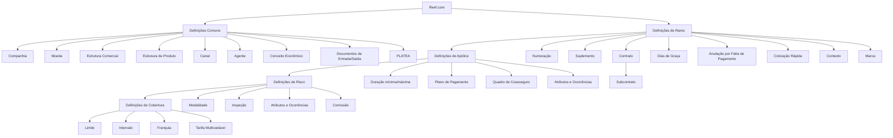

# Reef.core — Definição de Ramos Gerais e Configurações do Módulo de Emissão

## 1. Metadados do Documento
- **Arquivo de Origem:** Não identificado no conteúdo extraído
- **Tipo de Documento:** Arquitetura Funcional / Documentação de Configuração
- **Domínio / Sistema:** Reef.core — módulo de emissão de seguros
- **Público-Alvo:** Analistas funcionais, configuradores de produto, arquitetos, desenvolvedores e operação de seguros
- **Data/Versão Identificada:** Não identificada
- **Owner identificado:** `user:agonzalez_mapfre.com`
- **Lifecycle identificado:** Approved Source

---

## 2. Resumo Executivo & Contexto de Negócio

O documento descreve a estrutura de definições necessária para configurar ramos gerais no sistema **Reef.core**, com foco no módulo de emissão de apólices de seguros. A estrutura é organizada por níveis de abrangência: definições comuns à companhia, definições de ramo, apólice, risco e cobertura.

No nível comum, o documento reúne cadastros e configurações transversais necessários para a operação de seguros, incluindo companhia, moeda, estrutura comercial, estrutura de produto, canais, agentes, comissões, documentos de entrada e saída, conceitos econômicos, controle técnico e integração com PLATEA.

No nível de ramo, o Reef.core permite definir as características gerais das apólices, como numeração, suplementos, contratos, subcontratos, dias de graça, anulação por falta de pagamento, cotização rápida, contexto de exibição e eventos de marca. Contratos e subcontratos funcionam como mecanismos de alteração da definição padrão de um ramo para clientes, colaboradores ou grupos empresariais específicos.

Nos níveis de apólice, risco e cobertura, o documento detalha elementos que regulam vigência, moeda, recibos, coasseguro, escalas, intervenções, cláusulas, planos de pagamento, atributos, ocorrências, controle técnico, modalidades, inspeções, limites, franquias e tarifas multivariáveis. A configuração permite adaptar o comportamento de emissão, subscrição, cobrança, remuneração de agentes e prestação de serviços.

O conteúdo tem natureza predominantemente funcional e conceitual. Não são apresentados contratos de APIs, endpoints, tecnologias de infraestrutura, formatos JSON, URLs de ambientes, portas, versões de software ou detalhes de implementação técnica.

---

## 3. Arquitetura, Componentes & Tecnologias Envolvidas

### Componentes funcionais identificados

| Componente / Domínio | Papel identificado no documento |
| :--- | :--- |
| **Reef.core** | Sistema no qual são configuradas as definições de companhia, ramo, apólice, risco e cobertura. |
| **Módulo de emissão** | Módulo no qual são definidas características e condições relacionadas à emissão de apólices. |
| **Companhia** | Entidade ou entidades com as quais serão criadas apólices e demais elementos relacionados. |
| **PLATEA** | Aplicação ou ativo externo para o qual existem definições de integração. |
| **Mapfredocument** | Referência exibida na navegação da documentação. Não há detalhamento funcional ou técnico adicional. |
| **Control técnico** | Configuração de condições que podem interromper a contratação ou exigir avaliação de assumibilidade do seguro. |
| **Contrato** | Condições que alteram a definição de um ramo para um ou mais clientes. |
| **Subcontrato** | Condições que alteram as condições de um contrato e, consequentemente, a definição de um ramo. |
| **Apólice** | Nível de definição que afeta todos os riscos possíveis de uma apólice. |
| **Risco** | Nível de definição que afeta cada risco possível da apólice. |
| **Cobertura** | Nível de definição que afeta cada cobertura contratada. |

### Hierarquia funcional de configuração



> **Nota de Análise:** O documento apresenta uma arquitetura funcional de configuração. Não detalha microsserviços, protocolos de integração, métodos HTTP, contratos de dados, bancos de dados ou mecanismos técnicos de comunicação entre Reef.core e PLATEA.

---

## 4. Regras de Negócio, Especificações Funcionais & Processos

### 4.1. Definições comuns

As definições comuns não são exclusivas do módulo de emissão, mas são necessárias para a definição e operação do ramo de seguro.

- A **companhia** define a entidade ou entidades com as quais as apólices e os demais elementos serão criados.
- A **moeda** define as divisas utilizadas pelo Reef.core para realizar operações da companhia.
- A **estrutura comercial** define a organização territorial da companhia.
- A **estrutura de produto** organiza os ramos comercializados.
- O **canal** define as vias por meio das quais a nova produção chega à companhia.
- O **quadro de comissão** define agrupadores que determinam comissões pagas aos agentes.
- O **agente** representa terceiros intermediários entre cliente e companhia.
- O **conceito econômico** define os elementos que compõem a informação econômica do recibo.
- Os **documentos de entrada e saída** definem tanto os documentos gerados por operações quanto os documentos exigidos para sua realização.
- O **controle técnico** define parâmetros de validação que autorizam ou impedem a finalização de uma operação.
- As definições de **PLATEA** são necessárias para integração com esse ativo.

### 4.2. Definições de ramo

As definições de ramo pertencem ao módulo de emissão, mas não são exclusivas de um ramo individual.

- A **numeração** determina os elementos e a ordem que compõem o número de apólice e o número de orçamento.
- O **ramo** fixa características gerais das apólices, incluindo dias por ano, coletivos, cláusulas e tipo de apólice temporal.
- O **suplemento** define os tipos de modificações possíveis para apólices, como anulação, reabilitação e renovação.
- O **contrato** altera a definição de um ramo para um ou mais clientes; pode definir valores concretos ou múltiplos valores permitidos.
- O **subcontrato** altera as condições de um contrato e, por consequência, a definição de ramo; o documento cita como exemplo as condições aplicáveis a um grupo empresarial.
- A **póliza grupo** representa um conjunto de apólices independentes — individuais, coletivas ou multirriscos — submetidas a alguma exceção de contrato e/ou subcontrato em relação ao ramo padrão.
- A **póliza cliente** é uma chave adicional que pode ser associada a uma apólice para unir várias apólices de um cliente ou colaborador.
- Os **dias de graça** adicionam dias ao efeito de um recibo para determinar quando a apólice deve seguir para o processo de anulação por falta de pagamento.
- Os **dias de graça de contrato** e os **dias de graça de subcontrato** alteram a definição específica para cliente ou colaborador.
- A **anulação por falta de pagamento** define parâmetros utilizados para determinar quais apólices devem ser anuladas por inadimplência.
- A **cotização rápida** retorna o preço de várias simulações com um mínimo de informações exigidas do cliente; define as simulações, informações requeridas, informações dispensadas e valores usados quando não houver coleta de determinado dado.
- O **contexto** permite criar ambientes nos quais determinados atributos não são exibidos.
- A configuração **[MARCA][marca]** permite definir eventos com níveis de gravidade capazes de desencadear ações sobre apólices já existentes em carteira ou apólices ainda não criadas.

### 4.3. Definições de documentos

Os documentos de entrada e saída acompanham operações ou são pré-requisitos para sua execução.

- Documentos de saída são gerados quando ocorre uma operação, por exemplo, documentos gerados na emissão de uma nova apólice.
- Documentos de entrada são necessários para realizar determinada operação, por exemplo, a carteira de motorista para emissão de uma apólice de automóvel.
- A definição de documentos pode ser alterada por **contrato** para um cliente ou colaborador.

### 4.4. Definições de apólice

As definições de apólice afetam todos os riscos possíveis da apólice.

- **Meses de duração mínimo/máximo:** fixa a quantidade mínima e/ou máxima de meses de vigência permitida para uma apólice.
- **Dias de adiantamento/atraso:** determina quantos dias antes ou depois da data atual podem ser utilizados para definir o efeito na criação ou modificação de uma apólice.
- **Moeda:** define as moedas possíveis para emissão de apólices; afeta capitais, prêmios, comissões e recibos.
- **Importe mínimo:** estabelece valores mínimos para geração de um recibo.
- **Quadro de coasseguro:** define previamente companhias participantes do risco com conhecimento do cliente; a definição é usada posteriormente em emissões de apólice.
- **Escala:** define a porção de prêmio usada quando a apólice não é anual e o cálculo não deve ser proporcional ao tempo.
- **Intervenção:** define figuras que podem participar da contratação, relacionadas a clientes, como tomador, segurado e condutor.
- **Cláusula:** estabelece estipulações contratuais que especificam, ampliam, derrogam ou modificam o conteúdo do seguro.
- **Texto anexo:** define se estipulações contratuais podem ser incluídas manualmente em uma apólice.
- **Plano de pagamento:** define como o pagamento do seguro será fracionado.
- **Plano de pagamento de cliente:** permite estabelecer planos de pagamento por cliente e aplicá-los mesmo quando o ramo não dispõe daquele plano.
- **Revalorização/depreciação:** fixa como o valor de um risco será incrementado ou reduzido.
- **Controle técnico:** define condições que podem paralisar a contratação ou permitir que uma ou mais pessoas determinem se o seguro é assumível pela seguradora.
- **Atributo:** representa características que precisam estar disponíveis no Reef.core, por exemplo, o registro de um desconto que afeta a apólice.
- **Ocorrência:** é equivalente ao conceito de atributo, porém permite solicitar o conjunto de atributos “n” vezes.

### 4.5. Definições de risco

As definições de risco afetam cada risco possível de uma apólice.

- **Intervenção:** define figuras participantes da contratação, tais como tomador, segurado e condutor.
- **Atributo:** representa características disponíveis no Reef.core, como um desconto que afeta o risco.
- **Controle técnico de atributo:** estabelece condições nas quais a contratação pode ser interrompida ou submetida à decisão sobre assumibilidade.
- **Ocorrência:** permite solicitar um conjunto de atributos diversas vezes; o documento exemplifica o armazenamento de matérias cujo transporte é limitado em quantidade.
- **Ramo contable múltiple:** permite definir ramos contábeis pelo conteúdo de algum atributo.
- **Modalidade:** agrupamento de coberturas que, em conjunto, se tornam um pacote comercializável.
- **Cláusula:** estipulação contratual que especifica, amplia, derroga ou modifica o conteúdo do seguro.
- **Comissão:** remuneração pela intermediação da contratação de um seguro; existem diferentes tipos conforme a participação do agente e possíveis exceções.
- **Inspeção:** define quando e como realizar inspeções sobre riscos contratados; as inspeções podem ocorrer antes da contratação ou durante o processo de contratação.

### 4.6. Definições de cobertura

As definições de cobertura afetam cada cobertura definida na apólice.

- A **cobertura** é a obrigação principal em um contrato de seguro. Existem diversos tipos de cobertura que determinam comportamento no processo de emissão e no processo de prestações.
- **Contrato** e **subcontrato** podem alterar a definição padrão da cobertura por cliente, colaborador ou grupo empresarial.
- **Controle técnico** permite determinar condições de paralisação da contratação ou de avaliação de assumibilidade.
- **Atributo** representa características necessárias disponíveis no Reef.core, como desconto que afeta a cobertura.
- **Ocorrência** permite solicitar repetidamente conjuntos de atributos.
- **Limite** define o valor máximo contratado para o período de vigência do seguro e/ou o máximo aplicável por prestação durante a vigência; esses valores estão pré-fixados.
- **Intervalo** define somas seguradas entre um limite inferior e um limite superior.
- **Franquia** define quantidades pelas quais o segurado responde; a redução de prêmio aplicável pode estar definida na própria franquia ou dedutível.
- **Conceito de desglose** define o detalhamento necessário para segregação da informação econômica de uma cobertura.
- **Tarifa multivariável** é o meio de determinação do cálculo, centrado no conceito de fator utilizado para realizar o cálculo.
- **Comissão** define remuneração por intermediação da contratação, considerando tipos de comissão conforme a participação do agente e exceções.

---

## 5. Tabelas de Parâmetros, Ambientes e Estruturas de Dados

### 5.1. Definições comuns

| Item / Parâmetro | Descrição / Função | Tipo / Valores / Formato | Ambiente / Observações |
| :--- | :--- | :--- | :--- |
| Companhia | Define a entidade ou entidades com as quais serão criadas as apólices e os demais elementos. | Entidade corporativa | Definição comum. |
| Moeda | Define as divisas utilizadas pelo Reef.core nas operações da companhia. | Divisa / moeda | Também afeta emissão de apólices, capitais, prêmios, comissões e recibos. |
| Estrutura comercial | Define a organização territorial da companhia. | Estrutura organizacional | Definição comum. |
| Estrutura de produto | Define como os ramos comercializados serão organizados. | Estrutura de produto | Definição comum. |
| Canal | Define as vias por meio das quais a nova produção chega à companhia. | Canal de distribuição | Definição comum. |
| Quadro de comissão | Define agrupadores que determinam comissões pagas a agentes. | Agrupador de comissão | Definição comum. |
| Agente | Define terceiros que atuam como intermediários entre cliente e companhia. | Terceiro / intermediário | Definição comum. |
| Conceito econômico | Define conceitos que compõem informação econômica do recibo. | Conceito econômico | Definição comum. |
| Documentos de entrada/saída | Define documentos gerados em operações e documentos requeridos para realizá-las. | Documento operacional | Exemplo citado: carteira de motorista para apólice de automóvel. |
| Controle técnico | Define parâmetros de validação que permitem ou impedem finalizar uma operação. | Regra de validação | Também presente em apólice, risco e cobertura. |
| PLATEA | Agrupa definições necessárias para integração com esse ativo. | Integração | O documento não detalha interfaces ou contratos de integração. |

### 5.2. Definições de ramo

| Item / Parâmetro | Descrição / Função | Tipo / Valores / Formato | Ambiente / Observações |
| :--- | :--- | :--- | :--- |
| Numeração | Determina os elementos e a ordem que formam o número de apólice e de orçamento. | Regra de composição | Nível de ramo. |
| Ramo | Fixa características gerais das apólices, como dias por ano, coletivos, cláusulas e tipo de apólice temporal. | Configuração de ramo | Nível de ramo. |
| Suplemento | Define modificações permitidas para apólices. | Exemplos: anulação, reabilitação, renovação | Nível de ramo. |
| Contrato | Altera definição de ramo para um ou mais clientes. | Valores concretos ou vários valores permitidos | Aplicável a definições específicas. |
| Subcontrato | Altera condições de contrato e, consequentemente, definição de ramo. | Valores ou grupos de valores possíveis | Exemplo: condições de grupo empresarial. |
| Póliza grupo | Agrupa apólices independentes sujeitas a exceção de contrato e/ou subcontrato. | Individual, coletiva ou multirriscos | Exceção sobre definição padrão do ramo. |
| Póliza cliente | Chave adicional associável à apólice para unir apólices de cliente ou colaborador. | Chave adicional | Nível de ramo. |
| Dias de graça | Adiciona dias ao efeito de recibo para determinar início do processo de anulação por falta de pagamento. | Número de dias | Nível de ramo. |
| Anulação falta de pagamento | Define parâmetros para determinar apólices a anular por inadimplência. | Processo parametrizado | Nível de ramo. |
| Cotização rápida | Retorna preço de várias simulações com um mínimo de dados do cliente. | Simulações, dados exigidos, dados dispensados e valores padrão | Nível de ramo. |
| Contexto | Permite criar ambientes nos quais atributos não são exibidos. | Ambiente de apresentação | Nível de ramo. |
| Marca | Define eventos com nível de gravidade capazes de desencadear ações sobre apólices. | Reativa ou proativa | Reativa: apólice em carteira. Proativa: apólice ainda não criada. |

### 5.3. Definições de apólice, risco e cobertura

| Item / Parâmetro | Descrição / Função | Tipo / Valores / Formato | Ambiente / Observações |
| :--- | :--- | :--- | :--- |
| Meses duração mínimo/máximo | Define meses mínimos e/ou máximos de vigência da apólice. | Quantidade de meses | Nível de apólice. |
| Dias de adiantamento/atraso | Define dias anteriores ou posteriores à data atual aceitos para efeito de criação ou modificação. | Número de dias | Nível de apólice. |
| Importe mínimo | Define valores mínimos para gerar recibo. | Valor monetário | Nível de apólice. |
| Quadro de coasseguro | Define previamente companhias que participam do risco com conhecimento do cliente. | Participantes do risco | Uso posterior em emissões. |
| Escala | Define porção de prêmio para apólice não anual quando cálculo não é proporcional ao tempo. | Regra de cálculo de prêmio | Nível de apólice. |
| Intervenção | Define figuras participantes da contratação. | Tomador, segurado, condutor, entre outros | Presente em apólice e risco. |
| Cláusula | Estabelece estipulações que especificam, ampliam, derrogam ou modificam conteúdo do seguro. | Estipulação contratual | Presente em apólice, risco e cobertura. |
| Texto anexo | Define inclusão manual de estipulações contratuais na apólice. | Inclusão manual | Nível de apólice. |
| Plano de pagamento | Define fracionamento do pagamento do seguro. | Plano de pagamento | Possui variações por contrato e cliente. |
| Revalorização/depreciação | Define incremento ou decremento do valor de risco. | Regra de valorização | Relacionado a contrato e subcontrato. |
| Atributo | Característica que deve estar disponível no Reef.core. | Exemplo: desconto | Pode afetar apólice, risco ou cobertura. |
| Ocorrência | Conjunto de atributos solicitado repetidamente. | Repetição “n” vezes | Exemplo: matérias transportadas com limite de quantidade. |
| Ramo contable múltiple | Define ramos contábeis com base no conteúdo de algum atributo. | Regra contábil | Nível de risco. |
| Modalidade | Agrupa coberturas em um pacote comercializável. | Agrupamento de coberturas | Nível de risco. |
| Inspeção | Define quando e como inspecionar riscos contratados. | Pré-contratação ou durante contratação | Nível de risco. |
| Cobertura | Obrigação principal do contrato de seguro. | Diversos tipos de cobertura | Afeta emissão e prestações. |
| Limite | Define valor máximo contratado por vigência e/ou por prestação. | Importes pré-fixados | Nível de cobertura. |
| Intervalo | Define somas seguradas entre limite inferior e superior. | Limite mínimo e máximo | Nível de cobertura. |
| Franquia | Define valores pelos quais o segurado responde. | Franquia ou dedutível | Pode incluir redução de prêmio. |
| Conceito desglose | Define detalhamento para segregação da informação econômica de cobertura. | Detalhe econômico | Nível de cobertura. |
| Tarifa multivariável | Define cálculo baseado no conceito de fator. | Fator de cálculo | Possui variações por contrato e subcontrato. |
| Comissão | Define remuneração pela intermediação da contratação. | Tipos conforme participação do agente e exceções | Presente em risco e cobertura. |

---

## 6. Bateria de Perguntas & Respostas para RAG (FAQ Sintético)

### P1: Qual é a finalidade das definições comuns no Reef.core?
**R:** As definições comuns reúnem configurações que não são exclusivas do módulo de emissão, mas são necessárias para configurar e operar ramos de seguros. Incluem companhia, moeda, estrutura comercial, estrutura de produto, canais, agentes, quadro de comissão, conceitos econômicos, documentos de entrada e saída, controle técnico e integração com PLATEA.

### P2: Como o Reef.core utiliza contratos e subcontratos na definição de um ramo?
**R:** Um contrato altera a definição de um ramo para um ou mais clientes, podendo definir valores concretos ou diversos valores permitidos. Um subcontrato altera as condições de um contrato e, consequentemente, altera a definição do ramo. O documento cita como exemplo as condições específicas aplicáveis a um grupo empresarial.

### P3: O que são dias de graça e qual é sua relação com a anulação por falta de pagamento?
**R:** Dias de graça são dias adicionados ao efeito de um recibo para determinar quando a apólice deve ser encaminhada ao processo de anulação por falta de pagamento. A configuração de anulação por falta de pagamento define os parâmetros utilizados para decidir quais apólices devem ser anuladas por inadimplência.

### P4: Como funciona a cotização rápida no Reef.core?
**R:** A cotização rápida é um processo que retorna o preço de várias simulações usando um conjunto mínimo de informações fornecidas pelo cliente. A configuração define quais simulações terão preço, quais informações serão solicitadas, quais não serão solicitadas e quais valores serão considerados para informações não coletadas.

### P5: Quais elementos podem afetar a vigência e a data de efeito de uma apólice?
**R:** A vigência pode ser controlada pelos meses de duração mínimo e máximo, que definem os limites de meses de validade da apólice. Os dias de adiantamento e atraso determinam quantos dias antes ou depois da data atual podem ser usados para fixar o efeito na criação ou alteração de uma apólice.

### P6: O que é um quadro de coasseguro?
**R:** O quadro de coasseguro estabelece previamente as companhias que participarão de um risco com conhecimento do cliente. Essa definição prévia é utilizada posteriormente durante emissões de apólices.

### P7: Qual é a diferença entre atributo e ocorrência?
**R:** Um atributo é uma característica que precisa estar disponível no Reef.core, como um local de registro de desconto que afeta apólice, risco ou cobertura. Uma ocorrência é o mesmo conceito de atributo, mas solicitado repetidamente “n” vezes, formando um conjunto de atributos repetível.

### P8: Em quais situações o controle técnico pode interromper uma contratação?
**R:** O controle técnico define condições nas quais a contratação pode ser paralisada ou nas quais uma ou mais pessoas podem determinar se o seguro é assumível pela seguradora. O documento não detalha regras concretas, critérios, papéis decisórios ou fluxos de aprovação.

### P9: O que representa uma modalidade no nível de risco?
**R:** Modalidade é uma agrupação de coberturas que, reunidas, formam um pacote destinado à comercialização.

### P10: Como são definidos os limites e intervalos de uma cobertura?
**R:** Um limite define o valor máximo contratado durante a vigência do seguro e/ou o valor máximo aplicável a cada prestação realizada no período de vigência. Um intervalo estabelece somas seguradas entre dois limites: um inferior e outro superior.

### P11: O que é tarifa multivariável no contexto de cobertura?
**R:** Tarifa multivariável é o meio utilizado para determinar um cálculo. Sua definição é centrada no conceito de fator, que é o elemento utilizado para realizar o cálculo. Existem também configurações de tarifa multivariável por contrato e por subcontrato.

### P12: Quais documentos podem ser definidos como entrada ou saída de uma operação?
**R:** Documentos de saída são aqueles que devem ser gerados quando uma operação é realizada, como documentos resultantes da emissão de uma nova apólice. Documentos de entrada são documentos exigidos para executar uma operação; o documento cita como exemplo a necessidade de carteira de motorista para emitir uma apólice de automóvel.

---

## 7. Glossário de Termos, Siglas & Conceitos-Chave

- **Reef.core:** Sistema citado como plataforma de configuração de elementos relacionados à emissão de seguros.
- **Ramo:** Definição que fixa características gerais das apólices de seguro.
- **Apólice / Póliza:** Contrato de seguro configurado e emitido pela companhia.
- **Risco:** Elemento da apólice ao qual se aplicam definições específicas de intervenção, atributos, inspeção, modalidade e comissão.
- **Cobertura:** Obrigação principal em um contrato de seguro; influencia emissão e prestações.
- **Contrato:** Condição que altera a definição de um ramo para um ou mais clientes.
- **Subcontrato:** Condição que altera um contrato e, por consequência, a definição de ramo.
- **Suplemento:** Tipo de modificação que pode ocorrer em uma apólice, como anulação, reabilitação ou renovação.
- **Cotização rápida:** Processo de precificação de várias simulações com dados mínimos do cliente.
- **Coasseguro:** Participação prévia de múltiplas companhias em um risco, com conhecimento do cliente.
- **Franquia:** Quantidade ou valor pelo qual o segurado responde; pode conter redução de prêmio.
- **Dedutível:** Termo citado como alternativa ou elemento associado à franquia.
- **Ocorrência:** Conjunto de atributos cuja solicitação é repetida diversas vezes.
- **Modalidade:** Pacote comercial composto pelo agrupamento de coberturas.
- **Controle técnico:** Configuração de validações e condições que podem impedir a contratação ou avaliar assumibilidade.
- **PLATEA:** Aplicação ou ativo citado como objeto de integração.
- **Marca:** Evento configurável com nível de gravidade capaz de desencadear ações reativas ou proativas sobre apólices.
- **Ramo contable múltiple:** Possibilidade de definir ramos contábeis conforme o conteúdo de algum atributo.
- **Conceito desglose:** Detalhamento para segregação da informação econômica de uma cobertura.
- **Tarifa multivariável:** Mecanismo de cálculo baseado no conceito de fator.

---

## 8. Notas Críticas, Riscos & Limitações

- O documento não identifica versão, data de publicação, autor técnico, ambiente, URL, endpoint, protocolo ou detalhes de infraestrutura.
- O conteúdo descreve conceitos funcionais e configurações, mas não fornece exemplos de valores, schemas, telas, regras executáveis, fórmulas de cálculo ou casos de teste.
- PLATEA é citada como uma integração necessária, porém não há descrição de fluxo, formato de troca de dados, responsabilidades, autenticação ou tratamento de falhas.
- O controle técnico é mencionado em diferentes níveis, mas o documento não especifica critérios concretos de validação, responsáveis pela decisão ou mecanismos de aprovação.
- A tarifa multivariável é descrita como cálculo baseado em fatores, mas não são fornecidas fórmulas, pesos, tipos de fatores ou exemplos de cálculo.
- O texto extraído contém caracteres corrompidos em diversas ocorrências, como `denición`, `ja` e `antidades`; a interpretação foi preservada apenas onde o significado era inequívoco pelo contexto.
- **Nota de Análise:** O documento lista o mecanismo `[MARCA][marca]`, mas não detalha os eventos disponíveis, níveis de gravidade, ações disparadas ou condições de execução.
- **Nota de Análise:** O documento cita Mapfredocument somente na navegação da fonte e não fornece detalhes sobre sua função, integração ou operação.

---

## 9. Conteúdo Bruto Estruturado (Referência Fiel)

```text
--- [PÁGINA 1 DE 6] ---

EN CONSTRUCCIÓN
DEFINICIÓN DE RAMOS GENERALES
 Elementos que intervienen en la denición y orden en el que se debe realizar.
COMÚN
En este nivel se encuentran deniciones que no son exclusivas del módulo de emisión, pero son necesarias
para poder realizar la denición. Entre otras deniciones se encuentra:
COMPAÑÍA 
Denición de la entidad o entidades con
las que se van a crear las pólizas y por
consiguiente el resto de elementos
MONEDA 
Denición de las divisas con las que
Reef.core va a realizar las distintas
operaciones de la compañía
ESTRUCTURA COMERCIAL 
Denición de como se va a establecer la
organización territorial de la compañía
ESTRUCTURA PRODUCTO 
Denición de como estarán organizados
los ramos que se comercializan
CANAL 
Denición de las distintas vías por las que
llegará la nueva producción a la compañía
CUADRO COMISIÓN 
Denición de los agrupadores que
determinan las comisiones que se van a
pagar a los agentes
AGENTE 
Denición de los terceros que ejercerán de
intermediarios entre el cliente y la
compañía
CONCEPTO ECONÓMICO 
Denición de los conceptos que formarán
parte de la información económica del
recibo
DOCUMENTOS DE ENTRADA/SALIDA 
Denición de los documentos que deben
salir cuando se realiza una operación y de
los documentos que son necesarios
solicitar cuando se realiza una operación
CONTROL TÉCNICO 
 PLATEA 
Denición necesaria para la integración
con esta aplicación
Documentation / DOCUMENTACIÓN Reef
DOCUMENTACIÓN Reef
Mapfredocument
DOCUMENTACIÓN Reef
Owner
user:agonzalez_mapfre.com
Lifecycle
Approved Source
 / 
 VL
Buscar Inicio Soluciones Arquitecturas APIs Componentes Cloud Documentación Zeus Reef Ayuda
ES


--- [PÁGINA 2 DE 6] ---

Denición de los parámetros necesarios
para realizar validaciones que permitan o
no nalizar la operación
RAMO
Son deniciones que siendo del módulo de emisión, no son exclusivas del ramo que se está deniendo. Por
ejemplo:
NUMERACIÓN 
Determinar que elementos formarán y en
que orden el número de póliza y el número
de presupuesto
RAMO 
Fija las características generales con las
que contarán las pólizas, como días por
año, colectivos, cláusulas, tipo de póliza
temporal, etc.
SUPLEMENTO 
Tipos de modicaciones que podrán sufrir
las pólizas (anulación, rehabilitación,
renovación, etc.)
CONTRATO
Condiciones que alteran la denición de
un ramo. Estas condiciones aplican
siempre a uno o varios clientes. También
se pueden determinar valores concretos o
varios valores permitidos
SUBCONTRATO
Condiciones que alteran las condiciones
de un contrato y, por consiguiente alteran
la denición de un ramo. Un ejemplo
puede ser las distintas condiciones que
rigen a un grupo empresarial. Al igual que
el contrato, se pueden determinar valores
o grupos de valores posibles
PÓLIZA GRUPO
Conjunto de pólizas independientes.
Estas, pueden ser individuales, colectivas
o multi-riesgo. Siempre el conjunto está
sujeto a algún tipo de excepción (contrato
y/o subcontrato) sobre la denición del
ramo estándar
PÓLIZA CLIENTE
Clave adicional que puede asociarse a una
póliza y que puede unir varias pólizas de
un cliente o colaborador
DÍAS DE GRACIA
Número de días que se adicionan al efecto
de un recibo para determinar que debe
pasar al proceso de anulación por falta de
pago
DÍAS DE GRACIA CONTRATO
Alteración de la denición especíca para
un cliente o colaborador
DÍAS DE GRACIA SUBCONTRATO
Alteración de la denición especíca para
un cliente o colaborador
ANULACIÓN FALTA PAGO
Parámetros que tendrá en cuenta este
proceso a la hora de determinar qué
pólizas deben anularse por falta de pago
COTIZACIÓN RÁPIDA
Proceso que devuelve el precio de varias
simulaciones con un mínimo de
información requerida al cliente. En este
punto se dene las simulaciones con las
que se dará precio, qué información se
solicitará y qué información no se solicita
al cliente y, para aquella información que
no será solicitada, determinar el valor con
el que se contará pra dar precio
CONTEXTO
Se pueden crear entornos en los que
determinar que información (atributos) no
mostrar
PLATEA
Deniciones relacionadas con la
integración con este activo
[MARCA][marca]
Fijar eventos con un nivel de gravedad que
puede desencadenar acciones sobre
pólizas. Estas acciones pueden ser
reactivas (la póliza ya está en cartera) o
proactivas (la póliza aún no ha sido
creada)


--- [PÁGINA 3 DE 6] ---

DOCUMENTOS DE ENTRADA/SALIDA 
Determinar aquellos documentos que
deben acompañar a una operación (por
ejemplo, que documentos se generan
cuando se emite una nueva póliza) y
documentos que son necesarios disponer
para poder realizar una operación (por
ejemplo, para emitir una póliza de
automóvil es necesario disponer de la
licencia de conducir)
DOCUMENTOS DE ENTRADA/SALIDA
CONTRATO
Alteración de la denición especíca para
un cliente o colaborador
PÓLIZA
En este nivel se encuentran deniciones que afectarán a todos los posibles riesgos de la póliza. Entre otros
se dene:
MESES DURACIÓN MÍNIMO/MÁXIMO
Se ja el número máximo y/o mínimo de
meses de vigencia que una póliza puede
disponer
MESES DURACIÓN MÍNIMO/MÁXIMO
CONTRATO
Alteración de la denición especíca para
un cliente o colaborador
DÍAS DE ADELANTO/ATRASO
Con cuantos días previos o posteriores al
día de hoy se puede jar el efecto en la
creación o modicación de una póliza
DÍAS DE ADELANTO/ATRASO CONTRATO
Alteración de la denición especíca para
un cliente o colaborador
MONEDA 
Determina las posibles monedas en las
que se emitirán las pólizas. Afecta a
capitales, primas, comisiones y recibos
IMPORTE MÍNIMO
Se establecen los importes mínimos para
generar un recibo
CUADRO COASEGURO
Se establecen de forma previa aquellas
compañías que participarán en el riesgo
con el conocimiento del cliente. Esta
denición previa es para uso posterior en
las emisiones de póliza
ESCALA
Se establece cual será la porción de prima
cuando una póliza no es anual y no se
desea que el cálculo sea proporcional al
tiempo
INTERVENCIÓN
Denición de aquellas guras que podrán
intervenir en la contratación. Estas guras
se reeren a clientes y son del tipo
tomador, asegurado, conductor, etc.
INTERVENCIÓN CONTRATO
Alteración de la denición especíca para
un cliente o colaborador
CLÁUSULA
Establecer diferentes estipulaciones
contractuales que precisan, amplían,
derogan o modican el contenido del
seguro
TEXTO ANEXO
Fijar si es posible incluir de forma manual
en una póliza diferentes estipulaciones
contractuales que precisan, amplían,
derogan o modican el contenido del
seguro
PLAN DE PAGO 
Denir como se va a fraccionar el pago del
seguro
PLAN DE PAGO CONTRATO
Alteración de la denición especíca para
un cliente o colaborador
PLAN DE PAGO CLIENTE
Establecer planes de pago por cliente y
aplicarlos aunque el ramo no disponga de
él
REVALORIZACIÓN/DEPRECIACIÓN
 CONTRATO
 SUBCONTRATO


--- [PÁGINA 4 DE 6] ---

Fijar como se incrementa o decrementa el
valor de un riesgo
Condiciones que alteran la denición de
un ramo. Estas condiciones aplican
siempre a uno o varios clientes. También
se pueden determinar valores concretos o
varios valores permitidos
Condiciones que alteran las condiciones
de un contrato y, por consiguiente alteran
la denición de un ramo. Un ejemplo
puede ser las distintas condiciones que
rigen a un grupo empresarial. Al igual que
el contrato, se pueden determinar valores
o grupos de valores posibles
CONTROL TÉCNICO
Denición de en qué condiciones se puede
paralizar la contratación o hacer que una o
varias personas puedan determinar si el
seguro es asumible por la aseguradora
ATRIBUTO
Son características que sea necesario
disponer y de las que Reef.core dispone,
por ejemplo disponer de un lugar donde se
registre un descuento que afecta a la
póliza
ATRIBUTO CONTRATO
Alteración de la denición especíca para
un cliente o colaborador
ATRIBUTO SUBCONTRATO
Alteración de la denición especíca para
un cliente o colaborador
CONTROL TÉCNICO ATRIBUTO
Denición de en qué condiciones se puede
paralizar la contratación o hacer que una o
varias personas puedan determinar si el
seguro es asumible por la aseguradora
OCURRENCIA
Es el mismo concepto de atributo, pero la
solicitud de esos atributos se realiza "n"
veces. Es decir, es un conjunto de
atributos que su petición se realiza varias
veces. Por ejemplo si fuera almacenar en
la póliza una serie de materias que su
transporte está limitado en cantidad
RIESGO
Deniciones que afectan a cada uno de los posibles riesgos de la póliza. Por ejemplo:
INTERVENCIÓN
Denición de aquellas guras que podrán
intervenir en la contratación. Estas guras
se reeren a clientes y son del tipo
tomador, asegurado, conductor, etc.
INTERVENCIÓN CONTRATO
Alteración de la denición especíca para
un cliente o colaborador
ATRIBUTO
Son características que sea necesario
disponer y de las que Reef.core dispone,
por ejemplo disponer de un lugar donde se
registre un descuento que afecta al riesgo
ATRIBUTO CONTRATO
Alteración de la denición especíca para
un cliente o colaborador
ATRIBUTO SUBCONTRATO
Alteración de la denición especíca para
un cliente o colaborador
CONTROL TÉCNICO ATRIBUTO
Denición de en qué condiciones se puede
paralizar la contratación o hacer que una o
varias personas puedan determinar si el
seguro es asumible por la aseguradora
OCURRENCIA
Es el mismo concepto de atributo, pero la
solicitud de esos atributos se realiza "n"
veces. Es decir, es un conjunto de
atributos que su petición se realiza varias
veces. Por ejemplo si fuera almacenar en
la póliza una serie de materias que su
transporte está limitado en cantidad
RAMO CONTABLE MULTIPLE
Posibilidad de denir ramos contables po
el contenido de algún atributo
MODALIDAD
Agrupación de coberturas que juntas se
convierten en un paquete a comercializar
CLÁUSULA
 COMISIÓN
 COMISIÓN CONTRATO


--- [PÁGINA 5 DE 6] ---

Establecer diferentes estipulaciones
contractuales que precisan, amplían,
derogan o modican el contenido del
seguro
Establecer la remuneración por
intermediar en la contratación de un
seguro. Existen distintos tipos de
comisiones dependiendo de como
interviene el agente, así como
excepciones
Alteración de la denición especíca para
un cliente o colaborador
INSPECCIÓN
Denición de cuando y como realizar
inspecciones a los riesgos contratados.
las inspecciones pueden ser previas a la
contratación o en el proceso de
contratación
COBERTURA
Deniciones que afectan a cada una de las coberturas denidas. Por ejemplo:
COBERTURA 
Obligación principal en un contrato de
seguro. Existen diversos tipos de
cobertura que determinan el
comportamiento tanto en el proceso de
emisión, como en el proceso de
prestaciones
CONTRATO
Condiciones que alteran la denición de
un ramo. Estas condiciones aplican
siempre a uno o varios clientes. También
se pueden determinar valores concretos o
varios valores permitidos
SUBCONTRATO
Condiciones que alteran las condiciones
de un contrato y, por consiguiente alteran
la denición de un ramo. Un ejemplo
puede ser las distintas condiciones que
rigen a un grupo empresarial. Al igual que
el contrato, se pueden determinar valores
o grupos de valores posibles
CONTROL TÉCNICO
Denición de en qué condiciones se puede
paralizar la contratación o hacer que una o
varias personas puedan determinar si el
seguro es asumible por la aseguradora
ATRIBUTO
Son características que sea necesario
disponer y de las que Reef.core dispone,
por ejemplo disponer de un lugar donde se
registre un descuento que afecta a la
cobertura
ATRIBUTO CONTRATO
Alteración de la denición especíca para
un cliente o colaborador
ATRIBUTO SUBCONTRATO
Alteración de la denición especíca para
un cliente o colaborador
OCURRENCIA
Es el mismo concepto de atributo, pero la
solicitud de esos atributos se realiza "n"
veces. Es decir, es un conjunto de
atributos que su petición se realiza varias
veces. Por ejemplo si fuera almacenar en
la póliza una serie de materias que su
transporte está limitado en cantidad
LÍMITE
Estipulación del importe máximo
contratado por el periodo de vigencia del
seguro y/o importe máximo aplicable por
cada uno de las prestaciones realizadas
durante le periodo de vigencia. Estos
importes están prejados
LÍMITE CONTRATO
Alteración de la denición especíca para
un cliente o colaborador
INTERVALO
Establecimiento de sumas aseguradas
entre dos límites, uno inferior y otro
superior
INTERVALO CONTRATO
Alteración de la denición especíca para
un cliente o colaborador
INTERVALO SUBCONTRATO
 FRANQUICIA
 FRANQUICIA CONTRATO


--- [PÁGINA 6 DE 6] ---

Alteración de la denición especíca para
un cliente o colaborador
Establecer las antidades por el que el
asegurado responde. Existe la posibilidad
que la reducción de la prima a aplicar se
encuentre denida en la propia franquicia
o deducible
Alteración de la denición especíca para
un cliente o colaborador
CONCEPTO DESGLOSE 
Denición del detalle necesario de
segregación de la información económica
de una cobertura
TARIFA MULTIVARIABLE
Medio por el que se determina el cálculo.
La denición se centra en el concepto
factor que es el concepto por el que se
realiza un cálculo
TARIFA MULTIVARIABLE CONTRATO
Alteración de la denición especíca para
un cliente o colaborador
TARIFA MULTIVARIABLE SUBCONTRATO
Alteración de la denición especíca para
un cliente o colaborador
CLÁUSULA
Establecer diferentes estipulaciones
contractuales que precisan, amplían,
derogan o modican el contenido del
seguro
COMISIÓN
Establecer la remuneración por
intermediar en la contratación de un
seguro. Existen distintos tipos de
comisiones dependiendo de como
interviene el agente, así como
excepciones
COMISIÓN CONTRATO
Alteración de la denición especíca para
un cliente o colaborador
Checking links...
```
