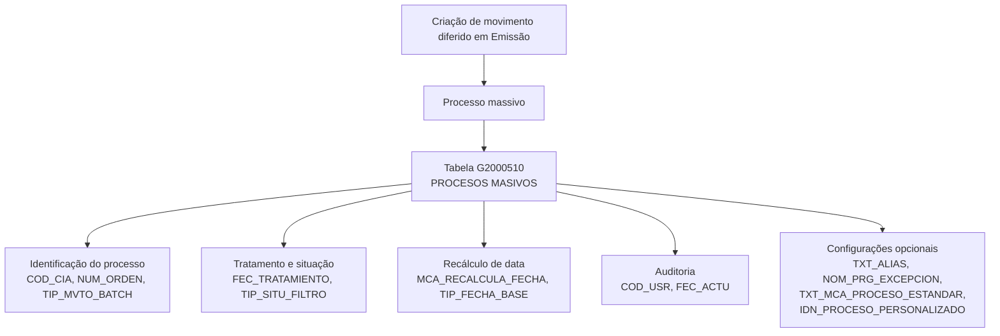

# Criação de Movimento Diferido em Emissão — Visão Técnica e Modelo de Dados

## 1. Metadados do Documento
- **Arquivo de Origem:** Não informado; conteúdo bruto fornecido pelo usuário
- **Tipo de Documento:** Especificação Técnica — em construção
- **Domínio / Sistema:** Reef / Mapfre — Emissão e processos massivos
- **Público-Alvo:** Desenvolvedores, Arquitetos e Operação
- **Data/Versão Identificada:** Não identificada

---

## 2. Resumo Executivo & Contexto de Negócio

O documento descreve, em visão técnica, a criação de um movimento diferido no contexto de Emissão. O material está identificado como “EN CONSTRUCCIÓN”, indicando que a documentação ainda não está finalizada.

O conteúdo disponível concentra-se no modelo de dados envolvido na operação. A tabela identificada é `G2000510`, descrita como tabela de **PROCESOS MASIVOS**, com campos para companhia, data de tratamento, número e tipo do processo massivo, situação do movimento, recálculo de datas, usuário e auditoria de atualização.

A especificação apresenta atributos obrigatórios e opcionais da tabela `G2000510`, além de observações funcionais para alguns campos. Entretanto, o documento não descreve o fluxo operacional completo para criação do movimento diferido, contratos de integração, serviços, métodos HTTP, regras de persistência ou critérios de processamento do movimento.

> **Nota de Análise:** O documento cita a criação de movimento diferido em Emissão, mas o conteúdo extraído detalha exclusivamente a estrutura da tabela `G2000510` para processos massivos.

---

## 3. Arquitetura, Componentes & Tecnologias Envolvidas

Os elementos explicitamente identificados são:

- **Reef:** contexto de documentação apresentado no portal “Documentation / DOCUMENTACIÓN Reef”.
- **Mapfre:** referência organizacional exibida como “Mapfredocument”.
- **Emisión:** contexto funcional da criação de movimento diferido.
- **G2000510:** tabela de processos massivos envolvida na operação.
- **Processo massivo:** entidade operacional registrada pela tabela `G2000510`.
- **Procedimento de exceção:** referido pelo campo `NOM_PRG_EXCEPCION`, sem detalhamento técnico adicional.
- **Processo padrão:** referido pelo campo `TXT_MCA_PROCESO_ESTANDAR`.
- **Processo personalizado:** referido pelo campo `IDN_PROCESO_PERSONALIZADO`.



> **Nota de Análise:** Não há descrição de microsserviços, APIs, bancos de dados além da tabela `G2000510`, tecnologias de implementação, ambientes, servidores ou integrações externas.

---

## 4. Regras de Negócio, Especificações Funcionais & Processos

### 4.1 Contexto da operação
- A operação documentada é a criação de um movimento diferido em Emissão.
- A tabela associada à operação é `G2000510`.
- A tabela `G2000510` é descrita como **PROCESOS MASIVOS**.

### 4.2 Campos obrigatórios
Os seguintes campos são marcados como obrigatórios no conteúdo extraído:

1. `COD_CIA`: companhia.
2. `FEC_TRATAMIENTO`: data em que é realizado o processo massivo.
3. `NUM_ORDEN`: número do processo massivo.
4. `TIP_MVTO_BATCH`: tipo do processo massivo.
5. `TIP_SITU_FILTRO`: situação do movimento.
6. `MCA_RECALCULA_FECHA`: marca que indica se é utilizada como base uma data já calculada ou se a data deve ser recalculada.
7. `COD_USR`: usuário que atualizou a linha.

### 4.3 Campos opcionais
Os seguintes campos são marcados como não obrigatórios:

1. `TXT_ALIAS`: nome que se deseja atribuir ao processo.
2. `NOM_PRG_EXCEPCION`: procedimento de exceção.
3. `TIP_FECHA_BASE`: indica em que data será baseado o recálculo de data.
4. `FEC_ACTU`: data de atualização da linha.
5. `TXT_MCA_PROCESO_ESTANDAR`: aplicável a processo padrão.
6. `IDN_PROCESO_PERSONALIZADO`: identificador do processo massivo.

### 4.4 Regras e valores explicitamente documentados
- `TIP_SITU_FILTRO` assume o valor `1 - Sin filtrar`, conforme o texto extraído.
- `MCA_RECALCULA_FECHA` controla se o processamento utiliza a data previamente calculada ou se realiza um novo cálculo de data.
- `TIP_FECHA_BASE` complementa o recálculo, indicando a data-base aplicável; porém, não é obrigatório.
- O documento não define os domínios completos de valores, tipos físicos, tamanhos de colunas, chaves, índices ou relacionamentos da tabela `G2000510`.

---

## 5. Tabelas de Parâmetros, Ambientes e Estruturas de Dados

### 5.1 Tabela `G2000510` — Processos Massivos

| Item / Parâmetro | Descrição / Função | Tipo / Valores / Formato | Ambiente / Observações |
| :--- | :--- | :--- | :--- |
| `G2000510` | Tabela envolvida na operação de criação de movimento diferido em Emissão. | Tabela de dados. | Descrita como `PROCESOS MASIVOS`. |
| `COD_CIA` | Companhia. | Valor não detalhado. | Obrigatório: Sim. |
| `FEC_TRATAMIENTO` | Data em que é realizado o processo massivo. | Data não detalhada. | Obrigatório: Sim. |
| `NUM_ORDEN` | Número do processo massivo. | Valor não detalhado. | Obrigatório: Sim. |
| `TIP_MVTO_BATCH` | Tipo do processo massivo. | Valor não detalhado. | Obrigatório: Sim. |
| `TXT_ALIAS` | Nome que se deseja dar ao processo. | Texto não detalhado. | Obrigatório: Não. |
| `TIP_SITU_FILTRO` | Situação do movimento. | O documento indica o valor `1 - Sin filtrar`. | Obrigatório: Sim. |
| `NOM_PRG_EXCEPCION` | Procedimento de exceção. | Nome ou referência não detalhada. | Obrigatório: Não. |
| `MCA_RECALCULA_FECHA` | Indica se deve ser usada como base a data já calculada ou se a data deve ser recalculada. | Marca; valores não detalhados. | Obrigatório: Sim. |
| `TIP_FECHA_BASE` | Indica a data-base utilizada para o recálculo de data. | Valor não detalhado. | Obrigatório: Não. |
| `COD_USR` | Usuário que atualizou a linha. | Identificador não detalhado. | Obrigatório: Sim. |
| `FEC_ACTU` | Data de atualização da linha. | Data não detalhada. | Obrigatório: Não. |
| `TXT_MCA_PROCESO_ESTANDAR` | Campo aplicável a processo padrão. | Texto ou marca não detalhados. | Obrigatório: Não. |
| `IDN_PROCESO_PERSONALIZADO` | Identificador do processo massivo. | Identificador não detalhado. | Obrigatório: Não. |

### 5.2 Informações de ambiente e rastreabilidade

| Item / Parâmetro | Descrição / Função | Tipo / Valores / Formato | Ambiente / Observações |
| :--- | :--- | :--- | :--- |
| Documentação | Portal exibido como `Documentation / DOCUMENTACIÓN Reef`. | Portal de documentação. | Referência a Reef. |
| Owner | `user:agonzalez_mapfre.com` | Identificador exibido no conteúdo. | A fonte não detalha responsabilidades do proprietário. |
| Lifecycle | `Approved` | Status exibido no conteúdo. | Sem explicação adicional. |
| Idioma | `ES` | Espanhol. | O conteúdo técnico original está em espanhol. |

> **Nota de Análise:** Não foram identificadas URLs, nomes de servidores, portas, credenciais, caminhos de log, configurações de ambiente ou variáveis de execução.

---

## 6. Bateria de Perguntas & Respostas para RAG (FAQ Sintético)

### P1: Qual tabela participa da criação de movimento diferido em Emissão?
**R:** A tabela identificada no documento é `G2000510`, descrita como `PROCESOS MASIVOS`. O conteúdo associa essa tabela à visão técnica da criação de movimento diferido em Emissão.

### P2: Qual é a finalidade do campo `FEC_TRATAMIENTO` em `G2000510`?
**R:** `FEC_TRATAMIENTO` representa a data em que o processo massivo é realizado. O documento marca esse campo como obrigatório.

### P3: Quais campos obrigatórios identificam um processo massivo na tabela `G2000510`?
**R:** O documento marca como obrigatórios os campos `COD_CIA`, `FEC_TRATAMIENTO`, `NUM_ORDEN`, `TIP_MVTO_BATCH`, `TIP_SITU_FILTRO`, `MCA_RECALCULA_FECHA` e `COD_USR`.

### P4: Para que serve o campo `TXT_ALIAS`?
**R:** `TXT_ALIAS` permite informar o nome que se deseja atribuir ao processo. O documento marca `TXT_ALIAS` como não obrigatório.

### P5: Qual valor é indicado para `TIP_SITU_FILTRO`?
**R:** O conteúdo extraído indica que `TIP_SITU_FILTRO` toma o valor `1 - Sin filtrar`. O campo representa a situação do movimento e é obrigatório.

### P6: Como o documento trata o recálculo de data?
**R:** O campo obrigatório `MCA_RECALCULA_FECHA` indica se o processo deve usar como base uma data já calculada ou se deve recalcular a data. O campo opcional `TIP_FECHA_BASE` indica a data que será utilizada como base para esse recálculo.

### P7: Qual campo registra o usuário que atualizou a linha?
**R:** O campo `COD_USR` registra o usuário que atualizou a linha da tabela `G2000510`. O documento o classifica como obrigatório.

### P8: O documento descreve APIs ou métodos HTTP para criar o movimento diferido?
**R:** Não. O documento não apresenta APIs, métodos HTTP, contratos JSON, endpoints, microsserviços ou protocolos de integração relacionados à criação do movimento diferido.

### P9: O que representa `NOM_PRG_EXCEPCION`?
**R:** `NOM_PRG_EXCEPCION` é descrito como um procedimento de exceção. O documento não detalha o nome, a lógica, os critérios de acionamento ou a implementação desse procedimento. O campo é opcional.

### P10: Há auditoria de atualização na tabela `G2000510`?
**R:** Sim. `COD_USR` identifica o usuário que atualizou a linha e é obrigatório. `FEC_ACTU` representa a data de atualização da linha e é opcional.

### P11: O que o documento informa sobre processos padrão e personalizados?
**R:** O documento apresenta `TXT_MCA_PROCESO_ESTANDAR` como campo aplicável a processo padrão e `IDN_PROCESO_PERSONALIZADO` como identificador do processo massivo. Ambos são campos não obrigatórios e não possuem detalhamento adicional.

---

## 7. Glossário de Termos, Siglas & Conceitos-Chave

- **Emisión:** contexto funcional no qual é prevista a criação de um movimento diferido.
- **G2000510:** tabela descrita como `PROCESOS MASIVOS`.
- **Processo massivo:** processo registrado e identificado por campos como data de tratamento, número de ordem e tipo de movimento batch.
- **Movimento diferido:** operação mencionada no título da visão técnica; a lógica funcional não é detalhada.
- **`COD_CIA`:** campo de companhia.
- **`FEC_TRATAMIENTO`:** campo de data de realização do processo massivo.
- **`NUM_ORDEN`:** campo de número do processo massivo.
- **`TIP_MVTO_BATCH`:** campo de tipo do processo massivo.
- **`TIP_SITU_FILTRO`:** campo de situação do movimento.
- **`MCA_RECALCULA_FECHA`:** campo que controla o uso ou recálculo da data.
- **`TIP_FECHA_BASE`:** campo que indica a data-base para recálculo.
- **`COD_USR`:** campo de usuário que atualizou a linha.
- **`FEC_ACTU`:** campo de data de atualização da linha.
- **`NOM_PRG_EXCEPCION`:** campo de procedimento de exceção.
- **`TXT_MCA_PROCESO_ESTANDAR`:** campo aplicável a processo padrão.
- **`IDN_PROCESO_PERSONALIZADO`:** campo de identificador do processo massivo.
- **Reef:** nome citado na documentação e na navegação do portal de origem.
- **Mapfre:** referência corporativa exibida no conteúdo de origem.

---

## 8. Notas Críticas, Riscos & Limitações

- O documento está explicitamente marcado como `EN CONSTRUCCIÓN`.
- A extração não especifica a lógica completa de criação do movimento diferido.
- Não há descrição de fluxo de processamento, sequência de operações, critérios de elegibilidade, tratamento de falhas ou comportamento de reprocessamento.
- Não há definição de tipos físicos, tamanhos, chaves, índices, relacionamentos ou restrições de banco de dados para `G2000510`.
- Não há definição completa dos valores permitidos para `TIP_MVTO_BATCH`, `TIP_SITU_FILTRO`, `MCA_RECALCULA_FECHA` ou `TIP_FECHA_BASE`.
- Não foram documentados APIs, endpoints, serviços, contratos de mensagem, autenticação, logs, monitoramento ou ambientes.
- O texto apresenta `IDN_PROCESO_PERSONALIZADO` como “identificador do processo massivo”, apesar do nome do campo indicar processo personalizado; o documento não esclarece essa possível ambiguidade.

---

## 9. Conteúdo Bruto Estruturado (Referência Fiel)

```text
--- [PÁGINA 1 DE 2] ---

EN CONSTRUCCIÓN
CREAR movimiento diferido en Emisión (visión técnica)
Modelo de datos involucrado
Las tablas que intervienen en esta operación son:
G2000510
TABLA DESCRIPCIÓN
G2000510 PROCESOS MASIVOS
COLUMNA CAMBIA
VALOR
MOTIVO/VALOR OBLIGATORIA COMENTARIO
COD_CIA S N.A. SI COMPANIA
FEC_TRATAMIENTO S N.A. SI FECHA EN LA QUE SE REALIZA EL
PROCESO MASIVO
NUM_ORDEN S N.A. SI NUMERO DEL PROCESO MASIVO
TIP_MVTO_BATCH S N.A. SI TIPO DEL PROCESO MASIVO
TXT_ALIAS S N.A. NO NOMBRE QUE SE QUIERA DAR AL
PROCESO
TIP_SITU_FILTRO S Toma el valor 1-
Sin filtrar
SI SITUACION DEL MOVIMIENTO
NOM_PRG_EXCEPCION S N.A. NO PROCEDIMIENTO DE EXCEPCION
Documentation / DOCUMENTACIÓN Reef
DOCUMENTACIÓN Reef
Mapfredocument
DOCUMENTACIÓN Reef
Owner
user:agonzalez_mapfre.com
Lifecycle
Approved Source
 /
VL
Buscar Inicio Soluciones Arquitecturas APIs Componentes Cloud Documentación Zeus Reef Ayuda
ES


--- [PÁGINA 2 DE 2] ---

COLUMNA CAMBIA
VALOR
MOTIVO/VALOR OBLIGATORIA COMENTARIO
MCA_RECALCULA_FECHA S N.A. SI MARCA QUE INDICA SI SE TOMA
COMO BASE LA FECHA QUE YA
ESTA CALCULADO O SE VUELVE A
CALCULAR
TIP_FECHA_BASE S N.A. NO INDICA EN BASE A QUE FECHA SE
HARA EL RECALCULO DE LA FECHA
COD_USR S N.A. SI USUARIO QUE ACTUALIZO LA FILA
FEC_ACTU S N.A. NO FECHA DE ACTUALIZACION DE LA
FILA
TXT_MCA_PROCESO_ESTANDAR S N.A. NO APLICA PROCESO ESTANDAR
IDN_PROCESO_PERSONALIZADO S N.A. NO IDENTIFICADOR DEL PROCESO
MASIVO
```
