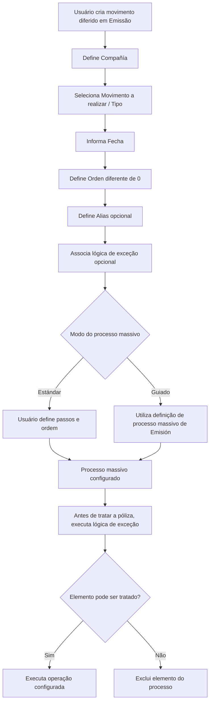

# Criação de Movimento Diferido em Emissão — Processo Massivo no Reef

## 1. Metadados do Documento
- **Arquivo de Origem:** Não identificado no conteúdo fornecido
- **Tipo de Documento:** Procedimento / Especificação Funcional
- **Domínio / Sistema:** Reef / Emissão / Processos Massivos
- **Público-Alvo:** Operação, Analistas Funcionais, Desenvolvedores e Arquitetos
- **Data/Versão Identificada:** Não identificada

---

## 2. Resumo Executivo & Contexto de Negócio

O documento descreve a criação de um **movimento diferido em Emissão** no sistema Reef. Essa ação é o primeiro passo obrigatório para criar um processo massivo e tem como objetivo gerar as informações necessárias para que um movimento seja executado posteriormente, de forma diferida.

A configuração do processo massivo requer propriedades gerais, propriedades que determinam a operação a realizar e propriedades adicionais. A propriedade geral central é a **Compañía**, que identifica a entidade na qual a operação diferida será lançada.

O tipo de movimento determina o comportamento funcional do processo massivo. Os movimentos abrangem emissão de orçamentos, apólices e aplicações; renovação; alterações; cancelamentos por falta de pagamento; decisões de controle técnico; regularização de vida; suspensão de aportação pactada; e alteração de gestor de cobrança para recibos impagados.

A data configurada possui relevância variável conforme a operação. Em cancelamento por falta de pagamento, identifica a data até a qual um recibo deve estar cobrado para não seguir ao processo de cancelamento. Em renovação, identifica quando uma apólice deve estar vencida para ingressar no processo de renovação.

O sistema também suporta processos massivos livres/estándar e guiados. O modo guiado depende de uma definição de processo massivo de Emissão. Adicionalmente, uma lógica de negócio de exceção pode excluir elementos do processamento imediatamente antes do tratamento da apólice.

---

## 3. Arquitetura, Componentes & Tecnologias Envolvidas

Os elementos explicitamente citados são:

- **Reef:** sistema ou domínio documental no qual a criação do movimento diferido é descrita.
- **Emisión:** área funcional responsável pelas operações de emissão, alteração, renovação, anulação e demais movimentos relacionados a apólices, aplicações, orçamentos e declarações.
- **Processo massivo:** processo configurado para tratar múltiplos elementos em uma data e ordem determinadas.
- **Movimento diferido:** informação criada previamente para permitir a execução posterior de uma operação.
- **Objeto exceção:** lógica de negócio associável ao processo para excluir elementos antes de seu tratamento.
- **Proceso estándar:** modo livre no qual o usuário define os passos e, quando aplicável, a ordem de criação do processo massivo.
- **Proceso personalizado:** chave que vincula o processo personalizado associado ao processo massivo e determina o modo seguido pelo processo.



> **Nota de Análise:** O documento não especifica interfaces, APIs, métodos HTTP, contratos JSON, bases de dados, filas, tecnologias de implementação ou detalhes de integração entre componentes.

---

## 4. Regras de Negócio, Especificações Funcionais & Processos

### Criação obrigatória do movimento diferido

1. A criação de um movimento diferido é o primeiro passo necessário para criar um processo massivo.
2. A ação é obrigatória para a criação do processo massivo.
3. O movimento diferido gera a informação necessária para executar posteriormente um movimento.

### Propriedades gerais

1. A propriedade **Compañía** identifica a entidade na qual a operação diferida será lançada.

### Propriedades que determinam a operação: Tipo

O campo **Movimiento a realizar** determina a operação que será realizada de forma diferida.

- **CARGA DE PRESUPUESTO:** gera uma nova proposta; executa a operação **EMITIR presupuesto**.
- **CARGA DE PÓLIZA:** gera uma nova apólice; executa a operação **EMITIR póliza**.
- **CARGA DE APLICACIÓN:** gera uma nova apólice com as condições de sua apólice marco; executa a operação **EMITIR aplicación**.
- **CONVERSIÓN DE RENOVACIONES:** gera uma nova apólice simulando o processo de renovação. Embora crie uma nova apólice, não executa **CREAR póliza**; executa **RENOVAR póliza**.
- **PRESUPUESTO DE SUPLEMENTO:** gera uma proposta de nova modificação; executa **EMITIR presupuesto de suplemento**.
- **PRESUPUESTO DE SUPLEMENTO APLICACIÓN:** gera uma proposta de nova modificação de aplicação; executa **EMITIR declaración**.
- **SUPLEMENTO:** gera uma nova modificação em uma apólice; executa **ALTERAR póliza**.
- **SUPLEMENTO DE APLICACIÓN:** gera uma nova modificação em uma aplicação; executa **ALTERAR aplicación**.
- **RENOVACIÓN:** gera um novo período de vigência de uma apólice; executa **RENOVAR póliza**.
- **ANULACIÓN POR FALTA DE PAGO:** gera um ou vários suplementos por apólice que cancelam total ou parcialmente a apólice devido ao não pagamento, pelo cliente, dos recibos gerados por novas apólices ou novos suplementos. Pode gerar:
  - **ANULAR póliza**
  - **ANULAR aplicación**
  - **ANULAR póliza modificación**
  - **ANULAR aplicación modificación**
- **ALTERAR PÓLIZA DESDE PRESUPUESTO:** gera uma modificação de apólice com informações de um orçamento de suplemento; executa **ALTERAR póliza**.
- **ALTERAR APLICACIÓN DESDE PRESUPUESTO:** gera uma modificação de aplicação com informações de um orçamento de suplemento; executa **ALTERAR aplicación**.
- **AUTORIZA O RECHAZA CONTROL TÉCNICO PÓLIZA:** permite autorizar ou rejeitar apólices/aplicações que possuem erros e exigem decisão humana. Pode gerar:
  - **AUTORIZAR póliza**
  - **AUTORIZAR aplicación**
  - **RECHAZAR póliza**
  - **RECHAZAR aplicación**
- **AUTORIZA O RECHAZA CONTROL TÉCNICO PRESUPUESTO:** permite autorizar ou rejeitar orçamentos com erros que exigem decisão humana. Pode gerar:
  - **AUTORIZAR presupuesto**
  - **AUTORIZAR declaración**
  - **RECHAZAR presupuesto**
  - **RECHAZAR declaración**
- **AUTORIZA O RECHAZA CONTROL TÉCNICO PRE-RENOVACIÓN:** permite autorizar ou rejeitar pré-renovações que possuem erros e exigem decisão humana. Pode gerar:
  - **AUTORIZAR pre-renovación**
  - **RECHAZAR pre-renovación**
- **REGULARIZACIÓN VIDA:** gera uma modificação em uma apólice para permitir o cálculo da prima de risco em apólices Unit Linked; executa **ALTERAR póliza**.
- **SUSPENSIÓN APORTACIÓN PACTADA:** gera uma modificação de apólice suspendendo o plano de aportação periódico quando existe um número de aportações não pagas pelo cliente; executa **ALTERAR póliza**.
- **RECIBOS IMPAGADOS:** altera o gestor de cobrança de um ou vários recibos por apólice devido ao não pagamento; executa **CAMBIAR recibo prima gestor**.

### Regra para a data

1. A propriedade **Fecha** possui relevância dependente do tipo de operação.
2. Em **Cancelación por falta de pago**, a data indica o dia em que um recibo deve estar cobrado.
3. Se o recibo não estiver cobrado nessa data, o recibo seguirá para o processo de cancelamento.
4. Em **Renovación**, a data determina quando a apólice deve estar vencida.
5. Se uma apólice estiver vencida nessa data, a apólice seguirá para o processo de renovação.

### Propriedades adicionais

1. **Orden** diferencia processos massivos criados para a mesma data.
2. O valor **0** da propriedade **Orden** é reservado e não deve ser utilizado.
3. **Alias** permite criar uma descrição para conter informações específicas sobre o processo massivo.
4. **Lógica de negocio de excepción (Objeto excepción)** permite associar uma lógica de negócio que determine quais elementos serão excluídos do processo.
5. A lógica de exceção é executada imediatamente antes de tratar a apólice.
6. Em um processo massivo de renovação, a lógica de exceção é executada antes de renovar a apólice.
7. A lógica de exceção deve determinar se a apólice pode ou não ser tratada no processo massivo.
8. O modo **Estándar** permite que cada usuário determine os passos e, quando aplicável, a ordem de criação do processo massivo.
9. O modo **Guiado** determina especificamente os passos que devem ser seguidos.
10. O modo **Guiado** requer uma **DEFINICIÓN de proceso masivo de Emisión**.
11. **Proceso personalizado** é a chave que vincula o processo personalizado associado ao processo massivo criado.
12. O atributo **Proceso personalizado** determina o modo que o processo massivo seguirá.

---

## 5. Tabelas de Parâmetros, Ambientes e Estruturas de Dados

| Item / Parâmetro | Descrição / Função | Tipo / Valores / Formato | Ambiente / Observações |
| :--- | :--- | :--- | :--- |
| Compañía | Entidade na qual a operação diferida será lançada. | Entidade | Propriedade geral. |
| Movimiento a realizar | Define a operação executada de forma diferida. | Tipo de movimento massivo | Propriedade que determina a operação. |
| Fecha | Data usada na seleção ou transição de elementos conforme o movimento. | Data | Relevância varia conforme a operação. |
| Orden | Diferencia processos massivos criados na mesma data. | Valor numérico | O valor `0` é reservado e não deve ser utilizado. |
| Alias | Descrição informativa do processo massivo. | Texto | Exemplo apresentado: “Renovación de agosto”. |
| Lógica de negocio de excepción | Determina quais elementos serão excluídos antes do tratamento. | Objeto exceção / lógica de negócio | Executada imediatamente antes de tratar a apólice. |
| Aplica proceso estándar | Define o modo de criação do processo massivo. | Estándar ou Guiado | O modo guiado requer definição de processo massivo de Emisión. |
| Proceso personalizado | Chave que vincula o processo personalizado ao processo massivo. | Chave | Determina o modo seguido pelo processo massivo. |

| Movimento a realizar | Resultado descrito | Operação executada |
| :--- | :--- | :--- |
| CARGA DE PRESUPUESTO | Gera nova proposta. | EMITIR presupuesto |
| CARGA DE PÓLIZA | Gera nova apólice. | EMITIR póliza |
| CARGA DE APLICACIÓN | Gera nova apólice com condições da apólice marco. | EMITIR aplicación |
| CONVERSIÓN DE RENOVACIONES | Gera nova apólice simulando renovação. | RENOVAR póliza |
| PRESUPUESTO DE SUPLEMENTO | Gera proposta de nova modificação. | EMITIR presupuesto de suplemento |
| PRESUPUESTO DE SUPLEMENTO APLICACIÓN | Gera proposta de nova modificação de aplicação. | EMITIR declaración |
| SUPLEMENTO | Gera nova modificação em apólice. | ALTERAR póliza |
| SUPLEMENTO DE APLICACIÓN | Gera nova modificação em aplicação. | ALTERAR aplicación |
| RENOVACIÓN | Gera novo período de vigência de uma apólice. | RENOVAR póliza |
| ANULACIÓN POR FALTA DE PAGO | Cancela total ou parcialmente uma apólice devido a recibos não pagos. | ANULAR póliza; ANULAR aplicación; ANULAR póliza modificación; ANULAR aplicación modificación |
| ALTERAR PÓLIZA DESDE PRESUPUESTO | Gera alteração de apólice a partir de orçamento de suplemento. | ALTERAR póliza |
| ALTERAR APLICACIÓN DESDE PRESUPUESTO | Gera alteração de aplicação a partir de orçamento de suplemento. | ALTERAR aplicación |
| AUTORIZA O RECHAZA CONTROL TÉCNICO PÓLIZA | Decide sobre apólices/aplicações com erros. | AUTORIZAR ou RECHAZAR póliza/aplicación |
| AUTORIZA O RECHAZA CONTROL TÉCNICO PRESUPUESTO | Decide sobre orçamentos com erros. | AUTORIZAR ou RECHAZAR presupuesto/declaración |
| AUTORIZA O RECHAZA CONTROL TÉCNICO PRE-RENOVACIÓN | Decide sobre pré-renovações com erros. | AUTORIZAR ou RECHAZAR pre-renovación |
| REGULARIZACIÓN VIDA | Permite cálculo da prima de risco em apólices Unit Linked. | ALTERAR póliza |
| SUSPENSIÓN APORTACIÓN PACTADA | Suspende plano de aportação periódico por aportações não pagas. | ALTERAR póliza |
| RECIBOS IMPAGADOS | Muda gestor de cobrança de recibos não pagos. | CAMBIAR recibo prima gestor |

---

## 6. Bateria de Perguntas & Respostas para RAG (FAQ Sintético)

### P1: Qual é a finalidade da criação de um movimento diferido em Emissão?
**R:** A criação de um movimento diferido gera as informações necessárias para executar um movimento posteriormente. Essa ação é o primeiro passo obrigatório para criar um processo massivo.

### P2: Qual propriedade identifica a entidade na qual a operação diferida será lançada?
**R:** A propriedade **Compañía** identifica a entidade na qual a operação diferida será lançada.

### P3: Qual movimento deve ser usado para criar uma nova apólice simulando o processo de renovação?
**R:** Deve ser usado o movimento **CONVERSIÓN DE RENOVACIONES**. Embora o processo crie uma nova apólice, a operação executada é **RENOVAR póliza**, e não **CREAR póliza**.

### P4: Como a data é utilizada no processo de cancelamento por falta de pagamento?
**R:** Em **Cancelación por falta de pago**, a data indica o dia em que um recibo deve estar cobrado. Se o recibo não estiver cobrado nessa data, seguirá para o processo de cancelamento.

### P5: Como a data é utilizada no processo de renovação?
**R:** Em **Renovación**, a data determina quando uma apólice deve estar vencida. Se a apólice estiver vencida nessa data, seguirá para o processo de renovação.

### P6: Qual valor não pode ser utilizado no campo Orden?
**R:** O valor **0** é reservado no campo **Orden** e não deve ser utilizado. O campo Orden diferencia processos massivos criados na mesma data.

### P7: Quando a lógica de negócio de exceção é executada?
**R:** A lógica de negócio de exceção é executada imediatamente antes de tratar a apólice. Em um processo massivo de renovação, a lógica é executada antes de renovar a apólice e deve determinar se a apólice pode ou não ser tratada.

### P8: Qual é a diferença entre um processo massivo estándar e um processo massivo guiado?
**R:** No modo **Estándar**, o processo é livre e o usuário define os passos e, quando aplicável, sua ordem. No modo **Guiado**, os passos são especificamente determinados e é necessária uma **DEFINICIÓN de proceso masivo de Emisión**.

### P9: Quais operações podem ser geradas pelo controle técnico de apólice?
**R:** O movimento **AUTORIZA O RECHAZA CONTROL TÉCNICO PÓLIZA** pode gerar as operações **AUTORIZAR póliza**, **AUTORIZAR aplicación**, **RECHAZAR póliza** e **RECHAZAR aplicación**.

### P10: O que faz o movimento RECIBOS IMPAGADOS?
**R:** O movimento **RECIBOS IMPAGADOS** realiza a mudança de gestor de cobrança para um ou vários recibos de uma apólice devido ao não pagamento desses recibos. A operação executada é **CAMBIAR recibo prima gestor**.

### P11: Qual movimento permite o cálculo da prima de risco em apólices Unit Linked?
**R:** O movimento **REGULARIZACIÓN VIDA** gera uma nova modificação em uma apólice para permitir o cálculo da prima de risco em apólices Unit Linked. A operação executada é **ALTERAR póliza**.

### P12: Para que serve o campo Proceso personalizado?
**R:** O campo **Proceso personalizado** é uma chave que vincula o processo personalizado associado ao processo massivo que está sendo criado. Esse atributo determina o modo que o processo massivo seguirá.

---

## 7. Glossário de Termos, Siglas & Conceitos-Chave

- **Alias:** descrição que permite identificar ou acrescentar informação concreta sobre um processo massivo.
- **Aplicación:** entidade de negócio citada nas operações de emissão, alteração, anulação, autorização e rejeição.
- **Compañía:** entidade na qual a operação diferida será lançada.
- **Emisión:** contexto funcional no qual são criados movimentos diferidos e processos massivos.
- **Fecha:** data cuja relevância depende do tipo de operação configurado.
- **Movimiento diferido:** informação criada para permitir a execução posterior de uma operação.
- **Objeto excepción:** lógica de negócio usada para excluir elementos de um processo massivo antes de seu tratamento.
- **Orden:** propriedade que diferencia processos massivos definidos para a mesma data.
- **Póliza:** entidade de apólice tratada nas operações de emissão, alteração, renovação, anulação e controle técnico.
- **Presupuesto:** proposta ou orçamento associado a operações de emissão, suplemento e controle técnico.
- **Proceso masivo:** processo configurado para tratar múltiplos elementos de forma massiva.
- **Proceso estándar:** modo livre de criação do processo massivo, no qual o usuário define passos e ordem quando possível.
- **Proceso guiado:** modo de criação com passos definidos, dependente de uma definição de processo massivo de Emisión.
- **Proceso personalizado:** chave associada ao processo massivo que determina o modo seguido pelo processo.
- **Recibo:** item de cobrança que pode ser avaliado para cancelamento por falta de pagamento ou alteração de gestor de cobrança.
- **Suplemento:** modificação associada a uma apólice ou aplicação.
- **Unit Linked:** tipo de apólice citado no contexto do cálculo da prima de risco.

---

## 8. Notas Críticas, Riscos & Limitações

- O documento não identifica o nome do arquivo de origem, data, versão, autor técnico, ambiente ou URL operacional.
- O documento não descreve APIs, contratos de dados, mensagens, métodos HTTP, persistência, autenticação ou integrações externas.
- O valor `0` de **Orden** é reservado e não deve ser usado; seu uso pode impedir a diferenciação correta de processos configurados para a mesma data.
- A definição incorreta de **Fecha** pode afetar a seleção de recibos para cancelamento por falta de pagamento ou a seleção de apólices para renovação.
- A lógica de exceção pode excluir apólices do processo massivo, pois é executada antes do tratamento da apólice.
- O modo **Guiado** depende de uma **DEFINICIÓN de proceso masivo de Emisión**, cujo conteúdo e mecanismo de configuração não são detalhados.
- **Nota de Análise:** O documento cita o atributo **Proceso personalizado**, mas não especifica seu formato, catálogo de valores, validações ou mecanismo de vínculo.
- **Nota de Análise:** O documento não detalha como são tratados erros, reprocessamentos, concorrência, auditoria, permissões ou monitoramento de processos massivos.

---

## 9. Conteúdo Bruto Estruturado (Referência Fiel)

```text
--- [PÁGINA 1 DE 4] ---

CREAR movimiento diferido en Emisión (enlace con visión técnica)
¿En que consiste?
Esta acción supone el primer paso que se debe realizar para crear un proceso masivo. Esta acción además, es obligatoria realizarla.
Objetivo
Genera la información necesaria que permitirá realizar un movimiento que se ejecutará de forma diferida.
Proceso a seguir
En este caso hay indicar información a las siguientes propiedades:
Propiedades generales
Propiedades que determinan la operación a realizar
Propiedades adicionales a la operación
Documentation / DOCUMENTACIÓN Reef
DOCUMENTACIÓN Reef
Mapfredocument
DOCUMENTACIÓN Reef
Owner
user:agonzalez_mapfre.com
Lifecycle
Approved Source
 /
 VL
Buscar Inicio Soluciones Arquitecturas APIs Componentes Cloud Documentación Zeus Reef Ayuda
ES


--- [PÁGINA 2 DE 4] ---

Propiedades generales
Compañía
Entidad en la que se lanzará la operación en diferido.
Propiedades que determinan la operación a realizar (Tipo)
Movimiento a realizar
Determina la operación que se realizará en diferido. Los posibles movimientos se encuentran detalladas a continuación.
CARGA DE PRESUPUESTO
Genera un nueva propuesta, por lo que la operación que se ejecuta es EMITIR presupuesto.
CARGA DE PÓLIZA
Genera una nueva póliza. La operación que se ejecuta es EMITIR póliza.
CARGA DE APLICACIÓN
Genera una nueva póliza con las condiciones de su póliza marco. La operación que se ejecuta es EMITIR aplicación.
CONVERSIÓN DE RENOVACIONES
Genera una póliza nueva simulando el proceso de renovación. Esto signica que, aunque se crea una nueva póliza, la operación que se
ejecuta no es de CREAR póliza, sino que se ejecuta la operación RENOVAR póliza.
PRESUPUESTO DE SUPLEMENTO
Genera una propuesta de nueva modicación. La operación que se ejecuta es EMITIR presupuesto de suplemento.
PRESUPUESTO DE SUPLEMENTO APLICACIÓN
Genera una propuesta de nueva modicación de aplicación. La operación que se ejecuta es EMITIR declaración.
SUPLEMENTO
Genera una nueva modicación a una póliza. La operación que se ejecuta es ALTERAR póliza.
SUPLEMENTO DE APLICACIÓN
Genera una nueva modicación a una aplicación. La operación que se ejecuta es ALTERAR aplicación.
RENOVACIÓN
Genera un nuevo periodo de vigencia a una póliza. La operación que se ejecuta es RENOVAR póliza.
ANULACIÓN POR FALTA DE PAGO
Genera uno o varios suplementos (por póliza),que cancelan total (la póliza) o parcialmente (el suplemento o los suplementos) la póliza
debido a que los recibos generados tanto por nuevas pólizas, como por nuevos suplementos, el cliente no los ha pagado. Este proceso puede
generar distintas operaciones:
ANULAR póliza
ANULAR aplicación
ANULAR póliza modicación
ANULAR aplicación modicación
ALTERAR PÓLIZA DESDE PRESUPUESTO
Genera una nueva modicación a una póliza con la información contenida en un presupuesto de un suplemento. La operación que se ejecuta
es ALTERAR póliza.
ALTERAR APLICACIÓN DESDE PRESUPUESTO
Genera una nueva modicación de una aplicación con la información contenida en un presupuesto de un suplemento. La operación que se
ejecuta es ALTERAR aplicación.
AUTORIZA O RECHAZA CONTROL TÉCNICO PÓLIZA


--- [PÁGINA 3 DE 4] ---

Permite la autorización o el rechazo de aquellas pólizas/aplicaciones que tienen errores y estos errores cuando se producen, alguna persona
debe determinar si se permite o no la operación. El proceso puede generar distintas operaciones:
AUTORIZAR póliza
AUTORIZAR aplicación
RECHAZAR póliza
RECHAZAR aplicación
AUTORIZA O RECHAZA CONTROL TÉCNICO PRESUPUESTO
Permite la autorización o el rechazo de aquellos presupuestos que tienen errores y estos errores cuando se producen, alguna persona debe
determinar si se permite o no la operación. El proceso puede generar distintas operaciones:
AUTORIZAR presupuesto
AUTORIZAR declaración
RECHAZAR presupuesto
RECHAZAR declaración
AUTORIZA O RECHAZA CONTROL TÉCNICO PRE-RENOVACIÓN
Permite la autorización o el rechazo de aquellas renovaciones previas que tienen errores y estos errores cuando se producen, alguna persona
debe determinar si se permite o no la operación. El proceso puede generar distintas operaciones:
AUTORIZAR pre-renovación
RECHAZAR pre-renovación
REGULARIZACIÓN VIDA
Genera una nueva modicación a una póliza que permite el cálculo de la prima de riego en pólizas de Unit Linked. La operación que se
ejecuta es ALTERAR póliza.
SUSPENSIÓN APORTACIÓN PACTADA
Genera una nueva modicación a una póliza suspendiendo el plan de aportación periódico cuando existe un número de aportaciones que el
cliente no ha pagado. La operación que se ejecuta es ALTERAR póliza.
RECIBOS IMPAGADOS
Realiza el cambio de gestor de cobro a uno o varios recibos (por póliza) debido a que dichos recibos no han sido pagados. La operación que
se ejecuta es CAMBIAR recibo prima gestor
Fecha
Esta fecha dependiendo de la operación a realizar tiene mayor o menor relevancia a la hora de detallarla.
Por ejemplo, para el proceso:
Cancelación por falta de pago. Indica el día en el que un recibo debe estar cobrado. Si un recibo no se encuentra cobrado a esa fecha,
pasará al proceso de cancelación.
Renovación. Determina cuando la póliza debe estar vencida. Si una póliza está vencida a esa fecha, pasa al proceso de renovación
Propiedades adicionales a la operación
Orden
El sistema permite crear más de un proceso masivo en una misma fecha. Esta propiedad es la que diferencia un proceso de otro en un
mismo día. El valor cero (0) está reservado y no se debe utilizar.
Alias
Permite crear una descripción que haga que el proceso masivo denido contenga información concreta.
Por ejemplo, si se dene un proceso masivo que renueve la cartera del mes de agosto, se puede especicar esta propiedad con esta
información (Renovación de agosto).
Lógica de negocio de excepción (Objeto excepción)


--- [PÁGINA 4 DE 4] ---

En este punto se puede asociar una lógica de negocio. Esta lógica estará encargada de determinar que elementos se excluyen del proceso
que se está deniendo.
Por ejemplo, si se va a crear un proceso masivo con la renovación de la cartera de un mes y se desea que la cartera de un cliente quede
excepcionada del proceso masivo porque se va a realizar un estudio y posterior renovación manual, se puede utilizar una lógica que haga
esta tarea.
Esta lógica será lanzada justo antes de tratar la póliza. Es decir, si se está ejecutando un proceso masivo de renovación, esta lógica será
lanzada antes de renovar la póliza. La lógica debe determinar si la póliza puede o no tratarse en el proceso masivo.
Aplica proceso estándar (Proceso estándar)
El sistema permite dos modos en la creación de un proceso masivo:
Estándar: Este proceso es libre. Cada usuario determina que pasos y en que orden (si se puede establecer) realiza la creación del
proceso masivo
Guiado: Este proceso, como su nombre indica está guiado y determina especícamente que pasos hay que seguir. para ello, necesita de
una DEFINICIÓN de proceso masivo de Emisión
Proceso personalizado
Clave que enlaza el proceso personalizado que se asoció a proceso masivo que se está creando.
Este atributo determina el modo que seguirá este proceso masivo.
Checking links...
```
