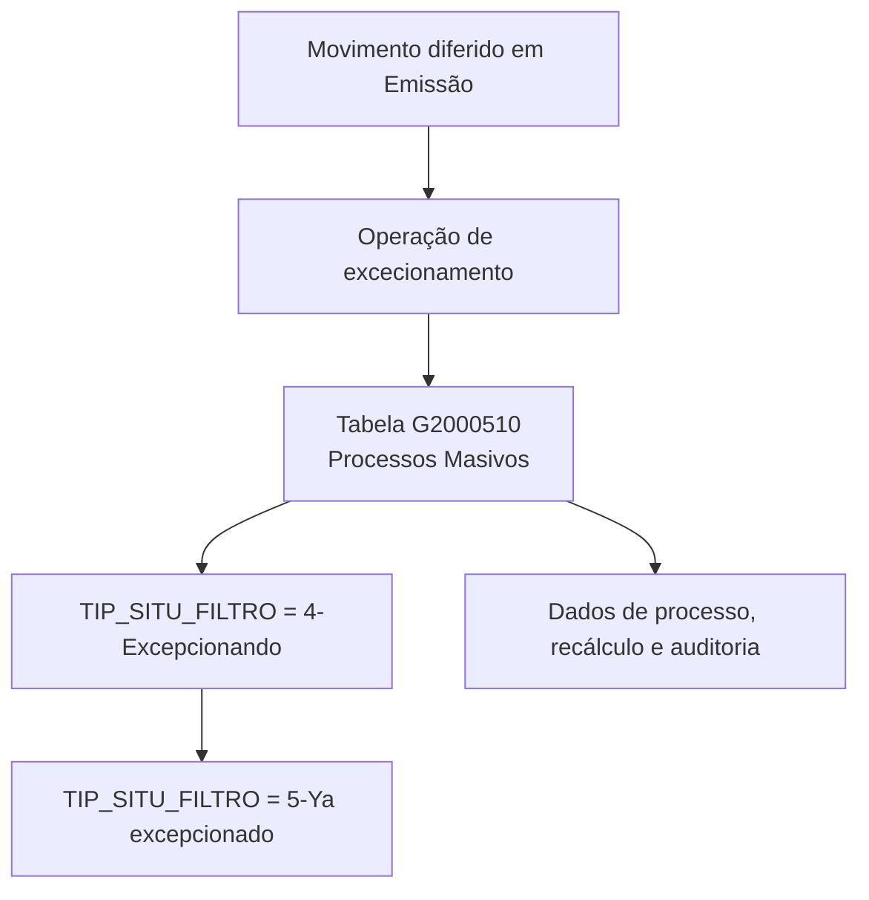

# Excepcionamento de Movimento Diferido em Emissão — Visão Técnica e Modelo de Dados

## 1. Metadados do Documento
- **Arquivo de Origem:** Não identificado; conteúdo extraído apresentado como referência de duas páginas.
- **Tipo de Documento:** Especificação Técnica.
- **Domínio / Sistema:** Reef / Mapfre — processo de excecionamento de movimento diferido em Emissão.
- **Público-Alvo:** Desenvolvedores, Arquitetos, Operação.
- **Data/Versão Identificada:** Não identificada.

---

## 2. Resumo Executivo & Contexto de Negócio

O documento descreve a visão técnica para **excecionar um movimento diferido no contexto de Emissão**. O foco apresentado é o modelo de dados utilizado pela operação, em especial a tabela `G2000510`, identificada como a tabela de **Processos Masivos**.

A operação atualiza informações de um processo massivo associado a uma companhia, uma data de tratamento, um número de ordem e um tipo de movimento batch. O documento também descreve atributos que controlam a situação do movimento, o procedimento de exceção, o recálculo de datas e a rastreabilidade da atualização.

A regra mais relevante explicitamente informada está no campo `TIP_SITU_FILTRO`: durante a operação de excecionamento, o campo pode assumir o valor `4-Excepcionando` e, posteriormente, o valor `5-Ya excepcionado`. Esses valores representam momentos distintos do ciclo de exceção do movimento.

O conteúdo disponibilizado não detalha APIs, métodos HTTP, contratos JSON, serviços de aplicação, jobs, mecanismos de persistência, critérios de seleção dos movimentos ou procedimentos de rollback. A especificação está limitada às colunas e aos significados funcionais descritos para a tabela `G2000510`.

---

## 3. Arquitetura, Componentes & Tecnologias Envolvidas

### Componentes identificados

| Componente | Papel identificado no documento | Observações |
| :--- | :--- | :--- |
| Reef | Repositório ou domínio de documentação associado ao conteúdo. | O texto apresenta referências a “Documentation Reef” e “DOCUMENTACIÓN Reef”. |
| Mapfre | Contexto corporativo identificado na documentação. | O texto contém a referência `Mapfredocument`. |
| Emisión | Contexto funcional da operação de excecionamento de movimento diferido. | Não há detalhamento adicional sobre o módulo de Emissão. |
| `G2000510` | Tabela de dados de processos massivos. | É a única tabela explicitamente identificada. |
| Processo massivo | Entidade operacional registrada na tabela `G2000510`. | Possui identificadores, situação, dados de recálculo e auditoria. |
| Movimento diferido | Movimento submetido à operação de excecionamento. | Não há definição adicional de “movimento diferido”. |

### Fluxo lógico explicitamente identificado



**Nota de Análise:** O documento não identifica microsserviços, aplicações, bancos de dados, URLs, ambientes, protocolos de integração, tecnologias de desenvolvimento ou mecanismos de execução do processo massivo. O diagrama representa exclusivamente a sequência de estados explicitamente descrita para `TIP_SITU_FILTRO`.

---

## 4. Regras de Negócio, Especificações Funcionais & Processos

### Operação de excecionamento

1. A operação está associada ao **excecionamento de um movimento diferido em Emissão**.
2. A tabela envolvida na operação é `G2000510`, descrita como **PROCESOS MASIVOS**.
3. O processo massivo deve estar associado a uma companhia por meio do campo `COD_CIA`.
4. A data em que o processo massivo é realizado é registrada no campo `FEC_TRATAMIENTO`.
5. O número do processo massivo é registrado no campo `NUM_ORDEN`.
6. O tipo do processo é registrado no campo `TIP_MVTO_BATCH`.
7. É possível atribuir um nome ao processo por meio do campo `TXT_ALIAS`, que não é obrigatório.
8. A situação do movimento é controlada pelo campo `TIP_SITU_FILTRO`.
9. Durante a operação, `TIP_SITU_FILTRO` assume inicialmente o valor `4-Excepcionando`.
10. Após a conclusão do excecionamento, `TIP_SITU_FILTRO` assume o valor `5-Ya excepcionado`.
11. O campo `NOM_PRG_EXCEPCION` corresponde ao procedimento de exceção e não é obrigatório.
12. O campo `MCA_RECALCULA_FECHA` indica se a operação toma como base uma data já calculada ou se recalcula a data.
13. O campo `TIP_FECHA_BASE` indica a data que será utilizada como base para o recálculo, quando aplicável.
14. O campo `COD_USR` registra o usuário que atualizou a linha e é obrigatório.
15. O campo `FEC_ACTU` representa a data de atualização da linha e não é obrigatório.
16. O campo `TXT_MCA_PROCESO_ESTANDAR` é descrito como aplicável ao processo padrão e não é obrigatório.
17. O campo `IDN_PROCESO_PERSONALIZADO` identifica o processo massivo personalizado e não é obrigatório.

### Restrições documentadas

- Os campos `COD_CIA`, `FEC_TRATAMIENTO`, `NUM_ORDEN`, `TIP_MVTO_BATCH`, `TIP_SITU_FILTRO`, `MCA_RECALCULA_FECHA` e `COD_USR` estão marcados como obrigatórios.
- O documento não informa os tipos físicos de dados, tamanhos de campos, chaves primárias, chaves estrangeiras, índices ou valores permitidos além dos valores explicitamente indicados para `TIP_SITU_FILTRO`.
- O documento não informa as regras que determinam quando `MCA_RECALCULA_FECHA` deve indicar uso de uma data existente ou recálculo.
- O documento não detalha o comportamento de falha, reprocessamento, concorrência, validações prévias ou reversão do excecionamento.

---

## 5. Tabelas de Parâmetros, Ambientes e Estruturas de Dados

### Tabela envolvida

| Item / Parâmetro | Descrição / Função | Tipo / Valores / Formato | Ambiente / Observações |
| :--- | :--- | :--- | :--- |
| `G2000510` | Tabela de processos massivos. | Tabela de dados. | Utilizada na operação de excecionamento de movimento diferido em Emissão. |

### Estrutura de dados: `G2000510` — Processos Massivos

| Item / Parâmetro | Descrição / Função | Tipo / Valores / Formato | Ambiente / Observações |
| :--- | :--- | :--- | :--- |
| `COD_CIA` | Companhia associada ao processo massivo. | Não informado. | Obrigatório: Sim. Não altera valor segundo o conteúdo apresentado. |
| `FEC_TRATAMIENTO` | Data em que o processo massivo é realizado. | Não informado. | Obrigatório: Sim. Não altera valor segundo o conteúdo apresentado. |
| `NUM_ORDEN` | Número do processo massivo. | Não informado. | Obrigatório: Sim. Não altera valor segundo o conteúdo apresentado. |
| `TIP_MVTO_BATCH` | Tipo do processo. | Não informado. | Obrigatório: Sim. Não altera valor segundo o conteúdo apresentado. |
| `TXT_ALIAS` | Nome atribuído ao processo. | Não informado. | Obrigatório: Não. Não altera valor segundo o conteúdo apresentado. |
| `TIP_SITU_FILTRO` | Situação do movimento. | `4-Excepcionando`; posteriormente `5-Ya excepcionado`. | Obrigatório: Sim. O valor muda conforme o momento da operação. |
| `NOM_PRG_EXCEPCION` | Procedimento de exceção. | Não informado. | Obrigatório: Não. Não altera valor segundo o conteúdo apresentado. |
| `MCA_RECALCULA_FECHA` | Marca que indica se a data já calculada será usada como base ou se a data será recalculada. | Não informado. | Obrigatório: Sim. Não altera valor segundo o conteúdo apresentado. |
| `TIP_FECHA_BASE` | Indica a data que será utilizada como base para o recálculo. | Não informado. | Obrigatório: Não. Não altera valor segundo o conteúdo apresentado. |
| `COD_USR` | Usuário que atualizou a linha. | Não informado. | Obrigatório: Sim. Não altera valor segundo o conteúdo apresentado. |
| `FEC_ACTU` | Data de atualização da linha. | Não informado. | Obrigatório: Não. Não altera valor segundo o conteúdo apresentado. |
| `TXT_MCA_PROCESO_ESTANDAR` | Indicador ou texto aplicável ao processo padrão. | Não informado. | Obrigatório: Não. O texto indica “APLICA PROCESO ESTANDAR”. |
| `IDN_PROCESO_PERSONALIZADO` | Identificador do processo massivo personalizado. | Não informado. | Obrigatório: Não. Não altera valor segundo o conteúdo apresentado. |

### Valores de situação identificados

| Item / Parâmetro | Descrição / Função | Tipo / Valores / Formato | Ambiente / Observações |
| :--- | :--- | :--- | :--- |
| `TIP_SITU_FILTRO = 4` | Estado de excecionamento em andamento. | `4-Excepcionando`. | Valor utilizado em um momento da operação. |
| `TIP_SITU_FILTRO = 5` | Estado posterior ao excecionamento. | `5-Ya excepcionado`. | Valor utilizado posteriormente ao estado `4-Excepcionando`. |

### Ambientes, URLs e servidores

| Item / Parâmetro | Descrição / Função | Tipo / Valores / Formato | Ambiente / Observações |
| :--- | :--- | :--- | :--- |
| Ambientes | Não identificados no conteúdo. | Não aplicável. | O documento não fornece URLs, hosts, portas ou nomes de ambientes. |
| Servidores | Não identificados no conteúdo. | Não aplicável. | O documento não fornece mapeamento de servidores. |
| Logs | Não identificados no conteúdo. | Não aplicável. | O documento não fornece rotas, níveis ou parâmetros de log. |

---

## 6. Bateria de Perguntas & Respostas para RAG (FAQ Sintético)

### P1: Qual tabela é utilizada na operação de excecionamento de movimento diferido em Emissão?
**R:** A operação utiliza a tabela `G2000510`, descrita no documento como a tabela de **PROCESOS MASIVOS**.

### P2: Qual campo registra a situação do movimento durante o excecionamento?
**R:** O campo `TIP_SITU_FILTRO` registra a situação do movimento. Durante a operação, o campo assume o valor `4-Excepcionando` e, posteriormente, o valor `5-Ya excepcionado`.

### P3: Qual é a sequência de estados documentada para `TIP_SITU_FILTRO`?
**R:** A sequência explicitamente descrita é: primeiro `4-Excepcionando`; depois `5-Ya excepcionado`. O documento não descreve estados anteriores, posteriores ou alternativos.

### P4: Quais campos obrigatórios são identificados para o processo massivo na tabela `G2000510`?
**R:** Os campos marcados como obrigatórios são `COD_CIA`, `FEC_TRATAMIENTO`, `NUM_ORDEN`, `TIP_MVTO_BATCH`, `TIP_SITU_FILTRO`, `MCA_RECALCULA_FECHA` e `COD_USR`.

### P5: Qual campo identifica a companhia do processo massivo?
**R:** O campo `COD_CIA` identifica a companhia associada ao processo massivo. O documento o classifica como obrigatório.

### P6: Como o documento registra a data de realização de um processo massivo?
**R:** A data em que o processo massivo é realizado é registrada no campo `FEC_TRATAMIENTO`, que está marcado como obrigatório.

### P7: Qual campo define se uma data será recalculada durante o processo de exceção?
**R:** O campo `MCA_RECALCULA_FECHA` indica se a operação toma como base uma data já calculada ou se recalcula a data. O documento não especifica os valores concretos que representam cada alternativa.

### P8: Qual campo indica qual data será usada como base para o recálculo?
**R:** O campo `TIP_FECHA_BASE` indica a data que será usada como base para o recálculo. O campo não é obrigatório segundo o documento.

### P9: Como é registrada a auditoria do usuário que atualizou uma linha de processo massivo?
**R:** O campo `COD_USR` registra o usuário que atualizou a linha. Esse campo é obrigatório. A data de atualização pode ser registrada no campo `FEC_ACTU`, que não é obrigatório.

### P10: É possível atribuir um nome ao processo massivo?
**R:** Sim. O campo `TXT_ALIAS` permite registrar o nome que se deseja atribuir ao processo. O documento o classifica como não obrigatório.

### P11: O documento define APIs, contratos JSON ou métodos HTTP para o excecionamento?
**R:** Não. O conteúdo fornecido apresenta somente o modelo de dados e as descrições de campos da tabela `G2000510`; não há detalhamento de APIs, métodos HTTP, contratos JSON ou integrações.

### P12: Qual campo está relacionado ao identificador de um processo massivo personalizado?
**R:** O campo `IDN_PROCESO_PERSONALIZADO` é descrito como o identificador do processo massivo personalizado. O campo não é obrigatório.

---

## 7. Glossário de Termos, Siglas & Conceitos-Chave

- **`COD_CIA`:** Campo que representa a companhia associada ao processo massivo.
- **`COD_USR`:** Campo que representa o usuário que atualizou a linha.
- **Emisión:** Contexto funcional no qual ocorre o excecionamento do movimento diferido.
- **Excepcionando:** Estado identificado pelo valor `4` de `TIP_SITU_FILTRO`, utilizado durante a operação de excecionamento.
- **`FEC_ACTU`:** Campo que representa a data de atualização da linha.
- **`FEC_TRATAMIENTO`:** Campo que representa a data em que o processo massivo é realizado.
- **`G2000510`:** Tabela identificada como `PROCESOS MASIVOS`.
- **`IDN_PROCESO_PERSONALIZADO`:** Campo que identifica o processo massivo personalizado.
- **`MCA_RECALCULA_FECHA`:** Marca que indica se será utilizada uma data já calculada ou se ocorrerá recálculo de data.
- **Movimento diferido:** Movimento associado à operação de excecionamento; o documento não apresenta definição adicional.
- **`NOM_PRG_EXCEPCION`:** Campo associado ao procedimento de exceção.
- **`NUM_ORDEN`:** Campo que representa o número do processo massivo.
- **Processo massivo:** Processo registrado na tabela `G2000510`.
- **Reef:** Referência presente na documentação fornecida.
- **`TIP_FECHA_BASE`:** Campo que indica a data base para recálculo.
- **`TIP_MVTO_BATCH`:** Campo que representa o tipo do processo.
- **`TIP_SITU_FILTRO`:** Campo que representa a situação do movimento.
- **`TXT_ALIAS`:** Campo para o nome atribuído ao processo.
- **`TXT_MCA_PROCESO_ESTANDAR`:** Campo descrito como aplicável ao processo padrão.
- **Ya excepcionado:** Estado identificado pelo valor `5` de `TIP_SITU_FILTRO`, utilizado posteriormente ao estado de excecionamento em andamento.

---

## 8. Notas Críticas, Riscos & Limitações

- **Detalhamento limitado:** O conteúdo fornecido documenta principalmente a estrutura de dados da tabela `G2000510`; não apresenta implementação técnica, fluxos de interface, integrações ou execução operacional.
- **Tipos de dados ausentes:** Não foram identificados tipos físicos, formatos, tamanhos, domínios de valores, constraints ou índices para as colunas descritas.
- **Sem contrato de integração:** O documento não informa APIs, endpoints, métodos HTTP, eventos, filas, arquivos de entrada ou contratos JSON.
- **Estados parcialmente especificados:** Apenas os estados `4-Excepcionando` e `5-Ya excepcionado` foram explicitamente descritos para `TIP_SITU_FILTRO`.
- **Recálculo sem critérios:** O documento informa a finalidade de `MCA_RECALCULA_FECHA` e `TIP_FECHA_BASE`, mas não define regras de decisão, valores aceitos ou fórmulas de recálculo.
- **Sem estratégia de erro:** Não há informação sobre rollback, tratamento de inconsistência, reprocessamento, concorrência ou auditoria além dos campos `COD_USR` e `FEC_ACTU`.
- **Nota de Análise:** O documento lista o processo de excecionamento e a tabela `G2000510`, porém não detalha os mecanismos técnicos que iniciam, executam ou validam essa operação.

---

## 9. Conteúdo Bruto Estruturado (Referência Fiel)

```text
--- [PÁGINA 1 DE 2] ---

EXCEPCIONAR movimiento diferido en Emisión (visión técnica)
Modelo de datos involucrado
Las tablas que intervienen en esta operación son:
G2000510
TABLA DESCRIPCIÓN
G2000510 PROCESOS MASIVOS
COLUMNA CAMBIA
VALOR
MOTIVO/VALOR OBLIGATORIA COMENTARIO
COD_CIA N N.A. SI COMPANIA
FEC_TRATAMIENTO N N.A. SI FECHA EN LA QUE SE
REALIZA EL PROCESO
MASIVO
NUM_ORDEN N N.A. SI NUMERO DEL PROCESO
MASIVO
TIP_MVTO_BATCH N N.A. SI TIPO DEL PROCESO
MASIVO
TXT_ALIAS N N.A. NO NOMBRE QUE SE QUIERA
DAR AL PROCESO
TIP_SITU_FILTRO S En esta operación toma
varios valores dependiendo
del momento. Los valores
son 4-Excepcionando y
posteriormente 5-Ya
excepcionado
SI SITUACION DEL
MOVIMIENTO
Documentation / DOCUMENTACIÓN Reef
DOCUMENTACIÓN Reef
Mapfredocument
DOCUMENTACIÓN Reef
Owner
user:agonzalez_mapfre.com
Lifecycle
Approved Source
 /
VL
Buscar Inicio Soluciones Arquitecturas APIs Componentes Cloud Documentación Zeus Reef Ayuda
ES

--- [PÁGINA 2 DE 2] ---

COLUMNA CAMBIA
VALOR
MOTIVO/VALOR OBLIGATORIA COMENTARIO
NOM_PRG_EXCEPCION N N.A. NO PROCEDIMIENTO DE
EXCEPCION
MCA_RECALCULA_FECHA N N.A. SI MARCA QUE INDICA SI SE
TOMA COMO BASE LA
FECHA QUE YA ESTA
CALCULADO O SE VUELVE
A CALCULAR
TIP_FECHA_BASE N N.A. NO INDICA EN BASE A QUE
FECHA SE HARA EL
RECALCULO DE LA FECHA
COD_USR N N.A. SI USUARIO QUE ACTUALIZO
LA FILA
FEC_ACTU N N.A. NO FECHA DE
ACTUALIZACION DE LA
FILA
TXT_MCA_PROCESO_ESTANDAR N N.A. NO APLICA PROCESO
ESTANDAR
IDN_PROCESO_PERSONALIZADO N N.A. NO IDENTIFICADOR DEL
PROCESO MASIVO
```
