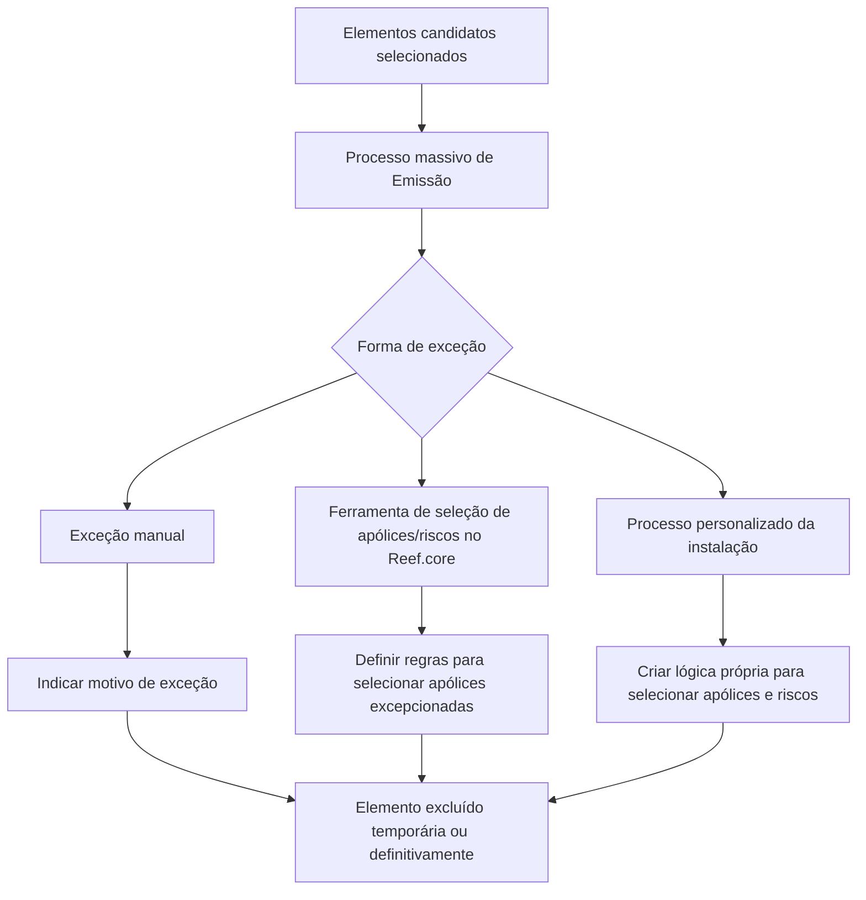

# Excepcionar Elementos Candidatos em Emissão — Visão Técnica no Reef

## 1. Metadados do Documento
- **Arquivo de Origem:** Não informado no conteúdo extraído
- **Tipo de Documento:** Procedimento
- **Domínio / Sistema:** Reef / Reef.core / Emissão
- **Público-Alvo:** Desenvolvedores, Operação e equipes responsáveis por processos massivos
- **Data/Versão Identificada:** Não identificada

---

## 2. Resumo Executivo & Contexto de Negócio

O documento descreve o procedimento para **excepcionar elementos candidatos no processo de Emissão**, isto é, excluir temporária ou definitivamente um ou mais elementos previamente selecionados para um processo massivo.

A exclusão de qualquer elemento do processo massivo requer obrigatoriamente a indicação de um **motivo de exceção**. Os motivos de exceção devem ser definidos previamente, embora o documento não especifique onde esses motivos são cadastrados, quais valores são permitidos ou como são validados.

O objetivo declarado é apresentar as formas disponíveis para excluir elementos previamente selecionados. O documento identifica três alternativas: exceção manual, uso da ferramenta de seleção de apólices/riscos do Reef.core e implementação de lógica personalizada pela instalação.

O conteúdo apresenta uma orientação operacional resumida. Não há detalhamento de contratos técnicos, telas completas, critérios de filtragem, persistência de dados, APIs, permissões ou efeitos posteriores da exceção no processo de Emissão.

---

## 3. Arquitetura, Componentes & Tecnologias Envolvidas

Os componentes e conceitos citados são:

| Componente / Conceito | Papel identificado no documento |
| :--- | :--- |
| Reef | Plataforma ou domínio documental em que o procedimento está registrado. |
| Reef.core | Componente que disponibiliza uma utilidade para estabelecer regras de seleção de apólices a serem excepcionadas. |
| Emissão | Processo no qual existem elementos candidatos selecionados para processamento massivo. |
| Processo massivo | Processo que contém elementos previamente selecionados e dos quais podem ser excluídas apólices, riscos ou outros elementos. |
| Instalação | Entidade que pode criar lógicas próprias para selecionar apólices e riscos a processar. |
| Ferramenta de seleção de apólices/riscos | Utilidade do Reef.core usada para definir regras de seleção de apólices que serão excepcionadas. |



> **Nota de Análise:** O documento cita o Reef.core, mas não detalha arquitetura interna, tecnologias, APIs, métodos HTTP, banco de dados, filas, autenticação ou contratos JSON.

---

## 4. Regras de Negócio, Especificações Funcionais & Processos

### Conceito de exceção

Excepcionar consiste em excluir, de modo temporário ou definitivo, um ou mais elementos de um processo massivo para o qual esses elementos já foram selecionados.

### Regra obrigatória de motivo de exceção

Todo elemento que precise ser excluído de um processo massivo deve possuir um motivo de exceção.

- O motivo de exceção deve ser informado para a exclusão.
- Os motivos de exceção devem estar previamente definidos.
- O documento não informa o catálogo de motivos, a responsabilidade pela definição, o local de cadastro ou a validação aplicada.

### Formas de exceção identificadas

1. **Manual**
   - O usuário seleciona o elemento.
   - O usuário informa o motivo da exceção.
   - A sequência visual de telas é mencionada no documento, porém não está disponível no conteúdo textual extraído.

2. **Ferramenta de seleção de apólices/riscos**
   - Existe uma utilidade no Reef.core.
   - A utilidade permite estabelecer regras.
   - As regras selecionam as apólices que serão excepcionadas do processo massivo.
   - O documento referencia a operação “FILTRAR póliza proceso masivo”.
   - A sequência de telas é mencionada, mas não foi extraída textualmente.

3. **Processo personalizado da instalação**
   - A instalação pode criar lógicas próprias.
   - Essas lógicas selecionam as apólices e os riscos a processar.
   - O documento apresenta essa alternativa como última opção.
   - Não há especificação de linguagem, extensão, ponto de integração, regras de execução ou mecanismo de implantação dessas lógicas.

---

## 5. Tabelas de Parâmetros, Ambientes e Estruturas de Dados

| Item / Parâmetro | Descrição / Função | Tipo / Valores / Formato | Ambiente / Observações |
| :--- | :--- | :--- | :--- |
| Elemento candidato | Elemento previamente selecionado em um processo massivo. | Não especificado | Pode ser excluído temporária ou definitivamente. |
| Processo massivo | Processo que contém elementos selecionados para processamento. | Não especificado | Contexto no qual ocorre a exceção. |
| Motivo de exceção | Justificativa obrigatória para excluir um elemento do processo massivo. | Deve ser previamente definido | Catálogo, formato e regras de validação não especificados. |
| Exceção manual | Forma de excluir um elemento mediante seleção do elemento e indicação do motivo. | Operação manual | A sequência de telas não está presente na extração textual. |
| Ferramenta de seleção de apólices/riscos | Utilidade do Reef.core para estabelecer regras de seleção de apólices excepcionadas. | Regras de seleção | Associada à operação “FILTRAR póliza proceso masivo”. |
| Apólice | Entidade que pode ser selecionada para exceção no processo massivo. | Não especificado | Critérios de seleção não detalhados. |
| Risco | Entidade que pode ser selecionada por lógica personalizada da instalação. | Não especificado | Não há estrutura de dados descrita. |
| Processo personalizado da instalação | Lógica criada pela instalação para selecionar apólices e riscos a processar. | Lógica customizada | Detalhes de implementação não informados. |
| Reef.core | Componente que oferece a utilidade de seleção de apólices/riscos. | Sistema/componente | Tecnologias e interfaces não especificadas. |

---

## 6. Bateria de Perguntas & Respostas para RAG (FAQ Sintético)

### P1: O que significa excepcionar elementos candidatos no processo de Emissão?
**R:** Excepcionar elementos candidatos significa excluir temporária ou definitivamente um ou mais elementos de um processo massivo no qual esses elementos já haviam sido selecionados.

### P2: É obrigatório informar um motivo ao excluir um elemento de um processo massivo?
**R:** Sim. Qualquer elemento que necessite ser excluído do processo massivo deve possuir um motivo de exceção. O documento também informa que esses motivos devem ser definidos previamente.

### P3: Quais são as formas disponíveis para excepcionar elementos de um processo massivo?
**R:** O documento identifica três formas: exceção manual, uso da ferramenta de seleção de apólices/riscos e criação de um processo personalizado pela instalação.

### P4: Como funciona a exceção manual de um elemento?
**R:** Na exceção manual, o usuário seleciona o elemento a ser excluído e informa o motivo da exceção. O documento menciona uma sequência de telas para essa operação, mas essa sequência não está presente no texto extraído.

### P5: Qual componente oferece a ferramenta para seleção de apólices a excepcionar?
**R:** A ferramenta é uma utilidade existente no Reef.core. Ela permite estabelecer regras que selecionam as apólices a serem excepcionadas do processo massivo.

### P6: O que significa “FILTRAR póliza proceso masivo” no contexto do documento?
**R:** “FILTRAR póliza proceso masivo” é a referência apresentada para a funcionalidade de filtragem de apólices no processo massivo. O documento a associa à ferramenta de seleção de apólices/riscos do Reef.core, mas não detalha os filtros, campos ou critérios disponíveis.

### P7: A instalação pode implementar regras próprias para selecionar itens do processo?
**R:** Sim. Como última opção, a instalação pode criar lógicas próprias para selecionar as apólices e os riscos a serem processados.

### P8: A exclusão de um elemento é sempre permanente?
**R:** Não. O documento afirma que um ou mais elementos podem ser excluídos temporária ou definitivamente do processo massivo.

### P9: O documento informa quais motivos de exceção estão disponíveis?
**R:** Não. O documento apenas estabelece que os motivos de exceção devem ser previamente definidos; não apresenta valores, catálogo, códigos ou regras de manutenção desses motivos.

### P10: O documento descreve APIs ou contratos técnicos para a funcionalidade de exceção?
**R:** Não. O conteúdo não descreve APIs, métodos HTTP, contratos JSON, integrações, persistência, autenticação ou interfaces técnicas para executar as exceções.

---

## 7. Glossário de Termos, Siglas & Conceitos-Chave

- **Emissão:** Contexto do processo em que existem elementos candidatos selecionados para processamento massivo.
- **Excepcionar:** Excluir temporária ou definitivamente um ou mais elementos de um processo massivo.
- **Instalação:** Entidade que pode criar lógica própria para selecionar apólices e riscos a processar.
- **Motivo de exceção:** Justificativa obrigatória que deve acompanhar a exclusão de um elemento do processo massivo.
- **Processo massivo:** Processo que trabalha com elementos previamente selecionados e permite exceções.
- **Reef:** Nome citado no contexto da documentação e da solução.
- **Reef.core:** Componente citado como responsável por disponibilizar uma utilidade para estabelecer regras de seleção de apólices a excepcionar.
- **Risco:** Entidade citada como passível de seleção por lógica personalizada da instalação.
- **Apólice:** Entidade que pode ser selecionada para exceção em um processo massivo.

---

## 8. Notas Críticas, Riscos & Limitações

- O documento exige motivos de exceção previamente definidos, mas não apresenta o catálogo, o processo de cadastro nem as regras de governança desses motivos.
- A sequência de telas para exceção manual e para a ferramenta de seleção é mencionada, porém não consta no conteúdo bruto textual fornecido.
- Não há detalhamento dos critérios, operadores ou atributos disponíveis para criar regras na ferramenta do Reef.core.
- Não são informados mecanismos de auditoria, rastreabilidade, reversão ou aprovação para exclusões temporárias e definitivas.
- A alternativa de lógica personalizada pela instalação não possui especificação de integração, tecnologia, ciclo de execução ou responsabilidade operacional.
- O documento não diferencia explicitamente o comportamento da exceção temporária em relação à exceção definitiva.
- **Nota de Análise:** O documento lista o Reef.core e o processo personalizado da instalação, porém não detalha contratos técnicos, interfaces expostas ou implementação.

---

## 9. Conteúdo Bruto Estruturado (Referência Fiel)

```text
--- [PÁGINA 1 DE 4] ---

EXCEPCIONAR elementos candidatos en Emisión (enlace con visión
técnica)
¿En que consiste?
Excluir temporal o denitivamente uno o varios elementos del proceso masivo del que han sido seleccionados. Hay que indicar que cualquier
elemento que sea necesario excluir del proceso masivo, debe de contar con un motivo de excepción. Estos motivos deben ser previamente
denidos.
Objetivo
Conocer las formas en las que se puede excluir elementos seleccionados previamente.
Proceso a seguir
Existen tres formas en las que los elementos puedan ser excepcionados de un proceso masivo:
1. Manualmente
2. Herramienta de selección de pólizas a excepcionar
3. Proceso personalizado de la instalación
Manualmente
Es decir, seleccionando el elemento e indicando el motivo de la excepción, según secuencia que se muestra a continuación:
Documentation / DOCUMENTACIÓN Reef
DOCUMENTACIÓN Reef
Mapfredocument
DOCUMENTACIÓN Reef
Owner
user:agonzalez_mapfre.com
Lifecycle
Approved Source
 /
 VL
Buscar Inicio Soluciones Arquitecturas APIs Componentes Cloud Documentación Zeus Reef Ayuda
ES

--- [PÁGINA 2 DE 4] ---

[Página em branco ou apenas elementos visuais/imagem]

--- [PÁGINA 3 DE 4] ---

Herramienta de selección de pólizas/riesgos
Existe una utilizad en Reef.core que permite establecer las reglas que seleccionen las pólizas que serán excepcionadas del proceso masivo
FILTRAR póliza proceso masivo. Los pasos a seguir se muestran en la siguiente secuencia de pantallas:

--- [PÁGINA 4 DE 4] ---

Proceso personalizado de la instalación
Como última opción, la instalación puede crear sus propias lógicas que seleccionen las pólizas y riesgos a procesar.
```
