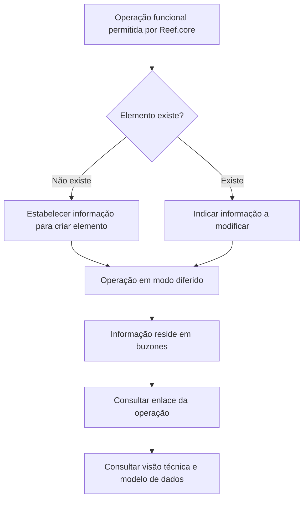

# Indicar Cambios: Elementos Candidatos en Emisión

## 1. Metadados do Documento
- **Arquivo de Origem:** Não identificado
- **Tipo de Documento:** Procedimento
- **Domínio / Sistema:** Reef.core / Reef
- **Público-Alvo:** Operação, negócio e equipes técnicas
- **Data/Versão Identificada:** Não identificada

---

## 2. Resumo Executivo & Contexto de Negócio

O documento descreve o processo **“INDICAR CAMBIOS elementos candidatos en Emisión”**, relacionado à operação de emissão de apólices no sistema Reef.core. O objetivo é estabelecer informações para criar um elemento inexistente ou indicar alterações para modificar um elemento já existente.

A informação aplicável depende da operação funcional que Reef.core permite executar em **modo diferido**. Nesse modo, a diferença indicada pelo documento é que as informações residem em estruturas denominadas **buzones**.

O processo procura permitir o entendimento de quais informações afetam cada operação, com a finalidade de criar ou modificar um elemento. A documentação também informa que os conteúdos apresentados possuem enlaces para a operação e para a versão técnica que especifica o modelo de dados associado às informações a criar ou modificar.

A única operação explicitamente apresentada é **EMITIR póliza**, com acesso indicado na visão técnica como **“Acceder”**. O trecho não detalha os campos, contratos, métodos, regras de validação ou modelo de dados da operação.

---

## 3. Arquitetura, Componentes & Tecnologias Envolvidas

Componentes e conceitos citados:

- **Reef.core:** Sistema que permite realizar operações funcionais em modo diferido.
- **Buzones:** Estruturas onde a informação reside quando a operação é realizada em modo diferido.
- **EMITIR póliza:** Operação funcional listada no documento.
- **Visão técnica:** Referência técnica associada à operação, indicada pelo enlace “Acceder”.
- **Modelo de dados:** Referenciado como a especificação técnica da informação a criar ou modificar.
- **Mapfredocument:** Termo presente na navegação/documentação exibida.



**Nota de Análise:** O documento não descreve a arquitetura de infraestrutura, integrações, tecnologias de implementação, protocolos, URLs, servidores ou contratos de API.

---

## 4. Regras de Negócio, Especificações Funcionais & Processos

1. O processo deve identificar se o elemento candidato em emissão já existe.
2. Quando o elemento não existe, deve ser estabelecida a informação necessária para sua criação.
3. Quando o elemento existe, devem ser indicadas as alterações a realizar para sua modificação.
4. A informação aplicável depende da operação funcional que Reef.core permite realizar em modo diferido.
5. Em operações realizadas em modo diferido, a informação reside nos denominados **buzones**.
6. O objetivo declarado é conhecer quais informações afetam cada operação para criar ou modificar um elemento.
7. A documentação disponibiliza enlaces para:
   - A operação funcional.
   - A versão técnica que especifica o modelo de dados da informação a criar ou modificar.
8. A operação explicitamente listada é **EMITIR póliza**.

---

## 5. Tabelas de Parâmetros, Ambientes e Estruturas de Dados

| Item / Parâmetro | Descrição / Função | Tipo / Valores / Formato | Ambiente / Observações |
| :--- | :--- | :--- | :--- |
| Elemento candidato | Entidade sujeita à criação ou modificação no contexto de emissão. | Existente ou inexistente. | O documento não define a estrutura do elemento. |
| Informação a estabelecer | Informação aplicada quando o elemento não existe. | Não especificado. | Destinada à criação do elemento. |
| Informação a modificar | Informação aplicada quando o elemento existe. | Não especificado. | Destinada à alteração do elemento. |
| Operação funcional | Operação permitida por Reef.core em modo diferido. | Operação listada: `EMITIR póliza`. | A informação depende da operação funcional. |
| Modo diferido | Modalidade de execução mencionada para operações funcionais em Reef.core. | Não especificado. | A informação reside em buzones. |
| Buzones | Estruturas onde a informação reside no modo diferido. | Não especificado. | Não há caminho, servidor ou estrutura técnica detalhada. |
| Visão técnica | Referência técnica ligada à operação. | Enlace indicado como `Acceder`. | Deve especificar o modelo de dados. |
| Modelo de dados | Modelo técnico da informação a criar ou modificar. | Não especificado. | O conteúdo do modelo não está presente no trecho. |
| Owner | Proprietário exibido na documentação. | `user:agonzalez_mapfre.com` | Informação literal apresentada no conteúdo. |
| Lifecycle | Estado de ciclo de vida exibido. | `Approved` | Informação literal apresentada no conteúdo. |
| Source | Origem exibida. | `/ VL` | O significado de `VL` não é definido. |

---

## 6. Bateria de Perguntas & Respostas para RAG (FAQ Sintético)

### P1: Qual é o objetivo do processo “Indicar Cambios elementos candidatos en Emisión”?
**R:** O processo tem o objetivo de conhecer quais informações afetam cada operação para criar ou modificar um elemento no contexto de emissão.

### P2: O que deve ser feito quando o elemento candidato não existe?
**R:** Quando o elemento não existe, deve ser estabelecida a informação que deve ser aplicada para criar o elemento.

### P3: O que deve ser feito quando o elemento candidato já existe?
**R:** Quando o elemento existe, devem ser indicadas as alterações a realizar para modificar o elemento existente.

### P4: De que depende a informação que deve ser estabelecida ou modificada?
**R:** A informação depende da operação funcional que Reef.core permite realizar em modo diferido.

### P5: Onde a informação reside quando a operação é realizada em modo diferido?
**R:** No modo diferido, a informação reside nos denominados buzones.

### P6: Qual operação funcional é explicitamente apresentada no documento?
**R:** A operação funcional apresentada é `EMITIR póliza`.

### P7: Onde consultar o modelo de dados da informação a criar ou modificar?
**R:** O documento informa que existem enlaces para a versão técnica que especifica o modelo de dados da informação a criar ou modificar. Para a operação `EMITIR póliza`, a visão técnica é indicada como `Acceder`.

### P8: O documento detalha os métodos HTTP ou contratos JSON da operação EMITIR póliza?
**R:** Não. O trecho apenas lista a operação `EMITIR póliza` e o acesso à visão técnica. Não há detalhamento de métodos HTTP, contratos JSON, campos ou payloads.

### P9: O que diferencia o modo diferido no processo descrito?
**R:** A diferença explicitamente indicada é que a informação passa a residir nos buzones.

### P10: O documento informa quais campos compõem o elemento candidato?
**R:** Não. O documento menciona a existência de uma visão técnica e de um modelo de dados, mas não apresenta os campos ou a estrutura técnica do elemento candidato.

---

## 7. Glossário de Termos, Siglas & Conceitos-Chave

- **Reef.core:** Sistema mencionado como capaz de permitir operações funcionais em modo diferido.
- **Buzones:** Denominação das estruturas onde a informação reside no modo diferido.
- **Emisión:** Contexto de emissão no qual se tratam elementos candidatos.
- **EMITIR póliza:** Operação funcional explicitamente listada no documento.
- **Visão técnica:** Referência técnica associada à operação, destinada a especificar o modelo de dados.
- **Modelo de dados:** Especificação técnica da informação a criar ou modificar.
- **Lifecycle:** Campo exibido com o valor `Approved`; o documento não define o termo.
- **Source:** Campo exibido com o valor `/ VL`; o documento não define o termo nem a sigla `VL`.

---

## 8. Notas Críticas, Riscos & Limitações

- O trecho não identifica o arquivo de origem, data, versão ou autor formal do documento.
- O documento não detalha os campos do modelo de dados, tipos, formatos, regras de validação ou valores permitidos.
- Não são fornecidos métodos HTTP, contratos JSON, endpoints, URLs, servidores, credenciais ou ambientes.
- Não há detalhamento operacional sobre o funcionamento interno dos buzones.
- Não há descrição adicional para a operação `EMITIR póliza` além da referência `Acceder` na visão técnica.
- **Nota de Análise:** O documento lista Reef.core, buzones e a operação `EMITIR póliza`, porém não detalha interfaces, integrações ou implementação técnica desses elementos.

---

## 9. Conteúdo Bruto Estruturado (Referência Fiel)

```text
--- [PÁGINA 1 DE 1] ---

INDICAR CAMBIOS elementos candidatos en Emisión
¿En que consiste?
Establecer la información (en el caso que el elemento no exista) o los cambios a realizar (en el caso que el elemento exista) que se deben
aplicar.
Objetivo
Conocer que información afecta a cada operación con la intención de crear o modicar un elemento.
Proceso a seguir
La información a establecer (en el caso que el elemento no exista) o a modicar (en el caso que el elemento exista), depende de la operación
funcional que Reef.core permita realizar en modo diferido. La diferencia radica que la información residirá en los denominados buzones. La
información mostrada a continuación cuenta con enlaces a la operación y enlaces a la versión técnica que especica el modelo de datos que
contiene la información a crear o modicar.
OPERACIÓN VISIÓN TÉCNICA
EMITIR póliza Acceder
Documentation / DOCUMENTACIÓN Reef
DOCUMENTACIÓN Reef
Mapfredocument
DOCUMENTACIÓN Reef
Owner
user:agonzalez_mapfre.com
Lifecycle
Approved Source
 / 
 VL
Buscar Inicio Soluciones Arquitecturas APIs Componentes Cloud Documentación Zeus Reef Ayuda
ES
```
