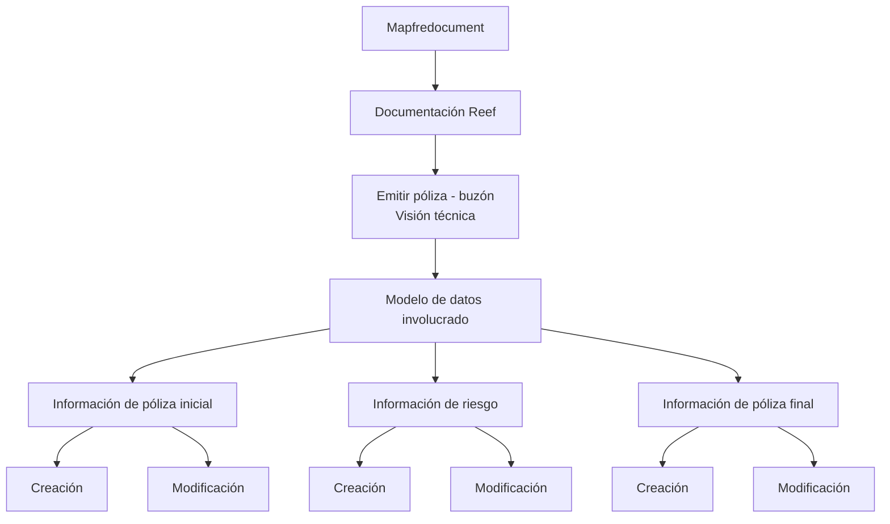

# Visão Técnica — Emitir Póliza por Buzón: Modelo de Dados Envolvido

## 1. Metadados do Documento
- **Arquivo de Origem:** Não identificado
- **Tipo de Documento:** Especificação Técnica
- **Domínio / Sistema:** Emissão de póliza por buzón; Reef; Mapfre
- **Público-Alvo:** Desenvolvedores, Arquitetos, Analistas Funcionais
- **Data/Versão Identificada:** Não identificada

---

## 2. Resumo Executivo & Contexto de Negócio

O documento apresenta uma visão técnica, ainda marcada como **“EN CONSTRUCCIÓN”**, sobre a emissão de póliza por meio de um **buzón**. O conteúdo central identifica o modelo de dados envolvido no processo e organiza as informações da póliza em categorias de criação e modificação.

A documentação divide os dados em três grupos principais: **informação inicial da póliza**, **informação de risco** e **informação final da póliza**. Para cada grupo, o documento indica a disponibilidade de acesso tanto para o cenário de **CREACIÓN** quanto para o cenário de **MODIFICACIÓN**.

O conteúdo faz referência ao ecossistema de documentação **Reef**, à plataforma **Mapfredocument** e à navegação corporativa que inclui itens como Soluciones, Arquitecturas, APIs, Componentes, Cloud, Documentación, Zeus e Reef.

Não são detalhados contratos de integração, métodos HTTP, formatos de mensagens, tecnologias de implementação, URLs dos enlaces “Acceder” nem o comportamento operacional da emissão. A fonte registra apenas os elementos de informação associados ao modelo de dados do buzón.

---

## 3. Arquitetura, Componentes & Tecnologias Envolvidas

Os componentes e referências explicitamente citados são:

- **Buzón:** modelo de dados utilizado no contexto de emissão de póliza.
- **Reef:** fonte ou área de documentação referenciada como “DOCUMENTACIÓN Reef”.
- **Mapfredocument:** referência documental exibida no conteúdo.
- **Zeus:** item de navegação mencionado na documentação.
- **Documentación / DOCUMENTACIÓN Reef:** contexto de repositório ou portal documental.
- **Owner:** `user:agonzalez_mapfre.com`.
- **Lifecycle:** `Approved`.



> **Nota de Análise:** O documento não descreve integrações entre sistemas, protocolos, APIs, banco de dados, infraestrutura, endpoints ou tecnologias de implementação.

---

## 4. Regras de Negócio, Especificações Funcionais & Processos

O documento estrutura o modelo de dados do buzón para emissão de póliza em três blocos funcionais.

### 4.1 Informação de póliza inicial

Os seguintes elementos estão disponíveis para **criação** e **modificação**:

1. Información básica de la póliza.
2. Información general de la póliza.
3. Coaseguro.
4. Tomador.
5. Intervenciones de cliente.
6. Agentes.
7. Atributos.

### 4.2 Informação de risco

Os seguintes elementos estão disponíveis para **criação** e **modificação**:

1. Intervenciones de cliente.
2. Atributos.
3. Intervenciones de cliente — listado novamente no documento.
4. Coberturas.
5. Cláusulas.

### 4.3 Informação de póliza final

Os seguintes elementos estão disponíveis para **criação** e **modificação**:

1. Plan de pago.
2. Gestor de cobro.
3. Textos anexos.
4. Cláusulas.
5. Motivos.
6. Observaciones.

> **Nota de Análise:** O documento apresenta a expressão “Intervenciones de cliente” duas vezes na seção “INFORMACIÓN DE RIESGO”. Não há explicação que permita determinar se são dois elementos distintos ou uma duplicidade na fonte.

> **Nota de Análise:** O documento não define obrigatoriedade de campos, regras de validação, cálculos, sequência transacional, critérios de elegibilidade ou regras específicas para criação e modificação.

---

## 5. Tabelas de Parâmetros, Ambientes e Estruturas de Dados

| Item / Parâmetro | Descrição / Função | Tipo / Valores / Formato | Ambiente / Observações |
| :--- | :--- | :--- | :--- |
| Emitir póliza - buzón | Contexto técnico da emissão de póliza | Visión técnica | Documento marcado como “EN CONSTRUCCIÓN” |
| Modelo de datos involucrado | Modelo de dados associado ao buzón | Estrutura documental | Os enlaces são indicados como “Acceder” |
| Información básica de la póliza | Informação inicial da póliza | Disponível para creación e modificación | Informação de póliza inicial |
| Información general de la póliza | Informação geral da póliza | Disponível para creación e modificación | Informação de póliza inicial |
| Coaseguro | Informação relacionada a coaseguro | Disponível para creación e modificación | Informação de póliza inicial |
| Tomador | Informação do tomador | Disponível para creación e modificación | Informação de póliza inicial |
| Intervenciones de cliente | Intervenções de cliente | Disponível para creación e modificación | Informação de póliza inicial e informação de risco |
| Agentes | Informação de agentes | Disponível para creación e modificación | Informação de póliza inicial |
| Atributos | Atributos | Disponível para creación e modificación | Informação de póliza inicial e informação de risco |
| Coberturas | Coberturas | Disponível para creación e modificación | Informação de risco |
| Cláusulas | Cláusulas | Disponível para creación e modificación | Informação de risco e informação de póliza final |
| Plan de pago | Plano de pagamento | Disponível para creación e modificación | Informação de póliza final |
| Gestor de cobro | Gestor de cobrança | Disponível para creación e modificación | Informação de póliza final |
| Textos anexos | Textos anexos | Disponível para creación e modificación | Informação de póliza final |
| Motivos | Motivos | Disponível para creación e modificación | Informação de póliza final |
| Observaciones | Observações | Disponível para creación e modificación | Informação de póliza final |
| Reef | Referência de documentação | DOCUMENTACIÓN Reef | Sem URL detalhada |
| Mapfredocument | Referência documental | Mapfredocument | Sem detalhamento adicional |
| Owner | Responsável identificado na fonte | `user:agonzalez_mapfre.com` | Campo exibido na documentação |
| Lifecycle | Estado de ciclo de vida | Approved | Campo exibido na documentação |
| Idioma | Idioma indicado na navegação | ES | Conteúdo predominantemente em espanhol |

---

## 6. Bateria de Perguntas & Respostas para RAG (FAQ Sintético)

### P1: Qual é o objetivo do documento “Emitir póliza - buzón”?
**R:** O documento apresenta uma visão técnica do modelo de dados envolvido na emissão de póliza por buzón. A fonte organiza as informações disponíveis em categorias de informação inicial da póliza, informação de risco e informação final da póliza.

### P2: O documento detalha a implementação técnica da emissão de póliza?
**R:** Não. O documento apenas identifica elementos do modelo de dados e indica acesso para criação e modificação. Não há detalhes sobre APIs, endpoints, métodos HTTP, contratos JSON, banco de dados ou tecnologias de implementação.

### P3: Quais informações fazem parte da informação inicial da póliza?
**R:** A informação inicial da póliza inclui información básica de la póliza, información general de la póliza, coaseguro, tomador, intervenciones de cliente, agentes e atributos.

### P4: Quais dados de risco são citados no modelo de dados do buzón?
**R:** A seção de informação de risco lista intervenciones de cliente, atributos, intervenciones de cliente novamente, coberturas e cláusulas. O documento não explica a repetição de intervenciones de cliente.

### P5: Quais dados compõem a informação final da póliza?
**R:** A informação final da póliza contém plan de pago, gestor de cobro, textos anexos, cláusulas, motivos e observaciones.

### P6: Os elementos documentados podem ser usados tanto na criação quanto na modificação?
**R:** Sim. Para os elementos exibidos nas seções de informação inicial da póliza, informação de risco e informação final da póliza, o documento apresenta “Acceder” nas colunas CREACIÓN e MODIFICACIÓN.

### P7: Quais elementos aparecem em mais de uma seção do modelo de dados?
**R:** Intervenciones de cliente aparece na informação inicial da póliza e na informação de risco. Atributos aparece na informação inicial da póliza e na informação de risco. Cláusulas aparece na informação de risco e na informação final da póliza.

### P8: Qual é o estado de ciclo de vida identificado no documento?
**R:** O campo Lifecycle está identificado como **Approved**.

### P9: Quem é o owner registrado no conteúdo extraído?
**R:** O owner registrado no conteúdo é `user:agonzalez_mapfre.com`.

### P10: O documento fornece URLs para os links “Acceder”?
**R:** Não. A fonte indica “Acceder” para os elementos de criação e modificação, mas não inclui URLs, identificadores de enlace ou destinos navegáveis.

---

## 7. Glossário de Termos, Siglas & Conceitos-Chave

- **Buzón:** termo usado pelo documento para o contexto ou modelo de dados envolvido na emissão de póliza.
- **Póliza:** objeto de negócio tratado no processo de emissão descrito.
- **CREACIÓN:** cenário de criação de informações no modelo de dados.
- **MODIFICACIÓN:** cenário de modificação de informações no modelo de dados.
- **Reef:** referência de documentação presente como “DOCUMENTACIÓN Reef”.
- **Mapfredocument:** referência documental mencionada na fonte.
- **Zeus:** item de navegação mencionado no portal documental.
- **Coaseguro:** elemento de informação da póliza listado no documento.
- **Tomador:** elemento de informação da póliza listado no documento.
- **Gestor de cobro:** elemento da informação final da póliza relacionado à cobrança.
- **Lifecycle:** campo de ciclo de vida exibido com o valor `Approved`.

---

## 8. Notas Críticas, Riscos & Limitações

- O documento está identificado como **“EN CONSTRUCCIÓN”**, indicando conteúdo potencialmente incompleto.
- Não há arquivo de origem, data, versão ou identificador documental explicitamente informado no conteúdo extraído.
- Os enlaces “Acceder” não possuem URLs ou destinos recuperáveis no texto.
- Não há definição de contratos de integração, campos de payload, modelos de entidade, chaves, cardinalidades ou persistência.
- Não há descrição de requisitos não funcionais, autenticação, autorização, observabilidade, logs, monitoramento ou tratamento de erros.
- A repetição de “Intervenciones de cliente” na seção de informação de risco não é explicada.
- O termo “buzón” não recebe definição funcional ou técnica adicional na fonte.
- Não é possível inferir que Reef, Mapfredocument e Zeus integrem diretamente o fluxo de emissão; eles são apenas referências explicitamente exibidas no conteúdo.

---

## 9. Conteúdo Bruto Estruturado (Referência Fiel)

```text
--- [PÁGINA 1 DE 2] ---

EN CONSTRUCCIÓN
EMITIR póliza - buzón (visión técnica)
Modelo de datos involucrado
El modelo de datos (buzón) que interviene se encuentra en los siguientes enlaces
INFORMACIÓN DE PÓLIZA (INICIAL) CREACIÓN MODIFICACIÓN
Información básica de la póliza Acceder Acceder
Información general de la póliza Acceder Acceder
Coaseguro Acceder Acceder
Tomador Acceder Acceder
Intervenciones de cliente Acceder Acceder
Agentes Acceder Acceder
Atributos Acceder Acceder
INFORMACIÓN DE RIESGO CREACIÓN MODIFICACIÓN
Intervenciones de cliente Acceder Acceder
Atributos Acceder Acceder
Intervenciones de cliente Acceder Acceder
Coberturas Acceder Acceder
Cláusulas Acceder Acceder
Documentation / DOCUMENTACIÓN Reef
DOCUMENTACIÓN Reef
Mapfredocument
DOCUMENTACIÓN Reef
Owner
user:agonzalez_mapfre.com
Lifecycle
Approved Source
 /
VL
Buscar Inicio Soluciones Arquitecturas APIs Componentes Cloud Documentación Zeus Reef Ayuda
ES


--- [PÁGINA 2 DE 2] ---

INFORMACIÓN DE PÓLIZA (FINAL) CREACIÓN MODIFICACIÓN
Plan de pago Acceder Acceder
Gestor de cobro Acceder Acceder
Textos anexos Acceder Acceder
Cláusulas Acceder Acceder
Motivos Acceder Acceder
Observaciones Acceder Acceder
```
