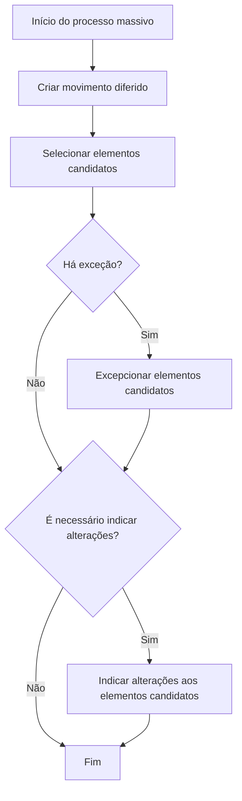

# Processo Massivo em Emissão no REEF Core

## 1. Metadados do Documento
- **Arquivo de Origem:** Não identificado
- **Tipo de Documento:** Procedimento
- **Domínio / Sistema:** REEF Core / Emissão
- **Público-Alvo:** Operação, Negócio, Desenvolvedores
- **Data/Versão Identificada:** Não identificada

---

## 2. Resumo Executivo & Contexto de Negócio

O documento descreve o conceito de **processo massivo** no contexto de Emissão do sistema **REEF Core**. REEF Core é apresentado como composto por uma série de operações que podem ser executadas imediatamente, em linha, ou de forma diferida no tempo.

Quando uma operação pode ser diferida, o processo permite determinar quais elementos serão afetados. Os elementos podem ser únicos ou múltiplos. O documento apresenta como exemplo a seleção de diversas apólices para execução de um suplemento específico.

Um processo massivo define três aspectos principais: qual operação diferida será realizada, quais elementos serão afetados por essa operação e quais modificações esses elementos sofrerão. Portanto, o processo massivo constitui a preparação necessária para uma execução posterior de operação diferida.

O objetivo declarado é conhecer as ações que devem ser realizadas antes de lançar uma operação de forma diferida. O documento não se concentra em uma operação específica, seus métodos técnicos, contratos de integração ou regras particulares de negócio.

---

## 3. Arquitetura, Componentes & Tecnologias Envolvidas

Os componentes e conceitos identificados são:

| Componente / Conceito | Papel identificado |
| :--- | :--- |
| REEF Core | Sistema formado por uma série de operações. |
| Emissão | Contexto funcional em que o processo massivo é criado. |
| Operação em linha | Operação executada no momento. |
| Operação diferida | Operação cuja execução ocorre posteriormente. |
| Processo massivo | Processo que define a operação diferida, os elementos afetados e as modificações aplicáveis. |
| Movimento diferido | Etapa inicial de criação da operação diferida. |
| Elementos candidatos | Elementos selecionados para possível afetação pela operação. |
| Exceção | Condição que pode exigir a exclusão ou tratamento excepcional de elementos candidatos. |
| Alterações aos elementos candidatos | Modificações que podem precisar ser informadas para os elementos selecionados. |



**Nota de Análise:** O documento não detalha arquitetura técnica, APIs, bases de dados, tecnologias, métodos HTTP, contratos JSON, ambientes ou integrações do REEF Core.

---

## 4. Regras de Negócio, Especificações Funcionais & Processos

### Conceito de processo massivo

1. REEF Core é composto por diversas operações.
2. Algumas operações podem ser realizadas:
   - Em linha, no momento da solicitação.
   - De forma diferida, em momento posterior.
3. Uma operação diferida permite determinar os elementos que serão afetados.
4. A quantidade de elementos afetados pode ser:
   - Um elemento.
   - Vários elementos.
5. O documento cita como exemplo a seleção de uma série de apólices para realizar determinado suplemento.
6. O processo massivo determina:
   - A operação diferida que será executada.
   - Os elementos afetados pela operação.
   - As modificações que os elementos sofrerão.

### Processo operacional

1. **Criar movimento diferido**
   - Cria o movimento associado à operação que será executada de forma diferida.

2. **Selecionar elementos candidatos**
   - Define os elementos candidatos a receber a operação diferida.
   - Os elementos podem incluir uma ou várias apólices, conforme o exemplo apresentado.

3. **Verificar se há exceção**
   - Caso exista exceção, os elementos candidatos devem ser excepcionados.
   - Caso não exista exceção, o processo segue para a verificação de necessidade de alterações.

4. **Excepcionar elementos candidatos**
   - Trata os elementos candidatos quando for identificada uma exceção.
   - O documento não detalha critérios, tipos de exceção ou consequências operacionais da exceção.

5. **Verificar se é necessário indicar alterações**
   - Caso seja necessário, devem ser informadas alterações nos elementos candidatos.
   - Caso não seja necessário, o processo é concluído.

6. **Indicar alterações aos elementos candidatos**
   - Registra as modificações que devem ser realizadas nos elementos candidatos.
   - O documento não especifica quais atributos podem ser modificados, regras de validação ou formatos de dados.

---

## 5. Tabelas de Parâmetros, Ambientes e Estruturas de Dados

| Item / Parâmetro | Descrição / Função | Tipo / Valores / Formato | Ambiente / Observações |
| :--- | :--- | :--- | :--- |
| Operação | Ação pertencente ao conjunto de operações do REEF Core. | Em linha ou diferida. | Não detalhado. |
| Operação diferida | Operação preparada para execução posterior. | Processo executado de forma diferida no tempo. | Não detalhado. |
| Movimento diferido | Movimento criado para iniciar o processo massivo. | Etapa 1 do processo. | Não detalhado. |
| Elementos candidatos | Elementos potencialmente afetados pela operação diferida. | Um ou vários elementos. | O documento usa apólices como exemplo. |
| Exceção | Condição avaliada após a seleção dos elementos candidatos. | Sim ou não. | Critérios não detalhados. |
| Excepcionar elementos candidatos | Ação aplicada caso exista uma exceção. | Etapa condicional. | Efeito da exceção não detalhado. |
| Alterações aos elementos candidatos | Modificações a serem aplicadas aos elementos selecionados. | Sim ou não. | Campos e regras não detalhados. |
| REEF Core | Sistema no qual o processo massivo é descrito. | Sistema corporativo. | Não há versão identificada. |
| Owner | Proprietário exibido no conteúdo bruto. | `user:agonzalez_mapfre.com` | Origem exibida como Mapfredocument. |
| Lifecycle | Estado documental exibido no conteúdo bruto. | `Approved` | Sem detalhamento adicional. |

---

## 6. Bateria de Perguntas & Respostas para RAG (FAQ Sintético)

### P1: O que é um processo massivo no REEF Core?
**R:** Um processo massivo é o processo que determina qual operação diferida será realizada, quais elementos serão afetados e quais modificações esses elementos sofrerão.

### P2: Quais tipos de execução de operação são mencionados para o REEF Core?
**R:** O documento informa que determinadas operações do REEF Core podem ser realizadas em linha, no momento da solicitação, ou de forma diferida no tempo.

### P3: Qual é o objetivo do documento sobre criação de processo massivo em Emissão?
**R:** O objetivo é apresentar as ações que devem ser realizadas para que uma operação possa ser lançada posteriormente de forma diferida. O documento não se concentra em uma operação específica.

### P4: Qual é a primeira etapa do processo massivo?
**R:** A primeira etapa é criar o movimento diferido, identificado no fluxo como “CREAR movimiento diferido”.

### P5: O que são elementos candidatos no processo massivo?
**R:** Elementos candidatos são os elementos selecionados para serem potencialmente afetados pela operação diferida. O documento indica que pode haver um ou vários elementos; uma série de apólices é apresentada como exemplo.

### P6: O que acontece quando existe uma exceção após a seleção dos elementos candidatos?
**R:** Quando há uma exceção, o fluxo determina que os elementos candidatos devem ser excepcionados. O documento não detalha os critérios da exceção nem o comportamento posterior específico desses elementos.

### P7: Quando devem ser indicadas alterações aos elementos candidatos?
**R:** As alterações devem ser indicadas quando, após o tratamento de exceções, houver necessidade de informar modificações a serem realizadas nos elementos candidatos.

### P8: O documento descreve quais campos podem ser alterados nos elementos candidatos?
**R:** Não. O documento informa que podem ser indicadas alterações nos elementos candidatos, mas não especifica os campos, os formatos, as validações ou as regras aplicáveis.

### P9: O processo massivo pode afetar mais de uma apólice?
**R:** Sim. O documento fornece como exemplo a possibilidade de selecionar uma série de apólices para realizar determinado suplemento.

### P10: O documento especifica APIs ou contratos técnicos para o processo massivo?
**R:** Não. O conteúdo não detalha métodos HTTP, endpoints, contratos JSON, tecnologias de implementação, persistência ou integrações técnicas.

---

## 7. Glossário de Termos, Siglas & Conceitos-Chave

- **REEF Core:** Sistema composto por uma série de operações, algumas das quais podem ser realizadas em linha ou de forma diferida.
- **Emissão:** Contexto funcional indicado pelo título do conteúdo: criação de processo massivo em Emissão.
- **Operação em linha:** Operação realizada no momento.
- **Operação diferida:** Operação cuja realização ocorre posteriormente.
- **Processo massivo:** Processo que define a operação diferida, os elementos afetados e as modificações aplicáveis.
- **Movimento diferido:** Movimento criado como primeira etapa do processo massivo.
- **Elementos candidatos:** Elementos selecionados para possível afetação pela operação diferida.
- **Excepcionar:** Tratar elementos candidatos quando há uma exceção identificada no fluxo.
- **Suplemento:** Tipo de operação citado como exemplo de ação que pode ser realizada sobre uma série de apólices.
- **Apólice:** Elemento de negócio usado como exemplo de item que pode ser selecionado em um processo massivo.

---

## 8. Notas Críticas, Riscos & Limitações

- O documento não identifica o nome do arquivo de origem, data, versão ou autor técnico.
- O documento não detalha uma operação concreta; ele descreve apenas o processo genérico de preparação de operações diferidas.
- Não há definição dos critérios que caracterizam uma exceção.
- Não há detalhamento do efeito de “excepcionar elementos candidatos”.
- Não há especificação dos campos, regras de validação ou formatos das alterações aplicáveis aos elementos candidatos.
- Não são descritos APIs, contratos, métodos HTTP, tecnologias, servidores, URLs, ambientes, logs ou mecanismos de auditoria.
- A página apresenta o ciclo de vida documental como `Approved`, mas não fornece informações adicionais sobre governança, aprovação ou vigência.

---

## 9. Conteúdo Bruto Estruturado (Referência Fiel)

```text
--- [PÁGINA 1 DE 1] ---

CREAR proceso masivo en Emisión
¿En que consiste?
Reef.core está formado por una serie de operaciones. Ciertas operaciones se pueden realizar tanto en el momento (en línea), como diferidas
en el tiempo. Cuando una operación se puede diferir, además, se permite determinar a qué elementos afectará la operación (puede ser uno o
varios elementos). Por ejemplo, se puede seleccionar una serie de pólizas a las que realizar un determinado suplemento.
Al proceso que determina qué operación diferida se va a realizar, a qué elementos afectará esa operación y qué modicaciones sufrirán los
elementos, se le denomina proceso masivo.
Objetivo
Conocer que acciones se deben realizar para que posteriormente se pueda lanzar una operación de forma diferida. Este documento no se
centra en ninguna operación en concreto.
Proceso a seguir
SI
NO
SI
NO
CREAR
movimiento
diferido (1)
SELECCIONAR
elementos
candidatos (2)
¿Hay
excepción?
EXCEPCIONAR
elementos
candidatos (3)
¿Hay
que
indicar
cambios? INDICAR cambios
a elementos
candidatos (4)
FIN
1. CREAR movimiento diferido
2. SELECCIONAR elementos candidatos
3. EXCEPCIONAR elementos candidatos
4. INDICAR cambios a realizar sobre los elementos candidatos
Checking links...
Documentation / DOCUMENTACIÓN Reef
DOCUMENTACIÓN Reef
Mapfredocument
DOCUMENTACIÓN Reef
Owner
user:agonzalez_mapfre.com
Lifecycle
Approved Source
 /
 VL
Buscar Inicio Soluciones Arquitecturas APIs Componentes Cloud Documentación Zeus Reef Ayuda
ES
```
