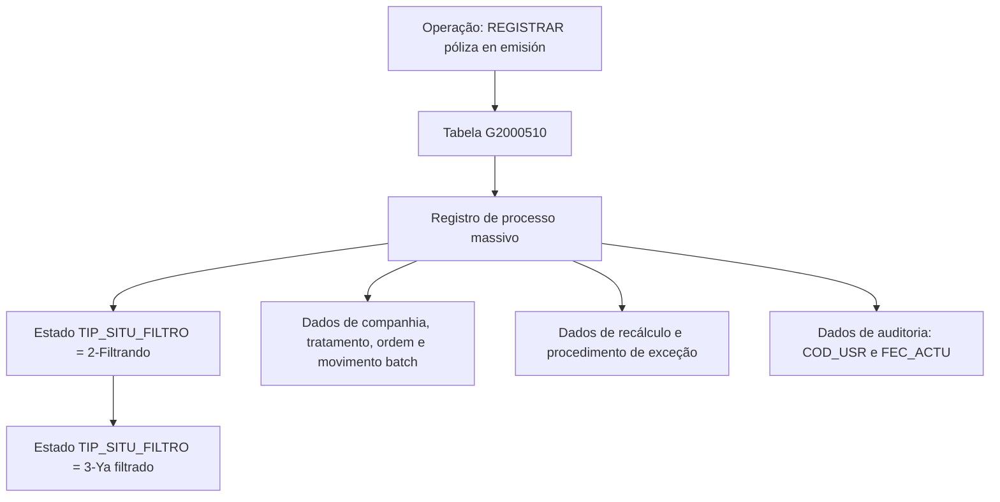

# Registro de Póliza en Emisión — Modelo de Datos para Procesos Masivos (G2000510)

## 1. Metadados do Documento
- **Arquivo de Origem:** Não identificado no conteúdo fornecido
- **Tipo de Documento:** Especificação Técnica
- **Domínio / Sistema:** Reef / Mapfre
- **Público-Alvo:** Desenvolvedores, Arquitetos e Operação
- **Data/Versão Identificada:** Não identificada

---

## 2. Resumo Executivo & Contexto de Negócio

O documento descreve uma operação identificada como **“REGISTRAR póliza en emisión”**, apresentada como conteúdo **“EN CONSTRUCCIÓN”**. O foco técnico é o modelo de dados envolvido na execução dessa operação, especificamente a tabela `G2000510`, cuja descrição é **PROCESOS MASIVOS**.

A tabela `G2000510` armazena informações de controle e execução de processos massivos. Os atributos registrados incluem companhia, data de tratamento, número do processo, tipo de movimento batch, situação de filtragem, procedimento de exceção, parâmetros de recálculo de data, usuário responsável pela atualização e identificação de processo personalizado.

O documento evidencia que o campo `TIP_SITU_FILTRO` acompanha o estado do movimento durante a operação. O conteúdo indica os valores `2-Filtrando` e, posteriormente, `3-Ya filtrado`, estabelecendo uma sequência de estados para o filtro associado ao processo massivo.

Não há detalhamento sobre contratos de API, métodos HTTP, interfaces de usuário, mecanismos de integração, rotinas executoras ou regras completas para preenchimento dos campos. A documentação também não especifica os domínios permitidos para a maior parte dos atributos marcados como `N.A.`.

---

## 3. Arquitetura, Componentes & Tecnologias Envolvidas

Os elementos técnicos explicitamente citados são:

- **Reef:** contexto de documentação indicado como “Documentation / DOCUMENTACIÓN Reef”.
- **Mapfre:** referência organizacional/sistêmica indicada como “Mapfredocument”.
- **Operação funcional:** `REGISTRAR póliza en emisión`.
- **Tabela de dados:** `G2000510`.
- **Descrição da tabela:** `PROCESOS MASIVOS`.
- **Estados de filtragem:** `2-Filtrando` e `3-Ya filtrado`.
- **Usuário proprietário identificado no conteúdo:** `user:agonzalez_mapfre.com`.
- **Lifecycle identificado:** `Approved Source`.



> **Nota de Análise:** O diagrama representa exclusivamente a relação funcional sustentada pelo conteúdo fornecido. O documento não detalha aplicações, microsserviços, bancos de dados, endpoints, tecnologias de persistência ou integrações externas.

---

## 4. Regras de Negócio, Especificações Funcionais & Processos

1. A operação documentada é denominada **“REGISTRAR póliza en emisión”**.
2. A tabela envolvida na operação é `G2000510`, identificada como tabela de **PROCESOS MASIVOS**.
3. O campo `COD_CIA` é obrigatório e representa a **companhia**.
4. O campo `FEC_TRATAMIENTO` é obrigatório e registra a **data em que o processo massivo é realizado**.
5. O campo `NUM_ORDEN` é obrigatório e representa o **número do processo massivo**.
6. O campo `TIP_MVTO_BATCH` é obrigatório e representa o **tipo do processo massivo**.
7. O campo `TXT_ALIAS` não é obrigatório e permite registrar o **nome que se deseja atribuir ao processo**.
8. O campo `TIP_SITU_FILTRO` é obrigatório e assume diferentes valores conforme o momento da operação:
   - `2-Filtrando`;
   - `3-Ya filtrado`.
9. O campo `NOM_PRG_EXCEPCION` não é obrigatório e representa um **procedimento de exceção**.
10. O campo `MCA_RECALCULA_FECHA` é obrigatório e registra uma marca que indica se a data já calculada será utilizada como base ou se a data será recalculada.
11. O campo `TIP_FECHA_BASE` não é obrigatório e indica a data que será usada como base para o recálculo.
12. O campo `COD_USR` é obrigatório e registra o usuário que atualizou a linha.
13. O campo `FEC_ACTU` não é obrigatório e registra a data de atualização da linha.
14. O campo `TXT_MCA_PROCESO_ESTANDAR` não é obrigatório e está associado à indicação de **processo padrão**.
15. O campo `IDN_PROCESO_PERSONALIZADO` não é obrigatório e representa o identificador do processo massivo personalizado.

---

## 5. Tabelas de Parâmetros, Ambientes e Estruturas de Dados

| Item / Parâmetro | Descrição / Função | Tipo / Valores / Formato | Ambiente / Observações |
| :--- | :--- | :--- | :--- |
| `G2000510` | Tabela envolvida na operação de registro de póliza em emissão | Tabela de dados | Descrição: `PROCESOS MASIVOS` |
| `COD_CIA` | Companhia | Não informado | Obrigatório: Sim |
| `FEC_TRATAMIENTO` | Data em que o processo massivo é realizado | Não informado | Obrigatório: Sim |
| `NUM_ORDEN` | Número do processo massivo | Não informado | Obrigatório: Sim |
| `TIP_MVTO_BATCH` | Tipo do processo massivo | Não informado | Obrigatório: Sim |
| `TXT_ALIAS` | Nome que se deseja atribuir ao processo | Não informado | Obrigatório: Não |
| `TIP_SITU_FILTRO` | Situação do movimento durante a operação de filtragem | `2-Filtrando`; `3-Ya filtrado` | Obrigatório: Sim |
| `NOM_PRG_EXCEPCION` | Procedimento de exceção | Não informado | Obrigatório: Não |
| `MCA_RECALCULA_FECHA` | Marca que indica se a data previamente calculada é usada como base ou recalculada | Não informado | Obrigatório: Sim |
| `TIP_FECHA_BASE` | Indica a data base para o recálculo da data | Não informado | Obrigatório: Não |
| `COD_USR` | Usuário que atualizou a linha | Não informado | Obrigatório: Sim |
| `FEC_ACTU` | Data de atualização da linha | Não informado | Obrigatório: Não |
| `TXT_MCA_PROCESO_ESTANDAR` | Marca ou texto relacionado ao processo padrão | Não informado | Obrigatório: Não; comentário: “APLICA PROCESO ESTANDAR” |
| `IDN_PROCESO_PERSONALIZADO` | Identificador do processo massivo personalizado | Não informado | Obrigatório: Não |

---

## 6. Bateria de Perguntas & Respostas para RAG (FAQ Sintético)

### P1: Qual tabela participa da operação “REGISTRAR póliza en emisión”?
**R:** A operação “REGISTRAR póliza en emisión” utiliza a tabela `G2000510`, cuja descrição no documento é `PROCESOS MASIVOS`.

### P2: Qual campo identifica a companhia em `G2000510`?
**R:** O campo `COD_CIA` identifica a companhia. O documento marca `COD_CIA` como obrigatório.

### P3: Como o documento representa a data de execução de um processo massivo?
**R:** A data de execução é registrada no campo `FEC_TRATAMIENTO`, descrito como a data em que o processo massivo é realizado. O preenchimento de `FEC_TRATAMIENTO` é obrigatório.

### P4: Qual atributo registra o número do processo massivo?
**R:** O atributo `NUM_ORDEN` registra o número do processo massivo e é obrigatório.

### P5: Quais são os estados documentados para `TIP_SITU_FILTRO`?
**R:** O documento define que `TIP_SITU_FILTRO` pode assumir, conforme o momento da operação, o valor `2-Filtrando` e posteriormente o valor `3-Ya filtrado`.

### P6: O campo `TXT_ALIAS` é obrigatório?
**R:** Não. O campo `TXT_ALIAS` não é obrigatório e permite registrar o nome que se deseja atribuir ao processo.

### P7: Como a tabela indica se uma data deve ser recalculada?
**R:** O campo obrigatório `MCA_RECALCULA_FECHA` indica se a data já calculada será tomada como base ou se será realizado novo cálculo da data.

### P8: Qual campo define a data base usada no recálculo?
**R:** O campo `TIP_FECHA_BASE` indica em qual data será baseado o recálculo. O documento informa que esse campo não é obrigatório.

### P9: Como a autoria de atualização do registro é registrada?
**R:** A autoria da atualização é registrada pelo campo obrigatório `COD_USR`, descrito como o usuário que atualizou a linha.

### P10: Qual campo registra a data de atualização de uma linha?
**R:** O campo `FEC_ACTU` registra a data de atualização da linha. O documento o classifica como não obrigatório.

### P11: Existe um campo para associar procedimento de exceção ao processo massivo?
**R:** Sim. O campo `NOM_PRG_EXCEPCION` representa o procedimento de exceção. O preenchimento desse campo não é obrigatório.

### P12: Como um processo massivo personalizado é identificado?
**R:** O campo `IDN_PROCESO_PERSONALIZADO` é descrito como identificador do processo massivo personalizado e não é obrigatório.

---

## 7. Glossário de Termos, Siglas & Conceitos-Chave

- **`COD_CIA`:** Campo que representa a companhia.
- **`COD_USR`:** Campo que representa o usuário que atualizou a linha.
- **`FEC_ACTU`:** Campo que representa a data de atualização da linha.
- **`FEC_TRATAMIENTO`:** Campo que representa a data em que o processo massivo é realizado.
- **`G2000510`:** Tabela descrita como `PROCESOS MASIVOS`.
- **`IDN_PROCESO_PERSONALIZADO`:** Identificador do processo massivo personalizado.
- **`MCA_RECALCULA_FECHA`:** Marca que indica se uma data previamente calculada deve ser usada como base ou recalculada.
- **`NOM_PRG_EXCEPCION`:** Campo associado a procedimento de exceção.
- **`NUM_ORDEN`:** Número do processo massivo.
- **Processo massivo:** Processo registrado na tabela `G2000510`; o documento não apresenta definição adicional.
- **Reef:** Contexto de documentação citado como “DOCUMENTACIÓN Reef”.
- **`TIP_FECHA_BASE`:** Campo que indica a data base para recálculo.
- **`TIP_MVTO_BATCH`:** Campo que representa o tipo do processo massivo.
- **`TIP_SITU_FILTRO`:** Campo que representa a situação do movimento durante a filtragem.
- **`TXT_ALIAS`:** Nome atribuído ao processo.
- **`TXT_MCA_PROCESO_ESTANDAR`:** Campo relacionado à aplicação de processo padrão.

---

## 8. Notas Críticas, Riscos & Limitações

- O documento está identificado como **“EN CONSTRUCCIÓN”**, indicando conteúdo possivelmente incompleto.
- Não foram identificados tipos físicos de dados, tamanhos de campos, chaves primárias, chaves estrangeiras, índices ou restrições de integridade da tabela `G2000510`.
- Não foram definidos domínios de valores para os campos classificados como `N.A.`, exceto os valores `2-Filtrando` e `3-Ya filtrado` para `TIP_SITU_FILTRO`.
- Não há detalhamento sobre a transição que determina quando `TIP_SITU_FILTRO` deve mudar de `2-Filtrando` para `3-Ya filtrado`.
- Não há especificação de APIs, contratos JSON, métodos HTTP, procedimentos batch, integrações ou rotinas responsáveis por criar e atualizar os registros.
- O documento cita a operação de registro de póliza em emissão, mas não detalha a estrutura da póliza, validações de emissão ou sua relação com outros modelos de dados.

---

## 9. Conteúdo Bruto Estruturado (Referência Fiel)

```text
--- [PÁGINA 1 DE 2] ---

EN CONSTRUCCIÓN
REGISTRAR póliza en emisión
Modelo de datos involucrado
Las tablas que intervienen en esta operación son:
G2000510
TABLA DESCRIPCIÓN
G2000510 PROCESOS MASIVOS
COLUMNA CAMBIA
VALOR
MOTIVO/VALOR OBLIGATORIA COMENTARIO
COD_CIA N N.A. SI COMPANIA
FEC_TRATAMIENTO N N.A. SI FECHA EN LA QUE SE
REALIZA EL PROCESO
MASIVO
NUM_ORDEN N N.A. SI NUMERO DEL PROCESO
MASIVO
TIP_MVTO_BATCH N N.A. SI TIPO DEL PROCESO
MASIVO
TXT_ALIAS N N.A. NO NOMBRE QUE SE QUIERA
DAR AL PROCESO
TIP_SITU_FILTRO S En esta operación toma
varios valores dependiendo
del momento. Los valores
son 2-Filtrando y
posteriormente 3-Ya filtrado
SI SITUACION DEL
MOVIMIENTO
Documentation / DOCUMENTACIÓN Reef
DOCUMENTACIÓN Reef
Mapfredocument
DOCUMENTACIÓN Reef
Owner
user:agonzalez_mapfre.com
Lifecycle
Approved Source
 /
VL
Buscar Inicio Soluciones Arquitecturas APIs Componentes Cloud Documentación Zeus Reef Ayuda
ES

--- [PÁGINA 2 DE 2] ---

COLUMNA CAMBIA
VALOR
MOTIVO/VALOR OBLIGATORIA COMENTARIO
NOM_PRG_EXCEPCION N N.A. NO PROCEDIMIENTO DE
EXCEPCION
MCA_RECALCULA_FECHA N N.A. SI MARCA QUE INDICA SI SE
TOMA COMO BASE LA
FECHA QUE YA ESTA
CALCULADO O SE VUELVE
A RECALCULAR
TIP_FECHA_BASE N N.A. NO INDICA EN BASE A QUE
FECHA SE HARA EL
RECALCULO DE LA FECHA
COD_USR N N.A. SI USUARIO QUE ACTUALIZO
LA FILA
FEC_ACTU N N.A. NO FECHA DE
ACTUALIZACION DE LA
FILA
TXT_MCA_PROCESO_ESTANDAR N N.A. NO APLICA PROCESO
ESTANDAR
IDN_PROCESO_PERSONALIZADO N N.A. NO IDENTIFICADOR DEL
PROCESO MASIVO
```
