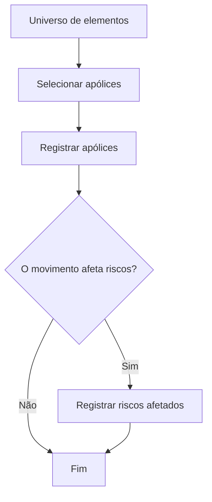

# Seleção e Registro de Elementos Candidatos em Emissão para Processos Massivos

## 1. Metadados do Documento
- **Arquivo de Origem:** Não identificado
- **Tipo de Documento:** Procedimento
- **Domínio / Sistema:** Reef / Emisión
- **Público-Alvo:** Operação, Negócio e equipes técnicas
- **Data/Versão Identificada:** Não identificada

---

## 2. Resumo Executivo & Contexto de Negócio

O documento descreve a etapa de seleção de elementos candidatos em **Emisión** para integração a um processo massivo. O processo é associado a uma visão técnica e tem como objetivo definir quais elementos do universo disponível devem ser efetivamente afetados por determinado movimento.

Os elementos candidatos são inicialmente selecionados a partir de um universo de elementos, com apólices apresentadas como exemplo. Após a seleção, as apólices são registradas para fazer parte do processamento massivo.

O fluxo contém uma decisão funcional: verificar se o movimento afeta riscos. Quando o movimento afeta riscos, os riscos afetados também devem ser registrados. Quando o movimento não afeta riscos, o processo é encerrado após o registro das apólices.

O conteúdo disponível é conciso e concentra-se no fluxo de negócio. Não há detalhamento sobre interfaces, métodos HTTP, contratos JSON, regras de elegibilidade das apólices, persistência de dados, responsáveis por cada etapa ou mecanismos de auditoria.

---

## 3. Arquitetura, Componentes & Tecnologias Envolvidas

Os componentes e contextos explicitamente citados são:

- **Emisión:** contexto no qual ocorre a seleção dos elementos candidatos.
- **Processo massivo:** processamento para o qual os elementos selecionados são incluídos.
- **Apólices:** exemplo de elementos do universo que podem ser selecionados e registrados.
- **Riscos:** entidades que devem ser registradas quando o movimento os afeta.
- **Reef:** referência identificada no ambiente de documentação.
- **Mapfredocument:** referência identificada no ambiente de documentação.
- **Zeus:** opção de navegação identificada no ambiente de documentação.
- **VL:** identificação apresentada junto ao estado de ciclo de vida e aprovação da documentação.



> **Nota de Análise:** O documento não detalha a arquitetura de software, os sistemas responsáveis por registrar apólices e riscos, nem integrações técnicas entre Reef, Emisión, Mapfredocument ou Zeus.

---

## 4. Regras de Negócio, Especificações Funcionais & Processos

### Objetivo do procedimento

O objetivo é conhecer as formas pelas quais elementos podem ser incluídos para que façam parte de um movimento em um processo massivo.

### Definição de seleção de elementos candidatos

A seleção consiste em incluir os elementos inicialmente pretendidos para afetação pelo processo massivo. A partir de um universo de elementos, como apólices, são extraídos os elementos que se deseja processar.

### Processo operacional

1. **Selecionar apólices:** selecionar as apólices candidatas dentro do universo de elementos.
2. **Registrar apólices:** registrar as apólices selecionadas para que integrem o movimento do processo massivo.
3. **Avaliar impacto sobre riscos:** verificar se o movimento afeta riscos.
4. **Registrar riscos afetados:** quando o movimento afeta riscos, registrar os riscos afetados.
5. **Finalizar:** encerrar o procedimento após o registro das apólices, caso não haja impacto sobre riscos, ou após o registro dos riscos afetados, caso exista impacto.

### Regra condicional identificada

- **Condição:** o movimento afeta riscos.
- **Se a condição for verdadeira:** registrar os riscos afetados.
- **Se a condição for falsa:** finalizar o processo sem a etapa de registro de riscos afetados.

> **Nota de Análise:** O documento não define critérios para determinar se um movimento afeta riscos, nem descreve os atributos que devem ser registrados para apólices ou riscos.

---

## 5. Tabelas de Parâmetros, Ambientes e Estruturas de Dados

| Item / Parâmetro | Descrição / Função | Tipo / Valores / Formato | Ambiente / Observações |
| :--- | :--- | :--- | :--- |
| Elementos candidatos | Elementos inicialmente pretendidos para serem afetados pelo processo massivo | Universo de elementos; apólices são citadas como exemplo | Contexto de Emisión |
| Apólices | Exemplo de elementos que podem ser selecionados para processamento | Não detalhado | Devem ser selecionadas e registradas |
| Movimento | Ação ou contexto que determina os elementos a afetar no processo massivo | Não detalhado | Deve ser avaliado quanto ao impacto sobre riscos |
| Riscos afetados | Riscos relacionados ao movimento quando houver impacto | Não detalhado | Devem ser registrados somente se o movimento afetar riscos |
| Processo massivo | Processo que recebe os elementos selecionados | Não detalhado | Finalidade da seleção e do registro |
| Reef | Referência de documentação ou contexto de navegação | Não detalhado | Identificado como “DOCUMENTACIÓN Reef” |
| Mapfredocument | Referência de documentação ou ambiente | Não detalhado | Identificado no conteúdo bruto |
| Zeus | Opção de navegação na documentação | Não detalhado | Identificado no menu de navegação |
| Lifecycle | Estado do ciclo de vida documental | `Approved Source` | Identificado no conteúdo bruto |
| Owner | Proprietário indicado no ambiente documental | `user:agonzalez_mapfre.com` | Identificado literalmente no conteúdo bruto |
| Idioma | Idioma exibido no ambiente documental | `ES` | Identificado no menu de navegação |

---

## 6. Bateria de Perguntas & Respostas para RAG (FAQ Sintético)

### P1: Em que consiste a seleção de elementos candidatos em Emisión?
**R:** A seleção de elementos candidatos em Emisión consiste em incluir os elementos inicialmente pretendidos para afetação em um processo massivo. A partir de um universo de elementos, como apólices, são extraídos aqueles que se deseja processar.

### P2: Qual é o objetivo do procedimento de seleção de elementos candidatos?
**R:** O objetivo é conhecer as formas pelas quais os elementos podem ser incluídos para que façam parte do movimento em um processo massivo.

### P3: Qual é o primeiro passo do processo descrito?
**R:** O primeiro passo é selecionar as apólices candidatas no universo de elementos disponível.

### P4: O que deve ocorrer após a seleção das apólices?
**R:** Após a seleção, as apólices devem ser registradas para integrar o movimento do processo massivo.

### P5: Quando os riscos afetados devem ser registrados?
**R:** Os riscos afetados devem ser registrados quando a avaliação indicar que o movimento afeta riscos.

### P6: O que acontece quando o movimento não afeta riscos?
**R:** Quando o movimento não afeta riscos, o processo é encerrado após o registro das apólices, sem a necessidade de registrar riscos afetados.

### P7: Quais são as etapas enumeradas no documento?
**R:** As etapas enumeradas são: selecionar apólices, registrar apólices e registrar riscos afetados.

### P8: O documento especifica como identificar se um movimento afeta riscos?
**R:** Não. O documento apresenta a decisão “¿Afecta el movimiento a riesgos?”, mas não define critérios, regras de validação ou dados necessários para determinar essa condição.

### P9: O documento descreve contratos técnicos, APIs ou métodos HTTP do processo?
**R:** Não. O conteúdo não detalha APIs, métodos HTTP, contratos JSON, bancos de dados, mensagens de integração ou tecnologias de implementação.

### P10: Quais referências de documentação ou navegação são citadas?
**R:** O conteúdo cita DOCUMENTACIÓN Reef, Mapfredocument, Zeus, Soluciones, Arquitecturas, APIs, Componentes, Cloud, Documentación e Ayuda como referências ou opções presentes no ambiente documental.

---

## 7. Glossário de Termos, Siglas & Conceitos-Chave

- **Emisión:** contexto em que ocorre a seleção de elementos candidatos, conforme citado no documento.
- **Elemento candidato:** elemento inicialmente escolhido para ser afetado pelo processo massivo.
- **Processo massivo:** processo que recebe e processa os elementos selecionados.
- **Apólice:** exemplo de elemento do universo disponível que pode ser selecionado e registrado.
- **Risco afetado:** risco que deve ser registrado quando o movimento o afeta.
- **Movimento:** contexto ou ação cuja aplicação pode afetar apólices e riscos.
- **Reef:** referência identificada no ambiente de documentação.
- **VL:** sigla exibida no conteúdo bruto, sem expansão ou definição adicional.
- **ES:** identificação de idioma exibida no ambiente documental; o conteúdo sugere espanhol, sem explicitação formal.

---

## 8. Notas Críticas, Riscos & Limitações

- O documento não especifica critérios de seleção de apólices.
- O documento não define como identificar se um movimento afeta riscos.
- Não foram identificados campos, formatos, modelos de dados ou obrigatoriedades para o registro de apólices e riscos.
- Não há descrição de sistemas de origem, sistemas de destino, APIs, integrações, filas, eventos ou persistência.
- Não há definição de tratamento de erros, reprocessamento, auditoria, aprovação ou reversão do movimento.
- As referências a Reef, Mapfredocument, Zeus e VL não possuem detalhamento funcional ou técnico adicional no conteúdo fornecido.

---

## 9. Conteúdo Bruto Estruturado (Referência Fiel)

```text
--- [PÁGINA 1 DE 1] ---

SELECCIONAR elementos candidatos en Emisión (enlace con visión
técnica)
¿En que consiste?
Es la inclusión de aquellos elementos que inicialmente se pretende afectar en el proceso masivo. Es decir, del universo de elementos (como
pueden ser las pólizas), se extraen aquellos que se quiere sean procesados.
Objetivo
Conocer las formas en las que se puede incluir elementos para que estos formen parte del movimiento en el proceso masivo.
Proceso a seguir
SI
NO
SELECCIONAR
pólizas (1)
REGISTRAR
pólizas (2)
¿Afecta el
movimiento
a riesgos? REGISTRAR
riesgos
afectados (3)
FIN
1. SELECCIONAR pólizas
2. REGISTRAR pólizas
3. REGISTRAR riesgos afectados
Checking links...
Documentation / DOCUMENTACIÓN Reef
DOCUMENTACIÓN Reef
Mapfredocument
DOCUMENTACIÓN Reef
Owner
user:agonzalez_mapfre.com
Lifecycle
Approved Source
 /
VL
Buscar Inicio Soluciones Arquitecturas APIs Componentes Cloud Documentación Zeus Reef Ayuda
ES
```
