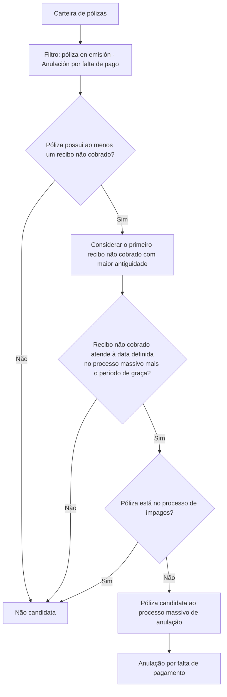

# Filtro de Pólizas en Emisión — Anulación por Falta de Pago

## 1. Metadados do Documento
- **Arquivo de Origem:** Não identificado
- **Tipo de Documento:** Procedimento funcional
- **Domínio / Sistema:** Reef.core / Mapfre
- **Público-Alvo:** Negócio, Operação e equipes responsáveis por processos massivos de anulação
- **Data/Versão Identificada:** Não identificada
- **Owner identificado:** `user:agonzalez_mapfre.com`
- **Lifecycle identificado:** Approved Source

---

## 2. Resumo Executivo & Contexto de Negócio

O documento descreve o filtro **“póliza en emisión - Anulación por falta de pago”**, pertencente ao núcleo de **Reef.core**. A finalidade do filtro é determinar quais pólizas serão candidatas a um processo massivo de anulação motivado pela ausência de pagamento.

O processo extrai da carteira as pólizas que possuem pelo menos um recibo não cobrado na data definida para o processo massivo, considerando adicionalmente o período de graça estabelecido. A póliza também não pode estar incluída no processo de impagos.

Quando uma póliza possui mais de um recibo não cobrado, o filtro utiliza como referência o primeiro recibo não cobrado com maior antiguidade. O documento não detalha fórmulas, critérios de ordenação adicionais, formatos de dados, interfaces, métodos HTTP ou contratos de integração.

A execução não exige ação manual adicional, pois o filtro já está estabelecido pelo núcleo de Reef.core.

---

## 3. Arquitetura, Componentes & Tecnologias Envolvidas

### Componentes e entidades identificados

| Componente / Entidade | Papel descrito no documento |
| :--- | :--- |
| Reef.core | Núcleo que contém o filtro estabelecido para o processo. |
| Filtro “póliza en emisión - Anulación por falta de pago” | Determina pólizas candidatas à anulação massiva por falta de pagamento. |
| Carteira | Fonte da qual são extraídas as pólizas candidatas. |
| Póliza | Unidade avaliada pelo filtro para possível anulação. |
| Recibo | Elemento de cobrança usado para avaliar a ausência de pagamento. |
| Processo massivo de anulação | Processo que define uma data de referência e utiliza o filtro para identificar candidatas. |
| Período de graça | Período estabelecido que compõe o critério temporal de seleção. |
| Processo de impagos | Processo cuja participação exclui a póliza da seleção. |
| Mapfredocument | Nome apresentado na interface de documentação. Não há detalhamento funcional adicional. |



> **Nota de Análise:** O documento identifica Reef.core como o núcleo que estabelece o filtro, mas não descreve arquitetura técnica, banco de dados, serviços, APIs, tecnologias de implementação ou ambientes.

---

## 4. Regras de Negócio, Especificações Funcionais & Processos

### Objetivo funcional

Determinar quais pólizas serão candidatas em um processo massivo de **anulação por falta de pagamento**.

### Critérios de elegibilidade da póliza

Uma póliza deve atender simultaneamente aos seguintes critérios:

1. A póliza deve pertencer à carteira avaliada pelo processo.
2. A póliza deve possuir pelo menos um recibo que não tenha sido cobrado.
3. O recibo não cobrado deve ser avaliado em relação à data definida no processo massivo e ao período de graça estabelecido.
4. A póliza não pode estar no processo de impagos.
5. Caso existam vários recibos não cobrados para uma póliza, deve ser considerado o primeiro recibo não cobrado com maior antiguidade.

### Processo descrito

1. O processo massivo define a data de referência.
2. O filtro examina a carteira de pólizas.
3. O filtro identifica pólizas com pelo menos um recibo não cobrado.
4. Para pólizas com múltiplos recibos não cobrados, o filtro toma como referência o primeiro recibo não cobrado mais antigo.
5. O filtro considera a data definida no processo massivo e o período de graça estabelecido.
6. O filtro exclui pólizas presentes no processo de impagos.
7. As pólizas restantes são candidatas ao processo massivo de anulação por falta de pagamento.

### Operação manual

Não é necessário executar ação adicional, pois o filtro é um dos filtros estabelecidos pelo núcleo de Reef.core.

> **Nota de Análise:** O documento não detalha como a data do processo massivo e o período de graça são calculados ou comparados, nem especifica a definição operacional de “proceso de impagos”.

---

## 5. Tabelas de Parâmetros, Ambientes e Estruturas de Dados

| Item / Parâmetro | Descrição / Função | Tipo / Valores / Formato | Ambiente / Observações |
| :--- | :--- | :--- | :--- |
| Filtro | Identifica pólizas candidatas à anulação por falta de pagamento. | `póliza en emisión - Anulación por falta de pago` | Estabelecido pelo núcleo de Reef.core. |
| Póliza | Registro avaliado para possível candidatura à anulação. | Póliza da carteira | Deve ter ao menos um recibo não cobrado. |
| Recibo não cobrado | Elemento usado para verificar falta de pagamento. | Recibo com status de não cobrança; formato não detalhado | É considerado em relação à data do processo massivo e ao período de graça. |
| Data definida no processo massivo | Data de referência para o processo de anulação. | Data; formato não informado | Definida no processo massivo. |
| Período de graça | Período incorporado ao critério de elegibilidade. | Período; unidade e valor não informados | Deve estar estabelecido para o processo. |
| Primeiro recibo não cobrado com maior antiguidade | Recibo de referência quando há vários recibos não cobrados. | Regra de seleção | O documento não especifica o critério técnico de ordenação. |
| Processo de impagos | Processo que impede a candidatura da póliza quando a póliza está incluída nele. | Processo; detalhes não informados | Pólizas nesse processo são excluídas. |
| Reef.core | Núcleo que possui o filtro definido. | Sistema / núcleo | Não são apresentados detalhes técnicos. |
| Owner | Proprietário identificado na documentação. | `user:agonzalez_mapfre.com` | Conforme a interface de documentação. |
| Lifecycle | Estado apresentado na documentação. | `Approved Source` | Conforme a interface de documentação. |

---

## 6. Bateria de Perguntas & Respostas para RAG (FAQ Sintético)

### P1: Qual é o objetivo do filtro “póliza en emisión - Anulación por falta de pago”?
**R:** O filtro determina quais pólizas serão candidatas a um processo massivo de anulação por falta de pagamento.

### P2: De onde o processo extrai as pólizas candidatas à anulação?
**R:** O processo extrai as pólizas candidatas da carteira, desde que atendam aos critérios relacionados a recibos não cobrados, data do processo massivo, período de graça e exclusão do processo de impagos.

### P3: Uma póliza sem recibos não cobrados pode ser candidata à anulação por falta de pagamento?
**R:** Não. O documento estabelece que a póliza deve dispor de pelo menos um recibo que não tenha sido cobrado.

### P4: Qual recibo é utilizado quando uma póliza possui vários recibos sem cobrar?
**R:** O filtro toma como referência o primeiro recibo não cobrado com maior antiguidade.

### P5: Como a data do processo massivo influencia a seleção das pólizas?
**R:** A data definida no processo massivo faz parte do critério aplicado aos recibos não cobrados, juntamente com o período de graça estabelecido. O documento não informa a fórmula exata dessa avaliação temporal.

### P6: O que acontece com uma póliza que está no processo de impagos?
**R:** A póliza não é candidata ao processo massivo de anulação por falta de pagamento, pois o documento exige que a póliza não esteja no processo de impagos.

### P7: É necessário executar manualmente o filtro de anulação por falta de pagamento?
**R:** Não. O documento informa que não é necessário realizar nenhuma ação, pois esse filtro já está estabelecido pelo núcleo de Reef.core.

### P8: Qual sistema contém o filtro de pólizas em emissão para anulação por falta de pagamento?
**R:** O filtro está estabelecido pelo núcleo de Reef.core.

### P9: O documento descreve métodos HTTP, contratos JSON ou APIs do filtro?
**R:** Não. O documento não apresenta métodos HTTP, contratos JSON, APIs, URLs, bancos de dados ou detalhes de integração técnica.

### P10: O documento informa o valor ou a unidade do período de graça?
**R:** Não. O documento menciona a existência de um período de graça estabelecido, mas não informa seu valor, unidade de medida ou regra de parametrização.

---

## 7. Glossário de Termos, Siglas & Conceitos-Chave

- **Reef.core:** Núcleo mencionado como responsável por estabelecer o filtro de seleção de pólizas.
- **Póliza:** Entidade da carteira avaliada para candidatura ao processo massivo de anulação.
- **Recibo:** Elemento de cobrança associado à póliza; o filtro considera recibos não cobrados.
- **Recibo não cobrado:** Recibo que não foi cobrado até a data aplicável ao processo, considerando o período de graça.
- **Anulação por falta de pagamento:** Processo massivo para o qual o filtro identifica pólizas candidatas.
- **Período de graça:** Período estabelecido e considerado junto à data definida no processo massivo.
- **Processo de impagos:** Processo cuja presença da póliza é condição de exclusão da candidatura.
- **Carteira:** Conjunto de pólizas do qual o processo extrai candidatas.
- **Lifecycle:** Campo apresentado na interface de documentação com o valor `Approved Source`.
- **Owner:** Campo apresentado na interface de documentação com o valor `user:agonzalez_mapfre.com`.

---

## 8. Notas Críticas, Riscos & Limitações

- O documento não identifica o arquivo de origem, data, versão, autor formal ou histórico de alterações.
- O documento não especifica valores, unidade temporal ou mecanismo de parametrização do período de graça.
- O documento não detalha a comparação entre a data definida no processo massivo e a antiguidade do recibo não cobrado.
- O documento não define tecnicamente o processo de impagos, seus estados ou a forma de identificação de uma póliza nesse processo.
- O documento não apresenta métodos HTTP, contratos JSON, esquemas de dados, logs, URLs, servidores, ambientes ou dependências de integração.
- O documento não esclarece se a candidatura ao processo massivo resulta automaticamente na anulação efetiva da póliza.
- O termo “primeiro recibo não cobrado com maior antiguidade” é apresentado como regra de seleção, porém sem detalhar critérios de desempate ou ordenação.

---

## 9. Conteúdo Bruto Estruturado (Referência Fiel)

```text
--- [PÁGINA 1 DE 1] ---

FILTRAR póliza en emisión - Anulación por falta de pago
¿En que consiste?
Determinar qué pólizas serán candidatas en un proceso masivo de Anulación por falta de pago.
Objetivo
Extraer de la cartera aquellas pólizas que dispongan de al menos un recibo que no haya sido cobrado a la fecha denida en el proceso
masivo más el periodo de gracia establecido y que no se encuentre en el proceso de impagos.
Para este proceso se toma el primer recibo no cobrado con una antigüedad mayor (por si existieran más recibos sin cobrar).
Proceso a seguir
No es necesario realizar acción alguna ya que este es uno de los ltros que se encuentran establecidos por el núcleo de Reef.core.
Documentation / DOCUMENTACIÓN Reef
DOCUMENTACIÓN Reef
Mapfredocument
DOCUMENTACIÓN Reef
Owner
user:agonzalez_mapfre.com
Lifecycle
Approved Source
 /
VL
Buscar Inicio Soluciones Arquitecturas APIs Componentes Cloud Documentación Zeus Reef Ayuda
ES
```
