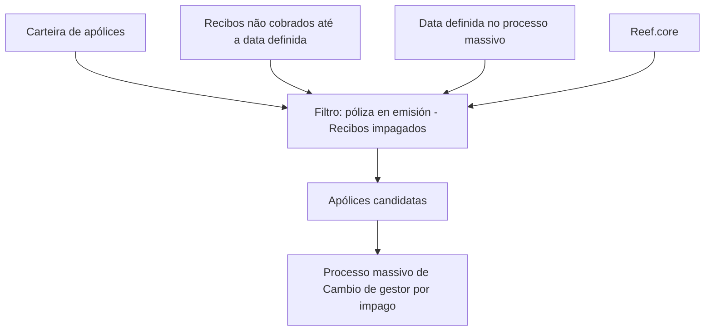
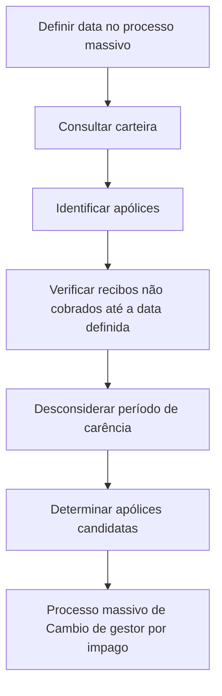

# Filtro de Pólizas en Emisión — Recibos Impagados no Reef.core

## 1. Metadados do Documento
- **Arquivo de Origem:** Não identificado no conteúdo fornecido
- **Tipo de Documento:** Procedimento
- **Domínio / Sistema:** Reef.core / Mapfre
- **Público-Alvo:** Operação, Negócio, Desenvolvedores e Arquitetos
- **Data/Versão Identificada:** Não identificada
- **Owner identificado:** `user:agonzalez_mapfre.com`
- **Lifecycle identificado:** `Approved Source`

---

## 2. Resumo Executivo & Contexto de Negócio

O documento descreve o filtro **“FILTRAR póliza en emisión - Recibos impagados”**, relacionado ao núcleo do sistema **Reef.core**. O filtro é aplicado no contexto de um processo massivo de **Cambio de gestor por impago**.

O objetivo funcional é determinar quais apólices serão candidatas ao processo massivo de alteração de gestor por inadimplência. A seleção considera apólices da carteira e os respectivos recibos que não tenham sido cobrados até a data definida no processo massivo.

O movimento não considera o período de carência (“periodo de gracia”). Portanto, a existência ou duração de um período de carência não altera o critério de extração indicado pelo documento.

O documento também estabelece que não é necessária nenhuma ação manual para executar ou configurar esse filtro. O filtro já está estabelecido pelo núcleo do Reef.core. Não foram fornecidos detalhes sobre contratos técnicos, métodos HTTP, persistência de dados, agendamento, critérios adicionais de elegibilidade ou comportamento após a identificação das apólices candidatas.

---

## 3. Arquitetura, Componentes & Tecnologias Envolvidas

### Componentes identificados

| Componente / Termo | Papel identificado no documento | Detalhamento disponível |
| :--- | :--- | :--- |
| Reef.core | Núcleo que possui o filtro estabelecido. | O documento não especifica a arquitetura interna, tecnologia, APIs ou módulos envolvidos. |
| Filtro “póliza en emisión - Recibos impagados” | Mecanismo usado para identificar apólices candidatas ao processo massivo. | Não há critérios técnicos adicionais descritos. |
| Proceso masivo de Cambio de gestor por impago | Processo massivo para o qual as apólices são selecionadas. | Não há descrição das etapas posteriores à seleção. |
| Carteira | Origem das apólices que serão extraídas. | Não há definição de estrutura, base de dados ou sistema de origem. |
| Recibos | Registros avaliados quanto à condição de não cobrança. | Não há campos, estados ou contratos de dados descritos. |
| Mapfredocument | Portal ou referência documental exibida no conteúdo bruto. | Não há explicação funcional adicional. |



**Nota de Análise:** O documento informa que o filtro é estabelecido pelo núcleo do Reef.core, mas não detalha serviços, integrações, APIs, bancos de dados, eventos, filas, interfaces ou tecnologias de implementação.

---

## 4. Regras de Negócio, Especificações Funcionais & Processos

### Objetivo funcional

1. Determinar quais apólices serão candidatas em um processo massivo de **Cambio de gestor por impago**.
2. Extrair da carteira as apólices aplicáveis.
3. Extrair todos os recibos das apólices selecionadas que não tenham sido cobrados até a data definida no processo massivo.

### Critérios explicitamente informados

| Regra | Descrição |
| :--- | :--- |
| Seleção de apólices | O filtro determina quais apólices serão candidatas ao processo massivo de alteração de gestor por inadimplência. |
| Origem das apólices | As apólices são extraídas da carteira. |
| Seleção de recibos | Devem ser considerados todos os recibos que não tenham sido cobrados até a data definida no processo massivo. |
| Data de referência | A condição de cobrança é avaliada em relação à data definida no processo massivo. |
| Período de carência | O movimento não considera o período de carência. |
| Ação manual | Não é necessário realizar nenhuma ação manual. |
| Responsável pela disponibilização do filtro | O filtro já se encontra estabelecido pelo núcleo do Reef.core. |

### Fluxo funcional extraído



**Nota de Análise:** O documento não detalha o que caracteriza uma “póliza en emisión”, quais status de recibo equivalem a “não cobrado”, nem quais ações concretas são realizadas pelo processo de Cambio de gestor após a seleção.

---

## 5. Tabelas de Parâmetros, Ambientes e Estruturas de Dados

| Item / Parâmetro | Descrição / Função | Tipo / Valores / Formato | Ambiente / Observações |
| :--- | :--- | :--- | :--- |
| Filtro | `FILTRAR póliza en emisión - Recibos impagados` | Nome funcional do filtro | Estabelecido pelo núcleo do Reef.core |
| Processo massivo | `Cambio de gestor por impago` | Processo de negócio | Recebe as apólices candidatas identificadas pelo filtro |
| Apólice | `póliza` | Entidade de negócio | Extraída da carteira quando candidata ao processo massivo |
| Recibo | `recibo` | Entidade de negócio | São considerados os recibos não cobrados até a data definida |
| Condição de cobrança | “no hayan sido cobrados” | Critério de elegibilidade | Avaliado até a data definida no processo massivo |
| Data definida | Data configurada ou definida no processo massivo | Data; formato não informado | Referência temporal para avaliar recibos não cobrados |
| Período de carência | `periodo de gracia` | Regra de exclusão | Não é considerado pelo movimento |
| Ação manual | Não necessária | Condição operacional | O filtro já existe no núcleo do Reef.core |
| Sistema | Reef.core | Sistema / núcleo | Responsável por disponibilizar o filtro |
| Owner | `user:agonzalez_mapfre.com` | Identificador de proprietário | Conforme conteúdo documental |
| Lifecycle | `Approved Source` | Estado documental | Conforme conteúdo documental |
| Referência documental | `Mapfredocument` | Portal ou repositório citado | Sem detalhamento adicional |
| Idioma exibido | `ES` | Código de idioma | Exibido na navegação do conteúdo bruto |

---

## 6. Bateria de Perguntas & Respostas para RAG (FAQ Sintético)

### P1: Qual é o objetivo do filtro “póliza en emisión - Recibos impagados”?
**R:** O filtro tem como objetivo determinar quais apólices serão candidatas em um processo massivo de **Cambio de gestor por impago**.

### P2: Quais registros são extraídos da carteira pelo filtro?
**R:** O filtro extrai da carteira as apólices candidatas e todos os recibos dessas apólices que não tenham sido cobrados até a data definida no processo massivo.

### P3: Qual data é usada para avaliar se um recibo foi cobrado?
**R:** A avaliação usa a data definida no processo massivo. O documento determina que devem ser considerados os recibos que não tenham sido cobrados até essa data.

### P4: O período de carência influencia a seleção de apólices e recibos?
**R:** Não. O documento afirma expressamente que o movimento não considera o período de carência.

### P5: É necessária alguma ação manual para ativar ou executar o filtro?
**R:** Não. O documento informa que não é necessário realizar nenhuma ação, pois esse é um dos filtros já estabelecidos pelo núcleo do Reef.core.

### P6: Qual sistema disponibiliza o filtro de apólices em emissão com recibos impagados?
**R:** O filtro é estabelecido pelo núcleo do **Reef.core**.

### P7: Para qual processo de negócio as apólices selecionadas são candidatas?
**R:** As apólices selecionadas são candidatas ao processo massivo de **Cambio de gestor por impago**.

### P8: O documento define quais status técnicos representam um recibo não cobrado?
**R:** Não. O documento usa o critério funcional “recibos que no hayan sido cobrados”, mas não informa códigos de status, campos, tabelas, APIs ou regras técnicas para identificar essa condição.

### P9: O documento detalha as ações executadas após uma apólice ser selecionada como candidata?
**R:** Não. O texto informa apenas que a apólice será candidata ao processo massivo de Cambio de gestor por impago; não descreve as etapas posteriores, integrações ou efeitos operacionais desse processo.

### P10: O documento apresenta endpoints, métodos HTTP ou contratos JSON do Reef.core?
**R:** Não. Não há endpoints, métodos HTTP, contratos JSON, tecnologias de implementação, URLs de ambiente ou especificações de integração no conteúdo fornecido.

---

## 7. Glossário de Termos, Siglas & Conceitos-Chave

- **Reef.core:** Núcleo do sistema Reef.core, citado como responsável por possuir o filtro já estabelecido.
- **Póliza:** Apólice; entidade de negócio selecionada a partir da carteira.
- **Recibo:** Registro associado à apólice, avaliado conforme a condição de não cobrança até uma data definida.
- **Cambio de gestor por impago:** Processo massivo para o qual as apólices são candidatas em razão de inadimplência.
- **Impago:** Inadimplência ou ausência de pagamento, conforme o contexto do processo massivo.
- **Periodo de gracia:** Período de carência; o documento determina que não deve ser considerado pelo movimento.
- **Carteira:** Conjunto de apólices de onde são extraídas as apólices e os recibos elegíveis.
- **Approved Source:** Estado de ciclo de vida exibido no conteúdo documental.
- **Mapfredocument:** Referência documental exibida no conteúdo bruto, sem detalhamento funcional adicional.

---

## 8. Notas Críticas, Riscos & Limitações

- O documento não identifica o arquivo de origem, data, versão, autor documental completo ou histórico de alterações.
- O texto não especifica os atributos que definem uma **póliza en emisión**.
- O texto não define os status, campos ou eventos que comprovam que um recibo foi ou não cobrado.
- Não há descrição de como a data do processo massivo é definida, persistida, validada ou comunicada ao Reef.core.
- Não são apresentados critérios de desempate, exceções, reprocessamento, tratamento de erros ou auditoria.
- Não há contratos de integração, métodos HTTP, payloads JSON, bancos de dados, URLs, servidores, ambientes ou mecanismos de agendamento.
- A instrução de desconsiderar o período de carência é explícita, mas o documento não detalha eventuais impactos operacionais, regulatórios ou de negócio dessa decisão.
- O documento não descreve o comportamento do processo massivo de Cambio de gestor por impago após a identificação das apólices candidatas.

---

## 9. Conteúdo Bruto Estruturado (Referência Fiel)

```text
--- [PÁGINA 1 DE 1] ---

FILTRAR póliza en emisión - Recibos impagados
¿En que consiste?
Determinar qué pólizas serán candidatas en un proceso masivo de Cambio de gestor por impago.
Objetivo
Extraer de la cartera aquellas pólizas y todos los recibos que no hayan sido cobrados a la fecha denida en el proceso masivo. Este
movimiento no tiene en cuenta el periodo de gracia
Proceso a seguir
No es necesario realizar acción alguna ya que este es uno de los ltros que se encuentran establecidos por el núcleo de Reef.core.
Documentation / DOCUMENTACIÓN Reef
DOCUMENTACIÓN Reef
Mapfredocument
DOCUMENTACIÓN Reef
Owner
user:agonzalez_mapfre.com
Lifecycle
Approved Source
 /
VL
Buscar Inicio Soluciones Arquitecturas APIs Componentes Cloud Documentación Zeus Reef Ayuda
ES
```
