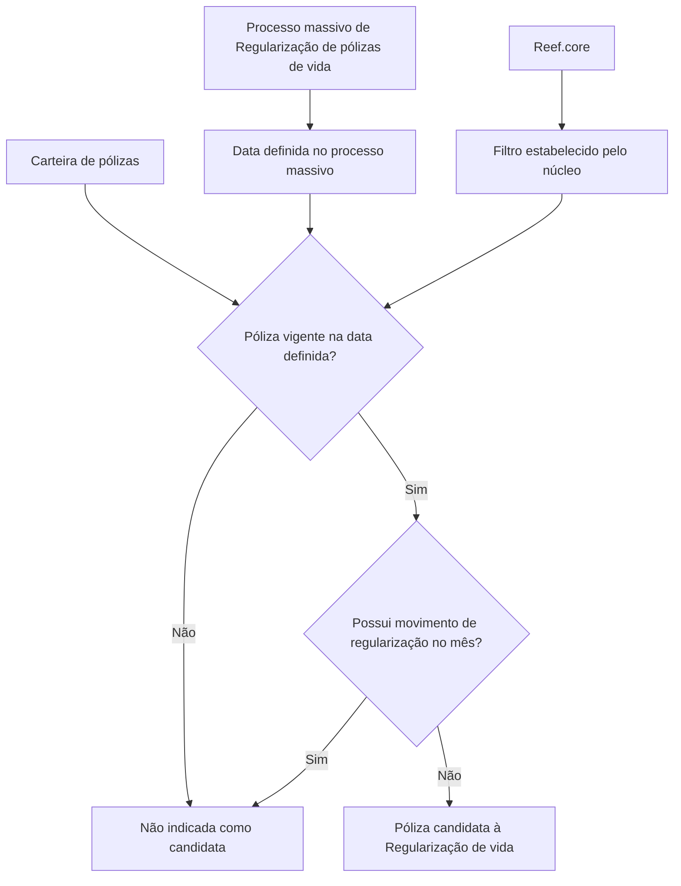

# Filtro de Pólizas em Emissão — Regularização de Vida no Reef.core

## 1. Metadados do Documento
- **Arquivo de Origem:** Não identificado — conteúdo bruto fornecido em mensagem.
- **Tipo de Documento:** Procedimento / documentação funcional.
- **Domínio / Sistema:** Regularização de pólizas de vida; Reef.core; documentação Reef; Mapfre.
- **Público-Alvo:** Negócio, operação, analistas funcionais e equipes técnicas que consultam a documentação Reef.
- **Data/Versão Identificada:** Não identificada.

---

## 2. Resumo Executivo & Contexto de Negócio

O documento descreve o filtro **“FILTRAR póliza en emisión - Regularización vida”**, aplicado ao contexto de regularização massiva de pólizas de vida. A finalidade explícita do filtro é determinar quais pólizas serão candidatas a esse processo massivo.

A seleção considera a carteira de pólizas e uma data definida no processo massivo. O documento informa que devem ser extraídas pólizas que estejam vigentes nessa data e que não possuam movimento de regularização no mês.

O fluxo não exige ação manual do usuário ou operador. O filtro já está estabelecido pelo núcleo do **Reef.core**, caracterizando uma regra provida pelo núcleo do sistema, conforme o conteúdo disponível.

O material é conciso e não especifica contratos de integração, telas, campos de entrada, critérios adicionais de elegibilidade, códigos de retorno, logs, métodos HTTP ou estruturas de dados. Portanto, o escopo recuperável com fidelidade limita-se à definição, objetivo e condições declaradas para o filtro.

---

## 3. Arquitetura, Componentes & Tecnologias Envolvidas

### Componentes e sistemas citados

| Componente / Termo | Papel identificado no documento | Detalhamento disponível |
| :--- | :--- | :--- |
| Filtro “FILTRAR póliza en emisión - Regularización vida” | Determina pólizas candidatas ao processo massivo de regularização de vida. | O filtro considera vigência na data definida e ausência de movimento de regularização no mês. |
| Processo massivo de regularização | Processo que utiliza o filtro para identificar candidatas na carteira de pólizas de vida. | A data de referência é definida no processo massivo. |
| Carteira de pólizas | Fonte da qual são extraídas as pólizas candidatas. | O documento não detalha repositório, base de dados ou interface de consulta. |
| Reef.core | Núcleo que possui filtros já estabelecidos, incluindo o filtro descrito. | Não há detalhes de arquitetura interna, tecnologia ou interfaces. |
| Documentación Reef | Área ou portal de documentação exibido no conteúdo bruto. | São exibidos itens de navegação como Soluciones, Arquitecturas, APIs, Componentes, Cloud, Documentación e Zeus. |
| Mapfredocument | Termo exibido na área de documentação. | O documento não define sua função técnica ou funcional. |
| Owner `user:agonzalez_mapfre.com` | Proprietário exibido para o conteúdo documental. | Não há informação adicional sobre responsabilidade ou equipe. |
| Lifecycle `Approved` | Estado de ciclo de vida exibido para a documentação. | Não há definição do processo de aprovação. |



> **Nota de Análise:** O documento declara que o filtro está estabelecido pelo núcleo do Reef.core, mas não detalha como o processo massivo invoca o filtro, nem quais dados técnicos são consultados.

---

## 4. Regras de Negócio, Especificações Funcionais & Processos

### Objetivo funcional

Determinar quais pólizas serão candidatas em um processo massivo de regularização de pólizas de vida.

### Regra de seleção de candidatas

Uma póliza da carteira é candidata ao processo massivo de regularização de vida quando atende simultaneamente aos critérios abaixo:

1. A póliza está **vigente** na data definida no processo massivo.
2. A póliza **não possui movimento de regularização no mês**.

### Critérios de exclusão inferidos diretamente da regra

Uma póliza não deve ser extraída como candidata pelo filtro quando:

1. A póliza não está vigente na data definida no processo massivo.
2. A póliza possui movimento de regularização no mês.

### Operação do filtro

1. O processo massivo define uma data de referência.
2. O filtro consulta ou considera a carteira de pólizas.
3. O filtro avalia a vigência de cada póliza na data definida.
4. Para as pólizas vigentes, o filtro verifica a existência de movimento de regularização no mês.
5. O filtro identifica como candidatas somente as pólizas vigentes sem movimento de regularização no mês.
6. Não é necessário realizar ação manual, pois o filtro está estabelecido pelo núcleo do Reef.core.

> **Nota de Análise:** O documento não define o significado operacional de “movimento de regularização”, o período exato do “mês”, o fuso horário da data de vigência, nem o comportamento para pólizas com múltiplos movimentos de regularização.

---

## 5. Tabelas de Parâmetros, Ambientes e Estruturas de Dados

| Item / Parâmetro | Descrição / Função | Tipo / Valores / Formato | Ambiente / Observações |
| :--- | :--- | :--- | :--- |
| Nome do filtro | Identifica o filtro funcional documentado. | `FILTRAR póliza en emisión - Regularización vida` | Associado à regularização de pólizas de vida. |
| Carteira de pólizas | Conjunto de pólizas a partir do qual são extraídas candidatas. | Não especificado | O documento não identifica fonte de dados ou estrutura da carteira. |
| Data definida no processo massivo | Data usada para avaliar se uma póliza está vigente. | Não especificado | Definida pelo processo massivo. |
| Vigência da póliza | Critério de elegibilidade da póliza na data definida. | Vigente / não vigente | Póliza deve estar vigente na data definida. |
| Movimento de regularização no mês | Critério que impede a candidatura quando existente. | Presença / ausência | A póliza candidata não pode ter movimento de regularização no mês. |
| Processo massivo de regularização | Processo que utiliza a seleção de pólizas candidatas. | Processo de negócio | Relacionado a pólizas de vida. |
| Reef.core | Núcleo que contém filtros estabelecidos. | Sistema / núcleo | Não requer ação manual conforme o documento. |
| Lifecycle | Estado exibido para a documentação. | `Approved` | Exibido na área de documentação Reef. |
| Owner | Proprietário exibido para o conteúdo. | `user:agonzalez_mapfre.com` | Não há responsabilidades detalhadas. |
| Source | Valor exibido no conteúdo bruto. | `VL` | O documento não define o significado de `VL`. |
| Idioma da interface | Idioma indicado na documentação. | `ES` | O conteúdo funcional está em espanhol. |

---

## 6. Bateria de Perguntas & Respostas para RAG (FAQ Sintético)

### P1: Qual é o objetivo do filtro “FILTRAR póliza en emisión - Regularización vida”?
**R:** O filtro determina quais pólizas serão candidatas em um processo massivo de regularização de pólizas de vida.

### P2: Quais pólizas devem ser extraídas da carteira para o processo massivo de regularização?
**R:** Devem ser extraídas as pólizas que estejam vigentes na data definida no processo massivo e que não tenham movimento de regularização no mês.

### P3: Uma póliza não vigente na data definida pelo processo massivo pode ser candidata?
**R:** Não. A vigência da póliza na data definida no processo massivo é uma condição necessária para que a póliza seja candidata.

### P4: Uma póliza com movimento de regularização no mês é selecionada pelo filtro?
**R:** Não. O filtro seleciona somente pólizas que não tenham movimento de regularização no mês.

### P5: É necessário executar alguma ação manual para utilizar o filtro de regularização de vida?
**R:** Não. O documento informa que não é necessário realizar ação alguma, pois esse filtro já está estabelecido pelo núcleo do Reef.core.

### P6: Qual sistema possui o filtro de regularização de vida?
**R:** O documento informa que o filtro é um dos filtros estabelecidos pelo núcleo do Reef.core.

### P7: A data usada para verificar a vigência da póliza é definida onde?
**R:** A data de referência é definida no processo massivo de regularização.

### P8: O documento detalha os métodos HTTP ou contratos JSON do filtro?
**R:** Não. O documento não apresenta métodos HTTP, endpoints, contratos JSON, formatos de requisição ou formatos de resposta para o filtro.

### P9: O documento especifica a base de dados ou a origem técnica da carteira de pólizas?
**R:** Não. A carteira de pólizas é citada como fonte para extração das candidatas, mas não há identificação de banco de dados, tabela, serviço ou repositório.

### P10: O que significa o status “Approved” exibido no documento?
**R:** O conteúdo bruto mostra `Lifecycle Approved`, indicando esse valor como estado de ciclo de vida da documentação. O documento não explica o processo ou os critérios associados à aprovação.

---

## 7. Glossário de Termos, Siglas & Conceitos-Chave

- **Póliza:** Termo apresentado no documento para designar a apólice considerada na carteira e no processo de regularização.
- **Regularización:** Processo de regularização aplicado, neste documento, a pólizas de vida.
- **Processo masivo:** Processo em massa que define uma data e identifica pólizas candidatas à regularização.
- **Cartera:** Carteira de pólizas da qual são extraídas as candidatas.
- **Movimiento de regularización:** Movimento de regularização cuja existência no mês impede a seleção da póliza como candidata.
- **Reef.core:** Núcleo citado como responsável por possuir filtros estabelecidos, incluindo o filtro descrito.
- **Lifecycle:** Campo de ciclo de vida exibido com o valor `Approved`.
- **Owner:** Campo de proprietário exibido com o valor `user:agonzalez_mapfre.com`.
- **VL:** Valor exibido no campo `Source`; o significado não é definido pelo documento.
- **ES:** Indicador exibido para o idioma espanhol da interface documental.

---

## 8. Notas Críticas, Riscos & Limitações

- O documento não informa nome de arquivo, versão, data de publicação, autores técnicos ou histórico de alterações.
- Não são detalhados os critérios de cálculo da vigência, incluindo datas de início e fim, fusos horários ou regras para vigência suspensa.
- O conceito de “movimento de regularização no mês” não possui definição de origem, período de apuração ou tratamento de múltiplos movimentos.
- Não há descrição de interfaces, APIs, eventos, jobs, agendamentos, mensagens, tabelas de banco de dados ou logs operacionais.
- O documento não especifica saídas do filtro, quantidade de pólizas processadas, tratamento de erros ou comportamento para dados inconsistentes.
- A menção ao Reef.core não inclui componentes internos, tecnologias, versões ou dependências.
- O conteúdo contém caracteres de extração aparentemente corrompidos em “fecha denida” e “ltros”; a interpretação foi limitada ao contexto textual explícito, sem alterar o conteúdo bruto de referência.

---

## 9. Conteúdo Bruto Estruturado (Referência Fiel)

```text
--- [PÁGINA 1 DE 1] ---

FILTRAR póliza en emisión - Regularización vida
¿En que consiste?
Determinar qué pólizas serán candidatas en un proceso masivo de Regularización de pólizas de vida.
Objetivo
Extraer de la cartera aquellas pólizas vigentes a la fecha denida en el proceso masivo que no tengan un movimiento de regularización en el
mes.
Proceso a seguir
No es necesario realizar acción alguna ya que este es uno de los ltros que se encuentran establecidos por el núcleo de Reef.core.
Documentation / DOCUMENTACIÓN Reef
DOCUMENTACIÓN Reef
Mapfredocument
DOCUMENTACIÓN Reef
Owner
user:agonzalez_mapfre.com
Lifecycle
Approved Source
 / 
 VL
Buscar Inicio Soluciones Arquitecturas APIs Componentes Cloud Documentación Zeus Reef Ayuda
ES
```
