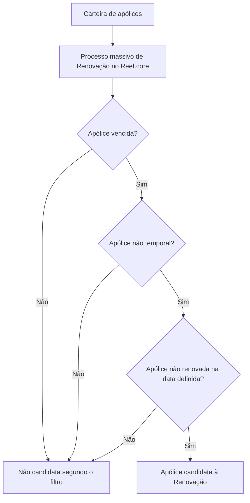

# Filtrar Póliza en Emisión — Renovación no Reef.core

## 1. Metadados do Documento
- **Arquivo de Origem:** Não identificado
- **Tipo de Documento:** Procedimento
- **Domínio / Sistema:** Reef.core / Mapfre
- **Público-Alvo:** Negócio, Operação e equipes responsáveis por processos massivos de renovação
- **Data/Versão Identificada:** Não identificada

---

## 2. Resumo Executivo & Contexto de Negócio

O documento descreve o filtro **“Filtrar póliza en emisión - Renovación”**, aplicado no contexto de um processo massivo de renovação de apólices no núcleo **Reef.core**.

O objetivo do filtro é determinar quais apólices são candidatas à renovação. A seleção é feita a partir da carteira de apólices, considerando critérios explícitos de vencimento, temporalidade e situação de renovação.

Segundo o procedimento apresentado, não é necessária nenhuma ação manual para executar esse filtro. O filtro já está estabelecido pelo núcleo do Reef.core como parte do processamento de renovação.

O conteúdo não detalha critérios adicionais de prioridade, regras de cálculo, interfaces, métodos HTTP, contratos de dados, periodicidade do processo massivo nem os estados posteriores das apólices selecionadas.

---

## 3. Arquitetura, Componentes & Tecnologias Envolvidas

Os elementos identificados no documento são:

| Componente / Elemento | Papel descrito |
| :--- | :--- |
| Reef.core | Núcleo que possui filtros estabelecidos para o processo massivo de renovação. |
| Processo masivo de Renovación | Processo que identifica apólices candidatas à renovação. |
| Cartera | Conjunto de apólices a partir do qual ocorre a extração. |
| Pólizas vencidas | Critério de inclusão na seleção. |
| Pólizas no temporales | Critério de inclusão na seleção. |
| Pólizas no renovadas | Critério de inclusão na seleção até a data definida no processo massivo. |
| Mapfredocument | Referência de documentação exibida no conteúdo. |
| Zeus | Item de navegação mencionado no conteúdo, sem detalhamento funcional. |



**Nota de Análise:** O documento afirma que o filtro é estabelecido pelo núcleo do Reef.core, mas não detalha módulos internos, integrações, APIs, bancos de dados, agendamento ou mecanismos técnicos de execução.

---

## 4. Regras de Negócio, Especificações Funcionais & Processos

### Objetivo funcional

O filtro deve extrair da carteira as apólices que serão candidatas em um processo massivo de renovação.

### Critérios de seleção identificados

Uma apólice é candidata no processo massivo de renovação quando atende simultaneamente aos seguintes critérios:

1. A apólice está **vencida**.
2. A apólice é **não temporal**.
3. A apólice está **não renovada** na data definida no processo massivo.

### Execução operacional

- Não é necessário realizar ação manual.
- O filtro é um dos filtros já estabelecidos pelo núcleo do **Reef.core**.
- O documento não descreve como a data do processo massivo é configurada ou fornecida.
- O documento não informa o tratamento aplicado às apólices que não atendem aos critérios.

---

## 5. Tabelas de Parâmetros, Ambientes e Estruturas de Dados

| Item / Parâmetro | Descrição / Função | Tipo / Valores / Formato | Ambiente / Observações |
| :--- | :--- | :--- | :--- |
| Processo masivo de Renovación | Processo que determina as apólices candidatas à renovação. | Processo de negócio | Executado no contexto do Reef.core. |
| Cartera | Origem das apólices avaliadas pelo filtro. | Conjunto de apólices | Não há estrutura de dados detalhada. |
| Póliza vencida | Primeiro critério explícito para seleção. | Condição de elegibilidade | Deve estar vencida. |
| Póliza no temporal | Segundo critério explícito para seleção. | Condição de elegibilidade | Apólices temporais não são elegíveis conforme o filtro descrito. |
| Póliza no renovada | Terceiro critério explícito para seleção. | Condição de elegibilidade | Deve não estar renovada na data definida no processo massivo. |
| Fecha definida en el proceso masivo | Data de referência para verificar se a apólice já foi renovada. | Data | Formato e mecanismo de definição não informados. |
| Reef.core | Núcleo que contém o filtro estabelecido. | Sistema / núcleo | Não há versão, URL ou ambiente informados. |
| Owner | Proprietário exibido na documentação. | Identificador de usuário | `user:agonzalez_mapfre.com` |
| Lifecycle | Estado exibido na documentação. | Status | `Approved Source` |
| Idioma | Idioma de interface exibido. | Código de idioma | `ES` |

---

## 6. Bateria de Perguntas & Respostas para RAG (FAQ Sintético)

### P1: Qual é o objetivo do filtro “Filtrar póliza en emisión - Renovación”?
**R:** O filtro determina quais apólices serão candidatas em um processo massivo de renovação. A seleção é feita a partir da carteira de apólices.

### P2: Quais apólices são extraídas pelo filtro de renovação?
**R:** O filtro extrai da carteira as apólices vencidas, não temporais e não renovadas na data definida no processo massivo.

### P3: Uma apólice temporal pode ser candidata à renovação por esse filtro?
**R:** Não. O documento estabelece que somente apólices não temporais fazem parte da extração para o processo massivo de renovação.

### P4: Uma apólice já renovada pode ser selecionada pelo filtro?
**R:** Não. A apólice deve estar não renovada na data definida no processo massivo para ser candidata à renovação.

### P5: É necessário executar uma ação manual para aplicar o filtro?
**R:** Não. O documento informa que não é necessário realizar ação alguma, pois esse é um dos filtros estabelecidos pelo núcleo do Reef.core.

### P6: Qual sistema é responsável pelo filtro de apólices candidatas à renovação?
**R:** O núcleo do Reef.core é citado como o responsável por possuir o filtro estabelecido para o processo massivo de renovação.

### P7: O documento informa como a data do processo massivo é configurada?
**R:** Não. O documento menciona uma data definida no processo massivo, mas não detalha onde, como ou por quem essa data é configurada.

### P8: O documento descreve APIs, métodos HTTP ou contratos JSON do filtro de renovação?
**R:** Não. O conteúdo não apresenta APIs, métodos HTTP, contratos JSON, URLs, portas ou detalhes de integração técnica.

### P9: O que acontece com apólices que não estão vencidas?
**R:** O documento não descreve o tratamento posterior dessas apólices. Apenas estabelece que as apólices candidatas devem ser vencidas, não temporais e não renovadas na data definida.

### P10: O filtro é descrito como um processo independente do Reef.core?
**R:** Não. O documento indica que o filtro é um dos filtros estabelecidos pelo núcleo do Reef.core.

---

## 7. Glossário de Termos, Siglas & Conceitos-Chave

- **Reef.core:** Núcleo citado como responsável por conter os filtros aplicados no processo massivo de renovação.
- **Póliza:** Apólice de seguro, conforme o uso do termo no documento.
- **Cartera:** Carteira ou conjunto de apólices analisadas pelo filtro.
- **Renovación:** Processo de renovação de apólices.
- **Proceso masivo:** Processo realizado em massa para determinar apólices candidatas à renovação.
- **Póliza temporal:** Categoria de apólice excluída pelo critério de seleção descrito.
- **Approved Source:** Estado de ciclo de vida exibido no conteúdo da documentação.
- **Mapfredocument:** Nome exibido como referência de documentação, sem explicação adicional.
- **Zeus:** Item de navegação exibido no conteúdo, sem definição funcional.

---

## 8. Notas Críticas, Riscos & Limitações

- O documento não identifica o arquivo de origem, data, versão ou responsável técnico pelo processo.
- A data de referência do processo massivo é mencionada, mas não possui formato, origem, configuração ou regra de validação detalhados.
- Não há detalhes sobre a definição operacional de “apólice vencida”, “apólice temporal” ou “apólice renovada”.
- Não são descritas APIs, integrações, bases de dados, serviços, logs, ambientes, URLs ou mecanismos de agendamento.
- Não é informado o tratamento de exceções, erros ou apólices que falhem em qualquer critério.
- **Nota de Análise:** O documento lista o Reef.core como núcleo responsável pelo filtro, porém não detalha os módulos técnicos, métodos HTTP ou contratos de dados envolvidos.

---

## 9. Conteúdo Bruto Estruturado (Referência Fiel)

```text
--- [PÁGINA 1 DE 1] ---

FILTRAR póliza en emisión - Renovación
¿En que consiste?
Determinar qué pólizas serán candidatas en un proceso masivo de Renovación.
Objetivo
Extraer de la cartera aquellas pólizas vencidas, no temporales y no renovadas a la fecha denida en el proceso masivo.
Proceso a seguir
No es necesario realizar acción alguna ya que este es uno de los ltros que se encuentran establecidos por el núcleo de Reef.core.
Documentation / DOCUMENTACIÓN Reef
DOCUMENTACIÓN Reef
Mapfredocument
DOCUMENTACIÓN Reef
Owner
user:agonzalez_mapfre.com
Lifecycle
Approved Source
 / 
 VL
Buscar Inicio Soluciones Arquitecturas APIs Componentes Cloud Documentación Zeus Reef Ayuda
ES
```
