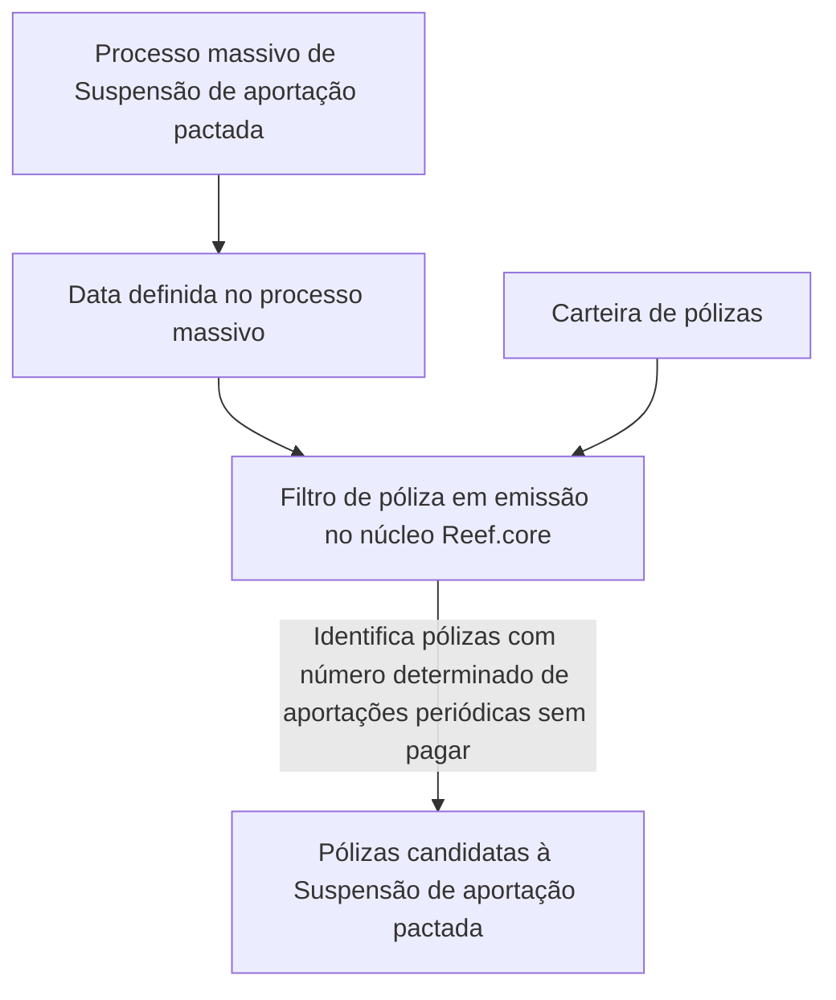

# Filtro de Pólizas em Emissão — Suspensão de Aportação Pactada no Reef.core

## 1. Metadados do Documento
- **Arquivo de Origem:** Não identificado no conteúdo fornecido
- **Tipo de Documento:** Procedimento / Documentação funcional
- **Domínio / Sistema:** Reef.core; carteira de pólizas em emissão; suspensão de aportação pactada
- **Público-Alvo:** Não identificado no conteúdo fornecido
- **Data/Versão Identificada:** Não identificada; o termo `VL` é exibido, sem explicação de significado

---

## 2. Resumo Executivo & Contexto de Negócio

O documento descreve o filtro **“póliza en emisión - Suspensión de aportación pactada”**, relacionado ao processo de identificação de pólizas candidatas a uma suspensão massiva de aportação pactada.

O objetivo funcional é extrair da carteira as pólizas que possuam um número determinado de aportações periódicas não pagas na data definida para o processo massivo. O conteúdo não informa qual é esse número determinado de aportações nem como a data do processo é configurada.

O filtro é apresentado como um mecanismo já estabelecido pelo núcleo do **Reef.core**. Portanto, o documento informa que não é necessária ação manual para executar ou configurar o filtro.

O material não detalha contratos de integração, interfaces de usuário, parâmetros configuráveis, métodos HTTP, bancos de dados, regras de cálculo adicionais, mensagens de erro ou responsabilidades operacionais fora da afirmação de que nenhuma ação é necessária.

---

## 3. Arquitetura, Componentes & Tecnologias Envolvidas

Os elementos explicitamente citados são:

- **Reef.core:** núcleo que contém filtros preestabelecidos, incluindo o filtro de pólizas em emissão para suspensão de aportação pactada.
- **Processo massivo:** processo cuja data de referência é usada para identificar aportações periódicas não pagas.
- **Carteira de pólizas:** conjunto de pólizas do qual são extraídas as candidatas.
- **Mapfredocument:** nome exibido na navegação/documentação, sem detalhamento funcional.
- **Documentation / DOCUMENTACIÓN Reef:** área ou classificação documental exibida no conteúdo.
- **Owner:** `user:agonzalez_mapfre.com`.
- **Lifecycle:** `Approved Source`.
- **VL:** identificador exibido sem definição.



**Nota de Análise:** o documento afirma que o filtro pertence ao núcleo do Reef.core, mas não descreve interfaces, componentes técnicos adicionais, persistência de dados, contratos de API ou mecanismos internos de execução.

---

## 4. Regras de Negócio, Especificações Funcionais & Processos

### Regra funcional principal

Uma póliza em emissão será candidata ao processo massivo de **Suspensão de aportação pactada** quando possuir um determinado número de aportações periódicas não pagas na data definida no processo massivo.

### Critérios explicitamente informados

1. O escopo é composto por **pólizas em emissão**.
2. A finalidade é determinar quais pólizas são candidatas a uma **Suspensão de aportação pactada** em processo massivo.
3. A seleção é realizada sobre a **carteira de pólizas**.
4. A condição de elegibilidade envolve a existência de um **determinado número de aportações periódicas sem pagar**.
5. A verificação considera a **data definida no processo massivo**.
6. O filtro já está estabelecido pelo núcleo do **Reef.core**.
7. Não é necessário realizar ação manual para esse filtro.

### Processo descrito

1. Um processo massivo define uma data de referência.
2. O filtro disponível no núcleo do Reef.core analisa a carteira de pólizas em emissão.
3. O filtro identifica pólizas que atendam ao critério de possuir um número determinado de aportações periódicas não pagas na data de referência.
4. As pólizas identificadas são candidatas ao processo massivo de Suspensão de aportação pactada.

**Nota de Análise:** o conteúdo não informa:
- O número de aportações periódicas não pagas exigido.
- O significado operacional de “emissão”.
- A forma de definição da data do processo massivo.
- A ação executada após uma póliza ser marcada como candidata.
- Exceções, validações complementares, critérios de exclusão ou tratamento de falhas.

---

## 5. Tabelas de Parâmetros, Ambientes e Estruturas de Dados

| Item / Parâmetro | Descrição / Função | Tipo / Valores / Formato | Ambiente / Observações |
| :--- | :--- | :--- | :--- |
| Filtro | `póliza en emisión - Suspensión de aportación pactada` | Filtro funcional | Estabelecido pelo núcleo do Reef.core |
| Objetivo do filtro | Determinar quais pólizas serão candidatas a um processo massivo de Suspensão de aportação pactada | Regra de seleção | Aplicável à carteira de pólizas |
| Carteira | Origem das pólizas a serem extraídas pelo filtro | Conjunto de pólizas | Não há detalhamento de origem, persistência ou segmentação |
| Estado da póliza | Póliza em emissão | Critério de escopo | O documento não define o estado “emissão” |
| Aportações periódicas | Aportações consideradas para a seleção | Aportações sem pagar | O número necessário não é informado |
| Data de referência | Data definida no processo massivo | Data | Formato e método de configuração não informados |
| Processo massivo | Processo que utiliza o filtro para identificar candidatas | Processo de negócio | Não há detalhamento de execução |
| Ação manual | Não é necessária | Não aplicável | O filtro já está estabelecido no núcleo do Reef.core |
| Sistema | Reef.core | Núcleo do sistema | Nenhuma versão é identificada |
| Owner | `user:agonzalez_mapfre.com` | Identificador de proprietário | Exibido no bloco documental |
| Lifecycle | `Approved Source` | Estado documental | Exibido no bloco documental |
| Identificador | `VL` | Valor não definido | O documento não explica o significado |

---

## 6. Bateria de Perguntas & Respostas para RAG (FAQ Sintético)

### P1: Qual é a finalidade do filtro “póliza en emisión - Suspensión de aportación pactada”?
**R:** A finalidade do filtro é determinar quais pólizas em emissão serão candidatas a um processo massivo de Suspensão de aportação pactada.

### P2: Quais pólizas são extraídas da carteira pelo filtro de Suspensão de aportação pactada?
**R:** O filtro extrai da carteira as pólizas que possuem um determinado número de aportações periódicas não pagas na data definida para o processo massivo.

### P3: O documento informa quantas aportações periódicas não pagas tornam uma póliza candidata?
**R:** Não. O documento menciona apenas “um determinado número de aportações periódicas sem pagar”, sem informar o valor, limiar ou regra de parametrização desse número.

### P4: Qual data é usada para verificar as aportações periódicas não pagas?
**R:** A verificação considera a data definida no processo massivo. O documento não informa como essa data é configurada nem qual formato de data é utilizado.

### P5: É necessário executar alguma ação manual para aplicar o filtro no Reef.core?
**R:** Não. O documento afirma que não é necessário realizar nenhuma ação, pois esse filtro já está estabelecido pelo núcleo do Reef.core.

### P6: O filtro é aplicado a todas as pólizas ou apenas a pólizas em emissão?
**R:** O conteúdo identifica explicitamente o filtro como “póliza en emisión - Suspensión de aportación pactada”; portanto, o escopo informado é composto por pólizas em emissão.

### P7: Qual sistema contém o filtro de identificação de candidatas à Suspensão de aportação pactada?
**R:** O filtro está estabelecido pelo núcleo do Reef.core.

### P8: O documento detalha o que ocorre após uma póliza ser identificada como candidata?
**R:** Não. O documento descreve somente a determinação de pólizas candidatas; não especifica a ação posterior, a efetivação da suspensão ou eventuais fluxos de aprovação.

### P9: O documento descreve APIs, métodos HTTP ou contratos JSON para o filtro?
**R:** Não. Não há métodos HTTP, endpoints, contratos JSON, integrações técnicas ou interfaces detalhadas no conteúdo fornecido.

### P10: Quem é identificado como proprietário da documentação?
**R:** O bloco documental apresenta `user:agonzalez_mapfre.com` como `Owner`.

### P11: Qual é o status de ciclo de vida exibido para a documentação?
**R:** O campo `Lifecycle` é apresentado com o valor `Approved Source`.

---

## 7. Glossário de Termos, Siglas & Conceitos-Chave

- **Reef.core:** núcleo do sistema Reef mencionado como o local onde o filtro já está estabelecido.
- **Póliza:** termo usado no documento para representar o item da carteira avaliado pelo filtro; o documento não fornece definição adicional.
- **Póliza em emissão:** póliza no escopo do filtro; o significado detalhado do estado “emissão” não é definido.
- **Aportação pactada:** tipo de aportação associado ao processo de suspensão; o documento não detalha sua estrutura ou regras financeiras.
- **Aportações periódicas:** aportações consideradas pelo critério de seleção quando estão sem pagar.
- **Suspensão de aportação pactada:** processo massivo para o qual determinadas pólizas são selecionadas como candidatas.
- **Processo massivo:** processo que define uma data de referência e utiliza o filtro para identificar pólizas candidatas.
- **Carteira:** conjunto de pólizas do qual são extraídas as candidatas.
- **VL:** valor exibido no conteúdo sem significado definido.
- **Mapfredocument:** nome exibido no bloco de documentação/navegação, sem explicação adicional.
- **Lifecycle:** campo documental que apresenta o estado `Approved Source`.
- **Owner:** campo documental que identifica `user:agonzalez_mapfre.com`.

---

## 8. Notas Críticas, Riscos & Limitações

- O número de aportações periódicas não pagas requerido para elegibilidade não é informado.
- Não há definição do estado de póliza “emissão”.
- O documento não informa como a data do processo massivo é definida, configurada ou validada.
- Não são descritas as ações posteriores à identificação de uma póliza como candidata.
- Não há detalhamento de exceções, regras de exclusão, mensagens de erro, auditoria ou recuperação em caso de falha.
- Não há informações sobre APIs, integrações, persistência, infraestrutura, ambientes, versões ou permissões.
- O termo `VL` é exibido sem contexto suficiente para interpretação confiável.
- A extração possui caracteres aparentemente corrompidos em palavras como `denida` e `ltros`; a interpretação contextual adotada neste relatório é, respectivamente, “definida” e “filtros”, preservando a limitação da fonte.

---

## 9. Conteúdo Bruto Estruturado (Referência Fiel)

```text
--- [PÁGINA 1 DE 1] ---

FILTRAR póliza en emisión - Suspensión de aportación pactada
¿En que consiste?
Determinar qué pólizas serán candidatas en un proceso masivo de Suspensión de aportación pactada.
Objetivo
Extraer de la cartera aquellas pólizas que disponen de un determinado número de aportaciones periódicas sin pagar a la fecha denida en el
proceso masivo.
Proceso a seguir
No es necesario realizar acción alguna ya que este es uno de los ltros que se encuentran establecidos por el núcleo de Reef.core.
Documentation / DOCUMENTACIÓN Reef
DOCUMENTACIÓN Reef
Mapfredocument
DOCUMENTACIÓN Reef
Owner
user:agonzalez_mapfre.com
Lifecycle
Approved Source
 / 
 VL
Buscar Inicio Soluciones Arquitecturas APIs Componentes Cloud Documentación Zeus Reef Ayuda
ES
```
