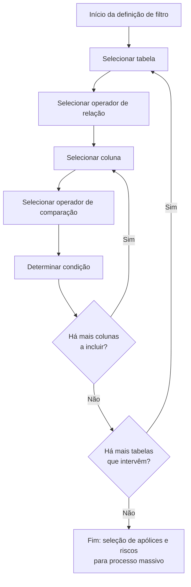

# Filtragem de Apólices em Processos Massivos de Emissão

## 1. Metadados do Documento
- **Arquivo de Origem:** Não identificado; conteúdo extraído de 3 páginas.
- **Tipo de Documento:** Procedimento / Manual Operacional.
- **Domínio / Sistema:** Reef — módulo de emissão; documentação Mapfre.
- **Público-Alvo:** Usuários funcionais e operadores com conhecimento do modelo de dados do módulo de emissão.
- **Data/Versão Identificada:** Não identificada.

---

## 2. Resumo Executivo & Contexto de Negócio

O documento descreve a funcionalidade **“Filtrar póliza en procesos masivos en emisión”**, usada para definir condições de seleção de apólices e respetivos riscos que serão posteriormente afetados por um processo massivo no módulo de emissão.

O objetivo declarado é extrair da carteira apenas as apólices que devem participar na operação em definição. A seleção é construída por meio de uma sequência de escolhas: tabela, operador de relação, coluna, operador de comparação e condição.

O uso da ferramenta requer conhecimento do modelo de dados do módulo de emissão. As tabelas e colunas disponíveis são previamente fixadas, portanto não podem ser escolhidas livremente pelo usuário.

A ordem em que tabelas e colunas são selecionadas influencia diretamente o desempenho do sistema e o tempo necessário para determinar quais apólices serão selecionadas pelo processo massivo.

---

## 3. Arquitetura, Componentes & Tecnologias Envolvidas

Os elementos explicitamente citados são:

- **Reef:** contexto documental e sistema associado à funcionalidade.
- **Módulo de emissão:** módulo cujo modelo de dados precisa ser conhecido para utilizar a filtragem.
- **Processo massivo:** processo posterior que afeta as apólices e riscos selecionados.
- **Carteira:** origem das apólices que podem ser filtradas.
- **Tabelas e colunas predefinidas:** elementos usados para compor as condições de seleção.
- **Operadores de relação:** `AND` e `OR`.
- **Operadores de comparação:** operadores de igualdade, desigualdade, comparação, intervalo, padrão e existência.



> **Nota de Análise:** O documento não detalha contratos de integração, métodos HTTP, persistência, tecnologia de banco de dados, nomes de microsserviços, URLs de ambiente ou implementação técnica da funcionalidade.

---

## 4. Regras de Negócio, Especificações Funcionais & Processos

1. A ferramenta permite determinar as condições para selecionar apólices e seus riscos que serão afetados posteriormente em um processo massivo.
2. A finalidade é extrair da carteira somente as apólices sobre as quais se pretende executar a operação definida.
3. Para usar a funcionalidade, é necessário conhecer o modelo de dados do módulo de emissão.
4. O processo de construção do filtro segue a sequência:
   1. Selecionar tabela.
   2. Selecionar operador de relação.
   3. Selecionar coluna.
   4. Selecionar operador de comparação.
   5. Determinar condição.
5. As tabelas disponíveis são previamente fixadas; não há seleção livre de tabelas.
6. A ordem de seleção das tabelas influencia o desempenho do sistema e o tempo de determinação das apólices selecionadas.
7. Após selecionar uma tabela, deve-se selecionar uma coluna para compor a condição.
8. As colunas disponíveis também são previamente fixadas; não há seleção livre de colunas.
9. A ordem de seleção das colunas influencia o desempenho do sistema e o tempo de determinação das apólices selecionadas.
10. Os operadores de relação permitidos são `AND` e `OR`.
11. O operador de comparação deve ser definido para a coluna selecionada.
12. A condição corresponde ao valor associado ao operador de comparação escolhido.
13. O documento apresenta como exemplo a seleção de apólices cujo ramo seja automóvel, assumindo o valor de ramo `400`.
14. No exemplo, a condição utiliza a tabela `a2000030`, o operador de relação `AND`, a coluna `cod_ramo`, o operador de comparação `=` e a condição `400`.

---

## 5. Tabelas de Parâmetros, Ambientes e Estruturas de Dados

| Item / Parâmetro | Descrição / Função | Tipo / Valores / Formato | Ambiente / Observações |
| :--- | :--- | :--- | :--- |
| Tabela | Define a tabela usada para condicionar quais apólices serão tomadas no processo massivo. | Tabelas previamente fixadas. | A ordem de escolha influencia o desempenho e o tempo de seleção. |
| Operador de relação | Relaciona condições de seleção. | `AND`, `OR`. | Selecionado após a tabela no fluxo apresentado. |
| Coluna | Define a coluna usada para confeccionar a condição. | Colunas previamente fixadas. | A ordem de escolha influencia o desempenho e o tempo de seleção. |
| Operador de comparação | Define como a coluna selecionada será comparada. | Consulte a tabela de operadores de comparação. | Deve ser especificado para a coluna selecionada. |
| Condição | Define o valor correspondente ao operador de comparação escolhido. | Valor dependente da coluna e do operador. | Última etapa de composição de cada condição. |
| Apólice | Entidade selecionada da carteira para posterior afetação em processo massivo. | Não detalhado. | Pode incluir riscos associados. |
| Risco | Elemento associado à apólice que pode ser afetado pelo processo massivo. | Não detalhado. | O documento não especifica a estrutura de dados do risco. |
| Módulo de emissão | Módulo cujo modelo de dados deve ser conhecido para uso da ferramenta. | Não detalhado. | Contexto funcional da filtragem. |

### Operadores de Relação Permitidos

| Operador | Descrição / Função | Tipo / Valores / Formato | Ambiente / Observações |
| :--- | :--- | :--- | :--- |
| `AND` | Operador de relação permitido. | Operador lógico. | Usado para relacionar condições. |
| `OR` | Operador de relação permitido. | Operador lógico. | Usado para relacionar condições. |

### Operadores de Comparação Permitidos

| Operador | Descrição / Função | Tipo / Valores / Formato | Ambiente / Observações |
| :--- | :--- | :--- | :--- |
| `=` | Igual. | Operador de comparação. | Comparação de igualdade. |
| `!=` | Distinto. | Operador de comparação. | Comparação de desigualdade. |
| `<` | Menor. | Operador de comparação. | Comparação de menor valor. |
| `<=` | Menor ou igual. | Operador de comparação. | Comparação de menor ou igual. |
| `>` | Maior. | Operador de comparação. | Comparação de maior valor. |
| `>=` | Maior ou igual. | Operador de comparação. | Comparação de maior ou igual. |
| `BETWEEN` | Entre. | Operador de comparação. | Comparação por intervalo. |
| `NOT BETWEEN` | Não entre. | Operador de comparação. | Exclusão de intervalo. |
| `LIKE` | Como. | Operador de comparação. | Comparação por padrão. |
| `NOT LIKE` | Não como. | Operador de comparação. | Exclusão por padrão. |
| `EXISTS` | Existe. | Operador de comparação. | Verificação de existência. |
| `NOT EXISTS` | Não existe. | Operador de comparação. | O texto original apresenta “NO EXSITE”. |

### Exemplo de Condição para Ramo de Automóvel

| Tabela | Relação | Coluna | Comparação | Condição |
| :--- | :--- | :--- | :--- | :--- |
| `a2000030` | `AND` | `cod_ramo` | `=` | `400` |

---

## 6. Bateria de Perguntas & Respostas para RAG (FAQ Sintético)

### P1: Qual é o objetivo da funcionalidade de filtragem de apólices em processos massivos de emissão?
**R:** A funcionalidade permite definir condições para selecionar apólices e seus riscos que serão posteriormente afetados por um processo massivo. O objetivo é extrair da carteira somente as apólices com as quais se pretende realizar a operação em definição.

### P2: Que conhecimento é necessário para usar a ferramenta de filtragem de apólices?
**R:** É necessário possuir conhecimento do modelo de dados do módulo de emissão, pois a ferramenta usa tabelas e colunas desse contexto para construir condições de seleção.

### P3: Qual é a sequência para criar uma condição de filtragem?
**R:** A sequência apresentada é: selecionar tabela, selecionar operador de relação, selecionar coluna, selecionar operador de comparação e determinar condição. Depois, deve-se verificar se há mais colunas ou mais tabelas a incluir.

### P4: Posso escolher qualquer tabela para filtrar apólices?
**R:** Não. As tabelas disponíveis para a seleção são previamente fixadas e não podem ser escolhidas livremente.

### P5: A ordem de seleção das tabelas influencia o processo massivo?
**R:** Sim. O documento informa que a ordem em que as tabelas participantes são escolhidas influencia diretamente o desempenho do sistema e, consequentemente, o tempo necessário para determinar as apólices selecionadas.

### P6: Posso escolher qualquer coluna da tabela selecionada?
**R:** Não. Assim como as tabelas, as colunas são previamente fixadas. A escolha de colunas não é livre.

### P7: Quais operadores de relação são permitidos?
**R:** Os operadores de relação permitidos são `AND` e `OR`.

### P8: Quais operadores de comparação podem ser usados na condição?
**R:** São permitidos os operadores `=`, `!=`, `<`, `<=`, `>`, `>=`, `BETWEEN`, `NOT BETWEEN`, `LIKE`, `NOT LIKE`, `EXISTS` e `NOT EXISTS`.

### P9: O que deve ser informado na etapa “Determinar condição”?
**R:** Deve ser determinado o valor que corresponde ao operador de comparação escolhido para a coluna selecionada.

### P10: Como filtrar apólices do ramo de automóvel no exemplo apresentado?
**R:** O exemplo usa a tabela `a2000030`, a relação `AND`, a coluna `cod_ramo`, o operador de comparação `=` e a condição `400`. O documento assume que `400` representa o ramo de automóvel.

### P11: O que acontece se forem necessárias mais colunas em uma condição de seleção?
**R:** Após determinar uma condição, o fluxo verifica se há mais colunas a incluir. Se houver, o processo retorna à etapa de seleção de coluna.

### P12: O documento detalha APIs, métodos HTTP ou contratos JSON da funcionalidade?
**R:** Não. O documento descreve o processo funcional de montagem de filtros, mas não apresenta métodos HTTP, APIs, contratos JSON, tecnologias de implementação ou detalhes de integração.

---

## 7. Glossário de Termos, Siglas & Conceitos-Chave

- **AND:** Operador de relação permitido para relacionar condições de filtragem.
- **BETWEEN:** Operador de comparação descrito como “entre”.
- **Carteira:** Conjunto de apólices do qual são extraídas aquelas que participarão da operação massiva.
- **cod_ramo:** Coluna utilizada no exemplo para determinar o ramo das apólices.
- **Condição:** Valor determinado em conformidade com o operador de comparação escolhido.
- **EXISTS:** Operador de comparação descrito como “existe”.
- **LIKE:** Operador de comparação descrito como “como”.
- **Módulo de emissão:** Módulo cujo modelo de dados é necessário para utilizar a ferramenta.
- **OR:** Operador de relação permitido para relacionar condições de filtragem.
- **Póliza / Apólice:** Entidade da carteira selecionada para participação em processo massivo.
- **Proceso masivo / Processo massivo:** Processo que posteriormente afeta as apólices e riscos selecionados.
- **Ramo:** Classificação da apólice; no exemplo, o valor `400` é assumido como ramo de automóvel.
- **Reef:** Sistema ou contexto documental explicitamente citado no conteúdo.
- **Riesgo / Risco:** Elemento associado a uma apólice, mencionado como participante da seleção e afetação posterior.

---

## 8. Notas Críticas, Riscos & Limitações

- A utilização da ferramenta depende de conhecimento prévio do modelo de dados do módulo de emissão.
- Tabelas e colunas são previamente fixadas; o documento não apresenta a lista completa dos elementos disponíveis.
- A ordem de seleção de tabelas e colunas afeta diretamente o desempenho e o tempo de determinação das apólices selecionadas.
- O documento não detalha como as condições são persistidas, validadas ou executadas internamente.
- O documento não apresenta exemplos para `OR`, `BETWEEN`, `LIKE`, `EXISTS` ou os demais operadores além da igualdade.
- O documento não define a semântica técnica de `a2000030` nem a estrutura completa da tabela.
- O documento não informa ambientes, URLs, servidores, credenciais, versões, logs, APIs ou contratos de dados.
- O texto original contém artefatos de extração, como caracteres inválidos em palavras como “deniendo”, “jadas” e “inuye”; o conteúdo foi preservado na referência bruta.

---

## 9. Conteúdo Bruto Estruturado (Referência Fiel)

```text
--- [PÁGINA 1 DE 3] ---

FILTRAR póliza en procesos masivos en emisión
¿En que consiste?
Esta herramienta permite determinar las condiciones con las que se desea seleccionar pólizas (y sus riesgos) a las que posteriormente serán
afectadas en un proceso masivo. Es imprescindible conocer que para utilizar esta herramienta es necesario disponer de conocimiento del
modelo de datos del módulo de emisión.
Objetivo
Extraer de la cartera solo aquellas pólizas con las que se pretende realizar la operación que se está deniendo.
Proceso a seguir
SI
NO
SI
NOSELECCIONAR
tabla (1)
SELECCIONAR
operador
de
relación (2)
SELECCIONAR
columna (3)
SELECCIONAR
operador
de
comparación (4)
DETERMINAR
condición (5) ¿Hay
más
columnas
que
incluir? ¿Hay
más
tablas
que
intervengan?
FIN
Imagen FILTRAR
1. Tabla
2. Relación
3. Columna
4. Comparación
5. Condición
SELECCIONAR tabla
Se especica la tabla que se quiere utilizar con el n de condicionar qué pólizas han de tomarse en el proceso masivo. Las tablas están
jadas previamente por lo que no se puede elegir libremente. Es importante destacar que el orden en el que se eligen las tablas que
participarán en la selección inuye directamente en el rendimiento del sistema y por consiguiente en el tiempo que tarde el proceso en
determinar qué pólizas se seleccionan.
SELECCIONAR operador de relación
Documentation / DOCUMENTACIÓN Reef
DOCUMENTACIÓN Reef
Mapfredocument
DOCUMENTACIÓN Reef
Owner
user:agonzalez_mapfre.com
Lifecycle
Approved Source
 /
VL
Buscar Inicio Soluciones Arquitecturas APIs Componentes Cloud Documentación Zeus Reef Ayuda
ES

--- [PÁGINA 2 DE 3] ---

Se determina el operador que es necesario utilizar con el n de seleccionar las pólizas a tratar. Los operadores permitidos son:
OPERADOR
AND
OR
SELECCIONAR columna
Una vez elegida la tabla se debe seleccionar qué columna se utilizará para confeccionar la condición. Las columnas, al igual que las tablas
están previamente jadas y la elección no es libre. Al igual que se comentó con la tabla, también es importante destacar que el orden en
el que se eligen las columnas que participarán en la selección inuye directamente en el rendimiento del sistema y por consiguiente en el
tiempo que tarde el proceso en determinar qué pólizas se seleccionan.
SELECCIONAR operador de comparación
Se especica el operador que se utilizará para la columna seleccionada. Los operadores permitidos son:
OPERADOR DESCRIPCIÓN
= IGUAL
!= DISTINTO
< MENOR
<= MENOR O IGUAL
> MAYOR
>= MAYOR O IGUAL
BETWEEN ENTRE
NOT BETWEEN NO ENTRE
LIKE COMO
NOT LIKE NO COMO
EXISTS EXISTE
NOT EXISTS NO EXSITE
DETERMINAR condición
En este punto se determina el valor que correspondería con el operador de comparación elegido.
EJEMPLO
Por ejemplo, si se desea determinar que el ramo de las pólizas a seleccionar es el ramo de automóvil (suponiendo que el ramo en este
ejemplo es el 400), los valores que se determinarían sería:

--- [PÁGINA 3 DE 3] ---

TABLA RELACIÓN COLUMNA COMPARACIÓN CONDICIÓN
a2000030 AND cod_ramo = 400
```
