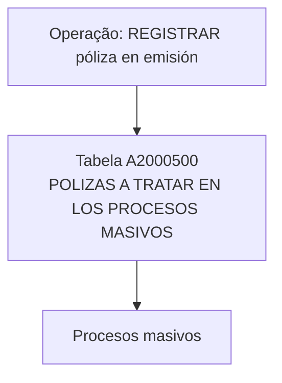

# Registro de Póliza em Emissão — Modelo de Dados da Tabela A2000500 para Processos Massivos

## 1. Metadados do Documento
- **Arquivo de Origem:** Não identificado no conteúdo extraído
- **Tipo de Documento:** Especificação Técnica
- **Domínio / Sistema:** Reef / Mapfre — registro de pólizas em emissão
- **Público-Alvo:** Desenvolvedores, Arquitetos, Operação e Analistas Funcionais
- **Data/Versão Identificada:** Não identificada

---

## 2. Resumo Executivo & Contexto de Negócio

O documento descreve o modelo de dados envolvido na operação **“REGISTRAR póliza en emisión”**. A especificação identifica a tabela **A2000500** como a estrutura utilizada para registrar pólizas que serão tratadas por processos massivos.

A tabela A2000500 é apresentada com a descrição **“POLIZAS A TRATAR EN LOS PROCESOS MASIVOS”**. O conteúdo relaciona as colunas da tabela, sua obrigatoriedade, a possibilidade indicada de alteração de valor, condições específicas de preenchimento e comentários funcionais para cada atributo.

A estrutura cobre informações de identificação da póliza, companhia, setor, ramo, estrutura comercial, agente, moeda, contrato, suplemento, aplicação, riscos, renovação, anulação, exceções, usuários e datas de atualização. Alguns atributos possuem regras explícitas para operações de suplemento, incluindo renovações, ou para qualquer operação.

O material extraído não descreve métodos HTTP, contratos JSON, integrações entre sistemas, mecanismos de persistência, validações técnicas executáveis ou sequências detalhadas do processo massivo. A informação disponível limita-se ao modelo de dados e às regras de preenchimento indicadas nas colunas da tabela A2000500.

---

## 3. Arquitetura, Componentes & Tecnologias Envolvidas

### Componentes e entidades identificados

| Componente / Entidade | Papel descrito no documento | Observações |
| :--- | :--- | :--- |
| Reef | Repositório ou contexto de documentação identificado na extração. | O documento contém referências a “DOCUMENTACIÓN Reef”. |
| Mapfre | Contexto corporativo identificado na extração. | A extração apresenta “Mapfredocument”. |
| Operação “REGISTRAR póliza en emisión” | Operação documentada. | O documento não detalha a implementação operacional. |
| Tabela A2000500 | Armazena pólizas a tratar em processos massivos. | Descrição literal: “POLIZAS A TRATAR EN LOS PROCESOS MASIVOS”. |
| Processo massivo | Processo que trata as pólizas registradas na tabela A2000500. | Não há detalhamento de execução, agendamento, entrada ou saída. |

### Fluxo conceitual explicitamente suportado



> **Nota de Análise:** O documento estabelece a relação entre a operação de registro de póliza em emissão, a tabela A2000500 e os processos massivos. Não são detalhados serviços, APIs, aplicações, filas, bancos de dados, protocolos, ambientes ou tecnologias de implementação.

---

## 4. Regras de Negócio, Especificações Funcionais & Processos

### Operação documentada

A operação apresentada é **“REGISTRAR póliza en emisión”**. O documento informa que as tabelas envolvidas nessa operação incluem a tabela **A2000500**.

### Finalidade da tabela

A tabela **A2000500** tem como descrição funcional:

> **POLIZAS A TRATAR EN LOS PROCESOS MASIVOS**

Portanto, o documento associa cada registro da A2000500 a uma póliza que será considerada em processos massivos.

### Regras explícitas de preenchimento

1. **Campos obrigatórios identificados como “SI”**
   - `FEC_TRATAMIENTO`
   - `NUM_ORDEN`
   - `TIP_MVTO_BATCH`
   - `COD_CIA`
   - `COD_SECTOR`
   - `COD_RAMO`
   - `COD_NIVEL1`
   - `COD_NIVEL2`
   - `COD_NIVEL3`
   - `COD_AGT`
   - `COD_MON`
   - `NUM_POLIZA`
   - `NUM_SPTO`
   - `NUM_APLI`
   - `NUM_SPTO_APLI`
   - `TIP_POLIZA_TR`
   - `MCA_PRIMA_MANUAL`
   - `TIP_SITU`
   - `MCA_PRE_RENOVACION`
   - `MCA_ANULACION_POR_DEUDA`
   - `COD_USR`
   - `FEC_ACTU`

2. **Regra para suplemento, incluindo renovações**
   - Os campos `COD_SPTO`, `SUB_COD_SPTO`, `COD_TIP_SPTO` e `TXT_MOTIVO_SPTO` indicam o valor/motivo:
     - **“Debe indicarse en suplemento (incluído renovaciones)”**
   - Esses quatro campos estão marcados como não obrigatórios no conteúdo extraído.

3. **Regra para qualquer operação**
   - O campo `COD_USR_CAPTURA` indica:
     - **“Debe indicarse en cualquier operación”**
   - O comentário funcional define o campo como o usuário que simula a captura.

4. **Informações de processo massivo**
   - `FEC_TRATAMIENTO` representa a data em que é realizado o processo massivo.
   - `NUM_ORDEN` representa o número do processo massivo.
   - `TIP_MVTO_BATCH` representa o tipo do processo massivo.

5. **Informações de anulação por falta de pagamento**
   - `MCA_ANULACION_POR_DEUDA` identifica se a anulação ocorre por dívida.
   - `MAX_SPTO_VIGENTE` representa o último suplemento vigente no momento de executar o processo de anulação por falta de pagamento.
   - `NUM_SPTO_ANULADO` identifica o número de suplemento anulado/anulador.

6. **Informações de renovação**
   - `MCA_RENUEVA` informa renovação no vencimento.
   - `MCA_RENUEVA_TMP` informa renovação pela temporalidade original.
   - `MCA_PERIODICIDAD` informa renovação por períodos, com exemplos de períodos letivos e temporadas esportivas.
   - `CANT_RENOVACIONES` representa o número máximo de renovações que a póliza terá.
   - `MCA_PRE_RENOVACION` informa se a póliza foi renovada previamente.

> **Nota de Análise:** O documento não define os domínios permitidos, tipos físicos, tamanhos, chaves primárias, chaves estrangeiras, valores padrão, regras de unicidade ou regras de transição de estado da tabela A2000500.

---

## 5. Tabelas de Parâmetros, Ambientes e Estruturas de Dados

### Estrutura funcional da tabela A2000500

| Item / Parâmetro | Descrição / Função | Tipo / Valores / Formato | Ambiente / Observações |
| :--- | :--- | :--- | :--- |
| `A2000500` | Pólizas a tratar nos processos massivos. | Tabela. | Associada à operação “REGISTRAR póliza en emisión”. |
| `FEC_TRATAMIENTO` | Data em que é realizado o processo massivo. | Cambia valor: `S`; motivo/valor: `N.A.` | Obrigatória: `SI`. |
| `NUM_ORDEN` | Número do processo massivo. | Cambia valor: `S`; motivo/valor: `N.A.` | Obrigatória: `SI`. |
| `TIP_MVTO_BATCH` | Tipo do processo massivo. | Cambia valor: `S`; motivo/valor: `N.A.` | Obrigatória: `SI`. |
| `COD_CIA` | Companhia. | Cambia valor: `S`; motivo/valor: `N.A.` | Obrigatória: `SI`. |
| `COD_SECTOR` | Setor. | Cambia valor: `S`; motivo/valor: `N.A.` | Obrigatória: `SI`. |
| `COD_RAMO` | Ramo. | Cambia valor: `S`; motivo/valor: `N.A.` | Obrigatória: `SI`. |
| `COD_NIVEL1` | Nível 1 da estrutura comercial. | Cambia valor: `S`; motivo/valor: `N.A.` | Obrigatória: `SI`. |
| `COD_NIVEL2` | Nível 2 da estrutura comercial. | Cambia valor: `S`; motivo/valor: `N.A.` | Obrigatória: `SI`. |
| `COD_NIVEL3` | Nível 3 da estrutura comercial. | Cambia valor: `S`; motivo/valor: `N.A.` | Obrigatória: `SI`. |
| `COD_AGT` | Agente. | Cambia valor: `S`; motivo/valor: `N.A.` | Obrigatória: `SI`. |
| `COD_MON` | Moeda. | Cambia valor: `S`; motivo/valor: `N.A.` | Obrigatória: `SI`. |
| `NUM_POLIZA_GRUPO` | Póliza de grupo. | Cambia valor: `S`; motivo/valor: `N.A.` | Obrigatória: `NO`. |
| `NUM_CONTRATO` | Contrato. | Cambia valor: `S`; motivo/valor: `N.A.` | Obrigatória: `NO`. |
| `NUM_POLIZA_CLIENTE` | Póliza do cliente. | Cambia valor: `S`; motivo/valor: `N.A.` | Obrigatória: `NO`. |
| `NUM_POLIZA` | Póliza. | Cambia valor: `S`; motivo/valor: `N.A.` | Obrigatória: `SI`. |
| `NUM_POLIZA_TRONADOR` | Número de póliza de tronador, interno. | Cambia valor: `S`; motivo/valor: `N.A.` | Obrigatória: `NO`. |
| `NUM_POLIZA_DEFINITIVO` | Número de póliza definitiva. | Cambia valor: `S`; motivo/valor: `N.A.` | Obrigatória: `NO`. |
| `NUM_SPTO` | Número de suplemento. | Cambia valor: `S`; motivo/valor: `N.A.` | Obrigatória: `SI`. |
| `NUM_APLI` | Número de aplicação. | Cambia valor: `S`; motivo/valor: `N.A.` | Obrigatória: `SI`. |
| `NUM_SPTO_APLI` | Suplemento da aplicação. | Cambia valor: `S`; motivo/valor: `N.A.` | Obrigatória: `SI`. |
| `TIP_POLIZA_TR` | Tipo de póliza. | Cambia valor: `S`; motivo/valor: `N.A.` | Obrigatória: `SI`. |
| `FEC_EFEC_SPTO` | Efeito do suplemento. | Cambia valor: `S`; motivo/valor: `N.A.` | Obrigatória: `NO`. |
| `FEC_VCTO_SPTO` | Vencimento do suplemento. | Cambia valor: `S`; motivo/valor: `N.A.` | Obrigatória: `NO`. |
| `NUM_RECIBO` | Recibo. | Cambia valor: `S`; motivo/valor: `N.A.` | Obrigatória: `NO`. |
| `NUM_RIESGOS` | Número total de riscos que teve. | Cambia valor: `S`; motivo/valor: `N.A.` | Obrigatória: `NO`. |
| `MCA_PRIMA_MANUAL` | Primas manuais. | Cambia valor: `S`; motivo/valor: `N.A.` | Obrigatória: `SI`. |
| `COD_SPTO` | Suplemento. | Cambia valor: `S`; deve ser indicado em suplemento, incluindo renovações. | Obrigatória: `NO`. |
| `SUB_COD_SPTO` | Suplemento. | Cambia valor: `S`; deve ser indicado em suplemento, incluindo renovações. | Obrigatória: `NO`. |
| `COD_TIP_SPTO` | Causa do suplemento. | Cambia valor: `S`; deve ser indicado em suplemento, incluindo renovações. | Obrigatória: `NO`. |
| `TXT_MOTIVO_SPTO` | Texto que determina o motivo do suplemento. | Cambia valor: `S`; deve ser indicado em suplemento, incluindo renovações. | Obrigatória: `NO`. |
| `MCA_RENUEVA` | Renova no vencimento. | Cambia valor: `S`; motivo/valor: `N.A.` | Obrigatória: `NO`. |
| `MCA_RENUEVA_TMP` | Renova pela temporalidade original. | Cambia valor: `S`; motivo/valor: `N.A.` | Obrigatória: `NO`. |
| `MCA_PERIODICIDAD` | A póliza renova por períodos, como períodos letivos ou temporadas esportivas. | Cambia valor: `S`; motivo/valor: `N.A.` | Obrigatória: `NO`. |
| `CANT_RENOVACIONES` | Número máximo de renovações que a póliza terá. | Cambia valor: `S`; motivo/valor: `N.A.` | Obrigatória: `NO`. |
| `MCA_PRORRATA` | Cálculo a pró-rata ou escala. | Cambia valor: `S`; motivo/valor: `N.A.` | Obrigatória: `NO`. |
| `MCA_DEVUELVE_TODO` | Devolve a totalidade dos conceitos de detalhamento econômico. | Cambia valor: `S`; motivo/valor: `N.A.` | Obrigatória: `NO`. |
| `TIP_SPTO_ACCION` | Tipo de suplemento a realizar. | Cambia valor: `S`; motivo/valor: `N.A.` | Obrigatória: `NO`. |
| `TIP_AUTORIZA_CT` | Tipo de autorização ou rejeição do controle técnico. | Cambia valor: `S`; motivo/valor: `N.A.` | Obrigatória: `NO`. |
| `TIP_SITU` | Situação em que a linha se encontra. | Cambia valor: `S`; motivo/valor: `N.A.` | Obrigatória: `SI`. |
| `COD_EXCEPCION` | Exceção. | Cambia valor: `S`; motivo/valor: `N.A.` | Obrigatória: `NO`. |
| `NOM_EXCEPCION` | Descrição da exceção. | Cambia valor: `S`; motivo/valor: `N.A.` | Obrigatória: `NO`. |
| `MCA_PRE_RENOVACION` | Indica se a póliza foi renovada previamente. | Cambia valor: `S`; motivo/valor: `N.A.` | Obrigatória: `SI`. |
| `MCA_ANULACION_POR_DEUDA` | Indica se a anulação é por dívida. | Cambia valor: `S`; motivo/valor: `N.A.` | Obrigatória: `SI`. |
| `MAX_SPTO_VIGENTE` | Último suplemento vigente no momento da execução do processo de anulação por falta de pagamento. | Cambia valor: `S`; motivo/valor: `N.A.` | Obrigatória: `NO`. |
| `COD_USR` | Usuário que atualizou a linha. | Cambia valor: `S`; motivo/valor: `N.A.` | Obrigatória: `SI`. |
| `COD_USR_CAPTURA` | Usuário que simula a captura. | Cambia valor: `S`; deve ser indicado em qualquer operação. | Obrigatória: `NO`. |
| `FEC_ACTU` | Data de atualização da linha. | Cambia valor: `S`; motivo/valor: `N.A.` | Obrigatória: `SI`. |
| `NUM_SUBCONTRATO` | Número de subcontrato. | Cambia valor: `S`; motivo/valor: `N.A.` | Obrigatória: `NO`. |
| `HORA_DESDE` | Horário de começo. | Cambia valor: `S`; motivo/valor: `N.A.` | Obrigatória: `NO`. |
| `COD_NEGOCIO` | Tipo de negócio, grandes riscos. | Cambia valor: `S`; motivo/valor: `N.A.` | Obrigatória: `NO`. |
| `NUM_SPTO_ANULADO` | Número de suplemento anulado/anulador. | Cambia valor: `S`; motivo/valor: `N.A.` | Obrigatória: `NO`. |
| `IDN_VAL` | Identificador. | Cambia valor: `S`; motivo/valor: `N.A.` | Obrigatória: `NO`. |

> **Nota de Análise:** A semântica técnica do valor `S` na coluna “CAMBIA VALOR” não é explicada no documento extraído. O relatório preserva esse valor sem inferir seu significado.

---

## 6. Bateria de Perguntas & Respostas para RAG (FAQ Sintético)

### P1: Qual é a finalidade da tabela A2000500?
**R:** A tabela `A2000500` armazena as pólizas que serão tratadas em processos massivos. A descrição literal apresentada no documento é “POLIZAS A TRATAR EN LOS PROCESOS MASIVOS”.

### P2: Qual operação utiliza a tabela A2000500?
**R:** A tabela A2000500 é identificada como parte da operação “REGISTRAR póliza en emisión”. O documento informa que essa é a tabela envolvida na operação, mas não detalha as etapas técnicas de gravação ou processamento.

### P3: Quais campos identificam o processo massivo associado à póliza?
**R:** Os campos obrigatórios relacionados ao processo massivo são `FEC_TRATAMIENTO`, que representa a data de realização do processo massivo; `NUM_ORDEN`, que representa o número do processo massivo; e `TIP_MVTO_BATCH`, que representa o tipo do processo massivo.

### P4: Quais campos de identificação de póliza são obrigatórios na A2000500?
**R:** O documento marca como obrigatórios `NUM_POLIZA`, `NUM_SPTO`, `NUM_APLI`, `NUM_SPTO_APLI` e `TIP_POLIZA_TR`. Também são obrigatórios os campos de contexto organizacional `COD_CIA`, `COD_SECTOR`, `COD_RAMO`, `COD_NIVEL1`, `COD_NIVEL2`, `COD_NIVEL3`, `COD_AGT` e `COD_MON`.

### P5: Quais campos devem ser informados em operações de suplemento, incluindo renovações?
**R:** O documento determina que, em suplemento, incluindo renovações, devem ser indicados `COD_SPTO`, `SUB_COD_SPTO`, `COD_TIP_SPTO` e `TXT_MOTIVO_SPTO`. Esses campos correspondem, respectivamente, a suplemento, suplemento, causa do suplemento e texto que determina o motivo do suplemento.

### P6: Qual é a regra para o campo COD_USR_CAPTURA?
**R:** O campo `COD_USR_CAPTURA` deve ser indicado em qualquer operação. O comentário funcional o define como o usuário que simula a captura. O documento o marca como não obrigatório na coluna de obrigatoriedade.

### P7: Como a tabela representa informações de renovação da póliza?
**R:** A tabela possui `MCA_RENUEVA` para renovação no vencimento, `MCA_RENUEVA_TMP` para renovação pela temporalidade original, `MCA_PERIODICIDAD` para renovação por períodos, `CANT_RENOVACIONES` para o número máximo de renovações e `MCA_PRE_RENOVACION` para indicar se a póliza foi renovada previamente. Apenas `MCA_PRE_RENOVACION` está marcado como obrigatório.

### P8: Como é representada uma anulação por dívida?
**R:** O campo obrigatório `MCA_ANULACION_POR_DEUDA` indica se a anulação ocorre por dívida. O campo não obrigatório `MAX_SPTO_VIGENTE` representa o último suplemento vigente no momento em que é executado o processo de anulação por falta de pagamento. O campo `NUM_SPTO_ANULADO` registra o número de suplemento anulado/anulador.

### P9: Qual campo registra a situação de uma linha da tabela A2000500?
**R:** O campo `TIP_SITU` representa a situação em que a linha se encontra. O documento marca `TIP_SITU` como obrigatório.

### P10: Quais campos registram auditoria de usuário e atualização?
**R:** `COD_USR` é o usuário que atualizou a linha e é obrigatório. `FEC_ACTU` é a data de atualização da linha e também é obrigatória. `COD_USR_CAPTURA` corresponde ao usuário que simula a captura e deve ser indicado em qualquer operação, embora esteja marcado como não obrigatório.

### P11: O documento define tipos físicos, formatos ou tamanhos das colunas da A2000500?
**R:** Não. O conteúdo extraído apresenta os nomes das colunas, indicadores de obrigatoriedade, o valor exibido na coluna “CAMBIA VALOR”, condições de preenchimento e comentários funcionais. Tipos físicos, tamanhos, domínios permitidos e restrições de banco de dados não são detalhados.

### P12: Há informações sobre APIs, URLs, ambientes ou tecnologias da solução?
**R:** Não. A extração menciona Reef, Mapfre e a operação de registro de póliza em emissão, mas não apresenta APIs, métodos HTTP, URLs, servidores, ambientes, tecnologias, bancos de dados ou contratos de integração.

---

## 7. Glossário de Termos, Siglas & Conceitos-Chave

- **A2000500:** Tabela descrita como “POLIZAS A TRATAR EN LOS PROCESOS MASIVOS”.
- **Póliza:** Entidade central tratada pela tabela A2000500; o documento não fornece definição adicional.
- **Proceso masivo:** Processo que trata as pólizas registradas na tabela A2000500.
- **SPTO / Suplemento:** Suplemento relacionado à póliza, identificado por campos como `NUM_SPTO`, `COD_SPTO`, `SUB_COD_SPTO`, `COD_TIP_SPTO` e `TXT_MOTIVO_SPTO`.
- **APLI / Aplicación:** Aplicação associada à póliza, identificada por `NUM_APLI` e `NUM_SPTO_APLI`.
- **COD_CIA:** Código de companhia.
- **COD_AGT:** Código de agente.
- **COD_MON:** Código de moeda.
- **COD_USR:** Usuário que atualizou a linha.
- **COD_USR_CAPTURA:** Usuário que simula a captura.
- **TIP_SITU:** Situação em que a linha se encontra.
- **MCA:** Prefixo presente em múltiplos campos. O documento não expande formalmente a sigla.
- **Reef:** Contexto de documentação citado na extração como “DOCUMENTACIÓN Reef”.
- **Mapfre:** Contexto corporativo citado na extração como “Mapfredocument”.
- **N.A.:** Valor exibido na coluna “MOTIVO/VALOR” para diversos campos; o documento não explica seu significado.
- **S:** Valor exibido na coluna “CAMBIA VALOR” para todos os campos apresentados; o documento não explica seu significado.

---

## 8. Notas Críticas, Riscos & Limitações

- O arquivo de origem, a data e a versão do documento não foram identificados no conteúdo extraído.
- A extração não apresenta tipos físicos, tamanhos, nulabilidade técnica, chaves, índices, relacionamentos ou constraints da tabela A2000500.
- A semântica do valor `S` em “CAMBIA VALOR” não é definida no conteúdo.
- A semântica de `N.A.` em “MOTIVO/VALOR” não é definida no conteúdo.
- O documento não apresenta fluxos técnicos detalhados, serviços, microsserviços, APIs, contratos JSON, protocolos, URLs, ambientes ou logs.
- O documento menciona a operação “REGISTRAR póliza en emisión”, mas não detalha sua sequência operacional, atores, entradas, saídas ou tratamento de erros.
- Os campos `COD_SPTO`, `SUB_COD_SPTO`, `COD_TIP_SPTO` e `TXT_MOTIVO_SPTO` possuem regra explícita para suplemento, incluindo renovações, mas não há detalhamento sobre como validar seus valores.
- `COD_USR_CAPTURA` deve ser indicado em qualquer operação, mas o documento também o marca como não obrigatório; a extração não resolve essa possível diferença entre condição operacional e obrigatoriedade estrutural.

---

## 9. Conteúdo Bruto Estruturado (Referência Fiel)

```text
--- [PÁGINA 1 DE 4] ---

EN CONSTRUCCIÓN
REGISTRAR póliza en emisión
Modelo de datos involucrado
Las tablas que intervienen en esta operación son:
A2000500
TABLA DESCRIPCIÓN
A2000500 POLIZAS A TRATAR EN LOS PROCESOS MASIVOS
COLUMNA CAMBIA
VALOR
MOTIVO/VALOR OBLIGATORIA COMENTARIO
FEC_TRATAMIENTO S N.A. SI FECHA EN LA QUE SE REALIZA EL
PROCESO MASIVO
NUM_ORDEN S N.A. SI NUMERO DEL PROCESO MASIVO
TIP_MVTO_BATCH S N.A. SI TIPO DEL PROCESO MASIVO
COD_CIA S N.A. SI COMPANIA
COD_SECTOR S N.A. SI SECTOR
COD_RAMO S N.A. SI RAMO
COD_NIVEL1 S N.A. SI NIVEL1 DE LA ESTRUCTURA
COMERCIAL
COD_NIVEL2 S N.A. SI NIVEL2 DE LA ESTRUCTURA
COMERCIAL
Documentation / DOCUMENTACIÓN Reef
DOCUMENTACIÓN Reef
Mapfredocument
DOCUMENTACIÓN Reef
Owner
user:agonzalez_mapfre.com
Lifecycle
Approved Source
 /
VL
Buscar Inicio Soluciones Arquitecturas APIs Componentes Cloud Documentación Zeus Reef Ayuda
ES

--- [PÁGINA 2 DE 4] ---

COLUMNA CAMBIA
VALOR
MOTIVO/VALOR OBLIGATORIA COMENTARIO
COD_NIVEL3 S N.A. SI NIVEL3 DE LA ESTRUCTURA
COMERCIAL
COD_AGT S N.A. SI AGENTE
COD_MON S N.A. SI MONEDA
NUM_POLIZA_GRUPO S N.A. NO POLIZA GRUPO
NUM_CONTRATO S N.A. NO CONTRATO
NUM_POLIZA_CLIENTE S N.A. NO POLIZA CLIENTE
NUM_POLIZA S N.A. SI POLIZA
NUM_POLIZA_TRONADOR S N.A. NO NUMERO DE POLIZA DE
TRONADOR (INTERNO)
NUM_POLIZA_DEFINITIVO S N.A. NO NUMERO DE POLIZA DEFINITIVA
NUM_SPTO S N.A. SI NUMERO DE SUPLEMENTO
NUM_APLI S N.A. SI NUMERO DE APLICACION
NUM_SPTO_APLI S N.A. SI SUPLEMENTO DE LA APLICACION
TIP_POLIZA_TR S N.A. SI TIPO DE POLIZA
FEC_EFEC_SPTO S N.A. NO EFECTO DEL SUPLEMENTO
FEC_VCTO_SPTO S N.A. NO VENCIMIENTO DEL SUPLEMENTO
NUM_RECIBO S N.A. NO RECIBO
NUM_RIESGOS S N.A. NO NUMERO TOTAL DE RIESGOS QUE
HA TENIDO
MCA_PRIMA_MANUAL S N.A. SI PRIMAS MANUALES
COD_SPTO S Debe indicarse en
suplemento (incluído
renovaciones)
NO SUPLEMENTO
SUB_COD_SPTO S Debe indicarse en
suplemento (incluído
renovaciones)
NO SUPLEMENTO
COD_TIP_SPTO S Debe indicarse en
suplemento (incluído
renovaciones)
NO CAUSA DEL SUPLEMENTO

--- [PÁGINA 3 DE 4] ---

COLUMNA CAMBIA
VALOR
MOTIVO/VALOR OBLIGATORIA COMENTARIO
TXT_MOTIVO_SPTO S Debe indicarse en
suplemento (incluído
renovaciones)
NO TEXTO QUE DETERMINA EL
MOTIVO DEL SUPLEMENTO
MCA_RENUEVA S N.A. NO RENUEVA AL VENCIMIENTO
MCA_RENUEVA_TMP S N.A. NO RENUEVA POR LA TEMPORALIDAD
ORIGINAL
MCA_PERIODICIDAD S N.A. NO LA POLIZA RENUEVA POR
PERIODOS (PERIODOS LECTIVOS,
TEMPORADAS DEPORTIVAS, ...)
CANT_RENOVACIONES S N.A. NO NUMERO MAXIMO DE
RENOVACIONES QUE TENDRA LA
POLIZA
MCA_PRORRATA S N.A. NO CALCULO A PRORRATA O ESCALA
MCA_DEVUELVE_TODO S N.A. NO DEVUELVE LA TOTALIDAD DE LOS
CONCEPTOS DE DESGLOSE
ECONOMICO
TIP_SPTO_ACCION S N.A. NO TIPO DE SUPLEMENTO A RALIZAR
TIP_AUTORIZA_CT S N.A. NO TIPO DE AUTORIZACION O
RECHAZO DEL CONTROL TECNICO
TIP_SITU S N.A. SI SITUACION EN LA QUE SE
ENCUENTRA LA FILA
COD_EXCEPCION S N.A. NO EXCEPCION
NOM_EXCEPCION S N.A. NO DESCRIPCION DE LA EXCEPCION
MCA_PRE_RENOVACION S N.A. SI POLIZA HA SIDO RENOVADA
PREVIAMENTE
MCA_ANULACION_POR_DEUDA S N.A. SI LA ANULACION ES POR DEUDA
MAX_SPTO_VIGENTE S N.A. NO ULTIMO SUPLEMENTO VIGENTE
EN EL MOMENTO DE EJECUTAR EL
PROCESO DE ANULACION POR
FALTA DE PAGO
COD_USR S N.A. SI USUARIO QUE ACTUALIZO LA FILA
COD_USR_CAPTURA S Debe indicarse en
cualquier operación
NO USUARIO QUE SIMULA LA
CAPTURA
FEC_ACTU S N.A. SI FECHA DE ACTUALIZACION DE LA
FILA

--- [PÁGINA 4 DE 4] ---

COLUMNA CAMBIA
VALOR
MOTIVO/VALOR OBLIGATORIA COMENTARIO
NUM_SUBCONTRATO S N.A. NO NUMERO DE SUBCONTRATO
HORA_DESDE S N.A. NO HORARIO DE COMIENZO
COD_NEGOCIO S N.A. NO TIPO DE NEGOCIO (GRANDES
RIESGOS)
NUM_SPTO_ANULADO S N.A. NO NUMERO DE SUPLEMENTO
ANULADO/ANULADOR
IDN_VAL S N.A. NO IDENTIFICADOR
```
