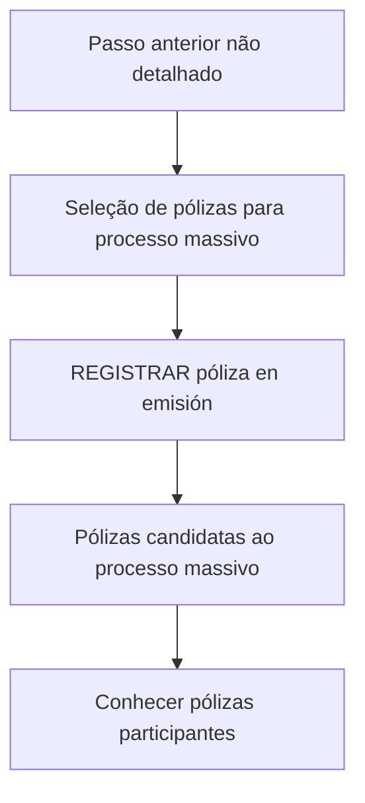

# Registro de Pólizas em Emissão — Vínculo com Visão Técnica

## 1. Metadados do Documento
- **Arquivo de Origem:** Não identificado
- **Tipo de Documento:** Procedimento / documentação de processo
- **Domínio / Sistema:** Reef; Mapfre
- **Público-Alvo:** Operação, negócio e equipes técnicas
- **Data/Versão Identificada:** Não identificada

---

## 2. Resumo Executivo & Contexto de Negócio

O documento descreve o processo **“REGISTRAR póliza en emisión”**, apresentado como um vínculo com a visão técnica do processo no contexto de documentação Reef.

A finalidade declarada é tomar as pólizas selecionadas para um processo massivo e convertê-las em candidatas para esse processo massivo. O resultado esperado é conhecer quais pólizas participarão do processo.

O documento informa que não existe uma ação adicional a ser executada nesta etapa. O registro de pólizas em emissão ocorre como consequência do passo anterior, que não é detalhado no conteúdo fornecido.

A fonte também apresenta referências de navegação e governança documental, incluindo Reef, Mapfredocument, o proprietário `user:agonzalez_mapfre.com` e o ciclo de vida `Approved`.

---

## 3. Arquitetura, Componentes & Tecnologias Envolvidas

Os elementos explicitamente citados são:

| Componente / Referência | Papel identificado |
| :--- | :--- |
| Reef | Contexto de documentação e navegação |
| Mapfredocument | Referência documental citada |
| REGISTRAR póliza en emisión | Processo de converter pólizas selecionadas em candidatas ao processo massivo |
| Processo massivo | Processo para o qual as pólizas selecionadas tornam-se candidatas |
| Visão técnica | Referência associada ao processo de registro |
| Zeus | Item disponível na navegação documental |
| Cloud | Item disponível na navegação documental |
| APIs | Item disponível na navegação documental |
| Componentes | Item disponível na navegação documental |



> **Nota de Análise:** O conteúdo não descreve arquitetura de software, integrações, APIs, protocolos, tecnologias de implementação, ambientes ou contratos técnicos. A menção a “visão técnica” não possui detalhamento adicional.

---

## 4. Regras de Negócio, Especificações Funcionais & Processos

1. O processo denominado **“REGISTRAR póliza en emisión”** utiliza pólizas previamente selecionadas.
2. As pólizas selecionadas são convertidas em candidatas para um processo massivo.
3. O objetivo funcional é identificar ou conhecer as pólizas que participariam do processo massivo.
4. Não é necessário executar nenhum passo adicional nessa etapa.
5. O registro ocorre como consequência do passo anterior.
6. O conteúdo não especifica:
   - critérios de seleção das pólizas;
   - regras de elegibilidade;
   - estados possíveis da póliza;
   - responsáveis pela execução;
   - métodos HTTP, APIs ou contratos JSON;
   - validações, exceções ou tratamento de erros;
   - cronograma, agendamento ou periodicidade do processo massivo.

> **Nota de Análise:** O documento lista o processo de registro de pólizas em emissão, porém não detalha o passo anterior nem os critérios técnicos ou funcionais usados para transformar uma póliza selecionada em candidata.

---

## 5. Tabelas de Parâmetros, Ambientes e Estruturas de Dados

| Item / Parâmetro | Descrição / Função | Tipo / Valores / Formato | Ambiente / Observações |
| :--- | :--- | :--- | :--- |
| Pólizas selecionadas | Pólizas tomadas para participação em processo massivo | Não especificado | Origem no passo anterior não detalhado |
| Pólizas candidatas | Resultado da conversão das pólizas selecionadas | Não especificado | Participariam do processo massivo |
| Processo massivo | Processo que recebe as pólizas candidatas | Não especificado | Sem detalhamento operacional |
| Owner | Proprietário registrado na documentação | `user:agonzalez_mapfre.com` | Metadado documental |
| Lifecycle | Estado do ciclo de vida do conteúdo | `Approved` | Metadado documental |
| Source | Campo de origem exibido | `VL` | Significado não detalhado |
| Idioma | Idioma selecionado na navegação | `ES` | Interface documental |

---

## 6. Bateria de Perguntas & Respostas para RAG (FAQ Sintético)

### P1: Em que consiste o processo “REGISTRAR póliza en emisión”?
**R:** O processo consiste em tomar as pólizas selecionadas para um processo massivo e convertê-las em candidatas para esse processo.

### P2: Qual é o objetivo do registro de pólizas em emissão?
**R:** O objetivo é conhecer quais pólizas participariam do processo massivo.

### P3: É necessário executar alguma etapa manual após registrar as pólizas em emissão?
**R:** Não. O documento informa que não é necessário seguir nenhum passo, pois essa etapa é consequência do passo anterior.

### P4: Qual etapa antecede o processo de registro de pólizas em emissão?
**R:** O documento menciona apenas que o registro é consequência do passo anterior, mas não identifica nem descreve essa etapa anterior.

### P5: O documento define critérios para selecionar pólizas?
**R:** Não. O conteúdo informa que existem pólizas selecionadas, mas não apresenta critérios, regras de elegibilidade ou mecanismos de seleção.

### P6: O processo descreve APIs ou métodos HTTP para registrar pólizas?
**R:** Não. Apesar de a navegação documental incluir a categoria “APIs”, o conteúdo fornecido não detalha endpoints, métodos HTTP ou contratos JSON.

### P7: Qual sistema ou contexto documental é associado ao processo?
**R:** O processo é apresentado no contexto de documentação Reef, com referências também a Mapfredocument.

### P8: Quem é o proprietário identificado na documentação?
**R:** O proprietário indicado no conteúdo é `user:agonzalez_mapfre.com`.

### P9: Qual é o ciclo de vida indicado para a documentação?
**R:** O ciclo de vida exibido é `Approved`.

### P10: O documento informa em qual ambiente o processo deve ser executado?
**R:** Não. Não há indicação de ambiente, servidor, URL, porta, credencial ou configuração de implantação.

---

## 7. Glossário de Termos, Siglas & Conceitos-Chave

- **Reef:** Contexto de documentação citado no conteúdo.
- **Mapfredocument:** Referência documental citada no conteúdo.
- **Póliza:** Entidade selecionada que é convertida em candidata ao processo massivo; o documento não fornece definição adicional.
- **Processo massivo:** Processo para o qual as pólizas selecionadas são convertidas em candidatas.
- **Owner:** Campo que identifica o proprietário da documentação.
- **Lifecycle:** Campo que identifica o estado do ciclo de vida da documentação.
- **Approved:** Valor de ciclo de vida exibido para o documento.
- **VL:** Valor exibido no campo de origem; significado não detalhado.
- **ES:** Indicador de idioma exibido na navegação, correspondente ao espanhol.

---

## 8. Notas Críticas, Riscos & Limitações

- O documento não identifica o arquivo de origem, data, versão ou autor formal.
- O passo anterior, do qual o registro é consequência, não é descrito.
- Não há critérios de seleção, regras de validação, exceções ou controles de processamento.
- Não há detalhamento técnico de serviços, APIs, métodos HTTP, contratos, tecnologias, logs, bancos de dados ou infraestrutura.
- Não são apresentados ambientes, URLs, servidores, portas ou credenciais.
- O significado do valor `VL` não é explicado.
- Não há informações sobre falhas, reprocessamento, auditoria, segurança ou responsáveis operacionais.

---

## 9. Conteúdo Bruto Estruturado (Referência Fiel)

```text
--- [PÁGINA 1 DE 1] ---

REGISTRAR póliza en emisión (enlace con visión técnica)
¿En que consiste?
Tomar las pólizas seleccionadas para un proceso masivo y convertirlas en candidatas para este proceso.
Objetivo
Conocer aquellas pólizas que participarían en el proceso masivo.
Proceso a seguir
No es necesario seguir paso alguno, ya que es consecuencia del paso anterior.
Documentation / DOCUMENTACIÓN Reef
DOCUMENTACIÓN Reef
Mapfredocument
DOCUMENTACIÓN Reef
Owner
user:agonzalez_mapfre.com
Lifecycle
Approved Source
 / 
 VL
Buscar Inicio Soluciones Arquitecturas APIs Componentes Cloud Documentación Zeus Reef Ayuda
ES
```
